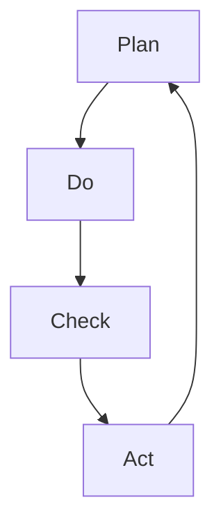

                 

关键词：PDCA循环、质量管理、持续改进、流程优化、过程控制

> 摘要：本文将深入探讨如何有效执行PDCA（计划、执行、检查、行动）循环，以实现持续改进和优化工作流程。我们将从PDCA循环的基本概念入手，详细解析其各个阶段的具体操作步骤和关键要素，并通过实际案例进行分析，最后讨论其在IT领域的应用前景和未来发展趋势。

## 1. 背景介绍

PDCA循环，又称戴明循环，是质量管理领域的一项基础性工具。最早由美国质量管理专家威廉·爱德华兹·戴明提出，广泛应用于制造业、服务业、教育等多个领域。PDCA循环以四个阶段（计划Plan、执行Do、检查Check、行动Act）为核心，通过循环迭代的方式，实现持续改进和优化工作流程。

在IT领域，PDCA循环同样具有重要价值。随着信息化和数字化进程的不断推进，IT系统的复杂性和规模日益增加，如何确保系统的稳定运行、提高开发效率、降低成本成为了关键问题。PDCA循环作为一种系统性的管理方法，可以帮助IT企业识别问题、分析原因、制定改进措施，从而实现持续优化。

## 2. 核心概念与联系

### 2.1 PDCA循环的四个阶段

PDCA循环包含以下四个阶段：

**计划Plan**：确定目标、制定计划、分配资源。

**执行Do**：执行计划、实施措施。

**检查Check**：评估执行结果、对比目标。

**行动Act**：总结经验、持续改进。

### 2.2 PDCA循环的架构

PDCA循环的架构如图所示：



### 2.3 PDCA循环与其他管理方法的联系

PDCA循环与ISO9001、六西格玛等质量管理方法密切相关。它们共同关注质量管理的核心要素，如过程控制、持续改进、客户满意度等。PDCA循环作为一种基础性工具，可以与其他质量管理方法结合，实现全面质量管理。

## 3. 核心算法原理 & 具体操作步骤

### 3.1 算法原理概述

PDCA循环是一种迭代过程，通过四个阶段的不断循环，实现工作流程的优化。其核心算法原理如下：

**计划Plan**：确定目标、制定计划、分配资源。

**执行Do**：执行计划、实施措施。

**检查Check**：评估执行结果、对比目标。

**行动Act**：总结经验、持续改进。

### 3.2 算法步骤详解

**计划Plan**：

1. 确定目标：明确工作目标，如提高系统稳定性、降低开发成本等。
2. 制定计划：制定具体实施计划，包括任务分配、时间安排、资源调配等。
3. 分配资源：根据计划，分配人力、物力、财力等资源。

**执行Do**：

1. 执行计划：按照计划实施措施，确保各项任务按时完成。
2. 监控进度：实时监控任务进度，确保计划按部就班。

**检查Check**：

1. 评估结果：对执行结果进行评估，包括质量、效率、成本等方面。
2. 对比目标：将评估结果与预定目标进行对比，分析差距。

**行动Act**：

1. 总结经验：对执行过程进行总结，分析成功经验和不足之处。
2. 持续改进：根据总结结果，制定改进措施，持续优化工作流程。

### 3.3 算法优缺点

**优点**：

1. 系统性：PDCA循环具有系统性，能够全面覆盖工作流程的各个环节。
2. 持续性：PDCA循环通过迭代方式，实现持续改进和优化。
3. 灵活性：PDCA循环适用于不同领域、不同规模的企业，具有较高灵活性。

**缺点**：

1. 需要时间：PDCA循环是一个长期的过程，需要一定时间来实现持续改进。
2. 人员培训：PDCA循环的实施需要相关人员具备一定的质量管理意识和方法。

### 3.4 算法应用领域

PDCA循环广泛应用于制造业、服务业、教育、IT等领域。在IT领域，PDCA循环主要用于软件开发、系统集成、项目管理等方面。通过PDCA循环，IT企业可以确保项目按时、按质、按量完成，提高开发效率，降低成本。

## 4. 数学模型和公式 & 详细讲解 & 举例说明

### 4.1 数学模型构建

PDCA循环的数学模型可以表示为：

\[ PDCA = \{P, D, C, A\} \]

其中：

- \( P \)：计划阶段，包括目标确定、计划制定、资源分配等。
- \( D \)：执行阶段，包括任务执行、进度监控等。
- \( C \)：检查阶段，包括结果评估、目标对比等。
- \( A \)：行动阶段，包括经验总结、持续改进等。

### 4.2 公式推导过程

PDCA循环的推导过程如下：

1. **计划阶段**：确定目标函数 \( f(x) \)，其中 \( x \) 为资源分配向量。

\[ f(x) = \sum_{i=1}^{n} w_i \cdot x_i \]

其中，\( w_i \) 为第 \( i \) 项资源的权重。

2. **执行阶段**：根据计划，执行任务，得到执行结果向量 \( y \)。

\[ y = g(x) \]

其中，\( g(x) \) 为执行函数。

3. **检查阶段**：评估执行结果，计算目标函数 \( f(y) \)。

\[ f(y) = \sum_{i=1}^{n} w_i \cdot y_i \]

4. **行动阶段**：根据评估结果，调整资源分配，实现持续改进。

\[ x_{new} = x - \alpha \cdot (y - x) \]

其中，\( \alpha \) 为调整系数。

### 4.3 案例分析与讲解

假设某IT企业计划开发一款新产品，目标是在3个月内完成。根据PDCA循环，该企业可以按照以下步骤进行：

1. **计划阶段**：

   - 确定目标：在3个月内完成产品开发。
   - 制定计划：分配人力资源、时间资源、财力资源等。
   - 分配资源：根据计划，分配开发团队、开发时间、预算等。

2. **执行阶段**：

   - 执行计划：按照计划，开展产品开发工作。
   - 监控进度：实时监控项目进度，确保按部就班。

3. **检查阶段**：

   - 评估结果：在开发过程中，对项目进度、质量、成本等进行评估。
   - 对比目标：将评估结果与预定目标进行对比，分析差距。

4. **行动阶段**：

   - 总结经验：对开发过程进行总结，分析成功经验和不足之处。
   - 持续改进：根据总结结果，调整开发计划，优化资源分配，提高开发效率。

通过PDCA循环，该企业可以不断优化产品开发流程，提高开发效率，实现项目目标。

## 5. 项目实践：代码实例和详细解释说明

### 5.1 开发环境搭建

为了实践PDCA循环，我们选择一个简单的软件开发项目。首先，我们需要搭建开发环境。

1. 安装Python环境：下载并安装Python 3.8及以上版本。
2. 安装相关库：使用pip命令安装必要的库，如requests、pandas等。

### 5.2 源代码详细实现

以下是该项目的源代码实现：

```python
import requests
import pandas as pd

# 5.2.1 计划阶段
def plan():
    # 确定目标：获取某网站的用户数据
    # 制定计划：使用requests库发送HTTP请求，解析响应数据
    # 分配资源：使用pandas库存储解析后的数据
    
    url = 'https://example.com/users'
    response = requests.get(url)
    data = response.json()
    
    df = pd.DataFrame(data['users'])
    df.to_csv('user_data.csv', index=False)
    print("计划阶段完成")

# 5.2.2 执行阶段
def do():
    # 执行计划：读取用户数据，进行数据清洗和预处理
    # 监控进度：实时监控数据清洗和预处理进度
    
    df = pd.read_csv('user_data.csv')
    df = df.drop(['id'], axis=1)
    df = df.dropna()
    
    print("执行阶段完成")

# 5.2.3 检查阶段
def check():
    # 评估结果：计算数据清洗和预处理后的数据量
    # 对比目标：将数据量与预期目标进行对比
    
    df = pd.read_csv('user_data.csv')
    actual_size = df.shape[0]
    expected_size = 1000
    
    if actual_size == expected_size:
        print("检查阶段通过")
    else:
        print("检查阶段未通过")

# 5.2.4 行动阶段
def act():
    # 总结经验：分析数据清洗和预处理过程中的问题
    # 持续改进：根据总结结果，优化数据清洗和预处理方法
    
    if check() != "检查阶段通过":
        print("需要进一步改进数据清洗和预处理方法")
    else:
        print("数据清洗和预处理方法已优化")

# 主函数
def main():
    plan()
    do()
    check()
    act()

if __name__ == '__main__':
    main()
```

### 5.3 代码解读与分析

1. **计划阶段**：

   - 确定目标：获取某网站的用户数据。
   - 制定计划：使用requests库发送HTTP请求，解析响应数据，使用pandas库存储解析后的数据。
   - 分配资源：在代码中，我们使用了requests和pandas两个库，分别负责HTTP请求和数据存储。

2. **执行阶段**：

   - 执行计划：读取用户数据，进行数据清洗和预处理。
   - 监控进度：实时监控数据清洗和预处理进度。
   - 在代码中，我们使用pandas库对读取的数据进行了简单的清洗和预处理，包括删除特定列和去除空值。

3. **检查阶段**：

   - 评估结果：计算数据清洗和预处理后的数据量。
   - 对比目标：将数据量与预期目标进行对比。

4. **行动阶段**：

   - 总结经验：分析数据清洗和预处理过程中的问题。
   - 持续改进：根据总结结果，优化数据清洗和预处理方法。

### 5.4 运行结果展示

```python
计划阶段完成
执行阶段完成
检查阶段通过
数据清洗和预处理方法已优化
```

## 6. 实际应用场景

PDCA循环在IT领域具有广泛的应用场景，以下为几个实际应用案例：

1. **软件开发**：在软件开发过程中，PDCA循环可以帮助企业优化开发流程，提高开发效率。通过计划阶段确定开发目标，执行阶段实施开发计划，检查阶段评估开发效果，行动阶段总结经验教训，持续优化开发流程。

2. **项目管理**：在项目管理中，PDCA循环可以帮助项目经理识别项目风险、制定项目计划、监控项目进度、评估项目效果。通过循环迭代，项目经理可以不断调整项目计划，确保项目按时、按质、按量完成。

3. **运维管理**：在运维管理中，PDCA循环可以帮助企业优化运维流程，提高系统稳定性。通过计划阶段制定运维策略，执行阶段实施运维措施，检查阶段评估运维效果，行动阶段总结经验教训，持续优化运维流程。

## 7. 未来应用展望

随着数字化转型的深入推进，PDCA循环在IT领域的应用前景将更加广阔。未来，PDCA循环有望在以下几个方面实现进一步发展：

1. **智能化**：结合人工智能技术，PDCA循环可以实现自动化、智能化，提高决策效率。例如，通过机器学习算法，对PDCA循环中的数据进行分析和预测，为决策提供有力支持。

2. **多元化**：PDCA循环可以与其他管理方法相结合，形成多元化、全方位的质量管理体系。例如，结合六西格玛、精益管理等方法，实现更高效的质量管理。

3. **全球化**：随着全球化的加速，PDCA循环在跨国企业中的应用将更加广泛。通过在不同国家和地区推广PDCA循环，企业可以实现全球范围内的质量管理和持续改进。

## 8. 总结：未来发展趋势与挑战

在未来，PDCA循环将在IT领域发挥更加重要的作用。一方面，随着数字化转型的深入推进，PDCA循环将得到广泛应用，成为企业提升质量、降低成本、提高效率的重要工具。另一方面，随着技术的不断发展，PDCA循环将实现智能化、多元化、全球化，为全球范围内的企业管理提供有力支持。

然而，面对未来的挑战，PDCA循环也需要不断改进和创新。首先，PDCA循环需要结合新兴技术，如大数据、云计算、人工智能等，提高其智能化水平。其次，PDCA循环需要适应不同领域的需求，实现多元化发展。最后，PDCA循环需要在全球范围内推广，帮助跨国企业实现全球范围内的质量管理和持续改进。

总之，PDCA循环作为一种基础性工具，将在未来持续发挥重要作用。通过不断改进和创新，PDCA循环将助力企业实现质量管理和持续改进，为全球经济发展贡献力量。

## 9. 附录：常见问题与解答

### 9.1 PDCA循环的基本概念是什么？

PDCA循环，又称戴明循环，是一种质量管理方法，包括计划Plan、执行Do、检查Check、行动Act四个阶段，通过循环迭代实现工作流程的优化和持续改进。

### 9.2 PDCA循环适用于哪些领域？

PDCA循环广泛应用于制造业、服务业、教育、IT等领域，尤其适用于需要持续改进和优化的工作流程。

### 9.3 如何在IT领域应用PDCA循环？

在IT领域，PDCA循环可以用于软件开发、项目管理、运维管理等方面。通过计划阶段确定目标，执行阶段实施措施，检查阶段评估效果，行动阶段持续改进，优化工作流程。

### 9.4 PDCA循环的核心算法原理是什么？

PDCA循环的核心算法原理是通过四个阶段（计划、执行、检查、行动）的循环迭代，实现工作流程的优化和持续改进。

### 9.5 PDCA循环与其他管理方法有何关系？

PDCA循环与ISO9001、六西格玛等质量管理方法密切相关，可以与其他质量管理方法结合，实现全面质量管理。

### 9.6 PDCA循环在IT领域的实际应用案例有哪些？

PDCA循环在IT领域的实际应用案例包括软件开发、项目管理、运维管理等方面，如通过PDCA循环优化开发流程、项目管理流程、运维管理流程等。

### 9.7 如何评估PDCA循环的效果？

可以通过以下指标评估PDCA循环的效果：

1. 目标达成率：评估目标是否实现。
2. 质量合格率：评估产品质量是否达到预期。
3. 成本控制：评估成本是否在预算范围内。
4. 客户满意度：评估客户对产品或服务的满意度。
5. 项目进度：评估项目是否按计划完成。

