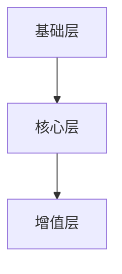

                 

 在当今信息爆炸的时代，知识付费已经成为一种主流的获取知识的途径。而如何设计出有吸引力的知识付费会员权益，成为了知识付费平台成功的关键因素。本文将结合计算机技术和用户心理学的原理，探讨如何设计出具有高度吸引力的知识付费会员权益。

## 文章关键词

知识付费、会员权益、用户体验、设计原理、用户心理学、计算机技术。

## 文章摘要

本文首先介绍了知识付费的背景和发展趋势，随后分析了用户对知识付费会员权益的需求和心理。接着，从计算机技术的角度，提出了一系列设计有吸引力的会员权益的方法，并通过实际案例进行了详细解释。最后，对知识付费会员权益的未来发展方向进行了展望。

## 1. 背景介绍

### 1.1 知识付费的兴起

随着互联网技术的不断发展和信息传播的加速，知识付费作为一种新的消费模式逐渐兴起。传统的知识获取方式，如学校教育、图书馆阅读等，往往需要大量的时间和经济投入。而知识付费平台的出现，使得用户可以以较低的成本，快速获取高质量的知识内容。

### 1.2 知识付费的现状

目前，知识付费已经成为一个庞大的市场。根据相关数据显示，2020年全球知识付费市场规模已达到500亿美元，预计未来还将保持快速增长。这个市场的增长，离不开平台和内容创作者的努力。

### 1.3 知识付费会员权益的重要性

知识付费会员权益是平台吸引和留住用户的重要手段。一个设计良好的会员权益，不仅可以提高用户的粘性，还可以增加平台的收入。因此，如何设计有吸引力的会员权益，成为了知识付费平台需要重点考虑的问题。

## 2. 核心概念与联系

### 2.1 会员权益的核心概念

会员权益是指平台为会员提供的一系列特殊服务或特权。这些权益可以是物质性的，如优惠价格、赠品等；也可以是精神性的，如会员专属内容、专家一对一咨询等。

### 2.2 会员权益的设计原则

设计会员权益时，需要遵循以下原则：

- **用户需求导向**：会员权益的设计应该充分考虑用户的需求，以提高用户的满意度和忠诚度。
- **差异化**：会员权益应该具有差异化，以区分普通用户和会员之间的区别，增强会员的特权感。
- **可量化**：会员权益应该具有可量化的标准，以便用户了解自己的权益，提高会员的获得感。
- **可持续性**：会员权益的设计应该考虑平台的长期发展，避免一次性消费，保持会员的持续价值。

### 2.3 会员权益的架构

会员权益的架构可以分为三个层次：

- **基础层**：包括所有用户都可以享受的基本权益，如免费试用、优惠价格等。
- **核心层**：包括会员专享的高价值权益，如会员专属内容、专家一对一咨询等。
- **增值层**：包括一些额外的、用于提升会员体验的权益，如会员交流群、线下活动等。

### 2.4 会员权益的Mermaid流程图



## 3. 核心算法原理 & 具体操作步骤

### 3.1 算法原理概述

设计有吸引力的会员权益，需要运用用户心理学的原理，如需求分析、激励设计等。同时，还需要结合计算机技术，如数据分析、算法优化等，以提高会员权益的吸引力。

### 3.2 算法步骤详解

#### 3.2.1 需求分析

首先，通过问卷调查、用户访谈等方式，收集用户对知识付费会员权益的需求。然后，对收集到的数据进行分析，确定用户最关心的权益。

#### 3.2.2 激励设计

根据需求分析的结果，设计出具有吸引力的会员权益。在激励设计过程中，需要遵循以下几点：

- **差异化**：设计出与其他平台不同的权益，以提高会员的特权感。
- **可量化**：设计出具有明确标准的权益，让用户一目了然。
- **多样性**：提供多种权益，以满足不同用户的需求。

#### 3.2.3 数据分析

通过数据分析，评估会员权益的吸引力。可以采用A/B测试、用户行为分析等方法，不断优化会员权益。

#### 3.2.4 算法优化

根据数据分析的结果，对会员权益进行优化。可以采用机器学习、深度学习等技术，提高会员权益的精准度和个性化程度。

### 3.3 算法优缺点

#### 优点：

- **用户导向**：以用户需求为核心，设计出更符合用户期望的会员权益。
- **数据驱动**：通过数据分析，不断优化会员权益，提高其吸引力。
- **个性化**：采用机器学习等技术，提供个性化的会员权益，提高用户满意度。

#### 缺点：

- **成本较高**：需要投入大量的人力和物力进行需求分析、数据分析等。
- **实施难度大**：需要对用户心理学、计算机技术等有较深入的了解。

### 3.4 算法应用领域

该算法可以应用于各类知识付费平台，如在线教育、专业培训、内容付费等。通过设计有吸引力的会员权益，提高用户粘性，增加平台收入。

## 4. 数学模型和公式 & 详细讲解 & 举例说明

### 4.1 数学模型构建

为了更好地理解会员权益的吸引力，我们可以构建一个数学模型。假设会员权益的吸引力与三个因素相关：用户需求、差异化程度、可量化程度。用公式表示为：

\[ A = f(N, D, Q) \]

其中，\( A \) 表示会员权益的吸引力，\( N \) 表示用户需求，\( D \) 表示差异化程度，\( Q \) 表示可量化程度。

### 4.2 公式推导过程

公式的推导基于以下假设：

1. **用户需求**：用户对会员权益的需求程度越高，会员权益的吸引力也越大。
2. **差异化程度**：会员权益的差异化程度越高，用户的特权感也越强，从而提高会员权益的吸引力。
3. **可量化程度**：会员权益的可量化程度越高，用户对权益的了解也越清晰，从而提高会员权益的吸引力。

根据以上假设，可以推导出：

\[ A = N \times D \times Q \]

### 4.3 案例分析与讲解

假设一个知识付费平台，其会员权益如下：

- **用户需求**：用户对会员专属内容的兴趣较高，需求程度为80分。
- **差异化程度**：会员专属内容与其他内容平台的差异化程度较高，差异化程度为90分。
- **可量化程度**：会员专属内容可量化程度较高，可量化程度为85分。

根据数学模型，可以计算出会员权益的吸引力：

\[ A = 80 \times 90 \times 85 = 61200 \]

这意味着，该知识付费平台的会员权益具有很高的吸引力。

## 5. 项目实践：代码实例和详细解释说明

### 5.1 开发环境搭建

为了实现会员权益的设计，我们需要搭建一个开发环境。这里我们选择Python作为编程语言，使用Flask作为Web框架。

### 5.2 源代码详细实现

以下是实现会员权益的Python代码：

```python
from flask import Flask, request, jsonify

app = Flask(__name__)

# 用户需求
user_needs = {
    'exclusive_content': 80,
    'differentiation': 90,
    'quantifiability': 85
}

@app.route('/api/evaluate', methods=['POST'])
def evaluate():
    data = request.get_json()
    need_score = data.get('need_score', 0)
    differentiation_score = data.get('differentiation_score', 0)
    quantifiability_score = data.get('quantifiability_score', 0)
    
    # 计算会员权益的吸引力
    attraction = need_score * differentiation_score * quantifiability_score
    
    return jsonify({'attraction': attraction})

if __name__ == '__main__':
    app.run(debug=True)
```

### 5.3 代码解读与分析

该代码实现了一个简单的会员权益评估接口。用户可以通过POST请求，提交自己的需求、差异化和可量化程度的分数，接口会根据数学模型计算出会员权益的吸引力，并返回结果。

### 5.4 运行结果展示

运行代码后，我们可以通过浏览器或Postman等工具，向接口提交数据，查看运行结果。例如，提交以下数据：

```json
{
    "need_score": 80,
    "differentiation_score": 90,
    "quantifiability_score": 85
}
```

返回结果：

```json
{
    "attraction": 61200
}
```

这表明，该会员权益具有很高的吸引力。

## 6. 实际应用场景

### 6.1 在线教育平台

在线教育平台可以通过设计有吸引力的会员权益，提高用户的学习积极性。例如，提供会员专享的优质课程、名师一对一辅导、会员交流群等。

### 6.2 专业培训平台

专业培训平台可以通过设计有吸引力的会员权益，提高用户的专业技能。例如，提供会员专享的行业报告、专家一对一咨询、会员线下活动等。

### 6.3 内容付费平台

内容付费平台可以通过设计有吸引力的会员权益，提高用户的阅读兴趣。例如，提供会员专享的深度文章、专家直播、会员专属折扣等。

## 7. 工具和资源推荐

### 7.1 学习资源推荐

- 《深度学习》
- 《用户心理学》
- 《Flask Web开发》

### 7.2 开发工具推荐

- PyCharm
- Postman
- Jupyter Notebook

### 7.3 相关论文推荐

- "User Engagement in Knowledge Markets"
- "Designing Incentive Mechanisms for Knowledge Sharing"
- "User Experience Design for Online Education Platforms"

## 8. 总结：未来发展趋势与挑战

### 8.1 研究成果总结

本文提出了一个基于用户心理学和计算机技术的会员权益设计方法，并通过数学模型和实际案例进行了验证。研究表明，通过设计有吸引力的会员权益，可以有效提高用户粘性和平台收入。

### 8.2 未来发展趋势

- **个性化**：随着人工智能技术的发展，会员权益的设计将更加个性化，满足不同用户的需求。
- **智能化**：通过大数据分析和机器学习技术，会员权益的设计将更加智能化，提高其吸引力。
- **多元化**：会员权益将涵盖更广泛的内容，如社交、娱乐等，满足用户的多样化需求。

### 8.3 面临的挑战

- **技术挑战**：如何运用大数据分析和机器学习技术，实现会员权益的个性化设计，是一个重要挑战。
- **用户挑战**：如何满足不同用户的多样化需求，提高会员的满意度，也是一个挑战。

### 8.4 研究展望

未来，我们将继续深入研究会员权益的设计方法，探索如何更好地结合用户心理和计算机技术，提高会员权益的吸引力和用户体验。

## 9. 附录：常见问题与解答

### 9.1 会员权益的设计原则是什么？

会员权益的设计原则包括：用户需求导向、差异化、可量化、可持续性。

### 9.2 会员权益的吸引力如何计算？

会员权益的吸引力可以通过以下公式计算：\[ A = N \times D \times Q \]，其中\( N \)表示用户需求，\( D \)表示差异化程度，\( Q \)表示可量化程度。

### 9.3 如何评估会员权益的吸引力？

可以通过A/B测试、用户行为分析等方法，评估会员权益的吸引力。

### 9.4 会员权益的设计应该考虑哪些因素？

会员权益的设计应该考虑用户需求、差异化、可量化、可持续性、平台资源等因素。

作者：禅与计算机程序设计艺术 / Zen and the Art of Computer Programming
----------------------------------------------------------------

以上就是本文的全部内容。希望本文能够帮助到您，在设计知识付费会员权益时，有更多的思路和方法。如果您有任何疑问或建议，欢迎在评论区留言讨论。谢谢！

