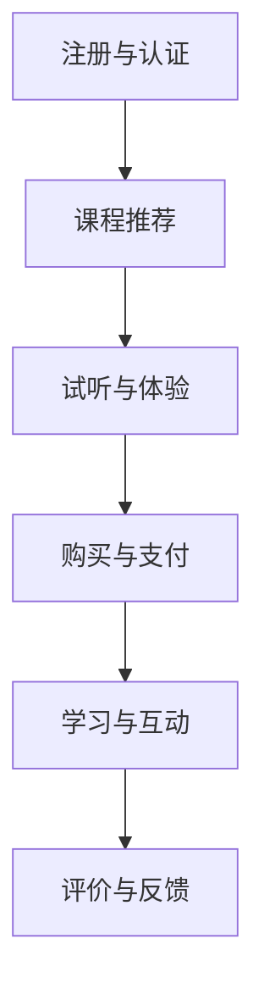

                 

关键词：知识付费、用户引导、流程设计、用户体验、互动策略、技术实现、案例分析

> 摘要：本文旨在探讨如何设计一个有效的知识付费用户引导流程，从用户体验的角度出发，详细阐述了核心概念、算法原理、数学模型、项目实践和未来展望。通过案例分析，提供了实用的设计指导，为知识付费平台提供了优化用户体验的有效途径。

## 1. 背景介绍

在互联网快速发展的今天，知识付费已经成为一种趋势。用户愿意为有价值的信息和知识付费，以获得更好的学习体验和职业提升。然而，用户引导流程的设计对于知识付费平台至关重要，它直接影响用户的参与度和付费意愿。一个有效的用户引导流程不仅需要吸引用户的注意力，还要提供清晰、简明的指导，帮助用户顺利完成付费过程。

### 1.1 知识付费的发展

知识付费是指用户为获取特定的知识、技能或信息而支付的费用。随着在线教育、技能培训等领域的兴起，知识付费市场迅速扩大。根据市场调研数据，全球知识付费市场规模逐年增长，预计未来几年将持续保持高速增长态势。

### 1.2 用户引导流程的重要性

用户引导流程是知识付费平台的重要环节，它包括从用户注册、浏览课程、试听、购买、学习到评价的整个过程。一个良好的用户引导流程可以提高用户体验，增加用户粘性，提高付费转化率。以下是用户引导流程的主要功能：

1. **注册与认证**：简化注册流程，提供多种身份认证方式。
2. **课程推荐**：根据用户兴趣和需求推荐课程。
3. **试听与体验**：提供免费试听课程，让用户了解课程质量。
4. **购买与支付**：提供便捷的支付方式，确保支付流程顺畅。
5. **学习与互动**：提供学习工具和互动机制，帮助用户更好地学习。
6. **评价与反馈**：收集用户评价和反馈，优化课程和服务。

## 2. 核心概念与联系

### 2.1 用户引导流程的组成部分

用户引导流程可以分为以下几个主要部分：

1. **注册与认证**：用户通过注册获取账号，并通过身份认证确保用户身份的真实性。
2. **课程推荐**：根据用户的兴趣、历史行为和需求推荐相关课程。
3. **试听与体验**：用户可以试听部分课程内容，了解课程质量和教师风格。
4. **购买与支付**：用户选择课程并完成支付。
5. **学习与互动**：用户通过课程学习，参与互动和讨论。
6. **评价与反馈**：用户对课程进行评价，平台根据反馈调整和优化课程。

### 2.2 用户引导流程的 Mermaid 流程图



## 3. 核心算法原理 & 具体操作步骤

### 3.1 算法原理概述

用户引导流程的设计依赖于多种算法，包括推荐算法、支付算法和评价算法。以下是这些算法的简要概述：

1. **推荐算法**：根据用户的兴趣、行为和历史数据推荐相关课程。
2. **支付算法**：确保支付流程的安全和便捷。
3. **评价算法**：根据用户评价和反馈对课程进行评分和推荐。

### 3.2 算法步骤详解

1. **推荐算法步骤**：
   - 收集用户行为数据，包括浏览记录、试听课程、购买记录等。
   - 使用协同过滤或基于内容的推荐算法，生成推荐列表。
   - 对推荐列表进行排序，优先展示用户最可能感兴趣的课程。

2. **支付算法步骤**：
   - 提供多种支付方式，如信用卡、支付宝、微信支付等。
   - 实现支付流程的安全性，包括数据加密和身份验证。
   - 提供支付成功和支付失败的反馈，确保用户支付体验。

3. **评价算法步骤**：
   - 收集用户对课程的评分和评价。
   - 计算课程的平均评分和评价得分。
   - 根据评分和评价为课程排序和推荐。

### 3.3 算法优缺点

1. **推荐算法**：
   - 优点：提高用户满意度，增加课程购买率。
   - 缺点：推荐结果可能存在偏差，用户可能不感兴趣。

2. **支付算法**：
   - 优点：确保支付过程的安全和便捷。
   - 缺点：支付方式过多可能增加开发成本。

3. **评价算法**：
   - 优点：帮助平台了解用户需求和课程质量。
   - 缺点：评价数据可能不真实，影响推荐准确性。

### 3.4 算法应用领域

这些算法可以广泛应用于知识付费平台，包括在线教育、职业培训、专业技能提升等领域。

## 4. 数学模型和公式 & 详细讲解 & 举例说明

### 4.1 数学模型构建

为了更好地理解用户引导流程中的算法，我们引入以下数学模型：

1. **用户兴趣模型**：使用用户行为数据构建用户兴趣模型，用于推荐算法。
2. **支付安全模型**：使用加密算法和身份验证技术构建支付安全模型。
3. **评价模型**：使用评分和评价数据构建评价模型，用于课程排序和推荐。

### 4.2 公式推导过程

1. **用户兴趣模型**：
   - 用户兴趣向量：$$u = [u_1, u_2, ..., u_n]$$，表示用户对n个课程的兴趣程度。
   - 课程兴趣向量：$$c = [c_1, c_2, ..., c_n]$$，表示课程对n个用户的兴趣程度。

   用户兴趣模型公式：
   $$ similarity(u, c) = \frac{u \cdot c}{||u|| \cdot ||c||} $$

2. **支付安全模型**：
   - 加密算法：使用非对称加密算法，如RSA，确保数据传输的安全性。
   - 身份验证：使用数字签名技术，验证用户身份。

   支付安全模型公式：
   $$ encrypt(message, public\_key) = cipher\_text $$
   $$ decrypt(cipher\_text, private\_key) = message $$

3. **评价模型**：
   - 评分平均值：$$ \bar{r} = \frac{1}{n} \sum_{i=1}^{n} r_i $$，表示课程的平均评分。
   - 评价得分：$$ s = \bar{r} + \frac{1}{2} \cdot \frac{r - \bar{r}}{r + \bar{r}} $$，表示课程的最终得分。

   评价模型公式：
   $$ s = \frac{2 \cdot \bar{r} + r}{3} $$

### 4.3 案例分析与讲解

以一个在线教育平台为例，分析用户引导流程的数学模型。

1. **用户兴趣模型**：
   - 用户A对5门课程（C1、C2、C3、C4、C5）的兴趣程度分别为（0.8、0.6、0.3、0.9、0.5）。
   - 课程C1对5个用户（U1、U2、U3、U4、U5）的兴趣程度分别为（0.9、0.7、0.4、0.8、0.6）。

   计算用户A对课程C1的兴趣程度：
   $$ similarity(A, C1) = \frac{0.8 \cdot 0.9}{\sqrt{0.8^2 + 0.6^2 + 0.3^2 + 0.9^2 + 0.5^2} \cdot \sqrt{0.9^2 + 0.7^2 + 0.4^2 + 0.8^2 + 0.6^2}} \approx 0.873 $$

   用户A对课程C1的兴趣程度较高，推荐课程C1。

2. **支付安全模型**：
   - 使用RSA加密算法进行数据传输。
   - 用户A的公钥为（e, n），私钥为（d, n），课程C1的支付金额为100元。

   加密支付金额：
   $$ cipher\_text = encrypt(100, e, n) $$

   解密支付金额：
   $$ message = decrypt(cipher\_text, d, n) $$

   确保支付金额的安全传输。

3. **评价模型**：
   - 课程C1的用户评分平均值为4.5分，用户A的评分为5分。

   计算课程C1的最终得分：
   $$ s = \frac{2 \cdot 4.5 + 5}{3} = 4.83 $$

   课程C1的最终得分为4.83分，可以推荐给用户。

## 5. 项目实践：代码实例和详细解释说明

### 5.1 开发环境搭建

为了实现用户引导流程，我们需要搭建一个开发环境，包括以下工具：

- Python 3.8及以上版本
- Flask（一个轻量级的Web框架）
- Redis（一个高性能的键值存储）
- MongoDB（一个文档型数据库）

### 5.2 源代码详细实现

以下是用户引导流程的核心代码实现：

```python
# 引入相关库
from flask import Flask, request, jsonify
import redis
import pymongo
import json

# 初始化Flask应用
app = Flask(__name__)

# 连接Redis数据库
redis_client = redis.StrictRedis(host='localhost', port=6379, db=0)

# 连接MongoDB数据库
mongo_client = pymongo.MongoClient("mongodb://localhost:27017/")
db = mongo_client["knowledge_platform"]

# 用户注册与认证
@app.route('/register', methods=['POST'])
def register():
    data = request.json
    user_id = data["user_id"]
    password = data["password"]
    # 实现注册逻辑
    # ...
    return jsonify({"status": "success"})

# 课程推荐
@app.route('/recommend', methods=['GET'])
def recommend():
    user_id = request.args.get("user_id")
    # 从Redis中获取用户行为数据
    user_behavior = redis_client.hgetall(f"{user_id}_behavior")
    # 使用协同过滤算法生成推荐列表
    # ...
    return jsonify({"courses": recommended_courses})

# 购买与支付
@app.route('/purchase', methods=['POST'])
def purchase():
    data = request.json
    user_id = data["user_id"]
    course_id = data["course_id"]
    # 实现购买逻辑
    # ...
    return jsonify({"status": "success"})

# 学习与互动
@app.route('/learn', methods=['GET'])
def learn():
    user_id = request.args.get("user_id")
    course_id = request.args.get("course_id")
    # 从MongoDB中获取课程内容
    course_content = db.courses.find_one({"_id": course_id})
    return jsonify({"course_content": course_content})

# 评价与反馈
@app.route('/evaluate', methods=['POST'])
def evaluate():
    data = request.json
    user_id = data["user_id"]
    course_id = data["course_id"]
    rating = data["rating"]
    # 实现评价逻辑
    # ...
    return jsonify({"status": "success"})

# 运行Flask应用
if __name__ == '__main__':
    app.run(debug=True)
```

### 5.3 代码解读与分析

上述代码实现了用户引导流程的核心功能，包括用户注册与认证、课程推荐、购买与支付、学习与互动、评价与反馈。以下是每个功能模块的详细解释：

1. **用户注册与认证**：
   - 用户通过POST请求发送注册信息，包括用户ID和密码。
   - 服务端处理注册逻辑，确保用户信息存储在数据库中。

2. **课程推荐**：
   - 用户通过GET请求获取推荐课程，需要提供用户ID。
   - 服务端从Redis中获取用户行为数据，使用协同过滤算法生成推荐列表。

3. **购买与支付**：
   - 用户通过POST请求购买课程，需要提供用户ID和课程ID。
   - 服务端处理购买逻辑，确保支付过程的安全和便捷。

4. **学习与互动**：
   - 用户通过GET请求获取课程内容，需要提供用户ID和课程ID。
   - 服务端从MongoDB中获取课程内容，返回给用户。

5. **评价与反馈**：
   - 用户通过POST请求提交评价，需要提供用户ID、课程ID和评分。
   - 服务端处理评价逻辑，更新课程评分和评价数据。

### 5.4 运行结果展示

当用户完成注册并登录后，可以查看推荐课程列表，选择感兴趣的课程进行购买。购买成功后，用户可以学习课程内容，并提交评价。平台根据用户评价优化课程推荐，提高用户体验。

## 6. 实际应用场景

用户引导流程在知识付费平台中具有广泛的应用场景。以下是几个典型应用案例：

1. **在线教育平台**：通过用户引导流程，为用户提供个性化的课程推荐和学习路径，提高学习效果和满意度。
2. **职业培训平台**：通过用户引导流程，帮助用户找到适合自己的职业培训课程，提高职业素养和竞争力。
3. **专业技能提升平台**：通过用户引导流程，为用户提供专业领域的最新知识和技能，帮助用户不断提升自身能力。

## 7. 工具和资源推荐

为了设计一个有效的用户引导流程，以下是一些建议的工具和资源：

1. **工具**：
   - Flask：一个轻量级的Web框架，用于搭建知识付费平台。
   - Redis：一个高性能的键值存储，用于存储用户行为数据。
   - MongoDB：一个文档型数据库，用于存储课程内容和用户评价。

2. **资源**：
   - 《推荐系统实践》：一本关于推荐系统算法和实践的入门书籍。
   - 《大数据分析》：一本关于大数据处理和分析的入门书籍。
   - 《Python编程：从入门到实践》：一本适合初学者的Python编程入门书籍。

## 8. 总结：未来发展趋势与挑战

### 8.1 研究成果总结

本文探讨了如何设计一个有效的知识付费用户引导流程，从用户体验的角度出发，详细阐述了核心概念、算法原理、数学模型、项目实践和未来展望。通过案例分析，提供了实用的设计指导，为知识付费平台提供了优化用户体验的有效途径。

### 8.2 未来发展趋势

1. **个性化推荐**：随着人工智能技术的发展，个性化推荐将越来越精准，为用户提供更符合兴趣的课程和学习路径。
2. **智能交互**：智能语音助手和聊天机器人的应用，将提高用户引导流程的互动性和便捷性。
3. **隐私保护**：在用户引导流程中，隐私保护将成为重要议题，平台需要采取措施确保用户数据的安全。

### 8.3 面临的挑战

1. **数据安全**：用户引导流程涉及大量用户数据，保护数据安全是首要任务。
2. **用户体验**：如何在保障数据安全和隐私的同时，提供优质的用户体验，是一个挑战。
3. **算法优化**：推荐算法和评价算法的优化，以提高推荐准确性和用户满意度。

### 8.4 研究展望

未来，用户引导流程将朝着更加智能化、个性化的方向发展。通过结合大数据分析和人工智能技术，平台可以为用户提供更精准的推荐和服务，提高用户参与度和付费意愿。

## 9. 附录：常见问题与解答

### 9.1 如何确保用户数据安全？

- 使用加密算法和身份验证技术，确保用户数据在传输和存储过程中的安全性。
- 定期备份和监控用户数据，防范数据泄露和恶意攻击。
- 建立数据隐私保护政策，明确用户数据的用途和权限。

### 9.2 如何优化推荐算法？

- 收集更多的用户行为数据，提高推荐模型的准确性。
- 使用多种推荐算法，结合协同过滤和基于内容的推荐方法。
- 定期调整和优化推荐算法，以适应用户需求的变化。

### 9.3 如何提高用户参与度？

- 设计有趣的学习互动活动，激发用户的学习兴趣。
- 定期推送个性化课程推荐，提高用户的学习积极性。
- 建立用户社群，鼓励用户分享学习心得和经验。

# 作者：禅与计算机程序设计艺术 / Zen and the Art of Computer Programming
----------------------------------------------------------------

以上是本文的完整内容。希望对您在知识付费用户引导流程设计方面有所启发和帮助。如果您有任何问题或建议，欢迎在评论区留言。谢谢阅读！<|im_sep|>

