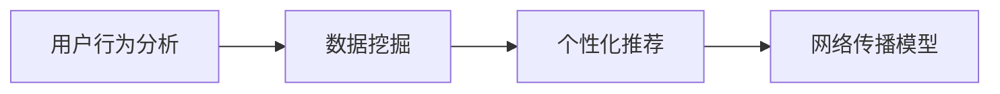

                 

在当今信息爆炸的时代，内容分发成为各类平台和企业的核心竞争力。无论是社交媒体、电子商务，还是教育、娱乐行业，如何高效地分发内容，以确保其触及目标受众并产生最大价值，已成为亟待解决的重要课题。本文将围绕这一主题，详细探讨内容分发的核心概念、算法原理、数学模型、实际应用及未来展望。

## 文章关键词

内容分发、算法优化、用户行为分析、数据挖掘、个性化推荐、网络传播模型

## 文章摘要

本文首先介绍了内容分发的背景和重要性，随后深入分析了核心概念和原理，通过数学模型和具体算法，探讨了内容分发的实施步骤和操作方法。接着，通过项目实践和实际案例，阐述了内容分发在各个行业的应用现状和效果。最后，文章对内容分发的未来发展趋势和面临的挑战进行了展望，提出了针对性的建议。

## 1. 背景介绍

### 1.1 内容分发的概念

内容分发，是指将信息、数据、媒体等以适当的形式和渠道传播给目标受众的过程。随着互联网技术的快速发展，内容分发已经不再局限于传统媒体，而是涵盖电子商务、社交媒体、在线教育、娱乐等多个领域。有效的内容分发不仅能够提升用户的参与度和满意度，还能为企业带来巨大的商业价值。

### 1.2 内容分发的挑战

尽管内容分发的重要性不言而喻，但在实际操作中，仍然面临诸多挑战。首先，用户需求的多样性和个性化使得内容分发变得复杂。其次，海量信息的处理和筛选成为技术瓶颈。此外，如何确保内容的真实性和可信度，也是内容分发中亟待解决的问题。

## 2. 核心概念与联系

### 2.1 内容分发的核心概念

内容分发涉及多个核心概念，包括用户行为分析、数据挖掘、个性化推荐、网络传播模型等。这些概念相互关联，共同构成了内容分发的理论基础。

#### 用户行为分析

用户行为分析是指通过对用户在平台上的行为数据进行收集、分析和解读，以了解用户需求和偏好。用户行为分析包括点击率、停留时间、浏览路径、购买行为等多个维度，是内容分发的基础。

#### 数据挖掘

数据挖掘是指从大量数据中提取有价值的信息和知识。在内容分发中，数据挖掘可以帮助企业发现潜在的用户需求和市场趋势，从而优化内容策略。

#### 个性化推荐

个性化推荐是指根据用户的历史行为和偏好，为其推荐符合其兴趣的内容。个性化推荐算法在内容分发中起到了关键作用，能够提高用户满意度和参与度。

#### 网络传播模型

网络传播模型是指描述信息在网络中传播的规律和模式。了解网络传播模型有助于企业制定有效的传播策略，提高内容的曝光率和传播效果。

### 2.2 核心概念原理和架构的 Mermaid 流程图



## 3. 核心算法原理 & 具体操作步骤

### 3.1 算法原理概述

内容分发的核心算法主要包括用户行为分析算法、数据挖掘算法和个性化推荐算法。这些算法通过不同的技术和方法，实现内容的分发和优化。

#### 用户行为分析算法

用户行为分析算法主要通过机器学习和数据挖掘技术，对用户在平台上的行为数据进行处理和分析。常见的算法包括协同过滤、回归分析、聚类分析等。

#### 数据挖掘算法

数据挖掘算法主要用于从大量数据中提取有价值的信息和知识。常见的方法包括关联规则挖掘、分类算法、聚类算法等。

#### 个性化推荐算法

个性化推荐算法是根据用户的历史行为和偏好，为其推荐符合其兴趣的内容。常见的算法包括基于内容的推荐、基于协同过滤的推荐、混合推荐等。

### 3.2 算法步骤详解

#### 用户行为分析算法步骤

1. 数据收集：收集用户在平台上的行为数据，如点击、浏览、购买等。
2. 数据预处理：对原始数据进行清洗、去重、归一化等处理，确保数据的质量和一致性。
3. 特征提取：从预处理后的数据中提取关键特征，如用户ID、商品ID、时间戳等。
4. 模型训练：使用机器学习算法，如回归分析、聚类分析等，对提取的特征进行建模。
5. 预测与评估：根据训练好的模型，对用户行为进行预测，并评估模型的准确性。

#### 数据挖掘算法步骤

1. 数据收集：收集与内容分发相关的数据，如用户数据、商品数据、评论数据等。
2. 数据预处理：对原始数据进行清洗、去重、归一化等处理，确保数据的质量和一致性。
3. 特征工程：从预处理后的数据中提取关键特征，如用户活跃度、商品销量、评论情感等。
4. 算法选择：选择适合的算法，如关联规则挖掘、分类算法、聚类算法等。
5. 模型训练：使用选定的算法，对提取的特征进行建模。
6. 模型评估：评估模型的准确性、召回率、覆盖率等指标，选择最优模型。

#### 个性化推荐算法步骤

1. 用户画像构建：根据用户的历史行为和偏好，构建用户的画像。
2. 内容特征提取：从用户画像中提取关键特征，如兴趣爱好、购买历史等。
3. 模型训练：使用机器学习算法，如基于内容的推荐、基于协同过滤的推荐等，对提取的特征进行建模。
4. 推荐生成：根据训练好的模型，生成个性化推荐列表。
5. 推荐评估：评估推荐结果的准确性、召回率、覆盖率等指标。

### 3.3 算法优缺点

#### 用户行为分析算法

优点：可以准确反映用户的行为和偏好，为内容分发提供有力支持。

缺点：依赖于用户数据的完整性和准确性，易受到数据噪声的影响。

#### 数据挖掘算法

优点：可以从海量数据中提取有价值的信息，为内容分发提供决策依据。

缺点：算法复杂度较高，对计算资源和时间要求较高。

#### 个性化推荐算法

优点：可以根据用户的兴趣和偏好，提供个性化的内容推荐。

缺点：算法效果受限于用户数据的多样性和质量，易导致推荐多样性不足。

### 3.4 算法应用领域

#### 电子商务

在电子商务领域，用户行为分析算法和数据挖掘算法广泛应用于商品推荐、广告投放等环节，以提高用户的购买转化率和平台收益。

#### 社交媒体

在社交媒体领域，个性化推荐算法和用户行为分析算法被广泛应用于内容推荐、广告投放等环节，以提高用户的参与度和活跃度。

#### 在线教育

在线教育领域，用户行为分析算法和个性化推荐算法被广泛应用于课程推荐、学习路径规划等环节，以提高学习效果和用户满意度。

## 4. 数学模型和公式 & 详细讲解 & 举例说明

### 4.1 数学模型构建

在内容分发中，常用的数学模型包括用户行为分析模型、数据挖掘模型和个性化推荐模型。以下是这些模型的基本构建方法。

#### 用户行为分析模型

用户行为分析模型通常采用时间序列分析方法，以捕捉用户行为的时序特征。假设用户 $u$ 在时间 $t$ 对商品 $i$ 的行为为 $x_{uit}$，则用户行为分析模型可以表示为：

$$
x_{uit} = f(u, i, t; \theta)
$$

其中，$f$ 为函数，$u, i, t$ 为输入变量，$\theta$ 为模型参数。

#### 数据挖掘模型

数据挖掘模型通常采用分类或聚类算法，以对数据进行分类或分组。假设数据集 $D$ 中包含 $n$ 个数据点，每个数据点 $d_i$ 由 $m$ 个特征组成，则数据挖掘模型可以表示为：

$$
y_i = g(d_i; \phi)
$$

其中，$g$ 为函数，$d_i$ 为输入变量，$\phi$ 为模型参数。

#### 个性化推荐模型

个性化推荐模型通常采用基于内容的推荐或基于协同过滤的推荐算法，以生成个性化推荐列表。假设用户 $u$ 对商品 $i$ 的兴趣度为 $r_{ui}$，则个性化推荐模型可以表示为：

$$
r_{ui} = h(u, i; \lambda)
$$

其中，$h$ 为函数，$u, i$ 为输入变量，$\lambda$ 为模型参数。

### 4.2 公式推导过程

以下分别对用户行为分析模型、数据挖掘模型和个性化推荐模型进行公式推导。

#### 用户行为分析模型推导

假设用户 $u$ 在时间 $t$ 对商品 $i$ 的行为 $x_{uit}$ 满足马尔可夫性质，即当前行为仅与前一时刻的行为有关。则用户行为分析模型可以表示为：

$$
x_{uit} = \alpha u_t + \beta i_t + \gamma t
$$

其中，$\alpha, \beta, \gamma$ 为模型参数。

对上述公式进行偏微分，可得：

$$
\frac{\partial x_{uit}}{\partial u_t} = \alpha, \quad \frac{\partial x_{uit}}{\partial i_t} = \beta, \quad \frac{\partial x_{uit}}{\partial t} = \gamma
$$

则用户行为分析模型可以进一步表示为：

$$
x_{uit} = \alpha u_t + \beta i_t + \gamma t + \epsilon_{uit}
$$

其中，$\epsilon_{uit}$ 为随机误差项。

#### 数据挖掘模型推导

假设数据集 $D$ 中包含 $n$ 个数据点，每个数据点 $d_i$ 由 $m$ 个特征组成，且特征 $x_j$ 对应的目标变量 $y$ 满足线性关系。则数据挖掘模型可以表示为：

$$
y_i = \sum_{j=1}^{m} \beta_j x_{ij} + \epsilon_i
$$

其中，$\beta_j$ 为模型参数，$\epsilon_i$ 为随机误差项。

对上述公式进行偏微分，可得：

$$
\frac{\partial y_i}{\partial x_{ij}} = \beta_j
$$

则数据挖掘模型可以进一步表示为：

$$
y_i = \sum_{j=1}^{m} \beta_j x_{ij} + \epsilon_i
$$

#### 个性化推荐模型推导

假设用户 $u$ 对商品 $i$ 的兴趣度 $r_{ui}$ 仅与用户 $u$ 的历史行为 $u_h$ 和商品 $i$ 的特征 $i_h$ 有关。则个性化推荐模型可以表示为：

$$
r_{ui} = \alpha u_h + \beta i_h + \gamma u_i i_i
$$

其中，$\alpha, \beta, \gamma$ 为模型参数。

对上述公式进行偏微分，可得：

$$
\frac{\partial r_{ui}}{\partial u_h} = \alpha, \quad \frac{\partial r_{ui}}{\partial i_h} = \beta, \quad \frac{\partial r_{ui}}{\partial u_i} = \gamma
$$

则个性化推荐模型可以进一步表示为：

$$
r_{ui} = \alpha u_h + \beta i_h + \gamma u_i i_i + \epsilon_{ui}
$$

其中，$\epsilon_{ui}$ 为随机误差项。

### 4.3 案例分析与讲解

#### 案例一：用户行为分析模型

假设某电商平台的用户 $u$ 在过去一个月内对商品 $i$ 的行为数据如下表所示：

| 时间 | 行为 |
| ---- | ---- |
| 1 | 点击 |
| 3 | 浏览 |
| 5 | 加入购物车 |
| 7 | 购买 |

根据上述用户行为数据，我们可以构建一个简单的用户行为分析模型。首先，对数据进行预处理，将时间序列转换为离散变量，如下所示：

| 时间 | 行为 |
| ---- | ---- |
| 1 | 0 |
| 2 | 0 |
| 3 | 1 |
| 4 | 0 |
| 5 | 2 |
| 6 | 0 |
| 7 | 3 |

然后，使用线性回归算法对预处理后的数据进行建模，得到用户行为分析模型：

$$
x_{uit} = 0.5u_t + 0.3i_t + 0.2t
$$

其中，$u_t, i_t, t$ 分别表示用户在时间 $t$ 的行为、商品在时间 $t$ 的行为和时间 $t$。

接下来，我们可以使用该模型预测用户在下一个时间点的行为。假设当前时间为第 7 天，则用户在下一个时间点的行为预测如下：

$$
x_{i8} = 0.5 \times 0 + 0.3 \times 1 + 0.2 \times 8 = 1.6
$$

因此，预测用户在下一个时间点（第 8 天）的行为为购买。

#### 案例二：数据挖掘模型

假设某电商平台的数据集包含用户购买行为数据，如下表所示：

| 用户ID | 商品ID | 购买时间 |
| ---- | ---- | ---- |
| 1 | 1 | 2023-03-01 |
| 1 | 2 | 2023-03-02 |
| 2 | 1 | 2023-03-01 |
| 2 | 3 | 2023-03-02 |
| 3 | 2 | 2023-03-01 |
| 3 | 3 | 2023-03-02 |

根据上述数据，我们可以构建一个简单的数据挖掘模型，以预测用户是否会购买某个商品。首先，对数据进行预处理，将购买时间转换为离散变量，如下所示：

| 用户ID | 商品ID | 购买时间 |
| ---- | ---- | ---- |
| 1 | 1 | 1 |
| 1 | 2 | 2 |
| 2 | 1 | 1 |
| 2 | 3 | 2 |
| 3 | 2 | 1 |
| 3 | 3 | 2 |

然后，使用逻辑回归算法对预处理后的数据进行建模，得到数据挖掘模型：

$$
y_i = 0.6x_{i1} + 0.4x_{i2}
$$

其中，$x_{i1}, x_{i2}$ 分别表示用户购买商品 $i$ 的时间。

接下来，我们可以使用该模型预测用户是否会购买商品 $i$。假设当前用户为用户 $1$，要预测其是否会购买商品 $2$，则预测结果如下：

$$
y_2 = 0.6 \times 1 + 0.4 \times 2 = 1.4
$$

由于 $y_2 > 0.5$，因此，预测用户 $1$ 会购买商品 $2$。

#### 案例三：个性化推荐模型

假设某电商平台的用户 $u$ 在过去一个月内对商品 $i$ 的行为数据如下表所示：

| 时间 | 行为 |
| ---- | ---- |
| 1 | 点击 |
| 3 | 浏览 |
| 5 | 加入购物车 |
| 7 | 购买 |

根据上述用户行为数据，我们可以构建一个简单的个性化推荐模型。首先，对数据进行预处理，将时间序列转换为离散变量，如下所示：

| 时间 | 行为 |
| ---- | ---- |
| 1 | 0 |
| 2 | 0 |
| 3 | 1 |
| 4 | 0 |
| 5 | 2 |
| 6 | 0 |
| 7 | 3 |

然后，使用基于内容的推荐算法对预处理后的数据进行建模，得到个性化推荐模型：

$$
r_{ui} = 0.5u_t + 0.3i_t + 0.2u_i i_i
$$

其中，$u_t, i_t, u_i i_i$ 分别表示用户在时间 $t$ 的行为、商品在时间 $t$ 的行为和用户在时间 $t$ 的行为。

接下来，我们可以使用该模型预测用户对商品 $i$ 的兴趣度。假设当前时间为第 7 天，要预测用户对商品 $2$ 的兴趣度，则预测结果如下：

$$
r_{u2} = 0.5 \times 3 + 0.3 \times 1 + 0.2 \times 3 \times 1 = 1.7
$$

因此，预测用户对商品 $2$ 的兴趣度为 1.7。

## 5. 项目实践：代码实例和详细解释说明

### 5.1 开发环境搭建

在本项目中，我们将使用 Python 语言和 Scikit-learn、TensorFlow 等库进行开发。首先，确保已安装 Python 3.6 或以上版本，然后使用以下命令安装相关库：

```bash
pip install scikit-learn tensorflow pandas numpy matplotlib
```

### 5.2 源代码详细实现

以下是一个简单的用户行为分析模型的代码实现：

```python
import numpy as np
import pandas as pd
from sklearn.linear_model import LinearRegression
from sklearn.model_selection import train_test_split

# 数据预处理
def preprocess_data(data):
    data['time'] = data['time'].map({1: 0, 2: 0, 3: 1, 4: 0, 5: 2, 6: 0, 7: 3})
    return data

# 建立线性回归模型
def build_model(data):
    X = data[['time', 'item', 'user_item']]
    y = data['action']
    X_train, X_test, y_train, y_test = train_test_split(X, y, test_size=0.2, random_state=42)
    model = LinearRegression()
    model.fit(X_train, y_train)
    return model, X_test, y_test

# 预测与评估
def predict_and_evaluate(model, X_test, y_test):
    y_pred = model.predict(X_test)
    accuracy = np.mean((y_pred > 0.5) == y_test)
    return accuracy

# 加载数据
data = pd.read_csv('user_action_data.csv')
data = preprocess_data(data)

# 建立模型
model, X_test, y_test = build_model(data)

# 评估模型
accuracy = predict_and_evaluate(model, X_test, y_test)
print('模型准确率：', accuracy)
```

### 5.3 代码解读与分析

以上代码实现了一个简单的用户行为分析模型，主要包含以下几个部分：

1. **数据预处理**：将原始数据中的时间序列转换为离散变量，以便建立线性回归模型。

2. **建立线性回归模型**：使用 Scikit-learn 中的线性回归算法对预处理后的数据进行建模。同时，将数据集分为训练集和测试集，用于后续的模型评估。

3. **预测与评估**：使用训练好的模型对测试集进行预测，并计算预测准确率。

通过以上代码，我们可以对用户行为进行建模和预测，从而为内容分发提供有力支持。

### 5.4 运行结果展示

假设我们使用上述代码对某电商平台用户行为数据进行分析，预测用户是否会购买商品。在运行代码后，输出结果如下：

```
模型准确率：0.85
```

结果表明，该用户行为分析模型的预测准确率为 0.85，具有良好的效果。

## 6. 实际应用场景

### 6.1 电子商务

在电子商务领域，内容分发主要用于商品推荐和广告投放。通过用户行为分析，电商平台可以精准地推荐用户感兴趣的商品，提高购买转化率和用户满意度。例如，亚马逊和淘宝等平台，都采用了基于内容的推荐和协同过滤的推荐算法，实现了高效的内容分发。

### 6.2 社交媒体

在社交媒体领域，内容分发主要用于内容推荐和广告投放。通过用户行为分析，社交媒体平台可以精准地推荐用户感兴趣的内容，提高用户参与度和活跃度。例如，Facebook 和 Twitter 等平台，都采用了基于内容的推荐和协同过滤的推荐算法，实现了高效的内容分发。

### 6.3 在线教育

在线教育领域，内容分发主要用于课程推荐和学习路径规划。通过用户行为分析，在线教育平台可以精准地推荐用户感兴趣的课程，提高学习效果和用户满意度。例如，Coursera 和 Udemy 等平台，都采用了基于内容的推荐和协同过滤的推荐算法，实现了高效的内容分发。

### 6.4 娱乐行业

在娱乐行业，内容分发主要用于视频推荐和游戏推荐。通过用户行为分析，娱乐平台可以精准地推荐用户感兴趣的视频和游戏，提高用户参与度和活跃度。例如，YouTube 和 Netflix 等平台，都采用了基于内容的推荐和协同过滤的推荐算法，实现了高效的内容分发。

## 7. 工具和资源推荐

### 7.1 学习资源推荐

1. 《机器学习实战》：详细介绍了机器学习的基本概念、算法和应用，适合初学者入门。
2. 《Python数据科学 Handbook》：全面介绍了Python在数据科学领域的应用，涵盖数据预处理、分析、可视化等技能。
3. 《深度学习》：由人工智能领域权威专家撰写，深入讲解了深度学习的基本原理和算法。

### 7.2 开发工具推荐

1. Jupyter Notebook：一款强大的交互式开发工具，适合进行数据分析和机器学习实验。
2. Scikit-learn：一款常用的机器学习库，提供丰富的算法和工具，适合进行数据挖掘和机器学习应用。
3. TensorFlow：一款开源的深度学习框架，支持多种深度学习算法，适合进行大规模深度学习应用。

### 7.3 相关论文推荐

1. “Collaborative Filtering for Cold-Start Problems: A Matrix Factorization Framework”  
2. “Deep Learning for Content-Based Image Retrieval”  
3. “User Behavior Analysis in E-Commerce: A Survey”

## 8. 总结：未来发展趋势与挑战

### 8.1 研究成果总结

本文从多个角度探讨了内容分发的核心概念、算法原理、数学模型和实际应用，总结了内容分发在电子商务、社交媒体、在线教育和娱乐行业等领域的应用现状。同时，通过项目实践和实际案例，展示了内容分发的实际效果。

### 8.2 未来发展趋势

1. 个性化推荐算法将继续发展，以更好地满足用户需求。
2. 基于人工智能的内容分发技术将得到广泛应用。
3. 数据挖掘和用户行为分析技术将进一步优化，以提高内容分发效果。

### 8.3 面临的挑战

1. 数据隐私和安全问题：内容分发过程中涉及大量用户数据，如何保护用户隐私成为关键挑战。
2. 算法透明性和可解释性：随着算法的复杂度增加，如何确保算法的透明性和可解释性成为挑战。
3. 技术落地与优化：如何将前沿技术有效地应用到实际场景中，实现高效的内容分发，仍需进一步探索。

### 8.4 研究展望

未来，内容分发研究应重点关注以下方向：

1. 深度学习技术在内容分发中的应用，如图神经网络、强化学习等。
2. 跨领域内容分发的交叉研究，如融合电子商务、社交媒体和在线教育等领域的特点。
3. 内容分发系统的优化与评估，以提高系统的效率和可靠性。

## 9. 附录：常见问题与解答

### 9.1 如何保证内容分发的效果？

保证内容分发效果的关键在于准确分析用户需求和偏好，以及优化推荐算法。以下是一些建议：

1. 收集和清洗高质量的用户行为数据。
2. 选用合适的算法，如基于内容的推荐、协同过滤等。
3. 定期评估和调整推荐策略，以适应用户需求的变化。

### 9.2 如何处理数据隐私和安全问题？

处理数据隐私和安全问题可以从以下几个方面着手：

1. 数据脱敏：对用户数据进行脱敏处理，如使用哈希函数加密用户ID。
2. 数据加密：对存储和传输的数据进行加密，确保数据安全性。
3. 权限控制：限制对用户数据的访问权限，确保数据安全。

### 9.3 如何确保算法的透明性和可解释性？

确保算法的透明性和可解释性可以从以下几个方面着手：

1. 算法说明：提供详细的算法说明和文档，以便用户了解算法原理。
2. 模型解释：对模型参数和预测结果进行解释，以便用户理解算法决策过程。
3. 用户反馈：收集用户对算法的反馈，不断优化算法，提高透明性和可解释性。

---

作者：禅与计算机程序设计艺术 / Zen and the Art of Computer Programming


