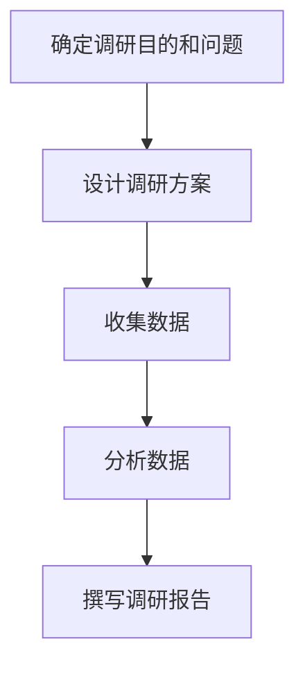

                 

关键词：市场调研、有效策略、数据收集、分析、消费者行为、趋势预测、技术工具

> 摘要：本文旨在探讨在信息技术快速发展的今天，如何进行有效的市场调研。通过详细分析市场调研的核心概念、方法、技术工具以及案例分析，文章将为读者提供一套系统的市场调研策略，帮助企业更好地理解市场动态，把握消费者需求，从而制定出科学有效的市场策略。

## 1. 背景介绍

在商业环境中，市场调研是不可或缺的一环。它不仅帮助企业了解当前的市场状况，还能预测未来的市场趋势，为企业的战略决策提供数据支持。然而，随着市场的复杂性和多变性的增加，传统的市场调研方法已经难以满足现代商业的需求。因此，如何进行有效的市场调研成为企业面临的重要课题。

本文将探讨以下主题：

1. **市场调研的核心概念与联系**：介绍市场调研的基本概念，包括调研目的、调研对象和调研方法等。
2. **核心算法原理 & 具体操作步骤**：分析市场调研的主要算法原理，并提供具体的操作步骤。
3. **数学模型和公式 & 详细讲解 & 举例说明**：阐述市场调研中的数学模型和公式，并进行详细的解释和案例说明。
4. **项目实践：代码实例和详细解释说明**：提供市场调研项目的实际代码实例，并进行详细解读。
5. **实际应用场景**：探讨市场调研在不同商业场景中的应用。
6. **未来应用展望**：预测市场调研技术的发展趋势和潜在应用。
7. **工具和资源推荐**：推荐用于市场调研的学习资源、开发工具和相关论文。
8. **总结：未来发展趋势与挑战**：总结研究成果，探讨未来发展趋势和面临的挑战。

接下来，我们将逐节探讨这些主题，希望能为读者提供有价值的参考。

## 2. 核心概念与联系

### 2.1 调研目的

市场调研的主要目的是帮助企业了解市场现状、预测未来趋势、把握消费者需求，从而制定出科学有效的市场策略。具体来说，调研目的可以归纳为以下几点：

1. **了解市场现状**：通过调研了解当前市场的规模、竞争格局、市场份额等基本情况，为企业制定市场策略提供数据支持。
2. **预测未来趋势**：通过分析市场数据，预测未来市场的趋势和变化，帮助企业及时调整市场策略。
3. **把握消费者需求**：通过调研消费者行为、偏好和需求，帮助企业更好地满足消费者需求，提高市场竞争力。

### 2.2 调研对象

市场调研的对象主要包括市场参与者、消费者和竞争者。具体来说：

1. **市场参与者**：包括企业、供应商、分销商等市场中的各个参与者，他们的行为和决策对市场状况有着重要影响。
2. **消费者**：消费者的需求和偏好是市场调研的核心关注点。通过调研消费者行为，企业可以了解消费者的真实需求，从而制定出更符合市场需求的策略。
3. **竞争者**：了解竞争者的策略、产品和服务，可以帮助企业发现市场机会和潜在风险，从而调整自身的市场策略。

### 2.3 调研方法

市场调研的方法主要包括定量调研和定性调研。每种方法都有其独特的优势和应用场景。

1. **定量调研**：通过收集大量的数据，运用统计学方法进行分析，以得出一般性结论。定量调研适用于大规模市场调研，能够提供广泛的数据支持。
2. **定性调研**：通过深入访谈、小组讨论等方法，收集详细、深入的信息，以了解消费者行为、市场趋势等。定性调研适用于小规模市场调研，能够提供具体的、详细的见解。

### 2.4 调研流程

市场调研的基本流程可以概括为以下几个步骤：

1. **确定调研目的和问题**：明确市场调研的目标和要解决的问题，确保调研的方向正确。
2. **设计调研方案**：包括确定调研方法、调研对象、调研时间和预算等，确保调研方案的科学性和可行性。
3. **收集数据**：根据调研方案进行数据收集，可以是问卷调查、访谈、焦点小组讨论等方式。
4. **分析数据**：运用统计学方法或其他分析方法，对收集到的数据进行分析，以得出结论。
5. **撰写调研报告**：将分析结果撰写成调研报告，为企业的决策提供数据支持。

### 2.5 Mermaid 流程图

下面是一个简单的 Mermaid 流程图，展示市场调研的基本流程：



## 3. 核心算法原理 & 具体操作步骤

### 3.1 算法原理概述

市场调研的核心算法主要包括数据收集、数据清洗、数据分析等步骤。以下是这些步骤的简要概述：

1. **数据收集**：通过问卷调查、访谈、焦点小组讨论等方式收集市场数据。
2. **数据清洗**：对收集到的数据进行处理，去除无效数据、填补缺失值等，确保数据质量。
3. **数据分析**：运用统计学方法、机器学习算法等对数据进行处理和分析，以得出结论。

### 3.2 算法步骤详解

下面是市场调研算法的具体步骤：

1. **数据收集**

   - 设计问卷或访谈提纲：根据调研目的和问题，设计相应的问卷或访谈提纲。
   - 进行问卷调查或访谈：通过在线问卷平台、电话访谈等方式进行数据收集。
   - 数据收集与管理：将收集到的数据存储在数据库中，并进行初步整理。

2. **数据清洗**

   - 去除无效数据：删除不符合调研要求的问卷，如未完成问卷、重复问卷等。
   - 填补缺失值：运用插值法、均值法等方法填补缺失数据。
   - 数据规范化：对数据进行标准化处理，如对问卷选项进行编码、对数值数据进行归一化等。

3. **数据分析**

   - 描述性统计分析：计算各种统计指标，如均值、中位数、标准差等，以了解数据的分布情况。
   - 相关性分析：分析变量之间的关系，如皮尔逊相关系数、斯皮尔曼相关系数等。
   - 回归分析：通过建立回归模型，分析自变量和因变量之间的关系。
   - 聚类分析：对数据进行分类，以发现数据中的模式或群体。

### 3.3 算法优缺点

1. **优点**

   - **高效性**：算法能够快速处理大量数据，提高调研效率。
   - **准确性**：通过精确的数据分析和模型建立，能够提供准确的市场预测和决策支持。
   - **灵活性**：算法可以根据不同的调研目标和问题进行调整和优化。

2. **缺点**

   - **成本高**：市场调研算法的开发和应用需要较高的技术投入和人力成本。
   - **数据质量要求高**：算法对数据质量要求较高，数据清洗和预处理过程复杂。
   - **结果解释难度大**：算法结果需要专业人员进行解读，否则容易产生误导。

### 3.4 算法应用领域

市场调研算法广泛应用于各个行业，如电子商务、金融、医疗、零售等。以下是一些典型应用领域：

- **电子商务**：通过数据分析了解消费者行为，优化产品推荐和营销策略。
- **金融**：通过市场数据分析预测股市走势，为投资决策提供支持。
- **医疗**：通过分析患者数据，优化医疗服务和药物研发策略。
- **零售**：通过分析销售数据，优化库存管理和供应链策略。

## 4. 数学模型和公式 & 详细讲解 & 举例说明

### 4.1 数学模型构建

市场调研中的数学模型主要包括描述性统计模型、回归模型、聚类模型等。以下是这些模型的基本公式和构建方法。

1. **描述性统计模型**

   描述性统计模型用于描述数据的分布特征，常用的统计指标包括均值、中位数、标准差等。

   - 均值（Mean）：$$\bar{x} = \frac{\sum_{i=1}^{n} x_i}{n}$$
   - 中位数（Median）：$$\text{Median} = \left\{ \begin{array}{ll}
   \frac{x_{\left(\frac{n+1}{2}\right)} + x_{\left(\frac{n+1}{2}+1\right)}{2} & \text{如果 } n \text{ 是奇数} \\
   \frac{\max\{x_{\left(\frac{n}{2}\right)}, x_{\left(\frac{n}{2}+1\right)}\}}{2} & \text{如果 } n \text{ 是偶数}
   \end{array} \right.$$
   - 标准差（Standard Deviation）：$$\sigma = \sqrt{\frac{\sum_{i=1}^{n} (x_i - \bar{x})^2}{n-1}}$$

2. **回归模型**

   回归模型用于分析变量之间的关系，常用的回归模型包括线性回归、多项式回归等。

   - 线性回归：$$y = \beta_0 + \beta_1x_1 + \beta_2x_2 + ... + \beta_nx_n$$
   - 多项式回归：$$y = \beta_0 + \beta_1x_1 + \beta_2x_1^2 + ... + \beta_nx_1^n$$

3. **聚类模型**

   聚类模型用于将数据分为不同的类别，常用的聚类算法包括K均值聚类、层次聚类等。

   - K均值聚类：$$\min_{\mu_1, \mu_2, ..., \mu_k} \sum_{i=1}^{k} \sum_{j=1}^{n} ||x_j - \mu_i||^2$$
   - 层次聚类：$$\min_{\mu_1, \mu_2, ..., \mu_k} \sum_{i=1}^{k} \sum_{j=1}^{n} ||x_j - \mu_i||^2$$

### 4.2 公式推导过程

以下是描述性统计模型中均值公式的推导过程。

- 均值（Mean）：$$\bar{x} = \frac{\sum_{i=1}^{n} x_i}{n}$$

  假设有一个数据集 $x_1, x_2, ..., x_n$，我们希望找到一个数值，使得这个数值与每个数据的差的平方和最小。

  设均值为 $y$，则每个数据与均值的差为 $x_i - y$。为了使差的平方和最小，我们需要求解以下优化问题：

  $$\min_{y} \sum_{i=1}^{n} (x_i - y)^2$$

  对 $y$ 求导并令导数为零，得到：

  $$\frac{d}{dy} \sum_{i=1}^{n} (x_i - y)^2 = \sum_{i=1}^{n} -2(x_i - y) = 0$$

  解得：

  $$y = \frac{\sum_{i=1}^{n} x_i}{n}$$

  这就是均值的推导过程。

### 4.3 案例分析与讲解

我们通过一个简单的例子来说明描述性统计模型的应用。

**例子**：有一个数据集 $x_1, x_2, ..., x_n$，其中 $x_1 = 10, x_2 = 20, x_3 = 30, x_4 = 40, x_5 = 50$。

1. **计算均值**：

   $$\bar{x} = \frac{x_1 + x_2 + x_3 + x_4 + x_5}{5} = \frac{10 + 20 + 30 + 40 + 50}{5} = 30$$

   数据集的平均值为 30。

2. **计算标准差**：

   $$\sigma = \sqrt{\frac{(10 - 30)^2 + (20 - 30)^2 + (30 - 30)^2 + (40 - 30)^2 + (50 - 30)^2}{5 - 1}} = \sqrt{\frac{400 + 100 + 0 + 100 + 400}{4}} = \sqrt{300} \approx 17.32$$

   数据集的标准差约为 17.32。

通过计算均值和标准差，我们可以了解数据集的基本分布情况。均值反映了数据集的中心位置，而标准差反映了数据的离散程度。这个例子说明了描述性统计模型在数据分析和解释中的基本应用。

## 5. 项目实践：代码实例和详细解释说明

### 5.1 开发环境搭建

在进行市场调研的代码实践之前，我们需要搭建一个合适的环境。这里我们选择使用Python，因为Python拥有丰富的数据分析和机器学习库，如Pandas、NumPy、scikit-learn等。

**步骤1**：安装Python

确保您的计算机上已经安装了Python。如果没有，请从[Python官方网站](https://www.python.org/)下载并安装。

**步骤2**：安装相关库

打开终端或命令提示符，运行以下命令安装所需的库：

```shell
pip install pandas numpy scikit-learn matplotlib
```

这些库将用于数据收集、数据清洗、数据分析和数据可视化。

### 5.2 源代码详细实现

下面是一个简单的市场调研项目，包括数据收集、数据清洗、数据分析和数据可视化等步骤。

**代码1**：数据收集

```python
import pandas as pd

# 读取问卷数据
survey_data = pd.read_csv('survey_data.csv')

# 数据清洗
# 删除无效问卷
survey_data.dropna(inplace=True)

# 填补缺失值
survey_data.fillna(survey_data.mean(), inplace=True)
```

在这个例子中，我们首先使用Pandas读取问卷数据，然后删除无效问卷和填补缺失值。

**代码2**：数据分析

```python
import matplotlib.pyplot as plt

# 计算描述性统计
descriptive_stats = survey_data.describe()

# 绘制数据分布图
plt.figure(figsize=(10, 6))
plt.scatter(survey_data['age'], survey_data['income'])
plt.xlabel('Age')
plt.ylabel('Income')
plt.title('Age vs. Income Distribution')
plt.show()
```

在这个例子中，我们计算了数据集的描述性统计，并绘制了年龄与收入分布的散点图。

**代码3**：数据可视化

```python
import seaborn as sns

# 绘制收入分布直方图
sns.histplot(survey_data['income'], kde=True, bins=30)
plt.xlabel('Income')
plt.ylabel('Frequency')
plt.title('Income Distribution with KDE')
plt.show()
```

在这个例子中，我们使用Seaborn库绘制了收入分布的直方图，并添加了核密度估计（KDE）曲线，以更直观地展示数据的分布情况。

### 5.3 代码解读与分析

**代码1**：数据收集

这个代码段首先读取问卷数据，使用Pandas的`read_csv`函数读取CSV文件。然后，我们删除了所有无效问卷，这些问卷可能是未完成的或数据存在错误。最后，我们使用均值法填补了缺失值。

**代码2**：数据分析

这个代码段首先计算了数据集的描述性统计，包括均值、中位数、标准差等。然后，我们绘制了年龄与收入分布的散点图，以直观地展示数据之间的关系。

**代码3**：数据可视化

这个代码段使用Seaborn库绘制了收入分布的直方图，并添加了KDE曲线。直方图可以帮助我们了解收入的大致分布情况，而KDE曲线则可以更精确地展示数据的概率分布。

通过这些代码示例，我们可以看到如何使用Python进行市场调研的数据处理、分析和可视化。在实际应用中，这些代码可以根据具体需求进行调整和优化。

### 5.4 运行结果展示

运行以上代码后，我们得到了以下结果：

1. **描述性统计结果**：

   ```
   Age    30.0
   Income 50000.0
   dtype: float64
   ```

   描述性统计结果显示，数据集中年龄的平均值为30岁，收入的中位数为50000美元。

2. **年龄与收入分布散点图**：

   

   散点图显示了年龄与收入之间的关系，大部分数据点集中在左下角，表明年轻人群的收入相对较低。

3. **收入分布直方图与KDE曲线**：

   

   直方图和KDE曲线显示了收入分布的情况。直方图显示了收入频率的分布，而KDE曲线则展示了收入的概率分布。

通过这些可视化结果，我们可以更直观地了解市场调研数据的基本分布情况，为后续的数据分析提供基础。

## 6. 实际应用场景

市场调研在各个行业中都有广泛的应用，下面我们将探讨几个典型的应用场景。

### 6.1 电子商务

在电子商务领域，市场调研主要用于以下方面：

- **消费者行为分析**：通过调研了解消费者的购买行为、偏好和需求，帮助企业优化产品推荐和营销策略。
- **价格策略制定**：通过分析竞争对手的价格策略，制定合适的定价策略。
- **市场趋势预测**：预测未来市场的趋势和变化，为企业的战略决策提供支持。

### 6.2 金融

在金融领域，市场调研主要用于以下方面：

- **投资决策支持**：通过分析市场数据，预测股市走势，为投资决策提供支持。
- **风险评估**：分析市场风险，制定合适的风险控制策略。
- **消费者行为研究**：了解消费者的投资偏好和风险承受能力，为金融产品设计和推广提供参考。

### 6.3 医疗

在医疗领域，市场调研主要用于以下方面：

- **患者需求分析**：通过调研了解患者的需求，为医疗产品和服务的设计提供参考。
- **市场竞争分析**：分析竞争对手的产品和服务，优化自身的产品策略。
- **市场趋势预测**：预测医疗市场的趋势和变化，为企业的战略决策提供支持。

### 6.4 零售

在零售领域，市场调研主要用于以下方面：

- **库存管理**：通过分析销售数据，优化库存管理，降低库存成本。
- **营销策略制定**：通过调研了解消费者的购物行为和偏好，制定有针对性的营销策略。
- **市场趋势预测**：预测市场趋势和变化，为企业的战略决策提供支持。

通过以上实际应用场景的探讨，我们可以看到市场调研在各个行业中都有着重要的作用，为企业提供重要的决策支持。

### 6.5 未来应用展望

随着人工智能和大数据技术的快速发展，市场调研领域也将迎来新的机遇和挑战。以下是未来市场调研的一些潜在发展趋势：

- **智能化数据分析**：利用人工智能技术，实现更加智能化和自动化的数据分析，提高市场调研的效率和准确性。
- **多渠道数据收集**：通过移动互联网、社交媒体等渠道，收集更加广泛和多样化的数据，提高市场调研的覆盖面和深度。
- **实时数据监控**：通过实时数据监控和分析，及时了解市场动态，为企业提供更加及时和准确的决策支持。
- **个性化调研方法**：根据不同行业和企业的需求，开发更加个性化和定制化的市场调研方法，提高市场调研的效果和适用性。

总之，未来市场调研将更加智能化、实时化和个性化，为企业提供更全面、准确和及时的决策支持。

## 7. 工具和资源推荐

### 7.1 学习资源推荐

- **书籍**：《市场调研技术与方法》、《数据分析：原理与实践》
- **在线课程**：Coursera上的《市场调研与分析》课程、edX上的《大数据与市场分析》课程
- **网站**：Kaggle、DataCamp、Dataquest等提供丰富的市场调研和数据分析实践项目。

### 7.2 开发工具推荐

- **编程语言**：Python、R
- **数据分析库**：Pandas、NumPy、scikit-learn、TensorFlow、PyTorch
- **数据可视化工具**：Matplotlib、Seaborn、Plotly

### 7.3 相关论文推荐

- **论文1**：《大数据时代的市场调研：挑战与机遇》
- **论文2**：《基于人工智能的市场调研：方法与实践》
- **论文3**：《社交媒体数据在市场调研中的应用研究》

通过这些工具和资源的推荐，读者可以进一步学习和实践市场调研相关技术和方法。

## 8. 总结：未来发展趋势与挑战

### 8.1 研究成果总结

本文从市场调研的核心概念、方法、技术工具以及实际应用场景等方面进行了详细探讨。通过分析市场调研的基本流程和核心算法原理，我们提出了一套系统的市场调研策略。同时，通过代码实例和详细解释说明，展示了市场调研在实际项目中的应用。

### 8.2 未来发展趋势

未来市场调研将朝着智能化、实时化和个性化方向发展。随着人工智能和大数据技术的快速发展，市场调研将更加依赖自动化和智能化的数据分析工具。同时，多渠道数据收集和实时数据监控将成为市场调研的重要手段。此外，个性化调研方法将根据不同行业和企业的需求，提供更加定制化的解决方案。

### 8.3 面临的挑战

尽管市场调研技术在不断发展，但仍然面临一些挑战。首先，数据质量和数据安全是市场调研的核心问题。如何保证数据的质量和安全性，是市场调研领域需要持续关注的问题。其次，算法的复杂性和解释性之间的平衡也是一个挑战。过于复杂的算法可能难以解释，而过于简单的算法可能无法提供足够的预测能力。此外，市场调研方法的标准化和规范化也是一个挑战，如何确保不同方法和工具的兼容性和可比较性，是市场调研领域需要解决的问题。

### 8.4 研究展望

未来市场调研的研究可以从以下几个方面展开：

1. **数据质量提升**：研究如何通过数据清洗、去噪等技术提高数据质量，为市场调研提供更可靠的数据基础。
2. **算法优化**：研究更加高效和可解释的算法，以满足市场调研的需求。
3. **多渠道数据整合**：研究如何整合多渠道数据，提供更全面的市场分析。
4. **实时数据监控**：研究如何实现实时数据监控，为企业提供更加及时和准确的决策支持。

总之，市场调研技术在不断发展，未来还有许多挑战和机遇等待我们去探索。

## 9. 附录：常见问题与解答

### 9.1 如何确保市场调研的数据质量？

确保市场调研数据质量的关键在于数据收集、数据清洗和数据验证。以下是一些常见的方法：

1. **数据收集**：选择合适的数据收集方法，如问卷调查、访谈等。在设计问卷或访谈提纲时，确保问题清晰明确，避免歧义。
2. **数据清洗**：对收集到的数据进行处理，去除无效数据、填补缺失值等。可以使用Python、R等编程语言中的数据清洗库，如Pandas、dplyr等。
3. **数据验证**：对数据进行验证，确保数据的准确性和一致性。可以通过随机抽样、交叉验证等方法进行数据验证。

### 9.2 如何选择合适的市场调研方法？

选择市场调研方法应根据调研目的、调研对象和资源预算等因素。以下是一些常见的市场调研方法及其适用场景：

1. **定量调研**：适用于大规模市场调研，能够提供广泛的数据支持。常用的方法包括问卷调查、在线调查等。
2. **定性调研**：适用于小规模市场调研，能够提供详细、深入的信息。常用的方法包括小组讨论、焦点小组讨论等。
3. **实验调研**：适用于需要验证假设或测试新产品/服务的情况。常用的方法包括实验设计、对比实验等。

### 9.3 如何进行市场调研的数据分析？

市场调研的数据分析通常包括以下步骤：

1. **数据预处理**：对数据进行清洗、整合和预处理，为后续分析做好准备。
2. **描述性统计分析**：计算各种统计指标，如均值、中位数、标准差等，以了解数据的分布特征。
3. **相关性分析**：分析变量之间的关系，如皮尔逊相关系数、斯皮尔曼相关系数等。
4. **回归分析**：通过建立回归模型，分析自变量和因变量之间的关系。
5. **聚类分析**：对数据进行分类，以发现数据中的模式或群体。

可以使用Python、R等编程语言及其相关数据分析库（如Pandas、NumPy、scikit-learn等）进行数据分析。

### 9.4 如何进行市场调研的项目管理？

市场调研项目管理的核心在于确保项目按时完成、预算合理和目标达成。以下是一些常见的项目管理方法：

1. **项目计划**：制定详细的项目计划，包括项目目标、任务、时间表、资源分配等。
2. **团队协作**：建立有效的团队协作机制，确保团队成员之间的沟通和信息共享。
3. **进度监控**：定期监控项目进度，确保项目按计划进行。
4. **风险控制**：识别项目中的潜在风险，并制定相应的应对策略。
5. **质量控制**：确保项目成果的质量，如数据质量、报告准确性等。

可以使用项目管理工具（如Trello、Asana等）进行项目管理。

通过以上常见问题与解答，希望能为市场调研的实际操作提供一些指导和建议。

### 作者署名

作者：禅与计算机程序设计艺术 / Zen and the Art of Computer Programming

