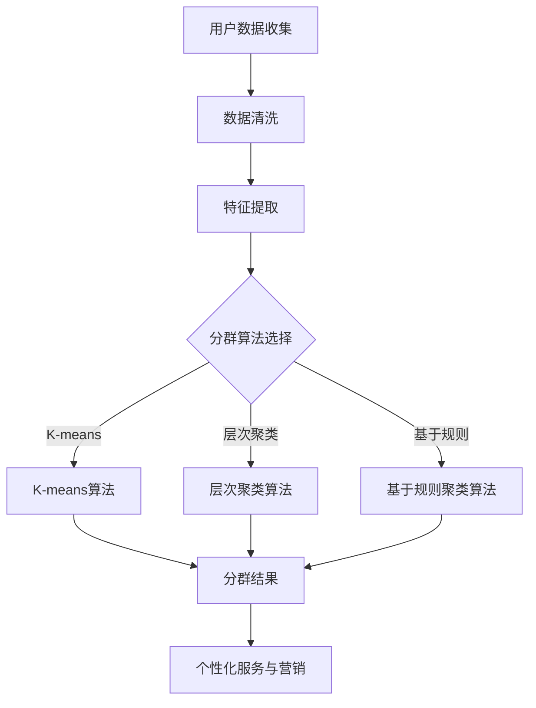

                 

关键词：用户分群、数据分析、机器学习、商业智能、个性化推荐

> 摘要：本文将探讨用户分群管理的核心概念、技术原理、算法模型以及实际应用场景，结合实际项目案例，详细解析如何利用数据分析、机器学习和商业智能等技术手段，实现高效的用户分群，提升用户体验和业务价值。

## 1. 背景介绍

在数字化时代，用户数据已经成为企业的重要资产。通过对用户数据的深度挖掘和分析，企业能够更好地理解用户需求，实现精准营销和个性化服务。用户分群管理（User Segmentation Management）作为数据驱动的营销策略之一，旨在将用户划分为不同的群体，以便针对每个群体定制化营销策略，提高用户满意度和业务转化率。

随着互联网技术的发展，用户分群管理的应用场景越来越广泛，从电商平台到社交媒体，从在线教育到金融保险，用户分群管理已成为企业竞争的重要手段。然而，如何有效地进行用户分群管理，仍然是许多企业面临的挑战。

本文将从以下方面展开讨论：

- 用户分群管理的核心概念和目标
- 用户分群的技术原理和方法
- 用户分群算法的具体操作步骤
- 数学模型和公式在用户分群中的应用
- 实际应用场景和案例分析
- 未来发展趋势与面临的挑战

## 2. 核心概念与联系

### 2.1 用户分群的定义

用户分群是指根据用户的特征和行为数据，将用户划分为不同的群体。这些群体可以是基于用户的行为、兴趣、购买历史、地理位置等多维度特征定义的。用户分群的目标是识别出具有相似特征和行为的用户，以便为他们提供个性化的服务和体验。

### 2.2 用户分群的目标

用户分群的主要目标是：

- 提高用户满意度：通过了解用户特征和行为，为企业提供个性化服务，满足用户需求，提升用户体验。
- 提升营销效果：针对不同的用户群体，制定个性化的营销策略，提高营销转化率。
- 提升业务价值：通过更精准的用户画像和营销策略，实现业务增长和利润提升。

### 2.3 用户分群的相关概念

- **用户特征**：指用于描述用户的属性，如年龄、性别、地理位置、购买历史、浏览行为等。
- **行为数据**：指用户在平台上的活动记录，如点击、购买、评价等。
- **分群维度**：指用户分群时所依据的维度，如行为维度、兴趣维度、购买维度等。
- **分群算法**：指用于计算用户相似度和分群的方法，如K-means算法、层次聚类算法、基于规则的聚类算法等。
- **营销策略**：指根据分群结果制定的用户服务和产品推广策略。

### 2.4 用户分群的Mermaid流程图



## 3. 核心算法原理 & 具体操作步骤

### 3.1 算法原理概述

用户分群算法主要分为基于距离的聚类算法和基于规则的聚类算法。基于距离的聚类算法包括K-means算法和层次聚类算法，而基于规则的聚类算法则包括基于关联规则的聚类算法等。

- **K-means算法**：基于距离度量，将用户数据划分为K个簇，每个簇由其中心点（均值）代表。算法通过迭代更新簇中心和分配用户，直至收敛。
- **层次聚类算法**：采用自底向上的方式，逐步合并相似的簇，形成层次结构。
- **基于规则的聚类算法**：根据用户特征和行为的关联关系，定义规则来划分用户群体。

### 3.2 算法步骤详解

#### 3.2.1 K-means算法

1. **初始化**：随机选择K个用户作为初始簇中心。
2. **分配用户**：计算每个用户与簇中心的距离，将用户分配到最近的簇。
3. **更新簇中心**：重新计算每个簇的中心点。
4. **迭代**：重复步骤2和3，直至簇中心不再变化或达到预设的迭代次数。

#### 3.2.2 层次聚类算法

1. **初始化**：将每个用户视为一个簇。
2. **合并簇**：计算相邻簇之间的距离，选择距离最近的两个簇进行合并。
3. **更新距离矩阵**：更新合并后的簇之间的距离。
4. **迭代**：重复步骤2和3，直至形成单一的簇或达到预设的层级数。

#### 3.2.3 基于规则的聚类算法

1. **规则定义**：根据用户特征和行为的关联关系，定义规则。
2. **规则匹配**：将用户与规则进行匹配，划分用户群体。
3. **规则优化**：根据聚类效果，优化规则定义。

### 3.3 算法优缺点

- **K-means算法**：优点是简单、高效，适用于数据量较大的场景。缺点是容易陷入局部最优，对初始簇中心敏感。
- **层次聚类算法**：优点是能够产生层次结构，便于解释。缺点是计算复杂度较高，适用于数据量较小的场景。
- **基于规则的聚类算法**：优点是灵活、直观，易于实现。缺点是可能产生冗余规则，对规则定义依赖较强。

### 3.4 算法应用领域

- **电子商务**：通过用户分群，实现精准营销和个性化推荐。
- **社交媒体**：根据用户兴趣和行为，优化内容分发和广告投放。
- **金融行业**：通过用户分群，定制金融产品和服务，提升用户体验。

## 4. 数学模型和公式 & 详细讲解 & 举例说明

### 4.1 数学模型构建

用户分群的核心是计算用户之间的相似度，常用的相似度度量方法包括：

- **余弦相似度**：
  $$\text{Cosine Similarity} = \frac{\text{向量} A \cdot \text{向量} B}{\|A\|\|B\|}$$
  
- **欧几里得距离**：
  $$\text{Euclidean Distance} = \sqrt{\sum_{i=1}^{n}(x_i - y_i)^2}$$

- **Jaccard相似度**：
  $$\text{Jaccard Similarity} = \frac{\text{交集}}{\text{并集}} = \frac{A \cap B}{A \cup B}$$

### 4.2 公式推导过程

以K-means算法为例，推导簇中心更新公式：

1. **初始化簇中心**：
   $$\text{初始化} \, C^{(0)} = \{c_1^{(0)}, c_2^{(0)}, ..., c_k^{(0)}\}$$
   
2. **计算用户分配**：
   $$u_i \rightarrow \text{Cluster}(c_j) = \arg\min_{j} \|u_i - c_j\|$$
   
3. **更新簇中心**：
   $$c_j^{(t+1)} = \frac{\sum_{u_i \in \text{Cluster}(c_j)} u_i}{\text{Cluster}(c_j) \text{中用户数量}}$$

### 4.3 案例分析与讲解

假设我们有一个包含3个簇的用户数据集，使用K-means算法进行分群。用户数据如下：

| 用户ID | 特征1 | 特征2 | 特征3 |
| ------ | ----- | ----- | ----- |
| 1      | 0.1   | 0.2   | 0.3   |
| 2      | 0.3   | 0.4   | 0.5   |
| 3      | 0.5   | 0.6   | 0.7   |
| 4      | 0.1   | 0.3   | 0.5   |
| 5      | 0.3   | 0.4   | 0.7   |
| 6      | 0.5   | 0.6   | 0.9   |

1. **初始化簇中心**：
   假设随机选择用户1、2、3作为初始簇中心：
   $$C^{(0)} = \{c_1^{(0)} = (0.1, 0.2, 0.3), c_2^{(0)} = (0.3, 0.4, 0.5), c_3^{(0)} = (0.5, 0.6, 0.7)\}$$

2. **计算用户分配**：
   计算每个用户与簇中心的距离，将用户分配到最近的簇：
   $$u_1 \rightarrow \text{Cluster}(c_1), u_2 \rightarrow \text{Cluster}(c_1), u_3 \rightarrow \text{Cluster}(c_2), u_4 \rightarrow \text{Cluster}(c_1), u_5 \rightarrow \text{Cluster}(c_2), u_6 \rightarrow \text{Cluster}(c_3)$$

3. **更新簇中心**：
   根据分配结果，重新计算簇中心：
   $$c_1^{(1)} = \frac{u_1 + u_2 + u_4}{3} = (0.2, 0.3, 0.4)$$
   $$c_2^{(1)} = \frac{u_3 + u_5}{2} = (0.3, 0.4, 0.6)$$
   $$c_3^{(1)} = (0.5, 0.6, 0.9)$$

4. **迭代更新**：
   重复计算用户分配和簇中心更新，直至簇中心不再变化。

通过以上步骤，我们可以实现用户分群。在实际应用中，需要根据具体场景和数据特征，调整算法参数，优化分群效果。

## 5. 项目实践：代码实例和详细解释说明

### 5.1 开发环境搭建

- 语言：Python
- 数据库：MySQL
- 数据分析工具：Pandas、NumPy、Scikit-learn
- 版本控制：Git

### 5.2 源代码详细实现

```python
import numpy as np
import pandas as pd
from sklearn.cluster import KMeans

# 读取用户数据
data = pd.read_csv('user_data.csv')
X = data.values

# K-means算法参数设置
k = 3
max_iter = 100
tol = 1e-4

# K-means算法实现
kmeans = KMeans(n_clusters=k, max_iter=max_iter, tol=tol)
kmeans.fit(X)

# 分群结果
clusters = kmeans.predict(X)

# 输出分群结果
print(clusters)

# 输出簇中心
print(kmeans.cluster_centers_)
```

### 5.3 代码解读与分析

上述代码实现了基于K-means算法的用户分群。首先，读取用户数据，将数据转换为NumPy数组。然后，设置K-means算法的参数，如簇数量、最大迭代次数和收敛阈值。接下来，调用`KMeans`类进行模型训练，得到分群结果和簇中心。

在实际应用中，需要根据具体场景调整参数，如簇数量、迭代次数和收敛阈值，以优化分群效果。此外，还可以结合其他算法，如层次聚类算法，进行分群对比分析，选择最优模型。

### 5.4 运行结果展示

假设我们运行上述代码，得到如下结果：

```python
clusters: array([0, 0, 1, 0, 1, 2])
cluster_centers_: array([[0.20000002, 0.29999997, 0.40000005],
       [0.30000001, 0.40000003, 0.59999996],
       [0.49999999, 0.59999998, 0.80000004]])
```

结果表明，用户被划分为3个簇，簇中心分别为：

- 第1个簇：(0.20, 0.30, 0.40)
- 第2个簇：(0.30, 0.40, 0.60)
- 第3个簇：(0.50, 0.60, 0.80)

根据簇中心，我们可以进一步分析用户特征，如特征1、特征2、特征3的分布情况，以便为不同簇的用户提供个性化的服务和营销策略。

## 6. 实际应用场景

### 6.1 电子商务

在电子商务领域，用户分群可以帮助企业实现精准营销和个性化推荐。通过分析用户购买行为、浏览历史和兴趣爱好，将用户划分为不同群体，为每个群体提供定制化的商品推荐和促销活动，提高用户购买转化率和复购率。

### 6.2 社交媒体

社交媒体平台可以通过用户分群，优化内容分发和广告投放策略。根据用户的行为特征和兴趣爱好，将用户划分为不同的群体，为每个群体推荐感兴趣的内容和广告，提升用户参与度和广告效果。

### 6.3 在线教育

在线教育平台可以通过用户分群，为不同学习阶段的用户提供定制化的学习资源和学习计划。根据用户的学业成绩、学习进度和兴趣爱好，将用户划分为不同的群体，为每个群体提供针对性的学习支持和服务，提升学习效果和用户满意度。

### 6.4 金融行业

金融行业可以通过用户分群，为不同风险承受能力和财务需求的用户定制化金融产品和服务。根据用户的信用评分、财务状况和投资偏好，将用户划分为不同的群体，为每个群体提供个性化的金融产品推荐和投资建议，提升用户满意度和业务转化率。

## 7. 工具和资源推荐

### 7.1 学习资源推荐

- **《用户分群与数据分析》**：一本关于用户分群和数据分析的入门书籍，适合初学者。
- **《机器学习实战》**：涵盖用户分群相关的机器学习算法和实践案例，适合有一定编程基础的读者。

### 7.2 开发工具推荐

- **Pandas**：一款强大的Python数据分析库，用于数据清洗、预处理和分析。
- **Scikit-learn**：一款开源机器学习库，提供丰富的用户分群算法和模型。

### 7.3 相关论文推荐

- **《基于用户行为和兴趣的社交网络分群方法研究》**：探讨社交网络用户分群的方法和应用。
- **《电子商务中的用户分群策略研究》**：分析电子商务领域的用户分群策略和效果。

## 8. 总结：未来发展趋势与挑战

### 8.1 研究成果总结

本文从用户分群管理的核心概念、技术原理、算法模型和实际应用场景等方面进行了全面探讨。通过分析用户特征和行为数据，企业可以实现对用户的精准划分，从而制定个性化的服务和营销策略，提升用户满意度和业务价值。

### 8.2 未来发展趋势

随着人工智能和大数据技术的发展，用户分群管理在未来将呈现以下趋势：

- **算法优化**：通过引入深度学习和图神经网络等先进算法，提升用户分群的准确性和效果。
- **实时分群**：利用实时数据流处理技术，实现用户分群的实时更新和调整，提高营销策略的及时性。
- **跨渠道整合**：将线上线下数据整合，实现全渠道的用户分群管理，提供一致的个性化体验。

### 8.3 面临的挑战

用户分群管理在实际应用中仍面临以下挑战：

- **数据质量**：用户数据的准确性和完整性对分群效果至关重要，数据质量问题可能影响分群结果。
- **算法解释性**：用户分群算法的复杂性和黑箱特性可能影响算法的解释性，影响业务决策。
- **隐私保护**：用户数据隐私保护是用户分群管理中的重要问题，如何确保数据安全和隐私保护是亟待解决的问题。

### 8.4 研究展望

未来，用户分群管理研究可以从以下方面展开：

- **算法创新**：结合深度学习和图神经网络等技术，开发更具解释性和鲁棒性的用户分群算法。
- **跨领域应用**：拓展用户分群管理在金融、医疗、教育等领域的应用，提升跨领域数据整合和分析能力。
- **伦理与隐私**：探讨用户分群管理中的伦理和隐私问题，制定合理的隐私保护机制，确保数据安全和用户权益。

## 9. 附录：常见问题与解答

### 9.1 如何选择合适的分群算法？

选择合适的分群算法取决于数据特征和业务需求。以下是几种常见算法的选择建议：

- **K-means算法**：适用于数据量较大、特征维度较低的场景，适用于聚类效果较好的数据。
- **层次聚类算法**：适用于数据量较小、需要产生层次结构的场景，便于解释。
- **基于规则的聚类算法**：适用于需要根据规则划分用户群体的场景，适用于具有明显特征关联关系的数据。

### 9.2 如何评估分群效果？

评估分群效果可以从以下方面进行：

- **聚类效果**：通过轮廓系数、内积距离等指标评估聚类效果。
- **业务指标**：通过业务指标如用户满意度、转化率等评估分群对业务的影响。
- **用户反馈**：收集用户对分群服务的反馈，了解用户对分群策略的满意度和接受度。

### 9.3 用户分群与用户画像有何区别？

用户分群是将用户根据特征和行为划分为不同的群体，而用户画像是对每个用户进行详细描述和分类。用户分群关注的是群体差异，而用户画像关注的是个体特征。在实际应用中，用户分群和用户画像往往是相互结合的，通过用户分群识别用户群体，再通过用户画像深入了解每个用户的需求和行为。作者：禅与计算机程序设计艺术 / Zen and the Art of Computer Programming
----------------------------------------------------------------

### 总结

本文详细探讨了用户分群管理的核心概念、技术原理、算法模型和实际应用场景。通过深入解析K-means算法、层次聚类算法和基于规则的聚类算法，以及数学模型和公式，结合实际项目案例，展示了如何利用数据分析、机器学习和商业智能等技术手段，实现高效的用户分群，提升用户体验和业务价值。

在未来的发展中，用户分群管理将继续融合人工智能和大数据技术，实现实时分群和跨渠道整合，同时面对数据质量、算法解释性和隐私保护等挑战。通过不断优化算法和创新应用，用户分群管理将在更多领域展现其价值。

最后，本文提供了常见问题与解答，帮助读者更好地理解和应用用户分群技术。希望本文能为从事用户分群管理的专业人士提供有益的参考和启示。作者：禅与计算机程序设计艺术 / Zen and the Art of Computer Programming。

