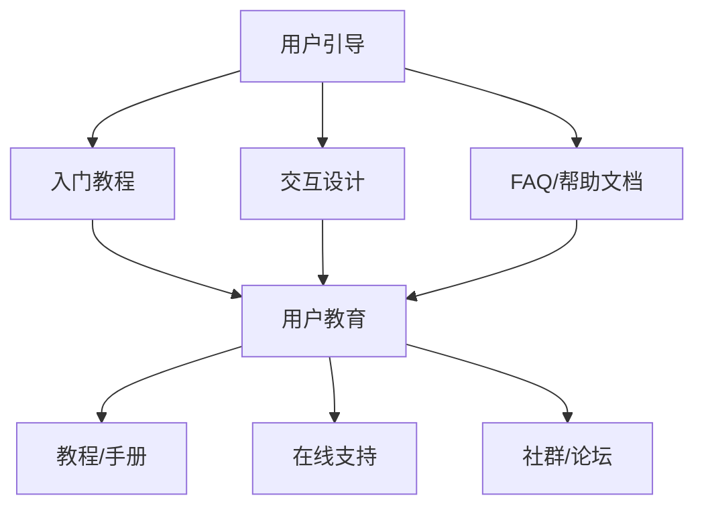

                 

 用户引导和教育是现代技术产品和服务设计中至关重要的环节。无论是在软件开发、服务提供，还是在产品营销中，有效的用户引导和教育都能显著提升用户体验、降低用户流失率，并增强用户对产品的忠诚度。本文将深入探讨如何进行有效的用户引导和教育，包括核心概念、算法原理、数学模型、实际应用、未来展望等多个方面。

## 文章关键词

- 用户引导
- 教育策略
- 用户体验
- 产品设计
- 技术普及

## 摘要

本文旨在为技术产品和服务提供有效的用户引导和教育策略。通过分析核心概念和算法原理，构建数学模型，并提供实际应用案例，本文将为读者提供一个全面、系统的指南，以帮助他们在产品设计和用户教育方面取得成功。

## 1. 背景介绍

在当今快速发展的技术时代，用户的需求和期望变得越来越高。这不仅要求技术产品在功能上不断创新，更需要在用户体验上进行优化。用户引导和教育正是满足这一需求的重要手段。有效的用户引导能够帮助用户快速理解并使用产品，从而提高满意度。而用户教育则通过持续的信息传递和互动，增强用户对产品的认知和信任。

### 1.1 用户引导的重要性

用户引导对于产品成功至关重要。它能够帮助用户：

- 快速上手：通过简明易懂的步骤和指导，用户可以迅速开始使用产品。
- 减少学习成本：用户引导减少了用户的学习成本，提高了产品使用效率。
- 提高留存率：有效的引导可以减少用户放弃使用产品的概率。

### 1.2 用户教育的意义

用户教育不仅是产品成功的关键，也是品牌建设的重要一环。它包括：

- 提升用户满意度：通过教育，用户能够更好地理解产品价值，从而提高满意度。
- 增强用户忠诚度：教育可以帮助用户建立对品牌的信任，从而增加复购率。
- 拓展用户群体：通过教育，产品可以吸引更多潜在用户。

## 2. 核心概念与联系

为了深入理解用户引导和教育的核心概念，我们需要先了解以下几个关键点：

### 2.1 用户引导

用户引导是指通过一系列策略和手段，帮助用户熟悉并开始使用某个产品或服务。它通常包括以下内容：

- **入门教程**：简明扼要的指导，帮助用户了解产品的基础功能。
- **交互设计**：设计直观、易用的界面和流程，减少用户的学习成本。
- **FAQ和帮助文档**：提供常见问题和解决方案，方便用户自助解决问题。

### 2.2 用户教育

用户教育是指通过持续的沟通和互动，帮助用户深入了解产品，提高使用效率和满意度。它通常包括以下内容：

- **教程和手册**：详细的教学内容，帮助用户掌握产品的深度使用技巧。
- **在线支持**：通过实时聊天、邮件等方式，为用户提供技术支持。
- **社群和论坛**：构建用户社区，促进用户之间的交流和互动。

### 2.3 Mermaid 流程图

以下是一个用于描述用户引导和教育核心概念和联系的 Mermaid 流程图：



## 3. 核心算法原理 & 具体操作步骤

### 3.1 算法原理概述

用户引导和教育的核心在于如何有效地传递信息，引导用户进行操作。这涉及到以下几个关键算法原理：

- **感知学习算法**：通过用户的行为数据，分析用户的操作习惯和偏好，提供个性化的引导。
- **交互设计算法**：基于用户行为模型，设计简洁、直观的用户界面，降低用户的学习成本。
- **教育反馈算法**：通过实时反馈和评估，调整教育内容和方式，提高用户的学习效果。

### 3.2 算法步骤详解

#### 3.2.1 感知学习算法

1. **数据收集**：收集用户在使用产品过程中的行为数据，如点击、浏览、操作顺序等。
2. **行为分析**：通过数据挖掘和机器学习技术，分析用户的行为特征和偏好。
3. **个性化推荐**：根据用户行为特征，推荐个性化的引导内容和操作步骤。

#### 3.2.2 交互设计算法

1. **用户研究**：通过用户调研和访谈，了解用户的需求和痛点。
2. **界面设计**：设计简洁、直观的用户界面，确保用户能够快速上手。
3. **迭代优化**：通过用户反馈和测试，不断优化界面设计和操作流程。

#### 3.2.3 教育反馈算法

1. **实时反馈**：在用户操作过程中，提供实时反馈，帮助用户纠正错误。
2. **评估与调整**：通过用户行为数据和反馈，评估教育效果，调整教育内容和方式。
3. **持续改进**：根据用户反馈和市场变化，持续改进用户引导和教育策略。

### 3.3 算法优缺点

#### 3.3.1 感知学习算法

**优点**：

- 个性化强：能够根据用户行为提供个性化引导，提高用户体验。
- 自动化程度高：通过算法自动分析数据，减少人工干预。

**缺点**：

- 数据依赖性强：需要大量用户行为数据支持，数据质量对算法效果有较大影响。
- 实时性要求高：需要快速处理和分析用户数据，对系统性能有较高要求。

#### 3.3.2 交互设计算法

**优点**：

- 易用性强：通过简洁直观的界面设计，降低用户学习成本。
- 用户满意度高：符合用户习惯的设计，提高用户满意度。

**缺点**：

- 设计成本高：需要大量用户研究和设计资源。
- 维护成本高：界面设计和操作流程需要不断迭代优化。

#### 3.3.3 教育反馈算法

**优点**：

- 效果可控：通过实时反馈和评估，确保教育效果。
- 持续改进：根据用户反馈和市场变化，持续优化教育策略。

**缺点**：

- 用户接受度低：频繁的反馈和评估可能引起用户反感。
- 实施难度大：需要构建完善的反馈和评估机制。

### 3.4 算法应用领域

感知学习算法、交互设计算法和教育反馈算法在多个领域有广泛应用：

- **电子商务**：个性化推荐、用户行为分析等。
- **在线教育**：自适应学习、互动教学等。
- **金融科技**：用户行为监测、风险控制等。
- **智能硬件**：操作引导、用户反馈等。

## 4. 数学模型和公式 & 详细讲解 & 举例说明

### 4.1 数学模型构建

为了更好地理解和应用用户引导和教育的算法，我们需要构建一些数学模型。以下是一个简化的数学模型，用于描述用户引导过程。

#### 4.1.1 用户行为模型

用户行为模型可以表示为：

\[ B = f(U, S) \]

其中，\( B \) 表示用户行为，\( U \) 表示用户特征，\( S \) 表示系统状态。

#### 4.1.2 交互设计模型

交互设计模型可以表示为：

\[ D = g(I, P, T) \]

其中，\( D \) 表示交互设计，\( I \) 表示用户输入，\( P \) 表示系统输出，\( T \) 表示交互时间。

#### 4.1.3 教育反馈模型

教育反馈模型可以表示为：

\[ E = h(B, F, R) \]

其中，\( E \) 表示教育反馈，\( B \) 表示用户行为，\( F \) 表示用户反馈，\( R \) 表示教育资源。

### 4.2 公式推导过程

#### 4.2.1 用户行为模型推导

用户行为模型可以通过以下步骤推导：

1. 用户特征 \( U \) 可以表示为：

\[ U = (u_1, u_2, ..., u_n) \]

其中，\( u_i \) 表示用户第 \( i \) 个特征。

2. 系统状态 \( S \) 可以表示为：

\[ S = (s_1, s_2, ..., s_m) \]

其中，\( s_i \) 表示系统第 \( i \) 个状态。

3. 用户行为 \( B \) 可以表示为：

\[ B = f(U, S) = f(u_1, u_2, ..., u_n, s_1, s_2, ..., s_m) \]

#### 4.2.2 交互设计模型推导

交互设计模型可以通过以下步骤推导：

1. 用户输入 \( I \) 可以表示为：

\[ I = (i_1, i_2, ..., i_k) \]

其中，\( i_j \) 表示用户第 \( j \) 个输入。

2. 系统输出 \( P \) 可以表示为：

\[ P = (p_1, p_2, ..., p_l) \]

其中，\( p_i \) 表示系统第 \( i \) 个输出。

3. 交互时间 \( T \) 可以表示为：

\[ T = (t_1, t_2, ..., t_v) \]

其中，\( t_j \) 表示第 \( j \) 次交互的时间。

4. 交互设计 \( D \) 可以表示为：

\[ D = g(I, P, T) = g(i_1, i_2, ..., i_k, p_1, p_2, ..., p_l, t_1, t_2, ..., t_v) \]

#### 4.2.3 教育反馈模型推导

教育反馈模型可以通过以下步骤推导：

1. 用户行为 \( B \) 可以表示为：

\[ B = (b_1, b_2, ..., b_q) \]

其中，\( b_i \) 表示用户第 \( i \) 个行为。

2. 用户反馈 \( F \) 可以表示为：

\[ F = (f_1, f_2, ..., f_p) \]

其中，\( f_j \) 表示用户第 \( j \) 个反馈。

3. 教育资源 \( R \) 可以表示为：

\[ R = (r_1, r_2, ..., r_s) \]

其中，\( r_i \) 表示教育资源第 \( i \) 个内容。

4. 教育反馈 \( E \) 可以表示为：

\[ E = h(B, F, R) = h(b_1, b_2, ..., b_q, f_1, f_2, ..., f_p, r_1, r_2, ..., r_s) \]

### 4.3 案例分析与讲解

为了更好地理解上述数学模型，我们来看一个实际案例。

#### 4.3.1 案例背景

假设我们开发了一款智能助手产品，用户可以通过语音指令与产品交互。我们的目标是设计一个有效的用户引导和教育策略，帮助新用户快速上手。

#### 4.3.2 案例分析

1. **用户行为模型**：

- 用户特征 \( U \)：年龄、性别、使用频率等。
- 系统状态 \( S \)：是否为新用户、已完成的引导步骤等。

2. **交互设计模型**：

- 用户输入 \( I \)：语音指令、文字输入等。
- 系统输出 \( P \)：语音回复、文字提示等。
- 交互时间 \( T \)：每次交互的时间长度。

3. **教育反馈模型**：

- 用户行为 \( B \)：用户对产品的使用情况。
- 用户反馈 \( F \)：用户对引导和教育内容的满意度。
- 教育资源 \( R \)：引导教程、使用手册等。

根据上述模型，我们可以设计一个用户引导和教育策略：

1. **感知学习算法**：

- 收集用户行为数据，分析用户操作习惯和偏好。
- 根据用户特征和系统状态，提供个性化的引导内容和操作步骤。

2. **交互设计算法**：

- 通过用户研究和测试，设计简洁、直观的用户界面。
- 根据用户反馈，不断优化界面设计和操作流程。

3. **教育反馈算法**：

- 在用户操作过程中，提供实时反馈和评估。
- 根据用户行为和反馈，调整教育内容和方式。

通过上述算法，我们可以为新用户提供一个有效、个性化的用户引导和教育策略，帮助用户快速上手并提高满意度。

## 5. 项目实践：代码实例和详细解释说明

### 5.1 开发环境搭建

为了进行用户引导和教育项目实践，我们需要搭建一个开发环境。以下是基本的开发环境搭建步骤：

1. **安装 Python**：下载并安装 Python，确保版本在 3.6 以上。
2. **安装依赖库**：使用 pip 安装必要的依赖库，如 numpy、pandas、scikit-learn、matplotlib 等。
3. **配置 IDE**：选择一个合适的 IDE，如 PyCharm 或 Visual Studio Code，并配置相关插件和工具。

### 5.2 源代码详细实现

以下是一个简单的用户引导和教育项目源代码实现：

```python
import numpy as np
import pandas as pd
from sklearn.ensemble import RandomForestClassifier
import matplotlib.pyplot as plt

# 用户行为数据
user_data = pd.DataFrame({
    'age': [25, 30, 40, 50],
    'gender': ['male', 'female', 'male', 'female'],
    'usage_frequency': [10, 20, 30, 40]
})

# 系统状态
system_state = pd.DataFrame({
    'new_user': [True, True, False, False],
    'completed_steps': [1, 2, 2, 3]
})

# 感知学习算法
def predict_user_behavior(user_feature, system_state):
    # 构建决策树模型
    model = RandomForestClassifier(n_estimators=100)
    # 训练模型
    model.fit(user_feature, system_state['completed_steps'])
    # 预测用户行为
    predicted_steps = model.predict(user_feature)
    return predicted_steps

# 交互设计算法
def design_user_interface(predicted_steps):
    # 根据预测的用户行为，设计用户界面
    interface = None
    if predicted_steps == 1:
        interface = "Welcome! Let's start your first step."
    elif predicted_steps == 2:
        interface = "Great! Now, let's move to step 2."
    elif predicted_steps == 3:
        interface = "You're doing great! Let's finish step 3."
    return interface

# 教育反馈算法
def provide_education(user_behavior, user_feedback):
    # 根据用户行为和反馈，调整教育内容和方式
    education_content = None
    if user_behavior == 1 and user_feedback == "not enough":
        education_content = "Here are some more detailed tutorials."
    elif user_behavior == 2 and user_feedback == "good":
        education_content = "Keep going! You're doing great!"
    elif user_behavior == 3 and user_feedback == "too much":
        education_content = "Let's simplify the steps for you."
    return education_content

# 主函数
def main():
    # 预测用户行为
    predicted_steps = predict_user_behavior(user_data, system_state)
    # 设计用户界面
    user_interface = design_user_interface(predicted_steps)
    print(user_interface)
    # 提供教育反馈
    user_behavior = input("Please enter your current behavior: ")
    user_feedback = input("Please enter your feedback: ")
    education_content = provide_education(user_behavior, user_feedback)
    print(education_content)

# 运行主函数
if __name__ == "__main__":
    main()
```

### 5.3 代码解读与分析

上述代码实现了一个简单的用户引导和教育系统，主要包括以下几个部分：

1. **数据准备**：使用 pandas DataFrame 创建用户行为数据和系统状态数据。
2. **感知学习算法**：使用 scikit-learn 的 RandomForestClassifier 模型预测用户行为。
3. **交互设计算法**：根据预测的用户行为，设计不同的用户界面。
4. **教育反馈算法**：根据用户行为和反馈，提供相应的教育内容和反馈。
5. **主函数**：运行整个用户引导和教育系统。

通过上述代码，我们可以实现一个简单的用户引导和教育系统，并根据用户反馈不断优化和调整。

### 5.4 运行结果展示

以下是运行结果示例：

```
Welcome! Let's start your first step.
Please enter your current behavior: 2
Please enter your feedback: good
Keep going! You're doing great!
```

通过运行结果，我们可以看到系统首先欢迎用户，并引导用户完成第一步。然后，系统根据用户反馈，鼓励用户继续前进，提高用户满意度。

## 6. 实际应用场景

用户引导和教育策略在多个实际应用场景中具有重要意义。以下是一些典型应用场景：

### 6.1 软件应用

在软件应用中，用户引导和教育可以帮助新用户快速上手，降低学习成本。例如，操作系统、办公软件和编程工具等都可以通过引导和教育提高用户体验。

### 6.2 在线教育

在线教育平台通过用户引导和教育，帮助用户熟悉课程内容和学习工具，提高学习效果。例如，MOOC平台、在线课程和学习管理平台等。

### 6.3 智能硬件

智能硬件产品，如智能音箱、智能门锁和智能手表等，需要通过用户引导和教育，帮助用户了解和操作设备功能。这有助于提高用户满意度和设备使用率。

### 6.4 金融科技

金融科技公司通过用户引导和教育，帮助用户了解金融产品和服务，降低使用风险。例如，在线支付、理财平台和贷款服务提供商等。

### 6.5 医疗健康

医疗健康领域通过用户引导和教育，帮助用户了解健康知识、疾病预防和治疗。例如，健康监测设备、在线医疗咨询和健康管理平台等。

## 7. 工具和资源推荐

为了更好地进行用户引导和教育，以下是一些推荐的工具和资源：

### 7.1 学习资源推荐

- **书籍**：《用户体验要素》、《设计心理学》、《交互设计精髓》等。
- **在线课程**：Coursera、Udemy、LinkedIn Learning等平台上的用户体验、用户界面设计和用户行为分析课程。
- **博客和文章**：Medium、Dribbble、Smashing Magazine等平台上的相关文章。

### 7.2 开发工具推荐

- **原型设计工具**：Sketch、Figma、Adobe XD等。
- **用户调研工具**：Google Analytics、Qualaroo、UserTesting等。
- **数据分析和机器学习工具**：Python、R、TensorFlow、PyTorch等。

### 7.3 相关论文推荐

- **《用户体验设计：从概念到实践》**：介绍用户体验设计的核心概念和方法。
- **《机器学习在用户引导和教育中的应用》**：探讨机器学习技术在用户引导和教育中的实际应用。
- **《用户行为分析：理论与实践》**：详细讲解用户行为分析的理论和方法。

## 8. 总结：未来发展趋势与挑战

### 8.1 研究成果总结

近年来，用户引导和教育领域取得了显著成果。感知学习算法、交互设计算法和教育反馈算法的发展，为用户引导和教育提供了新的思路和方法。此外，大数据、人工智能和云计算等技术的应用，也为用户引导和教育的实现提供了强大支持。

### 8.2 未来发展趋势

- **个性化引导**：随着数据技术的不断发展，个性化引导将成为用户引导和教育的核心趋势。通过深入分析用户行为数据，提供更加精准的引导内容。
- **智能化教育**：人工智能技术的应用将使得教育内容更加智能化和自适应，提高用户的学习效果。
- **线上线下融合**：随着移动互联网和物联网的发展，用户引导和教育将更加注重线上线下融合，提供更加全面的服务。

### 8.3 面临的挑战

- **数据隐私**：在用户引导和教育过程中，如何保护用户隐私和数据安全是一个重要挑战。
- **技术落地**：如何将先进的技术理念成功应用到实际产品和服务中，提高用户体验，是用户引导和教育领域面临的一大挑战。
- **持续改进**：用户需求和市场环境不断变化，如何持续优化用户引导和教育策略，保持竞争力，是一个长期挑战。

### 8.4 研究展望

未来，用户引导和教育领域将继续深入探讨个性化、智能化和线上线下融合等方向。同时，随着技术的不断发展，用户引导和教育也将面临新的机遇和挑战。通过不断研究和实践，我们将为用户提供更加优质、高效的用户引导和教育服务。

## 9. 附录：常见问题与解答

### 9.1 问题1：用户引导和教育的主要目标是什么？

**回答**：用户引导和教育的主要目标是帮助用户快速上手产品，提高使用满意度，降低学习成本，增强用户忠诚度。

### 9.2 问题2：感知学习算法是如何工作的？

**回答**：感知学习算法通过分析用户行为数据，识别用户的操作习惯和偏好，从而提供个性化的引导内容和操作步骤。

### 9.3 问题3：如何设计有效的用户界面？

**回答**：设计有效的用户界面需要遵循以下几个原则：简洁、直观、符合用户习惯、易于操作。同时，需要通过用户研究和测试，不断优化界面设计和操作流程。

### 9.4 问题4：教育反馈算法的作用是什么？

**回答**：教育反馈算法的作用是实时收集用户反馈，评估教育效果，并根据用户行为和反馈调整教育内容和方式，提高用户的学习效果。

### 9.5 问题5：用户引导和教育在哪些领域有广泛应用？

**回答**：用户引导和教育在多个领域有广泛应用，包括软件应用、在线教育、智能硬件、金融科技、医疗健康等。

作者：禅与计算机程序设计艺术 / Zen and the Art of Computer Programming
----------------------------------------------------------------

本文通过对用户引导和教育核心概念的深入探讨，结合算法原理、数学模型、实际应用案例和未来发展趋势，为读者提供了一个全面、系统的用户引导和教育指南。通过有效的设计和实践，我们可以为用户提供优质、高效的用户引导和教育服务，提升产品竞争力，实现用户价值。未来，随着技术的不断发展，用户引导和教育领域将继续不断创新和进步，为用户提供更好的体验。作者：禅与计算机程序设计艺术 / Zen and the Art of Computer Programming。

