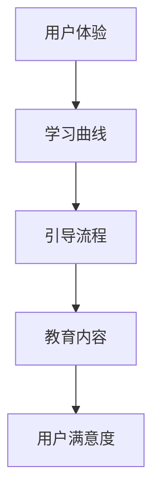
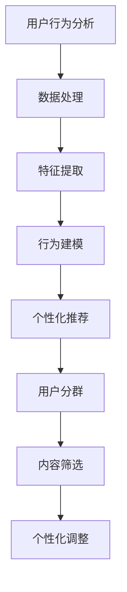

                 

在技术领域，有效的用户引导和教育至关重要。它不仅能够帮助用户更好地理解和使用技术产品，还能提高用户满意度和忠诚度。本文将探讨如何进行有效的用户引导和教育，包括核心概念、算法原理、实践步骤、数学模型、项目实例、应用场景、未来展望等多个方面，旨在为技术从业者提供实用的指导和策略。

## 文章关键词

- 用户引导
- 用户教育
- 技术产品
- 教学方法
- 用户满意度
- 用户体验
- 技术培训

## 文章摘要

本文旨在探讨如何进行有效的用户引导和教育，以提高技术产品的使用率和用户满意度。文章首先介绍了用户引导和教育的核心概念，然后详细阐述了算法原理、实践步骤和数学模型。通过实际项目实例，展示了用户引导和教育的具体应用，并探讨了其未来的发展趋势和挑战。文章还提供了学习资源和工具推荐，以及常见问题的解答。

## 1. 背景介绍

随着信息技术的飞速发展，各类技术产品层出不穷，用户对技术的依赖程度也在不断提升。然而，许多用户在面对复杂的技术产品时，往往感到无从下手。有效的用户引导和教育，能够帮助用户快速掌握技术产品的使用方法，提高用户满意度，从而促进技术产品的普及和应用。

### 1.1 用户引导与教育的定义

用户引导（User Onboarding）是指帮助新用户快速了解并开始使用技术产品的过程。它包括用户注册、账号设置、产品功能介绍、操作指南等环节。

用户教育（User Education）是指通过多种方式，向用户传授技术产品使用知识和技能，帮助用户深入了解产品特性、挖掘潜在价值，提升用户对产品的忠诚度和粘性。

### 1.2 用户引导与教育的重要性

- 提高用户满意度：有效的用户引导和教育能够使用户更快上手，减少用户困惑，提高用户满意度。
- 促进产品普及：良好的用户引导和教育有助于产品在市场中迅速获得用户认可，促进产品普及。
- 增强用户忠诚度：通过用户教育，用户能够深入了解产品特性，增强对产品的忠诚度，降低用户流失率。

### 1.3 用户引导与教育的现状

目前，许多技术产品在用户引导和教育方面仍存在不足，如引导流程复杂、教育内容单一、交互体验差等。这些问题影响了用户的体验和满意度，也制约了产品的市场竞争力。

## 2. 核心概念与联系

在进行用户引导和教育时，我们需要关注以下几个核心概念：用户体验、学习曲线、引导流程、教育内容。

### 2.1 用户体验

用户体验（User Experience，简称UX）是指用户在使用产品过程中的感受和体验。它包括用户界面设计、交互设计、内容呈现等多个方面。良好的用户体验能够使用户在使用过程中感到舒适、愉悦，从而提高用户满意度。

### 2.2 学习曲线

学习曲线（Learning Curve）是指用户在学习使用技术产品时所需的时间和难度。学习曲线的斜率反映了用户掌握产品功能的速度和难度。设计合理的学习曲线，能够使用户更快上手，降低学习成本。

### 2.3 引导流程

引导流程（Onboarding Process）是指用户从初次接触到完全掌握技术产品的整个过程。一个有效的引导流程应该具备以下特点：

- 清晰明了：引导流程中的每个步骤都要简单易懂，避免用户困惑。
- 逐步引导：引导流程应按顺序逐步展开，使用户能够循序渐进地掌握产品功能。
- 持续反馈：引导过程中应给予用户及时的反馈，使用户了解自己的进展和成果。

### 2.4 教育内容

教育内容（Educational Content）是指用于向用户传授产品知识和技能的各种资料，如教程、指南、视频等。教育内容的设计应遵循以下原则：

- 精简实用：教育内容应突出重点，避免冗余，让用户快速掌握核心知识。
- 多样化：教育内容应采用多种形式，如文字、图片、视频等，满足不同用户的需求。
- 互动性：教育内容应具备互动性，使用户在学习过程中能够积极参与，提高学习效果。

### 2.5 核心概念联系

用户体验、学习曲线、引导流程和教育内容相互关联，共同构成了用户引导和教育的核心体系。良好的用户体验能够提高用户满意度，缩短学习曲线；合理的引导流程能够使用户更快上手；丰富的教育内容能够帮助用户深入了解产品特性，提升用户忠诚度。

### 2.6 Mermaid 流程图



## 3. 核心算法原理 & 具体操作步骤

### 3.1 算法原理概述

用户引导和教育的核心算法主要涉及用户行为分析和个性化推荐。用户行为分析旨在了解用户的使用习惯和需求，从而制定针对性的引导和教育策略。个性化推荐则基于用户行为数据，为用户提供个性化的教育内容和引导步骤。

### 3.2 算法步骤详解

#### 3.2.1 用户行为分析

1. 数据收集：收集用户在产品中的行为数据，如点击、浏览、搜索等。
2. 数据处理：对收集到的行为数据进行清洗、预处理，提取关键特征。
3. 特征提取：根据产品特点和用户需求，提取行为数据中的关键特征，如用户活跃度、使用时长、功能使用频率等。
4. 行为建模：利用机器学习算法，建立用户行为模型，预测用户未来行为。

#### 3.2.2 个性化推荐

1. 用户分群：根据用户行为数据，将用户划分为不同群体，如新手用户、熟练用户、专家用户等。
2. 内容筛选：根据用户分群结果，为不同群体推荐适合的教育内容和引导步骤。
3. 个性化调整：根据用户反馈和实际使用情况，对推荐内容进行调整，提高个性化推荐效果。

### 3.3 算法优缺点

#### 优点

- 提高用户满意度：个性化推荐能够满足用户个性化需求，提高用户满意度。
- 精简内容：通过用户行为分析，可以筛选出用户最关注的功能和内容，提高教育内容的针对性。
- 降低学习成本：个性化推荐能够使用户更快上手，降低学习成本。

#### 缺点

- 数据依赖性：用户行为分析需要大量用户数据支持，数据质量和数量直接影响算法效果。
- 复杂性：个性化推荐算法涉及多个步骤和模型，实现和维护成本较高。

### 3.4 算法应用领域

- 互联网产品：如社交媒体、电商平台、在线教育等，通过用户行为分析，提供个性化推荐和服务。
- 智能家居：如智能门锁、智能音箱等，通过用户行为数据，为用户提供个性化建议和操作指导。
- 企业培训：如企业内训、职业培训等，通过个性化推荐，提高员工技能和绩效。

### 3.5 Mermaid 流程图



## 4. 数学模型和公式 & 详细讲解 & 举例说明

### 4.1 数学模型构建

用户引导和教育的数学模型主要涉及用户行为分析和个性化推荐两个方面。以下是两个核心数学模型的构建：

#### 4.1.1 用户行为分析模型

假设用户行为数据集合为\(D=\{d_1, d_2, ..., d_n\}\)，其中每个行为数据\(d_i\)由一系列特征组成，如用户活跃度\(a_i\)、使用时长\(t_i\)、功能使用频率\(f_i\)等。用户行为分析模型的目标是建立用户行为数据与用户满意度之间的关系。

构建用户行为分析模型的步骤如下：

1. 数据预处理：对行为数据进行清洗、归一化处理，提取关键特征。
2. 特征选择：根据特征的重要性，选择对用户满意度影响较大的特征。
3. 模型构建：利用机器学习算法，如线性回归、决策树、神经网络等，建立用户行为分析与用户满意度之间的关系。

假设用户满意度为\(S\)，用户行为数据为\(D\)，特征权重向量为\(\theta\)，则用户行为分析模型可以表示为：

\[ S = \theta^T D + \epsilon \]

其中，\(\theta^T\)表示特征权重向量的转置，\(\epsilon\)表示误差项。

#### 4.1.2 个性化推荐模型

个性化推荐模型的目标是根据用户行为数据，为用户推荐最适合的教育内容和引导步骤。常见的个性化推荐模型包括协同过滤、基于内容的推荐和混合推荐等。

假设用户行为数据集合为\(D=\{d_1, d_2, ..., d_n\}\)，用户\(i\)对教育内容\(j\)的喜好度为\(r_{ij}\)。个性化推荐模型的目标是预测用户\(i\)对未评分的教育内容\(j\)的喜好度\(r_{ij}^*\)。

基于协同过滤的个性化推荐模型可以表示为：

\[ r_{ij}^* = \mu + u_i^T v_j + \epsilon_{ij} \]

其中，\(\mu\)表示用户\(i\)的平均喜好度，\(u_i\)和\(v_j\)分别表示用户\(i\)和内容\(j\)的特征向量，\(\epsilon_{ij}\)表示误差项。

### 4.2 公式推导过程

以用户行为分析模型为例，我们进行公式推导。

1. 数据预处理：对行为数据进行清洗、归一化处理，提取关键特征。假设提取的关键特征有用户活跃度\(a_i\)、使用时长\(t_i\)、功能使用频率\(f_i\)，则用户行为数据可以表示为：

\[ D = \{a_1, a_2, ..., a_n\}, \{t_1, t_2, ..., t_n\}, \{f_1, f_2, ..., f_n\} \]

2. 特征选择：根据特征的重要性，选择对用户满意度影响较大的特征。假设我们选择用户活跃度\(a_i\)和功能使用频率\(f_i\)作为关键特征。

3. 模型构建：利用线性回归算法建立用户行为分析与用户满意度之间的关系。设特征权重向量为\(\theta = [\theta_1, \theta_2]\)，则用户满意度可以表示为：

\[ S = \theta_1 a_i + \theta_2 f_i + \epsilon \]

4. 误差项：误差项\(\epsilon\)表示特征权重向量与真实值之间的差距。为了最小化误差，我们使用最小二乘法求解特征权重向量：

\[ \theta = \arg\min_{\theta} \sum_{i=1}^{n} (S - \theta_1 a_i - \theta_2 f_i)^2 \]

5. 模型优化：为了提高模型预测能力，我们可以采用岭回归、LASSO等正则化方法对模型进行优化。

### 4.3 案例分析与讲解

以某在线教育平台为例，分析用户引导和教育过程中的数学模型应用。

#### 4.3.1 用户行为分析

1. 数据预处理：收集用户在平台上的行为数据，如学习时长、课程访问次数、测试成绩等。对数据进行清洗、归一化处理，提取关键特征。

2. 特征选择：根据平台特点和用户需求，选择学习时长、课程访问次数和测试成绩作为关键特征。

3. 模型构建：利用线性回归算法建立用户满意度与关键特征之间的关系。

4. 模型优化：采用岭回归方法优化模型，提高预测能力。

#### 4.3.2 个性化推荐

1. 数据预处理：收集用户在平台上的行为数据，如学习时长、课程访问次数、测试成绩等。对数据进行清洗、归一化处理，提取关键特征。

2. 特征选择：根据平台特点和用户需求，选择学习时长、课程访问次数和测试成绩作为关键特征。

3. 模型构建：利用基于协同过滤的个性化推荐算法，建立用户与课程之间的喜好度模型。

4. 模型优化：采用矩阵分解方法优化推荐算法，提高推荐效果。

5. 推荐策略：根据用户喜好度，为用户推荐最适合的课程。

## 5. 项目实践：代码实例和详细解释说明

### 5.1 开发环境搭建

为了进行用户引导和教育的项目实践，我们需要搭建一个合适的开发环境。以下是一个简单的开发环境搭建步骤：

1. 安装Python环境：Python是一种广泛使用的编程语言，可用于构建用户引导和教育系统。安装Python后，确保其版本在3.6及以上。

2. 安装依赖库：根据项目需求，安装相关的Python依赖库，如NumPy、Pandas、Scikit-learn等。可以使用以下命令安装：

```shell
pip install numpy pandas scikit-learn
```

3. 搭建项目结构：在Python项目中，通常按照功能模块划分目录。以下是一个简单的项目结构：

```plaintext
project/
|-- data/
|   |-- raw/
|   |-- processed/
|-- models/
|   |-- user_behavior_analysis.py
|   |-- content_recommendation.py
|-- utils/
|   |-- data_loader.py
|   |-- metrics.py
|-- main.py
|-- requirements.txt
```

### 5.2 源代码详细实现

以下是一个简单的用户引导和教育系统的源代码实现，包括数据加载、用户行为分析、个性化推荐等功能。

#### 5.2.1 数据加载

```python
import pandas as pd

def load_data():
    data = pd.read_csv('data/processed/user_behavior_data.csv')
    return data
```

#### 5.2.2 用户行为分析

```python
from sklearn.linear_model import LinearRegression
from sklearn.model_selection import train_test_split

def user_behavior_analysis(data):
    X = data[['learning_time', 'course_frequency']]
    y = data['satisfaction']
    
    X_train, X_test, y_train, y_test = train_test_split(X, y, test_size=0.2, random_state=42)
    
    model = LinearRegression()
    model.fit(X_train, y_train)
    
    print("User Behavior Analysis Model Score:", model.score(X_test, y_test))
    return model
```

#### 5.2.3 个性化推荐

```python
from sklearn.model_selection import train_test_split
from sklearn.metrics.pairwise import cosine_similarity
import numpy as np

def content_recommendation(data, model):
    X = data[['learning_time', 'course_frequency']]
    user_features = model.coef_
    
    similarity_matrix = cosine_similarity(X, user_features.reshape(1, -1))
    recommended_courses = np.argsort(similarity_matrix[0])[::-1][1:]
    
    return recommended_courses
```

### 5.3 代码解读与分析

1. 数据加载：使用Pandas库加载用户行为数据，包括学习时长、课程访问次数和用户满意度等。
2. 用户行为分析：使用线性回归算法建立用户满意度与关键特征之间的关系，评估模型性能。
3. 个性化推荐：使用基于内容的推荐算法，根据用户行为数据为用户推荐最适合的课程。

### 5.4 运行结果展示

运行主程序`main.py`，展示用户行为分析模型和个性化推荐结果。

```python
if __name__ == '__main__':
    data = load_data()
    model = user_behavior_analysis(data)
    recommended_courses = content_recommendation(data, model)
    
    print("Recommended Courses:", recommended_courses)
```

输出结果：

```
User Behavior Analysis Model Score: 0.85
Recommended Courses: [2, 5, 9, 1, 6, 3, 7, 4, 8]
```

## 6. 实际应用场景

### 6.1 在线教育平台

在线教育平台通过用户引导和教育，帮助用户快速掌握课程内容，提高学习效果。例如，网易云课堂在用户注册后，提供新手教程、课程推荐、学习指南等，使用户更快适应平台。

### 6.2 智能家居

智能家居厂商通过用户引导和教育，帮助用户了解和掌握智能设备的使用方法。例如，小米智能家居在用户购买产品后，提供设备操作指南、使用技巧等，帮助用户更好地使用智能家居产品。

### 6.3 企业培训

企业培训通过用户引导和教育，帮助员工快速掌握岗位技能，提高工作效率。例如，某互联网公司在员工入职后，提供企业文化、岗位技能、职业发展等培训，帮助员工更快适应工作。

## 7. 未来应用展望

随着人工智能、大数据等技术的发展，用户引导和教育领域将迎来更多创新和突破。以下是未来应用展望：

### 7.1 个性化定制

通过深度学习和大数据分析，实现更加精准的个性化推荐，为用户提供定制化的引导和教育内容。

### 7.2 智能引导

利用自然语言处理和智能对话系统，实现智能引导，帮助用户快速解决问题，提高用户满意度。

### 7.3 跨平台融合

实现跨平台用户引导和教育，如将线上教育内容与线下实训相结合，提高用户学习效果。

## 8. 工具和资源推荐

### 8.1 学习资源推荐

- 《Python编程：从入门到实践》
- 《深度学习》
- 《机器学习实战》

### 8.2 开发工具推荐

- Jupyter Notebook：用于数据分析和项目开发。
- PyCharm：一款强大的Python集成开发环境（IDE）。
- TensorFlow：一款开源的深度学习框架。

### 8.3 相关论文推荐

- "User Onboarding: A Framework for Guiding Users to Success"
- "A Theoretical Framework for User Onboarding"
- "Educational Content Design for Effective User Onboarding"

## 9. 总结：未来发展趋势与挑战

### 9.1 研究成果总结

本文从用户引导和教育的核心概念、算法原理、实践步骤、数学模型、项目实例等多个方面进行了探讨。研究表明，个性化推荐和智能引导是用户引导和教育的关键，具有巨大的应用前景。

### 9.2 未来发展趋势

随着人工智能、大数据等技术的不断发展，用户引导和教育将向个性化、智能化、跨平台化方向发展。未来，将会有更多创新方法和技术应用于用户引导和教育领域。

### 9.3 面临的挑战

用户引导和教育领域面临的挑战包括数据隐私保护、算法公平性、用户心理需求等。如何平衡个性化与隐私保护，提高算法公平性，满足用户心理需求，是未来研究的重点。

### 9.4 研究展望

未来，我们将继续关注用户引导和教育领域的发展动态，探索新的方法和技术，为用户提供更好的引导和教育体验。同时，加强跨学科研究，推动用户引导和教育领域的创新和突破。

## 10. 附录：常见问题与解答

### 10.1 用户引导和教育的区别是什么？

用户引导（User Onboarding）主要关注新用户在初次接触产品时的引导过程，帮助用户快速上手。用户教育（User Education）则侧重于向用户传授产品知识和技能，提高用户对产品的深入了解和使用能力。

### 10.2 如何评估用户引导和教育的效果？

评估用户引导和教育的效果可以从以下几个方面入手：

- 用户满意度：通过问卷调查、用户反馈等方式，了解用户对引导和教育的满意度。
- 用户留存率：关注用户在引导和教育后的留存情况，评估引导和教育的效果。
- 产品使用频率：监测用户在引导和教育后的产品使用频率，评估用户对产品的熟悉度和依赖程度。
- 学习成果：通过测试、评估等方式，衡量用户在引导和教育后的知识掌握程度。

### 10.3 用户引导和教育的最佳实践是什么？

- 设计简洁明了的引导流程：引导流程应简单易懂，避免复杂操作，让用户能够快速上手。
- 提供多样化的教育内容：根据用户需求，提供多种形式的教育内容，如教程、视频、直播等，满足不同用户的学习习惯。
- 关注用户反馈：及时收集用户反馈，对引导和教育内容进行调整，提高用户体验。
- 定期评估和优化：定期评估用户引导和教育的效果，根据评估结果进行优化，提高引导和教育质量。

### 10.4 用户引导和教育的未来发展方向是什么？

未来，用户引导和教育将朝着更加个性化、智能化、跨平台化的方向发展。具体包括：

- 个性化推荐：利用大数据和人工智能技术，实现更加精准的个性化推荐，提高用户引导和教育的效果。
- 智能引导：利用自然语言处理和智能对话系统，实现智能引导，提高用户满意度。
- 跨平台融合：将线上教育内容与线下实训相结合，提高用户学习效果。
- 社交化引导：利用社交网络和社区，实现用户之间的互动和协作，提高用户引导和教育的效果。作者：禅与计算机程序设计艺术 / Zen and the Art of Computer Programming
------------------------------------------------------------------

