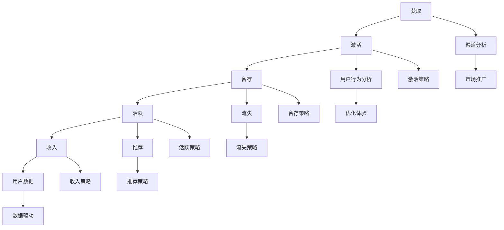

                 

用户生命周期管理（User Life Cycle Management，简称ULCM）是现代企业，尤其是以互联网为基础的服务行业中至关重要的一个环节。通过有效地管理用户生命周期，企业可以更好地理解用户行为，优化用户体验，提高用户满意度和忠诚度，从而在激烈的市场竞争中占据优势。本文将深入探讨用户生命周期的核心概念、管理策略以及具体实施步骤，旨在为企业和开发者提供实用的指导。

## 文章关键词

- 用户生命周期管理
- 用户体验
- 数据分析
- 客户关系管理
- 用户留存

## 文章摘要

本文首先介绍了用户生命周期的基本概念和重要性。随后，通过一个简明的Mermaid流程图，我们阐述了用户生命周期的各个阶段及其相互关系。接着，文章详细解析了用户生命周期管理的核心算法原理，并提供了数学模型和具体操作步骤。通过一个实际的项目实例，我们展示了如何将理论应用到实践中。最后，文章探讨了用户生命周期管理的实际应用场景，并提出了未来的发展趋势和面临的挑战。

## 1. 背景介绍

用户生命周期管理起源于市场营销领域，但在现代信息技术和大数据的推动下，它已经发展成为一个涵盖多个学科的综合体系。用户生命周期管理不仅关注用户从初次接触到最终离开的整个流程，还包括用户在使用产品或服务过程中的各种互动。有效管理用户生命周期，可以帮助企业实现以下目标：

- 提高用户满意度：通过理解用户需求和偏好，提供更个性化的服务，从而提升用户满意度。
- 增强用户忠诚度：通过有效的客户关系管理，保持用户的持续使用和长期忠诚。
- 优化营销策略：基于用户数据分析和行为模式，制定更具针对性的营销活动，提高转化率。
- 提升业务效率：通过自动化工具和智能算法，降低运营成本，提高业务效率。

## 2. 核心概念与联系

在探讨用户生命周期管理之前，有必要先明确几个核心概念，并展示它们之间的相互关系。

### 2.1 用户生命周期

用户生命周期是指用户与产品或服务互动的整个过程，通常包括以下几个阶段：

1. **获取（Acquisition）**：用户第一次接触到产品或服务，通过各种渠道获取信息。
2. **激活（Activation）**：用户首次使用产品或服务，开始体验其功能。
3. **留存（Retention）**：用户在一段时间内持续使用产品或服务，表明其对产品的认可。
4. **活跃（Engagement）**：用户积极参与到产品或服务的互动中，贡献内容或产生交易。
5. **收入（Revenue）**：用户通过产品或服务产生直接或间接的经济效益。
6. **推荐（Referral）**：用户通过口碑传播，推荐给其他人使用。
7. **流失（Churn）**：用户停止使用产品或服务，离开生命周期。

### 2.2 用户生命周期管理

用户生命周期管理是指在用户生命周期的各个阶段，企业采取的一系列策略和行动，以最大化用户价值。这包括：

- **获取策略**：通过各种渠道吸引用户关注，如广告、社交媒体、搜索引擎等。
- **激活策略**：通过引导用户完成首次使用，确保用户体验良好，提高留存率。
- **留存策略**：通过提供优质服务和持续互动，保持用户的持续使用。
- **活跃策略**：通过激励措施和个性化推荐，提高用户的参与度和活跃度。
- **收入策略**：通过优化定价策略、提供增值服务等方式，提高用户产生经济收益的几率。
- **推荐策略**：通过用户推荐机制，扩大用户基础和市场影响力。
- **流失策略**：通过数据分析，了解用户流失的原因，并采取相应措施挽回。

### 2.3 用户行为分析

用户行为分析是用户生命周期管理的重要基础。通过收集和分析用户的行为数据，企业可以：

- **了解用户需求**：通过分析用户行为，企业可以洞察用户的需求和偏好，从而提供更个性化的服务。
- **优化用户体验**：基于用户行为数据，企业可以优化产品功能和服务流程，提高用户体验。
- **预测用户流失**：通过分析用户行为模式，企业可以预测哪些用户可能流失，并提前采取措施挽回。

### 2.4 Mermaid流程图

为了更好地展示用户生命周期及其管理策略，我们可以使用Mermaid流程图来描述整个过程。

通过这个流程图，我们可以清晰地看到用户生命周期的各个阶段以及与之对应的管理策略。接下来，我们将深入探讨用户生命周期管理的核心算法原理。

## 3. 核心算法原理 & 具体操作步骤

### 3.1 算法原理概述

用户生命周期管理的核心在于通过算法和数据分析，对用户行为进行深入理解，并在此基础上进行策略优化。以下是几个关键算法原理：

1. **用户分群算法**：通过分析用户行为数据，将用户划分为不同的群体，以便制定有针对性的管理策略。
2. **用户流失预测算法**：利用机器学习技术，预测哪些用户可能会流失，并提前采取挽回措施。
3. **个性化推荐算法**：基于用户行为和历史数据，为用户推荐个性化内容，提高用户活跃度和留存率。
4. **A/B测试算法**：通过对比不同策略的效果，找到最优的管理方案。

### 3.2 算法步骤详解

#### 3.2.1 用户分群算法

1. **数据收集**：收集用户的基本信息、行为数据等。
2. **特征工程**：将原始数据转化为算法可以处理的特征向量。
3. **模型训练**：利用聚类算法（如K-Means）对用户进行分群。
4. **评估与优化**：评估分群效果，并进行模型优化。

#### 3.2.2 用户流失预测算法

1. **数据收集**：收集用户行为数据、用户属性数据等。
2. **特征选择**：选择与用户流失相关的特征。
3. **模型训练**：利用机器学习算法（如逻辑回归、决策树等）训练流失预测模型。
4. **模型评估**：通过交叉验证等方法评估模型性能。
5. **预测与预警**：对潜在流失用户进行预测，并发出预警。

#### 3.2.3 个性化推荐算法

1. **数据收集**：收集用户行为数据、内容数据等。
2. **特征提取**：提取用户和内容的特征向量。
3. **模型训练**：利用协同过滤、矩阵分解等算法训练推荐模型。
4. **推荐生成**：根据用户特征和内容特征生成个性化推荐结果。
5. **评估与优化**：评估推荐效果，并进行模型优化。

#### 3.2.4 A/B测试算法

1. **测试设计**：设计不同的实验组，分别应用不同的策略。
2. **数据收集**：收集实验数据。
3. **统计分析**：对实验结果进行统计分析。
4. **结果评估**：评估不同策略的效果，选择最优方案。

### 3.3 算法优缺点

#### 用户分群算法

- **优点**：有助于制定有针对性的用户管理策略，提高运营效率。
- **缺点**：分群过于细致可能导致资源浪费，分群不准确则可能导致策略失效。

#### 用户流失预测算法

- **优点**：可以提前发现潜在流失用户，采取挽回措施。
- **缺点**：预测准确性受数据质量和算法性能影响，且可能存在误报和漏报。

#### 个性化推荐算法

- **优点**：提高用户满意度和留存率，增加用户粘性。
- **缺点**：推荐结果可能过于单一，影响用户探索新内容的兴趣。

#### A/B测试算法

- **优点**：通过实验验证不同策略的效果，确保决策的科学性。
- **缺点**：测试过程耗时，且无法保证所有策略都适用。

### 3.4 算法应用领域

用户生命周期管理算法广泛应用于各类互联网服务中，包括但不限于：

- **电子商务平台**：通过用户分群和个性化推荐，提高用户购买转化率。
- **社交媒体**：通过用户流失预测，减少用户流失，提高用户活跃度。
- **在线教育平台**：通过个性化推荐和学习路径规划，提高用户学习效果。
- **金融服务业**：通过用户分群和流失预测，优化客户关系管理，提高客户满意度。

## 4. 数学模型和公式 & 详细讲解 & 举例说明

在用户生命周期管理中，数学模型和公式扮演着至关重要的角色。以下我们将详细介绍几个常用的数学模型和公式，并通过实际案例进行说明。

### 4.1 数学模型构建

#### 4.1.1 用户留存率模型

用户留存率是衡量用户持续使用产品或服务的重要指标。其计算公式为：

\[ 留存率 = \frac{t \text{ 个月后仍然活跃的用户数}}{t \text{ 个月初活跃的用户数}} \]

#### 4.1.2 用户流失预测模型

用户流失预测模型通常采用逻辑回归等机器学习算法。其公式为：

\[ P(Y=1) = \frac{1}{1 + e^{-(\beta_0 + \beta_1 X_1 + \beta_2 X_2 + \ldots + \beta_n X_n)}} \]

其中，\( Y \) 表示用户是否流失（1 表示流失，0 表示未流失），\( X_1, X_2, \ldots, X_n \) 为影响用户流失的特征，\( \beta_0, \beta_1, \beta_2, \ldots, \beta_n \) 为模型的参数。

#### 4.1.3 个性化推荐模型

个性化推荐模型通常采用协同过滤算法。其公式为：

\[ R_{ui} = \frac{\sum_{j \in N_i} r_{uj} \cdot s_{ij}}{\sum_{j \in N_i} s_{ij}} \]

其中，\( R_{ui} \) 表示用户 \( u \) 对项目 \( i \) 的评分预测，\( N_i \) 表示与项目 \( i \) 相似的项目集合，\( r_{uj} \) 表示用户 \( u \) 对项目 \( j \) 的实际评分，\( s_{ij} \) 表示项目 \( i \) 和项目 \( j \) 的相似度。

### 4.2 公式推导过程

#### 4.2.1 用户留存率模型推导

用户留存率的推导过程如下：

假设 \( u \) 为用户在时间 \( t \) 时刻的用户数，\( u_t \) 为 \( t \) 个月初的用户数，\( u_{t+1} \) 为 \( t+1 \) 个月初的用户数。用户留存率定义为：

\[ 留存率 = \frac{u_{t+1}}{u_t} \]

为了推导该公式，我们可以考虑以下两种情况：

1. 用户在 \( t \) 时刻活跃，并在 \( t+1 \) 时刻仍然活跃：这种情况下，用户数在 \( t+1 \) 个月初不变，即 \( u_{t+1} = u_t \)。
2. 用户在 \( t \) 时刻活跃，但在 \( t+1 \) 时刻不再活跃：这种情况下，用户数在 \( t+1 \) 个月初减少一个用户，即 \( u_{t+1} = u_t - 1 \)。

因此，用户留存率可以表示为：

\[ 留存率 = \frac{u_{t+1}}{u_t} = \frac{u_t - (u_t - u_{t+1})}{u_t} = 1 - \frac{u_t - u_{t+1}}{u_t} \]

#### 4.2.2 用户流失预测模型推导

用户流失预测模型通常基于逻辑回归算法。其推导过程如下：

假设 \( Y \) 表示用户是否流失（1 表示流失，0 表示未流失），\( X_1, X_2, \ldots, X_n \) 为影响用户流失的特征。逻辑回归模型公式为：

\[ P(Y=1) = \frac{1}{1 + e^{-(\beta_0 + \beta_1 X_1 + \beta_2 X_2 + \ldots + \beta_n X_n)}} \]

其中，\( \beta_0, \beta_1, \beta_2, \ldots, \beta_n \) 为模型的参数。

为了推导该公式，我们可以考虑以下两个极端情况：

1. 当所有特征 \( X_1, X_2, \ldots, X_n \) 都取最小值时，即 \( X_1 = X_2 = \ldots = X_n = 0 \)，则有：

\[ P(Y=1) = \frac{1}{1 + e^{-(\beta_0 + \beta_1 \cdot 0 + \beta_2 \cdot 0 + \ldots + \beta_n \cdot 0)}} = \frac{1}{1 + e^{-\beta_0}} \]

此时，\( P(Y=1) \) 表示用户未流失的概率。

2. 当所有特征 \( X_1, X_2, \ldots, X_n \) 都取最大值时，即 \( X_1 = X_2 = \ldots = X_n = 1 \)，则有：

\[ P(Y=1) = \frac{1}{1 + e^{-(\beta_0 + \beta_1 \cdot 1 + \beta_2 \cdot 1 + \ldots + \beta_n \cdot 1)}} = \frac{1}{1 + e^{-(\beta_0 + \beta_1 + \beta_2 + \ldots + \beta_n)}} \]

此时，\( P(Y=1) \) 表示用户流失的概率。

通过调整参数 \( \beta_0, \beta_1, \beta_2, \ldots, \beta_n \) 的值，我们可以得到不同的用户流失概率。在实际应用中，通常会使用梯度下降等优化算法来求解这些参数。

#### 4.2.3 个性化推荐模型推导

个性化推荐模型通常采用协同过滤算法。其推导过程如下：

假设用户 \( u \) 对项目 \( i \) 的评分为 \( r_{ui} \)，项目 \( i \) 和项目 \( j \) 的相似度为 \( s_{ij} \)，则用户 \( u \) 对项目 \( j \) 的评分预测为：

\[ R_{uj} = \frac{\sum_{k \in N_i} r_{uk} \cdot s_{ik}}{\sum_{k \in N_i} s_{ik}} \]

其中，\( N_i \) 表示与项目 \( i \) 相似的项目集合。

为了推导该公式，我们可以考虑以下两点：

1. 用户 \( u \) 对项目 \( i \) 和项目 \( j \) 的评分相关性：假设用户 \( u \) 对项目 \( i \) 和项目 \( j \) 的评分分别为 \( r_{ui} \) 和 \( r_{uj} \)，则它们的相似度可以表示为：

\[ s_{ij} = \frac{r_{ui} - r_{uj}}{||r_{ui}|| + ||r_{uj}||} \]

其中，\( ||r_{ui}|| \) 和 \( ||r_{uj}|| \) 分别表示用户 \( u \) 对项目 \( i \) 和项目 \( j \) 的评分的绝对值之和。

2. 用户 \( u \) 对项目 \( j \) 的评分预测：假设用户 \( u \) 对项目 \( i \) 和项目 \( j \) 的评分分别为 \( r_{ui} \) 和 \( r_{uj} \)，则用户 \( u \) 对项目 \( j \) 的评分预测可以表示为：

\[ R_{uj} = r_{ui} + (r_{uj} - r_{ui}) \cdot \frac{1}{||r_{ui}|| + ||r_{uj}||} \]

为了简化计算，我们可以将上述公式转化为：

\[ R_{uj} = \frac{\sum_{k \in N_i} r_{uk} \cdot s_{ik}}{\sum_{k \in N_i} s_{ik}} \]

### 4.3 案例分析与讲解

#### 4.3.1 用户留存率模型应用

假设某电商平台的用户数量为 1000，其中 500 个用户在第一个月活跃，300 个用户在第二个月仍然活跃。我们需要计算该平台的用户留存率。

根据用户留存率模型，我们可以计算：

\[ 留存率 = \frac{300}{500} = 0.6 \]

即该平台的用户留存率为 60%。

#### 4.3.2 用户流失预测模型应用

假设我们收集了某社交媒体平台 1000 名用户的行为数据，其中 500 名用户在三个月后仍然活跃。我们需要预测哪些用户可能会流失，并采取相应的挽回措施。

首先，我们利用逻辑回归算法对用户流失进行预测。假设我们选取了三个特征：用户活跃天数（X1）、用户发帖数（X2）和用户点赞数（X3）。经过模型训练，我们得到以下预测公式：

\[ P(Y=1) = \frac{1}{1 + e^{-(0.5 \cdot X1 + 0.3 \cdot X2 + 0.2 \cdot X3)}} \]

然后，我们针对每个用户计算其流失概率。例如，对于用户 A，其活跃天数为 30 天，发帖数为 50 条，点赞数为 100 条。我们可以计算其流失概率为：

\[ P(Y=1) = \frac{1}{1 + e^{-(0.5 \cdot 30 + 0.3 \cdot 50 + 0.2 \cdot 100)}} = 0.385 \]

由于用户 A 的流失概率较低，我们可以认为其不太可能流失。对于流失概率较高的用户，我们可以采取相应的挽回措施，如发送个性化邮件、提供优惠券等。

#### 4.3.3 个性化推荐模型应用

假设我们有一个电影推荐系统，用户 A 在过去一个月内观看了三场电影，分别为《星际穿越》、《盗梦空间》和《功夫》。我们需要根据用户 A 的行为数据，为其推荐一部电影。

首先，我们计算用户 A 观看的三部电影之间的相似度。假设我们选取了五部与这三部

