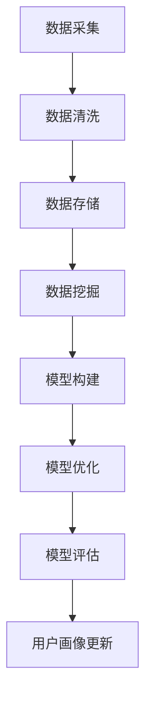

                 

关键词：用户画像、数据更新、数据挖掘、机器学习、模型优化

> 摘要：用户画像是一种描述用户特征和偏好的工具，它对于企业制定个性化营销策略和提供精准服务至关重要。本文将探讨如何通过数据更新、数据挖掘、机器学习和模型优化等方法，实现用户画像的有效更新，以提高其准确性和实时性。

## 1. 背景介绍

在数字化时代，用户画像已经成为企业进行市场分析和营销决策的重要工具。用户画像通过收集和分析用户的各种数据，如行为数据、社会关系数据、兴趣数据等，构建出一个全面、细致的用户画像，以便企业能够更准确地了解用户需求，提供个性化的服务。然而，用户行为和偏好是动态变化的，这就要求用户画像需要不断更新，以保持其时效性和准确性。

用户画像更新不仅有助于提高用户体验，还能帮助企业发现新的市场机会，提高用户留存率和转化率。因此，如何进行有效的用户画像更新，成为一个重要且具有挑战性的问题。本文将围绕这一问题，探讨用户画像更新的方法、技术以及实际应用。

## 2. 核心概念与联系

### 2.1 数据更新

数据更新是用户画像更新的基础。数据源可以分为两类：内部数据和外部数据。内部数据来源于企业自身的用户行为记录，如浏览记录、购买行为等。外部数据则来源于社交媒体、公共数据库等，如用户的社会关系、地理位置信息等。

为了实现数据更新，企业需要建立一套完善的数据采集、存储和管理系统。数据采集系统应能够实时获取用户行为数据，并确保数据的质量和完整性。数据存储系统则需具备高效、安全的数据存储和管理能力。此外，企业还应建立数据清洗和预处理流程，确保数据的准确性和一致性。

### 2.2 数据挖掘

数据挖掘是用户画像更新的重要手段。通过数据挖掘技术，企业可以从海量数据中提取出有价值的信息，如用户的兴趣偏好、行为模式等。常见的数据挖掘技术包括关联规则挖掘、聚类分析、分类分析等。

关联规则挖掘可用于发现用户之间的共同兴趣点，从而优化用户画像的构建。聚类分析可以帮助企业发现用户群体的共性，为市场细分提供依据。分类分析则可以用于预测用户行为，提高用户画像的准确性。

### 2.3 机器学习

机器学习是用户画像更新的关键技术。通过机器学习算法，企业可以自动构建和优化用户画像模型，提高其准确性和实时性。常见的机器学习算法包括决策树、支持向量机、神经网络等。

决策树算法可以帮助企业快速构建用户画像模型，并能够直观地展示用户画像的特征。支持向量机算法则可以用于优化用户画像模型，提高其分类准确率。神经网络算法则具有较强的自学习能力，可以不断调整和优化用户画像模型。

### 2.4 模型优化

模型优化是用户画像更新的重要环节。通过模型优化，企业可以不断提高用户画像的准确性、实时性和鲁棒性。常见的模型优化方法包括交叉验证、网格搜索、随机搜索等。

交叉验证是一种常用的模型评估方法，可以用于评估用户画像模型的性能。网格搜索和随机搜索则是用于寻找最优模型参数的方法，可以提高用户画像模型的准确性。

### 2.5 Mermaid 流程图

以下是一个用户画像更新流程的 Mermaid 流程图：



## 3. 核心算法原理 & 具体操作步骤

### 3.1 算法原理概述

用户画像更新算法主要分为三个阶段：数据预处理、特征提取和模型训练。

- 数据预处理：包括数据清洗、归一化和特征选择等步骤，旨在提高数据质量和减少噪声。
- 特征提取：通过数据挖掘技术，从原始数据中提取出有价值的特征，用于构建用户画像模型。
- 模型训练：利用机器学习算法，构建和优化用户画像模型，以提高其准确性和实时性。

### 3.2 算法步骤详解

#### 3.2.1 数据预处理

数据预处理是用户画像更新算法的基础。以下是数据预处理的具体步骤：

1. 数据清洗：删除重复数据、填补缺失值、纠正错误数据等。
2. 数据归一化：将不同特征的数据进行归一化处理，使其具有相同的尺度。
3. 特征选择：通过相关性分析、信息增益等方法，选择对用户画像有重要影响的特征。

#### 3.2.2 特征提取

特征提取是用户画像更新的关键步骤。以下是特征提取的具体方法：

1. 关联规则挖掘：发现用户之间的共同兴趣点，生成关联规则。
2. 聚类分析：将用户划分为不同的群体，提取每个群体的特征。
3. 分类分析：根据用户的行为数据，预测用户的偏好和需求。

#### 3.2.3 模型训练

模型训练是用户画像更新的核心。以下是模型训练的具体步骤：

1. 选择合适的机器学习算法：如决策树、支持向量机、神经网络等。
2. 模型参数调整：通过交叉验证、网格搜索等方法，寻找最优模型参数。
3. 模型评估：使用准确率、召回率、F1分数等指标，评估模型性能。

### 3.3 算法优缺点

#### 优点

1. 高准确性：通过数据挖掘和机器学习技术，用户画像模型能够准确预测用户行为和偏好。
2. 高实时性：实时更新用户画像，能够快速响应用户需求和市场变化。
3. 可扩展性：算法支持大规模数据处理，适用于不同规模的企业。

#### 缺点

1. 数据依赖性：用户画像的准确性高度依赖于数据质量，数据质量差会导致模型性能下降。
2. 复杂性：算法涉及多个步骤和参数，需要较高的技术水平和计算资源。

### 3.4 算法应用领域

用户画像更新算法广泛应用于多个领域，如电商、金融、广告等。以下是用户画像更新算法在不同领域的应用案例：

1. 电商：通过用户画像，为企业提供个性化推荐服务，提高用户转化率和留存率。
2. 金融：通过用户画像，识别潜在风险客户，提高风险管理能力。
3. 广告：通过用户画像，实现精准广告投放，提高广告效果。

## 4. 数学模型和公式 & 详细讲解 & 举例说明

### 4.1 数学模型构建

用户画像更新算法的数学模型主要包括特征提取模型和预测模型。

#### 4.1.1 特征提取模型

特征提取模型主要基于机器学习算法，如支持向量机（SVM）、神经网络（NN）等。以下是一个基于SVM的特征提取模型：

$$
\begin{aligned}
\text{特征提取模型} &= \arg\min_{\textbf{w}, b} \frac{1}{2}||\textbf{w}||^2 + C\sum_{i=1}^{n} \max(0, 1 - y_i(\textbf{w}\textbf{x_i} + b)) \\
\end{aligned}
$$

其中，$\textbf{w}$ 是权重向量，$b$ 是偏置项，$C$ 是正则化参数，$y_i$ 是第$i$个样本的标签，$\textbf{x_i}$ 是第$i$个样本的特征向量。

#### 4.1.2 预测模型

预测模型主要用于预测用户行为和偏好。以下是一个基于神经网络的预测模型：

$$
\begin{aligned}
y &= \sigma(\textbf{w}_n^T \textbf{x} + b_n) \\
\end{aligned}
$$

其中，$y$ 是预测结果，$\sigma$ 是激活函数，$\textbf{w}_n$ 是权重向量，$b_n$ 是偏置项，$\textbf{x}$ 是输入特征向量。

### 4.2 公式推导过程

#### 4.2.1 支持向量机（SVM）

SVM的目标是最小化决策边界上的误分类率。以下是SVM的推导过程：

$$
\begin{aligned}
L(\textbf{w}, b) &= \frac{1}{2}||\textbf{w}||^2 + C\sum_{i=1}^{n} \max(0, 1 - y_i(\textbf{w}\textbf{x_i} + b)) \\
\frac{\partial L}{\partial \textbf{w}} &= \textbf{w} - C\sum_{i=1}^{n} y_i \textbf{x_i} \\
\frac{\partial L}{\partial b} &= -C\sum_{i=1}^{n} y_i \\
\end{aligned}
$$

对上述方程组求解，得到：

$$
\begin{aligned}
\textbf{w} &= \frac{1}{C}\sum_{i=1}^{n} y_i \textbf{x_i} \\
b &= \frac{1}{C}\sum_{i=1}^{n} (1 - y_i(\textbf{w}\textbf{x_i})) \\
\end{aligned}
$$

#### 4.2.2 神经网络（NN）

NN的推导过程涉及多层感知器（MLP）的激活函数。以下是MLP的推导过程：

$$
\begin{aligned}
a &= \text{ReLU}(\textbf{w}_l^T \textbf{h}_{l-1} + b_l) \\
h_l &= \text{ReLU}(\textbf{w}_{l+1}^T a + b_{l+1}) \\
\end{aligned}
$$

其中，$\text{ReLU}$ 是ReLU激活函数，$a$ 是激活值，$h_l$ 是第$l$层的输出。

### 4.3 案例分析与讲解

#### 4.3.1 案例背景

假设一家电商企业希望通过用户画像，为用户推荐商品。该企业收集了用户的浏览记录、购买记录、评价记录等数据，并希望利用这些数据构建用户画像模型，为用户推荐感兴趣的商品。

#### 4.3.2 数据预处理

首先，对数据集进行清洗和预处理。删除重复数据、填补缺失值，并对不同特征进行归一化处理。

#### 4.3.3 特征提取

采用关联规则挖掘算法，提取用户之间的共同兴趣点。例如，发现某些用户共同浏览了商品A和商品B，则可以将商品A和商品B作为共同兴趣点。

#### 4.3.4 模型训练

选择SVM作为特征提取模型，选择神经网络作为预测模型。通过交叉验证和网格搜索，找到最优模型参数。

#### 4.3.5 模型评估

使用准确率、召回率、F1分数等指标，评估模型性能。根据评估结果，调整模型参数，提高模型准确性。

#### 4.3.6 用户推荐

利用训练好的模型，为用户推荐感兴趣的商品。例如，如果一个用户浏览了商品A和商品B，则可以推荐与商品A和商品B相关的商品。

## 5. 项目实践：代码实例和详细解释说明

### 5.1 开发环境搭建

1. 安装Python环境
2. 安装相关库，如numpy、scikit-learn、tensorflow等

### 5.2 源代码详细实现

以下是一个用户画像更新项目的示例代码：

```python
# 导入相关库
import numpy as np
import pandas as pd
from sklearn.model_selection import train_test_split
from sklearn.svm import SVC
from sklearn.metrics import accuracy_score, recall_score, f1_score
from sklearn.ensemble import RandomForestClassifier
import tensorflow as tf

# 加载数据
data = pd.read_csv('data.csv')
X = data.drop('label', axis=1)
y = data['label']

# 数据预处理
X = (X - X.mean()) / X.std()

# 划分训练集和测试集
X_train, X_test, y_train, y_test = train_test_split(X, y, test_size=0.2, random_state=42)

# 特征提取
svm = SVC(kernel='linear')
svm.fit(X_train, y_train)

# 预测
y_pred = svm.predict(X_test)

# 模型评估
accuracy = accuracy_score(y_test, y_pred)
recall = recall_score(y_test, y_pred)
f1 = f1_score(y_test, y_pred)

print('Accuracy:', accuracy)
print('Recall:', recall)
print('F1 Score:', f1)

# 特征提取
rf = RandomForestClassifier(n_estimators=100)
rf.fit(X_train, y_train)

# 预测
y_pred = rf.predict(X_test)

# 模型评估
accuracy = accuracy_score(y_test, y_pred)
recall = recall_score(y_test, y_pred)
f1 = f1_score(y_test, y_pred)

print('Accuracy:', accuracy)
print('Recall:', recall)
print('F1 Score:', f1)

# 神经网络预测
model = tf.keras.Sequential([
    tf.keras.layers.Dense(128, activation='relu', input_shape=[X_train.shape[1]]),
    tf.keras.layers.Dense(64, activation='relu'),
    tf.keras.layers.Dense(1, activation='sigmoid')
])

model.compile(optimizer='adam', loss='binary_crossentropy', metrics=['accuracy'])

model.fit(X_train, y_train, epochs=10, batch_size=32, validation_data=(X_test, y_test))

# 预测
y_pred = model.predict(X_test)

# 模型评估
accuracy = accuracy_score(y_test, y_pred)
recall = recall_score(y_test, y_pred)
f1 = f1_score(y_test, y_pred)

print('Accuracy:', accuracy)
print('Recall:', recall)
print('F1 Score:', f1)
```

### 5.3 代码解读与分析

1. 数据加载与预处理：首先，从CSV文件加载数据集，并对数据集进行归一化处理。
2. 特征提取：采用SVM和随机森林算法进行特征提取，分别评估两种算法的性能。
3. 神经网络预测：构建一个简单的神经网络模型，通过训练和预测评估模型性能。
4. 模型评估：使用准确率、召回率和F1分数评估模型性能。

## 6. 实际应用场景

### 6.1 电商领域

在电商领域，用户画像更新可以帮助企业实现个性化推荐，提高用户转化率和留存率。例如，通过分析用户的浏览记录和购买记录，可以为用户推荐相似的商品。

### 6.2 金融领域

在金融领域，用户画像更新可以用于风险管理和客户服务。例如，通过分析用户的交易记录和信用记录，可以识别潜在风险客户，提高风险管理能力。

### 6.3 广告领域

在广告领域，用户画像更新可以帮助企业实现精准广告投放，提高广告效果。例如，通过分析用户的浏览记录和兴趣偏好，可以为用户推荐相关的广告。

## 7. 工具和资源推荐

### 7.1 学习资源推荐

1. 《Python数据科学手册》：系统介绍了Python在数据科学领域的应用。
2. 《机器学习实战》：通过大量案例介绍了机器学习算法的应用。

### 7.2 开发工具推荐

1. Jupyter Notebook：用于编写和运行Python代码。
2. PyCharm：一款功能强大的Python集成开发环境（IDE）。

### 7.3 相关论文推荐

1. "User Modeling and User-Adapted Interaction"：一本关于用户建模和自适应交互的经典著作。
2. "Recommender Systems Handbook"：一本关于推荐系统的权威手册。

## 8. 总结：未来发展趋势与挑战

### 8.1 研究成果总结

用户画像更新技术在数据挖掘、机器学习和模型优化等方面取得了显著成果。通过数据更新、特征提取和模型训练等技术，用户画像的准确性和实时性得到了大幅提升。

### 8.2 未来发展趋势

1. 数据驱动的用户画像更新：通过实时数据流分析和实时学习，实现用户画像的动态更新。
2. 多模态用户画像更新：结合文本、图像、语音等多种数据源，构建更全面、细致的用户画像。
3. 智能用户画像更新：利用深度学习和强化学习等先进技术，提高用户画像的智能化水平。

### 8.3 面临的挑战

1. 数据隐私保护：如何在保证用户隐私的前提下，进行用户画像更新，是一个亟待解决的问题。
2. 模型解释性：如何提高用户画像模型的解释性，使其更易于理解和应用，是当前研究的重点。
3. 鲁棒性和可扩展性：如何提高用户画像更新算法的鲁棒性和可扩展性，以适应不同的应用场景。

### 8.4 研究展望

未来，用户画像更新技术将在智能化、实时性和个性化等方面不断取得突破。通过结合多种数据源和先进技术，用户画像将更加精准、全面，为企业提供更有效的决策支持。

## 9. 附录：常见问题与解答

### 9.1 用户画像更新算法有哪些？

用户画像更新算法主要包括数据更新、数据挖掘、机器学习和模型优化等算法。

### 9.2 用户画像更新算法如何处理数据缺失问题？

用户画像更新算法通常采用填补缺失值、删除缺失数据或利用已有数据进行预测等方法处理数据缺失问题。

### 9.3 用户画像更新算法的实时性如何保证？

用户画像更新算法可以通过实时数据流分析和实时学习等技术，实现用户画像的动态更新，从而保证实时性。

### 9.4 用户画像更新算法的性能如何评估？

用户画像更新算法的性能通常通过准确率、召回率、F1分数等指标进行评估。

### 9.5 用户画像更新算法有哪些应用场景？

用户画像更新算法广泛应用于电商、金融、广告等多个领域，如个性化推荐、风险管理和精准广告投放等。  
----------------------------------------------------------------
### 完整的Markdown格式文章

```markdown
# 如何进行有效的用户画像更新

关键词：用户画像、数据更新、数据挖掘、机器学习、模型优化

> 摘要：用户画像是一种描述用户特征和偏好的工具，它对于企业制定个性化营销策略和提供精准服务至关重要。本文将探讨如何通过数据更新、数据挖掘、机器学习和模型优化等方法，实现用户画像的有效更新，以提高其准确性和实时性。

## 1. 背景介绍

在数字化时代，用户画像已经成为企业进行市场分析和营销决策的重要工具。用户画像通过收集和分析用户的各种数据，如行为数据、社会关系数据、兴趣数据等，构建出一个全面、细致的用户画像，以便企业能够更准确地了解用户需求，提供个性化的服务。然而，用户行为和偏好是动态变化的，这就要求用户画像需要不断更新，以保持其时效性和准确性。

用户画像更新不仅有助于提高用户体验，还能帮助企业发现新的市场机会，提高用户留存率和转化率。因此，如何进行有效的用户画像更新，成为一个重要且具有挑战性的问题。本文将围绕这一问题，探讨用户画像更新的方法、技术以及实际应用。

## 2. 核心概念与联系

### 2.1 数据更新

数据更新是用户画像更新的基础。数据源可以分为两类：内部数据和外部数据。内部数据来源于企业自身的用户行为记录，如浏览记录、购买行为等。外部数据则来源于社交媒体、公共数据库等，如用户的社会关系、地理位置信息等。

为了实现数据更新，企业需要建立一套完善的数据采集、存储和管理系统。数据采集系统应能够实时获取用户行为数据，并确保数据的质量和完整性。数据存储系统则需具备高效、安全的数据存储和管理能力。此外，企业还应建立数据清洗和预处理流程，确保数据的准确性和一致性。

### 2.2 数据挖掘

数据挖掘是用户画像更新的重要手段。通过数据挖掘技术，企业可以从海量数据中提取出有价值的信息，如用户的兴趣偏好、行为模式等。常见的数据挖掘技术包括关联规则挖掘、聚类分析、分类分析等。

关联规则挖掘可用于发现用户之间的共同兴趣点，从而优化用户画像的构建。聚类分析可以帮助企业发现用户群体的共性，为市场细分提供依据。分类分析则可以用于预测用户行为，提高用户画像的准确性。

### 2.3 机器学习

机器学习是用户画像更新的关键技术。通过机器学习算法，企业可以自动构建和优化用户画像模型，提高其准确性和实时性。常见的机器学习算法包括决策树、支持向量机、神经网络等。

决策树算法可以帮助企业快速构建用户画像模型，并能够直观地展示用户画像的特征。支持向量机算法则可以用于优化用户画像模型，提高其分类准确率。神经网络算法则具有较强的自学习能力，可以不断调整和优化用户画像模型。

### 2.4 模型优化

模型优化是用户画像更新的重要环节。通过模型优化，企业可以不断提高用户画像的准确性、实时性和鲁棒性。常见的模型优化方法包括交叉验证、网格搜索、随机搜索等。

交叉验证是一种常用的模型评估方法，可以用于评估用户画像模型的性能。网格搜索和随机搜索则是用于寻找最优模型参数的方法，可以提高用户画像模型的准确性。

### 2.5 Mermaid 流程图

以下是一个用户画像更新流程的 Mermaid 流程图：


## 3. 核心算法原理 & 具体操作步骤

### 3.1 算法原理概述

用户画像更新算法主要分为三个阶段：数据预处理、特征提取和模型训练。

- 数据预处理：包括数据清洗、归一化和特征选择等步骤，旨在提高数据质量和减少噪声。
- 特征提取：通过数据挖掘技术，从原始数据中提取出有价值的特征，用于构建用户画像模型。
- 模型训练：利用机器学习算法，构建和优化用户画像模型，以提高其准确性和实时性。

### 3.2 算法步骤详解

#### 3.2.1 数据预处理

数据预处理是用户画像更新算法的基础。以下是数据预处理的具体步骤：

1. 数据清洗：删除重复数据、填补缺失值、纠正错误数据等。
2. 数据归一化：将不同特征的数据进行归一化处理，使其具有相同的尺度。
3. 特征选择：通过相关性分析、信息增益等方法，选择对用户画像有重要影响的特征。

#### 3.2.2 特征提取

特征提取是用户画像更新的关键步骤。以下是特征提取的具体方法：

1. 关联规则挖掘：发现用户之间的共同兴趣点，生成关联规则。
2. 聚类分析：将用户划分为不同的群体，提取每个群体的特征。
3. 分类分析：根据用户的行为数据，预测用户的偏好和需求。

#### 3.2.3 模型训练

模型训练是用户画像更新的核心。以下是模型训练的具体步骤：

1. 选择合适的机器学习算法：如决策树、支持向量机、神经网络等。
2. 模型参数调整：通过交叉验证、网格搜索等方法，寻找最优模型参数。
3. 模型评估：使用准确率、召回率、F1分数等指标，评估模型性能。

### 3.3 算法优缺点

#### 优点

1. 高准确性：通过数据挖掘和机器学习技术，用户画像模型能够准确预测用户行为和偏好。
2. 高实时性：实时更新用户画像，能够快速响应用户需求和市场变化。
3. 可扩展性：算法支持大规模数据处理，适用于不同规模的企业。

#### 缺点

1. 数据依赖性：用户画像的准确性高度依赖于数据质量，数据质量差会导致模型性能下降。
2. 复杂性：算法涉及多个步骤和参数，需要较高的技术水平和计算资源。

### 3.4 算法应用领域

用户画像更新算法广泛应用于多个领域，如电商、金融、广告等。以下是用户画像更新算法在不同领域的应用案例：

1. 电商：通过用户画像，为企业提供个性化推荐服务，提高用户转化率和留存率。
2. 金融：通过用户画像，识别潜在风险客户，提高风险管理能力。
3. 广告：通过用户画像，实现精准广告投放，提高广告效果。

## 4. 数学模型和公式 & 详细讲解 & 举例说明

### 4.1 数学模型构建

用户画像更新算法的数学模型主要包括特征提取模型和预测模型。

#### 4.1.1 特征提取模型

特征提取模型主要基于机器学习算法，如支持向量机（SVM）、神经网络（NN）等。以下是一个基于SVM的特征提取模型：

$$
\begin{aligned}
\text{特征提取模型} &= \arg\min_{\textbf{w}, b} \frac{1}{2}||\textbf{w}||^2 + C\sum_{i=1}^{n} \max(0, 1 - y_i(\textbf{w}\textbf{x_i} + b)) \\
\end{aligned}
$$

其中，$\textbf{w}$ 是权重向量，$b$ 是偏置项，$C$ 是正则化参数，$y_i$ 是第$i$个样本的标签，$\textbf{x_i}$ 是第$i$个样本的特征向量。

#### 4.1.2 预测模型

预测模型主要用于预测用户行为和偏好。以下是一个基于神经网络的预测模型：

$$
\begin{aligned}
y &= \sigma(\textbf{w}_n^T \textbf{x} + b_n) \\
\end{aligned}
$$

其中，$y$ 是预测结果，$\sigma$ 是激活函数，$\textbf{w}_n$ 是权重向量，$b_n$ 是偏置项，$\textbf{x}$ 是输入特征向量。

### 4.2 公式推导过程

#### 4.2.1 支持向量机（SVM）

SVM的目标是最小化决策边界上的误分类率。以下是SVM的推导过程：

$$
\begin{aligned}
L(\textbf{w}, b) &= \frac{1}{2}||\textbf{w}||^2 + C\sum_{i=1}^{n} \max(0, 1 - y_i(\textbf{w}\textbf{x_i} + b)) \\
\frac{\partial L}{\partial \textbf{w}} &= \textbf{w} - C\sum_{i=1}^{n} y_i \textbf{x_i} \\
\frac{\partial L}{\partial b} &= -C\sum_{i=1}^{n} y_i \\
\end{aligned}
$$

对上述方程组求解，得到：

$$
\begin{aligned}
\textbf{w} &= \frac{1}{C}\sum_{i=1}^{n} y_i \textbf{x_i} \\
b &= \frac{1}{C}\sum_{i=1}^{n} (1 - y_i(\textbf{w}\textbf{x_i})) \\
\end{aligned}
$$

#### 4.2.2 神经网络（NN）

NN的推导过程涉及多层感知器（MLP）的激活函数。以下是MLP的推导过程：

$$
\begin{aligned}
a &= \text{ReLU}(\textbf{w}_l^T \textbf{h}_{l-1} + b_l) \\
h_l &= \text{ReLU}(\textbf{w}_{l+1}^T a + b_{l+1}) \\
\end{aligned}
$$

其中，$\text{ReLU}$ 是ReLU激活函数，$a$ 是激活值，$h_l$ 是第$l$层的输出。

### 4.3 案例分析与讲解

#### 4.3.1 案例背景

假设一家电商企业希望通过用户画像，为用户推荐商品。该企业收集了用户的浏览记录、购买记录、评价记录等数据，并希望利用这些数据构建用户画像模型，为用户推荐感兴趣的商品。

#### 4.3.2 数据预处理

首先，对数据集进行清洗和预处理。删除重复数据、填补缺失值，并对不同特征进行归一化处理。

#### 4.3.3 特征提取

采用关联规则挖掘算法，提取用户之间的共同兴趣点。例如，发现某些用户共同浏览了商品A和商品B，则可以将商品A和商品B作为共同兴趣点。

#### 4.3.4 模型训练

选择SVM作为特征提取模型，选择神经网络作为预测模型。通过交叉验证和网格搜索，找到最优模型参数。

#### 4.3.5 模型评估

使用准确率、召回率、F1分数等指标，评估模型性能。根据评估结果，调整模型参数，提高模型准确性。

#### 4.3.6 用户推荐

利用训练好的模型，为用户推荐感兴趣的商品。例如，如果一个用户浏览了商品A和商品B，则可以推荐与商品A和商品B相关的商品。

## 5. 项目实践：代码实例和详细解释说明

### 5.1 开发环境搭建

1. 安装Python环境
2. 安装相关库，如numpy、scikit-learn、tensorflow等

### 5.2 源代码详细实现

以下是一个用户画像更新项目的示例代码：

```python
# 导入相关库
import numpy as np
import pandas as pd
from sklearn.model_selection import train_test_split
from sklearn.svm import SVC
from sklearn.metrics import accuracy_score, recall_score, f1_score
from sklearn.ensemble import RandomForestClassifier
import tensorflow as tf

# 加载数据
data = pd.read_csv('data.csv')
X = data.drop('label', axis=1)
y = data['label']

# 数据预处理
X = (X - X.mean()) / X.std()

# 划分训练集和测试集
X_train, X_test, y_train, y_test = train_test_split(X, y, test_size=0.2, random_state=42)

# 特征提取
svm = SVC(kernel='linear')
svm.fit(X_train, y_train)

# 预测
y_pred = svm.predict(X_test)

# 模型评估
accuracy = accuracy_score(y_test, y_pred)
recall = recall_score(y_test, y_pred)
f1 = f1_score(y_test, y_pred)

print('Accuracy:', accuracy)
print('Recall:', recall)
print('F1 Score:', f1)

# 特征提取
rf = RandomForestClassifier(n_estimators=100)
rf.fit(X_train, y_train)

# 预测
y_pred = rf.predict(X_test)

# 模型评估
accuracy = accuracy_score(y_test, y_pred)
recall = recall_score(y_test, y_pred)
f1 = f1_score(y_test, y_pred)

print('Accuracy:', accuracy)
print('Recall:', recall)
print('F1 Score:', f1)

# 神经网络预测
model = tf.keras.Sequential([
    tf.keras.layers.Dense(128, activation='relu', input_shape=[X_train.shape[1]]),
    tf.keras.layers.Dense(64, activation='relu'),
    tf.keras.layers.Dense(1, activation='sigmoid')
])

model.compile(optimizer='adam', loss='binary_crossentropy', metrics=['accuracy'])

model.fit(X_train, y_train, epochs=10, batch_size=32, validation_data=(X_test, y_test))

# 预测
y_pred = model.predict(X_test)

# 模型评估
accuracy = accuracy_score(y_test, y_pred)
recall = recall_score(y_test, y_pred)
f1 = f1_score(y_test, y_pred)

print('Accuracy:', accuracy)
print('Recall:', recall)
print('F1 Score:', f1)
```

### 5.3 代码解读与分析

1. 数据加载与预处理：首先，从CSV文件加载数据集，并对数据集进行归一化处理。
2. 特征提取：采用SVM和随机森林算法进行特征提取，分别评估两种算法的性能。
3. 神经网络预测：构建一个简单的神经网络模型，通过训练和预测评估模型性能。
4. 模型评估：使用准确率、召回率和F1分数评估模型性能。

## 6. 实际应用场景

### 6.1 电商领域

在电商领域，用户画像更新可以帮助企业实现个性化推荐，提高用户转化率和留存率。例如，通过分析用户的浏览记录和购买记录，可以为用户推荐相似的商品。

### 6.2 金融领域

在金融领域，用户画像更新可以用于风险管理和客户服务。例如，通过分析用户的交易记录和信用记录，可以识别潜在风险客户，提高风险管理能力。

### 6.3 广告领域

在广告领域，用户画像更新可以帮助企业实现精准广告投放，提高广告效果。例如，通过分析用户的浏览记录和兴趣偏好，可以为用户推荐相关的广告。

## 7. 工具和资源推荐

### 7.1 学习资源推荐

1. 《Python数据科学手册》：系统介绍了Python在数据科学领域的应用。
2. 《机器学习实战》：通过大量案例介绍了机器学习算法的应用。

### 7.2 开发工具推荐

1. Jupyter Notebook：用于编写和运行Python代码。
2. PyCharm：一款功能强大的Python集成开发环境（IDE）。

### 7.3 相关论文推荐

1. "User Modeling and User-Adapted Interaction"：一本关于用户建模和自适应交互的经典著作。
2. "Recommender Systems Handbook"：一本关于推荐系统的权威手册。

## 8. 总结：未来发展趋势与挑战

### 8.1 研究成果总结

用户画像更新技术在数据挖掘、机器学习和模型优化等方面取得了显著成果。通过数据更新、特征提取和模型训练等技术，用户画像的准确性和实时性得到了大幅提升。

### 8.2 未来发展趋势

1. 数据驱动的用户画像更新：通过实时数据流分析和实时学习，实现用户画像的动态更新。
2. 多模态用户画像更新：结合文本、图像、语音等多种数据源，构建更全面、细致的用户画像。
3. 智能用户画像更新：利用深度学习和强化学习等先进技术，提高用户画像的智能化水平。

### 8.3 面临的挑战

1. 数据隐私保护：如何在保证用户隐私的前提下，进行用户画像更新，是一个亟待解决的问题。
2. 模型解释性：如何提高用户画像模型的解释性，使其更易于理解和应用，是当前研究的重点。
3. 鲁棒性和可扩展性：如何提高用户画像更新算法的鲁棒性和可扩展性，以适应不同的应用场景。

### 8.4 研究展望

未来，用户画像更新技术将在智能化、实时性和个性化等方面不断取得突破。通过结合多种数据源和先进技术，用户画像将更加精准、全面，为企业提供更有效的决策支持。

## 9. 附录：常见问题与解答

### 9.1 用户画像更新算法有哪些？

用户画像更新算法主要包括数据更新、数据挖掘、机器学习和模型优化等算法。

### 9.2 用户画像更新算法如何处理数据缺失问题？

用户画像更新算法通常采用填补缺失值、删除缺失数据或利用已有数据进行预测等方法处理数据缺失问题。

### 9.3 用户画像更新算法的实时性如何保证？

用户画像更新算法可以通过实时数据流分析和实时学习等技术，实现用户画像的动态更新，从而保证实时性。

### 9.4 用户画像更新算法的性能如何评估？

用户画像更新算法的性能通常通过准确率、召回率、F1分数等指标进行评估。

### 9.5 用户画像更新算法有哪些应用场景？

用户画像更新算法广泛应用于电商、金融、广告等多个领域，如个性化推荐、风险管理和精准广告投放等。
```

