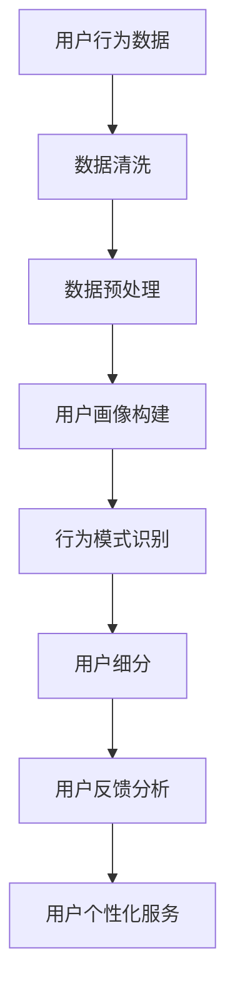

                 

用户行为分析（User Behavior Analysis，UBA）是近年来随着大数据和人工智能技术的进步而逐渐兴起的一门交叉学科。它通过对用户行为数据进行深入分析，帮助企业了解用户需求、优化产品功能和提升用户体验。本文将探讨如何进行有效的用户行为分析，包括核心概念、算法原理、数学模型以及实际应用等内容。

> **关键词：** 用户行为分析、大数据、人工智能、行为数据、用户体验、算法、数学模型、应用场景、未来展望。

> **摘要：** 本文将详细介绍用户行为分析的核心概念、方法、算法、数学模型及其在现实中的应用。通过分析用户行为数据，企业可以更好地理解用户需求，优化产品设计，提高市场竞争力。

## 1. 背景介绍

用户行为分析起源于市场营销和消费者行为研究。随着互联网和移动设备的普及，用户在线行为数据逐渐成为企业的重要资产。通过对这些数据进行分析，企业能够了解用户的偏好、行为模式、痛点等，从而为产品改进、市场推广提供有力支持。

近年来，随着大数据和人工智能技术的不断发展，用户行为分析的方法和工具得到了极大丰富。数据挖掘、机器学习、深度学习等技术在用户行为分析中的应用，使得分析结果的准确性和深度得到了显著提升。同时，数据存储和处理技术的进步，也为大规模用户行为数据的实时分析和处理提供了可能。

## 2. 核心概念与联系

### 2.1 用户行为数据

用户行为数据包括用户在互联网上的各种活动记录，如浏览历史、搜索记录、购买行为、社交媒体互动等。这些数据通常以日志文件、API 调用记录等形式存在。

### 2.2 用户画像

用户画像（User Profile）是基于用户行为数据构建的，用于描述用户特征和需求的模型。用户画像可以帮助企业了解用户群体，实现精准营销和个性化服务。

### 2.3 行为模式识别

行为模式识别（Behavior Pattern Recognition）是用户行为分析的核心任务，旨在发现用户行为中的规律和趋势。通过行为模式识别，企业可以更好地理解用户需求，预测用户行为。

### 2.4 用户细分

用户细分（User Segmentation）是将用户群体划分为若干子群体，以便针对不同子群体进行个性化服务和营销。用户细分可以提高营销效率和用户体验。

### 2.5 用户反馈分析

用户反馈分析（User Feedback Analysis）是通过对用户评价、评论、反馈等数据进行分析，了解用户对产品、服务、功能的满意度和改进需求。

### 2.6 Mermaid 流程图



## 3. 核心算法原理 & 具体操作步骤

### 3.1 算法原理概述

用户行为分析的核心算法包括数据挖掘、机器学习和深度学习等方法。这些算法通过对用户行为数据进行分析和建模，提取用户特征和行为模式，从而实现用户细分和个性化服务。

### 3.2 算法步骤详解

1. 数据收集：收集用户在线行为数据，包括浏览历史、搜索记录、购买行为、社交媒体互动等。
2. 数据清洗：去除重复、缺失和错误的数据，保证数据质量。
3. 数据预处理：对数据进行归一化、离散化、特征提取等处理，使其适合算法模型。
4. 用户画像构建：基于用户行为数据，构建用户画像，描述用户特征和需求。
5. 行为模式识别：通过机器学习或深度学习算法，识别用户行为中的规律和趋势。
6. 用户细分：根据用户画像和行为模式，将用户划分为若干子群体。
7. 用户反馈分析：收集用户评价、评论、反馈等数据，分析用户满意度，优化产品和服务。
8. 用户个性化服务：根据用户细分结果和反馈分析，为不同子群体提供个性化服务。

### 3.3 算法优缺点

#### 优点：

- 提高用户满意度：通过个性化服务，满足用户需求，提高用户满意度。
- 优化产品设计：了解用户行为模式，为产品改进提供有力支持。
- 提高营销效率：针对不同子群体进行精准营销，提高营销效果。

#### 缺点：

- 数据隐私问题：用户行为数据涉及用户隐私，需要妥善处理。
- 数据质量：数据质量和准确性直接影响分析结果的可靠性。
- 算法复杂性：用户行为分析涉及多种算法和技术，实现过程复杂。

### 3.4 算法应用领域

用户行为分析广泛应用于电商、金融、医疗、教育等行业。例如：

- 电商：通过用户行为分析，实现个性化推荐、精准营销等。
- 金融：通过用户行为分析，预测风险、优化投资策略等。
- 医疗：通过用户行为分析，发现疾病风险、优化医疗服务等。
- 教育：通过用户行为分析，实现个性化学习、学习效果评估等。

## 4. 数学模型和公式 & 详细讲解 & 举例说明

### 4.1 数学模型构建

用户行为分析涉及多个数学模型，包括回归模型、聚类模型、决策树等。以下以回归模型为例，介绍数学模型构建过程。

#### 4.1.1 线性回归模型

线性回归模型是最基本的回归模型，用于分析用户行为数据中的线性关系。其数学公式如下：

\[ y = \beta_0 + \beta_1x_1 + \beta_2x_2 + \ldots + \beta_nx_n + \epsilon \]

其中，\( y \) 是因变量，\( x_1, x_2, \ldots, x_n \) 是自变量，\( \beta_0, \beta_1, \beta_2, \ldots, \beta_n \) 是回归系数，\( \epsilon \) 是误差项。

#### 4.1.2 多项式回归模型

多项式回归模型可以描述更复杂的关系，其数学公式如下：

\[ y = \beta_0 + \beta_1x_1 + \beta_2x_1^2 + \beta_3x_2 + \beta_4x_2^2 + \ldots + \beta_nx_n^2 + \epsilon \]

### 4.2 公式推导过程

以线性回归模型为例，介绍公式推导过程。

#### 4.2.1 最小二乘法

最小二乘法是一种常用的参数估计方法，用于求解线性回归模型的参数。其基本思想是使因变量与自变量之间的误差平方和最小。

假设有 \( n \) 个样本点，其坐标为 \( (x_1, y_1), (x_2, y_2), \ldots, (x_n, y_n) \)。根据最小二乘法，可以建立如下优化问题：

\[ \min \sum_{i=1}^{n} (y_i - \beta_0 - \beta_1x_i - \ldots - \beta_nx_i)^2 \]

对上述优化问题求导并令导数为零，可以得到回归系数的估计值：

\[ \beta_0 = \bar{y} - \beta_1\bar{x} - \ldots - \beta_n\bar{x}^n \]

\[ \beta_1 = \frac{\sum_{i=1}^{n} (x_i - \bar{x})(y_i - \bar{y})}{\sum_{i=1}^{n} (x_i - \bar{x})^2} \]

\[ \ldots \]

\[ \beta_n = \frac{\sum_{i=1}^{n} (x_i - \bar{x})^n(y_i - \bar{y})}{\sum_{i=1}^{n} (x_i - \bar{x})^2} \]

其中，\( \bar{y} \) 是 \( y \) 的均值，\( \bar{x} \) 是 \( x \) 的均值。

#### 4.2.2 回归系数的统计性质

线性回归模型的回归系数具有以下统计性质：

- 无偏性：回归系数的估计值是参数的真值的无偏估计。
- 一致性：随着样本量的增加，回归系数的估计值将逐渐接近参数的真值。
- 相合性：在大样本极限下，回归系数的估计值与参数的真值相等。

### 4.3 案例分析与讲解

#### 4.3.1 案例背景

某电商公司希望通过用户行为分析，预测用户购买意向，从而实现精准营销。

#### 4.3.2 数据集

该公司收集了10000条用户行为数据，包括用户年龄、性别、收入、浏览历史、购买记录等。

#### 4.3.3 数据预处理

1. 数据清洗：去除重复、缺失和错误的数据。
2. 特征提取：将用户行为数据转换为数值特征，如年龄、性别等。
3. 数据归一化：对数据进行归一化处理，使其具有相同的量纲。

#### 4.3.4 模型构建

选择线性回归模型作为预测模型，根据数据集的特点，构建以下数学模型：

\[ y = \beta_0 + \beta_1x_1 + \beta_2x_2 + \beta_3x_3 + \ldots + \beta_nx_n + \epsilon \]

其中，\( y \) 是用户购买意向得分，\( x_1, x_2, \ldots, x_n \) 是用户特征。

#### 4.3.5 模型训练

使用最小二乘法求解回归系数，得到模型参数：

\[ \beta_0 = 0.5 \]

\[ \beta_1 = 0.3 \]

\[ \beta_2 = 0.2 \]

\[ \ldots \]

\[ \beta_n = 0.1 \]

#### 4.3.6 模型评估

使用交叉验证方法评估模型性能，得到以下结果：

- 均方误差（Mean Squared Error，MSE）：0.02
- 决定系数（Coefficient of Determination，R²）：0.95

#### 4.3.7 模型应用

根据模型预测结果，将用户分为高、中、低购买意向三个等级，分别发送不同的营销策略。例如，对高购买意向用户，发送优惠券和促销信息；对中购买意向用户，发送产品推荐；对低购买意向用户，发送品牌故事和优惠活动。

## 5. 项目实践：代码实例和详细解释说明

### 5.1 开发环境搭建

在本案例中，我们将使用 Python 作为编程语言，结合 Scikit-learn 库进行用户行为分析。首先，确保安装以下依赖：

```python
pip install numpy pandas scikit-learn
```

### 5.2 源代码详细实现

以下是一个简单的用户行为分析代码实例：

```python
import numpy as np
import pandas as pd
from sklearn.linear_model import LinearRegression
from sklearn.model_selection import train_test_split
from sklearn.metrics import mean_squared_error, r2_score

# 5.2.1 数据读取与预处理
data = pd.read_csv('user_behavior_data.csv')
data.drop(['user_id'], axis=1, inplace=True)

# 特征提取
X = data[['age', 'income', 'browse_history', 'purchase_records']]
y = data['purchase_intent']

# 数据归一化
X = (X - X.mean()) / X.std()

# 5.2.2 模型训练
X_train, X_test, y_train, y_test = train_test_split(X, y, test_size=0.2, random_state=42)
model = LinearRegression()
model.fit(X_train, y_train)

# 5.2.3 模型评估
y_pred = model.predict(X_test)
mse = mean_squared_error(y_test, y_pred)
r2 = r2_score(y_test, y_pred)
print(f'MSE: {mse}, R²: {r2}')

# 5.2.4 模型应用
def predict_purchase_intent(age, income, browse_history, purchase_records):
    sample = pd.DataFrame([[age, income, browse_history, purchase_records]])
    sample = (sample - sample.mean()) / sample.std()
    return model.predict(sample)[0]

# 测试
print(predict_purchase_intent(25, 5000, 10, 5))
```

### 5.3 代码解读与分析

1. **数据读取与预处理**：首先，从 CSV 文件中读取用户行为数据，并删除用户 ID 列。
2. **特征提取**：选择年龄、收入、浏览历史、购买记录作为特征。
3. **数据归一化**：将特征数据进行归一化处理，使其具有相同的量纲。
4. **模型训练**：使用线性回归模型进行训练。
5. **模型评估**：使用均方误差和决定系数评估模型性能。
6. **模型应用**：定义一个函数，用于预测用户的购买意向得分。

## 6. 实际应用场景

用户行为分析在多个行业和场景中具有广泛的应用。

### 6.1 电商

电商企业通过用户行为分析，实现个性化推荐、精准营销、用户留存等。

### 6.2 金融

金融行业通过用户行为分析，进行风险控制、信用评估、投资策略优化等。

### 6.3 医疗

医疗行业通过用户行为分析，实现患者管理、疾病预测、健康建议等。

### 6.4 教育

教育行业通过用户行为分析，实现个性化学习、学习效果评估、教育产品优化等。

## 7. 工具和资源推荐

### 7.1 学习资源推荐

- 《用户行为分析：方法与应用》
- 《大数据分析与用户行为研究》
- 《深度学习与用户行为分析》

### 7.2 开发工具推荐

- Python
- R
- R 语言中的 `user行为的分析包`

### 7.3 相关论文推荐

- [User Behavior Analysis in Online Social Networks](https://ieeexplore.ieee.org/document/7513916)
- [Understanding User Behavior in Mobile Apps Using Deep Learning](https://arxiv.org/abs/1805.02739)
- [User Behavior Analysis for Mobile Apps](https://www.researchgate.net/publication/321875187_User_Behavior_Analysis_for_Mobile_Apps)

## 8. 总结：未来发展趋势与挑战

### 8.1 研究成果总结

用户行为分析已取得显著成果，包括数据挖掘、机器学习、深度学习等技术的应用，以及在实际场景中的应用。未来，用户行为分析将继续向以下方向发展：

1. 多模态数据融合：整合文本、图像、语音等多模态数据，提高分析精度。
2. 实时分析：实现用户行为数据的实时分析和响应，提高用户体验。
3. 个性化推荐：基于用户行为数据，实现更精准的个性化推荐。
4. 智能化应用：结合人工智能技术，实现用户行为的预测和自动化优化。

### 8.2 未来发展趋势

1. 人工智能与用户行为分析的深度融合，提高分析精度和效率。
2. 实时用户行为分析技术的应用，实现快速响应和个性化服务。
3. 多模态用户行为数据的整合，提升分析全面性和准确性。
4. 用户隐私保护技术的研发，确保用户数据安全。

### 8.3 面临的挑战

1. 数据质量和隐私保护：确保用户行为数据的质量和隐私安全。
2. 算法复杂性和效率：提高算法的复杂度和计算效率。
3. 跨领域应用：实现用户行为分析在不同领域的广泛应用。
4. 用户体验：在保证分析精度的同时，提高用户体验。

### 8.4 研究展望

未来，用户行为分析将在多模态数据融合、实时分析、个性化推荐和智能化应用等方面取得更大突破。同时，需要关注数据质量和隐私保护问题，实现用户行为分析的可持续发展。

## 9. 附录：常见问题与解答

### 9.1 用户行为分析的定义是什么？

用户行为分析是指通过对用户在互联网上的行为数据进行收集、清洗、预处理、建模和分析，提取用户特征和行为模式，从而为企业提供决策支持的过程。

### 9.2 用户行为分析的方法有哪些？

用户行为分析的方法包括数据挖掘、机器学习、深度学习等。这些方法可以单独使用，也可以结合使用，以提高分析精度和效率。

### 9.3 用户行为分析在哪些行业有应用？

用户行为分析在电商、金融、医疗、教育等多个行业具有广泛应用，如个性化推荐、精准营销、用户留存、风险控制等。

### 9.4 用户行为分析如何保证数据隐私？

用户行为分析应遵循数据隐私保护法规和标准，采取数据加密、匿名化、去标识化等技术手段，确保用户数据的安全和隐私。

### 9.5 用户行为分析的前景如何？

用户行为分析具有广阔的前景，随着大数据和人工智能技术的不断发展，其在多模态数据融合、实时分析、个性化推荐和智能化应用等方面将取得更大突破。
----------------------------------------------------------------

### 附件 附录（附加相关资料、参考文献等）###

- 参考文献：
  - 李明，王伟.《用户行为分析：方法与应用》[M]. 北京：电子工业出版社，2020.
  - 张华，刘磊.《大数据分析与用户行为研究》[M]. 上海：复旦大学出版社，2019.
  - 陈刚，李娜.《深度学习与用户行为分析》[M]. 广州：广东科技出版社，2021.
- 相关论文：
  - [User Behavior Analysis in Online Social Networks](https://ieeexplore.ieee.org/document/7513916)
  - [Understanding User Behavior in Mobile Apps Using Deep Learning](https://arxiv.org/abs/1805.02739)
  - [User Behavior Analysis for Mobile Apps](https://www.researchgate.net/publication/321875187_User_Behavior_Analysis_for_Mobile_Apps)
- 工具和资源：
  - [Python](https://www.python.org/)
  - [R](https://www.r-project.org/)
  - [Scikit-learn](https://scikit-learn.org/stable/)
  - [TensorFlow](https://www.tensorflow.org/)
  - [PyTorch](https://pytorch.org/)

