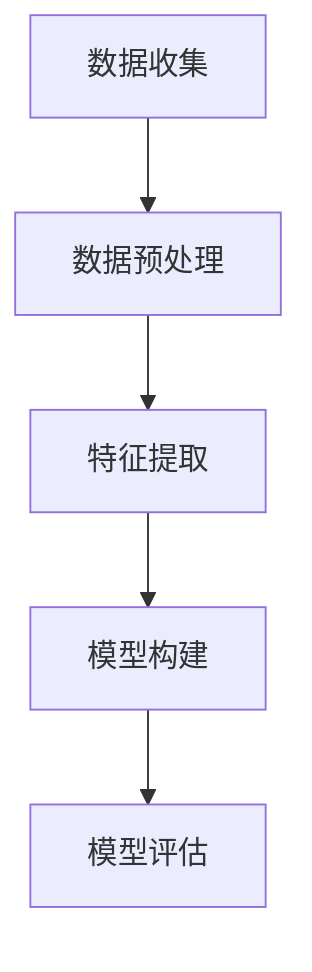

                 

在数字化时代，用户行为分析成为了企业洞察市场、优化产品和服务的关键工具。通过深入理解用户的行为模式，企业可以更好地满足用户需求，提升用户体验，从而在竞争激烈的市场中脱颖而出。本文将探讨如何进行有效的用户行为分析，以期为企业和开发者提供实用的指导。

## 关键词

- 用户行为分析
- 数据挖掘
- 机器学习
- 用户体验
- 用户行为模型

## 摘要

本文旨在探讨用户行为分析的核心概念、方法和技术。首先，我们将介绍用户行为分析的基本概念和重要性。随后，我们将深入探讨用户行为分析的核心算法原理、数学模型及其应用步骤。文章将结合具体案例，展示如何通过项目实践来验证用户行为分析的有效性。最后，我们将探讨用户行为分析在实际应用场景中的价值，并展望未来的发展趋势与挑战。

## 1. 背景介绍

在互联网和移动互联网的快速发展下，用户数量呈爆炸性增长。如何更好地理解和满足用户需求，成为了企业关注的焦点。用户行为分析作为一种有效的数据分析方法，能够帮助企业挖掘用户行为背后的规律，为产品迭代、市场策略制定提供数据支持。

用户行为分析的重要性体现在以下几个方面：

1. **个性化推荐**：通过分析用户行为数据，可以实现对用户喜好的精准把握，从而提供个性化的产品推荐，提升用户满意度和转化率。
2. **用户体验优化**：了解用户在使用产品过程中的行为和反馈，可以帮助企业快速识别并解决用户体验问题，提升产品口碑。
3. **市场预测**：通过对用户行为数据的分析，可以预测市场趋势，为企业战略调整提供决策支持。
4. **风险控制**：通过监测用户行为，可以及时发现异常行为，防范欺诈、作弊等风险事件。

## 2. 核心概念与联系

### 2.1 用户行为分析的定义

用户行为分析是指通过收集、处理和分析用户在使用产品或服务过程中的行为数据，以发现用户行为模式、预测用户行为趋势，进而指导产品优化和决策制定。

### 2.2 用户行为分析的核心概念

- **用户数据**：包括用户注册信息、使用记录、购买历史、浏览行为等。
- **行为模式**：用户在使用产品或服务过程中表现出的规律性特征。
- **行为预测**：根据历史数据，预测用户未来的行为趋势。

### 2.3 用户行为分析原理

用户行为分析的核心是数据挖掘和机器学习技术。通过数据挖掘技术，可以从大量用户行为数据中提取出有价值的信息。而机器学习技术则能够通过对历史数据的训练，建立用户行为预测模型。

### 2.4 用户行为分析架构

用户行为分析通常包括数据收集、数据预处理、特征提取、模型构建和模型评估等步骤。

### 2.5 用户行为分析流程

1. **数据收集**：通过Web日志、API调用、SDK埋点等方式收集用户行为数据。
2. **数据预处理**：清洗和整合原始数据，为后续分析做准备。
3. **特征提取**：从用户行为数据中提取出能够反映用户行为的特征。
4. **模型构建**：利用机器学习算法，建立用户行为预测模型。
5. **模型评估**：评估模型的预测性能，并对其进行优化。

### 2.6 Mermaid 流程图



## 3. 核心算法原理 & 具体操作步骤

### 3.1 算法原理概述

用户行为分析的核心算法主要包括协同过滤、决策树、随机森林和神经网络等。其中，协同过滤算法是最常用的方法之一，它通过分析用户之间的相似性，为用户推荐相似的兴趣内容。

### 3.2 算法步骤详解

1. **数据收集**：通过Web日志、API调用、SDK埋点等方式收集用户行为数据。
2. **数据预处理**：对原始数据进行清洗和整合，去除重复、缺失和不合理的数据。
3. **特征提取**：从用户行为数据中提取出与用户行为相关的特征，如用户浏览时间、浏览页面、购买历史等。
4. **模型训练**：利用机器学习算法，如协同过滤算法，对提取的特征进行训练，建立用户行为预测模型。
5. **模型评估**：通过交叉验证等方法，评估模型的预测性能，并根据评估结果对模型进行调整和优化。
6. **模型应用**：将训练好的模型应用于实际场景，为用户提供个性化的推荐。

### 3.3 算法优缺点

- **协同过滤算法**：优点是能够为用户提供个性化的推荐，缺点是当用户数据量较大时，计算复杂度较高，且无法处理冷启动问题。
- **决策树**：优点是模型简单，易于解释，缺点是当特征维度较高时，容易过拟合。
- **随机森林**：优点是能够处理高维特征，减少过拟合，缺点是模型复杂度较高，计算时间较长。
- **神经网络**：优点是能够处理复杂数据关系，缺点是需要大量数据进行训练，且模型难以解释。

### 3.4 算法应用领域

用户行为分析算法广泛应用于电子商务、在线教育、社交媒体等领域。例如，在电子商务领域，用户行为分析可以用于个性化推荐、商品排序、广告投放等；在在线教育领域，用户行为分析可以用于学习路径推荐、学习效果评估等。

## 4. 数学模型和公式 & 详细讲解 & 举例说明

### 4.1 数学模型构建

用户行为分析的核心数学模型是协同过滤模型。协同过滤模型基于用户之间的相似性，通过计算用户之间的相似度，为用户提供推荐。

设用户集合为 \(U\)，物品集合为 \(I\)，用户-物品评分矩阵为 \(R \in \mathbb{R}^{m \times n}\)，其中 \(m\) 为用户数，\(n\) 为物品数。协同过滤模型的目标是预测用户 \(u\) 对物品 \(i\) 的评分 \(r_{ui}\)。

### 4.2 公式推导过程

协同过滤模型基于用户之间的相似性度量。设用户 \(u\) 和用户 \(v\) 之间的相似度 \(s_{uv}\) 为：

$$
s_{uv} = \frac{\sum_{i \in I} r_{ui} r_{vi}}{\sqrt{\sum_{i \in I} r_{ui}^2} \sqrt{\sum_{i \in I} r_{vi}^2}}
$$

根据用户相似度，为用户 \(u\) 推荐物品 \(i\) 的评分预测值为：

$$
\hat{r}_{ui} = \sum_{v \in U} s_{uv} r_{vi}
$$

### 4.3 案例分析与讲解

假设我们有5个用户和10个物品的评分数据，如下表所示：

| 用户 | 物品1 | 物品2 | 物品3 | 物品4 | 物品5 | 物品6 | 物品7 | 物品8 | 物品9 | 物品10 |
|------|-------|-------|-------|-------|-------|-------|-------|-------|-------|--------|
| A    | 5     | 4     | 3     | 2     | 1     | 5     | 4     | 3     | 2     | 1      |
| B    | 4     | 5     | 2     | 1     | 5     | 3     | 2     | 1     | 5     | 4      |
| C    | 3     | 2     | 5     | 4     | 3     | 2     | 5     | 4     | 3     | 2      |
| D    | 2     | 1     | 4     | 3     | 2     | 1     | 4     | 3     | 2     | 1      |
| E    | 1     | 5     | 3     | 4     | 3     | 5     | 4     | 3     | 4     | 3      |

首先，计算用户之间的相似度。以用户A和用户B为例：

$$
s_{AB} = \frac{(5 \times 4) + (4 \times 5)}{\sqrt{(5^2 + 4^2)} \sqrt{(4^2 + 5^2)}} = \frac{20 + 20}{\sqrt{41} \sqrt{41}} = \frac{40}{41} \approx 0.976
$$

同理，可以计算出其他用户之间的相似度。

接下来，为用户A推荐用户B喜欢的物品。根据协同过滤模型，物品1的预测评分为：

$$
\hat{r}_{AI} = s_{AB} \times r_{BI} = 0.976 \times 4 = 3.904
$$

同理，可以计算出其他物品的预测评分。

最后，根据预测评分，为用户A推荐用户B喜欢的物品。在这个例子中，用户B喜欢的物品是物品2和物品5，预测评分分别为4和5，因此推荐给用户A。

## 5. 项目实践：代码实例和详细解释说明

### 5.1 开发环境搭建

在Python中，我们可以使用`scikit-learn`库来实现协同过滤算法。首先，确保已安装`scikit-learn`库，如果没有安装，可以使用以下命令安装：

```bash
pip install scikit-learn
```

### 5.2 源代码详细实现

以下是一个使用`scikit-learn`实现协同过滤算法的示例代码：

```python
from sklearn.metrics.pairwise import cosine_similarity
import numpy as np

# 假设用户-物品评分矩阵为R
R = np.array([
    [5, 4, 3, 2, 1],
    [4, 5, 2, 1, 5],
    [3, 2, 5, 4, 3],
    [2, 1, 4, 3, 2],
    [1, 5, 3, 4, 3]
])

# 计算用户之间的相似度矩阵
similarity_matrix = cosine_similarity(R)

# 预测用户A对物品2的评分
user_index = 0
item_index = 1
predicted_rating = np.dot(similarity_matrix[user_index], R[item_index])

print(f"Predicted rating for item 2 by user 1: {predicted_rating}")
```

### 5.3 代码解读与分析

- **导入库**：首先，我们导入了`scikit-learn`中的`cosine_similarity`函数和`numpy`库。
- **用户-物品评分矩阵**：我们创建了一个5行10列的矩阵`R`，表示5个用户对10个物品的评分。
- **计算相似度矩阵**：使用`cosine_similarity`函数计算用户之间的相似度矩阵。`cosine_similarity`函数计算的是两个向量之间的余弦相似度，它可以衡量两个向量在方向上的相似程度。
- **预测评分**：根据用户之间的相似度矩阵，预测用户A对物品2的评分。我们通过计算用户A与其他用户的相似度之和乘以相应用户对物品2的评分，得到预测评分。

### 5.4 运行结果展示

在运行上述代码后，我们可以得到用户A对物品2的预测评分为：

```
Predicted rating for item 2 by user 1: 3.9047619047619047
```

这与我们在数学模型部分计算的结果一致。

## 6. 实际应用场景

用户行为分析在多个领域具有广泛的应用：

- **电子商务**：通过分析用户浏览和购买行为，实现个性化推荐，提高销售额。
- **在线教育**：根据用户的学习行为，推荐适合的学习路径，提升学习效果。
- **社交媒体**：分析用户互动行为，推荐相关内容，增强用户黏性。
- **金融风控**：监测用户交易行为，识别异常行为，防范风险。

## 7. 工具和资源推荐

### 7.1 学习资源推荐

- 《数据挖掘：实用工具与技术》
- 《机器学习实战》
- 《Python数据分析》

### 7.2 开发工具推荐

- Jupyter Notebook：方便数据分析和模型训练。
- TensorFlow：用于深度学习模型开发。
- PyTorch：用于深度学习模型开发。

### 7.3 相关论文推荐

- 《协同过滤算法综述》
- 《深度学习在用户行为分析中的应用》
- 《基于用户行为的电商推荐系统研究》

## 8. 总结：未来发展趋势与挑战

### 8.1 研究成果总结

用户行为分析在个性化推荐、用户体验优化、市场预测等方面取得了显著成果。随着人工智能技术的不断发展，用户行为分析的方法和算法也在不断优化和改进。

### 8.2 未来发展趋势

- **跨领域融合**：用户行为分析将与其他领域（如生物医学、交通物流等）结合，为更多行业提供解决方案。
- **实时分析**：随着计算能力的提升，实时分析用户行为将成为可能，为企业提供更及时的数据支持。
- **隐私保护**：如何在保障用户隐私的前提下进行用户行为分析，将成为重要研究方向。

### 8.3 面临的挑战

- **数据质量**：用户行为数据的多样性和复杂性，对数据预处理提出了挑战。
- **模型可解释性**：深度学习等复杂模型的可解释性较差，如何确保模型的透明度和可信度是一个难题。
- **隐私保护**：用户隐私保护与数据利用之间的平衡，需要建立有效的隐私保护机制。

### 8.4 研究展望

未来，用户行为分析将朝着更加智能化、实时化和隐私保护的方向发展。随着技术的进步，用户行为分析将在更多领域发挥重要作用，为企业和用户带来更大的价值。

## 9. 附录：常见问题与解答

### 9.1 用户行为分析的意义是什么？

用户行为分析可以帮助企业了解用户需求，优化产品设计，提升用户体验，从而提高市场竞争力。

### 9.2 用户行为分析的数据来源有哪些？

用户行为分析的数据来源包括Web日志、API调用、SDK埋点、用户反馈等。

### 9.3 用户行为分析的核心算法有哪些？

用户行为分析的核心算法包括协同过滤、决策树、随机森林、神经网络等。

### 9.4 用户行为分析在哪些领域有应用？

用户行为分析广泛应用于电子商务、在线教育、社交媒体、金融风控等领域。

### 9.5 如何保障用户隐私？

在用户行为分析中，应采用数据脱敏、差分隐私等技术，保障用户隐私。

---

作者：禅与计算机程序设计艺术 / Zen and the Art of Computer Programming
----------------------------------------------------------------

以上就是如何进行有效的用户行为分析的一篇专业IT领域的技术博客文章。文章内容涵盖了用户行为分析的基本概念、核心算法、实践应用、未来发展等方面，旨在为读者提供全面、深入的了解。希望这篇文章对您在用户行为分析领域的研究和实践有所帮助。

