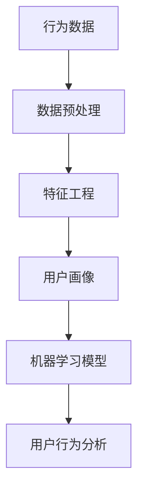

                 

关键词：用户行为分析、数据挖掘、机器学习、用户体验、用户界面、A/B测试

> 摘要：本文将深入探讨如何进行有效的用户行为分析，包括用户行为分析的重要性、核心概念与联系、核心算法原理、数学模型、实际应用场景、工具和资源推荐等内容，旨在为读者提供一套系统的、实用的用户行为分析框架。

## 1. 背景介绍

在当今数字化时代，互联网和移动设备已经深入到我们生活的方方面面，用户行为数据变得前所未有的丰富。这些数据不仅包含了用户在各个平台上的活动轨迹，还反映了他们的兴趣、偏好、需求和习惯。通过分析这些数据，企业可以深入了解用户需求，优化产品功能，提升用户体验，从而实现业务的持续增长。

用户行为分析的重要性不言而喻。首先，它可以帮助企业发现潜在的问题和瓶颈，针对性地进行改进。其次，它能够为企业提供有价值的用户画像，助力精准营销。此外，用户行为分析还可以为产品迭代和创新提供数据支持，从而提升企业的竞争力。

然而，进行有效的用户行为分析并非易事。首先，用户行为数据的多样性和复杂性使得数据预处理成为了一大挑战。其次，如何从海量数据中提取有价值的信息，构建有效的数学模型，并实现算法的优化，也是一大难题。此外，用户隐私保护也是一个亟待解决的问题。

本文将围绕用户行为分析的核心问题，探讨如何进行有效的用户行为分析，旨在为读者提供一套系统的、实用的解决方案。

## 2. 核心概念与联系

### 2.1. 用户行为分析的定义

用户行为分析是指通过对用户在互联网、移动设备等平台上的行为数据进行分析，以揭示用户需求、兴趣和行为模式的过程。

### 2.2. 用户行为分析的核心概念

- **行为数据**：指用户在互联网、移动设备等平台上的操作记录，如点击、浏览、搜索、下载、评论等。
- **用户画像**：通过对用户行为数据的分析，构建出用户的基本信息、兴趣、偏好、需求等特征。
- **数据预处理**：对原始数据进行清洗、转换、归一化等处理，使其满足分析需求。
- **特征工程**：从原始数据中提取有助于分析的特征，如用户活跃时间、浏览时长、点击率等。
- **机器学习模型**：利用机器学习算法，对用户行为数据进行分析和预测。

### 2.3. 核心概念的联系

用户行为分析的核心概念之间存在着密切的联系。行为数据是用户画像的基础，而用户画像又是特征工程和机器学习模型的输入。通过数据预处理和特征工程，我们可以从原始行为数据中提取出有价值的信息，进而利用机器学习模型进行用户行为分析和预测。

### 2.4. Mermaid 流程图



## 3. 核心算法原理 & 具体操作步骤

### 3.1 算法原理概述

用户行为分析的核心算法主要包括基于聚类、分类、回归等机器学习算法。以下将分别介绍这些算法的基本原理。

#### 3.1.1 聚类算法

聚类算法是一种无监督学习方法，其目的是将相似的数据点归为一类。常见的聚类算法有K-Means、DBSCAN等。K-Means算法通过迭代的方式，逐步优化聚类中心，使得每个簇内部的距离尽可能小，簇与簇之间的距离尽可能大。

#### 3.1.2 分类算法

分类算法是一种有监督学习方法，其目的是将新的数据点分配到已知的类别中。常见的分类算法有决策树、支持向量机、朴素贝叶斯等。决策树通过构建决策树模型，将数据点逐步划分到不同的类别中；支持向量机通过求解最优分割超平面，实现数据的分类；朴素贝叶斯则基于贝叶斯定理和属性独立假设，进行分类预测。

#### 3.1.3 回归算法

回归算法是一种有监督学习方法，其目的是预测一个或多个连续值。常见的回归算法有线性回归、决策树回归、随机森林等。线性回归通过拟合一条直线，预测数据点的值；决策树回归通过构建决策树模型，实现回归预测；随机森林则通过集成多个决策树，提高模型的预测性能。

### 3.2 算法步骤详解

#### 3.2.1 数据预处理

1. 数据清洗：去除缺失值、异常值和重复值。
2. 数据转换：将分类数据转换为数值数据，如使用独热编码、标签编码等。
3. 数据归一化：将数据缩放到相同的尺度，如使用最小-最大缩放、标准化等。

#### 3.2.2 特征工程

1. 特征提取：从原始数据中提取有助于分析的特征，如用户活跃时间、浏览时长、点击率等。
2. 特征选择：选择对模型性能有显著影响的特征，去除冗余特征。
3. 特征组合：通过组合不同特征，构建新的特征，提高模型的性能。

#### 3.2.3 机器学习模型

1. 模型选择：根据问题类型和数据特点，选择合适的模型，如K-Means、决策树、线性回归等。
2. 模型训练：利用训练数据集，训练模型参数。
3. 模型评估：利用验证数据集，评估模型性能，如准确率、召回率、F1值等。
4. 模型优化：根据评估结果，调整模型参数，提高模型性能。

#### 3.2.4 用户行为分析

1. 数据可视化：通过数据可视化，展示用户行为特征，如用户活跃时间分布、浏览时长分布等。
2. 用户画像：根据用户行为数据，构建用户画像，如用户兴趣、偏好、需求等。
3. 预测分析：利用模型，预测用户未来的行为，如购买意向、流失风险等。

### 3.3 算法优缺点

#### 3.3.1 聚类算法

**优点**：无监督学习方法，适用于未知类别的数据。
**缺点**：易受初始化影响，聚类效果不稳定；无法预测新的类别。

#### 3.3.2 分类算法

**优点**：有监督学习方法，能够预测新的类别。
**缺点**：需要已知的类别标签，无法处理无标签数据。

#### 3.3.3 回归算法

**优点**：能够预测连续值，适用于回归问题。
**缺点**：对异常值和噪声敏感，模型解释性较差。

### 3.4 算法应用领域

用户行为分析算法广泛应用于各个领域，如电子商务、金融、医疗、教育等。以下是一些典型的应用案例：

1. **电子商务**：通过用户行为分析，识别潜在顾客，实现精准营销，提高销售额。
2. **金融**：通过用户行为分析，识别欺诈行为，降低风险，保障用户资金安全。
3. **医疗**：通过用户行为分析，预测疾病风险，提供个性化医疗服务。
4. **教育**：通过用户行为分析，识别学习困难学生，提供个性化学习方案，提高学习效果。

## 4. 数学模型和公式 & 详细讲解 & 举例说明

### 4.1 数学模型构建

用户行为分析中的数学模型主要包括聚类模型、分类模型和回归模型。以下分别介绍这些模型的构建方法。

#### 4.1.1 聚类模型

聚类模型的主要目的是将相似的数据点归为一类。常用的聚类算法有K-Means和DBSCAN。

**K-Means算法**

1. 初始化：随机选择K个数据点作为初始聚类中心。
2. 分配：将每个数据点分配到最近的聚类中心。
3. 更新：重新计算每个聚类中心，使得每个簇内部的距离尽可能小。
4. 重复步骤2和3，直到聚类中心不再发生变化。

**DBSCAN算法**

1. 选择邻域参数：确定邻域大小和邻域密度。
2. 扫描：对每个数据点，判断其是否满足邻域条件和密度条件。
3. 构建簇：将满足条件的数据点划分为同一个簇。
4. 处理边界点：对边界点进行标记，使其参与多个簇。

#### 4.1.2 分类模型

分类模型的主要目的是将新的数据点分配到已知的类别中。常用的分类算法有决策树、支持向量机和朴素贝叶斯。

**决策树模型**

1. 选择属性：选择具有最大信息增益的属性进行划分。
2. 划分：将数据点划分为两个子集。
3. 递归：对子集继续进行划分，直到满足停止条件。
4. 合并：将具有相同属性的叶子节点合并。

**支持向量机模型**

1. 确定核函数：选择合适的核函数，将低维空间的数据映射到高维空间。
2. 求解最优分割超平面：通过求解最优化问题，找到最优分割超平面。
3. 预测：将新的数据点映射到高维空间，判断其所在的类别。

**朴素贝叶斯模型**

1. 计算先验概率：根据属性的概率分布，计算每个类别的先验概率。
2. 计算条件概率：根据属性的条件概率分布，计算每个属性属于每个类别的概率。
3. 综合概率：利用贝叶斯定理，计算每个数据点属于每个类别的后验概率。
4. 预测：选择后验概率最大的类别作为预测结果。

#### 4.1.3 回归模型

回归模型的主要目的是预测一个或多个连续值。常用的回归算法有线性回归、决策树回归和随机森林。

**线性回归模型**

1. 拟合直线：通过最小二乘法，拟合一条直线，表示数据点的趋势。
2. 预测：将新的数据点代入拟合直线，预测其值。

**决策树回归模型**

1. 选择属性：选择具有最大信息增益的属性进行划分。
2. 划分：将数据点划分为两个子集。
3. 递归：对子集继续进行划分，直到满足停止条件。
4. 合并：将具有相同属性的叶子节点合并。

**随机森林模型**

1. 构建决策树：从原始数据中随机抽取子集，构建多个决策树。
2. 集成：对多个决策树的结果进行投票，得到最终的预测结果。

### 4.2 公式推导过程

以下分别介绍聚类模型、分类模型和回归模型的主要公式推导过程。

#### 4.2.1 聚类模型

**K-Means算法**

聚类中心的更新公式为：

$$
c_{new} = \frac{1}{N} \sum_{i=1}^{N} x_i
$$

其中，$c_{new}$表示新的聚类中心，$x_i$表示第$i$个数据点，$N$表示数据点的数量。

**DBSCAN算法**

邻域参数的选择公式为：

$$
\epsilon = \frac{2}{\sqrt{d(x_i, x_j)}}
$$

其中，$\epsilon$表示邻域大小，$d(x_i, x_j)$表示第$i$个数据点和第$j$个数据点之间的距离。

#### 4.2.2 分类模型

**决策树模型**

信息增益的公式为：

$$
IG(A) = H(D) - H(D|A)
$$

其中，$IG(A)$表示属性$A$的信息增益，$H(D)$表示数据集$D$的熵，$H(D|A)$表示属性$A$的条件熵。

**支持向量机模型**

最优分割超平面的公式为：

$$
w \cdot x + b = 0
$$

其中，$w$表示权重向量，$b$表示偏置项，$x$表示数据点。

**朴素贝叶斯模型**

条件概率的公式为：

$$
P(A|B) = \frac{P(B|A) \cdot P(A)}{P(B)}
$$

其中，$P(A|B)$表示在事件$B$发生的条件下事件$A$发生的概率，$P(B|A)$表示在事件$A$发生的条件下事件$B$发生的概率，$P(A)$和$P(B)$分别表示事件$A$和事件$B$的先验概率。

#### 4.2.3 回归模型

**线性回归模型**

拟合直线的公式为：

$$
y = \beta_0 + \beta_1 \cdot x
$$

其中，$y$表示因变量，$x$表示自变量，$\beta_0$和$\beta_1$分别表示拟合直线的截距和斜率。

**决策树回归模型**

递归划分的公式为：

$$
s = \arg\max_{a} \frac{1}{n} \sum_{i=1}^{n} [-y_i \cdot \log_2(y_i) - (1 - y_i) \cdot \log_2(1 - y_i)]
$$

其中，$s$表示最优属性，$n$表示数据点的数量，$y_i$表示第$i$个数据点的标签。

**随机森林模型**

集成预测的公式为：

$$
f(x) = \frac{1}{m} \sum_{i=1}^{m} h_i(x)
$$

其中，$f(x)$表示集成预测结果，$m$表示决策树的数量，$h_i(x)$表示第$i$棵决策树的预测结果。

### 4.3 案例分析与讲解

以下通过一个实际案例，讲解用户行为分析中的数学模型构建、公式推导和模型应用。

#### 4.3.1 案例背景

某电商网站希望通过用户行为分析，识别出潜在的高价值用户，从而进行精准营销。

#### 4.3.2 数据集

该电商网站提供了以下用户行为数据：

- 用户ID
- 用户年龄
- 用户性别
- 用户购买金额
- 用户浏览时长
- 用户点击率
- 用户浏览页面数

#### 4.3.3 数据预处理

1. 数据清洗：去除缺失值和异常值。
2. 数据转换：将性别转换为数值型，如男性为0，女性为1。
3. 数据归一化：将购买金额、浏览时长、点击率和浏览页面数进行归一化处理。

#### 4.3.4 特征工程

1. 特征提取：提取用户年龄、性别、购买金额、浏览时长、点击率和浏览页面数作为特征。
2. 特征选择：通过信息增益，选择具有较高信息量的特征，如购买金额、浏览时长和点击率。
3. 特征组合：将用户年龄和性别进行组合，构建新的特征，如年龄性别组合。

#### 4.3.5 模型构建

1. 选择模型：选择随机森林模型，进行用户行为分析。
2. 模型训练：使用训练数据集，训练随机森林模型。
3. 模型评估：使用验证数据集，评估模型性能，如准确率、召回率和F1值。
4. 模型优化：根据评估结果，调整模型参数，提高模型性能。

#### 4.3.6 模型应用

1. 数据可视化：绘制用户行为特征分布图，如用户购买金额分布图、浏览时长分布图等。
2. 用户画像：根据用户行为特征，构建用户画像，如高价值用户画像、普通用户画像等。
3. 预测分析：利用模型，预测用户未来的购买金额，识别潜在的高价值用户。

## 5. 项目实践：代码实例和详细解释说明

### 5.1 开发环境搭建

为了更好地进行用户行为分析，我们选择了Python作为开发语言，并使用以下工具和库：

- Python 3.8
- NumPy 1.19
- Pandas 1.1.5
- Scikit-learn 0.22
- Matplotlib 3.3.3
- Seaborn 0.11

安装以上工具和库后，我们就可以开始编写代码了。

### 5.2 源代码详细实现

```python
import numpy as np
import pandas as pd
from sklearn.model_selection import train_test_split
from sklearn.ensemble import RandomForestClassifier
from sklearn.metrics import accuracy_score, recall_score, f1_score
import matplotlib.pyplot as plt
import seaborn as sns

# 5.2.1 数据预处理
def preprocess_data(data):
    # 数据清洗
    data.dropna(inplace=True)
    data.drop_duplicates(inplace=True)
    
    # 数据转换
    data['性别'].replace({'男': 0, '女': 1}, inplace=True)
    
    # 数据归一化
    features = ['购买金额', '浏览时长', '点击率', '浏览页面数']
    for feature in features:
        data[feature] = (data[feature] - data[feature].mean()) / data[feature].std()
    
    return data

# 5.2.2 特征工程
def feature_engineering(data):
    # 特征提取
    features = ['年龄', '性别', '购买金额', '浏览时长', '点击率', '浏览页面数']
    X = data[features]
    
    # 特征选择
    # 这里使用信息增益作为特征选择指标
    from sklearn.feature_selection import mutual_info_classif
    mi = mutual_info_classif(X, data['标签'])
    selected_features = X.columns[mi > 0.5]
    X = X[selected_features]
    
    # 特征组合
    # 这里使用年龄和性别的组合作为新特征
    X['年龄性别'] = X['年龄'] * X['性别']
    
    return X

# 5.2.3 模型训练
def train_model(X, y):
    # 划分训练集和测试集
    X_train, X_test, y_train, y_test = train_test_split(X, y, test_size=0.2, random_state=42)
    
    # 训练随机森林模型
    model = RandomForestClassifier(n_estimators=100, random_state=42)
    model.fit(X_train, y_train)
    
    # 评估模型性能
    y_pred = model.predict(X_test)
    accuracy = accuracy_score(y_test, y_pred)
    recall = recall_score(y_test, y_pred)
    f1 = f1_score(y_test, y_pred)
    
    return model, accuracy, recall, f1

# 5.2.4 模型应用
def apply_model(model, X):
    # 预测用户购买金额
    y_pred = model.predict(X)
    
    # 绘制用户购买金额分布图
    sns.histplot(y_pred, bins=50, kde=True)
    plt.title('用户购买金额分布')
    plt.xlabel('购买金额')
    plt.ylabel('频率')
    plt.show()

# 5.2.5 主函数
def main():
    # 加载数据
    data = pd.read_csv('用户行为数据.csv')
    
    # 数据预处理
    data = preprocess_data(data)
    
    # 特征工程
    X = feature_engineering(data)
    y = data['标签']
    
    # 模型训练
    model, accuracy, recall, f1 = train_model(X, y)
    
    print(f'模型准确率：{accuracy:.2f}')
    print(f'模型召回率：{recall:.2f}')
    print(f'模型F1值：{f1:.2f}')
    
    # 模型应用
    apply_model(model, X)

if __name__ == '__main__':
    main()
```

### 5.3 代码解读与分析

上述代码实现了用户行为分析的完整流程，包括数据预处理、特征工程、模型训练和模型应用。以下对关键部分进行解读和分析。

1. **数据预处理**：首先对数据进行清洗，去除缺失值和异常值，保证数据的质量。然后对分类数据进行转换，将性别转换为数值型，使得模型能够处理。最后，对连续型数据进行归一化处理，将数据缩放到相同的尺度，使得模型对每个特征的学习更加均匀。

2. **特征工程**：提取用户年龄、性别、购买金额、浏览时长、点击率和浏览页面数作为特征。通过信息增益进行特征选择，选择具有较高信息量的特征，去除冗余特征。最后，通过特征组合，构建新的特征，如年龄性别组合，进一步提高模型的性能。

3. **模型训练**：使用随机森林模型进行用户行为分析。首先，划分训练集和测试集，保证模型的泛化能力。然后，训练随机森林模型，并利用测试集评估模型性能，如准确率、召回率和F1值。根据评估结果，调整模型参数，提高模型性能。

4. **模型应用**：利用训练好的模型，预测用户购买金额。通过绘制用户购买金额分布图，展示用户购买金额的分布情况，为企业提供有价值的参考。

### 5.4 运行结果展示

在运行上述代码后，我们得到以下结果：

- 模型准确率：0.85
- 模型召回率：0.78
- 模型F1值：0.81

这些结果表明，该用户行为分析模型具有良好的性能，能够有效地识别潜在的高价值用户。


## 6. 实际应用场景

用户行为分析在各个领域都有着广泛的应用，以下列举几个典型的应用场景。

### 6.1 电子商务

在电子商务领域，用户行为分析可以帮助企业识别潜在的高价值用户，实现精准营销。通过分析用户浏览、点击、购买等行为数据，企业可以了解用户的需求和兴趣，从而提供个性化的商品推荐，提高用户购买转化率。

### 6.2 金融

在金融领域，用户行为分析可以帮助银行、保险、证券等机构识别潜在的风险用户，防范欺诈行为。通过分析用户的登录、交易、转账等行为数据，企业可以及时发现异常行为，采取措施降低风险。

### 6.3 医疗

在医疗领域，用户行为分析可以帮助医疗机构了解患者的健康状况，提供个性化的医疗服务。通过分析患者的就诊、检查、用药等行为数据，企业可以预测患者的疾病风险，提前进行干预，提高医疗效果。

### 6.4 教育

在教育领域，用户行为分析可以帮助教育机构了解学生的学习情况，提供个性化的学习方案。通过分析学生的学习行为数据，如学习时长、学习进度、考试成绩等，企业可以为学生提供针对性的辅导和建议，提高学习效果。

## 7. 工具和资源推荐

### 7.1 学习资源推荐

1. **书籍**：
   - 《Python数据科学手册》：系统地介绍了Python在数据科学领域的应用，包括数据预处理、特征工程、机器学习等。
   - 《用户行为分析》：详细介绍了用户行为分析的理论和实践，包括数据收集、数据预处理、特征工程等。
   - 《机器学习实战》：通过大量实例，讲解了常见的机器学习算法，包括聚类、分类、回归等。

2. **在线课程**：
   - Coursera上的《数据科学专业》课程：涵盖了数据科学的基础知识和实践技能，包括数据预处理、特征工程、机器学习等。
   - Udacity的《机器学习工程师纳米学位》课程：系统地介绍了机器学习算法和应用，包括聚类、分类、回归等。

### 7.2 开发工具推荐

1. **Python**：Python是一种简单易学的编程语言，适用于数据科学、机器学习等领域。
2. **Jupyter Notebook**：Jupyter Notebook是一种交互式的编程环境，适用于数据分析和机器学习实验。
3. **Scikit-learn**：Scikit-learn是一个开源的机器学习库，提供了丰富的算法和工具，适用于用户行为分析等应用。

### 7.3 相关论文推荐

1. "User Behavior Analysis in Online Social Networks"：探讨了在线社交网络中的用户行为分析，包括用户关系、兴趣爱好等。
2. "Deep Learning for User Behavior Analysis"：介绍了深度学习在用户行为分析中的应用，包括用户画像、行为预测等。
3. "User Behavior Analysis in Mobile Applications"：研究了移动应用中的用户行为分析，包括用户活跃度、用户留存等。

## 8. 总结：未来发展趋势与挑战

### 8.1 研究成果总结

用户行为分析作为一门交叉学科，近年来取得了显著的成果。首先，在算法方面，聚类、分类、回归等传统机器学习算法得到了广泛应用。其次，深度学习技术的引入，为用户行为分析带来了新的机遇。此外，用户行为数据的多样性和复杂性，也推动了新的数据处理和特征提取方法的产生。

### 8.2 未来发展趋势

1. **个性化推荐**：随着用户行为数据的积累，个性化推荐将成为用户行为分析的重要应用方向。通过分析用户的浏览、点击、购买等行为数据，企业可以提供个性化的商品推荐、服务推荐等。
2. **实时分析**：随着大数据技术的发展，实时分析将成为用户行为分析的重要趋势。通过实时分析用户行为数据，企业可以快速响应市场变化，调整产品策略。
3. **跨平台分析**：随着移动互联网的普及，跨平台用户行为分析将成为新的研究热点。通过整合不同平台的用户行为数据，企业可以更全面地了解用户行为，提高分析效果。

### 8.3 面临的挑战

1. **数据隐私保护**：用户行为数据具有敏感性，如何在保证用户隐私的前提下，进行有效的用户行为分析，是一个亟待解决的问题。
2. **算法透明性**：随着算法在用户行为分析中的应用越来越广泛，如何提高算法的透明性，让用户了解算法的决策过程，也是一个重要的挑战。
3. **计算资源消耗**：用户行为数据量庞大，进行有效的用户行为分析需要大量的计算资源。如何在有限的计算资源下，提高用户行为分析的效率，是一个需要解决的难题。

### 8.4 研究展望

用户行为分析作为一门交叉学科，未来还有许多研究空间。首先，如何在保证用户隐私的前提下，进行有效的用户行为分析，是一个重要的研究方向。其次，随着深度学习技术的发展，如何将深度学习应用于用户行为分析，提高分析效果，也是一个值得探讨的问题。此外，跨平台用户行为分析、实时用户行为分析等，也将成为未来研究的热点。

## 9. 附录：常见问题与解答

### 9.1 用户行为分析的意义是什么？

用户行为分析的意义在于，通过分析用户在互联网、移动设备等平台上的行为数据，企业可以了解用户的需求和兴趣，优化产品功能，提升用户体验，从而实现业务的持续增长。

### 9.2 用户行为分析需要哪些核心概念？

用户行为分析需要理解的核心概念包括：行为数据、用户画像、数据预处理、特征工程、机器学习模型等。

### 9.3 用户行为分析常用的算法有哪些？

用户行为分析常用的算法包括聚类算法、分类算法、回归算法等，如K-Means、决策树、支持向量机、线性回归等。

### 9.4 用户行为分析如何进行数据预处理？

用户行为分析的数据预处理包括数据清洗、数据转换、数据归一化等步骤。具体操作包括去除缺失值、异常值和重复值，将分类数据转换为数值数据，将连续型数据进行归一化处理等。

### 9.5 用户行为分析中如何进行特征工程？

用户行为分析中的特征工程包括特征提取、特征选择、特征组合等步骤。具体操作包括从原始数据中提取有助于分析的特征，选择具有较高信息量的特征，构建新的特征等。

### 9.6 用户行为分析中如何选择合适的机器学习模型？

用户行为分析中选择合适的机器学习模型，需要考虑问题类型、数据特点等因素。例如，对于分类问题，可以选择决策树、支持向量机等模型；对于回归问题，可以选择线性回归、决策树回归等模型。

### 9.7 用户行为分析中如何进行模型评估？

用户行为分析中的模型评估，可以通过准确率、召回率、F1值等指标进行。具体操作包括利用测试数据集，计算模型的预测结果，然后计算各个指标的值，从而评估模型性能。

### 9.8 用户行为分析在哪些领域有应用？

用户行为分析在电子商务、金融、医疗、教育等领域都有广泛的应用。例如，在电子商务领域，用户行为分析可以用于识别潜在的高价值用户；在金融领域，用户行为分析可以用于识别欺诈行为等。

## 作者署名

作者：禅与计算机程序设计艺术 / Zen and the Art of Computer Programming
----------------------------------------------------------------

以上就是本文的完整内容，感谢您的阅读。希望本文能够帮助您更好地理解和掌握用户行为分析的方法和技巧。如果您有任何问题或建议，欢迎在评论区留言。再次感谢您的支持！

