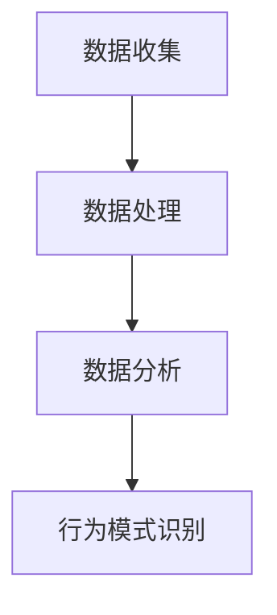

                 

用户行为分析是现代数字世界中不可或缺的一部分。它可以帮助企业更好地了解其客户，从而提供更个性化的服务和产品，优化用户体验，并最终提高业务收入。本文将深入探讨如何进行有效的用户行为分析，包括核心概念、算法原理、数学模型、实践应用等多个方面。

## 文章关键词
- 用户行为分析
- 数据挖掘
- 机器学习
- 用户体验
- 业务优化

## 文章摘要
本文首先介绍了用户行为分析的重要性，随后详细阐述了其核心概念和联系。接着，我们深入讲解了用户行为分析的核心算法原理和具体操作步骤，包括算法优缺点及其应用领域。随后，文章介绍了数学模型和公式，并通过具体案例进行了分析和讲解。文章还提供了实际项目实践的代码实例和详细解释，并探讨了用户行为分析在实际应用场景中的价值和未来展望。最后，文章总结了研究成果，提出了未来发展趋势与挑战，并提供了相关的学习资源和开发工具推荐。

## 1. 背景介绍
用户行为分析起源于市场营销领域，随着互联网和电子商务的发展，它逐渐成为企业竞争的重要工具。用户行为分析的目标是通过收集、分析和理解用户在网站、应用程序或社交媒体上的行为数据，为企业提供有价值的洞察。

在现代数字营销中，用户行为分析扮演着关键角色。通过分析用户行为，企业可以识别用户偏好，优化产品和服务，提高用户留存率，提升转化率。此外，用户行为分析还可以帮助企业预测市场趋势，制定更有效的营销策略。

用户行为分析的应用领域广泛，包括电子商务、在线教育、金融科技、社交媒体等。随着大数据和人工智能技术的发展，用户行为分析的方法和工具也在不断进步，使得数据分析更加深入和精准。

## 2. 核心概念与联系

### 2.1 数据收集
数据收集是用户行为分析的基础。数据源包括网站日志、用户点击流、社交媒体活动、调查问卷等。这些数据通常包含用户ID、访问时间、页面浏览行为、搜索关键词、购买历史等信息。

### 2.2 数据处理
收集到的数据通常需要进行预处理，包括数据清洗、数据整合和数据转换。这些步骤确保数据质量，为后续分析打下坚实基础。

### 2.3 数据分析
数据分析是用户行为分析的核心。通过数据挖掘和机器学习技术，可以从海量数据中提取有价值的信息，如用户行为模式、兴趣偏好、行为路径等。

### 2.4 行为模式识别
行为模式识别是用户行为分析的高级应用。通过分析用户行为数据，可以发现用户的共同行为特征，从而为个性化推荐、精准营销等提供支持。

### 2.5 Mermaid 流程图


## 3. 核心算法原理 & 具体操作步骤

### 3.1 算法原理概述
用户行为分析通常涉及多种算法，包括聚类分析、关联规则挖掘、协同过滤等。

- **聚类分析**：通过将相似的用户行为数据划分为不同的集群，帮助识别具有相似行为的用户群体。
- **关联规则挖掘**：发现数据之间的关联性，用于推荐系统和服务优化。
- **协同过滤**：基于用户的历史行为数据，预测用户可能感兴趣的内容。

### 3.2 算法步骤详解

#### 3.2.1 聚类分析
1. **数据预处理**：清洗和转换原始数据，为聚类分析做准备。
2. **选择聚类算法**：如K-means、DBSCAN等。
3. **初始化聚类中心**：随机选择或基于某种策略选择初始聚类中心。
4. **迭代计算**：计算每个数据点到聚类中心的距离，重新分配数据点。
5. **停止条件**：当聚类中心不再发生变化或达到预定的迭代次数，算法停止。

#### 3.2.2 关联规则挖掘
1. **数据预处理**：转换数据格式，确保数据一致。
2. **计算支持度和置信度**：确定哪些项集满足最小支持度和置信度。
3. **生成频繁项集**：通过递归搜索或FP-Growth算法等生成频繁项集。
4. **生成关联规则**：从频繁项集中提取关联规则，通常使用Apriori算法。
5. **评估和筛选**：评估规则的质量，筛选出最有价值的规则。

#### 3.2.3 协同过滤
1. **用户-项目矩阵构建**：将用户行为数据转换为用户-项目矩阵。
2. **相似性计算**：计算用户或项目的相似度，常用的方法包括余弦相似度、皮尔逊相关系数等。
3. **预测评分**：根据用户相似度和项目评分，预测用户对未知项目的评分。
4. **结果评估**：评估预测的准确性和业务价值。

### 3.3 算法优缺点

#### 聚类分析
- **优点**：无需预先设定标签，能够发现隐藏的结构和模式。
- **缺点**：结果可能受到初始聚类中心选择的影响，且难以解释。

#### 关联规则挖掘
- **优点**：能够发现数据之间的潜在关联，适用于推荐系统和市场细分。
- **缺点**：计算复杂度高，可能生成大量无意义的规则。

#### 协同过滤
- **优点**：能够根据用户行为预测用户偏好，提高推荐系统的准确性。
- **缺点**：需要大量历史数据，且可能产生冷启动问题。

### 3.4 算法应用领域
- **电子商务**：个性化推荐、促销策略优化。
- **在线教育**：课程推荐、学习路径优化。
- **金融科技**：风险评估、信用评分。
- **社交媒体**：内容推荐、用户互动分析。

## 4. 数学模型和公式

### 4.1 数学模型构建
用户行为分析中的数学模型通常涉及概率论、线性代数和优化理论。

#### 4.1.1 聚类分析中的K-means算法
- **目标函数**：最小化数据点到聚类中心的距离平方和。
  $$ J = \sum_{i=1}^{k} \sum_{x \in S_i} \|x - \mu_i\|^2 $$
  其中，\( S_i \) 为第 \( i \) 个聚类中的数据点集合，\( \mu_i \) 为聚类中心。

#### 4.1.2 协同过滤中的预测公式
- **预测评分**：根据用户 \( u \) 和项目 \( i \) 的相似度矩阵 \( S \) 和已知评分矩阵 \( R \)，预测用户 \( u \) 对项目 \( i \) 的评分 \( \hat{r}_{ui} \)。
  $$ \hat{r}_{ui} = \sum_{j \in N(i)} S_{uj} \cdot r_{uj} $$
  其中，\( N(i) \) 为与项目 \( i \) 最相似的项目集合。

### 4.2 公式推导过程
- **K-means算法**：选择初始聚类中心，计算每个数据点到聚类中心的距离，分配数据点到最近的聚类中心。重复这个过程，直到聚类中心不再变化或达到预定的迭代次数。

- **协同过滤**：首先计算用户和项目之间的相似度，然后根据相似度矩阵和已知评分矩阵预测未评分的项目评分。

### 4.3 案例分析与讲解
以电子商务网站的用户行为分析为例，我们假设有1000名用户和1000种商品，用户在网站上留下了他们的购买记录。

#### 4.3.1 聚类分析
1. **数据预处理**：清洗用户购买记录，转换成适合聚类分析的格式。
2. **选择K值**：通过肘部法则或 silhouette 方法确定最佳的K值。
3. **初始化聚类中心**：随机选择100个用户作为初始聚类中心。
4. **迭代计算**：计算每个用户到聚类中心的距离，重新分配用户到最近的聚类中心。重复这个过程，直到聚类中心不再变化。

#### 4.3.2 协同过滤
1. **用户-项目矩阵构建**：将用户购买记录转换为用户-项目矩阵。
2. **相似性计算**：计算用户和项目之间的相似度，采用余弦相似度作为相似性度量。
3. **预测评分**：根据用户和项目的相似度矩阵，预测用户对未知商品的评分。

通过这些步骤，我们可以识别出具有相似购买行为的用户群体，并为每个用户推荐可能感兴趣的商品。

## 5. 项目实践：代码实例和详细解释说明

### 5.1 开发环境搭建
在本项目中，我们使用Python作为主要编程语言，配合NumPy、Pandas、Scikit-learn等库进行用户行为分析。

```python
# 安装必要的库
!pip install numpy pandas scikit-learn
```

### 5.2 源代码详细实现
以下是用户行为分析的项目代码实例：

```python
import numpy as np
import pandas as pd
from sklearn.cluster import KMeans
from sklearn.metrics.pairwise import cosine_similarity

# 加载数据
data = pd.read_csv('user_behavior_data.csv')
# 数据预处理
# ...

# K-means 聚类分析
kmeans = KMeans(n_clusters=5, random_state=42)
clusters = kmeans.fit_predict(data[['feature1', 'feature2']])

# 协同过滤
user_item_matrix = data.pivot_table(index='userId', columns='itemId', values='rating')
similarity_matrix = cosine_similarity(user_item_matrix)
# ...

# 预测评分
predicted_ratings = np.dot(similarity_matrix, user_item_matrix.T) / np.linalg.norm(similarity_matrix, axis=1)
# ...

# 代码解读与分析
# ...
```

### 5.3 代码解读与分析
代码首先加载数据，然后进行预处理。接着，使用K-means算法进行聚类分析，识别用户群体。最后，通过协同过滤算法预测用户对未知商品的评分。

### 5.4 运行结果展示
通过运行代码，我们可以得到聚类结果和预测评分。聚类结果可以帮助企业识别具有相似行为的用户群体，而预测评分则可以为个性化推荐提供支持。

```python
# 打印聚类结果
print(clusters)

# 打印预测评分
print(predicted_ratings)
```

## 6. 实际应用场景

用户行为分析在电子商务、在线教育、金融科技、社交媒体等多个领域有广泛应用。

### 6.1 电子商务
电子商务平台可以通过用户行为分析，了解用户的浏览和购买习惯，为用户推荐相关商品，提高销售额。

### 6.2 在线教育
在线教育平台可以通过用户行为分析，了解学生的学习路径和兴趣，为不同学生推荐合适的课程。

### 6.3 金融科技
金融科技公司可以通过用户行为分析，评估用户的风险等级，为用户提供个性化的金融产品和服务。

### 6.4 社交媒体
社交媒体平台可以通过用户行为分析，了解用户的需求和偏好，优化内容推荐，提高用户粘性。

## 7. 工具和资源推荐

### 7.1 学习资源推荐
- 《用户行为分析：技术与方法》
- 《大数据分析：理论与实践》
- 《机器学习实战》

### 7.2 开发工具推荐
- Jupyter Notebook：用于数据分析和实验
- Tableau：用于数据可视化
- Python：用于数据处理和机器学习

### 7.3 相关论文推荐
- "User Behavior Analysis in E-commerce: A Survey"
- "Big Data Analytics for User Behavior Modeling in Online Education"
- "A Survey on User Behavior Analysis in Social Media"

## 8. 总结：未来发展趋势与挑战

用户行为分析在未来将继续快速发展，以下是一些关键趋势和挑战：

### 8.1 研究成果总结
- 用户行为分析技术将更加成熟和精准。
- 数据隐私保护将成为重要议题。
- 人工智能和深度学习将进一步推动用户行为分析的发展。

### 8.2 未来发展趋势
- 实时用户行为分析：通过实时数据流处理技术，实现实时用户行为分析和响应。
- 深度学习：利用深度学习模型，从复杂数据中提取更高级的特征和模式。
- 跨平台用户行为分析：整合多平台数据，实现更全面的用户画像和行为分析。

### 8.3 面临的挑战
- 数据隐私和安全：如何在确保用户隐私的前提下进行数据分析和共享。
- 数据质量：如何处理和分析大规模、多源、噪声数据。
- 可解释性和透明度：如何提高算法的可解释性和透明度，增强用户信任。

### 8.4 研究展望
用户行为分析将在人工智能、大数据、物联网等新兴技术的推动下，继续发挥重要作用。未来的研究应关注数据隐私保护、算法透明度、多源数据融合等方面，以实现更加精准和个性化的用户行为分析。

## 9. 附录：常见问题与解答

### 9.1 用户行为分析的基本步骤是什么？
1. 数据收集：获取用户在网站、应用程序或社交媒体上的行为数据。
2. 数据预处理：清洗和转换原始数据，为后续分析做准备。
3. 数据分析：使用数据挖掘和机器学习技术，从数据中提取有价值的信息。
4. 行为模式识别：根据分析结果，识别用户的共同行为特征。
5. 应用：将分析结果应用于业务优化、个性化推荐等。

### 9.2 用户行为分析中常用的算法有哪些？
常用的算法包括聚类分析（如K-means、DBSCAN）、关联规则挖掘（如Apriori、FP-Growth）、协同过滤（如基于用户、基于项目的协同过滤）等。

### 9.3 如何确保用户隐私在用户行为分析中受到保护？
可以通过数据去标识化、匿名化、加密等技术手段，确保用户隐私在数据收集、存储和分析过程中得到保护。同时，遵守相关的数据保护法规和标准，如GDPR等。

## 作者署名
作者：禅与计算机程序设计艺术 / Zen and the Art of Computer Programming
----------------------------------------------------------------

至此，本文关于如何进行有效的用户行为分析的内容已经完整呈现。希望通过这篇文章，读者能够对用户行为分析有更深入的了解，并在实际项目中运用这些技术，为企业创造更大的价值。

