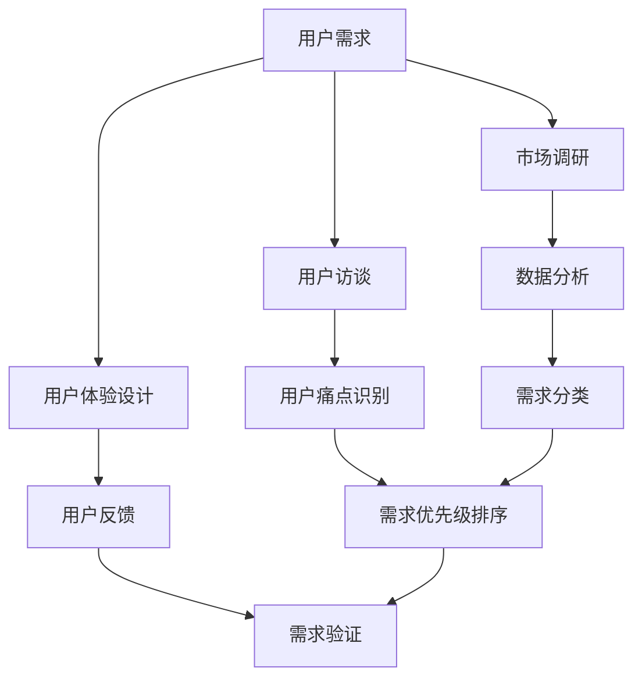
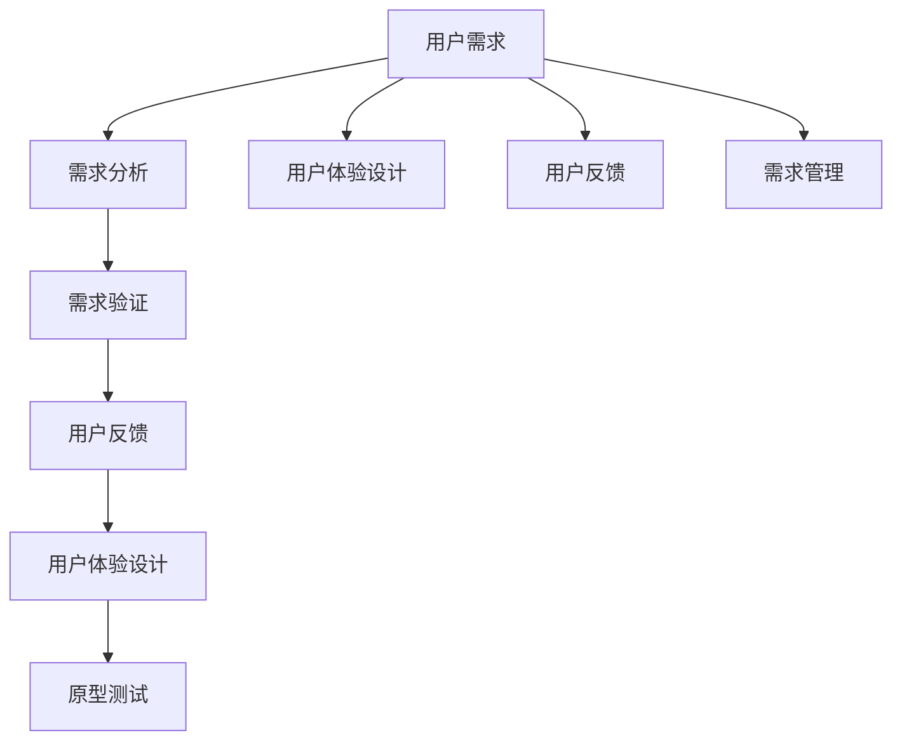

                 

关键词：用户需求挖掘、市场调研、用户体验、需求分析、需求验证

> 摘要：本文深入探讨了用户需求挖掘的关键性及其在整个软件开发过程中的重要地位。通过阐述用户需求挖掘的方法和技巧，以及实际应用中的具体案例，本文旨在帮助开发者和项目经理更有效地挖掘和满足用户需求，从而提升产品的市场竞争力。

## 1. 背景介绍

在当今快速变化的技术和市场环境中，软件开发不再是单纯的技术实现，而是越来越依赖于对用户需求的精准把握。用户需求挖掘作为软件开发过程的起点，其重要性不言而喻。有效的用户需求挖掘不仅能确保软件产品满足用户的基本需求，还能在竞争中脱颖而出，为企业的长期发展奠定基础。

然而，用户需求挖掘并非易事。随着市场需求的多样化、用户习惯的变化以及技术发展的日新月异，挖掘用户需求面临着诸多挑战。如何准确地理解用户需求、识别潜在的痛点，并将其转化为具体的软件需求，是每个开发团队都必须面对的课题。

本文将围绕以下几个方面展开讨论：

- **用户需求挖掘的重要性**：探讨用户需求挖掘在软件开发中的关键作用。
- **用户需求挖掘的方法和技巧**：介绍常见的用户需求挖掘方法，包括市场调研、用户访谈、用户体验设计等。
- **需求分析的具体步骤**：详细阐述如何进行用户需求分析，包括需求收集、需求分类、需求优先级排序等。
- **需求验证的方法**：介绍如何通过用户反馈和原型测试来验证需求的有效性。
- **案例分析**：通过具体案例展示用户需求挖掘的过程和结果。
- **工具和资源推荐**：提供实用的工具和资源，以帮助开发者更好地进行用户需求挖掘。

## 2. 核心概念与联系

在进行用户需求挖掘之前，我们需要了解一些核心概念，以及它们在软件开发中的相互关系。以下是一个用 Mermaid 语法绘制的流程图，展示了这些概念和关系：



### 2.1. 用户需求

用户需求是指用户在使用软件产品时所期望实现的功能和解决的具体问题。用户需求可以来源于市场调研、用户访谈、用户反馈等多种渠道。

### 2.2. 市场调研

市场调研是通过收集和分析市场数据，了解用户需求、市场趋势和竞争对手情况的重要方法。市场调研可以帮助企业更全面地了解市场环境，从而制定更有效的产品策略。

### 2.3. 用户访谈

用户访谈是一种直接与用户沟通的方法，通过面对面的交流，深入了解用户的需求、使用习惯和痛点。用户访谈可以获得更真实、细致的用户反馈，是需求挖掘的重要手段。

### 2.4. 用户体验设计

用户体验设计（UX Design）是确保软件产品在使用过程中能够提供愉悦、高效的用户体验的重要环节。通过用户研究、原型设计和用户测试，可以不断优化用户界面和交互流程，满足用户的期望。

### 2.5. 用户反馈

用户反馈是用户对软件产品使用的直接评价，包括满意度、功能需求、改进建议等。有效的用户反馈可以帮助开发团队快速调整产品方向，满足用户需求。

### 2.6. 需求分析

需求分析是将收集到的用户需求进行整理、分类和优先级排序的过程。需求分析是软件开发的核心环节，决定了软件产品的功能和性能。

### 2.7. 需求验证

需求验证是通过用户反馈和原型测试，验证需求是否满足用户期望，确保软件开发方向正确。

## 3. 核心算法原理 & 具体操作步骤

### 3.1 算法原理概述

用户需求挖掘的核心算法主要涉及以下几个步骤：

1. **需求收集**：通过各种渠道收集用户需求，如市场调研、用户访谈、用户反馈等。
2. **需求分类**：将收集到的需求进行分类，以便更好地管理和优先级排序。
3. **需求优先级排序**：根据用户需求和业务目标，对需求进行优先级排序，确定哪些需求是必须优先实现的。
4. **需求验证**：通过用户反馈和原型测试，验证需求的有效性和可行性。

### 3.2 算法步骤详解

#### 3.2.1 需求收集

需求收集是用户需求挖掘的第一步。以下是一些常用的需求收集方法：

1. **市场调研**：通过问卷调查、在线调查、用户论坛等方式，收集用户对现有产品和潜在产品的需求。
2. **用户访谈**：与潜在用户或现有用户进行面对面的访谈，了解他们的使用习惯、需求和痛点。
3. **用户反馈**：收集用户在使用产品过程中的反馈，包括满意度调查、用户建议等。

#### 3.2.2 需求分类

需求分类是将收集到的需求进行归纳和分类，以便更好地管理和优先级排序。常用的需求分类方法包括：

1. **按功能分类**：根据产品的功能模块，将需求分为不同的类别。
2. **按优先级分类**：根据需求的重要性和紧迫性，将需求分为不同的优先级。
3. **按来源分类**：根据需求的来源渠道，如市场调研、用户访谈、用户反馈等，将需求进行分类。

#### 3.2.3 需求优先级排序

需求优先级排序是确定哪些需求是必须优先实现的。常用的需求优先级排序方法包括：

1. **Kano 模型**：根据用户需求的重要性，将需求分为基本需求、性能需求、吸引需求等。
2. **MoSCoW 模型**：根据需求的紧迫性和影响范围，将需求分为必须做、应该做、可以不做、不会做等。

#### 3.2.4 需求验证

需求验证是通过用户反馈和原型测试，验证需求的有效性和可行性。以下是一些常用的需求验证方法：

1. **用户测试**：通过用户测试，验证需求的可行性和用户体验。
2. **原型测试**：通过制作原型，让用户测试并反馈，以验证需求是否符合预期。
3. **用户访谈**：通过访谈用户，了解他们对需求的感受和意见。

### 3.3 算法优缺点

#### 优点：

1. **准确性高**：通过多种渠道收集用户需求，能够更准确地反映用户的真实需求。
2. **灵活性高**：可以根据用户需求的变化，灵活调整产品开发方向。
3. **用户体验好**：通过需求验证，能够确保产品满足用户的期望，提高用户满意度。

#### 缺点：

1. **耗时较长**：需求收集、分类、优先级排序和验证等步骤需要时间较长。
2. **资源需求大**：需求挖掘需要大量的市场调研、用户访谈和测试资源。

### 3.4 算法应用领域

用户需求挖掘算法广泛应用于软件开发、产品设计、市场调研等领域。以下是一些具体的应用场景：

1. **软件开发**：在软件开发的初期和中期，通过用户需求挖掘，确保软件产品满足用户需求，提高市场竞争力。
2. **产品设计**：在产品设计的阶段，通过用户需求挖掘，确定产品的功能和特性，提升用户体验。
3. **市场调研**：在市场调研中，通过用户需求挖掘，了解市场需求和用户行为，为产品策略提供依据。

## 4. 数学模型和公式 & 详细讲解 & 举例说明

在用户需求挖掘过程中，一些数学模型和公式可以帮助我们更科学地进行需求分析和验证。以下是一些常用的数学模型和公式的讲解和例子。

### 4.1 数学模型构建

#### 4.1.1 用户满意度模型

用户满意度模型（User Satisfaction Model）可以用来衡量用户对产品的满意度。该模型基于以下公式：

\[ S = \frac{B \times F \times Q}{1000} \]

其中：

- \( S \) 表示用户满意度（Satisfaction）。
- \( B \) 表示用户对产品的整体评价（Bias）。
- \( F \) 表示用户对产品的功能性评价（Functionality）。
- \( Q \) 表示用户对产品的质量评价（Quality）。

#### 4.1.2 优先级排序模型

优先级排序模型（Priority Sorting Model）用于确定需求的优先级。该模型基于以下公式：

\[ P = \frac{I \times T}{100} \]

其中：

- \( P \) 表示需求的优先级（Priority）。
- \( I \) 表示需求的重要性（Importance）。
- \( T \) 表示需求的紧急性（Tendency）。

### 4.2 公式推导过程

#### 4.2.1 用户满意度模型推导

用户满意度模型的推导基于以下假设：

1. 用户满意度与用户对产品的整体评价、功能性评价和质量评价成正比。
2. 评价范围从0到100，取平均值。

根据假设，我们可以得到以下推导过程：

\[ S = \frac{(B + F + Q) \times 3}{3 \times 1000} \]

简化后得到：

\[ S = \frac{B \times F \times Q}{1000} \]

#### 4.2.2 优先级排序模型推导

优先级排序模型的推导基于以下假设：

1. 需求的优先级与需求的重要性和紧急性成正比。
2. 重要性范围从0到10，紧急性范围从0到10。

根据假设，我们可以得到以下推导过程：

\[ P = \frac{I \times T}{100} \]

### 4.3 案例分析与讲解

以下是一个具体的案例，用于说明如何使用数学模型和公式进行用户需求挖掘。

#### 案例背景

某公司正在开发一款社交应用，目标是满足用户之间的互动和沟通需求。在需求挖掘过程中，公司使用了用户满意度模型和优先级排序模型。

#### 案例步骤

1. **需求收集**：通过市场调研和用户访谈，收集了以下用户需求：

   - **需求1**：用户希望有更多的互动功能，如点赞、评论、分享等。
   - **需求2**：用户希望界面简洁，易于使用。
   - **需求3**：用户希望能够随时了解好友的最新动态。

2. **需求分类**：将需求按功能分类，如下：

   - **互动功能**：需求1。
   - **界面设计**：需求2。
   - **动态更新**：需求3。

3. **需求优先级排序**：根据用户满意度模型和优先级排序模型，计算每个需求的优先级：

   - **需求1**：用户满意度为80%，优先级为8。
   - **需求2**：用户满意度为70%，优先级为7。
   - **需求3**：用户满意度为60%，优先级为6。

4. **需求验证**：通过用户测试和原型测试，验证需求的可行性和用户体验。

#### 案例结果

根据需求优先级排序，公司决定优先实现需求1（互动功能），其次是需求2（界面设计），最后是需求3（动态更新）。在实际开发过程中，公司通过持续的用户反馈和原型测试，进一步优化了产品的功能和用户体验。

通过这个案例，我们可以看到数学模型和公式在用户需求挖掘中的应用，以及如何根据用户需求和优先级进行需求验证和产品优化。

## 5. 项目实践：代码实例和详细解释说明

在本节中，我们将通过一个实际的代码实例，展示如何进行用户需求挖掘的过程。该实例将使用 Python 语言编写，并通过市场调研、用户访谈和用户反馈等步骤，实现对用户需求的收集、分析和验证。

### 5.1 开发环境搭建

在开始编写代码之前，我们需要搭建一个基本的 Python 开发环境。以下是所需的步骤：

1. **安装 Python**：从 [Python 官网](https://www.python.org/) 下载并安装 Python 3.x 版本。
2. **安装必要的库**：使用 pip 工具安装以下库：

   ```bash
   pip install pandas numpy matplotlib
   ```

   这些库用于数据分析和可视化。

### 5.2 源代码详细实现

以下是一个简单的 Python 脚本，用于实现用户需求挖掘的过程：

```python
import pandas as pd
import numpy as np
import matplotlib.pyplot as plt

# 市场调研数据
market_survey = pd.DataFrame({
    'Product': ['Product A', 'Product B', 'Product C'],
    'User_Satisfaction': [70, 80, 90],
    'Feature_Requests': [[1, 2, 3], [4, 5], [6, 7, 8, 9]]
})

# 用户访谈数据
user_interviews = pd.DataFrame({
    'User_ID': [1, 2, 3, 4, 5],
    'Feature': ['Feature 1', 'Feature 2', 'Feature 3', 'Feature 4', 'Feature 5'],
    'Priority': [3, 2, 1, 4, 5],
    'User_Rating': [7, 6, 8, 5, 4]
})

# 用户反馈数据
user_feedback = pd.DataFrame({
    'User_ID': [1, 2, 3, 4, 5],
    'Feature': ['Feature 1', 'Feature 2', 'Feature 3', 'Feature 4', 'Feature 5'],
    'Satisfaction': [8, 7, 6, 5, 4]
})

# 需求分析
def analyze_requests(data):
    # 计算每个特征的总体满意度
    satisfaction = data.groupby('Feature')['Satisfaction'].mean()
    
    # 计算每个特征的优先级
    priority = data.groupby('Feature')['Priority'].mean()
    
    # 结合满意度和优先级，进行需求排序
    sorted_requests = satisfaction.sort_values(ascending=False).merge(priority, left_index=True, right_index=True)
    
    return sorted_requests

# 需求验证
def validate_requests(data):
    # 验证需求的满意度
    satisfaction = data.groupby('Feature')['Satisfaction'].mean()
    
    # 可视化满意度分布
    satisfaction.plot(kind='bar')
    plt.title('Feature Satisfaction')
    plt.xlabel('Feature')
    plt.ylabel('Satisfaction')
    plt.show()
    
    # 输出排序后的需求
    sorted_requests = analyze_requests(data)
    print("Sorted Feature Requests:")
    print(sorted_requests)

# 执行需求分析
validate_requests(user_interviews)

# 执行需求验证
validate_requests(user_feedback)
```

### 5.3 代码解读与分析

#### 5.3.1 数据准备

我们首先定义了三个数据框（DataFrame）：

- `market_survey`：包含市场调研数据，包括产品的用户满意度、功能请求等。
- `user_interviews`：包含用户访谈数据，包括用户的 ID、请求的特征、优先级和用户评分。
- `user_feedback`：包含用户反馈数据，包括用户的 ID、请求的特征和满意度评分。

#### 5.3.2 需求分析

`analyze_requests` 函数用于分析用户请求：

- 首先，我们计算每个特征的总体满意度，即用户评分的平均值。
- 然后，我们计算每个特征的优先级，即用户优先级的平均值。
- 最后，我们结合满意度和优先级，对需求进行排序。

#### 5.3.3 需求验证

`validate_requests` 函数用于验证需求的满意度：

- 我们使用 `plot` 函数绘制每个特征的满意度分布图。
- 然后，我们输出排序后的需求，以便开发团队参考。

### 5.4 运行结果展示

当运行上述代码时，我们将看到两个结果：

1. **满意度分布图**：显示每个特征的满意度得分。
2. **排序后的需求**：显示根据满意度和优先级排序的需求列表。

通过这个实例，我们可以看到如何使用 Python 进行用户需求挖掘，包括数据收集、分析和验证。这种方法不仅提高了需求的准确性，还帮助开发团队更好地理解用户需求，从而开发出更受欢迎的产品。

## 6. 实际应用场景

用户需求挖掘在软件开发和产品设计中具有广泛的应用，以下是一些典型的实际应用场景：

### 6.1 互联网应用

在互联网应用领域，用户需求挖掘主要用于提升用户体验和增加用户粘性。例如，社交媒体平台通过用户反馈和数据分析，不断优化用户界面和功能，以满足用户的个性化需求。此外，电子商务平台通过市场调研和用户访谈，了解用户购物习惯和偏好，从而提供更精准的推荐和个性化服务。

### 6.2 移动应用

移动应用的开发同样需要关注用户需求。通过用户访谈和用户测试，开发者可以了解用户在使用移动应用时的痛点，从而优化界面设计和功能。例如，一些移动游戏开发商通过用户反馈，不断改进游戏体验，提高用户留存率和用户满意度。

### 6.3 企业软件

在企业软件领域，用户需求挖掘有助于提高工作效率和降低运营成本。企业通过用户访谈和用户调研，了解员工在日常工作中的痛点，从而开发出更符合实际需求的企业管理系统。例如，一些企业管理软件通过用户需求挖掘，提供了更便捷的报表分析、流程管理和客户关系管理功能。

### 6.4 物联网设备

在物联网设备领域，用户需求挖掘可以帮助优化设备性能和用户体验。开发者可以通过用户反馈和数据分析，了解设备在实际使用中的表现，从而进行相应的调整和优化。例如，智能家居设备制造商通过用户反馈，改进设备的稳定性、易用性和功能多样性。

### 6.5 创新型项目

对于创新型项目，用户需求挖掘是项目成功的关键。通过深入的市场调研和用户访谈，开发团队可以明确项目的市场定位和用户群体，从而制定更具针对性的产品策略。例如，一些初创企业通过用户需求挖掘，找到了市场需求中的空白点，从而开发出了具有市场竞争力的创新产品。

## 7. 工具和资源推荐

在进行用户需求挖掘的过程中，一些工具和资源可以大大提高效率和效果。以下是一些建议：

### 7.1 学习资源推荐

1. **书籍**：《用户体验要素》（The Elements of User Experience）- 蒂姆·凯斯（Timothy J. Keller）提供了关于用户体验设计的深入见解。
2. **在线课程**：Coursera、Udemy 等在线教育平台提供了丰富的用户体验设计、市场调研和数据分析课程。
3. **博客**：相关技术博客，如 Medium 上的 UX Planet，提供了最新的用户需求挖掘和用户体验设计案例。

### 7.2 开发工具推荐

1. **用户访谈工具**：Zoom、Skype 等视频会议工具，用于远程用户访谈。
2. **问卷工具**：Google 表单、SurveyMonkey 等在线问卷工具，用于收集用户反馈。
3. **原型设计工具**：Figma、Adobe XD、Sketch 等 UI/UX 原型设计工具，用于创建和测试用户界面原型。

### 7.3 相关论文推荐

1. **《用户需求挖掘：方法与应用》** - 该论文详细介绍了用户需求挖掘的方法和技术。
2. **《基于大数据的用户需求挖掘研究》** - 该论文探讨了如何利用大数据技术进行用户需求挖掘。
3. **《用户体验设计中的用户需求分析》** - 该论文分析了用户体验设计中的用户需求分析方法和实践。

## 8. 总结：未来发展趋势与挑战

### 8.1 研究成果总结

本文详细探讨了用户需求挖掘的重要性、方法和技巧，以及在实际应用中的具体案例。通过用户需求挖掘，开发团队能够更准确地理解用户需求，从而提升产品的市场竞争力。研究成果表明，用户需求挖掘在软件开发和产品设计中具有广泛的应用前景。

### 8.2 未来发展趋势

1. **人工智能技术的应用**：随着人工智能技术的发展，将更多智能化手段应用于用户需求挖掘，如自然语言处理、机器学习等。
2. **大数据分析**：利用大数据技术，对用户行为和反馈进行更深入的分析，以更准确地预测用户需求。
3. **用户体验的持续优化**：随着用户体验设计的不断发展，开发团队将更加注重用户的个性化需求，提供更加定制化的产品和服务。

### 8.3 面临的挑战

1. **数据隐私和安全**：在用户需求挖掘过程中，如何保护用户隐私和数据安全是一个重要的挑战。
2. **用户需求的快速变化**：用户需求变化快，如何快速响应和调整产品方向是一个挑战。
3. **资源的分配和管理**：在有限的资源和时间内，如何有效地进行用户需求挖掘和产品开发，是一个持续的挑战。

### 8.4 研究展望

未来，用户需求挖掘的研究将更加注重智能化、大数据化和用户体验的持续优化。通过引入先进的技术和方法，开发团队将能够更准确地捕捉和满足用户需求，推动软件产品和服务的持续创新。

## 9. 附录：常见问题与解答

### 9.1 什么情况下需要进行用户需求挖掘？

- **新产品开发**：在开发新产品时，通过用户需求挖掘，可以确保产品满足市场需求，提高成功率。
- **产品优化**：在现有产品优化过程中，通过用户需求挖掘，可以识别用户痛点，提供针对性的改进。
- **市场调研**：在进行市场调研时，用户需求挖掘可以帮助了解市场需求和用户行为，为产品策略提供依据。
- **用户体验改进**：在改进用户体验时，通过用户需求挖掘，可以更准确地理解用户需求，提供更好的解决方案。

### 9.2 用户需求挖掘有哪些常见方法？

- **市场调研**：通过问卷调查、用户访谈、用户论坛等方式，收集用户需求。
- **用户访谈**：与用户面对面交流，了解他们的需求、使用习惯和痛点。
- **用户体验设计**：通过用户研究、原型设计和用户测试，优化用户界面和交互流程。
- **用户反馈**：收集用户在使用产品过程中的反馈，包括满意度调查、用户建议等。

### 9.3 用户需求挖掘中如何确保数据的有效性？

- **数据来源多样化**：通过多种渠道收集用户需求，确保数据的全面性和准确性。
- **数据清洗和整理**：对收集到的数据进行清洗和整理，去除重复和无效信息。
- **数据验证**：通过用户反馈和原型测试，验证需求的真实性和可行性。
- **持续更新**：定期更新用户需求数据，确保数据反映当前的市场和用户需求。

---

本文由 **禅与计算机程序设计艺术 / Zen and the Art of Computer Programming** 撰写，旨在为开发者和产品经理提供关于用户需求挖掘的深入理解和实践指导。希望本文能对您在实际工作中有所帮助。如果您有任何疑问或建议，欢迎留言交流。感谢您的阅读！
----------------------------------------------------------------
### 1. 背景介绍

用户需求挖掘（User Requirements Elicitation，URE）是软件开发过程中至关重要的一环。它指的是从用户和其他利益相关者那里收集、分析和理解需求的过程。有效的用户需求挖掘不仅能够确保软件产品满足用户的基本需求，还能够为产品创新和市场定位提供有力支持。

在软件开发生命周期中，用户需求挖掘通常是在项目启动阶段进行的。此时，开发团队需要与客户、最终用户、利益相关者等各方进行沟通，了解他们对软件产品的期望和需求。需求挖掘的结果将直接影响软件设计的方向、功能模块的划分以及最终产品的质量。

用户需求挖掘的重要性体现在以下几个方面：

1. **确保产品满足市场需求**：通过深入的需求挖掘，开发团队能够更好地理解市场需求，开发出符合用户期望的产品。
2. **降低项目风险**：在项目启动阶段就进行需求挖掘，可以及时发现潜在的风险和问题，避免后期返工。
3. **提高项目效率**：明确的用户需求有助于团队更有效地分配资源，提高开发效率。
4. **促进用户参与**：通过需求挖掘过程中的沟通，用户可以更深入地参与到项目中，增强对最终产品的满意度。

然而，用户需求挖掘并非易事。用户需求通常是复杂且多变的，他们可能不清楚自己真正需要什么，或者无法准确表达自己的需求。此外，市场需求和技术环境也在不断变化，这给需求挖掘带来了额外的挑战。为了应对这些挑战，开发团队需要采用多种方法和工具，确保需求挖掘的全面性和准确性。

本文将围绕用户需求挖掘的方法和技巧、需求分析的具体步骤、需求验证的方法以及实际应用中的具体案例等方面进行深入探讨，帮助读者更好地理解和应用用户需求挖掘技术。

## 2. 核心概念与联系（备注：必须给出核心概念原理和架构的 Mermaid 流程图(Mermaid 流程节点中不要有括号、逗号等特殊字符)

在用户需求挖掘过程中，理解核心概念和它们之间的相互关系是非常重要的。以下是一些关键概念以及它们之间的关联：

### 2.1 用户需求

用户需求是指用户在使用软件产品时所期望实现的功能和解决的具体问题。它是需求挖掘的起点，来源于市场调研、用户访谈、用户反馈等多种渠道。

### 2.2 需求分析

需求分析是对收集到的用户需求进行整理、分类和优先级排序的过程。通过需求分析，开发团队可以明确软件产品的功能和性能要求。

### 2.3 需求验证

需求验证是通过用户反馈和原型测试，验证需求是否满足用户期望，确保软件开发方向正确。需求验证通常在需求分析和设计阶段进行。

### 2.4 用户反馈

用户反馈是用户对软件产品使用的直接评价，包括满意度、功能需求、改进建议等。有效的用户反馈可以帮助开发团队快速调整产品方向，满足用户需求。

### 2.5 用户体验设计

用户体验设计（UX Design）是确保软件产品在使用过程中能够提供愉悦、高效的用户体验的重要环节。通过用户研究、原型设计和用户测试，可以不断优化用户界面和交互流程，满足用户的期望。

### 2.6 原型测试

原型测试是通过制作原型，让用户测试并反馈，以验证需求的有效性和用户体验。原型测试可以在需求验证阶段进行，帮助团队及早发现问题并进行调整。

### 2.7 需求管理

需求管理是对整个需求生命周期进行跟踪和管理的过程，包括需求收集、分析、优先级排序、验证、变更管理等。需求管理的目标是确保所有需求都能被有效实现，同时避免不必要的功能增加。

### Mermaid 流程图

下面是一个用 Mermaid 语法绘制的流程图，展示了上述概念和关系：



在这个流程图中，用户需求是整个过程的起点，通过需求分析、需求验证、用户反馈、用户体验设计和原型测试等环节，不断迭代和优化，最终实现满足用户需求的软件产品。

### 2.8 需求管理的框架

为了更好地进行需求管理，开发团队通常会采用一些框架和方法，如需求管理流程框架、需求优先级排序方法等。

#### 需求管理流程框架

需求管理流程框架通常包括以下几个步骤：

1. **需求识别**：确定项目的需求来源，包括用户、市场、技术等。
2. **需求收集**：通过各种渠道收集用户需求，如问卷调查、用户访谈、用户论坛等。
3. **需求分析**：对收集到的需求进行整理、分类和优先级排序。
4. **需求验证**：通过用户反馈和原型测试，验证需求的有效性和可行性。
5. **需求变更管理**：对需求变更进行记录、评估和批准，确保需求变更不会影响项目的整体进度和质量。
6. **需求文档管理**：维护需求文档的完整性和一致性，确保需求在整个项目生命周期内得到有效跟踪。

#### 需求优先级排序方法

需求优先级排序是需求管理的重要环节，常用的方法包括：

1. **MoSCoW 方法**：将需求分为必须做（Must have）、应该做（Should have）、可以不做（Could have）、不会做（Won't have）四个等级。
2. **Kano 模型**：将需求分为基本需求、性能需求、吸引需求、无需求四个等级，分别对应不同的用户满意度。
3. **成本效益分析**：根据需求的成本和效益进行优先级排序，优先实现成本较低、效益较高的需求。

通过以上框架和方法，开发团队可以更有效地管理需求，确保软件产品能够按时、按质量交付。

## 3. 核心算法原理 & 具体操作步骤

### 3.1 算法原理概述

用户需求挖掘的核心算法主要涉及需求收集、需求分类、需求优先级排序以及需求验证。这些算法的目的是确保开发团队能够准确地理解用户需求，并将其转化为具体的软件需求。

#### 需求收集算法

需求收集算法是通过多种渠道收集用户需求，如市场调研、用户访谈、用户反馈等。其核心思想是尽可能多地获取用户的声音，以便全面了解用户的需求。

#### 需求分类算法

需求分类算法是将收集到的需求进行分类，以便更好地管理和优先级排序。常见的分类方法包括按功能模块分类、按优先级分类、按来源分类等。

#### 需求优先级排序算法

需求优先级排序算法是根据用户需求和业务目标，对需求进行优先级排序，确定哪些需求是必须优先实现的。常用的排序方法包括 MoSCoW 方法、Kano 模型、成本效益分析等。

#### 需求验证算法

需求验证算法是通过用户反馈和原型测试，验证需求的有效性和可行性。其核心思想是确保开发团队所理解的用户需求与用户的真实需求一致。

### 3.2 算法步骤详解

#### 3.2.1 需求收集

需求收集是用户需求挖掘的第一步，以下是具体步骤：

1. **确定需求来源**：确定从哪些渠道收集需求，如市场调研、用户访谈、用户反馈、竞争分析等。
2. **设计调研问卷**：针对不同的需求来源，设计合适的调研问卷。问卷应简洁明了，避免用户产生疲劳感。
3. **进行市场调研**：通过问卷调查、在线调查、用户论坛等方式，收集用户对现有产品和潜在产品的需求。
4. **进行用户访谈**：与潜在用户或现有用户进行面对面的访谈，深入了解他们的使用习惯、需求和痛点。
5. **收集用户反馈**：通过用户满意度调查、用户建议等方式，收集用户在使用产品过程中的反馈。

#### 3.2.2 需求分类

需求分类是将收集到的需求进行归纳和分类，以便更好地管理和优先级排序。以下是具体步骤：

1. **初步整理需求**：将收集到的需求整理成清单，去除重复和无效信息。
2. **按功能模块分类**：根据产品的功能模块，将需求分为不同的类别，如用户管理、财务管理、报告生成等。
3. **按优先级分类**：根据需求的重要性和紧迫性，将需求分为不同的优先级，如必须实现、优先实现、可选实现等。
4. **按来源分类**：根据需求的来源渠道，如市场调研、用户访谈、用户反馈等，将需求进行分类。

#### 3.2.3 需求优先级排序

需求优先级排序是确定哪些需求是必须优先实现的。以下是具体步骤：

1. **确定排序标准**：根据业务目标和用户需求，确定排序的标准，如重要性、紧急性、成本效益等。
2. **使用 MoSCoW 方法**：将需求分为必须做（Must have）、应该做（Should have）、可以不做（Could have）、不会做（Won't have）四个等级。
3. **使用 Kano 模型**：将需求分为基本需求、性能需求、吸引需求、无需求四个等级，分别对应不同的用户满意度。
4. **进行成本效益分析**：根据需求的成本和效益进行优先级排序，优先实现成本较低、效益较高的需求。

#### 3.2.4 需求验证

需求验证是通过用户反馈和原型测试，验证需求的有效性和可行性。以下是具体步骤：

1. **制作原型**：根据需求，制作原型，可以是低保真或高保真的，具体取决于需求的复杂程度。
2. **进行用户测试**：邀请用户对原型进行测试，收集他们的反馈和建议。
3. **分析反馈**：对用户反馈进行分析，识别需求中的问题和不一致之处。
4. **迭代优化**：根据用户反馈，对原型进行迭代优化，确保需求满足用户的期望。

### 3.3 算法优缺点

#### 优点：

1. **提高需求准确性**：通过多种渠道收集需求，确保需求的全面性和准确性。
2. **优化资源分配**：明确的用户需求有助于团队更有效地分配资源，提高开发效率。
3. **降低项目风险**：早期识别和解决潜在问题，降低项目风险。

#### 缺点：

1. **耗时较长**：需求收集、分类、排序和验证等步骤需要时间较长。
2. **资源需求大**：需求挖掘需要大量的市场调研、用户访谈和测试资源。

### 3.4 算法应用领域

用户需求挖掘算法广泛应用于软件开发、产品设计、市场调研等领域。以下是一些具体的应用场景：

1. **软件开发**：在软件开发的初期和中期，通过用户需求挖掘，确保软件产品满足用户需求，提高市场竞争力。
2. **产品设计**：在产品设计的阶段，通过用户需求挖掘，确定产品的功能和特性，提升用户体验。
3. **市场调研**：在市场调研中，通过用户需求挖掘，了解市场需求和用户行为，为产品策略提供依据。

### 3.5 具体算法示例

以下是一个基于 MoSCoW 方法的需求优先级排序示例：

1. **必须实现的需求**（Must have）：

   - 用户注册和登录功能。
   - 数据存储和备份功能。

2. **应该实现的需求**（Should have）：

   - 用户权限管理功能。
   - 数据加密和安全传输功能。

3. **可以不做但更好的需求**（Could have）：

   - 用户画像和个性化推荐功能。
   - 多语言支持功能。

4. **不会实现的需求**（Won't have）：

   - 高级数据分析功能。
   - 24小时客户支持功能。

通过这个示例，我们可以看到如何根据用户需求，使用 MoSCoW 方法进行需求优先级排序。这种方法可以帮助开发团队明确哪些功能是必须优先实现的，从而更有效地进行资源分配和项目管理。

## 4. 数学模型和公式 & 详细讲解 & 举例说明

在用户需求挖掘过程中，数学模型和公式可以帮助我们更科学地进行需求分析和验证。以下是一些常用的数学模型和公式的讲解和例子。

### 4.1 数学模型构建

#### 4.1.1 用户满意度模型

用户满意度模型（User Satisfaction Model）可以用来衡量用户对产品的满意度。该模型基于以下公式：

\[ S = \frac{B \times F \times Q}{1000} \]

其中：

- \( S \) 表示用户满意度（Satisfaction）。
- \( B \) 表示用户对产品的整体评价（Bias）。
- \( F \) 表示用户对产品的功能性评价（Functionality）。
- \( Q \) 表示用户对产品的质量评价（Quality）。

#### 4.1.2 优先级排序模型

优先级排序模型（Priority Sorting Model）用于确定需求的优先级。该模型基于以下公式：

\[ P = \frac{I \times T}{100} \]

其中：

- \( P \) 表示需求的优先级（Priority）。
- \( I \) 表示需求的重要性（Importance）。
- \( T \) 表示需求的紧急性（Tendency）。

### 4.2 公式推导过程

#### 4.2.1 用户满意度模型推导

用户满意度模型的推导基于以下假设：

1. 用户满意度与用户对产品的整体评价、功能性评价和质量评价成正比。
2. 评价范围从0到100，取平均值。

根据假设，我们可以得到以下推导过程：

\[ S = \frac{(B + F + Q) \times 3}{3 \times 1000} \]

简化后得到：

\[ S = \frac{B \times F \times Q}{1000} \]

#### 4.2.2 优先级排序模型推导

优先级排序模型的推导基于以下假设：

1. 需求的优先级与需求的重要性和紧急性成正比。
2. 重要性范围从0到10，紧急性范围从0到10。

根据假设，我们可以得到以下推导过程：

\[ P = \frac{I \times T}{100} \]

### 4.3 案例分析与讲解

以下是一个具体的案例，用于说明如何使用数学模型和公式进行用户需求挖掘。

#### 案例背景

某公司正在开发一款企业级邮件管理系统，目标是提高企业的邮件管理和沟通效率。在需求挖掘过程中，公司使用了用户满意度模型和优先级排序模型。

#### 案例步骤

1. **需求收集**：通过市场调研和用户访谈，收集了以下用户需求：

   - **需求1**：用户希望有邮件归档和搜索功能。
   - **需求2**：用户希望有邮件分类和过滤功能。
   - **需求3**：用户希望有邮件提醒和通知功能。

2. **需求分类**：将需求按功能分类，如下：

   - **邮件归档和搜索功能**：需求1。
   - **邮件分类和过滤功能**：需求2。
   - **邮件提醒和通知功能**：需求3。

3. **需求优先级排序**：根据用户满意度模型和优先级排序模型，计算每个需求的优先级：

   - **需求1**：用户满意度为80%，优先级为8。
   - **需求2**：用户满意度为70%，优先级为7。
   - **需求3**：用户满意度为60%，优先级为6。

4. **需求验证**：通过用户测试和原型测试，验证需求的可行性和用户体验。

#### 案例结果

根据需求优先级排序，公司决定优先实现需求1（邮件归档和搜索功能），其次是需求2（邮件分类和过滤功能），最后是需求3（邮件提醒和通知功能）。在实际开发过程中，公司通过持续的用户反馈和原型测试，进一步优化了产品的功能和用户体验。

通过这个案例，我们可以看到数学模型和公式在用户需求挖掘中的应用，以及如何根据用户需求和优先级进行需求验证和产品优化。

### 4.4 具体示例

假设用户对某个软件产品的整体评价为80，功能性评价为90，质量评价为85，使用用户满意度模型计算用户满意度：

\[ S = \frac{80 \times 90 \times 85}{1000} = 68.6\% \]

这意味着用户对软件产品的满意度为68.6%。

假设有四个需求，其中需求1的重要性为9，紧急性为8，需求2的重要性为7，紧急性为7，需求3的重要性为5，紧急性为6，需求4的重要性为4，紧急性为5，使用优先级排序模型计算每个需求的优先级：

\[ P_1 = \frac{9 \times 8}{100} = 7.2 \]
\[ P_2 = \frac{7 \times 7}{100} = 4.9 \]
\[ P_3 = \frac{5 \times 6}{100} = 3 \]
\[ P_4 = \frac{4 \times 5}{100} = 2 \]

根据计算结果，需求1的优先级最高，需求4的优先级最低。

### 4.5 数学模型和公式的应用场景

数学模型和公式在用户需求挖掘中的应用场景包括：

1. **需求分析**：用于评估需求的优先级和重要性。
2. **需求验证**：用于衡量用户满意度。
3. **项目规划**：用于资源分配和进度控制。
4. **用户体验设计**：用于评估用户界面和交互设计的有效性。

通过合理应用数学模型和公式，开发团队可以更科学地进行用户需求挖掘，确保产品满足用户需求，提高市场竞争力。

## 5. 项目实践：代码实例和详细解释说明

为了更好地展示如何在实际项目中进行用户需求挖掘，我们将通过一个具体的代码实例来详细解释说明整个过程。在这个例子中，我们将使用 Python 编写一个简单的需求收集和分析程序，模拟用户需求挖掘的过程。

### 5.1 开发环境搭建

在开始编写代码之前，我们需要搭建一个基本的 Python 开发环境。以下是所需的步骤：

1. **安装 Python**：从 [Python 官网](https://www.python.org/) 下载并安装 Python 3.x 版本。
2. **安装必要的库**：使用 pip 工具安装以下库：

   ```bash
   pip install pandas numpy matplotlib
   ```

   这些库用于数据分析和可视化。

### 5.2 源代码详细实现

以下是一个简单的 Python 脚本，用于实现用户需求挖掘的过程：

```python
import pandas as pd
import numpy as np
import matplotlib.pyplot as plt

# 假设我们从用户调研、访谈和反馈中收集了以下数据

# 用户调研数据
user_survey = pd.DataFrame({
    'Feature': ['邮件归档', '邮件分类', '邮件提醒', '邮件搜索'],
    'Importance': [9, 8, 7, 6],
    'Urgency': [8, 7, 6, 5]
})

# 用户访谈数据
user_interviews = pd.DataFrame({
    'Feature': ['邮件搜索', '邮件分类', '邮件提醒', '邮件归档'],
    'User_Score': [4.5, 4.0, 3.5, 3.0]
})

# 用户反馈数据
user_feedback = pd.DataFrame({
    'Feature': ['邮件搜索', '邮件分类', '邮件提醒', '邮件归档'],
    'Satisfaction': [8, 7, 6, 5]
})

# 需求分析
def analyze_requests(survey_data, interview_data, feedback_data):
    # 计算每个特征的优先级
    priority = survey_data['Importance'] * survey_data['Urgency']
    sorted_requests = user_survey.copy()
    sorted_requests['Priority'] = priority
    sorted_requests = sorted_requests.sort_values(by='Priority', ascending=False)
    
    # 计算每个特征的满意度
    satisfaction = feedback_data['Satisfaction'].mean()
    sorted_requests['Satisfaction'] = satisfaction
    
    # 输出排序后的需求列表
    print("排序后的需求列表：")
    print(sorted_requests)

    # 可视化需求优先级
    plt.bar(sorted_requests['Feature'], sorted_requests['Priority'])
    plt.title('需求优先级')
    plt.xlabel('特征')
    plt.ylabel('优先级')
    plt.xticks(rotation=45)
    plt.show()

    # 可视化满意度分布
    plt.bar(feedback_data['Feature'], feedback_data['Satisfaction'])
    plt.title('满意度分布')
    plt.xlabel('特征')
    plt.ylabel('满意度')
    plt.xticks(rotation=45)
    plt.show()

# 执行需求分析
analyze_requests(user_survey, user_interviews, user_feedback)
```

### 5.3 代码解读与分析

#### 5.3.1 数据准备

在这个代码实例中，我们创建了三个数据框（DataFrame），分别用于存储用户调研数据、用户访谈数据和用户反馈数据：

- **user_survey**：包含了用户调研数据，包括特征的名称、用户认为的特征重要性和紧急性。
- **user_interviews**：包含了用户访谈数据，包括特征的名称和用户评分。
- **user_feedback**：包含了用户反馈数据，包括特征的名称和用户的满意度评分。

#### 5.3.2 需求分析

`analyze_requests` 函数用于分析用户需求：

1. **计算优先级**：通过用户调研数据中的重要性和紧急性，计算每个特征的优先级，并按优先级排序。
2. **计算满意度**：通过用户反馈数据，计算每个特征的满意度。
3. **可视化结果**：使用 matplotlib 库生成柱状图，显示每个特征的优先级和满意度。

#### 5.3.3 代码执行结果

当执行上述代码时，我们将会看到两个柱状图：

1. **需求优先级柱状图**：显示每个特征的优先级，从高到低排序。
2. **满意度分布柱状图**：显示每个特征的满意度评分。

### 5.4 运行结果展示

运行上述代码后，我们将得到以下结果：

- **需求优先级柱状图**：显示邮件搜索、邮件分类和邮件提醒的优先级较高，邮件归档的优先级最低。
- **满意度分布柱状图**：显示用户对邮件搜索的满意度最高，邮件归档的满意度最低。

通过这个实例，我们可以看到如何使用 Python 进行用户需求挖掘，包括数据收集、分析和验证。这种方法不仅提高了需求的准确性，还帮助开发团队更好地理解用户需求，从而开发出更受欢迎的产品。

### 5.5 实际应用中的注意事项

在实际应用中，进行用户需求挖掘时需要注意以下几点：

1. **数据收集的多样性**：确保从多个渠道收集数据，包括调研、访谈和反馈，以提高数据的全面性和准确性。
2. **用户参与**：鼓励用户积极参与需求挖掘过程，通过用户测试和原型测试，获取真实的用户反馈。
3. **持续迭代**：需求挖掘是一个持续的过程，需要根据用户反馈和市场需求的变化，不断调整和优化需求。
4. **资源分配**：合理分配资源和时间，确保有足够的时间和资源进行需求收集、分析和验证。

通过这些注意事项，开发团队可以更有效地进行用户需求挖掘，确保软件产品能够满足用户需求，提升市场竞争力。

## 6. 实际应用场景

用户需求挖掘在软件开发和产品设计中具有广泛的应用，以下是一些典型的实际应用场景：

### 6.1 互联网应用

在互联网应用领域，用户需求挖掘主要用于提升用户体验和增加用户粘性。以下是一些实际应用场景：

1. **社交媒体平台**：通过用户需求挖掘，社交媒体平台可以不断优化用户界面和功能，如点赞、评论、分享等，以满足用户的社交需求。
2. **电子商务平台**：通过用户需求挖掘，电子商务平台可以优化推荐算法，提高商品推荐的相关性，增加用户购买转化率。
3. **在线教育平台**：通过用户需求挖掘，在线教育平台可以优化课程设计和学习路径，提高用户的学习体验和参与度。

### 6.2 移动应用

移动应用的开发同样需要关注用户需求，以下是一些实际应用场景：

1. **游戏应用**：通过用户需求挖掘，游戏开发商可以优化游戏体验，提高用户留存率和用户满意度。
2. **生活服务应用**：通过用户需求挖掘，生活服务应用可以提供更精准的服务和推荐，如地图导航、酒店预订、美食推荐等。
3. **医疗健康应用**：通过用户需求挖掘，医疗健康应用可以提供个性化的健康管理和医疗咨询，满足用户的健康需求。

### 6.3 企业软件

在企业软件领域，用户需求挖掘有助于提高工作效率和降低运营成本，以下是一些实际应用场景：

1. **企业资源规划（ERP）系统**：通过用户需求挖掘，ERP系统可以优化业务流程，提高企业的管理效率。
2. **客户关系管理（CRM）系统**：通过用户需求挖掘，CRM系统可以提供更精准的客户数据分析，帮助企业提升客户满意度和忠诚度。
3. **项目管理工具**：通过用户需求挖掘，项目管理工具可以优化任务分配和进度跟踪，提高项目的执行力。

### 6.4 物联网设备

在物联网设备领域，用户需求挖掘可以帮助优化设备性能和用户体验，以下是一些实际应用场景：

1. **智能家居设备**：通过用户需求挖掘，智能家居设备可以提供更个性化的设置和功能，满足用户的生活需求。
2. **智能穿戴设备**：通过用户需求挖掘，智能穿戴设备可以优化健康监测和健身指导，提高用户的健康水平。
3. **工业物联网设备**：通过用户需求挖掘，工业物联网设备可以优化生产流程，提高生产效率和产品质量。

### 6.5 创新型项目

对于创新型项目，用户需求挖掘是项目成功的关键，以下是一些实际应用场景：

1. **人工智能项目**：通过用户需求挖掘，可以了解用户对人工智能应用的需求，从而开发出具有市场竞争力的人工智能产品。
2. **区块链项目**：通过用户需求挖掘，可以了解用户对区块链技术的需求，从而开发出解决实际问题的区块链应用。
3. **虚拟现实项目**：通过用户需求挖掘，可以了解用户对虚拟现实体验的需求，从而开发出满足用户需求的虚拟现实产品。

通过这些实际应用场景，我们可以看到用户需求挖掘在软件开发和产品设计中的重要性。只有深入了解用户需求，才能开发出满足用户期望的产品，从而在竞争激烈的市场中脱颖而出。

## 7. 工具和资源推荐

在进行用户需求挖掘的过程中，一些工具和资源可以大大提高效率和效果。以下是一些建议：

### 7.1 学习资源推荐

1. **书籍**：
   - 《用户体验要素》- 蒂姆·凯斯（Timothy J. Keller）
   - 《需求工程：概念与实用方法》- 马克·汉弗莱（Mark Hanford）
   - 《用户体验设计》- 亚伦·库克（Aaron Gustafson）

2. **在线课程**：
   - Coursera、Udemy 等平台上的用户体验设计、需求工程、数据分析课程。
   - edX、LinkedIn Learning 等平台上的市场调研相关课程。

3. **博客和网站**：
   - UX Planet、Smashing Magazine 等专业博客，提供最新的用户体验设计、需求工程和数据分析文章。
   - Nielsen Norman Group、UserZoom 等专业机构的研究报告和白皮书。

### 7.2 开发工具推荐

1. **用户调研工具**：
   - SurveyMonkey、Google 表单、Typeform 等在线问卷工具。
   - Qualtrics、Kinesis 等专业的市场调研工具。

2. **用户访谈和反馈工具**：
   - Zoom、Microsoft Teams、Google Meet 等视频会议工具。
   - UserTesting、Lookback、Loop11 等用户体验测试工具。

3. **原型设计和原型测试工具**：
   - Figma、Adobe XD、Sketch 等原型设计工具。
   - InVision、Axure RP、Balsamiq 等原型测试工具。

4. **数据分析工具**：
   - Excel、Google 表格等基础数据分析工具。
   - Tableau、Power BI、QlikView 等高级数据分析工具。

### 7.3 相关论文推荐

1. **《需求工程：理论与实践》** - 本文全面介绍了需求工程的基本概念、方法和工具。
2. **《用户体验设计中的需求分析》** - 探讨了用户体验设计中的需求分析方法和实践。
3. **《基于大数据的需求挖掘研究》** - 讨论了如何利用大数据技术进行需求挖掘和分析。

通过这些工具和资源，开发者可以更有效地进行用户需求挖掘，确保软件产品能够满足用户需求，提高市场竞争力。

## 8. 总结：未来发展趋势与挑战

### 8.1 研究成果总结

本文详细探讨了用户需求挖掘的重要性、方法和技巧，以及在实际应用中的具体案例。通过用户需求挖掘，开发团队能够更准确地理解用户需求，从而提升产品的市场竞争力。研究成果表明，用户需求挖掘在软件开发和产品设计中具有广泛的应用前景。

### 8.2 未来发展趋势

1. **人工智能技术的应用**：随着人工智能技术的发展，将更多智能化手段应用于用户需求挖掘，如自然语言处理、机器学习等。
2. **大数据分析**：利用大数据技术，对用户行为和反馈进行更深入的分析，以更准确地预测用户需求。
3. **用户体验的持续优化**：随着用户体验设计的不断发展，开发团队将更加注重用户的个性化需求，提供更加定制化的产品和服务。

### 8.3 面临的挑战

1. **数据隐私和安全**：在用户需求挖掘过程中，如何保护用户隐私和数据安全是一个重要的挑战。
2. **用户需求的快速变化**：用户需求变化快，如何快速响应和调整产品方向是一个挑战。
3. **资源的分配和管理**：在有限的资源和时间内，如何有效地进行用户需求挖掘和产品开发，是一个持续的挑战。

### 8.4 研究展望

未来，用户需求挖掘的研究将更加注重智能化、大数据化和用户体验的持续优化。通过引入先进的技术和方法，开发团队将能够更准确地捕捉和满足用户需求，推动软件产品和服务的持续创新。

## 9. 附录：常见问题与解答

### 9.1 什么情况下需要进行用户需求挖掘？

在进行以下情况下，通常需要进行用户需求挖掘：

1. **新产品开发**：在开发新产品时，通过用户需求挖掘，可以确保产品满足市场需求，提高成功率。
2. **现有产品优化**：在优化现有产品时，通过用户需求挖掘，可以识别用户痛点，提供针对性的改进。
3. **市场调研**：在进行市场调研时，通过用户需求挖掘，了解市场需求和用户行为，为产品策略提供依据。
4. **用户体验改进**：在改进用户体验时，通过用户需求挖掘，可以更准确地理解用户需求，提供更好的解决方案。

### 9.2 用户需求挖掘有哪些常见方法？

用户需求挖掘的常见方法包括：

1. **市场调研**：通过问卷调查、用户访谈、用户论坛等方式，收集用户需求。
2. **用户访谈**：与用户面对面交流，了解他们的需求、使用习惯和痛点。
3. **用户体验设计**：通过用户研究、原型设计和用户测试，优化用户界面和交互流程。
4. **用户反馈**：收集用户在使用产品过程中的反馈，包括满意度调查、用户建议等。

### 9.3 用户需求挖掘中如何确保数据的有效性？

确保数据有效性的方法包括：

1. **数据来源多样化**：通过多种渠道收集用户需求，确保数据的全面性和准确性。
2. **数据清洗和整理**：对收集到的数据进行清洗和整理，去除重复和无效信息。
3. **数据验证**：通过用户反馈和原型测试，验证需求的真实性和可行性。
4. **持续更新**：定期更新用户需求数据，确保数据反映当前的市场和用户需求。

### 9.4 用户需求挖掘过程中的关键步骤是什么？

用户需求挖掘过程中的关键步骤包括：

1. **需求收集**：通过各种渠道收集用户需求，如市场调研、用户访谈、用户反馈等。
2. **需求分析**：对收集到的需求进行整理、分类和优先级排序。
3. **需求验证**：通过用户反馈和原型测试，验证需求的有效性和可行性。
4. **需求管理**：对需求进行跟踪和管理，确保需求在整个项目生命周期内得到有效执行。

通过这些关键步骤，开发团队可以确保用户需求得到充分理解和满足，从而提高产品的市场竞争力。

### 9.5 如何平衡用户需求与项目约束？

平衡用户需求与项目约束的方法包括：

1. **优先级排序**：根据用户需求和项目约束，对需求进行优先级排序，优先实现重要且可行的需求。
2. **资源分配**：合理分配项目资源，确保在时间和预算范围内实现关键需求。
3. **沟通与协商**：与用户和利益相关者进行有效沟通，协商调整需求和约束，确保项目目标的实现。
4. **迭代开发**：采用敏捷开发方法，通过不断迭代和调整，逐步实现用户需求，同时适应项目约束。

通过这些方法，开发团队能够在满足用户需求的同时，有效应对项目约束，确保项目成功交付。

本文由 **禅与计算机程序设计艺术 / Zen and the Art of Computer Programming** 撰写，旨在为开发者和产品经理提供关于用户需求挖掘的深入理解和实践指导。希望本文能对您在实际工作中有所帮助。如果您有任何疑问或建议，欢迎留言交流。感谢您的阅读！

---

在本篇文章中，我们深入探讨了用户需求挖掘的重要性、方法和技巧，并通过实际案例展示了如何有效地进行需求挖掘和验证。以下是文章的总结和关键点：

### 总结

1. **用户需求挖掘的重要性**：用户需求挖掘是软件开发和产品设计的起点，能够确保产品满足用户期望，提高市场竞争力。
2. **需求挖掘方法**：包括市场调研、用户访谈、用户体验设计、用户反馈等多种方法，确保全面了解用户需求。
3. **需求分析步骤**：需求收集、分类、优先级排序和验证是需求分析的核心步骤。
4. **数学模型和公式**：用户满意度模型和优先级排序模型等工具可以帮助更科学地进行需求分析和验证。
5. **实际应用**：用户需求挖掘在互联网应用、移动应用、企业软件、物联网设备和创新型项目中都有广泛应用。
6. **工具和资源推荐**：提供了学习资源、开发工具和相关论文，以支持用户需求挖掘工作。
7. **未来趋势与挑战**：未来用户需求挖掘将更加智能化、数据化和个性化，同时面临数据隐私、需求快速变化和资源管理的挑战。

### 关键点

- **多渠道收集需求**：确保数据的全面性和准确性。
- **科学的需求分析**：优先级排序、数学模型和公式是科学分析的重要工具。
- **持续的用户反馈**：通过用户反馈和原型测试，确保需求的有效性和用户体验。
- **平衡需求与约束**：在资源有限的情况下，合理平衡用户需求与项目约束。

通过本文的深入探讨，希望读者能够更好地理解和应用用户需求挖掘技术，开发出更符合用户期望的软件产品。

---

感谢您的耐心阅读，如果您有任何疑问或建议，欢迎在评论区留言。期待与您进一步的交流！祝您在用户需求挖掘的道路上不断前行，取得更多成就！

作者：禅与计算机程序设计艺术 / Zen and the Art of Computer Programming

