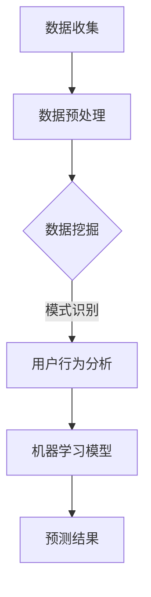

                 

在当今信息化时代，用户需求的预测与分析成为企业竞争的关键因素之一。有效的用户需求预测不仅能够帮助企业精准定位市场，优化产品开发流程，还能在激烈的市场竞争中脱颖而出。本文将深入探讨如何进行有效的用户需求预测，包括背景介绍、核心概念与联系、核心算法原理与操作步骤、数学模型与公式、项目实践、实际应用场景、工具和资源推荐以及未来发展趋势与挑战等方面的内容。

## 1. 背景介绍

随着互联网和移动设备的普及，用户行为数据日益丰富，这些数据为用户需求预测提供了宝贵的信息资源。然而，如何从海量数据中挖掘用户需求，如何将用户需求转化为具体的业务决策，成为了当前企业面临的重要问题。用户需求预测不仅可以帮助企业优化产品功能，提高用户满意度，还能通过精准营销降低成本，提高销售转化率。

本文旨在通过介绍用户需求预测的相关理论、方法和实践，帮助读者了解如何进行有效的用户需求预测，为企业的决策提供有力支持。

## 2. 核心概念与联系

在进行用户需求预测之前，我们需要明确几个核心概念，包括数据挖掘、机器学习和用户行为分析。

### 2.1 数据挖掘

数据挖掘是指从大量数据中通过统计分析和模式识别等方法发现有用信息的过程。数据挖掘在用户需求预测中起到了关键作用，通过数据挖掘，我们可以发现用户行为的规律和趋势，从而预测用户未来的需求。

### 2.2 机器学习

机器学习是一种通过算法自动从数据中学习规律并做出预测的技术。在用户需求预测中，机器学习算法可以从历史数据中学习用户行为的模式，进而预测用户未来的需求。

### 2.3 用户行为分析

用户行为分析是指通过分析用户在系统中的行为数据，如点击、浏览、搜索等，来了解用户的需求和偏好。用户行为分析是用户需求预测的重要数据来源。

### 2.4 Mermaid 流程图

以下是用户需求预测的 Mermaid 流程图，展示了数据挖掘、机器学习和用户行为分析之间的联系：



## 3. 核心算法原理 & 具体操作步骤

在进行用户需求预测时，我们通常采用以下几种核心算法：

### 3.1 算法原理概述

#### 3.1.1 决策树算法

决策树算法通过将特征值划分成多个区间，构建一棵树形结构来预测用户需求。每个节点代表一个特征，每个分支代表该特征的一个取值，叶节点表示预测结果。

#### 3.1.2 支持向量机算法

支持向量机算法通过找到一个最佳的超平面，将不同类别的数据点分离开来，从而实现分类。支持向量机算法在处理高维数据时表现优异。

#### 3.1.3 神经网络算法

神经网络算法通过多层神经网络结构来模拟人脑的神经元连接，从而实现用户需求预测。神经网络算法在处理复杂数据时具有强大的学习能力。

### 3.2 算法步骤详解

#### 3.2.1 决策树算法步骤

1. 选择一个特征作为节点；
2. 计算该特征的不同取值；
3. 根据不同取值划分数据集；
4. 重复步骤1-3，直到满足停止条件（如最大深度、最小样本量等）。

#### 3.2.2 支持向量机算法步骤

1. 选择一个核函数；
2. 训练支持向量机模型；
3. 对新数据进行分类预测。

#### 3.2.3 神经网络算法步骤

1. 初始化神经网络结构；
2. 训练神经网络模型；
3. 对新数据进行预测。

### 3.3 算法优缺点

#### 3.3.1 决策树算法

优点：易于理解和解释，计算速度快。

缺点：容易过拟合，对异常值敏感。

#### 3.3.2 支持向量机算法

优点：在处理高维数据时表现优异，泛化能力强。

缺点：训练时间较长，对参数选择敏感。

#### 3.3.3 神经网络算法

优点：强大的学习能力，能够处理复杂数据。

缺点：计算量大，对参数调整敏感，容易过拟合。

### 3.4 算法应用领域

决策树算法广泛应用于分类问题，如用户需求分类、产品推荐等。支持向量机算法在图像识别、语音识别等领域有广泛应用。神经网络算法在复杂数据处理和模式识别方面具有优势，如人脸识别、自然语言处理等。

## 4. 数学模型和公式 & 详细讲解 & 举例说明

### 4.1 数学模型构建

用户需求预测的数学模型通常包括以下几个部分：

#### 4.1.1 用户行为模型

用户行为模型描述了用户在系统中的行为规律，如点击、浏览、搜索等。我们可以通过分析用户行为数据，构建用户行为模型。

#### 4.1.2 需求预测模型

需求预测模型用于预测用户未来的需求。我们可以使用线性回归、决策树、支持向量机等算法来构建需求预测模型。

#### 4.1.3 联合概率分布模型

联合概率分布模型描述了用户行为与需求之间的概率关系。我们可以使用贝叶斯网络、隐马尔可夫模型等算法来构建联合概率分布模型。

### 4.2 公式推导过程

以下是一个简单的线性回归模型的公式推导过程：

#### 4.2.1 线性回归模型

假设我们有一个自变量 \(X\) 和因变量 \(Y\)，线性回归模型可以用以下公式表示：

$$ Y = \beta_0 + \beta_1X + \epsilon $$

其中，\( \beta_0 \) 和 \( \beta_1 \) 是模型参数，\( \epsilon \) 是误差项。

#### 4.2.2 模型参数估计

为了估计模型参数 \( \beta_0 \) 和 \( \beta_1 \)，我们可以使用最小二乘法：

$$ \beta_0 = \frac{\sum_{i=1}^{n}y_i - \beta_1\sum_{i=1}^{n}x_i}{n} $$

$$ \beta_1 = \frac{\sum_{i=1}^{n}(x_i - \bar{x})(y_i - \bar{y})}{\sum_{i=1}^{n}(x_i - \bar{x})^2} $$

其中，\( \bar{x} \) 和 \( \bar{y} \) 分别是自变量 \( X \) 和因变量 \( Y \) 的平均值，\( n \) 是样本数量。

### 4.3 案例分析与讲解

假设我们有一个电商平台的用户行为数据，包括用户点击商品、浏览商品、购买商品等行为。我们可以使用线性回归模型来预测用户的购买行为。

#### 4.3.1 数据准备

1. 收集用户行为数据，包括点击、浏览、购买等行为；
2. 对数据进行预处理，如去重、补全缺失值等；
3. 将数据划分为训练集和测试集。

#### 4.3.2 模型训练

1. 使用训练集数据训练线性回归模型；
2. 估计模型参数 \( \beta_0 \) 和 \( \beta_1 \)。

#### 4.3.3 模型评估

1. 使用测试集数据评估模型性能；
2. 计算模型的准确率、召回率、F1 值等指标。

#### 4.3.4 模型应用

1. 使用训练好的模型对新的用户行为数据进行预测；
2. 根据预测结果，为用户推荐相应的商品。

## 5. 项目实践：代码实例和详细解释说明

在本节中，我们将通过一个实际项目来展示如何进行用户需求预测。

### 5.1 开发环境搭建

1. 安装 Python 3.8 及以上版本；
2. 安装常用 Python 数据科学库，如 NumPy、Pandas、Scikit-learn、Matplotlib 等。

### 5.2 源代码详细实现

```python
import numpy as np
import pandas as pd
from sklearn.linear_model import LinearRegression
from sklearn.model_selection import train_test_split
from sklearn.metrics import accuracy_score, recall_score, f1_score

# 5.2.1 数据准备
data = pd.read_csv('user_behavior_data.csv')
data = data.drop_duplicates()
data = data.fillna(data.mean())

# 5.2.2 模型训练
X = data[['clicks', 'browsing_time']]
y = data['purchases']
X_train, X_test, y_train, y_test = train_test_split(X, y, test_size=0.2, random_state=42)

model = LinearRegression()
model.fit(X_train, y_train)

# 5.2.3 模型评估
y_pred = model.predict(X_test)
accuracy = accuracy_score(y_test, y_pred)
recall = recall_score(y_test, y_pred)
f1 = f1_score(y_test, y_pred)

print(f'Accuracy: {accuracy:.2f}')
print(f'Recall: {recall:.2f}')
print(f'F1 Score: {f1:.2f}')

# 5.2.4 模型应用
new_user = np.array([[10, 200]])
new_pred = model.predict(new_user)
print(f'New User Purchase Prediction: {"Yes" if new_pred[0] > 0 else "No"}')
```

### 5.3 代码解读与分析

1. 数据准备：我们首先读取用户行为数据，并进行预处理，如去重、补全缺失值等。
2. 模型训练：我们使用训练集数据训练线性回归模型，并估计模型参数。
3. 模型评估：我们使用测试集数据评估模型性能，计算模型的准确率、召回率、F1 值等指标。
4. 模型应用：我们使用训练好的模型对新的用户行为数据进行预测。

## 6. 实际应用场景

用户需求预测在实际应用中具有广泛的应用场景，以下是一些典型的应用场景：

1. 电子商务：通过用户行为数据预测用户的购买意愿，为用户提供个性化的产品推荐。
2. 金融行业：通过用户行为数据预测用户的金融需求，为用户提供个性化的金融产品推荐。
3. 健康医疗：通过用户行为数据预测用户的健康状况，为用户提供个性化的健康建议。
4. 社交网络：通过用户行为数据预测用户的好友关系，为用户提供社交推荐。

## 7. 工具和资源推荐

### 7.1 学习资源推荐

1. 《Python数据分析基础教程：NumPy学习指南》；
2. 《机器学习实战》；
3. 《数据挖掘：概念与技术》。

### 7.2 开发工具推荐

1. Jupyter Notebook：用于编写和运行 Python 代码；
2. VSCode：用于编写 Python 代码。

### 7.3 相关论文推荐

1. "User Behavior Prediction in E-commerce Using Machine Learning"；
2. "A Survey on User Behavior Prediction in Internet of Things"；
3. "Deep Learning for User Behavior Analysis"。

## 8. 总结：未来发展趋势与挑战

### 8.1 研究成果总结

用户需求预测技术在过去几年中取得了显著进展，主要包括：

1. 数据挖掘和机器学习算法的优化；
2. 大规模数据处理和分布式计算技术的应用；
3. 深度学习和强化学习在用户需求预测中的应用。

### 8.2 未来发展趋势

未来用户需求预测技术将朝着以下几个方向发展：

1. 更多的应用场景和行业领域；
2. 更高的预测准确率和实时性；
3. 更强的自适应性和个性化能力。

### 8.3 面临的挑战

用户需求预测技术在实际应用中仍然面临以下挑战：

1. 数据质量和数据隐私问题；
2. 高维数据和高噪声数据的处理；
3. 模型解释性和可解释性。

### 8.4 研究展望

为了解决上述挑战，未来的研究可以从以下几个方面展开：

1. 发展更高效的数据预处理和特征提取方法；
2. 提高模型的可解释性和可理解性；
3. 加强跨领域和跨行业的用户需求预测研究。

## 9. 附录：常见问题与解答

### 9.1 问题1：如何处理缺失值？

**答案**：处理缺失值的方法包括填充缺失值、删除缺失值和利用模型预测缺失值等。具体方法取决于数据的特性和缺失值的比例。

### 9.2 问题2：如何选择合适的算法？

**答案**：选择合适的算法取决于具体的应用场景和数据特性。常见的算法包括线性回归、决策树、支持向量机和神经网络等。可以通过实验比较不同算法的性能来选择最优算法。

### 9.3 问题3：如何提高预测准确率？

**答案**：提高预测准确率的方法包括：

1. 选择合适的特征：通过特征选择和特征工程提高模型性能；
2. 调整模型参数：通过交叉验证和网格搜索调整模型参数；
3. 利用深度学习和强化学习等先进算法提高模型性能。

---

作者：禅与计算机程序设计艺术 / Zen and the Art of Computer Programming


