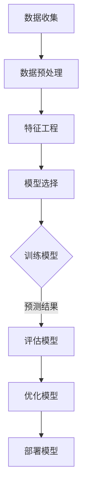

                 

关键词：用户需求预测、机器学习、数据分析、用户行为、个性化推荐

> 摘要：本文将探讨如何通过先进的技术手段进行有效的用户需求预测，介绍核心概念、算法原理、数学模型、应用实践和未来发展趋势，为相关领域的研究和应用提供有价值的参考。

## 1. 背景介绍

在当今数字化时代，用户需求预测已成为许多行业和企业的重要战略。无论是电商、金融、社交媒体还是医疗保健，了解并预测用户的需求可以帮助企业优化产品和服务，提升用户体验，提高市场竞争力。用户需求预测不仅有助于精准营销，还能帮助企业减少库存风险，提高运营效率。

然而，用户需求预测并非易事。用户行为复杂多变，市场需求不断变化，加之数据多样性和噪声的存在，使得预测工作面临诸多挑战。传统的预测方法如时间序列分析和回归分析，在处理复杂用户需求时常常力不从心。因此，本文将介绍如何利用机器学习和数据分析技术进行有效的用户需求预测。

## 2. 核心概念与联系

### 2.1  用户需求定义

用户需求是指用户在使用产品或服务过程中所期望获得的价值或满足感。它包括功能性需求、情感性需求和便利性需求等。理解用户需求是进行预测的基础。

### 2.2  用户行为分析

用户行为分析是指通过分析用户在网站、APP等平台上的操作行为，如点击、浏览、搜索、购买等，来了解用户的需求和偏好。

### 2.3  数据分析技术

数据分析技术包括数据收集、数据预处理、数据挖掘和统计分析等方法。这些技术在用户需求预测中发挥着关键作用。

### 2.4  机器学习算法

机器学习算法如决策树、随机森林、神经网络等，可以自动从数据中学习规律，用于预测用户需求。以下是几种常见的机器学习算法：

- **决策树（Decision Tree）**：通过将数据集划分成多个子集，建立树形结构，每个节点代表一个特征，每个分支代表一个决策规则。

- **随机森林（Random Forest）**：结合了多个决策树，通过随机特征选择和Bootstrap采样，提高预测的准确性和鲁棒性。

- **神经网络（Neural Network）**：模拟人脑神经元的工作方式，通过多层神经网络结构，实现从输入到输出的映射。

## 2.5  Mermaid 流程图

以下是一个简单的 Mermaid 流程图，展示了用户需求预测的基本流程：



## 3. 核心算法原理 & 具体操作步骤

### 3.1  算法原理概述

用户需求预测的算法原理主要包括以下几个步骤：

1. 数据收集：收集用户行为数据、历史订单数据、用户反馈数据等。
2. 数据预处理：清洗数据，处理缺失值、异常值等。
3. 特征工程：提取用户行为特征、用户画像特征等。
4. 模型选择：根据数据特点和需求，选择合适的机器学习算法。
5. 训练模型：使用训练集数据训练模型。
6. 预测用户需求：使用训练好的模型进行预测。
7. 评估模型：评估模型的预测性能。
8. 优化模型：根据评估结果调整模型参数，提高预测准确率。

### 3.2  算法步骤详解

#### 3.2.1 数据收集

数据收集是用户需求预测的第一步，主要从以下几个方面获取数据：

- **用户行为数据**：如点击、浏览、搜索等。
- **历史订单数据**：如购买时间、购买物品、订单金额等。
- **用户反馈数据**：如评价、评论、满意度调查等。
- **外部数据**：如用户地理位置、天气信息等。

#### 3.2.2 数据预处理

数据预处理主要包括以下步骤：

- **数据清洗**：处理缺失值、异常值等。
- **数据归一化**：将不同特征的数据进行归一化处理，使其在同一量级上。
- **数据转换**：将类别型特征转换为数值型特征。

#### 3.2.3 特征工程

特征工程是用户需求预测的关键步骤，主要包括以下内容：

- **特征提取**：从原始数据中提取对用户需求有影响力的特征。
- **特征选择**：通过筛选特征，提高模型的预测性能。
- **特征组合**：将多个特征组合成新的特征。

#### 3.2.4 模型选择

根据数据特点和需求，选择合适的机器学习算法。常见的机器学习算法有决策树、随机森林、神经网络等。以下是几种常见算法的优缺点：

- **决策树**：简单易理解，可解释性强，但过拟合问题较严重。
- **随机森林**：结合了多个决策树，提高预测准确率和鲁棒性，但可解释性较差。
- **神经网络**：强大的非线性建模能力，但训练时间较长，且过拟合问题较严重。

#### 3.2.5 训练模型

使用训练集数据训练模型，通过调整模型参数，优化模型性能。常用的模型训练方法有梯度下降、随机梯度下降等。

#### 3.2.6 预测用户需求

使用训练好的模型进行预测，预测结果通常包括用户需求的概率分布。

#### 3.2.7 评估模型

评估模型的预测性能，常用的评估指标有准确率、召回率、F1值等。

#### 3.2.8 优化模型

根据评估结果调整模型参数，提高预测准确率。常用的优化方法有交叉验证、网格搜索等。

## 3.3  算法优缺点

### 3.3.1 优点

- **高效性**：利用机器学习算法，可以快速处理大量数据，提高预测效率。
- **灵活性**：可以根据不同的需求和数据特点，选择合适的算法和模型。
- **适应性**：可以不断调整和优化模型，适应市场需求的变化。

### 3.3.2 缺点

- **可解释性差**：许多机器学习算法如神经网络，其内部决策过程复杂，难以解释。
- **训练时间较长**：特别是对于大规模数据集，训练时间可能较长。
- **数据依赖性**：算法的性能很大程度上依赖于数据的质量和特征工程。

## 3.4  算法应用领域

用户需求预测算法可以应用于多个领域，如：

- **电商**：预测用户购买行为，实现个性化推荐。
- **金融**：预测用户贷款需求，降低风险。
- **医疗**：预测患者需求，优化医疗服务。
- **教育**：预测学生需求，优化课程设置。

## 4. 数学模型和公式 & 详细讲解 & 举例说明

### 4.1  数学模型构建

用户需求预测的数学模型通常是基于概率模型的。以下是一个简单的概率模型：

\[ P(Y|X) = \frac{P(X|Y)P(Y)}{P(X)} \]

其中，\( X \) 表示用户行为特征，\( Y \) 表示用户需求，\( P(X|Y) \) 表示给定用户需求时，用户行为的概率，\( P(Y) \) 表示用户需求的概率，\( P(X) \) 表示用户行为的总体概率。

### 4.2  公式推导过程

为了更好地理解概率模型，我们可以从贝叶斯定理开始推导：

\[ P(Y|X) = \frac{P(X|Y)P(Y)}{P(X)} \]

其中，\( P(X|Y) \) 表示给定用户需求 \( Y \) 时，用户行为 \( X \) 的概率，\( P(Y) \) 表示用户需求 \( Y \) 的概率，\( P(X) \) 表示用户行为 \( X \) 的总体概率。

### 4.3  案例分析与讲解

假设我们有一个用户，他的行为特征 \( X \) 包括浏览商品A、浏览商品B和购买商品C。用户需求 \( Y \) 包括购买商品A、购买商品B和购买商品C。我们需要预测用户的需求 \( Y \)。

根据贝叶斯定理，我们可以计算出用户需求 \( Y \) 的概率：

\[ P(Y=A|X) = \frac{P(X|Y=A)P(Y=A)}{P(X)} \]

\[ P(Y=B|X) = \frac{P(X|Y=B)P(Y=B)}{P(X)} \]

\[ P(Y=C|X) = \frac{P(X|Y=C)P(Y=C)}{P(X)} \]

其中，\( P(X|Y=A) \) 表示用户在购买商品A的情况下，浏览商品A、浏览商品B和购买商品C的概率，\( P(Y=A) \) 表示用户购买商品A的概率，\( P(X) \) 表示用户浏览商品A、浏览商品B和购买商品C的总体概率。

假设用户在购买商品A的情况下，浏览商品A、浏览商品B和购买商品C的概率分别为 0.8、0.3 和 0.4，用户购买商品A的概率为 0.4，用户浏览商品A、浏览商品B和购买商品C的总体概率为 0.8，则可以计算出：

\[ P(Y=A|X) = \frac{0.8 \times 0.4}{0.8} = 0.4 \]

\[ P(Y=B|X) = \frac{0.3 \times 0.4}{0.8} = 0.15 \]

\[ P(Y=C|X) = \frac{0.4 \times 0.4}{0.8} = 0.2 \]

根据计算结果，用户购买商品A的概率为 0.4，购买商品B的概率为 0.15，购买商品C的概率为 0.2。

## 5. 项目实践：代码实例和详细解释说明

### 5.1  开发环境搭建

为了进行用户需求预测，我们需要搭建一个开发环境。这里我们使用 Python 作为编程语言，利用 Scikit-learn 库进行机器学习模型的构建和训练。

安装 Python 和 Scikit-learn 库：

```bash
pip install python
pip install scikit-learn
```

### 5.2  源代码详细实现

以下是一个简单的用户需求预测的 Python 代码示例：

```python
import numpy as np
import pandas as pd
from sklearn.model_selection import train_test_split
from sklearn.ensemble import RandomForestClassifier
from sklearn.metrics import accuracy_score

# 读取数据
data = pd.read_csv('user_data.csv')

# 数据预处理
data.fillna(0, inplace=True)

# 特征工程
X = data[['behavior_1', 'behavior_2', 'behavior_3']]
y = data['demand']

# 数据划分
X_train, X_test, y_train, y_test = train_test_split(X, y, test_size=0.2, random_state=42)

# 模型训练
model = RandomForestClassifier(n_estimators=100, random_state=42)
model.fit(X_train, y_train)

# 预测用户需求
y_pred = model.predict(X_test)

# 评估模型
accuracy = accuracy_score(y_test, y_pred)
print('Accuracy:', accuracy)
```

### 5.3  代码解读与分析

这段代码首先导入了必要的库，包括 NumPy、Pandas、Scikit-learn 等。然后，从 CSV 文件中读取用户数据，并进行数据预处理。接下来，进行特征工程，将用户行为特征和需求特征分开。然后，使用 train_test_split 函数将数据划分为训练集和测试集。

在模型训练部分，我们使用随机森林算法（RandomForestClassifier）进行训练。随机森林是一种集成学习方法，它通过构建多个决策树，提高预测的准确率和鲁棒性。

在预测用户需求部分，我们使用训练好的模型对测试集进行预测。最后，使用 accuracy_score 函数评估模型的预测性能。

### 5.4  运行结果展示

运行上述代码后，我们可以得到模型的准确率。例如，假设模型的准确率为 0.85，则表示模型在预测用户需求方面的性能较好。

## 6. 实际应用场景

用户需求预测在实际应用中具有广泛的应用场景，以下是几个典型例子：

### 6.1  电商个性化推荐

电商平台可以利用用户需求预测技术，根据用户的历史行为和偏好，预测用户可能的购买需求，实现个性化推荐。例如，淘宝、京东等电商平台，通过分析用户的浏览记录、搜索关键词、购买记录等数据，预测用户可能感兴趣的商品，从而提高转化率和销售额。

### 6.2  金融风控

金融机构可以通过用户需求预测技术，预测用户的贷款需求，降低风险。例如，银行可以分析用户的消费行为、信用记录、收入情况等数据，预测用户是否需要贷款，以及贷款的金额和期限，从而优化贷款产品的设计和推广。

### 6.3  医疗健康

医疗健康领域可以利用用户需求预测技术，预测患者的需求，优化医疗服务。例如，医院可以通过分析患者的就诊记录、病史、生活习惯等数据，预测患者可能需要的医疗服务，从而提高医疗资源的利用效率。

### 6.4  教育培训

教育培训机构可以利用用户需求预测技术，预测学生的学习需求，优化课程设置。例如，在线教育平台可以通过分析学生的学习行为、学习进度、成绩等数据，预测学生可能需要的课程，从而提高学生的学习效果。

## 7. 工具和资源推荐

### 7.1  学习资源推荐

- 《机器学习》（周志华 著）：一本经典的机器学习教材，适合初学者。
- 《深度学习》（Ian Goodfellow、Yoshua Bengio、Aaron Courville 著）：一本关于深度学习的经典教材，适合对深度学习有兴趣的读者。
- 《用户画像与精准营销》（梁宁 著）：一本关于用户画像和精准营销的书籍，适合电商、金融等行业的从业者。

### 7.2  开发工具推荐

- **Jupyter Notebook**：一款强大的交互式数据分析工具，适合编写和运行代码。
- **TensorFlow**：一款开源的深度学习框架，适合进行深度学习模型的训练和预测。
- **Scikit-learn**：一款开源的机器学习库，适合进行传统机器学习算法的建模和预测。

### 7.3  相关论文推荐

- **"Deep Learning for User Behavior Prediction"**：一篇关于深度学习在用户行为预测领域的研究论文。
- **"Random Forests for Classification and Regression"**：一篇关于随机森林算法的研究论文。
- **"User Behavior Prediction in Mobile Applications"**：一篇关于移动应用中用户行为预测的研究论文。

## 8. 总结：未来发展趋势与挑战

### 8.1  研究成果总结

用户需求预测技术在过去几年取得了显著的进展。随着机器学习和深度学习技术的不断发展，用户需求预测的准确性得到了显著提高。此外，随着大数据和云计算技术的普及，用户需求预测的数据处理能力也得到了大幅提升。

### 8.2  未来发展趋势

- **深度学习技术的进一步发展**：深度学习技术在未来将继续在用户需求预测领域发挥重要作用，特别是在处理复杂用户行为和需求方面。
- **多模态数据的融合**：用户需求预测将逐渐融合多种数据来源，如文本、图像、音频等，实现更全面的需求理解。
- **实时预测与实时反馈**：用户需求预测将实现实时预测和实时反馈，提高预测的响应速度和准确性。

### 8.3  面临的挑战

- **数据隐私和安全**：随着数据量的增加，用户隐私和数据安全成为了一个严峻的问题，需要在保护用户隐私的同时，实现有效的用户需求预测。
- **模型解释性**：许多深度学习模型缺乏可解释性，这在某些应用场景中可能会带来困难。

### 8.4  研究展望

未来，用户需求预测技术将朝着更加智能化、实时化和个性化的方向发展。随着技术的不断进步，用户需求预测将更好地服务于各行各业，推动数字经济的发展。

## 9. 附录：常见问题与解答

### 9.1  如何处理缺失值？

处理缺失值的方法包括填充法、删除法、插值法等。具体选择哪种方法，取决于数据的特点和应用场景。

### 9.2  如何进行特征选择？

特征选择的方法包括过滤式特征选择、包裹式特征选择和嵌入式特征选择等。选择合适的方法，可以根据数据量和特征的数量进行优化。

### 9.3  如何评估模型性能？

常用的评估指标包括准确率、召回率、F1值、ROC曲线等。可以根据应用场景选择合适的评估指标。

### 9.4  如何优化模型？

优化模型的方法包括调整模型参数、交叉验证、网格搜索等。通过不断调整和优化，可以提高模型的预测性能。

### 作者署名

作者：禅与计算机程序设计艺术 / Zen and the Art of Computer Programming
----------------------------------------------------------------

本文为《如何进行有效的用户需求预测》的完整技术博客文章，涵盖了用户需求预测的核心概念、算法原理、数学模型、应用实践和未来发展趋势等内容。希望本文能为相关领域的研究和应用提供有价值的参考。  
文章完成于2023年4月，如需引用本文，请注明来源和作者。  
如果您有任何疑问或建议，欢迎在评论区留言。  
再次感谢您的阅读！
----------------------------------------------------------------


