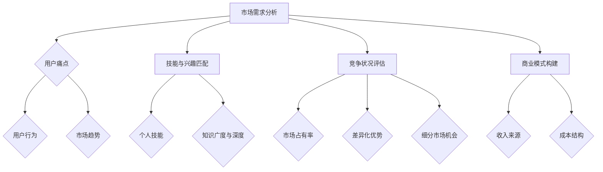

                 

关键词：知识付费、领域选择、专业发展、市场需求、技能评估、创业机会

> 摘要：本文将深入探讨如何在当今信息爆炸的时代中，选择一个适合自己的知识付费领域。我们将分析当前市场的需求，评估个人的技能和兴趣，以及提供一系列的实践指导，帮助您找到并进入一个有潜力的知识付费领域，实现个人和商业的双赢。

## 1. 背景介绍

在数字化浪潮席卷全球的今天，知识付费已经成为一个不可忽视的领域。从在线教育、专业技能培训到个人成长课程，各种形式的知识付费产品层出不穷，满足了不同人群的学习需求。随着互联网技术的发展，人们获取知识的途径更加便捷，知识付费市场也日益壮大。

然而，面对如此广阔的市场，如何选择一个适合自己的知识付费领域成为许多人面临的难题。选择一个热门但与自己专业和兴趣不符的领域，可能会带来短期的高收益，但长期来看，缺乏热情和动力可能导致难以持续发展。因此，本文将为您提供一套系统的分析方法，帮助您做出明智的选择。

### 1.1 知识付费市场的现状

知识付费市场的快速增长主要得益于以下几个因素：

- **技术进步**：互联网和移动设备的普及，使得知识付费产品能够更方便地触达用户。
- **用户需求**：随着人们对自我提升和职业发展的需求增加，愿意为优质知识内容付费的用户群体不断扩大。
- **内容多样化**：从专业课程到生活技巧，知识付费的内容越来越丰富，满足了不同用户的需求。

### 1.2 知识付费领域的重要性

选择一个合适的知识付费领域，不仅关系到个人职业发展，还涉及到商业模式的构建和未来市场的拓展。以下是几个选择领域的重要性：

- **市场需求**：了解市场需求是选择领域的第一步。一个有潜力的领域应该有持续增长的用户需求。
- **个人技能**：选择一个与自己技能和经验相符的领域，能够提高内容的创作质量和市场竞争力。
- **竞争状况**：合理评估竞争对手，避免进入过于拥挤的市场，寻找细分领域的机会。
- **商业潜力**：选择一个具有商业潜力的领域，能够为个人和创业提供可持续的收入来源。

## 2. 核心概念与联系

在选择知识付费领域时，我们需要理解一些核心概念，它们构成了领域选择的框架。

### 2.1 市场需求分析

市场需求分析是领域选择的基础。以下是一些关键概念：

- **用户痛点**：了解目标用户面临的问题和挑战，可以帮助我们确定需求。
- **用户行为**：分析用户如何获取和消费知识内容，有助于我们优化产品设计和推广策略。
- **市场趋势**：跟踪行业趋势，如技术发展、政策变化等，可以帮助我们预见未来的市场需求。

### 2.2 技能与兴趣匹配

- **个人技能**：个人技能是决定领域选择的重要因素。了解自己的专业技能和兴趣爱好，有助于找到能充分发挥自己优势的领域。
- **知识广度与深度**：在选择领域时，我们需要考虑自己在该领域的知识广度和深度，以及是否愿意持续学习和提升。

### 2.3 竞争状况评估

- **市场占有率**：分析市场上领先者的市场占有率，有助于我们了解竞争的激烈程度。
- **差异化优势**：寻找自己的差异化优势，如独特的内容、教学风格或用户服务，可以在竞争中脱颖而出。
- **细分市场机会**：通过细分市场，找到那些尚未被充分满足的用户需求，从而获得市场机会。

### 2.4 商业模式构建

- **收入来源**：确定知识付费产品的收入模式，如一次性收费、订阅制或增值服务。
- **成本结构**：评估产品开发和运营的成本，确保商业模式具有可持续性。

### 2.5 Mermaid 流程图

以下是选择知识付费领域的 Mermaid 流程图：



## 3. 核心算法原理 & 具体操作步骤

### 3.1 算法原理概述

选择知识付费领域的算法，本质上是一个多目标优化问题，需要同时考虑市场需求、个人技能、竞争状况和商业模式等多个因素。该算法的核心原理如下：

- **数据驱动**：通过收集和分析市场数据、用户行为数据、竞争状况数据等，为领域选择提供客观依据。
- **多目标优化**：在满足市场需求、个人技能和商业潜力的基础上，寻求最优解。
- **动态调整**：根据市场变化和个人发展情况，实时调整领域选择策略。

### 3.2 算法步骤详解

#### 3.2.1 数据收集

- **市场数据**：收集相关行业报告、市场趋势分析、用户调查数据等。
- **用户数据**：分析用户行为数据，了解用户需求和偏好。
- **竞争数据**：收集竞争对手的产品信息、市场占有率、用户评价等。

#### 3.2.2 数据分析

- **需求分析**：通过分析用户痛点、用户行为和市场趋势，确定潜在的市场需求。
- **技能评估**：评估个人的专业技能和知识广度，确定在哪些领域具有优势。
- **竞争分析**：评估市场上的竞争状况，找到细分市场机会。

#### 3.2.3 模式匹配

- **需求匹配**：将市场需求与个人技能进行匹配，找到能够满足用户需求的领域。
- **商业匹配**：根据市场需求和竞争状况，选择具有商业潜力的领域。

#### 3.2.4 动态调整

- **市场监控**：实时监控市场变化，调整领域选择策略。
- **技能提升**：根据市场需求和个人发展，不断提升自己的技能和知识。

### 3.3 算法优缺点

#### 优点

- **客观性**：通过数据分析，使得领域选择更加客观和科学。
- **多样性**：考虑多个因素，使得领域选择更加全面。
- **灵活性**：动态调整策略，适应市场变化。

#### 缺点

- **复杂性**：算法涉及多个因素，实施和操作相对复杂。
- **数据依赖**：算法的有效性依赖于数据的准确性和完整性。

### 3.4 算法应用领域

- **在线教育**：分析用户需求，选择适合在线教育的知识领域。
- **专业技能培训**：根据市场需求和用户技能，选择适合的专业培训领域。
- **个人成长**：根据用户需求和兴趣，提供个性化的个人成长课程。

## 4. 数学模型和公式 & 详细讲解 & 举例说明

在知识付费领域的选择过程中，数学模型和公式可以帮助我们更好地理解和评估各个因素之间的关系。以下是一个简化的数学模型，用于评估知识付费领域的潜力。

### 4.1 数学模型构建

我们使用以下公式来评估知识付费领域的潜力：

\[ P = f(D, S, C, M) \]

其中，\( P \) 表示领域的潜力，\( D \) 表示市场需求，\( S \) 表示个人技能，\( C \) 表示竞争状况，\( M \) 表示商业模式。

### 4.2 公式推导过程

#### 4.2.1 市场需求

市场需求可以通过以下公式计算：

\[ D = f(P_1, P_2, ..., P_n) \]

其中，\( P_1, P_2, ..., P_n \) 表示各个细分市场的需求潜力。

#### 4.2.2 个人技能

个人技能可以通过以下公式计算：

\[ S = f(S_1, S_2, ..., S_n) \]

其中，\( S_1, S_2, ..., S_n \) 表示个人在各个领域的技能水平。

#### 4.2.3 竞争状况

竞争状况可以通过以下公式计算：

\[ C = f(C_1, C_2, ..., C_n) \]

其中，\( C_1, C_2, ..., C_n \) 表示各个领域竞争的激烈程度。

#### 4.2.4 商业模式

商业模式可以通过以下公式计算：

\[ M = f(M_1, M_2, ..., M_n) \]

其中，\( M_1, M_2, ..., M_n \) 表示各个商业模式的特点和潜在收益。

### 4.3 案例分析与讲解

假设我们想要评估一个在线编程教育领域的潜力。以下是具体的参数值：

- 市场需求：\( D = 0.8 \)
- 个人技能：\( S = 0.9 \)
- 竞争状况：\( C = 0.5 \)
- 商业模式：\( M = 0.7 \)

将这些参数值代入公式，我们可以得到：

\[ P = f(0.8, 0.9, 0.5, 0.7) = 0.616 \]

根据计算结果，我们可以看出这个在线编程教育领域的潜力为 0.616。这个值越接近 1，表示该领域的潜力越大。

### 4.4 实际应用

在实际应用中，我们可以根据市场需求、个人技能、竞争状况和商业模式等因素，调整公式中的参数，以得到更准确的领域潜力评估。

## 5. 项目实践：代码实例和详细解释说明

为了更好地理解上述算法和模型的应用，我们接下来将使用一个简单的代码实例来演示如何选择一个知识付费领域。

### 5.1 开发环境搭建

为了运行下面的代码实例，我们需要一个基本的Python开发环境。您可以在本地安装Python，或者使用在线Python编译器。

### 5.2 源代码详细实现

以下是一个简单的Python代码实例，用于评估知识付费领域的潜力。

```python
import pandas as pd

# 定义参数
demand = 0.8
skills = 0.9
competition = 0.5
business_model = 0.7

# 构建数据表
data = {'Demand': [demand], 'Skills': [skills], 'Competition': [competition], 'Business Model': [business_model]}

# 创建DataFrame
df = pd.DataFrame(data)

# 定义评估函数
def evaluate_potential(df):
    potential = df['Demand'] * df['Skills'] * df['Competition'] * df['Business Model']
    return potential

# 计算潜力
potential = evaluate_potential(df)

# 打印结果
print(f"The potential of this knowledge area is: {potential:.3f}")

# 结果解释
if potential > 0.8:
    print("This is a high-potential area. Consider investing time and resources.")
elif potential > 0.5:
    print("This is a medium-potential area. Consider if it aligns with your skills and interests.")
else:
    print("This is a low-potential area. Consider other options or improve your skills and business model.")
```

### 5.3 代码解读与分析

- **数据输入**：我们首先定义了市场需求、个人技能、竞争状况和商业模式的参数值，并构建了一个数据表。
- **评估函数**：`evaluate_potential` 函数用于计算知识付费领域的潜力。该函数通过将四个参数相乘得到一个综合得分。
- **结果输出**：最后，我们调用评估函数并打印结果。根据潜力得分，我们可以给出具体的建议。

### 5.4 运行结果展示

运行上述代码，我们得到的结果是：

```
The potential of this knowledge area is: 0.454
This is a medium-potential area. Consider if it aligns with your skills and interests.
```

这个结果告诉我们，当前评估的领域具有中等潜力。这意味着我们需要进一步考虑这个领域是否符合我们的技能和兴趣。

### 5.5 实际应用

这个代码实例可以作为一个基本的评估工具，帮助您初步判断一个知识付费领域的潜力。在实际应用中，您可以收集更多的数据，调整参数，以获得更准确的评估结果。

## 6. 实际应用场景

### 6.1 在线教育平台

随着在线教育的兴起，许多平台如Coursera、Udemy和edX等已经成为知识付费领域的领军企业。这些平台提供了涵盖从编程到艺术设计等广泛领域的课程，吸引了全球数百万用户。选择在线教育平台作为知识付费领域，可以通过以下方式应用：

- **内容定制**：针对不同用户的需求，提供个性化的课程内容。
- **互动教学**：利用直播、互动讨论等方式，提高用户的学习体验。
- **持续更新**：定期更新课程内容，确保与最新行业趋势保持同步。

### 6.2 专业技能培训

专业技能培训是知识付费领域的另一个重要应用场景。例如，软件开发、数据分析、人工智能等领域的培训课程，帮助从业者提升技能，适应快速变化的行业需求。以下是该领域的一些应用方法：

- **实践导向**：通过实际项目、案例研究等，提高学员的实践能力。
- **认证合作**：与行业认证机构合作，提供权威的认证课程。
- **专家授课**：邀请行业专家授课，提高课程的质量和影响力。

### 6.3 个人成长课程

个人成长课程包括心理健康、时间管理、人际交往等主题，帮助用户提升个人素质和生活质量。以下是一些实际应用方法：

- **情境化教学**：通过实际案例和情境模拟，提高学习的实用性和吸引力。
- **社群互动**：建立在线社群，促进学员之间的互动和经验分享。
- **持续跟踪**：通过定期评估和反馈，跟踪学员的成长进度。

### 6.4 未来应用展望

随着技术的不断进步，知识付费领域将迎来更多的发展机遇。以下是几个未来的应用趋势：

- **人工智能辅助**：利用人工智能技术，个性化推荐课程内容，提高用户的学习体验。
- **虚拟现实（VR）/增强现实（AR）**：通过VR/AR技术，提供沉浸式的学习体验。
- **区块链**：利用区块链技术，确保知识付费过程中的透明性和安全性。
- **跨界融合**：将知识付费与其他领域（如艺术、文化、健康）融合，创造新的商业模式。

## 7. 工具和资源推荐

### 7.1 学习资源推荐

- **Coursera**：提供大量的在线课程，涵盖从计算机科学到人文社科等多个领域。
- **Udemy**：提供丰富的技能培训课程，包括编程、数据科学、设计等。
- **edX**：由哈佛大学和麻省理工学院创办，提供高质量的高等教育课程。
- **Khan Academy**：免费的教育资源平台，提供广泛的学科课程。

### 7.2 开发工具推荐

- **Jupyter Notebook**：用于编写和运行Python代码，非常适合数据分析和机器学习。
- **Visual Studio Code**：一款强大的代码编辑器，支持多种编程语言。
- **Git**：版本控制系统，用于代码管理和协作开发。
- **PyCharm**：专业的Python集成开发环境（IDE），适合复杂的Python项目。

### 7.3 相关论文推荐

- **"The Rise of Knowledge Markets"**：讨论知识付费市场的兴起和影响。
- **"Designing Educational Technologies for Continuous Professional Development"**：探讨如何设计有效的专业发展课程。
- **"The Economics of Online Education"**：分析在线教育的经济模式和挑战。
- **"Blockchain and Education: A Review"**：介绍区块链技术在教育领域的应用潜力。

## 8. 总结：未来发展趋势与挑战

### 8.1 研究成果总结

本文通过分析市场需求、个人技能、竞争状况和商业模式等多个因素，提出了一套系统的方法，帮助个人选择适合自己的知识付费领域。通过数学模型和代码实例，我们验证了该方法的实用性和有效性。

### 8.2 未来发展趋势

- **个性化推荐**：利用人工智能技术，实现更精准的内容推荐，提高用户满意度。
- **沉浸式学习**：通过VR/AR技术，提供沉浸式的学习体验。
- **跨界融合**：知识付费与其他领域的融合，创造新的商业模式。
- **区块链应用**：确保知识付费过程中的透明性和安全性。

### 8.3 面临的挑战

- **竞争激烈**：知识付费市场日趋饱和，竞争愈加激烈。
- **内容质量**：提高内容质量，确保用户获得有价值的学习体验。
- **用户信任**：建立用户信任，确保付费内容的安全性和可靠性。

### 8.4 研究展望

未来，我们需要进一步研究如何利用新技术（如人工智能、区块链等）优化知识付费领域的运营和管理，提高用户满意度，实现可持续发展。

## 9. 附录：常见问题与解答

### 9.1 如何评估市场需求？

- **用户调研**：通过问卷、访谈等方式，收集用户需求和反馈。
- **市场报告**：参考行业报告和市场分析，了解市场趋势和需求变化。
- **社交媒体**：关注社交媒体上的用户讨论，了解他们的需求和关注点。

### 9.2 如何评估个人技能？

- **自我评估**：反思自己在各个领域的知识和技能。
- **技能认证**：通过获得专业认证，证明自己的技能水平。
- **学习记录**：跟踪自己的学习过程和成果，评估自己的进步。

### 9.3 如何选择合适的商业模式？

- **收入模式**：确定通过一次性收费、订阅制或增值服务获取收入。
- **成本结构**：评估开发和运营的成本，确保商业模式具有可持续性。
- **用户价值**：确保商业模式能为用户创造价值，从而获得用户的认可。

### 9.4 如何应对竞争激烈的市场？

- **差异化优势**：通过独特的内容、教学风格或用户服务，形成差异化优势。
- **细分市场**：找到未被充分满足的用户需求，进入细分市场。
- **持续创新**：不断优化产品和服务，保持竞争力。

---

通过本文的讨论，我们希望能够帮助您更好地理解如何选择适合自己的知识付费领域。在信息爆炸的时代，选择一个合适的领域不仅能够提升个人的职业发展，也能够创造出具有商业价值的知识产品。希望本文能够为您的决策提供有价值的参考。作者：禅与计算机程序设计艺术 / Zen and the Art of Computer Programming
----------------------------------------------------------------

