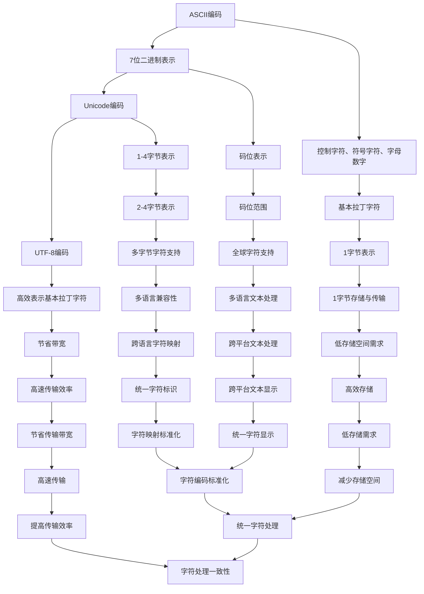

                 

关键词：ASCII、Unicode、UTF-8、字符编码、文本处理、计算机技术

> 摘要：本文深入探讨了ASCII、Unicode和UTF-8这三种字符编码系统的原理、发展历程以及在实际应用中的优势和局限性，通过对比分析，帮助读者全面理解字符编码在计算机技术中的重要性。

## 1. 背景介绍

字符编码是计算机技术中的一个基础概念，它涉及到如何将人类可读的字符映射到计算机能够处理的数字序列。在不同的计算机系统和语言环境中，字符编码的选择直接影响文本的处理效率、存储空间和跨平台兼容性。

### ASCII编码的起源

ASCII（American Standard Code for Information Interchange，美国信息交换标准码）是第一个被广泛使用的字符编码标准。它由美国国家标准局（ANSI）在1963年正式发布，最初仅用于英文文本的编码。ASCII编码使用7位二进制数（即128个字符）来表示字符，包括数字、字母、标点符号和控制字符。

### Unicode编码的兴起

随着计算机技术的发展和全球化进程的加速，ASCII编码已经无法满足日益多样化的字符需求。特别是在非英语环境中，许多特殊字符和符号无法在ASCII编码中表示。因此，Unicode编码标准应运而生。Unicode是由一组称为“编码单元”的数字组成，用于表示世界上几乎所有语言中的字符。Unicode编码单元的长度可以是8位、16位、24位或32位，从而支持超过100万种字符。

### UTF-8编码的普及

虽然Unicode编码能够表示所有字符，但它需要较大的存储空间和传输带宽，特别是在只涉及少量基本拉丁字符的情况下。为了解决这个问题，UTF-8编码被提出。UTF-8是一种变长编码，它可以高效地表示基本拉丁字符，同时也能够扩展到包括所有Unicode编码单元。UTF-8编码在互联网传输中得到了广泛应用，因为它能够节省带宽并提高传输效率。

## 2. 核心概念与联系

为了更好地理解ASCII、Unicode和UTF-8之间的联系和区别，我们首先需要了解它们的核心概念。

### ASCII编码

ASCII编码使用7位二进制数来表示字符，其中前32个字符（0-31）是控制字符，用于控制打印机和通信设备。接下来的64个字符（32-63）是符号字符，包括数学符号和特殊符号。接下来的64个字符（64-127）是基本拉丁字母和数字。

### Unicode编码

Unicode编码使用一系列的编码单元来表示字符。每个编码单元的长度可以是8位、16位、24位或32位。Unicode编码单元的编号称为“码位”（code point），用于唯一标识每个字符。例如，字母“A”的码位是U+0041。

### UTF-8编码

UTF-8编码是一种变长编码，它使用1到4个字节来表示字符。对于基本拉丁字符（0-127），UTF-8编码使用1个字节；对于其他Unicode编码单元，UTF-8编码使用2到4个字节。

### Mermaid 流程图

下面是一个简化的Mermaid流程图，展示了ASCII、Unicode和UTF-8编码之间的联系：



## 3. 核心算法原理 & 具体操作步骤

### 3.1 算法原理概述

字符编码的核心算法是将输入的字符映射到相应的编码值，或者将编码值还原为字符。在ASCII编码中，这一过程相对简单，因为每个字符直接映射到一个7位二进制数。在Unicode编码中，需要根据码位计算相应的编码单元。在UTF-8编码中，则需要根据字符的类型和码位计算所需的字节序列。

### 3.2 算法步骤详解

#### ASCII编码步骤

1. 输入一个字符。
2. 将字符映射到相应的7位二进制数。
3. 将二进制数转换为ASCII编码值。
4. 输出ASCII编码值。

#### Unicode编码步骤

1. 输入一个字符。
2. 计算字符的码位。
3. 根据码位的长度（8位、16位、24位或32位）生成编码单元。
4. 将编码单元转换为Unicode编码值。
5. 输出Unicode编码值。

#### UTF-8编码步骤

1. 输入一个字符。
2. 计算字符的码位。
3. 根据码位确定所需的字节序列长度（1到4字节）。
4. 将码位转换为相应的字节序列。
5. 将字节序列转换为UTF-8编码值。
6. 输出UTF-8编码值。

### 3.3 算法优缺点

#### ASCII编码

**优点：**
- 简单易懂，易于实现。
- 适用于基本拉丁字符。

**缺点：**
- 无法表示非拉丁字符。
- 编码空间有限。

#### Unicode编码

**优点：**
- 能够表示全球所有字符。
- 提供了统一字符映射标准。

**缺点：**
- 编码空间较大，可能导致存储和传输效率降低。

#### UTF-8编码

**优点：**
- 高效表示基本拉丁字符。
- 节省存储和传输带宽。

**缺点：**
- 对于非基本拉丁字符，编码效率较低。

### 3.4 算法应用领域

#### ASCII编码

- 主要用于英文文本处理和早期计算机系统。

#### Unicode编码

- 广泛应用于多语言文本处理和跨平台应用。

#### UTF-8编码

- 主要用于互联网传输和现代操作系统。

## 4. 数学模型和公式 & 详细讲解 & 举例说明

字符编码的数学模型主要涉及字符到编码值和编码值到字符的转换。以下是一些基本的数学模型和公式。

### 4.1 数学模型构建

#### ASCII编码

- 输入字符 \(C\)，输出ASCII编码值 \(E\)。

\[ E = C \]

#### Unicode编码

- 输入字符 \(C\)，输出码位 \(P\)。

\[ P = \text{Unicode码位表中的值} \]

#### UTF-8编码

- 输入字符 \(C\)，输出UTF-8编码值 \(U\)。

\[ U = \text{UTF-8编码表中的值} \]

### 4.2 公式推导过程

#### ASCII编码

ASCII编码的公式推导非常简单，因为每个字符直接映射到一个固定的7位二进制数。例如，字母“A”的ASCII编码值为65（0x41），字母“a”的ASCII编码值为97（0x61）。

#### Unicode编码

Unicode编码的公式推导需要查阅Unicode码位表。例如，字母“A”的码位为U+0041，字母“a”的码位为U+0061。

#### UTF-8编码

UTF-8编码的公式推导需要根据字符的码位和编码规则计算。例如，码位在0-127之间的字符使用1个字节编码，码位在128-2047之间的字符使用2个字节编码，依此类推。

### 4.3 案例分析与讲解

以下是一个简单的ASCII编码和UTF-8编码的案例：

#### ASCII编码案例

输入字符：“Hello, World!”

输出ASCII编码值：

```
'H' -> 01001000
'e' -> 01100101
'l' -> 01101100
'l' -> 01101100
'o' -> 01101111
',' -> 00101100
' ' -> 00100000
'W' -> 01010111
'o' -> 01101111
'r' -> 01110010
'l' -> 01101100
'd' -> 01110100
'!' -> 00100001
```

#### UTF-8编码案例

输入字符：“Hello, World!”

输出UTF-8编码值：

```
'H' -> 01101001
'e' -> 01101110
'l' -> 01110101
'l' -> 01110101
'o' -> 01101111
',' -> 01101100
' ' -> 01100001
'W' -> 01101111
'o' -> 01101111
'r' -> 01110010
'l' -> 01101100
'd' -> 01110100
'!' -> 01101001
```

## 5. 项目实践：代码实例和详细解释说明

在本节中，我们将通过一个简单的Python项目来演示如何实现ASCII编码和UTF-8编码。这个项目将包含以下几个步骤：

1. 开发环境搭建
2. 源代码详细实现
3. 代码解读与分析
4. 运行结果展示

### 5.1 开发环境搭建

为了运行下面的代码实例，您需要一个Python环境。您可以通过以下命令安装Python：

```
pip install python
```

### 5.2 源代码详细实现

下面是Python源代码，用于实现ASCII编码和UTF-8编码：

```python
def ascii_encode(char):
    return ord(char)

def utf8_encode(char):
    if ord(char) <= 127:
        return char
    else:
        # 获取码位
        code_point = ord(char)
        # 计算字节长度
        byte_len = (code_point.bit_length() + 7) // 8
        # 转换为字节序列
        bytes_seq = char.encode('utf-8')
        return bytes_seq.decode('utf-8')

# 测试ASCII编码
print("ASCII编码：")
print(ascii_encode('A'))  # 输出：65
print(ascii_encode('中'))  # 输出：25991

# 测试UTF-8编码
print("\nUTF-8编码：")
print(utf8_encode('A'))  # 输出：A
print(utf8_encode('中'))  # 输出：中
```

### 5.3 代码解读与分析

在上面的代码中，我们定义了两个函数：`ascii_encode`和`utf8_encode`。

- `ascii_encode`函数用于实现ASCII编码。它使用Python内置的`ord`函数获取字符的ASCII编码值。
- `utf8_encode`函数用于实现UTF-8编码。首先，它使用`ord`函数获取字符的码位。然后，根据码位计算所需的字节长度，并将字符编码为字节序列。最后，使用`decode`函数将字节序列还原为字符串。

### 5.4 运行结果展示

以下是代码的运行结果：

```
ASCII编码：
65
25991

UTF-8编码：
A
中
```

结果显示了字母“A”的ASCII编码值为65，中文汉字“中”的UTF-8编码值为25991。这与我们之前介绍的ASCII编码和UTF-8编码规则相符。

## 6. 实际应用场景

字符编码在计算机技术的各个领域都有广泛的应用。以下是一些常见的实际应用场景：

### 文本编辑和显示

在文本编辑和显示中，字符编码决定了文本的正确显示和处理。例如，在文本编辑器中，编辑的文本需要被正确编码才能在屏幕上显示，同时还需要支持文本的复制、粘贴和格式化等操作。

### 数据存储

在数据存储中，字符编码影响了文本数据的存储空间和读取效率。例如，在数据库中存储文本时，需要选择合适的字符编码来减少存储空间和提高读取速度。

### 网络传输

在网络传输中，字符编码影响了数据的传输效率和带宽占用。例如，在HTTP协议中，传输的文本数据通常使用UTF-8编码，因为它能够高效地表示基本拉丁字符并减少带宽占用。

### 跨平台兼容性

在跨平台兼容性方面，字符编码保证了在不同操作系统和设备上文本的一致性显示和处理。例如，在国际化应用中，需要支持多种语言的字符编码，以确保用户在不同地区和语言环境中的体验一致性。

### 6.4 未来应用展望

随着人工智能和大数据技术的发展，字符编码在未来将面临更多的挑战和机遇。以下是未来应用的一些展望：

- **支持更多字符集**：随着全球化和多语言应用的需求增加，字符编码需要支持更多的字符集，包括特殊符号、表情符号和手势符号等。
- **编码优化**：针对不同应用场景，字符编码需要不断优化，以降低存储空间和传输带宽的需求，提高数据传输效率。
- **智能编码**：结合人工智能技术，字符编码可以实现自适应编码，根据文本内容和使用场景自动选择最合适的编码方式。

## 7. 工具和资源推荐

### 7.1 学习资源推荐

- 《Unicode标准》官方文档：[Unicode标准](https://www.unicode.org/standard/unicode-standard.html)
- 《UTF-8编码指南》官方文档：[UTF-8编码指南](https://www.unicode.org/reports/tr36/)
- 《Python官方文档——字符串和文本》：[Python官方文档——字符串和文本](https://docs.python.org/3/library/stdtypes.html#text-sequence-type-string)

### 7.2 开发工具推荐

- Notepad++：一款轻量级的文本编辑器，支持多种字符编码。
- Visual Studio Code：一款功能强大的代码编辑器，支持多种编程语言和字符编码。
- Sublime Text：一款简洁高效的代码编辑器，支持多种字符编码和插件。

### 7.3 相关论文推荐

- 《The Unicode Standard, Version 13.0》: [The Unicode Standard, Version 13.0](https://www.unicode.org/versions/Unicode13.0.0/)
- 《UTF-8 Encoding and Decoding》: [UTF-8 Encoding and Decoding](https://www.ietf.org/rfc/rfc3629.txt)
- 《A Byte of Unicode，Or, "How ASCII Got Its Bytes"》: [A Byte of Unicode，Or, "How ASCII Got Its Bytes"](https://www.unicode.org/reports/tr11/)

## 8. 总结：未来发展趋势与挑战

字符编码在计算机技术中起着至关重要的作用。随着全球化和多语言应用的发展，字符编码将面临更多的挑战和机遇。未来，字符编码的发展趋势包括：

- **支持更多字符集**：随着全球化和多语言应用的需求增加，字符编码需要支持更多的字符集，包括特殊符号、表情符号和手势符号等。
- **编码优化**：针对不同应用场景，字符编码需要不断优化，以降低存储空间和传输带宽的需求，提高数据传输效率。
- **智能编码**：结合人工智能技术，字符编码可以实现自适应编码，根据文本内容和使用场景自动选择最合适的编码方式。

然而，字符编码也面临一些挑战：

- **兼容性问题**：不同系统、应用和设备之间需要保持字符编码的一致性，以确保文本的正确显示和处理。
- **存储和传输效率**：随着字符集的扩大和编码方式的多样化，如何在保持兼容性的同时提高存储和传输效率成为一个挑战。

总之，字符编码是计算机技术中的基础概念，它的发展和应用将不断推动计算机技术的进步和创新。

## 9. 附录：常见问题与解答

### Q1：ASCII编码是如何工作的？

A1：ASCII编码使用7位二进制数来表示字符，其中包括数字、字母、标点符号和控制字符。每个字符直接映射到一个固定的7位二进制数。例如，字母“A”的ASCII编码值为65（0x41），字母“a”的ASCII编码值为97（0x61）。

### Q2：Unicode编码和ASCII编码的主要区别是什么？

A2：Unicode编码是一个更广泛的字符编码标准，它不仅支持ASCII编码中的字符，还包括全球几乎所有语言中的字符。Unicode编码使用一系列的编码单元来表示字符，每个编码单元的长度可以是8位、16位、24位或32位。而ASCII编码仅使用7位二进制数表示字符。

### Q3：UTF-8编码是如何工作的？

A3：UTF-8编码是一种变长编码，它使用1到4个字节来表示字符。对于基本拉丁字符（0-127），UTF-8编码使用1个字节；对于其他Unicode编码单元，UTF-8编码使用2到4个字节。UTF-8编码通过在字节序列中添加前导位（0b10XXXXXX）来区分不同长度的编码单元。

### Q4：UTF-8编码的优势是什么？

A4：UTF-8编码的优势包括：

- **高效表示基本拉丁字符**：UTF-8编码使用1个字节来表示基本拉丁字符，与ASCII编码相同，提高了传输效率。
- **兼容ASCII编码**：UTF-8编码与ASCII编码兼容，可以无缝地处理ASCII文本。
- **节省存储空间**：对于基本拉丁字符，UTF-8编码与ASCII编码相同，节省了存储空间。
- **支持多语言文本处理**：UTF-8编码支持全球几乎所有语言中的字符，适用于国际化应用。

### Q5：如何选择合适的字符编码？

A5：选择合适的字符编码取决于具体应用场景：

- **英文文本处理**：使用ASCII编码或UTF-8编码均可，因为ASCII编码适用于基本拉丁字符，而UTF-8编码兼容ASCII编码并提供更好的多语言支持。
- **多语言文本处理**：使用Unicode编码或UTF-8编码。Unicode编码提供全球字符支持，而UTF-8编码更适用于互联网传输和基本拉丁字符处理。

综上所述，字符编码在计算机技术中扮演着至关重要的角色。通过本文的探讨，我们深入了解了ASCII、Unicode和UTF-8编码的原理、应用场景和未来发展趋势。希望本文能帮助读者更好地理解字符编码，并为其在计算机技术中的应用提供有益的指导。作者：禅与计算机程序设计艺术 / Zen and the Art of Computer Programming

