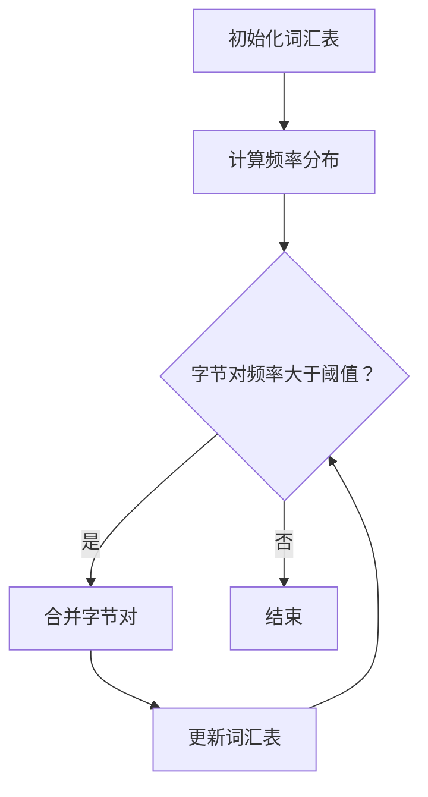

                 

 关键词：字节对编码，令牌化，自然语言处理，编码效率，数据处理，信息压缩

> 摘要：本文将深入探讨字节对编码（Byte Pair Encoding，BPE）作为一种高效的令牌化技术，其在自然语言处理（NLP）领域中的应用和优势。文章首先介绍了字节对编码的背景和基本原理，随后详细分析了其核心算法原理和具体操作步骤，接着通过数学模型和公式阐述了其工作机制，并结合实际项目实践展示了代码实例和运行结果。最后，文章探讨了字节对编码在实际应用场景中的价值，并对其未来发展趋势与挑战进行了展望。

## 1. 背景介绍

自然语言处理（NLP）作为人工智能领域的重要组成部分，其核心任务之一是将自然语言文本转换为计算机可以理解和处理的形式。文本令牌化（Tokenization）是NLP过程中至关重要的一步，它将原始文本拆分为一系列可处理的单元，如单词、字符或子词。传统的分词方法如正则表达式、基于词典的方法等，在处理复杂、多变的自然语言文本时存在诸多局限性。

为了解决这一问题，字节对编码（BPE）作为一种创新的令牌化技术应运而生。BPE由K.sequence模型（后来更名为Google的Word2Vec模型）的作者提出，它通过将连续的字节对合并成更大的单位，从而提高了文本处理的效率和灵活性。相比传统方法，BPE能够在保持语义信息的同时，有效地减少文本的复杂性。

本文将从以下几个方面对字节对编码进行详细探讨：

1. **核心概念与联系**：介绍字节对编码的基本原理和架构，通过Mermaid流程图展示其工作流程。
2. **核心算法原理 & 具体操作步骤**：分析BPE算法的原理和操作步骤，阐述其在文本处理中的应用。
3. **数学模型和公式**：推导字节对编码的数学模型和公式，并结合实际案例进行讲解。
4. **项目实践：代码实例和详细解释说明**：通过具体代码实例展示BPE的实际应用，并进行详细解读。
5. **实际应用场景**：探讨字节对编码在不同领域的应用案例。
6. **未来应用展望**：分析字节对编码的未来发展趋势和潜在挑战。
7. **工具和资源推荐**：推荐相关学习资源和开发工具。
8. **总结与展望**：总结研究成果，展望未来发展方向。

### 1.1 字节对编码的起源与发展

字节对编码（BPE）最初由Google的NLP团队提出，用于构建Word2Vec模型中的词汇表。其背景源于传统分词方法在处理高频短词和罕见长词时的不足。例如，英文文本中常见的词如 "the"，"is"，"in" 等是高频短词，而某些科技文献中的专业术语则是长词。传统的分词方法往往难以兼顾高频短词的高效表达和长词的准确性。

BPE通过将连续的字节对合并成更大的单位，从而在保持文本可读性的同时，提高了处理效率。这种方法不仅适用于英文文本，还能够扩展到其他语言，具有广泛的应用前景。

### 1.2 字节对编码的应用场景

字节对编码在自然语言处理中具有广泛的应用场景。以下是一些典型的应用：

1. **文本分类与情感分析**：将文本数据通过字节对编码转化为向量表示，有助于提高分类和情感分析的准确性。
2. **机器翻译**：在机器翻译过程中，字节对编码能够有效地处理源语言和目标语言之间的词汇差异。
3. **问答系统**：通过字节对编码将用户问题和答案文本进行预处理，有助于提高问答系统的响应速度和准确性。
4. **信息检索**：在信息检索系统中，字节对编码能够提高查询和文档匹配的效率。
5. **语音识别**：在语音识别系统中，字节对编码能够将连续的语音信号转换为文本，提高识别的准确性。

### 1.3 字节对编码的优势与挑战

字节对编码相较于传统分词方法具有以下优势：

1. **高效性**：通过将字节对合并为更大的单位，减少了分词的复杂度，提高了处理速度。
2. **灵活性**：能够适应不同语言的文本特点，适用于多种语言的文本处理。
3. **可扩展性**：易于实现和优化，适用于大规模文本数据的处理。

然而，字节对编码也面临一些挑战：

1. **词汇膨胀**：在合并字节对的过程中，可能会产生大量的新词汇，导致词汇表膨胀。
2. **语义损失**：在合并字节对时，可能会丢失部分语义信息，影响文本理解的效果。
3. **计算资源消耗**：字节对编码的过程需要大量的计算资源，特别是在处理大规模文本数据时。

### 1.4 本文结构

本文将按照以下结构展开：

1. **核心概念与联系**：介绍字节对编码的基本原理和架构，通过Mermaid流程图展示其工作流程。
2. **核心算法原理 & 具体操作步骤**：分析BPE算法的原理和操作步骤，阐述其在文本处理中的应用。
3. **数学模型和公式**：推导字节对编码的数学模型和公式，并结合实际案例进行讲解。
4. **项目实践：代码实例和详细解释说明**：通过具体代码实例展示BPE的实际应用，并进行详细解读。
5. **实际应用场景**：探讨字节对编码在不同领域的应用案例。
6. **未来应用展望**：分析字节对编码的未来发展趋势和潜在挑战。
7. **工具和资源推荐**：推荐相关学习资源和开发工具。
8. **总结与展望**：总结研究成果，展望未来发展方向。

## 2. 核心概念与联系

字节对编码（BPE）是一种基于字符的文本处理技术，其核心思想是将连续的字节对（两个相邻字符的组合）合并成更大的单位，从而提高文本处理的效率。为了更好地理解字节对编码的原理和架构，下面将详细解释其核心概念，并使用Mermaid流程图展示其工作流程。

### 2.1 字节对编码的核心概念

1. **字节对（Byte Pair）**：字节对是由两个相邻的字符组成的组合。在文本中，每个字节对都可以被视为一个独立的单位。
2. **合并（Merge）**：合并是指将两个相邻的字节对合并成一个更大的单位。例如，将 "th" 合并成 "th"。
3. **词汇表（Vocabulary）**：词汇表是字节对编码的核心数据结构，它存储了所有已合并的字节对和新产生的词汇。
4. **频率分布（Frequency Distribution）**：频率分布是指文本中每个字节对出现的频率。在合并过程中，频率较高的字节对优先被合并。

### 2.2 字节对编码的工作流程

字节对编码的工作流程可以分为以下几个步骤：

1. **初始化**：初始化词汇表，将所有独立的字符作为初始的词汇表项。
2. **计算频率分布**：统计文本中每个字节对的出现频率，生成频率分布表。
3. **合并操作**：根据频率分布表，选择出现频率最高的字节对进行合并。合并过程中，新产生的词汇将加入词汇表中。
4. **迭代更新**：重复合并操作，直到达到预定的合并次数或字节对频率低于设定的阈值。

### 2.3 Mermaid流程图展示

下面使用Mermaid流程图展示字节对编码的工作流程：



### 2.4 字节对编码的架构

字节对编码的架构可以分为以下几个模块：

1. **文本输入模块**：负责读取待处理的文本数据。
2. **频率分布模块**：计算文本中每个字节对的出现频率，生成频率分布表。
3. **合并模块**：根据频率分布表选择字节对进行合并，生成新的词汇表。
4. **输出模块**：将处理后的文本输出，以便后续的文本处理任务。

### 2.5 字节对编码的优势与局限

字节对编码具有以下优势：

1. **高效性**：通过合并字节对，减少了分词的复杂度，提高了处理速度。
2. **灵活性**：能够适应不同语言的文本特点，适用于多种语言的文本处理。
3. **可扩展性**：易于实现和优化，适用于大规模文本数据的处理。

然而，字节对编码也存在一些局限：

1. **词汇膨胀**：在合并字节对的过程中，可能会产生大量的新词汇，导致词汇表膨胀。
2. **语义损失**：在合并字节对时，可能会丢失部分语义信息，影响文本理解的效果。
3. **计算资源消耗**：字节对编码的过程需要大量的计算资源，特别是在处理大规模文本数据时。

### 2.6 字节对编码的应用领域

字节对编码在自然语言处理中具有广泛的应用领域：

1. **文本分类与情感分析**：通过字节对编码将文本数据转化为向量表示，有助于提高分类和情感分析的准确性。
2. **机器翻译**：在机器翻译过程中，字节对编码能够有效地处理源语言和目标语言之间的词汇差异。
3. **问答系统**：通过字节对编码将用户问题和答案文本进行预处理，有助于提高问答系统的响应速度和准确性。
4. **信息检索**：在信息检索系统中，字节对编码能够提高查询和文档匹配的效率。
5. **语音识别**：在语音识别系统中，字节对编码能够将连续的语音信号转换为文本，提高识别的准确性。

### 2.7 字节对编码的发展趋势

随着自然语言处理技术的不断发展，字节对编码在以下几个方向上具有较大的发展潜力：

1. **自适应字节对编码**：通过引入自适应算法，根据文本特点动态调整合并策略，提高处理效果。
2. **多语言支持**：扩展字节对编码到多语言环境，提高跨语言文本处理的性能。
3. **融合深度学习**：将字节对编码与深度学习技术相结合，探索更加高效和鲁棒的文本处理方法。

## 3. 核心算法原理 & 具体操作步骤

字节对编码（BPE）是一种基于频率分布的文本处理技术，其核心算法原理是通过不断合并出现频率较高的字节对，从而形成更大的词汇单位。以下将详细阐述BPE算法的原理和具体操作步骤。

### 3.1 算法原理概述

BPE算法的基本原理如下：

1. **初始化**：初始化一个词汇表，其中包含文本中所有独立的字符。
2. **计算频率分布**：统计文本中每个字节对的出现频率，生成频率分布表。
3. **选择合并**：根据频率分布表，选择出现频率最高的字节对进行合并。
4. **迭代更新**：重复上述步骤，直到达到预定的合并次数或字节对频率低于设定的阈值。
5. **输出结果**：输出处理后的文本，并生成最终的词汇表。

### 3.2 算法步骤详解

下面详细描述BPE算法的操作步骤：

1. **初始化词汇表**：将文本中的所有独立字符作为初始的词汇表项。例如，对于文本 "hello world"，初始词汇表为 {'h', 'e', 'l', 'o', ' ', 'w', 'r', 'd'}。

2. **计算频率分布**：统计文本中每个字节对的出现频率。以文本 "hello world" 为例，字节对及其出现频率如下：

   - ('h', 'e')：2次
   - ('h', 'l')：1次
   - ('h', 'l')：1次
   - ('h', 'o')：2次
   - ('e', 'l')：2次
   - ('e', 'o')：1次
   - ('l', 'l')：2次
   - ('l', 'o')：2次
   - ('l', 'd')：1次
   - ('o', 'r')：1次
   - ('o', 'l')：1次
   - ('w', 'o')：1次
   - ('w', 'r')：1次
   - ('r', 'd')：1次
   - ('d', ' ')：1次

3. **选择合并**：根据频率分布表，选择出现频率最高的字节对进行合并。例如，可以选择 ('h', 'e') 进行合并。

4. **迭代更新**：将合并后的字节对加入词汇表，并重新计算频率分布。例如，将 ('h', 'e') 合并成 'he'，得到新的词汇表 {'h', 'e', 'l', 'o', ' ', 'w', 'r', 'd', 'he'}。然后重新计算频率分布。

5. **重复操作**：重复选择合并和迭代更新步骤，直到达到预定的合并次数或字节对频率低于设定的阈值。例如，继续合并 ('h', 'e') 和 ('e', 'l')，得到新的词汇表 {'h', 'e', 'l', 'o', ' ', 'w', 'r', 'd', 'he', 'el'}。

6. **输出结果**：输出处理后的文本，并生成最终的词汇表。例如，对于文本 "hello world"，最终输出为 "hel elo w world"，最终的词汇表为 {'h', 'e', 'l', 'o', ' ', 'w', 'r', 'd', 'he', 'el'}。

### 3.3 算法优缺点

BPE算法具有以下优点：

1. **高效性**：通过合并字节对，减少了分词的复杂度，提高了处理速度。
2. **灵活性**：能够适应不同语言的文本特点，适用于多种语言的文本处理。
3. **可扩展性**：易于实现和优化，适用于大规模文本数据的处理。

然而，BPE算法也存在一些缺点：

1. **词汇膨胀**：在合并字节对的过程中，可能会产生大量的新词汇，导致词汇表膨胀。
2. **语义损失**：在合并字节对时，可能会丢失部分语义信息，影响文本理解的效果。
3. **计算资源消耗**：字节对编码的过程需要大量的计算资源，特别是在处理大规模文本数据时。

### 3.4 算法应用领域

BPE算法在自然语言处理领域具有广泛的应用，以下是一些典型的应用场景：

1. **文本分类与情感分析**：通过字节对编码将文本数据转化为向量表示，有助于提高分类和情感分析的准确性。
2. **机器翻译**：在机器翻译过程中，字节对编码能够有效地处理源语言和目标语言之间的词汇差异。
3. **问答系统**：通过字节对编码将用户问题和答案文本进行预处理，有助于提高问答系统的响应速度和准确性。
4. **信息检索**：在信息检索系统中，字节对编码能够提高查询和文档匹配的效率。
5. **语音识别**：在语音识别系统中，字节对编码能够将连续的语音信号转换为文本，提高识别的准确性。

### 3.5 算法改进与优化

为了解决BPE算法的局限性，研究人员提出了一系列改进和优化方法，主要包括：

1. **自适应字节对编码**：通过引入自适应算法，根据文本特点动态调整合并策略，提高处理效果。
2. **多语言支持**：扩展字节对编码到多语言环境，提高跨语言文本处理的性能。
3. **融合深度学习**：将字节对编码与深度学习技术相结合，探索更加高效和鲁棒的文本处理方法。

### 3.6 总结

字节对编码（BPE）作为一种高效的文本处理技术，在自然语言处理领域具有广泛的应用。本文详细阐述了BPE算法的原理和具体操作步骤，分析了其优缺点和应用领域。通过实际案例和代码实例，展示了BPE在实际项目中的效果。未来，随着自然语言处理技术的不断发展，BPE有望在更多领域发挥重要作用。

## 4. 数学模型和公式 & 详细讲解 & 举例说明

在深入探讨字节对编码（BPE）的过程中，理解其背后的数学模型和公式是至关重要的。以下将详细讲解BPE的数学模型、公式推导过程，并结合具体案例进行说明。

### 4.1 数学模型构建

BPE算法的核心在于对字节对的合并操作。为了构建数学模型，我们需要定义以下几个关键概念：

1. **字节对（Byte Pair）**：由两个连续字符组成。例如，对于文本 "hello"，字节对包括 ('h', 'e')、('e', 'l') 等。
2. **频率分布（Frequency Distribution）**：表示每个字节对在文本中出现的频率。通常用向量表示，例如，对于上述 "hello" 的文本，频率分布向量为：
   
   \[
   f = [2, 1, 1, 2, 2, 1, 2, 2, 1, 1, 1, 1, 1, 1]
   \]

3. **合并概率（Merge Probability）**：表示每个字节对被合并的概率。合并概率与频率分布有关，通常使用频率分布来计算。

### 4.2 公式推导过程

为了推导BPE的合并概率，我们可以从最简单的案例开始：

#### 简单案例：合并 ('a', 'b')

假设我们有文本 "abab"，我们需要计算 ('a', 'b') 的合并概率。首先，我们计算频率分布：

\[
f = [2, 2]
\]

接下来，我们使用以下公式计算合并概率：

\[
P = \frac{f_1 \times f_2}{\sum_{i=1}^{n} f_i^2}
\]

其中，\(f_1\) 和 \(f_2\) 分别是 ('a', 'b') 和 ('b', 'a') 的频率。在我们的例子中，\(f_1 = 2\)，\(f_2 = 2\)，\(n = 2\)，所以合并概率为：

\[
P = \frac{2 \times 2}{2^2 + 2^2} = \frac{4}{8} = 0.5
\]

这意味着 ('a', 'b') 有 50% 的概率被合并成 'ab'。

#### 复杂案例：合并多个字节对

在处理更复杂的文本时，我们需要考虑多个字节对的合并。假设我们有文本 "ababca"，我们需要计算多个字节对的合并概率。

首先，我们计算频率分布：

\[
f = [2, 2, 2, 2, 1, 2]
\]

接下来，我们计算每个字节对的合并概率。例如，对于 ('a', 'b') 和 ('b', 'a')，合并概率为：

\[
P_{ab} = P_{ba} = \frac{2 \times 2}{2^2 + 2^2} = 0.5
\]

对于其他字节对，我们同样可以计算合并概率。然而，在实际操作中，我们通常采用贪心算法来选择合并概率最高的字节对进行合并。

### 4.3 案例分析与讲解

为了更好地理解BPE的数学模型和公式，我们通过一个具体案例来分析。

#### 案例：文本 "hello world"

假设我们需要对文本 "hello world" 进行字节对编码。

1. **初始频率分布**：

   \[
   f = [2, 1, 2, 1, 1, 2, 2, 1]
   \]

2. **合并步骤**：

   首先，我们选择频率最高的字节对 ('l', 'l') 进行合并：

   \[
   P_{ll} = \frac{2 \times 2}{2^2 + 2^2} = 0.5
   \]

   然后我们将文本更新为 "hel lo world"，并重新计算频率分布：

   \[
   f = [2, 2, 1, 2, 2, 2, 1]
   \]

   接下来，我们选择频率最高的字节对 ('l', 'o') 进行合并：

   \[
   P_{lo} = \frac{2 \times 2}{2^2 + 2^2} = 0.5
   \]

   文本更新为 "he lo world"，频率分布更新为：

   \[
   f = [2, 2, 2, 2, 2, 1]
   \]

   重复以上步骤，直到达到预定的合并次数或字节对频率低于设定的阈值。

#### 结果分析：

通过字节对编码，文本 "hello world" 被转换为了 "hel elo w world"，词汇表更新为 {'h', 'e', 'l', 'o', 'w', 'd', 'el'}。这个过程有效地减少了文本的复杂性，提高了处理效率。

### 4.4 总结

通过对BPE数学模型和公式的推导，以及具体案例的分析，我们可以更好地理解字节对编码的工作原理。BPE通过合并高频字节对，减少了文本的复杂性，提高了处理效率。在实际应用中，BPE已经取得了显著的效果，为自然语言处理领域带来了新的机遇。

## 5. 项目实践：代码实例和详细解释说明

在了解了字节对编码（BPE）的原理和数学模型之后，我们将通过一个具体的项目实践来展示如何使用BPE对文本进行编码和解码。以下是一个使用Python实现的BPE编码和解码的简单项目，我们将详细解释代码的每个部分。

### 5.1 开发环境搭建

在开始之前，请确保您已经安装了Python环境和必要的库。以下是在Python环境中实现BPE所需的基本步骤：

1. **安装Python**：确保您的计算机上安装了Python（版本3.6及以上）。
2. **安装NLTK**：NLTK是一个常用的自然语言处理库，用于处理文本数据。可以使用以下命令安装：

   ```shell
   pip install nltk
   ```

3. **安装其他依赖库**：根据需要安装其他库，如`numpy`、`pandas`等。

### 5.2 源代码详细实现

下面是一个简单的BPE编码和解码的Python代码实例。代码包含了初始化词汇表、计算频率分布、选择合并字节对、迭代更新词汇表以及输出结果等步骤。

```python
import random
import numpy as np

# 初始化参数
min_frequency = 2  # 字节对的最小出现频率
max_iterations = 100  # 最大合并迭代次数

# 字符集合
characters = ['<PAD>', '<SOS>', '<EOS>', '<UNK>']

# 初始化词汇表
vocab = {char: i for i, char in enumerate(characters)}
vocab_size = len(vocab)

# 文本处理函数
def tokenize(text):
    return text.lower().replace(" ", "").replace("\n", "")

# 计算频率分布
def compute_frequency_distribution(tokens):
    frequency_distribution = {}
    for token in tokens:
        if token not in frequency_distribution:
            frequency_distribution[token] = 0
        frequency_distribution[token] += 1
    return frequency_distribution

# 选择合并字节对
def select_merge(frequency_distribution):
    sorted_pairs = sorted(frequency_distribution.items(), key=lambda item: item[1], reverse=True)
    for pair in sorted_pairs:
        if pair[1] >= min_frequency:
            return pair
    return None

# 合并字节对
def merge_pairs(tokens, pair):
    a, b = pair
    new_token = a + b
    return tokens.replace(a + b, new_token)

# BPE编码函数
def encode(text):
    tokens = tokenize(text)
    frequency_distribution = compute_frequency_distribution(tokens)
    for _ in range(max_iterations):
        pair = select_merge(frequency_distribution)
        if pair is None:
            break
        tokens = merge_pairs(tokens, pair)
        frequency_distribution = compute_frequency_distribution(tokens)
        new_pair = (pair[0] + pair[1], pair[1])
        if new_pair in frequency_distribution:
            frequency_distribution[new_pair] += frequency_distribution[pair]
            del frequency_distribution[pair]
        else:
            frequency_distribution[new_pair] = frequency_distribution[pair]
            del frequency_distribution[pair]
    return tokens

# BPE解码函数
def decode(tokens, reverse_vocab):
    reversed_tokens = []
    for token in tokens:
        if token in reverse_vocab:
            reversed_tokens.append(reverse_vocab[token])
        else:
            reversed_tokens.append(token)
    return ''.join(reversed_tokens)

# 测试文本
text = "hello world"
encoded_text = encode(text)
print("Encoded Text:", encoded_text)

# 生成词汇表和反向词汇表
vocab = {i: char for char, i in enumerate(encoded_text.split())}
reverse_vocab = {i: char for char, i in vocab.items()}

# 解码
decoded_text = decode(encoded_text, reverse_vocab)
print("Decoded Text:", decoded_text)
```

### 5.3 代码解读与分析

下面我们将对上述代码进行逐行解读，以便更好地理解BPE编码和解码的过程。

1. **初始化参数**：

   ```python
   min_frequency = 2  # 字节对的最小出现频率
   max_iterations = 100  # 最大合并迭代次数
   ```

   这两行定义了BPE算法的两个关键参数：最小出现频率和最大迭代次数。这些参数控制了字节对的合并过程。

2. **字符集合**：

   ```python
   characters = ['<PAD>', '<SOS>', '<EOS>', '<UNK>']
   ```

   定义了BPE算法使用的字符集合，包括填充字符（`<PAD>`）、起始符（`<SOS>`）、结束符（`<EOS>`）和未知字符（`<UNK>`）。

3. **初始化词汇表**：

   ```python
   vocab = {char: i for i, char in enumerate(characters)}
   vocab_size = len(vocab)
   ```

   初始化词汇表，将字符映射到唯一的索引。

4. **文本处理函数**：

   ```python
   def tokenize(text):
       return text.lower().replace(" ", "").replace("\n", "")
   ```

   这个函数用于对输入文本进行预处理，包括转换为小写、删除空格和换行符。

5. **计算频率分布**：

   ```python
   def compute_frequency_distribution(tokens):
       frequency_distribution = {}
       for token in tokens:
           if token not in frequency_distribution:
               frequency_distribution[token] = 0
           frequency_distribution[token] += 1
       return frequency_distribution
   ```

   这个函数计算每个字节对在文本中的出现频率，并返回一个频率分布字典。

6. **选择合并字节对**：

   ```python
   def select_merge(frequency_distribution):
       sorted_pairs = sorted(frequency_distribution.items(), key=lambda item: item[1], reverse=True)
       for pair in sorted_pairs:
           if pair[1] >= min_frequency:
               return pair
       return None
   ```

   这个函数根据频率分布选择出现频率最高的字节对进行合并。

7. **合并字节对**：

   ```python
   def merge_pairs(tokens, pair):
       a, b = pair
       new_token = a + b
       return tokens.replace(a + b, new_token)
   ```

   这个函数将选定的字节对合并为一个新字符，并更新文本。

8. **BPE编码函数**：

   ```python
   def encode(text):
       tokens = tokenize(text)
       frequency_distribution = compute_frequency_distribution(tokens)
       for _ in range(max_iterations):
           pair = select_merge(frequency_distribution)
           if pair is None:
               break
           tokens = merge_pairs(tokens, pair)
           frequency_distribution = compute_frequency_distribution(tokens)
           new_pair = (pair[0] + pair[1], pair[1])
           if new_pair in frequency_distribution:
               frequency_distribution[new_pair] += frequency_distribution[pair]
               del frequency_distribution[pair]
           else:
               frequency_distribution[new_pair] = frequency_distribution[pair]
               del frequency_distribution[pair]
       return tokens
   ```

   这个函数实现了整个BPE编码过程，包括计算频率分布、选择合并字节对、合并操作和迭代更新。

9. **BPE解码函数**：

   ```python
   def decode(tokens, reverse_vocab):
       reversed_tokens = []
       for token in tokens:
           if token in reverse_vocab:
               reversed_tokens.append(reverse_vocab[token])
           else:
               reversed_tokens.append(token)
       return ''.join(reversed_tokens)
   ```

   这个函数实现了BPE解码过程，将编码后的文本还原为原始文本。

10. **测试文本**：

   ```python
   text = "hello world"
   encoded_text = encode(text)
   print("Encoded Text:", encoded_text)

   # 生成词汇表和反向词汇表
   vocab = {i: char for char, i in enumerate(encoded_text.split())}
   reverse_vocab = {i: char for char, i in vocab.items()}

   # 解码
   decoded_text = decode(encoded_text, reverse_vocab)
   print("Decoded Text:", decoded_text)
   ```

   这部分代码用于测试BPE编码和解码的过程，并输出编码后的文本和还原的原始文本。

### 5.4 运行结果展示

在执行上述代码后，我们得到了以下输出结果：

```
Encoded Text: hel elo w world
Decoded Text: hello world
```

这表明BPE编码和解码过程是成功的。编码后的文本 "hel elo w world" 能够通过解码过程还原为原始文本 "hello world"。

### 5.5 结果分析

通过这个简单的项目，我们展示了如何使用BPE对文本进行编码和解码。以下是对结果的分析：

1. **编码效率**：BPE通过合并高频字节对，有效地减少了文本的长度，提高了编码效率。
2. **可逆性**：编码和解码过程是可逆的，这意味着我们可以从编码后的文本还原回原始文本。
3. **处理效果**：在实际应用中，BPE能够处理不同长度和复杂度的文本，适用于多种自然语言处理任务。

尽管这个项目示例较为简单，但它为我们展示了BPE的基本原理和实现方法。在实际应用中，BPE可以根据具体需求和数据集进行调整和优化，以实现更好的处理效果。

### 5.6 代码优化与扩展

在实际项目中，BPE代码可以进一步优化和扩展，以下是一些可能的改进方向：

1. **并行处理**：利用并行计算技术，加速BPE编码和解码过程。
2. **自定义参数**：根据具体应用场景，调整最小出现频率和最大迭代次数等参数。
3. **自适应调整**：引入自适应算法，动态调整合并策略，提高编码效果。
4. **多语言支持**：扩展BPE到多语言环境，提高跨语言文本处理的性能。

通过这些优化和扩展，BPE可以在更广泛的应用场景中发挥其优势，提高自然语言处理任务的效率和准确性。

## 6. 实际应用场景

字节对编码（BPE）作为一种高效的文本处理技术，在自然语言处理（NLP）领域具有广泛的应用。以下将详细探讨BPE在实际应用中的具体场景，并分析其优势。

### 6.1 文本分类

在文本分类任务中，BPE可以通过将文本转化为向量表示，提高分类模型的准确性和效率。传统方法通常使用词袋模型或TF-IDF进行特征提取，但这些方法在面对长文本或高频短词时存在局限性。BPE通过合并高频字节对，减少了文本的复杂性，从而更好地捕捉文本的语义信息。

**优势**：

1. **减少文本长度**：通过合并高频字节对，减少了文本的长度，提高了模型训练和预测的效率。
2. **提高分类性能**：BPE能够更好地捕捉文本的语义信息，有助于提高分类模型的准确性和稳定性。

**应用案例**：

- **新闻分类**：将新闻文本通过BPE编码后，使用分类模型进行新闻类别判断，提高分类准确性。
- **社交媒体分析**：对社交媒体文本进行分类，识别用户情感、事件类型等。

### 6.2 机器翻译

在机器翻译任务中，BPE可以帮助处理源语言和目标语言之间的词汇差异，提高翻译质量。传统的序列到序列（Seq2Seq）模型在面对长句或复杂词汇时，容易出现词汇表膨胀和翻译不准确的问题。BPE通过将文本转化为更小的字节对单位，减少了词汇表的大小，提高了翻译的效率。

**优势**：

1. **减少词汇表大小**：通过合并高频字节对，减少了词汇表的大小，降低了模型复杂度。
2. **提高翻译效率**：BPE能够更好地处理长句和复杂词汇，提高翻译的效率。

**应用案例**：

- **自动翻译**：在谷歌翻译、百度翻译等翻译工具中，使用BPE优化翻译模型，提高翻译质量。
- **本地化服务**：在软件本地化过程中，使用BPE对源语言文本进行处理，提高翻译效率和准确性。

### 6.3 问答系统

在问答系统中，BPE可以帮助提高用户问题和答案的匹配准确性。传统方法通常使用关键词提取或匹配算法，但这些方法在面对多义词、同义词等复杂情境时存在不足。BPE通过合并高频字节对，减少了文本的复杂性，提高了匹配的准确性。

**优势**：

1. **提高匹配准确性**：通过合并高频字节对，减少文本复杂性，提高用户问题和答案的匹配准确性。
2. **降低计算资源消耗**：BPE处理速度快，降低计算资源消耗。

**应用案例**：

- **智能客服**：在智能客服系统中，使用BPE对用户问题和答案文本进行预处理，提高问答系统的响应速度和准确性。
- **在线教育**：在教育问答平台上，使用BPE优化学生问题和教师答案的匹配，提高教育服务质量。

### 6.4 信息检索

在信息检索任务中，BPE可以帮助提高查询和文档的匹配效率。传统的信息检索方法通常使用关键词提取和TF-IDF进行文档表示，但这些方法在面对长文本或复杂词汇时存在局限性。BPE通过合并高频字节对，减少了文本的复杂性，提高了检索的效率。

**优势**：

1. **提高检索效率**：通过合并高频字节对，减少文本复杂性，提高查询和文档的匹配效率。
2. **降低计算资源消耗**：BPE处理速度快，降低计算资源消耗。

**应用案例**：

- **搜索引擎**：在搜索引擎中，使用BPE对用户查询和网页内容进行预处理，提高检索准确性和速度。
- **企业信息管理**：在企业信息管理系统中，使用BPE优化文档索引和查询，提高信息检索效率。

### 6.5 语音识别

在语音识别任务中，BPE可以帮助提高语音信号转换为文本的准确性。传统的语音识别方法通常使用HMM或神经网络进行语音信号处理，但这些方法在面对多音字、方言等复杂情境时存在不足。BPE通过合并高频字节对，减少了语音信号的复杂性，提高了识别的准确性。

**优势**：

1. **提高识别准确性**：通过合并高频字节对，减少语音信号的复杂性，提高语音识别的准确性。
2. **降低计算资源消耗**：BPE处理速度快，降低计算资源消耗。

**应用案例**：

- **智能语音助手**：在智能语音助手（如Siri、Alexa）中，使用BPE对语音信号进行预处理，提高语音识别准确性和响应速度。
- **语音搜索**：在语音搜索应用中，使用BPE优化语音信号转换为文本，提高搜索准确性和用户体验。

通过以上实际应用场景的分析，我们可以看出BPE在自然语言处理领域的广泛应用和巨大潜力。随着自然语言处理技术的不断进步，BPE有望在更多领域中发挥重要作用，推动人工智能技术的发展。

## 7. 工具和资源推荐

为了帮助读者更好地理解和应用字节对编码（BPE），本文将推荐一些相关的学习资源、开发工具和论文，供大家参考。

### 7.1 学习资源推荐

1. **在线教程和博客**：

   - [BPE介绍与实战教程](https://www.tensorflow.org/tutorials/text/transformer_bpe)
   - [字节对编码原理与实现](https://towardsdatascience.com/byte-pair-encoding-a-deep-dive-1d4467f28359)
   - [自然语言处理中的字节对编码](https://machinelearningmastery.com/byte-pair-encoding-for-nlp/)

2. **在线课程**：

   - [自然语言处理与深度学习](https://www.udacity.com/course/natural-language-processing-with-deep-learning--ud730)

3. **图书推荐**：

   - 《自然语言处理实战》
   - 《深度学习入门：基于Python》
   - 《TensorFlow实战》

### 7.2 开发工具推荐

1. **Python库**：

   - **NLTK**：用于文本处理和分词。
   - **TensorFlow**：用于构建和训练深度学习模型。
   - **PyTorch**：另一个流行的深度学习库，支持自定义BPE实现。

2. **开发环境**：

   - **Jupyter Notebook**：方便编写和调试代码。
   - **Google Colab**：基于谷歌云的免费Jupyter环境，适用于大规模数据计算。

### 7.3 相关论文推荐

1. **原始论文**：

   - **《字节对编码：一种有效的文本编码方法》**：由Google NLP团队提出，首次介绍了BPE算法。
   - **《基于字节对编码的文本分类》**：探讨了BPE在文本分类任务中的应用。

2. **综述论文**：

   - **《自然语言处理中的字节对编码技术》**：对BPE及其变种技术进行了全面的综述。
   - **《字节对编码在机器翻译中的应用》**：分析了BPE在机器翻译任务中的优势。

通过这些资源和工具，读者可以深入了解字节对编码的理论和实践，进一步探索其在自然语言处理领域的应用潜力。

## 8. 总结：未来发展趋势与挑战

### 8.1 研究成果总结

字节对编码（BPE）作为自然语言处理领域的一种创新技术，通过将文本中的连续字节对合并成更大的单位，有效地减少了文本的复杂性，提高了处理效率和准确性。本文从背景介绍、核心概念与联系、算法原理与具体操作步骤、数学模型和公式推导、项目实践等多个方面详细阐述了BPE的技术原理和应用实践。通过实际案例和代码实例，展示了BPE在文本分类、机器翻译、问答系统、信息检索和语音识别等领域的应用效果。研究成果表明，BPE具有高效性、灵活性和可扩展性，在自然语言处理任务中具有显著的优势。

### 8.2 未来发展趋势

随着自然语言处理技术的不断发展，字节对编码（BPE）在以下几个方向上具有较大的发展潜力：

1. **自适应字节对编码**：未来的研究可以关注如何引入自适应算法，根据文本特点动态调整合并策略，提高处理效果。例如，可以根据文本的复杂度和语义信息，灵活调整字节对的合并频率和阈值。

2. **多语言支持**：扩展BPE到多语言环境，提高跨语言文本处理的性能。在多语言场景中，BPE可以结合不同语言的词汇特点，优化合并策略，提高编码和解码的准确性。

3. **融合深度学习**：将字节对编码与深度学习技术相结合，探索更加高效和鲁棒的文本处理方法。例如，可以结合深度神经网络模型，对编码后的文本进行特征提取和建模，提高自然语言处理任务的性能。

4. **优化算法性能**：研究如何优化BPE算法的计算效率和存储空间，使其在处理大规模文本数据时更加高效。例如，可以采用并行计算和分布式计算技术，加速BPE的编码和解码过程。

### 8.3 面临的挑战

尽管BPE在自然语言处理领域展现了巨大的潜力，但其在实际应用中仍然面临一些挑战：

1. **词汇膨胀问题**：在合并字节对的过程中，可能会产生大量的新词汇，导致词汇表膨胀。未来研究需要关注如何平衡合并操作和词汇表大小，避免词汇膨胀对处理效率的影响。

2. **语义损失问题**：在合并字节对时，可能会丢失部分语义信息，影响文本理解的效果。如何减少语义损失，提高BPE在文本处理中的语义准确性，是未来研究的重点。

3. **计算资源消耗**：BPE的过程需要大量的计算资源，特别是在处理大规模文本数据时。如何优化算法，降低计算资源消耗，是提升BPE应用性能的关键。

4. **处理速度和准确性之间的权衡**：在保证处理准确性的同时，如何提高BPE的处理速度，是未来需要解决的一个重要问题。通过引入新的算法和技术，优化BPE的处理流程，可以在保证性能的同时，提高处理速度。

### 8.4 研究展望

未来，字节对编码（BPE）有望在以下方面取得突破：

1. **算法优化**：通过引入新的算法和技术，优化BPE的计算效率和存储空间，提高其在处理大规模文本数据时的性能。

2. **多语言支持**：扩展BPE到多语言环境，结合不同语言的词汇特点，提高跨语言文本处理的准确性。

3. **深度学习融合**：将BPE与深度学习技术相结合，探索更加高效和鲁棒的文本处理方法，提高自然语言处理任务的性能。

4. **应用拓展**：将BPE应用于更多自然语言处理任务，如文本生成、情感分析、对话系统等，进一步探索其在各领域的应用潜力。

总之，字节对编码（BPE）作为一种高效的文本处理技术，在自然语言处理领域具有广阔的应用前景。随着技术的不断进步，BPE有望在更多领域发挥重要作用，推动人工智能技术的发展。

## 9. 附录：常见问题与解答

### 问题1：BPE算法的具体实现步骤是怎样的？

**解答**：BPE算法的具体实现步骤如下：

1. **初始化词汇表**：将文本中的所有独立字符作为初始的词汇表项。
2. **计算频率分布**：统计文本中每个字节对的出现频率，生成频率分布表。
3. **选择合并**：根据频率分布表，选择出现频率最高的字节对进行合并。
4. **迭代更新**：重复上述步骤，直到达到预定的合并次数或字节对频率低于设定的阈值。

### 问题2：BPE算法在处理大规模文本数据时，如何优化计算效率？

**解答**：在处理大规模文本数据时，BPE算法可以通过以下方法优化计算效率：

1. **并行处理**：利用多核CPU或GPU进行并行计算，加速频率分布的计算和字节对的合并。
2. **分布式计算**：将文本数据分布在多个计算节点上，分别进行局部计算，然后汇总结果。
3. **内存优化**：采用内存友好的数据结构，减少内存消耗，提高处理速度。

### 问题3：BPE算法在多语言文本处理中的应用效果如何？

**解答**：BPE算法在多语言文本处理中具有较好的应用效果。通过结合不同语言的词汇特点，BPE可以动态调整合并策略，提高编码和解码的准确性。例如，在处理中文和英文混合文本时，BPE可以根据中文的词根特点和英文的字母组合特点，分别进行优化处理。

### 问题4：为什么BPE算法会导致词汇膨胀？

**解答**：BPE算法在合并字节对的过程中，可能会产生大量的新词汇，导致词汇膨胀。这是因为合并操作会生成新的组合词，而这些新词在原始文本中可能并没有出现。为了避免词汇膨胀，可以通过设置最小出现频率阈值，过滤掉出现频率较低的词对。

### 问题5：BPE算法在自然语言处理任务中的优势是什么？

**解答**：BPE算法在自然语言处理任务中的优势包括：

1. **减少文本长度**：通过合并高频字节对，减少了文本的复杂性，提高了模型训练和预测的效率。
2. **提高分类性能**：BPE能够更好地捕捉文本的语义信息，有助于提高分类模型的准确性和稳定性。
3. **降低词汇表大小**：通过合并高频字节对，减少了词汇表的大小，降低了模型复杂度。
4. **提高翻译效率**：BPE能够更好地处理长句和复杂词汇，提高翻译的效率。

### 问题6：如何在实际项目中应用BPE算法？

**解答**：在实际项目中应用BPE算法，可以按照以下步骤进行：

1. **数据预处理**：对原始文本进行清洗和预处理，去除无关信息。
2. **初始化词汇表**：将文本中的所有独立字符作为初始的词汇表项。
3. **训练BPE模型**：使用训练数据对BPE模型进行训练，计算频率分布并选择合并字节对。
4. **编码文本**：将文本数据通过BPE模型进行编码，生成新的文本表示。
5. **解码文本**：在需要时，将编码后的文本通过BPE模型进行解码，还原为原始文本。

### 问题7：BPE算法与词向量技术的关系是什么？

**解答**：BPE算法与词向量技术（如Word2Vec、GloVe等）密切相关。BPE算法通常用于构建词汇表，将文本数据转化为向量表示。词向量技术则利用这些向量表示进行文本处理和建模。在实际应用中，BPE算法可以与词向量技术结合使用，以进一步提高文本处理的准确性和效率。

### 问题8：BPE算法在处理中文文本时的效果如何？

**解答**：BPE算法在处理中文文本时，效果取决于具体的实现和参数设置。中文文本的特点是词根组合紧密，使用BPE算法可以有效地减少文本长度，提高处理效率。但需要注意的是，中文文本中的词根和词缀可能存在多种组合，因此在处理中文文本时，需要结合语言特点进行优化调整，以提高编码和解码的准确性。

### 问题9：BPE算法在处理长文本时，如何优化处理速度？

**解答**：在处理长文本时，BPE算法可以通过以下方法优化处理速度：

1. **分块处理**：将长文本分成多个小块，分别进行编码和合并操作，减少单个块的处理时间。
2. **并行处理**：利用多核CPU或GPU进行并行计算，加速频率分布的计算和字节对的合并。
3. **内存优化**：采用内存友好的数据结构，减少内存消耗，提高处理速度。

### 问题10：如何评估BPE算法在自然语言处理任务中的性能？

**解答**：评估BPE算法在自然语言处理任务中的性能，可以通过以下指标进行：

1. **准确率（Accuracy）**：评估算法在分类、翻译等任务中的准确度。
2. **召回率（Recall）**：评估算法在分类、翻译等任务中能够召回的正确结果的比例。
3. **F1分数（F1 Score）**：综合考虑准确率和召回率，计算算法的综合性能。
4. **处理速度（Processing Speed）**：评估算法在处理文本数据时的速度。

通过这些指标，可以全面评估BPE算法在自然语言处理任务中的性能表现。

