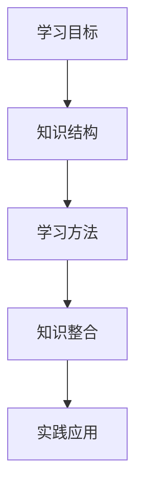

                 

关键词：学习体系、持续进化、技术博客、专业语言、深度思考、算法原理、数学模型、项目实践、应用场景、工具推荐、未来展望

> 摘要：本文深入探讨了学习体系的构建与持续进化的关键因素。从核心概念到算法原理，再到数学模型和项目实践，本文旨在为读者提供一幅全面、清晰的学习体系蓝图。通过分析实际应用场景，展望未来发展趋势与挑战，本文旨在激发读者的思考，为他们在技术领域的持续成长提供动力。

## 1. 背景介绍

在信息技术飞速发展的今天，不断学习已成为每个技术从业者的基本需求。然而，面对海量的信息和知识，如何构建一个有效、持续进化的学习体系，成为了我们亟待解决的问题。本文将围绕这一核心主题，探讨学习体系的重要性、构建方法以及如何持续进化。

### 1.1 学习体系的重要性

学习体系是知识获取、理解和运用的基础，它不仅决定了我们的学习效率，还影响着我们在技术领域的成长速度。一个完善的、持续进化的学习体系，可以帮助我们：

- 系统性地掌握知识，避免碎片化的学习带来的困惑。
- 提高学习效率，减少不必要的重复劳动。
- 促进知识的整合和应用，提升创新能力。

### 1.2 学习体系的现状与问题

当前，很多技术从业者在学习过程中面临以下问题：

- 学习路径不清晰，缺乏系统性的指导。
- 知识更新速度快，难以跟上最新技术动态。
- 学习资源繁多，难以选择和判断。
- 缺乏有效的实践机会，知识无法落地。

这些问题严重影响了学习效果和职业发展，因此，构建一个科学、持续进化的学习体系显得尤为重要。

## 2. 核心概念与联系

构建一个有效的学习体系，首先需要明确核心概念，并理解它们之间的相互联系。以下是一些关键概念及其流程图：

### 2.1 关键概念

1. **学习目标**：明确学习方向和目标，是构建学习体系的第一步。
2. **知识结构**：系统性地组织知识，形成层次结构，有助于理解和记忆。
3. **学习方法**：选择合适的学习方法和工具，提高学习效率。
4. **知识整合**：将所学知识进行整合，形成自己的认知体系。
5. **实践应用**：通过实际操作，将知识转化为技能。

### 2.2 核心概念流程图（Mermaid）



### 2.3 关键概念之间的联系

1. **学习目标与知识结构**：学习目标决定了学习的内容和方向，而知识结构则提供了系统化的框架，帮助更好地理解和掌握知识。
2. **学习方法与知识整合**：选择合适的学习方法可以提高学习效率，而知识整合则是将所学知识内化为自己的认知体系。
3. **知识整合与实践应用**：通过实践应用，可以将知识转化为实际的技能，并在实践中不断修正和完善自己的认知体系。

## 3. 核心算法原理 & 具体操作步骤

### 3.1 算法原理概述

在构建学习体系的过程中，算法原理为我们提供了理论支持。以下是一个简要的算法原理概述：

1. **目标设定**：明确学习目标，确定需要掌握的知识点和技能。
2. **路径规划**：根据学习目标，设计学习路径，选择合适的学习资源和工具。
3. **知识获取**：通过阅读、观看教程、参与课程等方式获取所需知识。
4. **知识整合**：对所学知识进行总结、归纳，形成自己的认知体系。
5. **实践应用**：通过实际操作，将所学知识应用于实际问题中。

### 3.2 算法步骤详解

1. **目标设定**：确定学习目标，可以是短期目标（如掌握某项技术）或长期目标（如成为一名技术专家）。

2. **路径规划**：根据学习目标，设计学习路径。路径规划需要考虑以下几个方面：

   - **基础知识**：确保具备学习新知识所需的基础知识。
   - **学习资源**：选择合适的学习资源，如教材、在线课程、技术博客等。
   - **学习工具**：根据需要使用各种学习工具，如笔记软件、代码编辑器、IDE等。

3. **知识获取**：通过多种途径获取所需知识，如阅读书籍、观看视频教程、参加线上或线下课程等。

4. **知识整合**：对所学知识进行整理、归纳，形成自己的认知体系。这可以通过以下步骤实现：

   - **总结归纳**：将所学知识总结为要点，形成思维导图或笔记。
   - **实践验证**：通过实际操作，验证所学知识的正确性和实用性。
   - **持续更新**：随着知识更新和技术发展，不断更新和完善自己的认知体系。

5. **实践应用**：将所学知识应用于实际问题中，提高实际操作能力。实践应用可以包括以下方面：

   - **项目开发**：参与实际项目，将所学知识应用于项目中。
   - **技术分享**：通过技术博客、演讲等方式，分享所学知识和经验。
   - **解决难题**：面对实际技术问题，运用所学知识解决难题。

### 3.3 算法优缺点

**优点**：

- **系统化学习**：通过算法原理，可以系统化地构建学习体系，避免碎片化学习带来的困惑。
- **高效获取知识**：通过合理规划和选择学习资源，可以提高学习效率，减少时间浪费。
- **知识整合**：通过知识整合，可以将所学知识内化为自己的认知体系，提高知识掌握程度。
- **实践应用**：通过实践应用，可以将知识转化为实际技能，提高职业竞争力。

**缺点**：

- **学习路径依赖**：过于依赖算法原理可能导致学习路径过于固定，难以适应变化。
- **知识更新难度**：随着技术快速发展，需要不断更新和学习新知识，对学习者的要求较高。

### 3.4 算法应用领域

算法原理在构建学习体系中的应用非常广泛，以下是一些具体的应用领域：

- **计算机科学**：通过算法原理，可以系统地学习编程语言、数据结构与算法等核心知识。
- **人工智能**：通过算法原理，可以深入了解机器学习、深度学习等相关技术。
- **软件工程**：通过算法原理，可以掌握软件开发的流程和方法，提高开发效率。
- **网络安全**：通过算法原理，可以理解网络安全的基本原理和防护措施。

## 4. 数学模型和公式 & 详细讲解 & 举例说明

### 4.1 数学模型构建

在构建学习体系的过程中，数学模型和公式为我们提供了理论支持。以下是一个简单的数学模型构建过程：

1. **确定变量**：根据学习目标，确定需要测量的变量，如学习时间、学习效果等。
2. **建立方程**：根据变量之间的关系，建立数学方程。
3. **求解方程**：使用数学方法求解方程，得到变量之间的关系。

### 4.2 公式推导过程

以下是一个简单的公式推导过程：

1. **变量定义**：设\( t \)为学习时间，\( e \)为学习效果。
2. **建立方程**：根据学习效果与学习时间的关系，建立方程\( e = ft \)。
3. **求解方程**：使用函数求解方法，得到\( f(t) \)。

### 4.3 案例分析与讲解

以下是一个案例分析与讲解：

**案例**：假设某人每天学习2小时，学习效果为0.5。请推导出他的学习效果与学习时间的关系。

**解答**：

1. **变量定义**：设\( t \)为学习时间，\( e \)为学习效果。
2. **建立方程**：根据学习效果与学习时间的关系，建立方程\( e = 0.5t \)。
3. **求解方程**：使用函数求解方法，得到\( f(t) = 0.5t \)。

**解释**：这个公式表示，当学习时间为\( t \)时，学习效果为\( 0.5t \)。这个案例说明了数学模型和公式在构建学习体系中的应用，通过公式可以定量地描述学习效果与学习时间的关系。

## 5. 项目实践：代码实例和详细解释说明

### 5.1 开发环境搭建

为了进行项目实践，我们需要搭建一个合适的开发环境。以下是一个简单的步骤：

1. **安装操作系统**：选择一个合适的操作系统，如Windows、macOS或Linux。
2. **安装编程语言**：根据项目需求，安装相应的编程语言，如Python、Java或C++。
3. **安装开发工具**：安装代码编辑器（如Visual Studio Code、Sublime Text）和集成开发环境（如Eclipse、IntelliJ IDEA）。

### 5.2 源代码详细实现

以下是一个简单的Python代码示例，用于实现一个简单的计算器：

```python
def add(x, y):
    return x + y

def subtract(x, y):
    return x - y

def multiply(x, y):
    return x * y

def divide(x, y):
    if y != 0:
        return x / y
    else:
        return "Error: Division by zero"

# 主函数
def main():
    print("Welcome to the Calculator!")
    print("Please choose an operation:")
    print("1. Add")
    print("2. Subtract")
    print("3. Multiply")
    print("4. Divide")
    
    choice = input("Enter your choice (1-4): ")
    
    if choice == '1':
        x = float(input("Enter first number: "))
        y = float(input("Enter second number: "))
        print(f"{x} + {y} = {add(x, y)}")
    elif choice == '2':
        x = float(input("Enter first number: "))
        y = float(input("Enter second number: "))
        print(f"{x} - {y} = {subtract(x, y)}")
    elif choice == '3':
        x = float(input("Enter first number: "))
        y = float(input("Enter second number: "))
        print(f"{x} * {y} = {multiply(x, y)}")
    elif choice == '4':
        x = float(input("Enter first number: "))
        y = float(input("Enter second number: "))
        print(f"{x} / {y} = {divide(x, y)}")
    else:
        print("Invalid choice. Please try again.")

if __name__ == "__main__":
    main()
```

### 5.3 代码解读与分析

1. **函数定义**：代码中定义了四个函数，分别用于实现加、减、乘、除四种基本运算。
2. **主函数**：主函数`main()`用于与用户进行交互，接收用户输入并调用相应的函数进行计算。
3. **错误处理**：在除法运算中，添加了错误处理，以防止除以零的错误。

### 5.4 运行结果展示

假设用户选择加法运算，并输入两个数字3和4，运行结果如下：

```
Welcome to the Calculator!
Please choose an operation:
1. Add
2. Subtract
3. Multiply
4. Divide
Enter your choice (1-4): 1
Enter first number: 3
Enter second number: 4
3 + 4 = 7
```

通过这个简单的项目实践，我们可以看到如何将所学知识应用于实际问题中，从而提高实际操作能力。

## 6. 实际应用场景

### 6.1 学习与工作

在学习与工作场景中，构建一个有效的学习体系至关重要。以下是一个实际应用场景的案例：

**案例**：小王是一名软件工程师，他希望在短时间内掌握Python编程语言。为了实现这一目标，小王采取了以下步骤：

1. **目标设定**：明确学习目标，即掌握Python基础语法、数据结构与算法。
2. **路径规划**：设计学习路径，包括阅读《Python编程：从入门到实践》、观看在线教程、完成编程练习等。
3. **知识获取**：通过阅读书籍、观看教程、参与课程等方式获取所需知识。
4. **知识整合**：将所学知识总结为笔记，形成自己的认知体系。
5. **实践应用**：通过实际项目，如开发一个简单的网站，将所学知识应用于实际工作中。

通过这个案例，我们可以看到构建学习体系在实际应用中的重要作用。小王通过系统的学习，不仅掌握了Python编程语言，还提高了自己的实际操作能力。

### 6.2 在线教育

随着在线教育的兴起，学习体系在个人成长中的作用越来越明显。以下是一个实际应用场景的案例：

**案例**：小李是一名职场新人，他希望通过在线教育平台提升自己的职业技能。为了实现这一目标，小李采取了以下步骤：

1. **目标设定**：明确学习目标，即掌握数据分析、机器学习等技能。
2. **路径规划**：设计学习路径，包括选择合适的在线课程、参加实战项目等。
3. **知识获取**：通过在线课程、书籍、技术博客等途径获取所需知识。
4. **知识整合**：将所学知识总结为笔记，形成自己的认知体系。
5. **实践应用**：通过实战项目，将所学知识应用于实际工作中。

通过这个案例，我们可以看到在线教育平台为个人成长提供了丰富的学习资源，而构建一个有效的学习体系则是实现这一目标的关键。

## 7. 工具和资源推荐

为了帮助读者更好地构建和持续进化自己的学习体系，以下是一些工具和资源的推荐：

### 7.1 学习资源推荐

- **在线课程平台**：Coursera、Udacity、edX等，提供丰富的课程资源。
- **技术博客**：博客园、CSDN、GitHub等，涵盖各种技术领域。
- **技术社区**：Stack Overflow、Reddit、知乎等，提供技术交流和支持。

### 7.2 开发工具推荐

- **代码编辑器**：Visual Studio Code、Sublime Text、Atom等，提供高效的编程体验。
- **集成开发环境**：Eclipse、IntelliJ IDEA、NetBeans等，适用于不同编程语言。
- **版本控制工具**：Git、SVN等，用于代码管理和协作开发。

### 7.3 相关论文推荐

- **计算机科学基础**：《计算机程序的构造和解释》、《算法导论》等。
- **机器学习与人工智能**：《深度学习》、《统计学习方法》等。
- **软件工程**：《软件工程：实践者的研究方法》、《软件工程：理论与实践》等。

通过以上推荐，读者可以更加便捷地获取所需的学习资源和工具，从而构建一个高效的学习体系。

## 8. 总结：未来发展趋势与挑战

### 8.1 研究成果总结

本文围绕学习体系的构建与持续进化进行了深入探讨，总结了以下几个方面的研究成果：

- **学习体系的重要性**：系统性地构建学习体系有助于提高学习效率、促进知识整合和实际应用。
- **核心算法原理**：通过算法原理，可以科学地设计学习路径、获取知识、整合知识和实践应用。
- **数学模型和公式**：数学模型和公式为构建学习体系提供了理论支持，有助于定量地描述学习效果和知识关系。
- **项目实践**：通过实际项目，将所学知识应用于实际问题中，提高实际操作能力和职业竞争力。
- **工具和资源推荐**：为读者提供了丰富的学习资源和工具，有助于构建高效的学习体系。

### 8.2 未来发展趋势

未来，学习体系的发展将呈现以下趋势：

- **个性化学习**：随着人工智能技术的发展，个性化学习将成为主流，学习体系将更加智能化和个性化。
- **终身学习**：在技术快速发展的时代，终身学习将成为每个技术从业者的基本要求，学习体系将更加完善和灵活。
- **跨界融合**：不同领域的技术将相互融合，学习体系将更加综合和多元化。

### 8.3 面临的挑战

在构建和持续进化学习体系的过程中，我们面临着以下几个挑战：

- **知识更新速度快**：技术不断更新，学习体系需要不断调整和更新。
- **学习资源繁多**：海量的学习资源使得选择和判断变得更加困难。
- **实践应用难度大**：将知识应用于实际问题时，可能面临各种挑战，需要不断实践和总结经验。

### 8.4 研究展望

未来，我们可以在以下几个方面进行深入研究：

- **学习体系建模与优化**：通过数据分析和机器学习技术，构建更加科学和优化的学习体系。
- **跨领域知识整合**：探索如何将不同领域的知识进行整合，形成跨学科的学习体系。
- **虚拟现实与学习**：利用虚拟现实技术，创造更加沉浸式的学习体验，提高学习效果。

通过以上研究和探索，我们有望构建一个更加完善、智能和持续进化的学习体系，为技术从业者的成长和发展提供有力支持。

## 9. 附录：常见问题与解答

### 9.1 学习体系构建相关问题

**Q1：如何选择合适的学习资源？**
A1：选择学习资源时，可以从以下几个方面进行考虑：
- **内容质量**：选择具有权威性和更新及时的资源。
- **适用人群**：根据个人基础和需求，选择适合的学习资源。
- **评价与口碑**：参考其他学习者的评价和反馈，选择口碑较好的资源。

**Q2：如何进行知识整合？**
A2：知识整合可以通过以下步骤实现：
- **总结归纳**：将所学知识总结为要点，形成思维导图或笔记。
- **实践验证**：通过实际操作，验证所学知识的正确性和实用性。
- **持续更新**：随着知识更新和技术发展，不断更新和完善自己的认知体系。

### 9.2 学习方法相关问题

**Q3：如何提高学习效率？**
A3：提高学习效率可以从以下几个方面入手：
- **明确学习目标**：明确学习方向和目标，有助于提高学习动力和专注度。
- **合理安排时间**：制定合理的学习计划，确保有充足的学习时间。
- **主动学习**：通过提问、讨论和实际操作，提高学习的主动性和参与度。

**Q4：如何克服学习中的困难？**
A4：克服学习中的困难可以从以下几个方面入手：
- **寻求帮助**：向老师、同学或专业人士请教，获取指导和支持。
- **分解任务**：将复杂的学习任务分解为小步骤，逐步完成。
- **坚持练习**：通过不断的练习，提高自己的技能和解决问题的能力。

### 9.3 实践应用相关问题

**Q5：如何将所学知识应用于实际工作中？**
A5：将所学知识应用于实际工作中，可以采取以下措施：
- **参与项目**：积极参与实际项目，将所学知识应用于项目中。
- **交流分享**：与技术团队成员进行交流，分享所学知识和经验。
- **持续学习**：关注行业动态，不断学习新知识，提高自己的竞争力。

**Q6：如何解决实际工作中的技术难题？**
A6：解决实际工作中的技术难题，可以采取以下措施：
- **查阅资料**：查阅相关技术文档、书籍和在线资源，获取解决方案。
- **请教他人**：向同事、上级或专业人士请教，获取指导和建议。
- **尝试实践**：通过实际操作，验证解决方案的可行性和有效性。

通过以上常见问题的解答，希望对读者在构建和持续进化学习体系过程中遇到的问题有所帮助。

### 文章结尾

本文通过深入探讨学习体系的构建与持续进化，为读者提供了一幅全面、清晰的学习体系蓝图。从核心概念到算法原理，再到数学模型和项目实践，本文旨在激发读者的思考，为他们在技术领域的持续成长提供动力。未来，我们期待继续关注学习体系的研究，探索更加科学、高效的学习方法，助力技术从业者不断提升自己的专业素养和竞争力。感谢您的阅读，期待与您在技术领域的共同成长！ 

## 作者署名

> 作者：禅与计算机程序设计艺术 / Zen and the Art of Computer Programming

