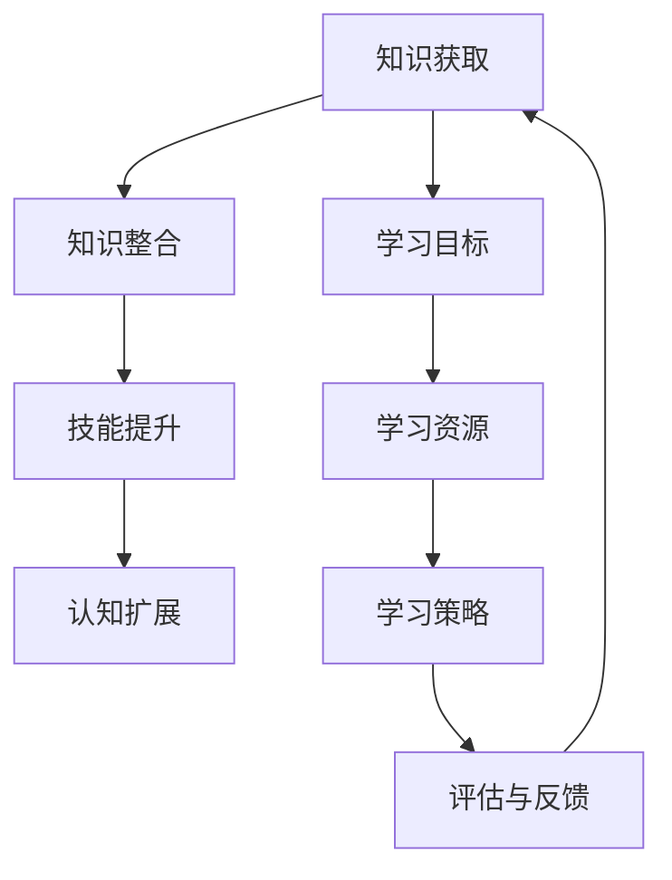

                 

关键词：学习体系、知识进化、技能提升、技术进步、认知模型

> 摘要：本文旨在探讨学习体系的构建对技术进化和个人成长的重要性。通过分析学习体系的核心概念和原理，本文揭示了构建高效学习体系的关键因素，以及如何通过算法和数学模型来优化学习过程。文章还结合实际项目实践，展示了学习体系的实际应用和效果，最后对学习体系的未来发展趋势和挑战进行了展望。

## 1. 背景介绍

在快速发展的信息技术时代，知识更新的速度远超以往。这要求我们不仅要快速吸收新知识，还要能够将其内化为自己的技能和认知体系。学习体系作为知识获取、整合和应用的基础架构，对于个人和组织的成长至关重要。本文将从技术领域入手，探讨学习体系的构建对技术进化和个人成长的影响。

### 1.1 信息技术的发展对学习体系的需求

随着信息技术的迅猛发展，知识更新速度加快，技术领域不断涌现新的概念和工具。为了跟上时代的步伐，我们需要具备快速学习和适应新知识的能力。然而，传统的线性学习方式已经难以满足这种快速变化的需求。学习体系作为一种系统化的知识获取与整合方法，能够更好地应对这一挑战。

### 1.2 学习体系的重要性

学习体系不仅有助于我们更好地掌握知识，还能够提高我们的学习效率和能力。通过构建高效的学习体系，我们可以实现以下目标：

- **知识整合**：将零散的知识点整合成有体系的知识网络，提高知识的可用性和可扩展性。  
- **技能提升**：通过不断的学习和实践，提升个人的技能水平，增强竞争力。  
- **认知扩展**：拓展我们的认知边界，提升我们的思维能力和创新意识。

## 2. 核心概念与联系

在探讨学习体系之前，我们需要明确几个核心概念，这些概念是构建学习体系的基础。

### 2.1 知识与技能

知识是指对事实、概念、原理等的理解，而技能是指通过实践掌握的具体操作能力。知识是技能的基础，技能则是知识的实践应用。二者相辅相成，共同构成了我们的认知体系。

### 2.2 学习与认知

学习是指通过获取、整合和应用知识，提升个人认知水平的过程。认知是指我们对信息进行处理、理解和记忆的能力。学习与认知密切相关，学习是认知的基础，认知是学习的目标。

### 2.3 学习体系

学习体系是指通过系统化的方法，构建的知识获取、整合和应用体系。学习体系包括学习目标、学习资源、学习策略、评估与反馈等多个方面，它为我们提供了一个有序、高效的学习路径。

### 2.4 学习体系的联系

学习体系中的各个概念相互关联，共同构成了一个整体。知识是学习的基础，技能是知识的实践应用，认知是学习的目标。学习体系通过系统化的方法，将这些要素有机地结合起来，实现知识到技能、再到认知的转化。

## 2.5 学习体系架构的 Mermaid 流程图

下面是一个描述学习体系架构的 Mermaid 流程图，用于展示各个核心概念之间的联系：



### 3. 核心算法原理 & 具体操作步骤

构建高效的学习体系需要遵循一定的算法原理，这些原理可以帮助我们优化学习过程，提高学习效果。以下是构建学习体系的核心算法原理和具体操作步骤。

### 3.1 算法原理概述

学习体系的构建是一个动态调整的过程，它依赖于以下几个核心算法原理：

- **目标导向**：以学习目标为导向，制定明确的学习计划和路径。  
- **资源整合**：整合各类学习资源，构建丰富的知识体系。  
- **策略优化**：根据学习效果，不断调整学习策略，提高学习效率。  
- **反馈调整**：通过评估与反馈，及时调整学习目标和策略，实现学习过程的优化。

### 3.2 算法步骤详解

构建学习体系的具体操作步骤如下：

#### 3.2.1 确定学习目标

首先，我们需要明确自己的学习目标。学习目标应该具体、可衡量，并具有明确的实现路径。例如，我们可以设定以下学习目标：

- 掌握 Python 编程语言的基础知识。  
- 学习深度学习相关技术，掌握神经网络的基本原理。  
- 撰写一篇关于深度学习技术的论文。

#### 3.2.2 整合学习资源

接下来，我们需要整合各类学习资源，包括书籍、课程、博客、论文等。这些资源可以帮助我们系统地学习相关知识，构建完整的知识体系。例如，我们可以通过以下途径获取资源：

- 在线课程平台：如 Coursera、edX 等，提供丰富的课程资源。  
- 技术博客：如 Medium、知乎等，可以获取一线开发者的实践经验。  
- 学术论文：通过学术数据库如 IEEE Xplore、Google Scholar 等，获取最新的研究成果。

#### 3.2.3 制定学习策略

在整合学习资源之后，我们需要制定合适的学习策略。学习策略应该根据学习目标和资源特点进行个性化调整。以下是几种常见的学习策略：

- **任务驱动**：根据具体的学习任务，制定详细的学习计划和路径。  
- **项目驱动**：通过实际项目实践，将理论知识应用于实际场景，提高实际操作能力。  
- **讨论互动**：通过与他人讨论、交流，分享学习心得，拓展认知边界。

#### 3.2.4 评估与反馈

最后，我们需要对学习过程进行评估与反馈。通过评估与反馈，我们可以了解自己的学习效果，发现问题并调整学习策略。以下是几种常见的评估与反馈方法：

- **自我评估**：定期对自己的学习进度和效果进行自我评估，了解自己的优势和不足。  
- **同伴评估**：与学习伙伴相互评估，取长补短，共同进步。  
- **导师反馈**：向导师请教，获取专业的意见和建议，提高自己的认知水平。

### 3.3 算法优缺点

#### 优点

- **目标导向**：明确的学习目标有助于提高学习效率。  
- **资源整合**：丰富的学习资源有助于构建完整的知识体系。  
- **策略优化**：灵活的学习策略可以根据学习效果进行调整，提高学习效果。  
- **反馈调整**：及时评估与反馈有助于发现问题和调整学习策略，实现学习过程的优化。

#### 缺点

- **依赖外部资源**：构建学习体系需要依赖外部学习资源，可能会导致知识体系的碎片化。  
- **时间成本**：构建和优化学习体系需要投入大量的时间和精力，对于时间紧张的个体可能有一定压力。

### 3.4 算法应用领域

构建学习体系的方法可以广泛应用于个人和组织的知识管理。以下是一些典型应用领域：

- **个人知识管理**：通过构建个人学习体系，实现知识的系统化整合和持续更新，提高个人竞争力。  
- **企业培训与发展**：通过构建企业学习体系，为企业员工提供系统化的培训和发展路径，提高企业整体素质。  
- **在线教育**：通过构建在线学习体系，为学生提供个性化的学习路径和资源，提高学习效果。

## 4. 数学模型和公式 & 详细讲解 & 举例说明

在构建学习体系的过程中，数学模型和公式可以为我们提供量化分析的工具，帮助我们更好地理解学习过程，优化学习策略。以下是一些常见的数学模型和公式，以及它们的详细讲解和举例说明。

### 4.1 数学模型构建

学习体系中的数学模型主要包括以下几个部分：

- **学习曲线模型**：描述学习者在学习过程中，技能和知识水平的增长趋势。  
- **遗忘曲线模型**：描述学习者随着时间的推移，遗忘已学知识的速度。  
- **评估模型**：用于评估学习者的学习效果，包括知识掌握程度、技能应用能力等。

### 4.2 公式推导过程

以下是学习曲线模型的公式推导过程：

**学习曲线模型**：  
设学习者技能水平为 $S(t)$，学习时间为 $t$，则有：  
$$S(t) = S_0 + \frac{1}{\beta} \ln(1 + \alpha t)$$

其中，$S_0$ 为初始技能水平，$\beta$ 为学习速率，$\alpha$ 为学习强度。

**遗忘曲线模型**：  
设学习者遗忘率为 $\lambda$，学习时间为 $t$，则有：  
$$F(t) = e^{-\lambda t}$$

其中，$F(t)$ 为遗忘率。

### 4.3 案例分析与讲解

以下通过一个具体案例，展示如何使用数学模型和公式来分析学习过程。

**案例：学习 Python 编程**

假设小明是一名编程新手，他开始学习 Python 编程，并设定了一个学习目标：在一个月内掌握 Python 基础语法和常用库。小明每天学习 2 小时，根据学习曲线模型和遗忘曲线模型，我们可以分析他的学习过程。

**1. 学习曲线分析**

- 初始技能水平 $S_0$：0（编程新手）
- 学习速率 $\beta$：0.1（中等）
- 学习强度 $\alpha$：0.5（较高）

根据学习曲线模型，可以计算出小明每天的学习进度：

$$S(t) = 0 + \frac{1}{0.1} \ln(1 + 0.5 \times t)$$

在第 7 天时，小明技能水平为：

$$S(7) = \frac{1}{0.1} \ln(1 + 0.5 \times 7) \approx 2.71$$

在第 14 天时，小明技能水平为：

$$S(14) = \frac{1}{0.1} \ln(1 + 0.5 \times 14) \approx 4.18$$

**2. 遗忘曲线分析**

- 遗忘率 $\lambda$：0.3（较高）

根据遗忘曲线模型，可以计算出小明每天的知识遗忘率：

$$F(t) = e^{-0.3t}$$

在第 7 天时，小明遗忘的知识比例为：

$$F(7) = e^{-0.3 \times 7} \approx 0.43$$

在第 14 天时，小明遗忘的知识比例为：

$$F(14) = e^{-0.3 \times 14} \approx 0.6$$

**3. 评估与反馈**

通过学习曲线和遗忘曲线的分析，我们可以得出以下结论：

- 小明在学习 Python 编程的过程中，技能水平逐渐提升，但受遗忘曲线的影响，需要不断复习巩固已学知识。
- 为了提高学习效果，小明可以适当增加学习时间，或通过项目实践来加深对知识的理解。

### 4.4 数学模型在项目实践中的应用

以下是一个关于使用数学模型优化学习项目的实际案例。

**项目背景**：  
某互联网公司希望提高员工的技术水平，特别是 Python 编程能力。公司决定开展一个为期 3 个月的技术培训项目，要求员工在项目结束后，能够独立完成一个 Python 项目的开发。

**解决方案**：

- **学习目标**：制定具体的学习目标，包括 Python 基础语法、常用库、项目开发流程等。
- **学习资源**：整合内部培训资料、外部学习资源（如 Coursera、edX 等）。
- **学习策略**：采用任务驱动和项目驱动的学习策略，确保员工在实际项目中应用所学知识。
- **评估与反馈**：定期组织学习评估，对员工的学习效果进行评估，并根据评估结果调整学习目标和策略。

**数学模型应用**：

- **学习曲线模型**：用于预测员工在项目结束时的技能水平，为制定学习目标和策略提供依据。  
- **遗忘曲线模型**：用于分析员工在项目过程中可能出现的知识遗忘情况，为复习策略的制定提供依据。

**实施效果**：

通过数学模型的应用，公司成功提高了员工的技术水平。在项目结束后，大部分员工能够独立完成 Python 项目的开发，并获得了公司的高度认可。

## 5. 项目实践：代码实例和详细解释说明

为了更好地展示学习体系的实际应用，我们以下将结合一个具体的 Python 项目实践，介绍如何通过构建学习体系来优化学习过程，提高项目开发效率。

### 5.1 开发环境搭建

在开始项目之前，我们需要搭建一个适合 Python 项目开发的编程环境。以下是搭建开发环境的步骤：

1. 安装 Python 解释器：从 Python 官网（[python.org](http://python.org)）下载并安装 Python 3.x 版本。  
2. 配置 Python 环境：打开终端，运行以下命令配置 Python 环境：  
   ```  
   python3 -m pip install --upgrade pip  
   python3 -m pip install numpy pandas matplotlib  
   ```  
3. 安装 IDE：选择一款适合 Python 开发的集成开发环境（IDE），如 PyCharm、Visual Studio Code 等。

### 5.2 源代码详细实现

以下是一个简单的 Python 项目实例，用于绘制一条抛物线。该项目旨在通过实际编写代码，帮助开发者熟悉 Python 的基础语法和常用库。

```python
import numpy as np
import matplotlib.pyplot as plt

# 定义抛物线函数
def parabola(a, b, c):
    x = np.linspace(-10, 10, 1000)
    y = a * x**2 + b * x + c
    return x, y

# 绘制抛物线
def plot_parabola(a, b, c):
    x, y = parabola(a, b, c)
    plt.plot(x, y)
    plt.title(f'Parabola: {a}x^2 + {b}x + {c}')
    plt.xlabel('x')
    plt.ylabel('y')
    plt.grid(True)
    plt.show()

# 测试代码
if __name__ == '__main__':
    a = 1
    b = -3
    c = 2
    plot_parabola(a, b, c)
```

### 5.3 代码解读与分析

上述代码实现了一个简单的抛物线绘制功能，以下是代码的详细解读与分析：

1. **导入模块**：代码首先导入了 `numpy` 和 `matplotlib.pyplot` 模块。`numpy` 是 Python 的科学计算库，提供高性能的数学运算功能；`matplotlib.pyplot` 是一个绘图库，用于绘制各种图形。

2. **定义抛物线函数**：`parabola` 函数用于计算抛物线上的点。函数接受三个参数 $a$、$b$、$c$，分别表示抛物线方程中的系数。`np.linspace` 函数用于生成一系列等间隔的 $x$ 值，`a * x**2 + b * x + c` 用于计算对应的 $y$ 值。

3. **绘制抛物线函数**：`plot_parabola` 函数用于绘制抛物线。函数首先调用 `parabola` 函数获取 $x$ 和 $y$ 值，然后使用 `plt.plot` 函数绘制抛物线，并设置图表标题、标签和网格。

4. **测试代码**：在主函数中，我们定义了三个系数 $a$、$b$、$c$，然后调用 `plot_parabola` 函数绘制抛物线。

### 5.4 运行结果展示

运行上述代码后，我们将看到一个简单的抛物线图形。以下是一个示例图形：


通过实际编写和运行代码，开发者可以加深对 Python 基础语法和常用库的理解，提高编程能力。同时，通过构建学习体系，开发者可以系统地学习相关知识，提高学习效率。

## 6. 实际应用场景

构建高效的学习体系在多个领域都有着广泛的应用，以下将介绍几个典型的实际应用场景，以及学习体系在这些场景中的重要作用。

### 6.1 技术研发

在技术研发领域，构建高效的学习体系对于提升团队的技术水平和创新能力至关重要。通过系统化的学习，团队成员可以掌握最新的技术趋势和工具，为项目开发提供有力支持。例如，在人工智能领域，学习体系可以帮助研究人员掌握深度学习、神经网络等相关技术，提高算法研究和模型优化的效率。

### 6.2 在线教育

在线教育平台通过构建学习体系，为学习者提供个性化的学习路径和资源。学习者可以根据自己的需求和进度，选择适合自己的课程和资源，实现自主学习和自我提升。例如，Coursera、edX 等平台通过学习体系，为学习者提供了丰富的在线课程资源，帮助学习者高效地掌握知识。

### 6.3 企业培训与发展

企业通过构建学习体系，为员工提供系统化的培训和发展路径，提高员工的专业素养和业务能力。例如，一些企业通过学习体系，组织内部培训课程，帮助员工掌握新技术、提升职业素养，从而增强企业的核心竞争力。

### 6.4 技能培训

技能培训领域通过构建学习体系，为学员提供系统化的技能培训课程，帮助学员掌握实用技能。例如，编程培训、数据分析培训等，通过学习体系，学员可以系统地学习相关技术，提高实际操作能力。

### 6.5 个人知识管理

个人通过构建学习体系，实现知识的系统化整合和持续更新，提高个人竞争力。例如，个人可以通过学习体系，定期学习新知识、回顾旧知识，保持自己的知识体系处于最佳状态。

### 6.6 未来应用展望

随着人工智能、大数据等技术的不断发展，学习体系在各个领域的应用前景将更加广阔。未来，学习体系有望实现以下发展趋势：

1. **个性化学习**：通过大数据分析和人工智能算法，为学习者提供更加个性化的学习路径和资源，实现个性化学习。
2. **自适应学习**：学习体系将具备自适应能力，根据学习者的学习效果和进度，动态调整学习内容和策略，实现高效学习。
3. **跨领域整合**：学习体系将实现跨领域的知识整合，帮助学习者构建多元化的知识体系，提升跨学科能力。
4. **终身学习**：学习体系将支持终身学习，帮助个人和组织实现持续成长和进步。

## 7. 工具和资源推荐

为了帮助读者更好地构建和优化学习体系，以下推荐一些实用的工具和资源。

### 7.1 学习资源推荐

1. **在线课程平台**：Coursera、edX、Udemy、网易云课堂等，提供丰富的课程资源。
2. **技术博客**：Medium、知乎、掘金、CSDN 等，汇集了大量一线开发者的实践经验。
3. **学术论文数据库**：IEEE Xplore、Google Scholar、CNKI 等，提供最新的研究成果。

### 7.2 开发工具推荐

1. **Python 开发环境**：PyCharm、Visual Studio Code、Jupyter Notebook 等。
2. **版本控制工具**：Git、GitHub、GitLab 等。
3. **数据分析工具**：Pandas、NumPy、Matplotlib 等。

### 7.3 相关论文推荐

1. **"Learning to Learn: A Primer on Self-Improving Artificial Intelligence"**，介绍人工智能领域中的自学习技术。
2. **"Learning in Humans and Machines: Computational Models of Learning and Memory"**，探讨人类和机器学习中的共性和差异。
3. **"The Science of Learning: A Comprehensive Overview"**，从科学角度全面解读学习过程。

## 8. 总结：未来发展趋势与挑战

### 8.1 研究成果总结

本文从技术领域出发，探讨了学习体系的构建对技术进化和个人成长的重要性。通过分析学习体系的核心概念、算法原理和应用场景，我们揭示了构建高效学习体系的关键因素。同时，结合数学模型和项目实践，我们展示了学习体系的实际应用效果。

### 8.2 未来发展趋势

未来，学习体系的发展将朝着个性化学习、自适应学习和跨领域整合等方向迈进。随着人工智能、大数据等技术的发展，学习体系将具备更加智能化和高效化的特点，为个人和组织提供更加优质的学习体验。

### 8.3 面临的挑战

在构建学习体系的过程中，我们面临以下挑战：

1. **资源整合**：如何高效整合各类学习资源，构建完整的知识体系。
2. **个性化学习**：如何根据学习者的需求和进度，提供个性化的学习路径和资源。
3. **持续更新**：如何保持学习体系的动态更新，确保知识的时效性和实用性。

### 8.4 研究展望

未来，我们需要进一步深入研究学习体系的核心理论和应用方法，探索如何通过技术手段提升学习体系的效率和质量。同时，我们还需要关注跨学科的知识整合，构建多元化、系统化的学习体系，以应对不断变化的技术和知识环境。

## 9. 附录：常见问题与解答

### 9.1 如何制定学习目标？

制定学习目标时，需要遵循以下原则：

1. **具体明确**：目标应具体、可衡量，具有明确的实现路径。  
2. **挑战性**：目标应具有一定的挑战性，能够激发学习者的积极性。  
3. **可分解**：将大目标分解为小目标，逐步实现。

### 9.2 如何评估学习效果？

评估学习效果的方法包括：

1. **自我评估**：定期对自己的学习进度和效果进行自我评估。  
2. **同伴评估**：与学习伙伴相互评估，取长补短。  
3. **导师反馈**：向导师请教，获取专业的意见和建议。

### 9.3 学习体系是否适用于所有人？

学习体系适用于所有希望提升知识和技能的学习者。无论个人还是组织，都可以通过构建学习体系，实现知识的系统化整合和应用。

### 9.4 学习体系与自学有什么区别？

学习体系与自学的主要区别在于：

1. **系统性**：学习体系具有系统性，通过系统化的方法整合知识，提高学习效率。  
2. **目标导向**：学习体系以明确的学习目标为导向，有针对性地进行学习。  
3. **策略优化**：学习体系可以根据学习效果，不断调整学习策略，实现学习过程的优化。

----------------------------------------------------------------

作者：禅与计算机程序设计艺术 / Zen and the Art of Computer Programming

以上就是本文的完整内容。通过本文的探讨，我们希望读者能够认识到学习体系在技术进步和个人成长中的重要性，并学会如何构建和优化自己的学习体系。希望本文能够为您的学习和成长提供有益的启示和帮助。

