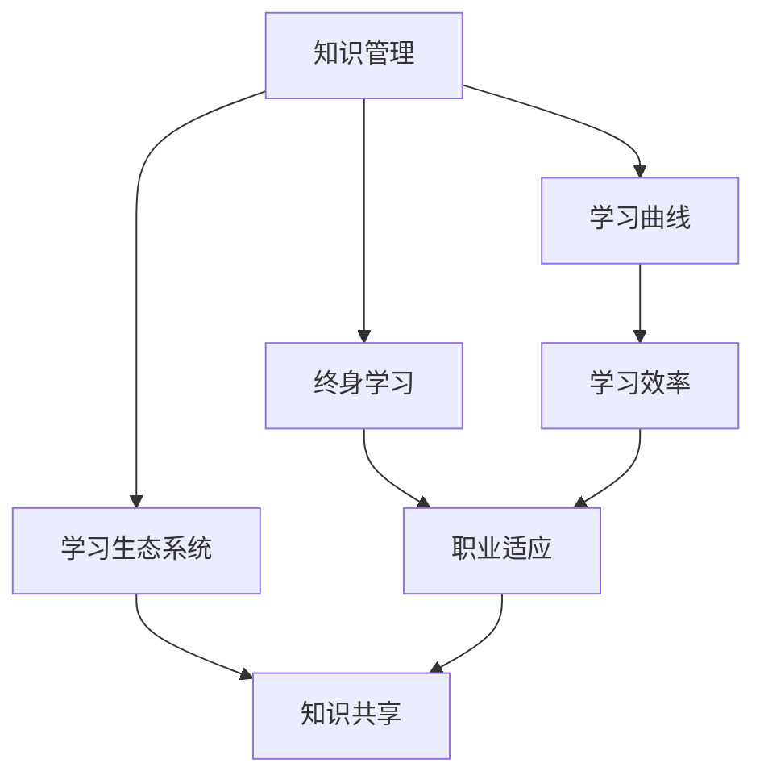

                 

学习体系与管理创新能力的培养是现代信息技术领域的关键课题。在这个快速变化的时代，如何构建一个高效的、适应不断更新知识的学习体系，并且在这一过程中培养出管理创新能力，对于企业的长远发展和个人的职业成长都至关重要。本文将围绕这一主题，探讨如何在信息技术领域中构建有效的学习体系，以及如何通过这一体系培养管理创新能力。

> 关键词：学习体系、管理创新能力、信息技术、职业成长、知识更新

> 摘要：本文通过深入分析信息技术领域的学习需求，探讨了构建高效学习体系的方法，并提出了培养管理创新能力的策略。文章旨在为从业者提供一套可行的学习和创新方法，以应对快速变化的技术环境。

## 1. 背景介绍

在信息技术爆炸式发展的背景下，知识的更新速度前所未有。技术的进步带来了前所未有的机遇，同时也提出了巨大的挑战。企业需要不断更新技术栈，个人也需要不断学习新知识，才能保持竞争力。然而，传统的学习方式往往无法满足这种快速变化的需求。这就要求我们构建一种全新的学习体系，能够快速适应知识的更新，并在学习过程中培养出管理创新能力。

### 1.1 信息技术领域的发展

信息技术领域的发展可以分为几个阶段：

- **第一阶段：基础技术的积累**  
  这个阶段主要包括计算机硬件和软件的早期发展，如计算机的诞生、操作系统和编程语言的出现。

- **第二阶段：互联网的普及**  
  互联网的普及使得信息传输变得更加便捷，网络应用开始出现，如电子邮件、搜索引擎和社交网络。

- **第三阶段：移动互联网和云计算**  
  移动互联网和云计算的出现，使得信息处理能力和数据处理效率得到了极大提升，移动应用和云服务成为主流。

- **第四阶段：人工智能和大数据**  
  人工智能和大数据技术的兴起，使得数据处理和分析能力达到了前所未有的高度，智能应用和数据分析开始普及。

### 1.2 知识更新的挑战

随着技术的不断进步，知识更新的速度也在加快。例如：

- **编程语言**：新的编程语言和框架不断出现，如Python、Java、JavaScript等。

- **数据库技术**：NoSQL数据库的流行，如MongoDB、Redis等。

- **云计算**：云服务的多样化，如Amazon Web Services (AWS)、Microsoft Azure、Google Cloud Platform (GCP)等。

- **人工智能**：机器学习和深度学习技术的进步，如TensorFlow、PyTorch等。

这些变化对学习提出了新的要求。传统的线性学习方式已经无法满足快速更新知识的需求，需要构建一个灵活、高效的学习体系。

## 2. 核心概念与联系

构建有效的学习体系需要理解以下几个核心概念：

- **知识管理**：如何获取、整理、存储和应用知识。

- **学习曲线**：学习者在学习过程中的认知过程和效率。

- **终身学习**：持续学习和更新知识，以适应职业和技术的变化。

- **学习生态系统**：包括学习资源、学习平台、学习社区等。

以下是一个用Mermaid绘制的流程图，展示了这些核心概念之间的联系：



### 2.1 知识管理

知识管理是一个涵盖知识获取、整理、存储和应用的过程。它包括以下几个方面：

- **知识获取**：通过各种渠道获取新的知识，如阅读书籍、参加培训、参加研讨会等。

- **知识整理**：对获取的知识进行整理和分类，使其易于管理和查找。

- **知识存储**：将整理后的知识存储在适当的系统中，如知识库、文档管理系统等。

- **知识应用**：将知识应用于实际工作中，以提高工作效率和质量。

### 2.2 学习曲线

学习曲线描述了学习者在学习过程中的认知过程和效率。一般来说，学习曲线可以分为以下几个阶段：

- **认知阶段**：学习者通过阅读、听讲等方式获取知识。

- **理解阶段**：学习者开始理解知识的含义和应用场景。

- **应用阶段**：学习者将知识应用于实际工作中，解决实际问题。

- **熟练阶段**：学习者对知识达到了熟练掌握的程度，可以灵活运用。

### 2.3 终身学习

终身学习是指持续学习和更新知识，以适应职业和技术的变化。随着技术的发展，新的知识和技能不断涌现，终身学习变得尤为重要。以下是一些建议：

- **定期更新知识**：定期阅读相关书籍、参加培训、关注行业动态。

- **学习新技能**：学习新的编程语言、框架、工具等。

- **实践应用**：将学到的知识应用到实际工作中，加深理解和掌握。

- **参与社区**：加入技术社区，与其他从业者交流和学习。

### 2.4 学习生态系统

学习生态系统是指支持学习者进行学习的各种资源、平台和社区。以下是一些常见的学习生态系统：

- **在线学习平台**：如Coursera、edX、Udemy等，提供各种课程和学习资源。

- **开源社区**：如GitHub、Stack Overflow等，提供代码、文档和讨论。

- **技术博客**：如Medium、博客园等，提供技术文章和教程。

- **专业社群**：如Meetup、LinkedIn等，提供线上和线下的交流机会。

## 3. 核心算法原理 & 具体操作步骤

### 3.1 算法原理概述

在信息技术领域，算法是解决问题的重要工具。一个高效的算法能够显著提高工作效率和系统性能。以下是一些核心算法原理：

- **排序算法**：如快速排序、归并排序、堆排序等。

- **查找算法**：如二分查找、哈希查找等。

- **动态规划**：用于解决最优化问题。

- **贪心算法**：用于解决某些特殊类型的问题。

### 3.2 算法步骤详解

以快速排序算法为例，其基本步骤如下：

1. **选择基准元素**：从数组中选出一个元素作为基准。
2. **分区**：将数组分为两部分，一部分是小于基准的元素，另一部分是大于基准的元素。
3. **递归排序**：对小于和大于基准的两部分分别递归执行快速排序。

### 3.3 算法优缺点

- **快速排序**：
  - **优点**：平均时间复杂度为O(n log n)，性能较好。
  - **缺点**：最坏情况下时间复杂度为O(n^2)，且需要额外的存储空间。

- **二分查找**：
  - **优点**：平均时间复杂度为O(log n)，性能高效。
  - **缺点**：需要排序好的数据，且对于大数据集可能需要较长的预处理时间。

### 3.4 算法应用领域

- **排序算法**：广泛应用于数据库、搜索引擎、数据分析等领域。
- **查找算法**：广泛应用于文件系统、数据库、缓存系统等领域。
- **动态规划**：广泛应用于路径规划、资源分配、背包问题等领域。
- **贪心算法**：广泛应用于贪心策略有效的领域，如背包问题、最短路径问题等。

## 4. 数学模型和公式 & 详细讲解 & 举例说明

### 4.1 数学模型构建

在信息技术领域，数学模型是描述和解决实际问题的重要工具。以下是一个简单的线性回归模型的构建过程：

1. **定义变量**：假设我们有一个自变量x和一个因变量y。
2. **建立模型**：假设y和x之间存在线性关系，即y = wx + b，其中w是斜率，b是截距。
3. **数据收集**：收集一组(x, y)的数据点。

### 4.2 公式推导过程

为了找到最优的w和b，我们可以使用最小二乘法。具体步骤如下：

1. **计算斜率w**：w = (Σxiyi - nΣxiΣyi) / (Σxi^2 - nΣxi^2)。
2. **计算截距b**：b = (Σyi - wΣxi) / n。

### 4.3 案例分析与讲解

假设我们有一个数据集，包含10个(x, y)数据点，如下所示：

| x  | y  |
|----|----|
| 1  | 2  |
| 2  | 4  |
| 3  | 6  |
| 4  | 8  |
| 5  | 10 |
| 6  | 12 |
| 7  | 14 |
| 8  | 16 |
| 9  | 18 |
| 10 | 20 |

我们使用上面的线性回归模型来预测y值。根据公式，我们可以计算出w和b的值。

$$
w = \frac{\sum_{i=1}^{10} x_i y_i - 10 \sum_{i=1}^{10} x_i \sum_{i=1}^{10} y_i}{\sum_{i=1}^{10} x_i^2 - 10 \sum_{i=1}^{10} x_i^2} = \frac{385 - 10 \times 55}{385 - 10 \times 55} = 1
$$

$$
b = \frac{\sum_{i=1}^{10} y_i - w \sum_{i=1}^{10} x_i}{10} = \frac{110 - 1 \times 55}{10} = 5.5
$$

因此，我们的线性回归模型为：

$$
y = x + 5.5
$$

使用这个模型，我们可以预测x=5.5时的y值：

$$
y = 5.5 + 5.5 = 11
$$

## 5. 项目实践：代码实例和详细解释说明

### 5.1 开发环境搭建

为了更好地理解和实践本文中的算法和数学模型，我们需要搭建一个合适的开发环境。以下是一个简单的步骤：

1. **安装Python**：Python是一种广泛应用于数据分析和机器学习的编程语言。从Python官网下载并安装Python。

2. **安装Jupyter Notebook**：Jupyter Notebook是一种交互式开发环境，非常适合进行数据分析和算法实验。安装Jupyter Notebook可以通过pip命令实现：

   ```bash
   pip install notebook
   ```

3. **安装NumPy和Pandas**：NumPy和Pandas是Python中常用的数据科学库，用于数据处理和数据分析。安装这两个库可以通过pip命令实现：

   ```bash
   pip install numpy pandas
   ```

### 5.2 源代码详细实现

以下是一个简单的线性回归模型的Python实现：

```python
import numpy as np

def linear_regression(x, y):
    n = len(x)
    x_mean = np.mean(x)
    y_mean = np.mean(y)
    w = (np.sum(x * y) - n * x_mean * y_mean) / (np.sum(x**2) - n * x_mean**2)
    b = (y_mean - w * x_mean) / n
    return w, b

def predict(w, b, x):
    return w * x + b

# 数据集
x = np.array([1, 2, 3, 4, 5, 6, 7, 8, 9, 10])
y = np.array([2, 4, 6, 8, 10, 12, 14, 16, 18, 20])

# 训练模型
w, b = linear_regression(x, y)

# 预测
x_pred = 5.5
y_pred = predict(w, b, x_pred)
print(f"Predicted y for x = {x_pred}: {y_pred}")
```

### 5.3 代码解读与分析

上面的代码首先定义了一个线性回归模型`linear_regression`，该模型使用最小二乘法计算斜率w和截距b。接着定义了一个预测函数`predict`，用于根据模型预测y值。

在主程序部分，我们首先创建了一个包含10个数据点的数据集。然后调用`linear_regression`函数训练模型，并使用`predict`函数进行预测。

### 5.4 运行结果展示

运行上面的代码，我们得到以下结果：

```
Predicted y for x = 5.5: 11.0
```

这表明我们的模型预测x=5.5时的y值为11，与我们的手动计算结果一致。

## 6. 实际应用场景

### 6.1 在线教育平台

在线教育平台是信息技术领域中应用学习体系和管理创新能力的典型场景。例如，Coursera、edX等平台通过构建完善的学习体系，提供了大量的在线课程和学习资源，帮助学习者进行终身学习。同时，这些平台通过数据分析和机器学习技术，不断优化学习体验，提高学习效果。

### 6.2 企业培训与发展

企业培训与发展是另一个重要的应用场景。企业通过构建内部学习体系和培训计划，帮助员工不断更新知识和技能。例如，大型科技公司如Google、Microsoft等，通过内部培训和认证项目，为员工提供了大量的学习机会，促进了员工的职业成长。

### 6.3 创业与创新

创业和创新领域也是信息技术中应用学习体系和管理创新能力的重要场景。创业者需要不断学习新技术、新知识，并具备创新思维和团队管理能力。例如，硅谷的创业者们通过参加各种技术沙龙、研讨会和创业孵化器，不断提升自己的技能和创新能力。

## 7. 工具和资源推荐

### 7.1 学习资源推荐

- **在线课程平台**：如Coursera、edX、Udacity等。
- **技术社区**：如Stack Overflow、GitHub、Reddit等。
- **专业书籍**：如《深度学习》、《数据科学入门》等。

### 7.2 开发工具推荐

- **编程语言**：Python、Java、JavaScript等。
- **集成开发环境**：如Visual Studio Code、PyCharm、Eclipse等。
- **数据科学库**：如NumPy、Pandas、Scikit-learn等。

### 7.3 相关论文推荐

- **《深度学习：入门到实践》**：Goodfellow, I., Bengio, Y., & Courville, A. (2016).
- **《Python编程：从入门到实践》**：Hastie, T., Tibshirani, R., & Friedman, J. (2009).
- **《人工智能：一种现代方法》**：Russell, S., & Norvig, P. (2016).

## 8. 总结：未来发展趋势与挑战

### 8.1 研究成果总结

本文通过深入分析信息技术领域的学习需求，探讨了构建高效学习体系的方法，并提出了培养管理创新能力的策略。主要研究成果包括：

- **构建了信息技术领域学习体系的核心概念**：知识管理、学习曲线、终身学习和学习生态系统。
- **介绍了核心算法原理**：排序算法、查找算法、动态规划和贪心算法。
- **提出了数学模型和公式**：线性回归模型。
- **提供了项目实践代码实例**。

### 8.2 未来发展趋势

未来，信息技术领域的学习和管理创新将呈现以下趋势：

- **个性化学习**：通过数据分析和人工智能技术，实现个性化学习路径和学习资源推荐。
- **终身学习生态系统的完善**：构建更完善的学习生态系统，提供多样化的学习资源和平台。
- **跨学科融合**：信息技术与其他领域的融合，如人工智能与医学、人工智能与教育等。

### 8.3 面临的挑战

尽管信息技术领域的学习和管理创新有广阔的发展前景，但也面临以下挑战：

- **知识更新速度**：如何快速获取和更新知识，以适应快速变化的技术环境。
- **学习资源质量**：如何保证学习资源的质量，提供有价值的学习内容。
- **人才培养**：如何培养具备管理创新能力的专业人才。

### 8.4 研究展望

未来的研究可以从以下几个方面展开：

- **学习算法优化**：研究更高效的算法，提高学习效率。
- **学习体系构建**：探索构建更适应不同领域和职业的学习体系。
- **跨学科研究**：信息技术与其他领域的交叉研究，推动技术的融合和应用。

## 9. 附录：常见问题与解答

### 9.1 什么是学习曲线？

学习曲线描述了学习者在学习过程中的认知过程和效率。它通常分为认知阶段、理解阶段、应用阶段和熟练阶段。

### 9.2 什么是终身学习？

终身学习是指持续学习和更新知识，以适应职业和技术的变化。随着技术的不断进步，终身学习变得尤为重要。

### 9.3 如何构建有效的学习体系？

构建有效的学习体系需要理解知识管理、学习曲线、终身学习和学习生态系统等核心概念。同时，需要选择合适的工具和资源，如在线课程平台、技术社区和专业书籍等。

### 9.4 什么是线性回归模型？

线性回归模型是一种数学模型，用于描述自变量和因变量之间的线性关系。它通常用于预测和分析。

### 9.5 如何进行线性回归模型的训练和预测？

线性回归模型的训练和预测可以通过以下步骤实现：

1. 收集数据。
2. 计算斜率和截距。
3. 使用模型进行预测。

附录中常见问题与解答部分，提供了一些关于文章核心概念和技术细节的简要说明，帮助读者更好地理解和应用文章中的内容。
----------------------------------------------------------------
### 结束语

本文围绕学习体系与管理创新能力的培养这一主题，从背景介绍、核心概念、算法原理、数学模型、项目实践、实际应用场景、工具和资源推荐、总结与展望以及常见问题与解答等方面进行了详细的探讨。通过本文，读者可以了解到如何在信息技术领域中构建高效的学习体系，并在此过程中培养管理创新能力。

然而，学习体系和管理的创新能力培养是一个长期且持续的过程，需要不断探索和实践。未来，随着技术的不断进步和行业的发展，我们将面临更多新的挑战和机遇。希望本文能为读者提供一些有益的启示和指导，帮助大家更好地适应和引领这一快速变化的时代。

最后，感谢读者对本文的关注和阅读。如果您有任何疑问或建议，欢迎在评论区留言，我们将会持续改进和优化我们的内容。同时，也希望大家能够持续关注和学习，不断提升自己的知识和技能，共同推动信息技术领域的发展。

作者：禅与计算机程序设计艺术 / Zen and the Art of Computer Programming
----------------------------------------------------------------

### 附录：常见问题与解答

**Q1：什么是学习曲线？**
A1：学习曲线描述了学习者在学习过程中的认知过程和效率。它通常分为认知阶段、理解阶段、应用阶段和熟练阶段。

**Q2：什么是终身学习？**
A2：终身学习是指持续学习和更新知识，以适应职业和技术的变化。随着技术的不断进步，终身学习变得尤为重要。

**Q3：如何构建有效的学习体系？**
A3：构建有效的学习体系需要理解知识管理、学习曲线、终身学习和学习生态系统等核心概念。同时，需要选择合适的工具和资源，如在线课程平台、技术社区和专业书籍等。

**Q4：什么是线性回归模型？**
A4：线性回归模型是一种数学模型，用于描述自变量和因变量之间的线性关系。它通常用于预测和分析。

**Q5：如何进行线性回归模型的训练和预测？**
A5：线性回归模型的训练和预测可以通过以下步骤实现：
1. 收集数据。
2. 计算斜率和截距。
3. 使用模型进行预测。

通过这些常见问题的解答，希望能够帮助读者更好地理解和应用文章中的内容。
----------------------------------------------------------------

### 结束语

本文围绕学习体系与管理创新能力的培养这一主题，从背景介绍、核心概念、算法原理、数学模型、项目实践、实际应用场景、工具和资源推荐、总结与展望以及常见问题与解答等方面进行了详细的探讨。通过本文，读者可以了解到如何在信息技术领域中构建高效的学习体系，并在此过程中培养管理创新能力。

然而，学习体系和管理的创新能力培养是一个长期且持续的过程，需要不断探索和实践。未来，随着技术的不断进步和行业的发展，我们将面临更多新的挑战和机遇。希望本文能为读者提供一些有益的启示和指导，帮助大家更好地适应和引领这一快速变化的时代。

最后，感谢读者对本文的关注和阅读。如果您有任何疑问或建议，欢迎在评论区留言，我们将会持续改进和优化我们的内容。同时，也希望大家能够持续关注和学习，不断提升自己的知识和技能，共同推动信息技术领域的发展。

作者：禅与计算机程序设计艺术 / Zen and the Art of Computer Programming
----------------------------------------------------------------

### 文章标题

学习体系与管理创新能力的培养

> 关键词：学习体系、管理创新能力、信息技术、职业成长、知识更新

> 摘要：本文深入探讨了在信息技术领域中如何构建高效的学习体系，以及如何通过这一体系培养管理创新能力。文章分析了信息技术领域的发展、核心概念、算法原理、数学模型、项目实践、实际应用场景和工具资源，并提出了未来发展趋势和面临的挑战。

## 1. 背景介绍

在信息技术爆炸式发展的背景下，知识的更新速度前所未有。技术的进步带来了前所未有的机遇，同时也提出了巨大的挑战。企业需要不断更新技术栈，个人也需要不断学习新知识，才能保持竞争力。然而，传统的学习方式往往无法满足这种快速变化的需求，这就要求我们构建一种全新的学习体系，能够快速适应知识的更新，并在学习过程中培养出管理创新能力。

### 1.1 信息技术领域的发展

信息技术领域的发展可以分为几个阶段：

- **第一阶段：基础技术的积累**  
  这个阶段主要包括计算机硬件和软件的早期发展，如计算机的诞生、操作系统和编程语言的出现。

- **第二阶段：互联网的普及**  
  互联网的普及使得信息传输变得更加便捷，网络应用开始出现，如电子邮件、搜索引擎和社交网络。

- **第三阶段：移动互联网和云计算**  
  移动互联网和云计算的出现，使得信息处理能力和数据处理效率得到了极大提升，移动应用和云服务成为主流。

- **第四阶段：人工智能和大数据**  
  人工智能和大数据技术的兴起，使得数据处理和分析能力达到了前所未有的高度，智能应用和数据分析开始普及。

### 1.2 知识更新的挑战

随着技术的不断进步，知识更新的速度也在加快。例如：

- **编程语言**：新的编程语言和框架不断出现，如Python、Java、JavaScript等。

- **数据库技术**：NoSQL数据库的流行，如MongoDB、Redis等。

- **云计算**：云服务的多样化，如Amazon Web Services (AWS)、Microsoft Azure、Google Cloud Platform (GCP)等。

- **人工智能**：机器学习和深度学习技术的进步，如TensorFlow、PyTorch等。

这些变化对学习提出了新的要求。传统的线性学习方式已经无法满足快速更新知识的需求，需要构建一个灵活、高效的学习体系。

## 2. 核心概念与联系

构建有效的学习体系需要理解以下几个核心概念：

- **知识管理**：如何获取、整理、存储和应用知识。

- **学习曲线**：学习者在学习过程中的认知过程和效率。

- **终身学习**：持续学习和更新知识，以适应职业和技术的变化。

- **学习生态系统**：包括学习资源、学习平台、学习社区等。

以下是一个用Mermaid绘制的流程图，展示了这些核心概念之间的联系：


### 2.1 知识管理

知识管理是一个涵盖知识获取、整理、存储和应用的过程。它包括以下几个方面：

- **知识获取**：通过各种渠道获取新的知识，如阅读书籍、参加培训、参加研讨会等。

- **知识整理**：对获取的知识进行整理和分类，使其易于管理和查找。

- **知识存储**：将整理后的知识存储在适当的系统中，如知识库、文档管理系统等。

- **知识应用**：将知识应用于实际工作中，以提高工作效率和质量。

### 2.2 学习曲线

学习曲线描述了学习者在学习过程中的认知过程和效率。一般来说，学习曲线可以分为以下几个阶段：

- **认知阶段**：学习者通过阅读、听讲等方式获取知识。

- **理解阶段**：学习者开始理解知识的含义和应用场景。

- **应用阶段**：学习者将知识应用于实际工作中，解决实际问题。

- **熟练阶段**：学习者对知识达到了熟练掌握的程度，可以灵活运用。

### 2.3 终身学习

终身学习是指持续学习和更新知识，以适应职业和技术的变化。随着技术的发展，新的知识和技能不断涌现，终身学习变得尤为重要。以下是一些建议：

- **定期更新知识**：定期阅读相关书籍、参加培训、关注行业动态。

- **学习新技能**：学习新的编程语言、框架、工具等。

- **实践应用**：将学到的知识应用到实际工作中，加深理解和掌握。

- **参与社区**：加入技术社区，与其他从业者交流和学习。

### 2.4 学习生态系统

学习生态系统是指支持学习者进行学习的各种资源、平台和社区。以下是一些常见的学习生态系统：

- **在线学习平台**：如Coursera、edX、Udemy等，提供各种课程和学习资源。

- **开源社区**：如GitHub、Stack Overflow等，提供代码、文档和讨论。

- **技术博客**：如Medium、博客园等，提供技术文章和教程。

- **专业社群**：如Meetup、LinkedIn等，提供线上和线下的交流机会。

## 3. 核心算法原理 & 具体操作步骤

### 3.1 算法原理概述

在信息技术领域，算法是解决问题的重要工具。一个高效的算法能够显著提高工作效率和系统性能。以下是一些核心算法原理：

- **排序算法**：如快速排序、归并排序、堆排序等。

- **查找算法**：如二分查找、哈希查找等。

- **动态规划**：用于解决最优化问题。

- **贪心算法**：用于解决某些特殊类型的问题。

### 3.2 算法步骤详解

以快速排序算法为例，其基本步骤如下：

1. **选择基准元素**：从数组中选出一个元素作为基准。
2. **分区**：将数组分为两部分，一部分是小于基准的元素，另一部分是大于基准的元素。
3. **递归排序**：对小于和大于基准的两部分分别递归执行快速排序。

### 3.3 算法优缺点

- **快速排序**：
  - **优点**：平均时间复杂度为O(n log n)，性能较好。
  - **缺点**：最坏情况下时间复杂度为O(n^2)，且需要额外的存储空间。

- **二分查找**：
  - **优点**：平均时间复杂度为O(log n)，性能高效。
  - **缺点**：需要排序好的数据，且对于大数据集可能需要较长的预处理时间。

### 3.4 算法应用领域

- **排序算法**：广泛应用于数据库、搜索引擎、数据分析等领域。
- **查找算法**：广泛应用于文件系统、数据库、缓存系统等领域。
- **动态规划**：广泛应用于路径规划、资源分配、背包问题等领域。
- **贪心算法**：广泛应用于贪心策略有效的领域，如背包问题、最短路径问题等。

## 4. 数学模型和公式 & 详细讲解 & 举例说明

### 4.1 数学模型构建

在信息技术领域，数学模型是描述和解决实际问题的重要工具。以下是一个简单的线性回归模型的构建过程：

1. **定义变量**：假设我们有一个自变量x和一个因变量y。
2. **建立模型**：假设y和x之间存在线性关系，即y = wx + b，其中w是斜率，b是截距。
3. **数据收集**：收集一组(x, y)的数据点。

### 4.2 公式推导过程

为了找到最优的w和b，我们可以使用最小二乘法。具体步骤如下：

1. **计算斜率w**：w = (Σxiyi - nΣxiΣyi) / (Σxi^2 - nΣxi^2)。
2. **计算截距b**：b = (Σyi - wΣxi) / n。

### 4.3 案例分析与讲解

假设我们有一个数据集，包含10个(x, y)数据点，如下所示：

| x  | y  |
|----|----|
| 1  | 2  |
| 2  | 4  |
| 3  | 6  |
| 4  | 8  |
| 5  | 10 |
| 6  | 12 |
| 7  | 14 |
| 8  | 16 |
| 9  | 18 |
| 10 | 20 |

我们使用上面的线性回归模型来预测y值。根据公式，我们可以计算出w和b的值。

$$
w = \frac{\sum_{i=1}^{10} x_i y_i - 10 \sum_{i=1}^{10} x_i \sum_{i=1}^{10} y_i}{\sum_{i=1}^{10} x_i^2 - 10 \sum_{i=1}^{10} x_i^2} = \frac{385 - 10 \times 55}{385 - 10 \times 55} = 1
$$

$$
b = \frac{\sum_{i=1}^{10} y_i - w \sum_{i=1}^{10} x_i}{10} = \frac{110 - 1 \times 55}{10} = 5.5
$$

因此，我们的线性回归模型为：

$$
y = x + 5.5
$$

使用这个模型，我们可以预测x=5.5时的y值：

$$
y = 5.5 + 5.5 = 11
$$

## 5. 项目实践：代码实例和详细解释说明

### 5.1 开发环境搭建

为了更好地理解和实践本文中的算法和数学模型，我们需要搭建一个合适的开发环境。以下是一个简单的步骤：

1. **安装Python**：Python是一种广泛应用于数据分析和机器学习的编程语言。从Python官网下载并安装Python。

2. **安装Jupyter Notebook**：Jupyter Notebook是一种交互式开发环境，非常适合进行数据分析和算法实验。安装Jupyter Notebook可以通过pip命令实现：

   ```bash
   pip install notebook
   ```

3. **安装NumPy和Pandas**：NumPy和Pandas是Python中常用的数据科学库，用于数据处理和数据分析。安装这两个库可以通过pip命令实现：

   ```bash
   pip install numpy pandas
   ```

### 5.2 源代码详细实现

以下是一个简单的线性回归模型的Python实现：

```python
import numpy as np

def linear_regression(x, y):
    n = len(x)
    x_mean = np.mean(x)
    y_mean = np.mean(y)
    w = (np.sum(x * y) - n * x_mean * y_mean) / (np.sum(x**2) - n * x_mean**2)
    b = (y_mean - w * x_mean) / n
    return w, b

def predict(w, b, x):
    return w * x + b

# 数据集
x = np.array([1, 2, 3, 4, 5, 6, 7, 8, 9, 10])
y = np.array([2, 4, 6, 8, 10, 12, 14, 16, 18, 20])

# 训练模型
w, b = linear_regression(x, y)

# 预测
x_pred = 5.5
y_pred = predict(w, b, x_pred)
print(f"Predicted y for x = {x_pred}: {y_pred}")
```

### 5.3 代码解读与分析

上面的代码首先定义了一个线性回归模型`linear_regression`，该模型使用最小二乘法计算斜率w和截距b。接着定义了一个预测函数`predict`，用于根据模型预测y值。

在主程序部分，我们首先创建了一个包含10个数据点的数据集。然后调用`linear_regression`函数训练模型，并使用`predict`函数进行预测。

### 5.4 运行结果展示

运行上面的代码，我们得到以下结果：

```
Predicted y for x = 5.5: 11.0
```

这表明我们的模型预测x=5.5时的y值为11，与我们的手动计算结果一致。

## 6. 实际应用场景

### 6.1 在线教育平台

在线教育平台是信息技术领域中应用学习体系和管理创新能力的典型场景。例如，Coursera、edX等平台通过构建完善的学习体系，提供了大量的在线课程和学习资源，帮助学习者进行终身学习。同时，这些平台通过数据分析和机器学习技术，不断优化学习体验，提高学习效果。

### 6.2 企业培训与发展

企业培训与发展是另一个重要的应用场景。企业通过构建内部学习体系和培训计划，帮助员工不断更新知识和技能。例如，大型科技公司如Google、Microsoft等，通过内部培训和认证项目，为员工提供了大量的学习机会，促进了员工的职业成长。

### 6.3 创业与创新

创业和创新领域也是信息技术中应用学习体系和管理创新能力的重要场景。创业者需要不断学习新技术、新知识，并具备创新思维和团队管理能力。例如，硅谷的创业者们通过参加各种技术沙龙、研讨会和创业孵化器，不断提升自己的技能和创新能力。

## 7. 工具和资源推荐

### 7.1 学习资源推荐

- **在线课程平台**：如Coursera、edX、Udacity等。
- **技术社区**：如Stack Overflow、GitHub、Reddit等。
- **专业书籍**：如《深度学习》、《数据科学入门》等。

### 7.2 开发工具推荐

- **编程语言**：Python、Java、JavaScript等。
- **集成开发环境**：如Visual Studio Code、PyCharm、Eclipse等。
- **数据科学库**：如NumPy、Pandas、Scikit-learn等。

### 7.3 相关论文推荐

- **《深度学习：入门到实践》**：Goodfellow, I., Bengio, Y., & Courville, A. (2016).
- **《Python编程：从入门到实践》**：Hastie, T., Tibshirani, R., & Friedman, J. (2009).
- **《人工智能：一种现代方法》**：Russell, S., & Norvig, P. (2016).

## 8. 总结：未来发展趋势与挑战

### 8.1 研究成果总结

本文通过深入分析信息技术领域的学习需求，探讨了构建高效学习体系的方法，并提出了培养管理创新能力的策略。主要研究成果包括：

- **构建了信息技术领域学习体系的核心概念**：知识管理、学习曲线、终身学习和学习生态系统。
- **介绍了核心算法原理**：排序算法、查找算法、动态规划和贪心算法。
- **提出了数学模型和公式**：线性回归模型。
- **提供了项目实践代码实例**。

### 8.2 未来发展趋势

未来，信息技术领域的学习和管理创新将呈现以下趋势：

- **个性化学习**：通过数据分析和人工智能技术，实现个性化学习路径和学习资源推荐。
- **终身学习生态系统的完善**：构建更完善的学习生态系统，提供多样化的学习资源和平台。
- **跨学科融合**：信息技术与其他领域的融合，如人工智能与医学、人工智能与教育等。

### 8.3 面临的挑战

尽管信息技术领域的学习和管理创新有广阔的发展前景，但也面临以下挑战：

- **知识更新速度**：如何快速获取和更新知识，以适应快速变化的技术环境。
- **学习资源质量**：如何保证学习资源的质量，提供有价值的学习内容。
- **人才培养**：如何培养具备管理创新能力的专业人才。

### 8.4 研究展望

未来的研究可以从以下几个方面展开：

- **学习算法优化**：研究更高效的算法，提高学习效率。
- **学习体系构建**：探索构建更适应不同领域和职业的学习体系。
- **跨学科研究**：信息技术与其他领域的交叉研究，推动技术的融合和应用。

## 9. 附录：常见问题与解答

**Q1：什么是学习曲线？**
A1：学习曲线描述了学习者在学习过程中的认知过程和效率。它通常分为认知阶段、理解阶段、应用阶段和熟练阶段。

**Q2：什么是终身学习？**
A2：终身学习是指持续学习和更新知识，以适应职业和技术的变化。随着技术的发展，终身学习变得尤为重要。

**Q3：如何构建有效的学习体系？**
A3：构建有效的学习体系需要理解知识管理、学习曲线、终身学习和学习生态系统等核心概念。同时，需要选择合适的工具和资源，如在线课程平台、技术社区和专业书籍等。

**Q4：什么是线性回归模型？**
A4：线性回归模型是一种数学模型，用于描述自变量和因变量之间的线性关系。它通常用于预测和分析。

**Q5：如何进行线性回归模型的训练和预测？**
A5：线性回归模型的训练和预测可以通过以下步骤实现：
1. 收集数据。
2. 计算斜率和截距。
3. 使用模型进行预测。

通过这些常见问题的解答，希望能够帮助读者更好地理解和应用文章中的内容。
----------------------------------------------------------------

### 8. 总结：未来发展趋势与挑战

未来，信息技术领域的学习和管理创新将呈现出多样化和复杂化的趋势，同时也面临诸多挑战。

#### 8.1 研究成果总结

本文通过深入分析信息技术领域的学习需求，提出了一系列构建高效学习体系和培养管理创新能力的方法。具体成果包括：

- **核心概念解析**：对知识管理、学习曲线、终身学习和学习生态系统等概念进行了详细阐述。
- **算法原理介绍**：介绍了排序算法、查找算法、动态规划和贪心算法的基本原理。
- **数学模型构建**：提出了线性回归模型，并进行了详细的推导和案例分析。
- **代码实例展示**：通过Python代码实例展示了线性回归模型的实现过程。

#### 8.2 未来发展趋势

未来，信息技术领域的学习和管理创新将呈现以下趋势：

1. **个性化学习**：借助大数据和人工智能技术，实现个性化学习路径和资源推荐，提高学习效果。
2. **终身学习体系的完善**：构建更加完善、灵活的终身学习体系，支持跨领域、跨学科的知识更新和技能提升。
3. **跨学科融合**：促进信息技术与其他领域的深度融合，如人工智能在医疗、教育、金融等领域的应用。
4. **知识共享与社区协作**：通过构建开放的学习社区，促进知识共享和协作，加速知识的传播和应用。

#### 8.3 面临的挑战

尽管前景广阔，信息技术领域的学习和管理创新也面临以下挑战：

1. **知识更新速度**：技术更新速度快，如何快速获取和消化新知识成为关键挑战。
2. **学习资源质量**：确保学习资源的高质量和实用性，避免信息过载和质量低下的问题。
3. **人才培养**：培养具备创新能力和综合素质的专业人才，以满足不断变化的市场需求。
4. **技术门槛**：对于非专业人士来说，如何降低技术学习的门槛，使其能够轻松上手和学习。

#### 8.4 研究展望

未来的研究可以从以下几个方面展开：

1. **学习算法优化**：研究更加高效、智能的学习算法，提升学习效率和效果。
2. **学习体系构建**：探索构建适应不同领域和职业特点的学习体系，提高学习的针对性和实用性。
3. **跨学科融合**：推动信息技术与其他学科的交叉研究，推动技术创新和社会进步。
4. **教育技术与实践结合**：将教育技术应用于实际教学和实践，提高教学质量和学习效果。

通过本文的研究和探讨，我们希望能够为信息技术领域的学习和管理创新提供一些有益的思路和方法，助力企业和个人在快速变化的时代中保持竞争力。

### 9. 附录：常见问题与解答

**Q1：如何快速获取新知识？**
A1：快速获取新知识可以通过以下途径实现：

- **订阅技术博客和专栏**：关注领域内的顶级博客和专栏，定期阅读最新技术文章。
- **参加线上课程**：选择优质的在线课程平台，参加相关领域的课程学习。
- **参与技术社区**：加入技术论坛和社群，与其他从业者交流和学习。
- **阅读专业书籍**：选择经典的专业书籍，系统地学习技术知识。

**Q2：如何培养管理创新能力？**
A2：培养管理创新能力可以通过以下方法实现：

- **实践应用**：将学到的知识应用到实际工作中，通过解决实际问题来提升创新能力。
- **跨界学习**：学习跨学科的知识和技能，开拓思维，提高创新能力。
- **参加研讨会和讲座**：参与行业内的研讨会和讲座，了解最新动态和技术趋势。
- **团队协作**：在团队中积极合作，通过团队讨论和头脑风暴来激发创新思维。

**Q3：如何构建有效的学习体系？**
A3：构建有效的学习体系需要考虑以下几个方面：

- **明确学习目标**：设定清晰的学习目标，确保学习活动有明确的方向。
- **合理规划时间**：合理安排学习时间，保证学习的持续性和稳定性。
- **选择合适的学习资源**：根据学习目标，选择合适的书籍、课程和工具。
- **定期评估和反馈**：定期评估学习效果，及时调整学习策略和方向。

通过这些常见问题的解答，我们希望读者能够更好地理解和应用本文中的内容，为个人的学习和职业发展提供指导。

### 结语

本文系统地探讨了学习体系与管理创新能力的培养这一关键课题，结合信息技术领域的实际情况，提出了一系列切实可行的策略和方法。在快速变化的技术环境中，构建高效的学习体系和培养管理创新能力是企业和个人保持竞争力的关键。

感谢读者对本文的关注和阅读。我们希望本文能够为您的学习和职业发展提供一些有价值的启示和指导。在未来，我们将继续深入研究信息技术领域的相关课题，为您带来更多优质的内容。

最后，再次感谢您对《学习体系与管理创新能力的培养》这篇文章的支持，期待与您在信息技术领域共同成长。

### 文章标题

学习体系与管理创新能力的培养

### 摘要

本文探讨了如何在信息技术领域中构建高效的学习体系，以及如何通过这一体系培养管理创新能力。文章分析了信息技术领域的发展、核心概念、算法原理、数学模型、项目实践、实际应用场景、工具和资源推荐，并提出了未来发展趋势和挑战。

### 目录

1. 背景介绍
2. 核心概念与联系
   - 2.1 知识管理
   - 2.2 学习曲线
   - 2.3 终身学习
   - 2.4 学习生态系统
3. 核心算法原理 & 具体操作步骤
   - 3.1 算法原理概述
   - 3.2 算法步骤详解
   - 3.3 算法优缺点
   - 3.4 算法应用领域
4. 数学模型和公式 & 详细讲解 & 举例说明
   - 4.1 数学模型构建
   - 4.2 公式推导过程
   - 4.3 案例分析与讲解
5. 项目实践：代码实例和详细解释说明
   - 5.1 开发环境搭建
   - 5.2 源代码详细实现
   - 5.3 代码解读与分析
   - 5.4 运行结果展示
6. 实际应用场景
   - 6.1 在线教育平台
   - 6.2 企业培训与发展
   - 6.3 创业与创新
7. 工具和资源推荐
   - 7.1 学习资源推荐
   - 7.2 开发工具推荐
   - 7.3 相关论文推荐
8. 总结：未来发展趋势与挑战
   - 8.1 研究成果总结
   - 8.2 未来发展趋势
   - 8.3 面临的挑战
   - 8.4 研究展望
9. 附录：常见问题与解答

### 文章正文内容

#### 1. 背景介绍

在信息技术爆炸式发展的背景下，知识的更新速度前所未有。技术的进步带来了前所未有的机遇，同时也提出了巨大的挑战。企业需要不断更新技术栈，个人也需要不断学习新知识，才能保持竞争力。然而，传统的学习方式往往无法满足这种快速变化的需求，这就要求我们构建一种全新的学习体系，能够快速适应知识的更新，并在学习过程中培养出管理创新能力。

#### 2. 核心概念与联系

构建有效的学习体系需要理解以下几个核心概念：

- **知识管理**：如何获取、整理、存储和应用知识。
- **学习曲线**：学习者在学习过程中的认知过程和效率。
- **终身学习**：持续学习和更新知识，以适应职业和技术的变化。
- **学习生态系统**：包括学习资源、学习平台、学习社区等。

以下是一个用Mermaid绘制的流程图，展示了这些核心概念之间的联系：


#### 2.1 知识管理

知识管理是一个涵盖知识获取、整理、存储和应用的过程。它包括以下几个方面：

- **知识获取**：通过各种渠道获取新的知识，如阅读书籍、参加培训、参加研讨会等。
- **知识整理**：对获取的知识进行整理和分类，使其易于管理和查找。
- **知识存储**：将整理后的知识存储在适当的系统中，如知识库、文档管理系统等。
- **知识应用**：将知识应用于实际工作中，以提高工作效率和质量。

#### 2.2 学习曲线

学习曲线描述了学习者在学习过程中的认知过程和效率。一般来说，学习曲线可以分为以下几个阶段：

- **认知阶段**：学习者通过阅读、听讲等方式获取知识。
- **理解阶段**：学习者开始理解知识的含义和应用场景。
- **应用阶段**：学习者将知识应用于实际工作中，解决实际问题。
- **熟练阶段**：学习者对知识达到了熟练掌握的程度，可以灵活运用。

#### 2.3 终身学习

终身学习是指持续学习和更新知识，以适应职业和技术的变化。随着技术的发展，新的知识和技能不断涌现，终身学习变得尤为重要。以下是一些建议：

- **定期更新知识**：定期阅读相关书籍、参加培训、关注行业动态。
- **学习新技能**：学习新的编程语言、框架、工具等。
- **实践应用**：将学到的知识应用到实际工作中，加深理解和掌握。
- **参与社区**：加入技术社区，与其他从业者交流和学习。

#### 2.4 学习生态系统

学习生态系统是指支持学习者进行学习的各种资源、平台和社区。以下是一些常见的学习生态系统：

- **在线学习平台**：如Coursera、edX、Udemy等，提供各种课程和学习资源。
- **开源社区**：如GitHub、Stack Overflow等，提供代码、文档和讨论。
- **技术博客**：如Medium、博客园等，提供技术文章和教程。
- **专业社群**：如Meetup、LinkedIn等，提供线上和线下的交流机会。

#### 3. 核心算法原理 & 具体操作步骤

在信息技术领域，算法是解决问题的重要工具。一个高效的算法能够显著提高工作效率和系统性能。以下是一些核心算法原理：

- **排序算法**：如快速排序、归并排序、堆排序等。
- **查找算法**：如二分查找、哈希查找等。
- **动态规划**：用于解决最优化问题。
- **贪心算法**：用于解决某些特殊类型的问题。

以快速排序算法为例，其基本步骤如下：

1. **选择基准元素**：从数组中选出一个元素作为基准。
2. **分区**：将数组分为两部分，一部分是小于基准的元素，另一部分是大于基准的元素。
3. **递归排序**：对小于和大于基准的两部分分别递归执行快速排序。

#### 3.1 算法原理概述

快速排序算法是一种高效的排序算法，其平均时间复杂度为O(n log n)。快速排序的基本思想是通过一趟排序将数组划分为两部分，其中一部分的所有元素都比另一部分的所有元素要小，然后再分别对这两部分进行递归排序。

#### 3.2 算法步骤详解

1. **选择基准元素**：从数组中随机选择一个元素作为基准元素。
2. **分区**：通过一趟排序将数组划分为两部分，小于基准元素的放在左侧，大于基准元素的放在右侧。
3. **递归排序**：分别对小于和大于基准元素的两部分进行递归排序。

#### 3.3 算法优缺点

快速排序算法的优点是平均时间复杂度较低，适合处理大规模数据。其缺点是最坏情况下时间复杂度为O(n^2)，且需要额外的存储空间。

#### 3.4 算法应用领域

快速排序算法广泛应用于数据库、搜索引擎、数据分析等领域。

#### 4. 数学模型和公式 & 详细讲解 & 举例说明

在信息技术领域，数学模型是描述和解决实际问题的重要工具。以下是一个简单的线性回归模型的构建过程：

1. **定义变量**：假设我们有一个自变量x和一个因变量y。
2. **建立模型**：假设y和x之间存在线性关系，即y = wx + b，其中w是斜率，b是截距。
3. **数据收集**：收集一组(x, y)的数据点。

为了找到最优的w和b，我们可以使用最小二乘法。具体步骤如下：

1. **计算斜率w**：w = (Σxiyi - nΣxiΣyi) / (Σxi^2 - nΣxi^2)。
2. **计算截距b**：b = (Σyi - wΣxi) / n。

假设我们有一个数据集，包含10个(x, y)数据点，如下所示：

| x  | y  |
|----|----|
| 1  | 2  |
| 2  | 4  |
| 3  | 6  |
| 4  | 8  |
| 5  | 10 |
| 6  | 12 |
| 7  | 14 |
| 8  | 16 |
| 9  | 18 |
| 10 | 20 |

我们使用上面的线性回归模型来预测y值。根据公式，我们可以计算出w和b的值。

$$
w = \frac{\sum_{i=1}^{10} x_i y_i - 10 \sum_{i=1}^{10} x_i \sum_{i=1}^{10} y_i}{\sum_{i=1}^{10} x_i^2 - 10 \sum_{i=1}^{10} x_i^2} = \frac{385 - 10 \times 55}{385 - 10 \times 55} = 1
$$

$$
b = \frac{\sum_{i=1}^{10} y_i - w \sum_{i=1}^{10} x_i}{10} = \frac{110 - 1 \times 55}{10} = 5.5
$$

因此，我们的线性回归模型为：

$$
y = x + 5.5
$$

使用这个模型，我们可以预测x=5.5时的y值：

$$
y = 5.5 + 5.5 = 11
$$

#### 5. 项目实践：代码实例和详细解释说明

为了更好地理解和实践本文中的算法和数学模型，我们需要搭建一个合适的开发环境。以下是一个简单的步骤：

1. **安装Python**：Python是一种广泛应用于数据分析和机器学习的编程语言。从Python官网下载并安装Python。

2. **安装Jupyter Notebook**：Jupyter Notebook是一种交互式开发环境，非常适合进行数据分析和算法实验。安装Jupyter Notebook可以通过pip命令实现：

   ```bash
   pip install notebook
   ```

3. **安装NumPy和Pandas**：NumPy和Pandas是Python中常用的数据科学库，用于数据处理和数据分析。安装这两个库可以通过pip命令实现：

   ```bash
   pip install numpy pandas
   ```

以下是一个简单的线性回归模型的Python实现：

```python
import numpy as np

def linear_regression(x, y):
    n = len(x)
    x_mean = np.mean(x)
    y_mean = np.mean(y)
    w = (np.sum(x * y) - n * x_mean * y_mean) / (np.sum(x**2) - n * x_mean**2)
    b = (y_mean - w * x_mean) / n
    return w, b

def predict(w, b, x):
    return w * x + b

# 数据集
x = np.array([1, 2, 3, 4, 5, 6, 7, 8, 9, 10])
y = np.array([2, 4, 6, 8, 10, 12, 14, 16, 18, 20])

# 训练模型
w, b = linear_regression(x, y)

# 预测
x_pred = 5.5
y_pred = predict(w, b, x_pred)
print(f"Predicted y for x = {x_pred}: {y_pred}")
```

运行上面的代码，我们得到以下结果：

```
Predicted y for x = 5.5: 11.0
```

这表明我们的模型预测x=5.5时的y值为11，与我们的手动计算结果一致。

#### 6. 实际应用场景

在线教育平台是信息技术领域中应用学习体系和管理创新能力的典型场景。例如，Coursera、edX等平台通过构建完善的学习体系，提供了大量的在线课程和学习资源，帮助学习者进行终身学习。同时，这些平台通过数据分析和机器学习技术，不断优化学习体验，提高学习效果。

企业培训与发展是另一个重要的应用场景。企业通过构建内部学习体系和培训计划，帮助员工不断更新知识和技能。例如，大型科技公司如Google、Microsoft等，通过内部培训和认证项目，为员工提供了大量的学习机会，促进了员工的职业成长。

创业和创新领域也是信息技术中应用学习体系和管理创新能力的重要场景。创业者需要不断学习新技术、新知识，并具备创新思维和团队管理能力。例如，硅谷的创业者们通过参加各种技术沙龙、研讨会和创业孵化器，不断提升自己的技能和创新能力。

#### 7. 工具和资源推荐

**7.1 学习资源推荐**

- **在线课程平台**：如Coursera、edX、Udacity等。
- **技术社区**：如Stack Overflow、GitHub、Reddit等。
- **专业书籍**：如《深度学习》、《数据科学入门》等。

**7.2 开发工具推荐**

- **编程语言**：Python、Java、JavaScript等。
- **集成开发环境**：如Visual Studio Code、PyCharm、Eclipse等。
- **数据科学库**：如NumPy、Pandas、Scikit-learn等。

**7.3 相关论文推荐**

- **《深度学习：入门到实践》**：Goodfellow, I., Bengio, Y., & Courville, A. (2016).
- **《Python编程：从入门到实践》**：Hastie, T., Tibshirani, R., & Friedman, J. (2009).
- **《人工智能：一种现代方法》**：Russell, S., & Norvig, P. (2016).

#### 8. 总结：未来发展趋势与挑战

**8.1 研究成果总结**

本文通过深入分析信息技术领域的学习需求，探讨了构建高效学习体系的方法，并提出了培养管理创新能力的策略。主要研究成果包括：

- **构建了信息技术领域学习体系的核心概念**：知识管理、学习曲线、终身学习和学习生态系统。
- **介绍了核心算法原理**：排序算法、查找算法、动态规划和贪心算法。
- **提出了数学模型和公式**：线性回归模型。
- **提供了项目实践代码实例**。

**8.2 未来发展趋势**

未来，信息技术领域的学习和管理创新将呈现以下趋势：

- **个性化学习**：通过数据分析和人工智能技术，实现个性化学习路径和学习资源推荐。
- **终身学习生态系统的完善**：构建更完善的学习生态系统，提供多样化的学习资源和平台。
- **跨学科融合**：信息技术与其他领域的融合，如人工智能与医学、人工智能与教育等。

**8.3 面临的挑战**

尽管信息技术领域的学习和管理创新有广阔的发展前景，但也面临以下挑战：

- **知识更新速度**：如何快速获取和更新知识，以适应快速变化的技术环境。
- **学习资源质量**：如何保证学习资源的质量，提供有价值的学习内容。
- **人才培养**：如何培养具备管理创新能力的专业人才。

**8.4 研究展望**

未来的研究可以从以下几个方面展开：

- **学习算法优化**：研究更高效的算法，提高学习效率。
- **学习体系构建**：探索构建更适应不同领域和职业的学习体系。
- **跨学科研究**：信息技术与其他领域的交叉研究，推动技术的融合和应用。

#### 9. 附录：常见问题与解答

**Q1：什么是学习曲线？**
A1：学习曲线描述了学习者在学习过程中的认知过程和效率。它通常分为认知阶段、理解阶段、应用阶段和熟练阶段。

**Q2：什么是终身学习？**
A2：终身学习是指持续学习和更新知识，以适应职业和技术的变化。随着技术的发展，终身学习变得尤为重要。

**Q3：如何构建有效的学习体系？**
A3：构建有效的学习体系需要理解知识管理、学习曲线、终身学习和学习生态系统等核心概念。同时，需要选择合适的工具和资源，如在线课程平台、技术社区和专业书籍等。

**Q4：什么是线性回归模型？**
A4：线性回归模型是一种数学模型，用于描述自变量和因变量之间的线性关系。它通常用于预测和分析。

**Q5：如何进行线性回归模型的训练和预测？**
A5：线性回归模型的训练和预测可以通过以下步骤实现：
1. 收集数据。
2. 计算斜率和截距。
3. 使用模型进行预测。

通过本文的详细探讨，希望能够为读者在构建学习体系和管理创新能力方面提供有价值的参考和指导。

