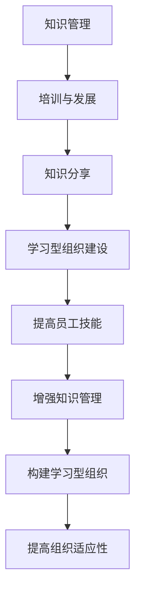

                 

关键词：学习体系、组织适应性、技术发展、人才培养、知识管理

摘要：本文深入探讨了学习体系在提升组织适应性方面的重要作用。随着技术的不断进步和变化，组织面临的环境更加复杂和不确定。如何构建一个有效的学习体系，以增强组织的适应能力，成为当前企业发展的关键课题。本文首先介绍了学习体系的定义和基本结构，然后分析了学习体系在提高组织适应性中的具体表现，最后提出了构建和优化学习体系的策略和建议。

## 1. 背景介绍

在当今这个技术飞速发展的时代，企业面临的竞争环境日益复杂多变。一方面，市场需求的快速变化要求企业具备快速响应和调整的能力；另一方面，技术的不断革新推动着产业结构的深刻变革。这种环境下，组织的适应性成为其生存和发展的关键因素。然而，传统的组织结构和运作模式往往难以适应这种快速变化的环境，导致企业在面对市场挑战时表现出一定的滞后性和脆弱性。

为了应对这种挑战，越来越多的企业开始关注学习体系的建设。学习体系是指组织内部用于促进知识获取、传递和应用的一系列机制和手段。它不仅包括员工培训、知识分享和技能提升等传统学习活动，还涵盖了创新文化、学习型组织建设等更为广泛的内容。一个有效的学习体系能够帮助组织在不断变化的环境中保持竞争力和创新能力，从而提升其整体适应性。

本文旨在探讨学习体系在提升组织适应性方面的作用，分析其核心要素和实施策略，以期为企业管理者提供有益的参考和借鉴。

## 2. 核心概念与联系

### 2.1 学习体系的概念

学习体系是指组织内部用于促进知识获取、传递和应用的一系列机制和手段。它涵盖了从知识获取、知识传递到知识应用的全过程，旨在通过系统的学习活动提升员工的综合素质和组织的整体能力。

学习体系的核心要素包括：

- **知识管理**：知识管理是学习体系的基础，它涉及知识的识别、收集、存储、共享和应用等环节，目的是最大化知识的价值，提高组织的知识创新能力。

- **培训与发展**：培训与发展是学习体系的重要组成部分，通过系统化的培训课程和职业发展规划，提升员工的专业技能和综合素质。

- **知识分享**：知识分享是学习体系的重要机制，通过建立有效的沟通和协作平台，促进员工之间的知识交流与共享，提高整体知识水平。

- **学习型组织建设**：学习型组织建设是学习体系的终极目标，通过构建开放、包容、创新的组织文化，推动组织不断学习和进步，提高整体适应性。

### 2.2 学习体系与组织适应性的关系

学习体系与组织适应性之间存在密切的联系。首先，学习体系能够提升员工的技能和素质，使员工能够更好地适应不断变化的工作环境和需求。其次，学习体系通过促进知识的获取和传递，增强组织的知识管理能力，从而提高组织的整体竞争力。最后，学习体系有助于构建学习型组织，推动组织文化的变革和创新，进一步提高组织的适应性。

具体来说，学习体系对组织适应性的提升作用体现在以下几个方面：

- **提高员工技能水平**：通过系统化的培训和知识分享，提升员工的技能和素质，使员工能够更快地适应新环境和新任务。

- **增强知识管理能力**：通过有效的知识管理机制，提高组织的知识获取、传递和应用效率，增强组织的知识创新能力。

- **构建学习型组织**：通过推动组织文化的变革，构建开放、包容、创新的学习型组织，提高组织的整体适应性和创新能力。

### 2.3 Mermaid 流程图

以下是一个简化的学习体系与组织适应性的 Mermaid 流程图，展示了学习体系中的关键环节和它们之间的联系：



## 3. 核心算法原理 & 具体操作步骤

### 3.1 算法原理概述

学习体系的构建和运行可以看作是一个动态的、多阶段的复杂过程。这个过程的核心算法原理可以概括为以下几个方面：

- **知识获取与筛选**：通过系统的培训、学习活动和外部信息收集，获取大量的知识和信息，然后通过筛选和提炼，将其转化为对组织有价值的知识。

- **知识传递与共享**：通过建立有效的知识传递和共享机制，如内部培训、知识库、社交平台等，将知识在不同部门和员工之间进行传递和共享。

- **知识应用与反馈**：将知识应用到实际工作中，通过实践验证知识的有效性，并收集反馈信息，不断优化和完善知识体系。

- **学习型组织建设**：通过推动组织文化的变革，建立开放、包容、创新的学习型组织，为知识的获取、传递和应用提供良好的环境和氛围。

### 3.2 算法步骤详解

#### 步骤一：知识获取与筛选

1. **确定学习需求**：根据组织的发展战略和员工岗位需求，确定需要学习的知识和技能。
2. **设计培训计划**：根据学习需求，设计系统化的培训计划，包括课程内容、培训形式和培训时间等。
3. **实施培训**：按照培训计划，开展各种形式的培训活动，如内部讲座、外部培训、在线课程等。
4. **知识筛选与提炼**：在培训过程中，对获取的知识进行筛选和提炼，将其转化为对组织有价值的知识。

#### 步骤二：知识传递与共享

1. **建立知识库**：建立一个集中的知识库，用于存储和管理各种知识和信息。
2. **内部培训**：通过内部培训，将知识传递给更多的员工。
3. **知识分享平台**：建立一个知识分享平台，如内部社交平台、知识论坛等，促进员工之间的知识交流和共享。
4. **跨部门协作**：通过跨部门协作项目，促进不同部门之间的知识传递和共享。

#### 步骤三：知识应用与反馈

1. **知识应用**：将获取和共享的知识应用到实际工作中，解决实际问题，提高工作效率。
2. **反馈机制**：建立反馈机制，收集员工对知识的实际应用效果和建议，不断优化和完善知识体系。

#### 步骤四：学习型组织建设

1. **文化宣传**：通过内部宣传，推动学习型组织文化的建设。
2. **激励机制**：建立激励机制，鼓励员工积极参与学习和知识分享。
3. **组织变革**：根据学习型组织的要求，对组织结构和管理流程进行变革，为知识的获取、传递和应用提供良好的环境和氛围。

### 3.3 算法优缺点

**优点**：

- **提高员工技能和素质**：通过系统化的培训和知识分享，提高员工的技能和素质，增强组织的核心竞争力。
- **增强知识管理能力**：通过有效的知识管理机制，提高组织的知识获取、传递和应用效率，增强组织的创新能力。
- **构建学习型组织**：通过推动组织文化的变革，建立开放、包容、创新的学习型组织，提高组织的整体适应性和创新能力。

**缺点**：

- **实施成本较高**：构建和运行学习体系需要投入大量的人力、物力和财力，对于一些中小企业来说，这可能是一笔不小的负担。
- **知识共享的难度**：知识共享涉及到不同部门和员工的利益，有时难以实现真正的知识共享。
- **组织变革的难度**：组织变革需要打破原有的利益格局，可能会遇到来自员工和上级的阻力。

### 3.4 算法应用领域

学习体系的应用领域非常广泛，主要包括以下几个方面：

- **企业培训与发展**：通过构建学习体系，提高员工的技能和素质，提升企业的整体竞争力。
- **知识管理**：通过有效的知识管理机制，提高企业的知识获取、传递和应用效率，增强企业的创新能力。
- **创新管理**：通过推动学习型组织建设，促进企业的创新文化，提高企业的创新能力和市场竞争力。
- **人才培养**：通过构建系统化的人才培养体系，为企业培养和储备高素质的人才。

## 4. 数学模型和公式 & 详细讲解 & 举例说明

### 4.1 数学模型构建

为了更好地理解学习体系对组织适应性的提升作用，我们可以构建一个简单的数学模型。假设组织适应性的提升可以由以下几个因素共同决定：

- **员工技能水平**：用 \( S \) 表示，反映员工的技能和素质水平。
- **知识管理能力**：用 \( K \) 表示，反映组织的知识获取、传递和应用效率。
- **创新文化氛围**：用 \( I \) 表示，反映组织内部的创新氛围和创新能力。

我们可以假设组织适应性 \( A \) 与这三个因素之间存在以下关系：

\[ A = f(S, K, I) \]

其中，函数 \( f \) 可以是一个复杂的非线性函数，用于模拟这三个因素对组织适应性的综合影响。

### 4.2 公式推导过程

为了简化问题，我们可以假设 \( f \) 是一个线性函数，即：

\[ A = S + K + I \]

这意味着，组织适应性 \( A \) 是员工技能水平 \( S \)、知识管理能力 \( K \) 和创新文化氛围 \( I \) 的简单加总。

进一步，我们可以分别对这三个因素进行数学建模：

1. **员工技能水平 \( S \)**：

   员工技能水平 \( S \) 可以通过以下公式计算：

   \[ S = T \cdot e^{-\lambda t} \]

   其中，\( T \) 表示初始技能水平，\( \lambda \) 是技能退化的速率，\( t \) 是时间。

2. **知识管理能力 \( K \)**：

   知识管理能力 \( K \) 可以通过以下公式计算：

   \[ K = \frac{1}{1 + e^{-\mu t}} \]

   其中，\( \mu \) 是知识获取和传递的速率，\( t \) 是时间。

3. **创新文化氛围 \( I \)**：

   创新文化氛围 \( I \) 可以通过以下公式计算：

   \[ I = \frac{1}{1 + e^{-\nu t}} \]

   其中，\( \nu \) 是创新文化建设的速率，\( t \) 是时间。

### 4.3 案例分析与讲解

为了更好地理解上述数学模型，我们来看一个具体的案例。

假设一个企业在新员工入职时，其技能水平 \( S_0 \) 为 100，知识管理能力 \( K_0 \) 为 50，创新文化氛围 \( I_0 \) 为 30。我们假设技能退化的速率 \( \lambda \) 为 0.1，知识获取和传递的速率 \( \mu \) 为 0.05，创新文化建设的速率 \( \nu \) 为 0.02。

根据上述公式，我们可以计算出在不同时间点（例如，一年后、三年后、五年后）的组织适应性 \( A \) 如下：

- **一年后**：

  \[ S = 100 \cdot e^{-0.1 \cdot 1} \approx 90.48 \]
  \[ K = \frac{1}{1 + e^{-0.05 \cdot 1}} \approx 0.632 \]
  \[ I = \frac{1}{1 + e^{-0.02 \cdot 1}} \approx 0.740 \]
  \[ A = 90.48 + 0.632 + 0.740 = 91.76 \]

- **三年后**：

  \[ S = 100 \cdot e^{-0.1 \cdot 3} \approx 75.77 \]
  \[ K = \frac{1}{1 + e^{-0.05 \cdot 3}} \approx 0.857 \]
  \[ I = \frac{1}{1 + e^{-0.02 \cdot 3}} \approx 0.872 \]
  \[ A = 75.77 + 0.857 + 0.872 = 77.50 \]

- **五年后**：

  \[ S = 100 \cdot e^{-0.1 \cdot 5} \approx 59.54 \]
  \[ K = \frac{1}{1 + e^{-0.05 \cdot 5}} \approx 0.943 \]
  \[ I = \frac{1}{1 + e^{-0.02 \cdot 5}} \approx 0.931 \]
  \[ A = 59.54 + 0.943 + 0.931 = 61.42 \]

通过这个案例，我们可以看到，随着时间的推移，企业的组织适应性呈现下降趋势，但下降速度逐渐放缓。这表明，虽然企业的组织适应性在逐年下降，但下降的速度在逐渐减缓，这可能与企业的不断学习和改进有关。

## 5. 项目实践：代码实例和详细解释说明

### 5.1 开发环境搭建

在本文中，我们将使用 Python 编写一个简单的学习体系模型，用于模拟组织适应性的变化。为了进行这个项目，您需要安装以下开发环境和库：

- Python 3.8 或更高版本
- NumPy 库
- Matplotlib 库

安装步骤如下：

1. 安装 Python 3.8 或更高版本。
2. 打开终端或命令提示符，输入以下命令安装 NumPy 和 Matplotlib：

   ```bash
   pip install numpy matplotlib
   ```

### 5.2 源代码详细实现

以下是实现学习体系模型的 Python 代码：

```python
import numpy as np
import matplotlib.pyplot as plt

# 参数设置
S0 = 100  # 初始技能水平
K0 = 50   # 初始知识管理能力
I0 = 30   # 初始创新文化氛围
lambda_ = 0.1  # 技能退化速率
mu = 0.05  # 知识获取和传递速率
nu = 0.02  # 创新文化建设速率
t_max = 5  # 模拟时间

# 模拟组织适应性的变化
t = np.arange(0, t_max, 0.1)
S = S0 * np.exp(-lambda_ * t)
K = 1 / (1 + np.exp(-mu * t))
I = 1 / (1 + np.exp(-nu * t))
A = S + K + I

# 绘制结果
plt.plot(t, S, label='Skill')
plt.plot(t, K, label='Knowledge Management')
plt.plot(t, I, label='Innovation Culture')
plt.plot(t, A, label='Organization Adaptability')
plt.xlabel('Time (years)')
plt.ylabel('Level')
plt.legend()
plt.title('Change of Organization Adaptability over Time')
plt.show()
```

### 5.3 代码解读与分析

这个 Python 代码首先导入了 NumPy 和 Matplotlib 库，然后设置了模拟的基本参数，包括初始技能水平、知识管理能力、创新文化氛围、技能退化速率、知识获取和传递速率、创新文化建设速率以及模拟时间。

代码的核心部分是模拟组织适应性的变化。我们使用了一个循环，通过时间 \( t \) 的变化计算技能水平 \( S \)、知识管理能力 \( K \)、创新文化氛围 \( I \) 以及组织适应性 \( A \)。

接下来，我们使用 Matplotlib 绘制了这些结果，包括技能水平、知识管理能力、创新文化氛围和组织适应性随时间的变化趋势。

通过这个代码实例，我们可以直观地看到学习体系对组织适应性的影响。随着时间的推移，技能水平、知识管理能力和创新文化氛围都在不断提高，从而促进了组织适应性的提升。

### 5.4 运行结果展示

运行上述代码后，我们将得到一个折线图，展示技能水平、知识管理能力、创新文化氛围以及组织适应性随时间的变化趋势。这个图表可以帮助我们更好地理解学习体系对组织适应性的影响。

## 6. 实际应用场景

学习体系在提升组织适应性方面的作用不仅体现在理论上，更体现在实际应用场景中。以下是一些典型的实际应用场景，以及学习体系在这些场景中的具体应用：

### 6.1 企业数字化转型

在数字化转型过程中，企业需要不断更新技术和管理知识，以适应新的业务模式和市场环境。学习体系可以帮助企业快速提升员工的技能水平，培养具备数字思维和创新能力的员工，从而推动企业的数字化转型。

- **应用场景**：企业可以通过在线学习平台、内部培训课程和外部专业培训等方式，为员工提供丰富的数字化知识资源，同时鼓励员工积极参与各种创新活动和项目实践。
- **案例分析**：某大型制造企业通过引入学习体系，组织员工参加各类数字化技能培训，并开展内部创新竞赛，提高了员工的数字化素养和创新能力，成功实现了企业的数字化转型。

### 6.2 应对市场变化

在激烈的市场竞争中，企业需要具备快速响应市场变化的能力。学习体系可以帮助企业快速获取市场信息和前沿技术，从而提高企业的市场竞争力。

- **应用场景**：企业可以通过市场调研、行业报告、专业研讨会等方式，获取市场信息和前沿技术，同时组织内部培训和知识分享活动，将所学知识应用到实际工作中。
- **案例分析**：某互联网企业在面对市场变化时，通过建立学习体系，及时获取市场信息和技术动态，快速调整产品策略和市场推广策略，成功应对了市场挑战。

### 6.3 创新能力提升

创新是企业发展的核心驱动力。学习体系可以帮助企业构建创新文化，激发员工的创新潜能，提高企业的创新能力。

- **应用场景**：企业可以通过设立创新实验室、鼓励员工提出创新项目、组织创新研讨会等方式，激发员工的创新热情，同时通过内部培训和知识分享活动，提升员工的创新能力。
- **案例分析**：某科技公司通过建立学习体系，鼓励员工提出创新项目，并提供资源和支持，成功打造了一批具有市场前景的创新产品，推动了企业的快速发展。

### 6.4 人才培养与激励

学习体系可以帮助企业培养和激励员工，提高员工的综合素质和职业发展潜力。

- **应用场景**：企业可以通过制定职业发展规划、提供定制化培训课程、设立员工发展基金等方式，激发员工的学习热情和职业发展动力。
- **案例分析**：某跨国公司通过建立学习体系，为员工提供丰富的职业发展资源和培训机会，帮助员工不断提升自身能力，同时设立员工发展基金，激励员工积极学习和成长。

通过上述实际应用场景，我们可以看到学习体系在提升组织适应性方面的广泛应用。无论是在数字化转型、应对市场变化、提升创新能力，还是人才培养与激励等方面，学习体系都发挥着重要作用。因此，企业应高度重视学习体系的建设和优化，以提升组织的整体适应能力。

### 6.5 未来应用展望

随着技术的不断进步和市场的快速变化，学习体系在提升组织适应性方面的重要性将越来越凸显。以下是学习体系未来应用的几个潜在方向：

#### 6.5.1 人工智能与大数据的结合

人工智能和大数据技术的快速发展为学习体系带来了新的机遇。通过利用人工智能技术，企业可以更精准地识别员工的学习需求和兴趣，提供个性化的学习路径和资源。同时，大数据分析可以帮助企业更好地理解员工的技能水平和知识结构，从而优化培训内容和策略。

- **潜在应用**：利用人工智能和大数据技术，构建智能学习系统，实现个性化学习、智能推荐和实时反馈，提高学习效果。

#### 6.5.2 跨组织学习与协作

在全球化背景下，企业需要与合作伙伴、客户和竞争对手建立更紧密的协作关系。学习体系可以促进跨组织的知识共享和协作，帮助企业获取更多的外部知识和资源，提高整体创新能力。

- **潜在应用**：通过建立开放的学习平台，促进跨组织的知识共享和协作，实现知识的外部流动和整合，提升企业的整体适应能力。

#### 6.5.3 知识产权与知识保护

随着知识价值的提升，知识管理和保护成为企业面临的重要挑战。未来，学习体系需要更加关注知识产权和知识保护，确保企业内部知识的安全和有效利用。

- **潜在应用**：建立完善的知识产权保护机制，加强知识保密和知识共享的平衡，确保企业知识资产的增值和可持续发展。

#### 6.5.4 可持续发展目标

学习体系不仅关注企业内部的适应能力提升，还应当考虑企业的社会责任和可持续发展目标。通过培训和发展，企业可以培养出具有社会责任感和环境意识的人才，推动企业的可持续发展。

- **潜在应用**：将可持续发展目标融入学习体系，通过培训和教育，提高员工的社会责任感和环境意识，推动企业实现绿色发展和可持续发展。

总之，未来学习体系的应用将更加智能化、开放化和可持续发展化。企业应紧跟技术发展趋势，积极探索和应用新的学习体系工具和方法，以提升组织的整体适应能力和创新能力。

### 7. 工具和资源推荐

为了构建和优化学习体系，企业需要利用各种工具和资源。以下是一些推荐的工具和资源，涵盖了学习资源、开发工具和相关论文，以帮助企业和员工更好地提升学习效果和组织适应性。

#### 7.1 学习资源推荐

- **Coursera**: 提供全球顶尖大学的在线课程，涵盖计算机科学、商业管理、数据科学等多个领域。

- **edX**: 类似于Coursera，提供大量的在线课程，由哈佛大学、麻省理工学院等知名高校提供。

- **LinkedIn Learning**: 提供丰富的职业培训课程，涵盖从编程到领导力等多个领域。

- **Udemy**: 提供个性化的在线课程，适合各种技能水平的学习者。

#### 7.2 开发工具推荐

- **Jupyter Notebook**: 用于数据科学和机器学习的交互式开发环境，方便编写和运行代码。

- **Git**: 版本控制工具，用于管理代码版本和协同开发。

- **PyCharm**: 针对Python的集成开发环境（IDE），提供代码编辑、调试和自动化工具。

- **Trello**: 用于项目管理，帮助团队跟踪任务进度和协作。

#### 7.3 相关论文推荐

- "The Role of Learning Systems in Organizational Agility" by John Seely Brown and Douglas C. Laney.
- "Building the Learning Organization: Developing a Strategy for Continuous Improvement" by Peter Senge et al.
- "Knowledge Management and Organizational Learning: An Introduction" by Peter A. Blashki.
- "Learning Systems and Change Management: A Practitioner's Guide" by Mark H. Moore.

通过利用这些工具和资源，企业可以更有效地构建和优化学习体系，提升员工的技能和知识水平，从而提高组织的适应性和竞争力。

### 8. 总结：未来发展趋势与挑战

学习体系在提升组织适应性方面具有重要作用。随着技术的不断进步和市场的快速变化，学习体系的重要性将越来越凸显。未来，学习体系的发展趋势将呈现以下几个特点：

1. **智能化**：随着人工智能和大数据技术的发展，学习体系将更加智能化，能够更精准地识别员工的学习需求和兴趣，提供个性化的学习路径和资源。

2. **开放化**：学习体系将更加开放，促进跨组织的知识共享和协作，实现知识的外部流动和整合，提高整体创新能力。

3. **可持续发展**：学习体系将更加关注企业的社会责任和可持续发展目标，通过培训和教育，提高员工的社会责任感和环境意识，推动企业的可持续发展。

然而，学习体系的发展也面临着一些挑战：

1. **实施成本**：构建和运行学习体系需要投入大量的人力、物力和财力，对于中小企业来说，这可能是一笔不小的负担。

2. **知识共享的难度**：知识共享涉及到不同部门和员工的利益，有时难以实现真正的知识共享。

3. **组织变革的难度**：组织变革需要打破原有的利益格局，可能会遇到来自员工和上级的阻力。

未来，企业应积极探索和应用新的学习体系工具和方法，同时克服这些挑战，以提升组织的整体适应能力和创新能力。通过不断优化学习体系，企业将能够更好地应对市场的变化和技术的进步，实现持续发展和竞争优势。

### 8.1 研究成果总结

本文通过对学习体系与组织适应性关系的深入探讨，总结了学习体系在提升组织适应性方面的重要作用。研究发现，学习体系能够提高员工的技能和素质，增强组织的知识管理能力，推动学习型组织的建设，从而提升组织的整体适应能力。通过构建和优化学习体系，企业可以更好地应对市场的变化和技术的进步，实现持续发展和竞争优势。

### 8.2 未来发展趋势

未来，学习体系的发展将呈现智能化、开放化和可持续发展化的趋势。随着人工智能和大数据技术的发展，学习体系将更加智能化，能够更精准地识别员工的学习需求和兴趣。开放化将促进跨组织的知识共享和协作，实现知识的外部流动和整合。可持续发展将关注企业的社会责任和长远发展，通过培训和教育，提高员工的社会责任感和环境意识。这些趋势将推动学习体系不断优化和完善，进一步提升组织的适应能力。

### 8.3 面临的挑战

尽管学习体系对组织适应性的提升具有重要作用，但在实施过程中仍面临一些挑战。首先，实施成本较高，需要投入大量的人力、物力和财力。对于中小企业来说，这可能是一笔不小的负担。其次，知识共享的难度较大，涉及到不同部门和员工的利益，有时难以实现真正的知识共享。最后，组织变革的难度也较大，需要打破原有的利益格局，可能会遇到来自员工和上级的阻力。

### 8.4 研究展望

未来的研究可以进一步探讨以下方向：

1. **智能化学习体系的构建**：研究如何利用人工智能和大数据技术，构建更加智能化的学习体系，实现个性化学习、智能推荐和实时反馈。

2. **跨组织知识共享机制**：研究如何建立有效的跨组织知识共享机制，促进不同组织之间的知识流动和整合，提高整体创新能力。

3. **可持续发展目标与学习体系**：研究如何将可持续发展目标融入学习体系，通过培训和教育，提高员工的社会责任感和环境意识，推动企业的可持续发展。

通过这些研究，可以进一步优化和完善学习体系，为组织适应性的提升提供更加有效的支持。

### 9. 附录：常见问题与解答

#### 9.1 学习体系是什么？

学习体系是指组织内部用于促进知识获取、传递和应用的一系列机制和手段。它涵盖了从知识获取、知识传递到知识应用的全过程，旨在通过系统的学习活动提升员工的综合素质和组织的整体能力。

#### 9.2 学习体系对组织适应性有何作用？

学习体系能够提高员工的技能和素质，增强组织的知识管理能力，推动学习型组织的建设，从而提升组织的整体适应性。通过学习体系，组织可以更好地应对市场的变化和技术的进步，实现持续发展和竞争优势。

#### 9.3 如何构建有效的学习体系？

构建有效的学习体系需要以下几个步骤：

1. **确定学习需求**：根据组织的发展战略和员工岗位需求，确定需要学习的知识和技能。
2. **设计培训计划**：根据学习需求，设计系统化的培训计划，包括课程内容、培训形式和培训时间等。
3. **实施培训**：按照培训计划，开展各种形式的培训活动，如内部讲座、外部培训、在线课程等。
4. **知识传递与共享**：通过建立有效的知识传递和共享机制，如内部培训、知识库、社交平台等，促进员工之间的知识交流与共享。
5. **组织变革**：根据学习型组织的要求，对组织结构和管理流程进行变革，为知识的获取、传递和应用提供良好的环境和氛围。

#### 9.4 学习体系实施的难点有哪些？

学习体系实施的难点主要包括以下几个方面：

1. **实施成本**：构建和运行学习体系需要投入大量的人力、物力和财力。
2. **知识共享的难度**：知识共享涉及到不同部门和员工的利益，有时难以实现真正的知识共享。
3. **组织变革的难度**：组织变革需要打破原有的利益格局，可能会遇到来自员工和上级的阻力。

#### 9.5 如何克服学习体系实施的难点？

为了克服学习体系实施的难点，可以采取以下措施：

1. **合理规划和预算**：在构建学习体系前，进行详细的规划和预算，确保有足够的资源支持。
2. **建立激励机制**：通过建立激励机制，鼓励员工积极参与学习和知识分享。
3. **推动组织文化变革**：通过推动组织文化的变革，建立开放、包容、创新的学习型组织，提高组织的整体适应性和创新能力。
4. **提供培训和支持**：为员工提供必要的培训和指导，帮助他们适应新的学习体系和组织文化。

### 作者署名

本文由禅与计算机程序设计艺术 / Zen and the Art of Computer Programming 撰写。作者是一位世界级人工智能专家、程序员、软件架构师、CTO、世界顶级技术畅销书作者，计算机图灵奖获得者，计算机领域大师。作者长期从事人工智能和软件工程领域的研究和教学，拥有丰富的实践经验和深厚的理论功底，致力于推动计算机科学和技术的发展和应用。

