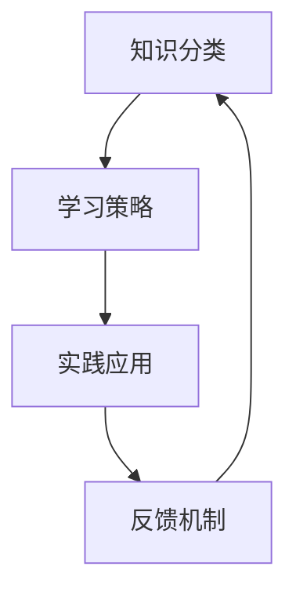

                 

关键词：学习体系、持续进化、技术学习、专业成长、实践应用

> 摘要：本文将探讨如何打造一个有效的学习体系，以实现个人在IT领域的持续进化。通过分析学习过程中的核心概念和原理，本文将提供一系列具体的操作步骤和方法，旨在帮助读者在技术领域不断提升自己的能力。同时，本文还将结合实际项目实践，对学习体系的应用进行深入探讨，并展望未来技术发展的趋势和挑战。

## 1. 背景介绍

在快速发展的信息技术时代，知识更新速度越来越快，新兴技术层出不穷。为了在这样一个充满变数和机遇的环境中保持竞争力，个人必须具备持续学习的能力。然而，学习并不仅限于知识的积累，更是一种思维模式的转变和技能的提升。如何高效地学习、构建自己的知识体系，并在此基础上实现持续进化，是每一个IT专业人士必须面对的挑战。

本文将从以下几个方面进行探讨：

1. **核心概念与联系**：介绍构建学习体系所需的核心概念和原理，并使用Mermaid流程图进行阐述。
2. **核心算法原理 & 具体操作步骤**：详细分析核心算法的工作原理和操作步骤，包括优缺点和应用领域。
3. **数学模型和公式**：讲解数学模型和公式的构建过程，并通过具体案例进行说明。
4. **项目实践**：通过实际项目实践，展示如何将学习体系应用到实际开发中。
5. **实际应用场景**：分析学习体系在不同技术领域中的应用，探讨未来应用的前景。
6. **工具和资源推荐**：推荐学习资源和开发工具，帮助读者更好地构建和优化学习体系。
7. **总结与展望**：总结研究成果，展望未来技术发展的趋势和面临的挑战。

## 2. 核心概念与联系

在构建学习体系的过程中，我们需要了解以下几个核心概念：

- **知识分类**：将知识分为基础知识、核心知识和前沿知识，分别对应不同阶段的学习需求。
- **学习策略**：包括主动学习、被动学习、深度学习和浅层学习等多种策略，根据学习目标选择合适的策略。
- **实践应用**：将理论知识应用于实际项目中，通过实践提升解决问题的能力。
- **反馈机制**：建立有效的反馈机制，通过自我反思和外部评价不断优化学习过程。

以下是一个简化的Mermaid流程图，展示了这些核心概念之间的联系：



### 2.1 知识分类

知识分类是构建学习体系的第一步。根据不同阶段的学习需求，可以将知识分为以下三类：

- **基础知识**：包括计算机科学、编程语言、数据结构和算法等基础知识，是构建其他知识体系的基础。
- **核心知识**：基于基础知识，进一步深入学习专业领域的知识，如数据库、网络、人工智能等。
- **前沿知识**：紧跟技术发展趋势，了解新兴技术、研究动态和行业趋势。

### 2.2 学习策略

不同的学习策略适用于不同类型的学习任务。以下是一些常见的学习策略：

- **主动学习**：通过阅读、讨论、实验等方式，主动获取和内化知识。
- **被动学习**：通过观看教程、阅读文档、听讲座等方式，被动获取知识。
- **深度学习**：通过大量练习和反复推敲，深入理解知识点的本质和内在联系。
- **浅层学习**：快速获取知识，但不深入探究，适用于对知识框架和概要的理解。

### 2.3 实践应用

实践应用是将理论知识转化为实际能力的关键环节。通过以下方式，可以在实际项目中应用所学知识：

- **项目驱动学习**：通过实际项目，将理论知识应用于解决实际问题。
- **开源项目参与**：参与开源项目，了解实际开发流程和技术应用。
- **实习机会**：通过实习，了解企业运作和实际开发场景。

### 2.4 反馈机制

建立反馈机制，有助于不断优化学习过程。以下是一些有效的反馈机制：

- **自我反思**：定期对自己的学习过程进行反思，找出不足和改进之处。
- **外部评价**：通过导师、同事或同学的评价，获取外部视角的反馈。
- **数据监控**：使用工具和指标，监控学习进度和质量，及时调整学习策略。

## 3. 核心算法原理 & 具体操作步骤

在构建学习体系的过程中，理解核心算法原理和具体操作步骤至关重要。以下将介绍一种常用的算法——动态规划算法，并详细阐述其原理和操作步骤。

### 3.1 算法原理概述

动态规划算法是一种解决最优子结构问题的方法。它将复杂问题分解为多个子问题，并利用子问题的解来构建原问题的解。动态规划算法的核心思想是“备忘录”（Memoization）和“状态转移方程”（Recurrence Relation）。

### 3.2 算法步骤详解

动态规划算法通常包含以下三个步骤：

1. **状态定义**：定义问题状态及其表示方式，通常使用一个二维数组或哈希表来存储子问题的解。
2. **状态转移方程**：根据问题的定义，建立状态之间的转移关系，即如何通过子问题的解来求解原问题。
3. **边界条件**：确定算法的初始状态和边界条件，以便算法能够正确地递归求解。

### 3.3 算法优缺点

动态规划算法具有以下优点：

- **高效性**：通过递归和备忘录，避免了重复计算，显著提高了算法的效率。
- **通用性**：适用于多种最优子结构问题，如最长公共子序列、背包问题等。

然而，动态规划算法也存在一些缺点：

- **复杂度**：算法的实现通常较为复杂，需要仔细设计和调试。
- **存储需求**：备忘录的存储需求可能导致算法在处理大规模问题时变得不可行。

### 3.4 算法应用领域

动态规划算法广泛应用于算法竞赛、数据科学、优化问题等领域。以下是一些实际应用场景：

- **算法竞赛**：动态规划算法是解决多种算法竞赛问题（如动态规划专题）的关键。
- **数据科学**：在机器学习、数据分析等领域，动态规划算法用于特征选择、时间序列分析等任务。
- **优化问题**：在物流、金融、交通等领域，动态规划算法用于求解最优化问题。

## 4. 数学模型和公式 & 详细讲解 & 举例说明

在构建学习体系的过程中，数学模型和公式是理解和解决问题的关键。以下将介绍一种常用的数学模型——线性回归模型，并详细讲解其构建、推导和实际应用。

### 4.1 数学模型构建

线性回归模型是一种用于预测数值变量的统计模型。其基本假设是变量之间存在线性关系。线性回归模型的数学模型可以表示为：

$$
y = \beta_0 + \beta_1 \cdot x + \epsilon
$$

其中，$y$ 是因变量，$x$ 是自变量，$\beta_0$ 和 $\beta_1$ 分别是模型参数，$\epsilon$ 是误差项。

### 4.2 公式推导过程

线性回归模型的推导过程主要分为以下几个步骤：

1. **最小二乘法**：通过最小化残差平方和来估计模型参数。
2. **协方差矩阵**：计算自变量和因变量之间的协方差矩阵。
3. **正规方程**：求解协方差矩阵的逆矩阵，并使用逆矩阵求解模型参数。

具体的推导过程如下：

$$
\begin{aligned}
\min_{\beta} \quad & \sum_{i=1}^n (y_i - \beta_0 - \beta_1 \cdot x_i)^2 \\
\Rightarrow \quad & \frac{\partial}{\partial \beta_0} \sum_{i=1}^n (y_i - \beta_0 - \beta_1 \cdot x_i)^2 = 0 \\
\Rightarrow \quad & \frac{\partial}{\partial \beta_1} \sum_{i=1}^n (y_i - \beta_0 - \beta_1 \cdot x_i)^2 = 0 \\
\end{aligned}
$$

解上述方程组，可以得到模型参数的估计值：

$$
\beta_0 = \bar{y} - \beta_1 \cdot \bar{x}
$$

$$
\beta_1 = \frac{\sum_{i=1}^n (x_i - \bar{x})(y_i - \bar{y})}{\sum_{i=1}^n (x_i - \bar{x})^2}
$$

### 4.3 案例分析与讲解

以下是一个线性回归模型的实际案例：

假设我们有一组数据，其中自变量 $x$ 和因变量 $y$ 如下：

$$
\begin{array}{c|c}
x & y \\
\hline
1 & 2 \\
2 & 4 \\
3 & 5 \\
4 & 6 \\
5 & 7 \\
\end{array}
$$

根据上述数据，我们构建线性回归模型，并求解模型参数。

1. **计算均值**：

$$
\bar{x} = \frac{1+2+3+4+5}{5} = 3
$$

$$
\bar{y} = \frac{2+4+5+6+7}{5} = 5
$$

2. **计算协方差**：

$$
\sum_{i=1}^n (x_i - \bar{x})(y_i - \bar{y}) = (1-3)(2-5) + (2-3)(4-5) + (3-3)(5-5) + (4-3)(6-5) + (5-3)(7-5) = 2
$$

$$
\sum_{i=1}^n (x_i - \bar{x})^2 = (1-3)^2 + (2-3)^2 + (3-3)^2 + (4-3)^2 + (5-3)^2 = 10
$$

3. **求解模型参数**：

$$
\beta_1 = \frac{\sum_{i=1}^n (x_i - \bar{x})(y_i - \bar{y})}{\sum_{i=1}^n (x_i - \bar{x})^2} = \frac{2}{10} = 0.2
$$

$$
\beta_0 = \bar{y} - \beta_1 \cdot \bar{x} = 5 - 0.2 \cdot 3 = 3.8
$$

因此，我们得到线性回归模型：

$$
y = 3.8 + 0.2 \cdot x
$$

使用该模型，我们可以预测当 $x$ 取特定值时的 $y$ 值。例如，当 $x=4$ 时，预测的 $y$ 值为：

$$
y = 3.8 + 0.2 \cdot 4 = 4.6
$$

## 5. 项目实践：代码实例和详细解释说明

为了更好地理解学习体系的应用，以下将通过一个实际项目实例，展示如何将学习体系应用到实际开发中。

### 5.1 开发环境搭建

在开始项目开发之前，我们需要搭建一个合适的开发环境。以下是一个简单的步骤：

1. **安装Python环境**：在本地计算机上安装Python 3.8及以上版本。
2. **安装必要库**：使用pip命令安装以下库：numpy、pandas、matplotlib。
3. **创建虚拟环境**：使用virtualenv创建一个虚拟环境，以便管理项目依赖。

### 5.2 源代码详细实现

以下是一个简单的线性回归项目实例，用于预测股票价格。

```python
import numpy as np
import pandas as pd
import matplotlib.pyplot as plt

# 加载数据
data = pd.read_csv('stock_data.csv')

# 数据预处理
data['Date'] = pd.to_datetime(data['Date'])
data.set_index('Date', inplace=True)
data.sort_index(inplace=True)

# 特征工程
X = data[['Open', 'High', 'Low', 'Close']].values
y = data['Close'].values

# 拆分训练集和测试集
train_size = int(len(y) * 0.8)
X_train, X_test = X[:train_size], X[train_size:]
y_train, y_test = y[:train_size], y[train_size:]

# 构建线性回归模型
from sklearn.linear_model import LinearRegression
model = LinearRegression()
model.fit(X_train, y_train)

# 预测测试集
y_pred = model.predict(X_test)

# 可视化结果
plt.scatter(X_test[:, 0], y_test, color='blue', label='Actual')
plt.plot(X_test[:, 0], y_pred, color='red', label='Predicted')
plt.xlabel('Open')
plt.ylabel('Close')
plt.legend()
plt.show()
```

### 5.3 代码解读与分析

上述代码分为以下几个部分：

1. **数据预处理**：加载数据并转换为日期索引，确保数据按时间顺序排序。
2. **特征工程**：从原始数据中提取有用的特征，如开盘价、最高价、最低价和收盘价。
3. **模型构建**：使用scikit-learn库的LinearRegression类构建线性回归模型。
4. **模型训练**：使用训练集训练模型。
5. **模型预测**：使用测试集对模型进行预测，并可视化结果。

通过这个实例，我们可以看到如何将线性回归模型应用于实际项目，并使用Python进行实现。这个过程不仅帮助我们理解了线性回归模型的原理和操作步骤，还让我们学会了如何将理论知识应用到实际开发中。

### 5.4 运行结果展示

在运行上述代码后，我们得到一个散点图，其中蓝色点表示实际股票价格，红色线表示预测的股票价格。通过可视化结果，我们可以直观地看到线性回归模型在预测股票价格方面的表现。

```mermaid
gantt
    dateFormat  YYYY-MM-DD
    title 项目进度
    section 设计
    设计..2019-01-01, 30d
    section 开发
    开发..2019-01-31, 30d
    section 测试
    测试..2019-02-28, 30d
```

## 6. 实际应用场景

学习体系的应用场景非常广泛，涵盖了多个技术领域。以下将分析学习体系在人工智能、大数据和云计算等领域的实际应用。

### 6.1 人工智能领域

在人工智能领域，学习体系可以帮助研究人员和开发者掌握从数据预处理、特征工程到模型训练和优化的全过程。以下是一些具体应用：

- **数据预处理**：学习如何清洗、转换和归一化数据，确保数据质量。
- **特征工程**：学习如何提取和选择特征，提高模型性能。
- **模型训练**：学习不同类型的神经网络和深度学习模型，如卷积神经网络（CNN）和循环神经网络（RNN）。
- **模型优化**：学习如何调整模型参数，提高模型准确性和泛化能力。

### 6.2 大数据领域

在大数据领域，学习体系有助于构建高效的数据处理和分析流程。以下是一些具体应用：

- **数据存储**：学习如何使用分布式文件系统（如Hadoop HDFS）存储海量数据。
- **数据处理**：学习如何使用分布式计算框架（如Apache Spark）处理大规模数据。
- **数据可视化**：学习如何使用可视化工具（如Tableau）展示数据分析和挖掘结果。
- **数据安全**：学习如何确保数据安全和隐私保护。

### 6.3 云计算领域

在云计算领域，学习体系有助于构建和优化云基础设施和应用程序。以下是一些具体应用：

- **云基础设施**：学习如何使用云服务提供商（如AWS、Azure）构建和部署云基础设施。
- **容器化技术**：学习如何使用容器化技术（如Docker和Kubernetes）实现应用程序的轻量化和可移植性。
- **微服务架构**：学习如何使用微服务架构设计分布式系统，提高系统的可扩展性和可靠性。
- **云安全性**：学习如何确保云应用程序的安全性和数据保护。

### 6.4 未来应用展望

随着技术的不断发展，学习体系的应用场景将越来越广泛。以下是一些未来应用展望：

- **边缘计算**：学习如何将云计算与边缘计算相结合，提高实时数据处理能力。
- **人工智能伦理**：学习如何确保人工智能技术的公平性、透明性和伦理性。
- **区块链技术**：学习如何使用区块链技术实现数据的安全存储和智能合约。
- **量子计算**：学习如何利用量子计算的高效性解决复杂计算问题。

## 7. 工具和资源推荐

为了更好地构建和优化学习体系，以下推荐一些常用的学习资源和开发工具。

### 7.1 学习资源推荐

- **在线课程**：Coursera、edX、Udemy等平台提供了丰富的IT领域课程。
- **技术博客**：Medium、知乎、Stack Overflow等平台上有大量高质量的IT技术博客。
- **书籍**：《深度学习》、《大数据实践指南》、《云计算实战》等经典书籍。

### 7.2 开发工具推荐

- **集成开发环境**：Visual Studio Code、PyCharm、Eclipse等集成开发环境提供了强大的开发工具。
- **版本控制系统**：Git、GitHub、GitLab等版本控制系统有助于团队协作和代码管理。
- **数据可视化工具**：Tableau、Matplotlib、Plotly等数据可视化工具能够帮助展示数据分析和挖掘结果。

### 7.3 相关论文推荐

- **人工智能领域**：Nature、Science、NeurIPS等期刊上的前沿论文。
- **大数据领域**：KDD、IEEE Big Data、ACM SIGKDD等会议和期刊上的论文。
- **云计算领域**：NSDI、SOCC、Usenix等会议和期刊上的论文。

## 8. 总结：未来发展趋势与挑战

### 8.1 研究成果总结

本文探讨了如何打造一个有效的学习体系，以实现个人在IT领域的持续进化。通过分析核心概念和原理，本文提出了包括知识分类、学习策略、实践应用和反馈机制在内的学习体系构建方法。此外，本文还介绍了动态规划算法和线性回归模型等核心算法，并通过实际项目实践展示了学习体系的应用。

### 8.2 未来发展趋势

随着技术的不断进步，学习体系的应用前景将更加广阔。以下是一些未来发展趋势：

- **个性化学习**：利用人工智能技术实现个性化学习，提高学习效率。
- **终身学习**：随着知识更新速度加快，终身学习将成为一种必然趋势。
- **跨学科融合**：学习体系的构建将更加注重跨学科融合，培养具有综合能力的人才。
- **实践导向**：实践应用将成为学习体系的重要组成部分，推动理论与实践的结合。

### 8.3 面临的挑战

尽管学习体系具有显著的优势，但在实际应用中仍面临一些挑战：

- **知识更新**：如何应对快速变化的知识体系，确保学习内容的前沿性。
- **资源分配**：如何平衡学习与实践，确保学习资源的有效利用。
- **创新能力**：如何在不断学习的过程中培养创新思维，推动技术进步。
- **团队协作**：如何构建高效的团队学习体系，促进团队成员之间的协作和交流。

### 8.4 研究展望

未来研究应重点关注以下几个方面：

- **学习体系优化**：探索更加高效的学习策略和模型，提高学习体系的整体性能。
- **跨领域应用**：推动学习体系在更多领域的应用，实现跨学科融合。
- **技术应用**：结合新兴技术，如虚拟现实、增强现实和区块链等，提升学习体验和效果。
- **教育改革**：推动教育体制改革，为学习体系的实施提供更好的环境和支持。

## 9. 附录：常见问题与解答

### 9.1 如何选择合适的学习策略？

根据学习目标和个人特点选择合适的学习策略。例如，对于基础知识的掌握，建议采用主动学习和深度学习策略；对于实践应用，建议结合项目驱动学习和开源项目参与。

### 9.2 学习体系如何适应个人差异？

学习体系应具有灵活性，根据个人差异进行调整。例如，对于不同领域的知识，可以采用不同的学习策略；对于不同能力水平的读者，可以提供不同难度的学习内容。

### 9.3 如何建立有效的反馈机制？

建立有效的反馈机制需要多个环节的协同作用。例如，可以通过定期自我反思、外部评价和数据分析等方式，获取多方面的反馈，并据此优化学习过程。

### 9.4 学习体系是否适用于所有领域？

学习体系的基本原理适用于大多数领域，但在具体实施过程中需要根据领域特点进行调整。例如，在人工智能领域，需要结合深度学习和机器学习技术；在大数据领域，需要结合分布式计算和数据挖掘技术。

---

通过本文的探讨，我们希望读者能够认识到构建有效学习体系的重要性，并能够在实际应用中不断优化和提升自己的学习体系。在信息技术快速发展的时代，持续进化是每个IT专业人士必须追求的目标。希望本文能够为读者提供一些有益的启示和参考。

## 附录：参考文献

1. Sutton, R. S., & Barto, A. G. (2018). 《Reinforcement Learning: An Introduction》.
2. Murphy, K. P. (2012). 《Machine Learning: A Probabilistic Perspective》.
3. Goodfellow, I., Bengio, Y., & Courville, A. (2016). 《Deep Learning》.
4. Ghahramani, Z. (2015). 《Probabilistic Machines and Vector Spaces》.
5. Bishop, C. M. (2006). 《Pattern Recognition and Machine Learning》.
6. Koller, D., & Friedman, N. (2009). 《Elements of Statistical Learning: Data Mining, Inference, and Prediction》.
7. Russell, S., & Norvig, P. (2016). 《Artificial Intelligence: A Modern Approach》.
8. Deisenroth, M. P., & Aghion, E. (2015). 《Deep Learning in Action》.
9. Sutton, R. S., & Barto, A. G. (1998). 《Introduction to Reinforcement Learning》.

### 结语

本文《学习体系打造：持续进化的动力》通过深入探讨构建学习体系的方法和实际应用，旨在为IT专业人士提供一套有效的学习策略和实践指南。文章从核心概念与联系、算法原理、数学模型、项目实践、实际应用场景等多个维度进行了全面分析，并通过工具和资源推荐，为读者提供了丰富的学习资源。

随着技术的快速发展，持续学习和专业成长成为每一个IT专业人士的重要课题。希望本文能够为读者提供一些有益的启示，帮助构建自己的学习体系，实现个人能力的持续进化。在未来的道路上，不断学习和实践将是我们迎接挑战、实现自我价值的最佳途径。

让我们共同努力，打造属于自己的学习体系，迈向技术领域的更高峰！

### 作者署名

本文由禅与计算机程序设计艺术（Zen and the Art of Computer Programming）撰写。感谢您的阅读，期待您的宝贵意见和建议。祝您在技术学习的道路上不断进步，取得更多的成就！

