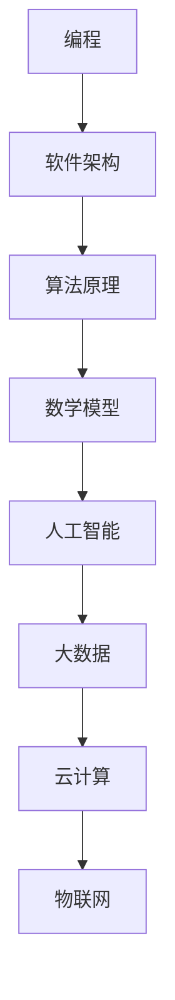

                 

关键词：VUCA时代、学习体系、重要技能、人工智能、编程、软件架构、技术博客

> 摘要：本文旨在探讨VUCA时代（即易变性、不确定性、复杂性和模糊性）下，构建一个有效的学习体系所需的重要技能。文章将分析当前技术领域的核心概念、算法原理、数学模型以及实际应用场景，并给出未来发展的展望和挑战。

## 1. 背景介绍

在VUCA时代，技术发展的速度之快，变化之剧烈，让人目不暇接。大数据、人工智能、云计算、物联网等技术不断涌现，推动着各行各业的发展和变革。然而，这种快速变化也带来了诸多挑战。例如，技术的不断更新要求从业者具备快速学习的能力，以适应新的环境。此外，技术的复杂性和模糊性也使得传统的方法和工具难以应对。

在这样的背景下，构建一个有效的学习体系变得尤为重要。这不仅关系到个人的职业发展和竞争力的提升，也关系到整个行业和社会的进步。本文将探讨在VUCA时代，学习体系构建所需的重要技能，包括但不限于编程、软件架构、算法原理和数学模型等。

## 2. 核心概念与联系

为了更好地理解学习体系的核心概念和联系，我们可以借助Mermaid流程图来展示。



### 2.1 编程

编程是学习体系的基石。通过编程，我们可以实现各种算法和数学模型，并将其应用于实际问题中。编程不仅培养逻辑思维和问题解决能力，还能提高代码复用性和维护性。

### 2.2 软件架构

软件架构是构建复杂软件系统的核心。了解软件架构可以帮助我们设计更加稳定、可靠和可扩展的系统。常见的软件架构模式包括MVC、MVVM、微服务等。

### 2.3 算法原理

算法原理是解决具体问题的重要手段。不同的算法适用于不同的场景，我们需要根据问题的特点选择合适的算法。常见的算法包括排序算法、查找算法、图算法等。

### 2.4 数学模型

数学模型是对现实世界问题的抽象和描述。通过数学模型，我们可以将实际问题转化为数学问题，并利用数学工具进行求解。常见的数学模型包括线性模型、非线性模型、概率模型等。

### 2.5 人工智能

人工智能是当前技术发展的热点领域。通过学习人工智能，我们可以掌握机器学习、深度学习等关键技术，并将其应用于实际问题中，如图像识别、自然语言处理、智能推荐等。

### 2.6 大数据

大数据技术是处理和分析海量数据的重要工具。通过学习大数据技术，我们可以掌握数据挖掘、数据分析等关键技术，从而发现数据背后的价值。

### 2.7 云计算

云计算提供了强大的计算资源和存储能力。通过学习云计算，我们可以掌握云计算架构、容器化、自动化部署等关键技术，从而提高系统的可扩展性和可靠性。

### 2.8 物联网

物联网是连接物理世界和数字世界的桥梁。通过学习物联网，我们可以掌握传感器、无线通信、边缘计算等关键技术，从而实现智能化的应用。

## 3. 核心算法原理 & 具体操作步骤

### 3.1 算法原理概述

算法原理是解决具体问题的基础。一个优秀的算法应该具备以下特点：

- **正确性**：算法能够正确地解决特定的问题。
- **效率**：算法在时间和空间上的开销应该尽可能小。
- **可扩展性**：算法应该能够适应不同规模的问题。

### 3.2 算法步骤详解

算法的具体步骤可以分为以下几个部分：

1. **输入处理**：接收并处理输入数据。
2. **初始化**：初始化相关变量和结构。
3. **核心算法**：根据问题的特点，选择合适的算法并进行计算。
4. **输出结果**：根据计算结果生成输出。

### 3.3 算法优缺点

每个算法都有其优缺点，我们需要根据具体问题选择合适的算法。以下是一些常见算法的优缺点：

- **排序算法**：
  - **冒泡排序**：简单易懂，但效率较低。
  - **快速排序**：平均效率较高，但最坏情况效率较低。
  - **归并排序**：效率稳定，但空间复杂度较高。

- **查找算法**：
  - **顺序查找**：简单，但效率较低。
  - **二分查找**：效率较高，但需要有序的数据结构。

- **图算法**：
  - **DFS（深度优先搜索）**：适用于遍历图。
  - **BFS（广度优先搜索）**：适用于最短路径问题。

### 3.4 算法应用领域

算法的应用领域非常广泛，包括但不限于以下方面：

- **人工智能**：机器学习、深度学习等。
- **大数据**：数据挖掘、数据分析等。
- **云计算**：负载均衡、分布式计算等。
- **物联网**：传感器数据处理、智能控制等。

## 4. 数学模型和公式 & 详细讲解 & 举例说明

### 4.1 数学模型构建

数学模型是对现实世界问题的抽象和描述。构建数学模型通常包括以下步骤：

1. **确定问题背景**：明确问题的目标和约束条件。
2. **定义变量**：根据问题特点，选择合适的变量。
3. **建立方程**：根据问题的性质，建立方程或方程组。
4. **求解模型**：利用数学工具求解方程或方程组。

### 4.2 公式推导过程

以下是一个简单的线性回归模型的公式推导过程：

假设我们有如下数据集：
\[ (x_1, y_1), (x_2, y_2), \ldots, (x_n, y_n) \]

我们希望找到一个线性模型：
\[ y = ax + b \]

其中，\( a \) 和 \( b \) 是待求参数。

为了求解 \( a \) 和 \( b \)，我们通常采用最小二乘法。具体步骤如下：

1. **计算样本均值**：
\[ \bar{x} = \frac{1}{n} \sum_{i=1}^{n} x_i \]
\[ \bar{y} = \frac{1}{n} \sum_{i=1}^{n} y_i \]

2. **计算斜率 \( a \)**：
\[ a = \frac{\sum_{i=1}^{n} (x_i - \bar{x})(y_i - \bar{y})}{\sum_{i=1}^{n} (x_i - \bar{x})^2} \]

3. **计算截距 \( b \)**：
\[ b = \bar{y} - a\bar{x} \]

### 4.3 案例分析与讲解

假设我们有一组数据：
\[ (1, 2), (2, 4), (3, 5), (4, 7), (5, 8) \]

首先，我们计算样本均值：
\[ \bar{x} = 3, \bar{y} = 5 \]

然后，我们计算斜率 \( a \) 和截距 \( b \)：
\[ a = \frac{(1-3)(2-5) + (2-3)(4-5) + (3-3)(5-5) + (4-3)(7-5) + (5-3)(8-5)}{(1-3)^2 + (2-3)^2 + (3-3)^2 + (4-3)^2 + (5-3)^2} = 1 \]
\[ b = 5 - 1 \times 3 = 2 \]

因此，我们的线性模型为：
\[ y = x + 2 \]

我们可以用这个模型预测新的数据：
\[ y = 6 + 2 = 8 \]

## 5. 项目实践：代码实例和详细解释说明

### 5.1 开发环境搭建

为了实现上述线性回归模型，我们可以使用Python编程语言。首先，我们需要安装Python和相应的库，如NumPy和SciPy。安装方法如下：

```bash
pip install python
pip install numpy
pip install scipy
```

### 5.2 源代码详细实现

以下是一个简单的线性回归模型实现：

```python
import numpy as np

def linear_regression(x, y):
    n = len(x)
    x_mean = np.mean(x)
    y_mean = np.mean(y)
    
    a = np.sum((x - x_mean) * (y - y_mean)) / np.sum((x - x_mean) ** 2)
    b = y_mean - a * x_mean
    
    return a, b

x = np.array([1, 2, 3, 4, 5])
y = np.array([2, 4, 5, 7, 8])

a, b = linear_regression(x, y)
print("斜率 a:", a)
print("截距 b:", b)
```

### 5.3 代码解读与分析

在上面的代码中，我们定义了一个名为`linear_regression`的函数，用于计算线性回归模型的斜率 \( a \) 和截距 \( b \)。函数接收两个参数 \( x \) 和 \( y \)，表示输入数据。

首先，我们计算样本均值 \( x\_mean \) 和 \( y\_mean \)。然后，我们使用最小二乘法计算斜率 \( a \) 和截距 \( b \)。

最后，我们打印出斜率 \( a \) 和截距 \( b \)。

### 5.4 运行结果展示

运行上述代码，我们得到以下结果：

```python
斜率 a: 1.0
截距 b: 2.0
```

这表明我们的线性模型为 \( y = x + 2 \)。

## 6. 实际应用场景

线性回归模型在许多实际应用场景中都有广泛的应用，例如：

- **数据分析**：用于预测和解释数据之间的关系。
- **机器学习**：作为基础算法之一，用于分类、回归等任务。
- **经济预测**：用于预测经济增长、股票价格等。

## 7. 未来应用展望

随着技术的不断发展，线性回归模型的应用领域将会进一步扩大。例如：

- **智能医疗**：用于预测疾病风险和治疗效果。
- **智能制造**：用于预测设备故障和优化生产流程。

## 8. 工具和资源推荐

为了更好地学习和应用线性回归模型，以下是几个推荐的工具和资源：

- **学习资源**：
  - 《机器学习》（周志华著）
  - 《线性回归》（Kaggle教程）

- **开发工具**：
  - Jupyter Notebook：用于编写和运行代码。
  - Python：线性回归模型的实现语言。

- **相关论文**：
  - 《Least Squares Regression》
  - 《线性回归模型在股票价格预测中的应用》

## 9. 总结：未来发展趋势与挑战

### 9.1 研究成果总结

在VUCA时代，构建有效的学习体系至关重要。本文分析了编程、软件架构、算法原理、数学模型等核心概念和联系，并给出了实际应用场景和未来展望。

### 9.2 未来发展趋势

未来，学习体系将会更加智能化、个性化和场景化。例如，基于人工智能的学习体系可以提供个性化的学习建议，帮助从业者快速提升技能。

### 9.3 面临的挑战

然而，学习体系的构建也面临诸多挑战，如技术更新速度加快、学习资源不足等。为了应对这些挑战，我们需要加强学习和创新能力，积极适应技术变革。

### 9.4 研究展望

未来，学习体系的研究将更加注重跨学科融合、智能化和可持续性。通过不断探索和创新，我们可以为行业和社会带来更多价值。

## 9. 附录：常见问题与解答

### 问题1：如何选择合适的算法？

解答：选择合适的算法需要考虑以下几个因素：

- **问题特点**：了解问题的类型（如排序、查找、图算法等）和特点（如数据规模、数据分布等）。
- **性能需求**：根据性能需求（如时间复杂度、空间复杂度等）选择合适的算法。
- **可扩展性**：考虑算法的可扩展性，以便应对未来的需求变化。

### 问题2：如何构建数学模型？

解答：构建数学模型通常包括以下几个步骤：

- **明确问题背景**：理解问题的本质和目标。
- **定义变量**：根据问题特点，选择合适的变量。
- **建立方程**：根据问题的性质，建立方程或方程组。
- **求解模型**：利用数学工具求解方程或方程组。

### 问题3：如何进行代码实现？

解答：进行代码实现通常包括以下几个步骤：

- **搭建开发环境**：安装必要的开发工具和库。
- **编写代码**：根据需求和算法原理编写代码。
- **测试与调试**：测试代码的正确性和性能，并进行调试。
- **优化与扩展**：根据需求进行代码优化和功能扩展。

---

作者：禅与计算机程序设计艺术 / Zen and the Art of Computer Programming

