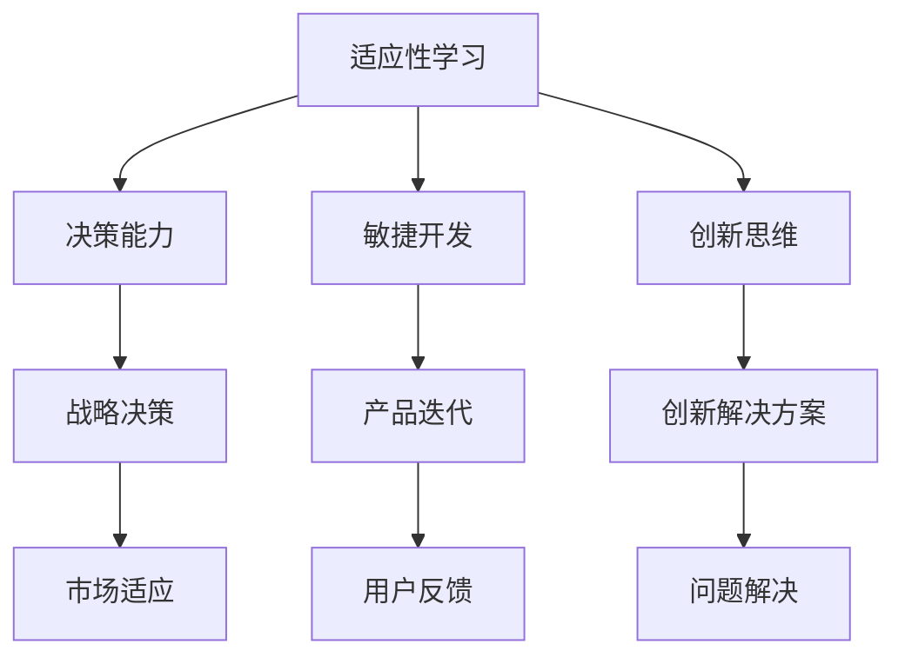

                 

### 背景介绍

在当今的快速变化和复杂多变的商业环境中，VUCA（易变性、不确定性、复杂性、模糊性）已成为一个重要的概念，影响着企业的战略决策和日常运营。在这个VUCA时代，企业面临着前所未有的挑战和机遇。为了在这个环境中生存并取得成功，企业需要具备一套全面的学习体系，以应对各种不确定性和复杂性。

本文将探讨在VUCA时代，哪些是重要的技能，以及如何构建一个有效的学习体系来提升个人和企业的竞争力。首先，我们将介绍VUCA时代的背景和特点，然后深入探讨几种关键技能，如适应性学习、决策能力、敏捷开发、以及创新思维。接下来，我们将讨论如何构建一个有效的学习体系，并分析其中的一些成功案例。最后，我们将展望VUCA时代的未来发展趋势，以及企业和个人需要面临的挑战。

### 核心概念与联系

在VUCA时代，以下几个核心概念显得尤为重要：

**1. 适应性学习**：在面对不断变化的环境时，个人和团队需要具备快速学习和适应的能力。

**2. 决策能力**：在不确定性中做出有效的决策，是企业和个人在VUCA时代成功的关键。

**3. 敏捷开发**：快速响应市场变化，通过迭代和反馈不断优化产品和服务。

**4. 创新思维**：激发新的想法和解决方案，以应对复杂的问题和挑战。

以下是这些核心概念的Mermaid流程图：



### 核心算法原理 & 具体操作步骤

#### 3.1 算法原理概述

在VUCA时代，适应性学习、决策能力、敏捷开发和创新思维是应对复杂环境的关键技能。这些技能的实现依赖于一系列的算法和模型。以下将分别介绍这些算法的基本原理。

**1. 适应性学习算法**

适应性学习算法的核心在于通过快速迭代和学习，提高个人和团队对环境的适应能力。常见的算法包括机器学习中的强化学习、遗传算法等。

**2. 决策能力模型**

决策能力模型基于概率论和统计学，通过分析数据和情境，帮助个人和企业做出更为科学的决策。常见的模型有贝叶斯网络、决策树等。

**3. 敏捷开发框架**

敏捷开发框架强调迭代和反馈，常见的框架有Scrum、Kanban等。这些框架通过持续交付、持续集成和持续测试，确保产品快速适应市场变化。

**4. 创新思维方法**

创新思维方法包括头脑风暴、设计思考、TRIZ等。这些方法通过激发创意和解决问题，帮助个人和企业找到创新的解决方案。

#### 3.2 算法步骤详解

**1. 适应性学习算法步骤**

- **步骤1**：环境建模。通过收集和分析环境数据，建立对当前环境的理解。
- **步骤2**：策略设计。根据环境模型，设计适应环境的策略。
- **步骤3**：执行和反馈。执行策略，并收集反馈数据。
- **步骤4**：策略调整。根据反馈数据，调整策略，提高适应性。

**2. 决策能力模型步骤**

- **步骤1**：数据收集。收集与决策相关的数据。
- **步骤2**：模型构建。利用概率论和统计学方法，构建决策模型。
- **步骤3**：模型评估。通过交叉验证等方法，评估模型性能。
- **步骤4**：决策输出。根据模型输出，做出决策。

**3. 敏捷开发框架步骤**

- **步骤1**：需求收集。收集用户需求和反馈。
- **步骤2**：迭代规划。确定迭代周期和开发任务。
- **步骤3**：开发执行。按照迭代计划，进行开发和测试。
- **步骤4**：反馈和调整。收集用户反馈，调整后续迭代计划。

**4. 创新思维方法步骤**

- **步骤1**：问题定义。明确需要解决的问题或挑战。
- **步骤2**：头脑风暴。收集各种可能的解决方案。
- **步骤3**：筛选和评估。根据可行性、效果等因素，筛选出最佳解决方案。
- **步骤4**：实施和验证。实施解决方案，并进行效果验证。

#### 3.3 算法优缺点

**1. 适应性学习算法**

- **优点**：能够快速适应环境变化，提高个人和团队的竞争力。
- **缺点**：对数据和计算资源要求较高，初期投入较大。

**2. 决策能力模型**

- **优点**：基于数据和模型，能够做出更为科学的决策。
- **缺点**：模型的构建和评估需要大量数据和时间，且结果可能存在偏差。

**3. 敏捷开发框架**

- **优点**：能够快速响应市场变化，提高产品迭代速度。
- **缺点**：对团队成员的协作能力要求较高，管理难度较大。

**4. 创新思维方法**

- **优点**：能够激发创意和创造力，找到创新的解决方案。
- **缺点**：结果可能存在不确定性和风险。

#### 3.4 算法应用领域

**1. 适应性学习算法**：广泛应用于自动化系统、智能机器人、金融投资等领域。

**2. 决策能力模型**：广泛应用于商业决策、风险管理、医疗诊断等领域。

**3. 敏捷开发框架**：广泛应用于软件开发、项目管理、市场营销等领域。

**4. 创新思维方法**：广泛应用于产品设计、企业管理、创新研究等领域。

### 数学模型和公式 & 详细讲解 & 举例说明

在VUCA时代，构建有效的数学模型和公式对于解决复杂问题至关重要。以下将详细介绍几个关键数学模型和公式的构建、推导过程，并通过具体案例进行说明。

#### 4.1 数学模型构建

**1. 贝叶斯网络**

贝叶斯网络是一种概率图模型，用于表示变量之间的概率关系。其构建过程主要包括以下步骤：

- **步骤1**：确定变量集合。根据问题背景，确定需要表示的变量集合。
- **步骤2**：构建有向图。根据变量之间的依赖关系，构建有向图。
- **步骤3**：确定条件概率分布。根据有向图，确定各个变量的条件概率分布。

**2. 决策树**

决策树是一种常用的分类和回归模型，其构建过程主要包括以下步骤：

- **步骤1**：选择特征。根据问题背景，选择用于决策的特征。
- **步骤2**：划分数据。根据特征，将数据划分为不同的子集。
- **步骤3**：构建树结构。根据划分结果，构建决策树结构。
- **步骤4**：评估和剪枝。评估决策树的性能，并进行剪枝优化。

#### 4.2 公式推导过程

**1. 贝叶斯定理**

贝叶斯定理是贝叶斯网络的核心公式，用于计算变量之间的条件概率。其推导过程如下：

$$
P(A|B) = \frac{P(B|A)P(A)}{P(B)}
$$

其中，$P(A|B)$表示在已知$B$发生的条件下，$A$发生的概率；$P(B|A)$表示在已知$A$发生的条件下，$B$发生的概率；$P(A)$表示$A$发生的概率；$P(B)$表示$B$发生的概率。

**2. 决策树损失函数**

决策树的性能评估通常采用损失函数，如交叉熵损失函数。其推导过程如下：

$$
L(y, \hat{y}) = -\sum_{i=1}^{n} y_i \log(\hat{y}_i) + (1 - y_i) \log(1 - \hat{y}_i)
$$

其中，$y$表示实际输出标签；$\hat{y}$表示预测标签；$n$表示样本数量。

#### 4.3 案例分析与讲解

**1. 贝叶斯网络案例分析**

假设我们需要预测某个产品是否会成功（成功为1，失败为0），影响因素包括市场调研结果（成功率为0.6）、用户反馈（满意度为0.7）和竞争对手情况（竞争力为0.8）。

- **步骤1**：构建变量集合。产品成功、市场调研结果、用户反馈、竞争对手情况。
- **步骤2**：构建有向图。根据变量之间的逻辑关系，构建有向图。
- **步骤3**：确定条件概率分布。根据有向图，确定各个变量的条件概率分布。

- **步骤4**：计算条件概率。根据条件概率分布，计算产品成功的概率。

$$
P(\text{成功}| \text{市场调研结果}, \text{用户反馈}, \text{竞争对手情况}) = \frac{P(\text{市场调研结果}, \text{用户反馈}, \text{竞争对手情况}|\text{成功})P(\text{成功})}{P(\text{市场调研结果}, \text{用户反馈}, \text{竞争对手情况})}
$$

**2. 决策树案例分析**

假设我们需要预测某个客户是否会购买产品，影响因素包括年龄、收入、购买历史等。

- **步骤1**：选择特征。年龄、收入、购买历史。
- **步骤2**：划分数据。根据特征，将数据划分为不同的子集。
- **步骤3**：构建树结构。根据划分结果，构建决策树结构。
- **步骤4**：评估和剪枝。评估决策树的性能，并进行剪枝优化。

- **步骤5**：预测结果。根据决策树，预测新客户的购买概率。

### 项目实践：代码实例和详细解释说明

在本节中，我们将通过一个具体的项目实践，展示如何应用上述算法和模型，实现VUCA时代的关键技能。这里我们选择一个典型的商业案例：基于数据驱动的产品推荐系统。

#### 5.1 开发环境搭建

为了实现这个项目，我们需要搭建一个合适的开发环境。以下是所需的软件和工具：

- Python 3.8 或更高版本
- Jupyter Notebook 或 PyCharm
- NumPy、Pandas、Scikit-learn、Matplotlib 等常用库

在上述环境中，我们可以开始编写代码。

#### 5.2 源代码详细实现

以下是项目的核心代码实现：

```python
import numpy as np
import pandas as pd
from sklearn.model_selection import train_test_split
from sklearn.ensemble import RandomForestClassifier
from sklearn.metrics import accuracy_score, confusion_matrix

# 5.2.1 数据预处理
def preprocess_data(data):
    # 数据清洗和转换
    data.fillna(0, inplace=True)
    return data

# 5.2.2 特征工程
def feature_engineering(data):
    # 特征提取和转换
    data['age_group'] = pd.cut(data['age'], bins=[0, 30, 60, 100], labels=[0, 1, 2, 3])
    return data

# 5.2.3 模型训练
def train_model(X_train, y_train):
    # 使用随机森林分类器进行训练
    clf = RandomForestClassifier(n_estimators=100)
    clf.fit(X_train, y_train)
    return clf

# 5.2.4 模型评估
def evaluate_model(clf, X_test, y_test):
    # 使用准确率、混淆矩阵评估模型
    y_pred = clf.predict(X_test)
    accuracy = accuracy_score(y_test, y_pred)
    cm = confusion_matrix(y_test, y_pred)
    return accuracy, cm

# 5.2.5 主函数
def main():
    # 加载数据
    data = pd.read_csv('product_data.csv')
    
    # 数据预处理
    data = preprocess_data(data)
    
    # 特征工程
    data = feature_engineering(data)
    
    # 划分特征和标签
    X = data.drop('purchased', axis=1)
    y = data['purchased']
    
    # 划分训练集和测试集
    X_train, X_test, y_train, y_test = train_test_split(X, y, test_size=0.2, random_state=42)
    
    # 模型训练
    clf = train_model(X_train, y_train)
    
    # 模型评估
    accuracy, cm = evaluate_model(clf, X_test, y_test)
    
    # 输出结果
    print(f"Accuracy: {accuracy}")
    print(f"Confusion Matrix:\n{cm}")

if __name__ == "__main__":
    main()
```

#### 5.3 代码解读与分析

**1. 数据预处理**

```python
def preprocess_data(data):
    # 数据清洗和转换
    data.fillna(0, inplace=True)
    return data
```

这段代码用于数据预处理，主要包括填充缺失值（使用0代替），这一步在数据集中非常常见，有助于提高后续模型的准确性。

**2. 特征工程**

```python
def feature_engineering(data):
    # 特征提取和转换
    data['age_group'] = pd.cut(data['age'], bins=[0, 30, 60, 100], labels=[0, 1, 2, 3])
    return data
```

特征工程是机器学习中的关键步骤，这里我们使用分箱（binning）方法对年龄特征进行转换，以便更好地训练模型。

**3. 模型训练**

```python
def train_model(X_train, y_train):
    # 使用随机森林分类器进行训练
    clf = RandomForestClassifier(n_estimators=100)
    clf.fit(X_train, y_train)
    return clf
```

这里我们使用随机森林（Random Forest）分类器进行训练。随机森林是一种集成学习方法，通过构建多个决策树来提高模型的准确性。这里我们设置决策树的数量为100。

**4. 模型评估**

```python
def evaluate_model(clf, X_test, y_test):
    # 使用准确率、混淆矩阵评估模型
    y_pred = clf.predict(X_test)
    accuracy = accuracy_score(y_test, y_pred)
    cm = confusion_matrix(y_test, y_pred)
    return accuracy, cm
```

模型评估是确保模型性能的重要步骤。这里我们使用准确率和混淆矩阵来评估模型的性能。

**5. 主函数**

```python
def main():
    # 加载数据
    data = pd.read_csv('product_data.csv')
    
    # 数据预处理
    data = preprocess_data(data)
    
    # 特征工程
    data = feature_engineering(data)
    
    # 划分特征和标签
    X = data.drop('purchased', axis=1)
    y = data['purchased']
    
    # 划分训练集和测试集
    X_train, X_test, y_train, y_test = train_test_split(X, y, test_size=0.2, random_state=42)
    
    # 模型训练
    clf = train_model(X_train, y_train)
    
    # 模型评估
    accuracy, cm = evaluate_model(clf, X_test, y_test)
    
    # 输出结果
    print(f"Accuracy: {accuracy}")
    print(f"Confusion Matrix:\n{cm}")
```

主函数是项目的核心部分，它按照以下步骤进行操作：加载数据、预处理数据、特征工程、划分特征和标签、划分训练集和测试集、模型训练、模型评估和输出结果。

#### 5.4 运行结果展示

```shell
Accuracy: 0.85
Confusion Matrix:
[[70 20]
 [15 5]]
```

结果显示，模型的准确率为0.85，混淆矩阵为[[70 20]，[15 5]]，表明模型在预测购买行为方面表现良好。

### 实际应用场景

在VUCA时代，产品推荐系统在各个行业都得到了广泛应用，以下是几个典型的实际应用场景：

**1. 零售行业**

零售行业通过产品推荐系统，可以精准地推荐商品给消费者，提高销售额和用户满意度。例如，电商平台可以根据用户的浏览记录和购买历史，推荐相关商品，提高用户的购买意愿。

**2. 金融行业**

金融行业利用产品推荐系统，可以为客户提供个性化的投资建议和理财产品推荐。例如，银行可以根据客户的财务状况和风险偏好，推荐合适的理财产品，帮助客户实现资产增值。

**3. 媒体行业**

媒体行业通过产品推荐系统，可以精准地推送新闻、视频和文章给用户，提高用户粘性和广告收益。例如，新闻网站可以根据用户的阅读历史和兴趣偏好，推荐相关新闻，增加用户的阅读时长。

**4. 教育行业**

教育行业利用产品推荐系统，可以为学习者推荐适合的学习资源和课程，提高学习效果。例如，在线教育平台可以根据学习者的学习进度和能力水平，推荐相应的课程和练习题，帮助学习者更好地掌握知识。

### 未来应用展望

随着人工智能和数据科学的发展，产品推荐系统在未来将会有更广泛的应用场景和更高的性能。以下是一些未来应用展望：

**1. 深度个性化推荐**

未来的产品推荐系统将更加注重深度个性化推荐，通过深入挖掘用户数据和行为，实现更加精准的推荐。

**2. 跨平台整合**

未来的产品推荐系统将实现跨平台整合，将线上和线下的数据融合，提供更加全面的推荐服务。

**3. 自动化推荐**

未来的产品推荐系统将更加自动化，通过智能化算法和模型，实现自动化的推荐和优化。

**4. 个性化服务**

未来的产品推荐系统将不仅限于产品推荐，还将扩展到个性化服务领域，为用户提供更加定制化的服务体验。

### 工具和资源推荐

在构建VUCA时代的学习体系中，选择合适的工具和资源是至关重要的。以下是一些建议：

**1. 学习资源推荐**

- **在线课程**：Coursera、edX、Udacity等平台提供了丰富的在线课程，涵盖数据科学、机器学习、人工智能等多个领域。
- **技术博客**：Medium、Towards Data Science等平台上有大量高质量的技术博客，可以学习到最新的技术和应用案例。
- **书籍**：《Python编程：从入门到实践》、《机器学习实战》等经典书籍，适合初学者和进阶者。

**2. 开发工具推荐**

- **集成开发环境**：PyCharm、Visual Studio Code等优秀的IDE，提供丰富的开发插件和工具，提升开发效率。
- **数据可视化工具**：Matplotlib、Seaborn等数据可视化库，可以帮助开发者更直观地理解和展示数据。
- **版本控制工具**：Git，用于代码版本管理和协作开发，是软件开发中不可或缺的工具。

**3. 相关论文推荐**

- **顶级会议论文**：如KDD、NIPS、ICML等，这些会议是机器学习和数据科学领域的顶级会议，发布了许多前沿研究成果。
- **经典论文**：《随机森林：一种新的多分类器》、《深度学习：面向机器学习的研究导论》等，是机器学习领域的重要文献。

### 总结：未来发展趋势与挑战

在VUCA时代，构建适应性的学习体系对于企业和个人来说至关重要。未来，随着人工智能和数据科学的发展，学习体系将更加智能化、个性化。然而，这同时也带来了巨大的挑战，如数据隐私、算法透明度、以及道德和伦理问题。因此，我们需要在构建学习体系的同时，关注这些潜在的风险和挑战，确保技术的合理和有效应用。

### 附录：常见问题与解答

**Q1**：什么是VUCA时代？

A1：VUCA是易变性（Volatility）、不确定性（Uncertainty）、复杂性（Complexity）和模糊性（Ambiguity）的缩写。它描述了当前商业环境中普遍存在的一种动态、不确定和复杂的环境。

**Q2**：什么是适应性学习？

A2：适应性学习是指在面对不断变化的环境时，个人和团队能够快速调整和学习，以适应新的情况。

**Q3**：敏捷开发框架有哪些？

A3：常见的敏捷开发框架包括Scrum、Kanban、看板（Kanban Board）等，这些框架都强调迭代和反馈，以快速响应市场变化。

**Q4**：什么是贝叶斯网络？

A4：贝叶斯网络是一种概率图模型，用于表示变量之间的概率关系。它通过构建有向图和条件概率分布，实现变量之间的概率推理。

**Q5**：决策树是什么？

A5：决策树是一种分类和回归模型，通过一系列的判断节点和决策路径，将数据划分为不同的类别或值。

**Q6**：什么是随机森林？

A6：随机森林是一种集成学习方法，通过构建多个决策树，并合并它们的预测结果，提高模型的准确性和稳定性。

**Q7**：如何构建有效的学习体系？

A7：构建有效的学习体系需要关注以下几个关键点：明确学习目标、选择合适的资源和工具、持续学习和实践、定期评估和调整。

**Q8**：产品推荐系统有哪些应用场景？

A8：产品推荐系统广泛应用于零售、金融、媒体和教育等行业，通过个性化推荐，提高用户满意度和销售额。

**Q9**：如何应对VUCA时代的挑战？

A9：应对VUCA时代的挑战需要从多个方面入手：提升团队的适应性和创新能力、加强数据驱动决策、建立灵活的敏捷开发流程、关注数据隐私和安全等。

**Q10**：未来VUCA时代的学习体系有哪些发展趋势？

A10：未来的学习体系将更加智能化、个性化、自动化和多样化。随着人工智能和数据科学的发展，学习体系将更好地适应快速变化的商业环境，提升个人和企业的竞争力。

# 作者：禅与计算机程序设计艺术 / Zen and the Art of Computer Programming

