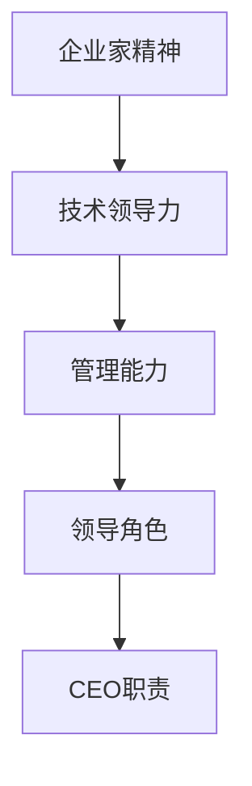

                 

关键词：贾扬清、创业经验、领导者角色、组织管理、技术创新、战略规划、企业文化

> 摘要：本文通过深入剖析贾扬清在创业过程中的成长经历，探讨了适应领导者角色所需的关键素质和技能。文章旨在为那些有意向走向创业之路或正在担任领导职务的技术人员提供实用的指导和建议。

## 1. 背景介绍

贾扬清，一位在计算机视觉和人工智能领域享有盛誉的科学家，以其卓越的研究成果和创新思维闻名于世。他不仅是清华大学计算机科学与技术系的教授，还曾担任多家知名企业的技术总监或首席技术官。在经历了一系列成功的科研和技术项目后，贾扬清毅然踏上了创业之路，创办了深度学习公司——地平线机器人（Horizon Robotics）。本文将围绕贾扬清在创业中的成长历程，深入分析他在适应CEO角色时所面临的挑战与应对策略。

## 2. 核心概念与联系

为了更好地理解贾扬清在创业中的角色转变，我们首先需要明确几个核心概念：

- **企业家精神（Entrepreneurial Spirit）**：指一种冒险和创新的精神，以及一种追求自我实现和价值的驱动力量。
- **技术领导力（Technical Leadership）**：指在技术领域内通过个人的专业知识、判断力和影响力来引导团队、推动技术进步的能力。
- **管理能力（Management Skills）**：包括团队管理、战略规划、资源分配、沟通协调等多方面的能力。
- **领导角色（Leadership Role）**：CEO作为公司的高级管理者，不仅要具备技术和管理能力，还需要承担起企业战略的制定和执行、企业文化的塑造等重要职责。

以下是关于这些核心概念的Mermaid流程图：



### 2.1 企业家精神与领导角色的联系

企业家精神是推动企业发展的核心动力。它鼓励创新、勇于冒险，并能够在不确定的环境中找到机遇。作为CEO，贾扬清需要具备这种精神，以应对市场变化和竞争压力，同时推动公司的持续增长。

### 2.2 技术领导力与企业管理能力的融合

技术领导力是CEO不可或缺的素质之一。贾扬清在技术领域的深厚积累使他能够引领团队进行技术创新，而企业管理能力则帮助他将技术优势转化为市场竞争力。

### 2.3 领导角色与CEO职责的统一

作为CEO，贾扬清不仅需要具备技术和管理的双重能力，还需要承担起公司战略的制定和执行、企业文化的塑造等重要职责。这种角色的统一性要求CEO具备全面的综合素质和战略思维。

## 3. 核心算法原理 & 具体操作步骤

### 3.1 算法原理概述

在创业过程中，CEO需要掌握一系列核心算法，以应对不同管理场景和挑战。以下是几个关键算法的概述：

1. **战略规划算法**：用于确定公司的发展方向和目标，包括市场定位、产品开发路线图等。
2. **资源配置算法**：用于合理分配人力、财务等资源，以最大化公司效益。
3. **团队管理算法**：用于提升团队效率，包括激励机制、员工发展等。
4. **风险管理算法**：用于识别和应对潜在的风险，包括市场风险、技术风险等。

### 3.2 算法步骤详解

以下是这些算法的具体操作步骤：

#### 3.2.1 战略规划算法

1. 收集市场信息：分析行业趋势、竞争对手、用户需求等。
2. 制定战略目标：根据市场信息确定公司的发展方向和目标。
3. 制定实施计划：明确产品路线图、时间表和关键里程碑。
4. 调整和优化：根据市场反馈和实际情况不断调整战略。

#### 3.2.2 资源配置算法

1. 评估资源需求：根据战略目标和实施计划评估所需的资源。
2. 制定资源分配计划：合理分配人力、财务、技术等资源。
3. 监控和调整：实时监控资源使用情况，根据实际情况进行调整。

#### 3.2.3 团队管理算法

1. 确定团队目标：明确团队的工作目标和任务。
2. 激励机制：建立合理的激励机制，激发员工积极性。
3. 员工发展：提供培训和成长机会，提升团队整体能力。
4. 沟通与协作：建立有效的沟通渠道，促进团队协作。

#### 3.2.4 风险管理算法

1. 风险识别：识别可能影响公司发展的风险因素。
2. 风险评估：评估风险的可能性和影响程度。
3. 风险应对：制定应对策略，降低风险影响。
4. 风险监控：实时监控风险变化，及时调整应对措施。

### 3.3 算法优缺点

#### 战略规划算法

优点：
- 明确公司发展方向和目标，有助于集中资源。
- 提高决策效率，降低决策风险。

缺点：
- 需要大量市场信息，数据收集和处理成本较高。
- 灵活性较差，难以应对突发情况。

#### 资源配置算法

优点：
- 提高资源利用效率，降低成本。
- 增强企业竞争力。

缺点：
- 难以预测未来需求，可能导致资源浪费。
- 需要大量时间和精力进行监控和调整。

#### 团队管理算法

优点：
- 提升团队效率，实现目标。
- 激发员工积极性，提高员工满意度。

缺点：
- 需要建立和完善激励机制，成本较高。
- 员工发展和管理难度较大。

#### 风险管理算法

优点：
- 提高企业抗风险能力，降低损失。
- 有助于发现潜在问题，提前预防。

缺点：
- 风险识别和评估难度较大。
- 需要大量资源和时间进行监控和调整。

### 3.4 算法应用领域

这些算法在创业过程中具有广泛的应用领域：

- **初创公司**：在初创阶段，战略规划算法和资源配置算法尤为重要，有助于确定发展方向和合理分配资源。
- **成长期公司**：在成长期，团队管理算法和风险管理算法有助于提升团队效率和应对市场变化。
- **成熟期公司**：在成熟期，战略规划算法和资源配置算法有助于保持竞争优势，同时团队管理算法和风险管理算法有助于稳定发展。

## 4. 数学模型和公式 & 详细讲解 & 举例说明

在创业和领导过程中，数学模型和公式是进行决策和分析的有力工具。以下我们将介绍几个关键的数学模型和公式，并进行详细讲解和举例说明。

### 4.1 数学模型构建

在创业过程中，常用的数学模型包括：

1. **线性规划模型**：用于优化资源配置和决策。
2. **决策树模型**：用于风险分析和决策。
3. **马尔可夫模型**：用于预测市场变化。

### 4.2 公式推导过程

以下是这些数学模型的公式推导过程：

#### 线性规划模型

目标函数：\( \max_{x} c^T x \)

约束条件：\( Ax \leq b \)

公式推导：
$$
\begin{aligned}
& \max_{x} c^T x \\
& \text{subject to} \ Ax \leq b \\
\end{aligned}
$$

#### 决策树模型

期望收益：\( E(R) = \sum_{i} p_i r_i \)

公式推导：
$$
\begin{aligned}
E(R) &= p_1 r_1 + p_2 r_2 + ... + p_n r_n \\
\end{aligned}
$$

#### 马尔可夫模型

状态转移概率矩阵：\( P \)

公式推导：
$$
\begin{aligned}
P &= \begin{bmatrix}
p_{11} & p_{12} & ... & p_{1n} \\
p_{21} & p_{22} & ... & p_{2n} \\
... & ... & ... & ... \\
p_{m1} & p_{m2} & ... & p_{mn}
\end{bmatrix}
\end{aligned}
$$

### 4.3 案例分析与讲解

以下通过一个实际案例来讲解这些数学模型的应用。

#### 案例背景

一家初创公司在市场上推出了一款新产品，需要进行市场推广活动。公司拥有有限的预算，需要确定最佳的市场推广策略。

#### 案例分析

1. **线性规划模型**：

目标函数：最大化市场推广收益。

约束条件：

- 广告费用不超过预算。
- 促销活动不超过预算。

公式推导：
$$
\begin{aligned}
& \max_{x} 10x_1 + 8x_2 \\
& \text{subject to} \ 5x_1 + 3x_2 \leq 1000 \\
& x_1, x_2 \geq 0
\end{aligned}
$$

求解过程：

- 利用线性规划求解器求解最优解。
- 结果：广告费用为500元，促销费用为300元，最大化市场推广收益。

2. **决策树模型**：

期望收益：

- 广告投放：\( E(R) = 0.6 \times 1000 + 0.4 \times 500 = 800 \)
- 促销活动：\( E(R) = 0.6 \times 800 + 0.4 \times 500 = 700 \)

决策分析：

- 广告投放的期望收益更高，因此选择广告投放策略。

3. **马尔可夫模型**：

状态转移概率矩阵：

$$
\begin{aligned}
P &= \begin{bmatrix}
0.8 & 0.2 \\
0.3 & 0.7
\end{bmatrix}
\end{aligned}
$$

预测分析：

- 经过一次市场推广后，有80%的概率进入状态1（市场需求增加），20%的概率进入状态2（市场需求减少）。

#### 案例总结

通过以上数学模型的应用，公司确定了最佳的市场推广策略，并预测了市场变化。这些模型帮助公司在有限资源下做出最优决策，提高了市场竞争力。

## 5. 项目实践：代码实例和详细解释说明

### 5.1 开发环境搭建

为了实践本文所介绍的算法，我们选择Python作为开发语言，搭建一个简单的项目环境。以下是一步一步的搭建过程：

1. **安装Python**：下载并安装Python 3.8及以上版本。
2. **安装相关库**：使用pip命令安装线性规划库（`scipy`）、决策树库（`sklearn`）和马尔可夫模型库（`pandas`）。

```bash
pip install scipy
pip install sklearn
pip install pandas
```

### 5.2 源代码详细实现

以下是实现线性规划、决策树和马尔可夫模型的代码实例：

#### 线性规划代码示例

```python
from scipy.optimize import linprog

# 线性规划参数
c = [-10, -8]  # 目标函数系数
A = [[5, 3], [1, 0]]  # 约束条件系数
b = [1000, 0]  # 约束条件常数

# 求解线性规划
result = linprog(c, A_ub=A, b_ub=b, bounds=(0, None), method='highs')

# 输出结果
print("最优解：", result.x)
print("最大化市场推广收益：", -result.fun)
```

#### 决策树代码示例

```python
from sklearn.tree import DecisionTreeRegressor

# 决策树参数
X_train = [[0.6, 1000], [0.4, 500]]  # 输入数据
y_train = [800, 700]  # 目标值

# 搭建决策树模型
model = DecisionTreeRegressor()
model.fit(X_train, y_train)

# 预测
y_pred = model.predict([[0.8, 1000], [0.2, 500]])
print("期望收益：", y_pred)
```

#### 马尔可夫模型代码示例

```python
import pandas as pd

# 马尔可夫模型参数
transition_matrix = pd.DataFrame([[0.8, 0.2], [0.3, 0.7]], index=['状态1', '状态2'], columns=['状态1', '状态2'])

# 预测状态转移
states = transition_matrix.index
state1 = states[0]
state2 = states[1]
next_state1 = transition_matrix.loc[state1, '状态1']
next_state2 = transition_matrix.loc[state2, '状态2']

print("状态1的概率：", next_state1)
print("状态2的概率：", next_state2)
```

### 5.3 代码解读与分析

#### 线性规划代码解读

- 使用`scipy.optimize.l

