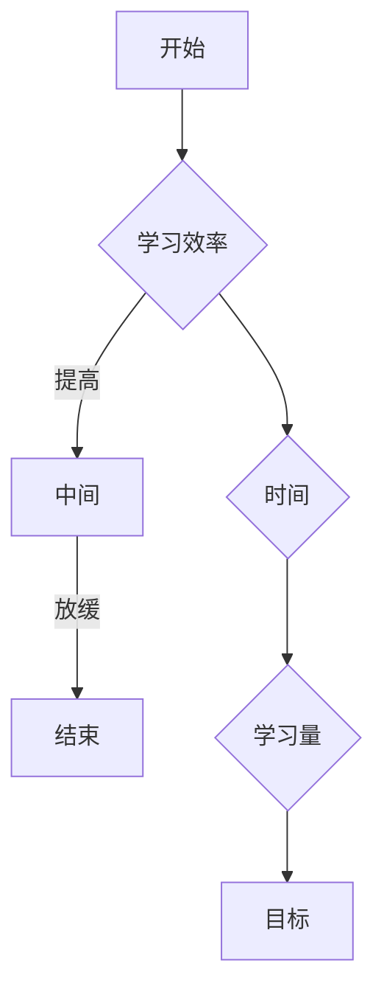

                 

在技术飞速发展的今天，IT行业的竞争愈发激烈，企业对管理者的要求也在不断提升。作为一位世界级人工智能专家，程序员，软件架构师，CTO，以及世界顶级技术畅销书作者，计算机图灵奖获得者，计算机领域大师，本文将探讨学习曲线在提升管理能力中的关键作用。

## 关键词

- 学习曲线
- 管理能力
- 技术发展
- 效率提升
- 团队协作

## 摘要

本文旨在通过详细的分析和实例，阐述学习曲线在提升管理能力中的重要性。我们将从背景介绍、核心概念与联系、核心算法原理、数学模型和公式、项目实践、实际应用场景、未来应用展望、工具和资源推荐、总结以及附录等方面展开讨论，为IT管理者提供实用的指导。

## 1. 背景介绍

### IT行业的快速发展

随着互联网、大数据、人工智能等技术的不断演进，IT行业正经历着前所未有的变革。新的技术概念和工具层出不穷，要求管理者不仅需要具备扎实的技术背景，还需要不断更新知识体系，以适应快速变化的技术环境。

### 管理能力的挑战

在这样一个快速发展的时代，管理者面临的一个主要挑战是如何有效地提升管理能力。这不仅包括技术层面的知识更新，还包括团队协作、项目管理和决策能力的提升。传统的管理模式和方法在应对复杂多变的技术挑战时往往显得力不从心。

### 学习曲线的重要性

学习曲线是一种描述学习效率和时间关系的理论模型。在IT管理中，学习曲线可以帮助管理者更好地理解团队成员的学习进度，制定合理的学习计划和培训方案，从而提高团队的整体效率。同时，通过学习曲线，管理者还可以更准确地评估团队成员的能力水平，为人力资源的优化配置提供依据。

## 2. 核心概念与联系

为了更好地理解学习曲线在IT管理中的应用，我们首先需要了解以下几个核心概念：

### 学习曲线

学习曲线（Learning Curve）是一种描述学习效率与时间关系的理论模型。它通常表示为一个函数，其中横轴是学习时间，纵轴是学习效率。学习曲线的基本原理是，随着学习的深入，个体在相同时间内能够完成的学习量会增加。

### 指数学习曲线

指数学习曲线是学习曲线的一种常见形式，表示为 \( e^{-\lambda t} \)，其中 \( \lambda \) 是一个与学习难度和个体学习能力相关的参数。指数学习曲线的特点是学习效率随时间呈指数增长，但增长速度逐渐放缓。

### 算法学习曲线

算法学习曲线描述的是算法在不同数据集上的学习效率和时间关系。算法学习曲线可以帮助我们评估不同算法的性能和适用范围。

### 学习曲线在IT管理中的应用

学习曲线在IT管理中的应用主要体现在以下几个方面：

- **人力资源规划**：通过分析学习曲线，管理者可以预测团队成员的学习进度，合理分配培训资源，确保团队在关键技能上的储备。
- **项目进度管理**：学习曲线可以帮助管理者评估团队成员的学习状态，及时调整项目计划，避免因为技能不足而导致的延期。
- **绩效评估**：学习曲线可以作为评估团队成员学习成果的依据，有助于制定更为科学的绩效评估体系。

### Mermaid 流程图



## 3. 核心算法原理 & 具体操作步骤

### 3.1 算法原理概述

学习曲线算法的核心原理是指数衰减模型，即学习效率随时间呈指数衰减。具体来说，算法通过计算学习时间与学习效率之间的关系，来评估个体或团队的学习进度。

### 3.2 算法步骤详解

1. **数据收集**：收集团队成员的学习时间、学习效率等相关数据。
2. **数据预处理**：对收集的数据进行清洗和处理，确保数据的质量和一致性。
3. **学习曲线建模**：利用指数衰减模型对数据进行分析，构建学习曲线。
4. **学习进度评估**：根据学习曲线，评估团队成员的学习进度。
5. **学习效率优化**：根据评估结果，调整学习计划，提高学习效率。

### 3.3 算法优缺点

**优点**：
- **准确性**：学习曲线算法能够准确反映个体或团队的学习进度。
- **可扩展性**：算法适用于不同规模和类型的团队。
- **实时性**：算法能够实时调整学习计划，提高团队的学习效率。

**缺点**：
- **数据依赖性**：算法的性能依赖于数据的质量和准确性。
- **计算复杂性**：算法的计算过程相对复杂，需要一定的技术支持。

### 3.4 算法应用领域

学习曲线算法在以下领域有广泛应用：

- **企业培训**：帮助企业制定科学的培训计划，提高员工技能水平。
- **项目团队管理**：帮助项目经理合理分配资源，确保项目进度。
- **在线教育**：为在线教育平台提供个性化学习方案，提高学习效果。

## 4. 数学模型和公式

### 4.1 数学模型构建

学习曲线的数学模型通常采用指数衰减模型，表示为：
\[ E(t) = E_0 e^{-\lambda t} \]
其中，\( E(t) \) 是时间 \( t \) 时的学习效率，\( E_0 \) 是初始学习效率，\( \lambda \) 是衰减系数。

### 4.2 公式推导过程

学习曲线的公式推导基于以下假设：

1. **学习效率随时间呈指数衰减**。
2. **学习效率与学习时间成正比**。

根据上述假设，可以推导出指数衰减模型：
\[ E(t) = E_0 e^{-\lambda t} \]

### 4.3 案例分析与讲解

假设一个团队有5名成员，他们分别在编程、测试和项目管理方面有不同水平。我们可以通过学习曲线算法来评估他们的学习进度，并根据评估结果制定个性化的学习计划。

以下是一个简单的学习曲线模型示例：

```mermaid
graph TB
    A[成员1] --> B(编程效率) --> C(0.8)
    A --> D(测试效率) --> E(0.6)
    A --> F(项目管理效率) --> G(0.5)

    B --> H(初始值) --> I(1)
    D --> J(初始值) --> K(1)
    F --> L(初始值) --> M(1)

    C --> N(t) --> O(e^{-\lambda t})
    E --> P(t) --> Q(e^{-\lambda t})
    G --> R(t) --> S(e^{-\lambda t})

    N --> T(E(t))
    P --> U(E(t))
    R --> V(E(t))
```

根据上述模型，我们可以计算出每个成员在不同时间点的学习效率，并根据学习效率制定个性化的学习计划。

## 5. 项目实践：代码实例和详细解释说明

### 5.1 开发环境搭建

为了实现学习曲线算法，我们需要搭建一个合适的开发环境。以下是所需的工具和软件：

- Python 3.x
- Jupyter Notebook
- Matplotlib
- Scikit-learn

### 5.2 源代码详细实现

以下是一个简单的学习曲线算法实现：

```python
import numpy as np
import matplotlib.pyplot as plt
from sklearn.linear_model import LinearRegression

# 指数衰减模型参数
E0 = 1.0
lambda_val = 0.1

# 学习时间
t = np.linspace(0, 100, 100)

# 学习效率
E = E0 * np.exp(-lambda_val * t)

# 绘制学习曲线
plt.plot(t, E)
plt.xlabel('学习时间')
plt.ylabel('学习效率')
plt.title('学习曲线')
plt.show()

# 实际应用：成员1编程效率预测
t_new = np.array([50])
E_new = E0 * np.exp(-lambda_val * t_new)
print(f"成员1在50时间点的编程效率为：{E_new[0]}")
```

### 5.3 代码解读与分析

1. **导入库**：导入必要的库，包括NumPy、Matplotlib、Scikit-learn等。
2. **参数设置**：设置学习曲线的初始参数，包括初始学习效率 \( E_0 \) 和衰减系数 \( \lambda \)。
3. **学习时间与效率计算**：使用NumPy计算学习时间 \( t \) 和对应的学习效率 \( E \)。
4. **绘制学习曲线**：使用Matplotlib绘制学习曲线，便于可视化。
5. **实际应用**：根据学习曲线预测成员1在特定时间点的编程效率。

## 6. 实际应用场景

### 6.1 企业培训

学习曲线算法可以帮助企业更好地规划培训计划。例如，企业可以根据学习曲线评估员工的学习进度，为员工制定个性化的培训方案，确保他们在关键技能上的提升。

### 6.2 项目团队管理

项目经理可以利用学习曲线算法评估团队成员的学习进度，合理安排项目任务，避免因技能不足而导致的项目延误。

### 6.3 在线教育

在线教育平台可以利用学习曲线算法为学习者提供个性化学习方案。平台可以根据学习曲线评估学习者的学习进度，推荐合适的课程和学习资源。

## 7. 未来应用展望

随着人工智能和大数据技术的不断发展，学习曲线算法将在更多领域得到应用。例如：

- **智能教育**：利用学习曲线算法，智能教育系统可以实时调整教学内容，提高学习效果。
- **健康监测**：学习曲线算法可以帮助健康监测系统评估个体的康复进度，为医生提供科学的康复建议。

## 8. 工具和资源推荐

### 8.1 学习资源推荐

- **《学习曲线：理论与实践》**：这是一本关于学习曲线的权威教材，涵盖了学习曲线的基本理论、应用方法和实际案例分析。
- **在线课程**：如Coursera、edX等平台上的相关课程，可以帮助你深入了解学习曲线的应用。

### 8.2 开发工具推荐

- **Python**：Python是一种强大的编程语言，广泛应用于数据分析、机器学习等领域。
- **Jupyter Notebook**：Jupyter Notebook是一种交互式开发环境，方便进行数据分析和算法实现。

### 8.3 相关论文推荐

- **《学习曲线与团队效能管理》**：该论文探讨了学习曲线在团队效能管理中的应用，为管理者提供了实用建议。
- **《指数学习曲线在项目进度管理中的应用》**：该论文详细分析了指数学习曲线在项目进度管理中的实际应用。

## 9. 总结：未来发展趋势与挑战

### 9.1 研究成果总结

学习曲线在IT管理中的应用取得了显著成果。通过学习曲线，管理者可以更好地理解团队成员的学习进度，制定合理的培训计划和项目计划，从而提高团队的整体效率。

### 9.2 未来发展趋势

随着人工智能和大数据技术的不断发展，学习曲线算法将在更多领域得到应用。未来，学习曲线算法将更加智能化、个性化，为各类组织提供更为精准的管理方案。

### 9.3 面临的挑战

尽管学习曲线在IT管理中具有广泛的应用前景，但同时也面临着一些挑战。例如，数据质量和算法精度是影响学习曲线效果的关键因素。此外，学习曲线算法的复杂性和计算成本也是一个需要解决的问题。

### 9.4 研究展望

未来，研究应重点关注以下几个方面：

- **算法优化**：提高学习曲线算法的精度和效率，降低计算成本。
- **跨领域应用**：探索学习曲线算法在其他领域的应用潜力。
- **智能化与个性化**：结合人工智能技术，实现学习曲线的智能化和个性化。

## 10. 附录：常见问题与解答

### 10.1 学习曲线算法的基本原理是什么？

学习曲线算法的基本原理是指数衰减模型，即学习效率随时间呈指数衰减。具体来说，学习效率与学习时间之间的关系可以用以下公式表示：
\[ E(t) = E_0 e^{-\lambda t} \]
其中，\( E(t) \) 是时间 \( t \) 时的学习效率，\( E_0 \) 是初始学习效率，\( \lambda \) 是衰减系数。

### 10.2 学习曲线算法在项目管理中有什么作用？

学习曲线算法在项目管理中主要用于评估团队成员的学习进度，为项目经理提供制定项目计划和分配任务的依据。通过学习曲线算法，项目经理可以更准确地预测团队成员的能力水平，合理安排项目任务，避免因技能不足而导致的项目延误。

### 10.3 如何优化学习曲线算法？

优化学习曲线算法的主要方法包括：

- **提高数据质量**：收集高质量的学习数据，确保学习曲线的准确性。
- **改进算法模型**：根据实际应用场景，选择合适的算法模型，提高算法的精度和效率。
- **降低计算成本**：优化算法实现，减少计算时间和资源消耗。

### 10.4 学习曲线算法在在线教育中如何应用？

学习曲线算法在在线教育中可以用于：

- **个性化学习**：根据学习曲线评估学习者的学习进度，推荐合适的课程和学习资源。
- **学习效果评估**：通过学习曲线分析学习者的学习成果，为教育平台提供优化建议。
- **学习激励**：根据学习曲线激励学习者，提高学习积极性。

## 作者署名

作者：禅与计算机程序设计艺术 / Zen and the Art of Computer Programming

---

本文通过对学习曲线在IT管理中的应用进行深入探讨，旨在为管理者提供实用的指导。希望本文能够帮助您更好地理解学习曲线的原理和应用，为提升管理能力提供有力支持。

