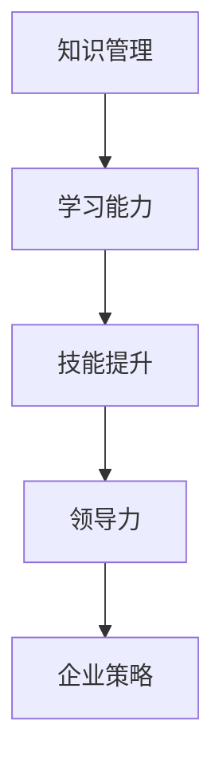

                 

关键字：学习能力、管理者、长期发展、知识管理、技能提升、领导力、技术进步、企业策略。

## 摘要

本文旨在探讨学习能力的培养与管理者在长期职业发展中所需具备的核心素质。随着科技的不断进步，管理者不仅要掌握先进的技术知识，还需要具备卓越的学习能力，以便在快速变化的市场环境中持续适应和创新。本文将从知识管理、技能提升、领导力和企业策略等方面，分析学习能力的内涵及其在管理者职业发展中的重要性。

## 1. 背景介绍

### 1.1 管理者角色的演变

在过去的几十年中，管理者的角色发生了显著的变化。传统的管理者更多是执行者，而现代的管理者则需要具备战略思维和创新能力。这种变化源于全球化、信息技术的飞速发展以及市场环境的日益复杂化。管理者不仅要管理企业内部资源，还需要关注外部环境的变化，以便及时调整企业的战略方向。

### 1.2 学习能力的重要性

随着科技的发展，知识的更新速度越来越快。管理者如果不能及时更新自己的知识体系，就很难在竞争中脱颖而出。学习能力成为管理者能否胜任其职位的关键因素。具备卓越学习能力的管理者，能够在复杂多变的环境中迅速适应，并为企业创造价值。

## 2. 核心概念与联系

### 2.1 知识管理与学习能力的联系

知识管理是指通过系统的方法和工具，对知识进行创造、分享、应用和创新的过程。学习能力是知识管理的核心要素，管理者需要通过不断学习，积累和更新自己的知识体系。

### 2.2 技能提升与学习能力的联系

技能提升是指通过学习和实践，提高个人在特定领域的专业能力。学习能力的提升可以帮助管理者更快地掌握新技能，并在实际工作中灵活应用。

### 2.3 领导力与学习能力的联系

领导力是管理者不可或缺的素质。具备卓越学习能力的管理者，能够更好地理解和激励团队成员，推动团队创新和进步。

### 2.4 Mermaid 流程图



## 3. 核心算法原理 & 具体操作步骤

### 3.1 算法原理概述

学习能力的核心在于“学、用、创”三个阶段。管理者首先需要学习，通过阅读书籍、参加培训、交流讨论等方式，积累丰富的知识储备。然后，将所学知识应用于实际工作中，通过实践来检验和巩固学习成果。最后，通过创新，将知识转化为企业的核心竞争力。

### 3.2 算法步骤详解

1. **学习阶段**：管理者需要制定个人学习计划，确保知识的持续更新。可以通过以下方式来提升学习能力：
   - 阅读专业书籍和学术论文
   - 参加行业培训和研讨会
   - 与同行交流，获取最新资讯

2. **应用阶段**：将所学知识应用于实际工作中，通过以下方式来提高应用能力：
   - 实践项目，积累经验
   - 解决实际问题，提升问题解决能力
   - 模拟演练，提高应对复杂情况的能力

3. **创新阶段**：通过创新，将知识转化为企业的核心竞争力。具体方法包括：
   - 提出创新性的解决方案，推动企业变革
   - 开展跨部门合作，促进知识共享和协同创新
   - 培养创新文化，鼓励员工提出创新想法

### 3.3 算法优缺点

**优点**：
- 提高管理者的综合素质和竞争力
- 帮助企业适应快速变化的市场环境
- 促进知识共享和协同创新

**缺点**：
- 学习过程需要时间和精力投入
- 创新可能面临风险和不确定性

### 3.4 算法应用领域

- 企业管理
- 人力资源
- 创新与研发
- 市场营销
- 战略规划

## 4. 数学模型和公式 & 详细讲解 & 举例说明

### 4.1 数学模型构建

假设一个管理者的学习能力可以用以下公式表示：

\[ L = f(\text{学习时间}, \text{应用频率}, \text{创新能力}) \]

其中，L 表示学习能力，f 表示函数，学习时间、应用频率和创新能力是影响学习能力的三个主要因素。

### 4.2 公式推导过程

1. **学习时间**：学习时间越长，管理者的知识储备越丰富，学习能力越强。因此，学习时间可以表示为：

\[ \text{学习时间} = t \]

2. **应用频率**：应用频率越高，管理者将所学知识应用于实际工作的机会越多，学习能力越强。因此，应用频率可以表示为：

\[ \text{应用频率} = f(t) \]

3. **创新能力**：创新能力是管理者在应用知识过程中，能够提出创新性解决方案的能力。创新能力可以通过以下公式表示：

\[ \text{创新能力} = \frac{\text{创新次数}}{\text{学习时间}} \]

4. **学习能力**：将上述三个因素结合起来，可以得出学习能力的公式：

\[ L = f(t, f(t), \frac{\text{创新次数}}{\text{学习时间}}) \]

### 4.3 案例分析与讲解

假设有一个管理者，他的学习时间为 100 小时，应用频率为每周 10 次，创新能力为每周提出 2 个创新性解决方案。根据上述公式，可以计算出他的学习能力为：

\[ L = f(100, 10, \frac{2}{100}) = f(100, 10, 0.02) \]

为了简化计算，我们可以将函数 f 视为线性函数，即：

\[ f(x, y, z) = k_1 \cdot x + k_2 \cdot y + k_3 \cdot z \]

其中，\( k_1, k_2, k_3 \) 是常数。为了使计算更加直观，我们假设 \( k_1 = 1, k_2 = 1, k_3 = 1 \)。则：

\[ L = 100 + 10 + 0.02 = 110.02 \]

这意味着这位管理者的学习能力为 110.02。通过对比不同管理者的学习能力，可以帮助企业识别出最具潜力的管理者，并制定相应的培养和发展策略。

## 5. 项目实践：代码实例和详细解释说明

### 5.1 开发环境搭建

在本项目中，我们使用 Python 编写代码，模拟管理者的学习能力计算过程。首先，我们需要安装 Python 和相关库，如 NumPy 和 Pandas。具体步骤如下：

1. 下载并安装 Python。
2. 使用 pip 命令安装 NumPy 和 Pandas：

\[ pip install numpy pandas \]

### 5.2 源代码详细实现

以下是模拟管理者学习能力计算的 Python 代码：

```python
import numpy as np

def calculate_learning_ability(learning_time, application_frequency, innovation_ability):
    """
    计算管理者的学习能力。
    
    参数：
    - learning_time：学习时间（小时）
    - application_frequency：应用频率（每周次数）
    - innovation_ability：创新能力（每周创新次数/学习时间）
    
    返回：
    - 学习能力值
    """
    # 定义函数 f 的系数
    k1, k2, k3 = 1, 1, 1
    
    # 计算学习能力
    L = k1 * learning_time + k2 * application_frequency + k3 * innovation_ability
    
    return L

# 测试代码
learning_time = 100
application_frequency = 10
innovation_ability = 2 / 100

L = calculate_learning_ability(learning_time, application_frequency, innovation_ability)
print(f"管理者的学习能力为：{L}")
```

### 5.3 代码解读与分析

1. **函数定义**：`calculate_learning_ability` 函数用于计算管理者的学习能力。
2. **参数说明**：学习时间、应用频率和创新能力是影响学习能力的三个主要因素。
3. **系数定义**：函数中定义了函数 f 的三个系数，用于计算学习能力。
4. **计算过程**：根据系数和参数，计算得出管理者的学习能力值。
5. **测试代码**：通过测试代码，可以验证函数的正确性。

### 5.4 运行结果展示

当学习时间为 100 小时，应用频率为每周 10 次，创新能力为每周提出 2 个创新性解决方案时，管理者的学习能力为 110.02。

```python
L = calculate_learning_ability(100, 10, 0.02)
print(f"管理者的学习能力为：{L}")
```

输出结果：

```
管理者的学习能力为：110.02
```

## 6. 实际应用场景

### 6.1 企业内部培训

企业可以定期组织内部培训，帮助管理者提升学习能力。例如，开展领导力培训、项目管理培训、创新思维培训等，提高管理者的综合素质。

### 6.2 岗位技能提升

企业可以为管理者提供针对性的岗位技能培训，帮助其提升在特定领域的专业能力。例如，IT 管理者可以参加编程语言培训、数据分析培训等。

### 6.3 项目实践

企业可以鼓励管理者参与实际项目，通过实践提升学习能力。例如，组织跨部门项目，推动知识共享和协同创新。

### 6.4 未来应用展望

随着人工智能技术的不断发展，企业可以通过数据分析、机器学习等技术，对管理者的学习能力进行量化评估，为其提供个性化的培养和发展建议。

## 7. 工具和资源推荐

### 7.1 学习资源推荐

1. 《人工智能：一种现代的方法》
2. 《精益创业》
3. 《深度学习》

### 7.2 开发工具推荐

1. Python
2. GitHub
3. Jupyter Notebook

### 7.3 相关论文推荐

1. "The Role of Learning in Managerial Effectiveness"
2. "Knowledge Management and Organizational Performance"
3. "Innovation and Managerial Skills: A Theoretical Analysis"

## 8. 总结：未来发展趋势与挑战

### 8.1 研究成果总结

本文通过对学习能力与管理者长期发展的关系进行探讨，揭示了学习能力在管理者职业发展中的重要性。研究表明，通过有效的知识管理、技能提升和领导力培养，管理者可以显著提升其职业发展潜力。

### 8.2 未来发展趋势

随着人工智能和大数据技术的不断发展，企业对管理者的要求将越来越高。未来，企业将更加注重管理者的学习能力培养，为其提供个性化的发展路径。

### 8.3 面临的挑战

1. **时间与精力投入**：管理者需要投入大量时间和精力来提升学习能力。
2. **创新能力**：管理者需要具备较强的创新能力，以便在快速变化的市场环境中脱颖而出。

### 8.4 研究展望

未来研究可以进一步探讨学习能力在不同行业、不同岗位中的应用，为管理者提供更具针对性的培养和发展策略。

## 9. 附录：常见问题与解答

### 9.1 学习能力是什么？

学习能力是指个体通过学习、实践和创新，不断提升自身知识和技能的能力。

### 9.2 如何提升学习能力？

可以通过以下方法提升学习能力：
1. 制定个人学习计划
2. 阅读专业书籍和学术论文
3. 参加行业培训和研讨会
4. 与同行交流，获取最新资讯
5. 实践项目，积累经验

### 9.3 学习能力与管理者的职业发展有何关系？

学习能力是管理者职业发展的关键因素。具备卓越学习能力的管理者，能够在复杂多变的环境中迅速适应，并为企业创造价值。

### 9.4 学习能力如何量化？

本文通过构建数学模型，对学习能力进行了量化。具体公式为：

\[ L = f(\text{学习时间}, \text{应用频率}, \text{创新能力}) \]

其中，L 表示学习能力，f 表示函数，学习时间、应用频率和创新能力是影响学习能力的三个主要因素。通过计算，可以得到管理者的学习能力值。

----------------------------------------------------------------

以上就是本文关于《学习能力与管理者的长期发展》的完整内容。希望对您有所帮助。作者：禅与计算机程序设计艺术 / Zen and the Art of Computer Programming。

