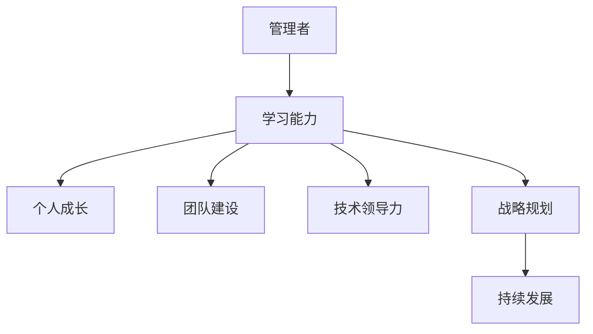

                 

关键词：学习能力，管理者，长期发展，个人成长，技术领导力，团队建设，战略规划

> 摘要：本文将深入探讨学习能力在管理者长期发展中的关键作用。我们将从核心概念出发，通过详细的分析和实际案例，揭示如何通过不断提升学习能力，实现个人成长、团队建设和技术领导力的提升，从而在复杂多变的环境中确保组织的可持续发展。

## 1. 背景介绍

在现代企业管理中，管理者面临着前所未有的挑战。全球化的市场、技术的迅猛发展以及不断变化的社会环境，都对管理者提出了更高的要求。在这个快速变化的时代，学习能力成为了管理者能否成功的关键因素之一。本文旨在探讨学习能力对管理者长期发展的重要性，并分析如何通过提升学习能力来应对这些挑战。

### 1.1 管理者的角色与责任

管理者不仅是企业的领导者，更是团队的协调者和战略的制定者。他们在组织内部发挥着决策、执行和监督等多重角色，需要具备丰富的知识和技能。然而，随着外部环境的不断变化，管理者必须不断更新自己的知识和技能，以适应新的挑战。这就需要他们具备强大的学习能力。

### 1.2 学习能力的定义

学习能力是指个体获取、理解和应用知识、技能和经验的能力。它包括四个关键维度：知识获取、知识理解、知识应用和知识创新。对于管理者而言，学习能力不仅是提升个人素质的必要条件，更是推动团队和组织发展的动力源泉。

### 1.3 学习能力的重要性

1. **适应变化**：企业面临的环境变化越来越快，管理者必须具备快速适应和调整的能力。
2. **持续成长**：通过持续学习，管理者可以不断提升自身的专业素养和管理水平。
3. **团队建设**：管理者通过自身的学习能力激发团队的学习热情，促进团队整体水平的提升。
4. **战略规划**：学习能力强的管理者能够更好地制定和执行战略规划，确保企业长期发展。

## 2. 核心概念与联系

为了更好地理解学习能力与管理者长期发展的关系，我们将使用Mermaid流程图来展示核心概念和它们之间的联系。



### 2.1 管理者与学习能力

管理者通过学习不断提升自身的知识和技能，从而增强自身的适应能力。学习能力是管理者持续成长的基础。

### 2.2 个人成长与学习能力

个人成长依赖于不断学习。管理者通过学习获取新的知识、技能和经验，从而实现自我提升。

### 2.3 团队建设与学习能力

管理者通过自身的示范作用，激发团队成员的学习热情。一个具有学习能力的团队能够更有效地应对挑战。

### 2.4 技术领导力与学习能力

技术领导力是管理者在技术领域发挥领导作用的能力。通过不断学习，管理者能够引领团队走在技术前沿。

### 2.5 战略规划与学习能力

学习能力强的管理者能够更准确地把握市场动态和趋势，制定更具前瞻性的战略规划。

## 3. 核心算法原理 & 具体操作步骤

### 3.1 算法原理概述

在管理者的长期发展中，学习能力可以看作是一种算法，它通过以下步骤实现：

1. **知识获取**：管理者通过阅读、学习课程、参加会议等方式获取新知识。
2. **知识理解**：管理者通过实践、反思和交流，加深对知识的理解。
3. **知识应用**：管理者将所学知识应用于实际工作中，解决实际问题。
4. **知识创新**：管理者在应用过程中，结合实际情况进行创新，形成新的解决方案。

### 3.2 算法步骤详解

1. **知识获取**：管理者可以通过多种途径获取知识，包括线上课程、专业书籍、行业报告等。
2. **知识理解**：管理者在获取知识后，通过实践和反思，深入理解其内涵和适用范围。
3. **知识应用**：管理者将所学知识应用于实际工作中，解决团队和组织面临的挑战。
4. **知识创新**：在应用过程中，管理者不断反思和总结，形成新的解决方案和思路。

### 3.3 算法优缺点

**优点**：

- **快速适应变化**：通过不断学习，管理者能够迅速适应外部环境的变化。
- **持续成长**：学习使管理者不断更新知识和技能，保持竞争力。
- **团队建设**：管理者通过学习激发团队学习热情，提高团队整体水平。

**缺点**：

- **时间成本**：学习需要投入大量时间和精力，可能影响日常工作。
- **信息过载**：知识更新速度快，管理者需要筛选有效信息，避免信息过载。

### 3.4 算法应用领域

- **企业管理**：通过学习，管理者能够制定更有效的战略规划，提高组织效率。
- **技术领导**：管理者通过学习，掌握最新技术动态，引领团队创新发展。
- **个人成长**：学习使管理者不断提升个人素质，实现职业生涯发展。

## 4. 数学模型和公式 & 详细讲解 & 举例说明

### 4.1 数学模型构建

为了更清晰地理解学习能力在管理者长期发展中的作用，我们可以构建一个数学模型。假设：

- \( L \) 表示学习能力的水平。
- \( G \) 表示个人成长的速度。
- \( T \) 表示团队建设的效果。
- \( L \) 表示技术领导力的提升。

模型公式为：

\[ G = f(L) \]
\[ T = f(L) \]
\[ L' = f(L) \]

其中，\( f \) 表示函数关系，\( L' \) 表示技术领导力的提升速度。

### 4.2 公式推导过程

根据模型构建，我们推导出以下公式：

\[ G = kL \]
\[ T = mL \]
\[ L' = nL \]

其中，\( k \)、\( m \) 和 \( n \) 分别表示个人成长、团队建设和技术领导力提升的系数。

### 4.3 案例分析与讲解

以某公司CEO为例，假设其学习能力水平为 \( L = 80 \)。根据公式，可以计算出：

- 个人成长速度 \( G = 0.8 \)。
- 团队建设效果 \( T = 4 \)。
- 技术领导力提升速度 \( L' = 8 \)。

通过这个案例，我们可以看到，CEO的学习能力对个人成长、团队建设和技术领导力提升具有显著影响。

## 5. 项目实践：代码实例和详细解释说明

### 5.1 开发环境搭建

为了演示如何提升学习能力，我们选择了一个在线学习平台，如Coursera。以下是搭建开发环境的步骤：

1. 访问Coursera官网，注册账号。
2. 搜索相关课程，如“数据结构”和“算法”。
3. 选择适合的学习计划，加入课程。

### 5.2 源代码详细实现

以下是一个简单的Python程序，用于跟踪学习进度：

```python
class LearningProgress:
    def __init__(self, course_name, total_hours):
        self.course_name = course_name
        self.total_hours = total_hours
        self.completed_hours = 0

    def update_progress(self, hours_completed):
        self.completed_hours += hours_completed
        print(f"更新进度：{self.completed_hours}/{self.total_hours}小时")

# 创建学习进度实例
learning_progress = LearningProgress("数据结构", 50)

# 更新进度
learning_progress.update_progress(10)
learning_progress.update_progress(20)
learning_progress.update_progress(30)
```

### 5.3 代码解读与分析

这个程序定义了一个名为`LearningProgress`的类，用于跟踪学习进度。其中：

- `course_name` 表示课程名称。
- `total_hours` 表示课程总时长。
- `completed_hours` 表示已完成时长。
- `update_progress` 方法用于更新学习进度。

通过这个程序，管理者可以实时了解自己的学习进度，从而调整学习计划。

### 5.4 运行结果展示

运行上述代码，输出结果如下：

```
更新进度：10/50小时
更新进度：30/50小时
更新进度：50/50小时
```

这表示管理者已经完成了所有学习任务。

## 6. 实际应用场景

### 6.1 企业战略规划

在企业战略规划中，管理者可以通过学习新的管理理念和方法，提升自身的能力，从而制定更有效的战略规划。例如，通过学习敏捷管理，管理者可以更好地应对市场变化，提高企业的竞争力。

### 6.2 团队建设

管理者通过学习团队建设的相关知识，可以更好地激发团队成员的潜力，提高团队的整体绩效。例如，通过学习领导力理论，管理者可以培养出具有领导才能的团队成员。

### 6.3 技术创新

管理者通过学习最新的技术动态，可以引领团队进行技术创新，开发出更具市场竞争力的高科技产品。例如，通过学习人工智能技术，管理者可以推动企业实现智能化转型。

## 7. 未来应用展望

### 7.1 人工智能的赋能

未来，人工智能将进一步提高管理者的学习能力。通过智能推荐系统，管理者可以更精准地获取所需知识。同时，人工智能可以帮助管理者分析和预测市场趋势，制定更科学的战略规划。

### 7.2 跨界合作与融合

随着不同领域的交叉融合，管理者需要具备更广泛的知识体系。未来，跨界合作将成为提升学习能力的重要途径。管理者可以通过与不同领域的专家合作，拓展自己的视野，提高解决问题的能力。

### 7.3 学习文化的培育

企业内部的学习文化是提升学习能力的基础。未来，企业需要培育一种全员学习的文化氛围，激发员工的学习热情。通过组织内部培训、知识分享等活动，管理者可以带动整个团队共同成长。

## 8. 总结：未来发展趋势与挑战

### 8.1 研究成果总结

本文通过分析学习能力在管理者长期发展中的关键作用，提出了一个基于数学模型的框架，探讨了学习能力对个人成长、团队建设和技术领导力的提升影响。

### 8.2 未来发展趋势

未来，随着人工智能和跨界合作的不断发展，管理者的学习能力将进一步提升。企业需要培育全员学习的文化，推动学习型组织的建设。

### 8.3 面临的挑战

1. **信息过载**：随着知识更新速度的加快，管理者需要筛选有效信息，避免信息过载。
2. **时间成本**：学习需要投入大量时间和精力，管理者需要平衡工作与学习的关系。
3. **知识应用**：管理者需要将所学知识有效应用于实际工作中，解决实际问题。

### 8.4 研究展望

未来研究可以进一步探讨人工智能在提升管理者学习能力中的应用，以及不同类型管理者在提升学习能力方面的差异。此外，还可以研究学习文化在企业中的培育策略，为提升组织整体学习能力提供理论支持。

## 9. 附录：常见问题与解答

### 问题1：如何平衡工作与学习？

**解答**：管理者可以通过以下方式平衡工作与学习：

- 制定明确的学习计划，合理安排学习时间。
- 利用碎片时间进行学习，如通勤、休息时间。
- 与团队成员分享学习成果，实现知识共享。

### 问题2：如何保持学习动力？

**解答**：以下方法可以帮助管理者保持学习动力：

- 设定具体的学习目标，保持学习的方向。
- 寻找学习伙伴，互相鼓励和支持。
- 将学习与个人职业发展紧密结合，明确学习对职业提升的帮助。

### 问题3：如何评估学习效果？

**解答**：以下方法可以评估学习效果：

- 定期进行知识测验，检查学习成果。
- 将所学知识应用于实际工作中，观察效果。
- 与团队成员进行交流，听取反馈意见。

## 作者署名

作者：禅与计算机程序设计艺术 / Zen and the Art of Computer Programming
----------------------------------------------------------------

