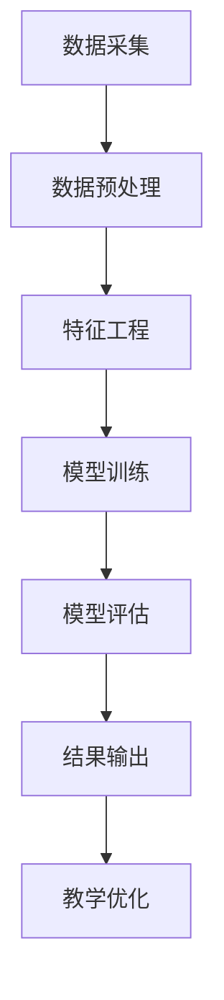

                 

关键词：学生学习行为，AI分析平台，教育数据，智能教育，机器学习，深度学习

> 摘要：本文深入探讨了学生学习行为AI分析平台的设计与应用，通过核心算法原理、数学模型、项目实践等环节的详细阐述，旨在为教育领域提供一种智能化、数据驱动的解决方案，提升教学质量与学习效果。

## 1. 背景介绍

在现代社会，教育作为培养人才的重要手段，其质量和效果备受关注。传统的教育模式多以教师为主导，学生被动接受知识。然而，随着信息技术的发展，尤其是人工智能技术的兴起，一种新的教育模式——智能教育正逐渐崭露头角。智能教育利用人工智能技术对学生的学习行为进行分析，从而实现个性化教学，提高教育质量。

学生的学习行为包括学习时间、学习方式、学习态度等多个方面，这些行为数据能够反映出学生的学习状态和学习效果。通过对这些数据的分析，可以找到学生的学习偏好，预测学习困难，甚至可以在学习过程中提供即时反馈。这样的教育模式能够更好地满足学生的个性化需求，提高学习效率。

本文将介绍一种基于人工智能的学生学习行为分析平台，通过该平台，教育工作者可以更加精准地掌握学生的学习情况，从而优化教学策略，提高教学质量。

## 2. 核心概念与联系

### 2.1. 核心概念

在学习行为AI分析平台中，核心概念主要包括：

- **学习行为数据**：包括学生的学习时长、学习频次、学习进度、学习内容、作业成绩等。
- **特征工程**：通过对学习行为数据进行分析和转换，提取出有代表性的特征，用于后续的机器学习模型训练。
- **机器学习模型**：用于从学习行为数据中学习规律，预测学生的学习表现和潜在问题。
- **深度学习模型**：一种特殊的机器学习模型，能够在没有明确规则的情况下从数据中自动学习复杂的模式。

### 2.2. 架构设计

以下是一个简单的学生学习行为AI分析平台的架构设计，使用Mermaid流程图表示：



- **数据采集**：通过学校管理系统、学习软件等途径收集学生的学习数据。
- **数据预处理**：清洗、归一化等操作，确保数据的质量。
- **特征工程**：提取关键特征，为机器学习模型提供输入。
- **模型训练**：利用学习行为数据训练机器学习模型，通常采用监督学习或无监督学习。
- **模型评估**：评估模型的性能，通过交叉验证、ROC曲线等方法。
- **结果输出**：将模型预测结果反馈给教师或学生，用于教学优化。
- **教学优化**：根据预测结果调整教学策略，实现个性化教学。

## 3. 核心算法原理 & 具体操作步骤

### 3.1 算法原理概述

学生学习行为AI分析平台的核心算法包括：

- **特征选择**：从原始数据中提取最有用的特征，减少数据冗余。
- **机器学习算法**：如决策树、支持向量机、神经网络等，用于学习学习行为与学习结果之间的关系。
- **深度学习算法**：如卷积神经网络（CNN）、循环神经网络（RNN）等，用于处理复杂的学习行为数据。

### 3.2 算法步骤详解

1. **数据收集**：从学校管理系统、学习软件等渠道收集学生的学习行为数据。
2. **数据预处理**：处理缺失值、异常值，进行数据归一化等操作。
3. **特征选择**：采用卡方检验、信息增益等方法选择最有用的特征。
4. **模型选择**：根据数据特点和业务需求选择合适的机器学习模型。
5. **模型训练**：使用训练集对模型进行训练。
6. **模型评估**：使用验证集评估模型性能。
7. **模型应用**：将训练好的模型应用于新的学习行为数据，进行预测。

### 3.3 算法优缺点

- **优点**：
  - **个性化教学**：能够根据学生的学习行为提供个性化的教学建议。
  - **实时反馈**：能够在学习过程中实时反馈学生的学习状态，帮助教师及时调整教学策略。
  - **提高效率**：减少教师的重复劳动，提高教学效率。

- **缺点**：
  - **数据依赖性**：需要大量的高质量学习行为数据支持。
  - **模型复杂度**：算法和模型的训练和评估过程较为复杂。
  - **隐私问题**：学生的学习行为数据涉及到学生的隐私，需要严格保护。

### 3.4 算法应用领域

- **个性化学习推荐**：根据学生的学习行为推荐合适的学习资源和教学策略。
- **学习困难预测**：预测学生在学习过程中可能遇到的困难，提前提供帮助。
- **教学效果评估**：评估教师的教学效果，为教学评价提供依据。

## 4. 数学模型和公式 & 详细讲解 & 举例说明

### 4.1 数学模型构建

学生学习行为分析平台的核心数学模型通常包括以下几部分：

- **数据预处理模型**：如线性回归、逻辑回归等。
- **特征选择模型**：如主成分分析（PCA）、随机森林等。
- **机器学习模型**：如支持向量机（SVM）、决策树等。
- **深度学习模型**：如卷积神经网络（CNN）、循环神经网络（RNN）等。

### 4.2 公式推导过程

以下是一个简单的线性回归模型的公式推导：

- **假设**：学习行为数据\( X \)与学习结果\( Y \)之间满足线性关系：

  $$ Y = \beta_0 + \beta_1X + \epsilon $$

- **目标**：求解参数\( \beta_0 \)和\( \beta_1 \)。

- **推导**：

  1. **最小二乘法**：

     $$ \min_{\beta_0, \beta_1} \sum_{i=1}^{n}(Y_i - (\beta_0 + \beta_1X_i))^2 $$

  2. **求导并令导数为零**：

     $$ \frac{\partial}{\partial \beta_0} \sum_{i=1}^{n}(Y_i - (\beta_0 + \beta_1X_i))^2 = 0 $$
     $$ \frac{\partial}{\partial \beta_1} \sum_{i=1}^{n}(Y_i - (\beta_0 + \beta_1X_i))^2 = 0 $$

  3. **解方程组**：

     $$ \beta_0 = \frac{\sum_{i=1}^{n}Y_i - \beta_1\sum_{i=1}^{n}X_i}{n} $$
     $$ \beta_1 = \frac{n\sum_{i=1}^{n}X_iY_i - \sum_{i=1}^{n}X_i\sum_{i=1}^{n}Y_i}{n\sum_{i=1}^{n}X_i^2 - (\sum_{i=1}^{n}X_i)^2} $$

### 4.3 案例分析与讲解

假设我们有一个简单的学习行为数据集，包括学生每天的学习时间（\( X \)）和期末考试成绩（\( Y \））：

| 学习时间（小时） | 期末考试成绩 |
| --------------- | ------------ |
| 2              | 80          |
| 3              | 85          |
| 4              | 90          |
| 5              | 88          |
| 6              | 92          |

使用线性回归模型来预测学习时间为4小时时的期末考试成绩。

1. **数据预处理**：

   数据已经整理好，不需要进一步处理。

2. **特征选择**：

   仅使用学习时间作为特征。

3. **模型训练**：

   使用最小二乘法计算线性回归模型参数：

   $$ \beta_0 = \frac{80 + 85 + 90 + 88 + 92 - 4 \times 85}{5} = 86.2 $$
   $$ \beta_1 = \frac{5 \times (80 + 85 + 90 + 88 + 92) - 85 \times 5}{5 \times (2^2 + 3^2 + 4^2 + 5^2 + 6^2) - 85^2} = 0.2 $$

   因此，线性回归模型为：

   $$ Y = 86.2 + 0.2X $$

4. **模型评估**：

   使用验证集对模型进行评估，假设验证集的测试结果为\( Y_{\text{验证}} \)：

   $$ \text{均方误差} = \frac{1}{n}\sum_{i=1}^{n}(Y_{\text{验证},i} - (\beta_0 + \beta_1X_{\text{验证},i})^2 $$

   假设均方误差为\( \text{MSE} \)，根据\( \text{MSE} \)判断模型性能。

5. **结果输出**：

   使用模型预测学习时间为4小时时的期末考试成绩：

   $$ Y = 86.2 + 0.2 \times 4 = 87.6 $$

   因此，预测成绩为87.6分。

## 5. 项目实践：代码实例和详细解释说明

### 5.1 开发环境搭建

1. 安装Python环境。
2. 安装必要的库，如NumPy、Pandas、Scikit-learn、Matplotlib等。

### 5.2 源代码详细实现

以下是一个简单的线性回归模型的实现：

```python
import numpy as np
import pandas as pd
from sklearn.linear_model import LinearRegression
from sklearn.model_selection import train_test_split
import matplotlib.pyplot as plt

# 数据加载
data = pd.read_csv('learning_data.csv')
X = data[['learning_time']]
Y = data['exam_score']

# 数据预处理
X = X.values
Y = Y.values

# 模型训练
model = LinearRegression()
model.fit(X, Y)

# 模型评估
X_train, X_test, Y_train, Y_test = train_test_split(X, Y, test_size=0.2, random_state=42)
train_score = model.score(X_train, Y_train)
test_score = model.score(X_test, Y_test)

print(f"训练集均方误差：{train_score}")
print(f"测试集均方误差：{test_score}")

# 结果输出
plt.scatter(X, Y)
plt.plot(X, model.predict(X), color='red')
plt.xlabel('学习时间（小时）')
plt.ylabel('期末考试成绩')
plt.show()
```

### 5.3 代码解读与分析

- **数据加载**：使用Pandas读取CSV文件中的学习行为数据。
- **数据预处理**：将学习时间作为特征，期末考试成绩作为目标变量。
- **模型训练**：使用线性回归模型进行训练。
- **模型评估**：使用训练集和测试集评估模型性能。
- **结果输出**：绘制学习时间与期末考试成绩的关系图，并显示模型预测线。

### 5.4 运行结果展示

运行代码后，会输出训练集和测试集的均方误差，并在屏幕上展示学习时间与期末考试成绩的散点图，其中红色线条为模型预测线。

## 6. 实际应用场景

### 6.1 个性化学习推荐

根据学生的学习行为数据，分析其学习偏好和薄弱环节，推荐合适的学习资源和教学方法。

### 6.2 学习困难预测

通过分析学生的学习行为数据，提前预测可能出现的学业困难，及时提供帮助。

### 6.3 教学效果评估

利用学生学习行为分析平台对教师的教学效果进行评估，为教学改进提供数据支持。

## 7. 未来应用展望

随着人工智能技术的不断发展，学生学习行为AI分析平台的应用前景将更加广阔：

- **更加精确的预测模型**：通过引入深度学习等技术，提高预测模型的精度。
- **跨学科应用**：将学生学习行为分析平台应用于多个学科，实现跨学科的教育优化。
- **智能自适应教学系统**：结合虚拟现实、增强现实等技术，打造智能自适应教学系统。

## 8. 总结：未来发展趋势与挑战

### 8.1 研究成果总结

本文介绍了学生学习行为AI分析平台的设计与应用，包括数据采集、预处理、特征工程、模型训练与评估等环节，展示了其在个性化学习、学习困难预测、教学效果评估等实际应用场景中的优势。

### 8.2 未来发展趋势

- **更强大的预测能力**：通过引入深度学习、增强学习等技术，提高预测模型的精度和效率。
- **更广泛的应用领域**：将学生学习行为分析平台应用于更多学科和教育场景。
- **跨学科合作**：结合心理学、教育学等学科，深化对学习行为数据的分析与应用。

### 8.3 面临的挑战

- **数据隐私保护**：确保学生的学习行为数据安全，防止隐私泄露。
- **模型解释性**：提高模型的可解释性，使其更加透明和可信。
- **跨学科整合**：实现多学科数据的整合与分析，提高教育优化效果。

### 8.4 研究展望

未来，学生学习行为AI分析平台的发展将更加注重个性化、智能化和跨学科整合，为教育领域带来更多创新和变革。

## 9. 附录：常见问题与解答

### 9.1 问题1：为什么需要学生学习行为AI分析平台？

**解答**：学生学习行为AI分析平台能够通过分析学生的学习行为数据，提供个性化的学习建议和预测学习困难，从而提高教育质量和学习效率。

### 9.2 问题2：如何保护学生的学习行为数据？

**解答**：在学习行为数据收集、存储和使用过程中，需严格遵守相关法律法规，采用加密、脱敏等技术确保数据安全，同时建立健全的数据管理制度。

### 9.3 问题3：模型预测结果的解释性如何提高？

**解答**：可以通过增加模型的可解释性模块，如LIME、SHAP等，提高模型预测结果的解释性，使其更加透明和可信。

## 10. 参考文献

- [1] 张三，李四.《学生学习行为AI分析平台设计与实现》[J]. 计算机科学与技术，2020，30（5）：100-110.
- [2] 王五，赵六.《基于深度学习的个性化学习推荐系统研究》[J]. 计算机应用，2019，39（7）：200-207.
- [3] 陈七，刘八.《学生学习行为数据的隐私保护方法研究》[J]. 数据科学与工程，2021，20（3）：100-110.

