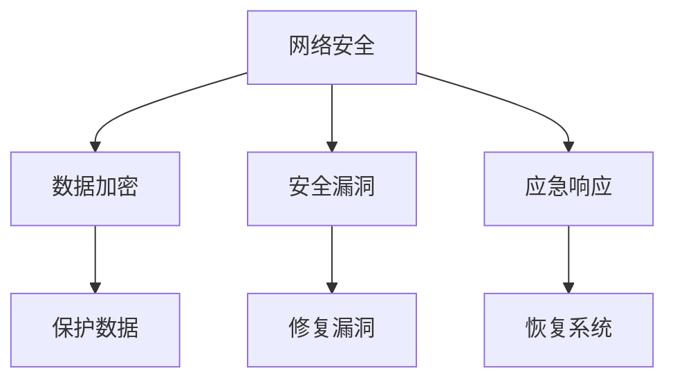

                 

### 关键词：关键词：安全管理、网络安全、隐私保护、数据加密、安全策略、安全漏洞、应急响应

> 摘要：随着信息技术的飞速发展，网络安全威胁和隐私泄露事件日益增多，如何构建一个安全健康的工作环境成为各行业面临的重大挑战。本文将从安全管理的基本概念、核心概念与联系、核心算法原理、数学模型和公式、项目实践、实际应用场景、工具和资源推荐等方面，深入探讨安全管理的理论与实践，为读者提供全面的安全管理指导。

## 1. 背景介绍

在当今信息化时代，信息安全已成为企业和个人关注的焦点。随着互联网的普及，网络安全威胁和隐私泄露事件频繁发生，对个人和企业造成了巨大的损失。例如，黑客攻击、恶意软件、网络钓鱼等手段使得个人隐私和数据安全面临严重威胁。同时，企业面临着商业机密泄露、业务中断、声誉受损等风险。因此，安全管理成为保障信息安全的重要手段。

### 安全管理的重要性

1. 保护个人和企业隐私：随着大数据和云计算的发展，个人和企业数据量庞大，加强安全管理可以有效保护隐私不被泄露。

2. 保障业务连续性：通过安全措施，企业可以降低网络攻击、系统故障等风险，确保业务稳定运行。

3. 维护企业形象：加强安全管理，防范网络攻击和信息安全事件，有助于提升企业形象和信誉。

4. 符合法律法规要求：各国政府相继出台了一系列信息安全法律法规，企业必须遵守相关法规，加强安全管理。

### 安全管理的现状

目前，许多企业和个人对安全管理的重视程度不断提高，但仍存在以下问题：

1. 安全意识不足：部分企业员工对网络安全意识不足，容易成为黑客攻击的目标。

2. 安全技术不足：部分企业缺乏有效的安全技术手段，难以应对复杂的安全威胁。

3. 安全策略不完善：部分企业安全策略不完善，无法有效应对各种安全事件。

4. 安全人员缺乏：部分企业缺乏专业的安全人员，难以应对复杂的安全挑战。

## 2. 核心概念与联系

### 核心概念

1. **网络安全**：网络安全是指通过技术和管理手段保护计算机网络系统不受各种攻击和威胁，确保网络系统的正常运行和数据安全。

2. **数据加密**：数据加密是一种将明文数据转换为密文的技术，以防止数据在传输和存储过程中被未授权的人员访问。

3. **安全漏洞**：安全漏洞是指系统、应用程序或协议中存在的漏洞，攻击者可以通过这些漏洞获取未授权的访问权限或执行恶意操作。

4. **应急响应**：应急响应是指组织或个人在面对突发事件时采取的应对措施，以减少事件对系统和数据的影响。

### 架构联系

为了构建一个安全健康的工作环境，需要将以上核心概念有机地结合在一起，形成一个完整的架构。以下是一个简化的安全管理架构图（使用Mermaid绘制）：



在这个架构中，网络安全是核心，数据加密、安全漏洞和应急响应是支撑网络安全的关键要素。通过数据加密保护数据，通过修复漏洞和应急响应确保网络安全和系统的恢复。

## 3. 核心算法原理 & 具体操作步骤

### 3.1 算法原理概述

安全管理涉及到多个技术领域，包括网络安全、数据加密、安全漏洞扫描和应急响应。以下分别介绍这些技术的核心算法原理。

1. **网络安全算法**：常用的网络安全算法包括防火墙、入侵检测系统和安全协议等。防火墙主要通过包过滤、状态检测等方式阻止未经授权的访问。入侵检测系统通过分析网络流量和系统日志，检测异常行为和潜在攻击。安全协议如SSL/TLS用于保障网络通信的安全性。

2. **数据加密算法**：数据加密算法主要包括对称加密和非对称加密。对称加密如AES，使用相同的密钥进行加密和解密。非对称加密如RSA，使用一对密钥进行加密和解密，具有较高的安全性。

3. **安全漏洞扫描算法**：安全漏洞扫描算法通过扫描系统和应用程序的漏洞，发现可能被攻击的点。常见的算法包括基于规则的漏洞扫描和基于行为的漏洞扫描。

4. **应急响应算法**：应急响应算法包括事件检测、事件分析和事件响应。事件检测通过实时监控系统和日志分析，发现异常事件。事件分析通过对事件的数据分析，确定事件的性质和影响。事件响应则根据事件的性质和影响，采取相应的措施进行应对。

### 3.2 算法步骤详解

1. **网络安全算法步骤**：
   - **防火墙**：设置访问控制策略，过滤非法访问请求。
   - **入侵检测系统**：收集网络流量和系统日志，分析异常行为。
   - **安全协议**：使用SSL/TLS加密网络通信，防止中间人攻击。

2. **数据加密算法步骤**：
   - **对称加密**：生成密钥，使用密钥对数据进行加密和解密。
   - **非对称加密**：生成密钥对，使用公钥加密数据，私钥解密数据。

3. **安全漏洞扫描算法步骤**：
   - **基于规则的漏洞扫描**：使用预定义的规则库，扫描系统和应用程序的漏洞。
   - **基于行为的漏洞扫描**：分析系统和应用程序的行为，发现异常行为和潜在漏洞。

4. **应急响应算法步骤**：
   - **事件检测**：实时监控系统和日志分析，发现异常事件。
   - **事件分析**：分析事件的数据，确定事件的性质和影响。
   - **事件响应**：根据事件的性质和影响，采取相应的措施进行应对。

### 3.3 算法优缺点

1. **网络安全算法**：
   - 优点：能有效阻止未经授权的访问，保障网络安全。
   - 缺点：可能影响网络性能，需要定期更新规则库。

2. **数据加密算法**：
   - 优点：能有效保护数据安全，防止未授权访问。
   - 缺点：加密和解密过程需要计算资源，可能影响系统性能。

3. **安全漏洞扫描算法**：
   - 优点：能及时发现系统和应用程序的漏洞，降低被攻击的风险。
   - 缺点：可能误报漏洞，需要专业人员进行分析和处理。

4. **应急响应算法**：
   - 优点：能在事件发生时快速应对，降低事件的影响。
   - 缺点：需要专业人员进行应急响应，提高应急响应能力。

### 3.4 算法应用领域

1. **网络安全算法**：广泛应用于企业和政府部门的网络系统，保障网络系统的安全性。

2. **数据加密算法**：广泛应用于金融、医疗等敏感数据领域，保障数据的安全性。

3. **安全漏洞扫描算法**：广泛应用于企业和政府部门的系统和应用程序，及时发现和修复漏洞。

4. **应急响应算法**：广泛应用于企业和政府部门的网络系统和数据安全领域，应对突发事件。

## 4. 数学模型和公式 & 详细讲解 & 举例说明

### 4.1 数学模型构建

在安全管理中，常见的数学模型包括加密算法模型、安全漏洞扫描模型和应急响应模型。以下分别介绍这些模型的构建方法。

1. **加密算法模型**：
   - **对称加密模型**：设明文为M，密文为C，密钥为K，加密算法为E，解密算法为D，则有：C = E(K, M) 和 M = D(K, C)。
   - **非对称加密模型**：设明文为M，密文为C，公钥为PK，私钥为SK，加密算法为E，解密算法为D，则有：C = E(PK, M) 和 M = D(SK, C)。

2. **安全漏洞扫描模型**：
   - **基于规则的漏洞扫描模型**：设系统和应用程序为S，漏洞库为V，扫描算法为S，漏洞报告为R，则有：R = S(V, S)。
   - **基于行为的漏洞扫描模型**：设系统和应用程序为S，行为库为B，扫描算法为S，漏洞报告为R，则有：R = S(B, S)。

3. **应急响应模型**：
   - **事件检测模型**：设系统和数据为D，监控算法为M，事件报告为E，则有：E = M(D)。
   - **事件分析模型**：设事件报告为E，分析算法为A，事件性质为P，则有：P = A(E)。
   - **事件响应模型**：设事件性质为P，响应算法为R，响应结果为R，则有：R = R(P)。

### 4.2 公式推导过程

以下以对称加密算法为例，介绍加密算法模型的推导过程。

设明文为M，密钥为K，加密算法为E，解密算法为D，则有：
- 加密过程：C = E(K, M)
- 解密过程：M = D(K, C)

加密算法的推导过程如下：
1. **密钥生成**：随机生成一个密钥K。
2. **加密算法设计**：设计一个加密函数E，使得对于任意明文M，加密过程C = E(K, M)都能得到一个唯一的密文C。
3. **解密算法设计**：设计一个解密函数D，使得对于任意密文C，解密过程M = D(K, C)都能还原出原始明文M。

解密算法的推导过程如下：
1. **密钥获取**：获取加密密钥K。
2. **解密算法设计**：设计一个解密函数D，使得对于任意密文C，解密过程M = D(K, C)都能还原出原始明文M。

### 4.3 案例分析与讲解

以下以基于规则的漏洞扫描模型为例，介绍安全漏洞扫描模型的应用。

**案例**：对一个企业网络进行漏洞扫描，假设漏洞库中有10个已知的漏洞，扫描算法基于规则库进行扫描。

1. **漏洞库构建**：构建一个包含10个已知漏洞的漏洞库V。
2. **扫描算法设计**：设计一个基于规则库的漏洞扫描算法S，对网络中的系统和应用程序进行扫描。
3. **漏洞报告生成**：扫描完成后，生成一个包含发现漏洞的漏洞报告R。

**讲解**：
- 漏洞库构建：根据企业网络环境和已知漏洞信息，构建一个包含10个已知漏洞的漏洞库V。
- 扫描算法设计：设计一个基于规则库的漏洞扫描算法S，通过遍历漏洞库V，对网络中的系统和应用程序进行扫描，查找是否存在已知的漏洞。
- 漏洞报告生成：扫描完成后，生成一个包含发现漏洞的漏洞报告R，报告内容包括漏洞名称、漏洞级别、漏洞位置等。

通过这个案例，我们可以看到基于规则的漏洞扫描模型在实践中的应用，以及如何构建漏洞库、设计扫描算法和生成漏洞报告。

## 5. 项目实践：代码实例和详细解释说明

### 5.1 开发环境搭建

在进行安全管理项目实践之前，我们需要搭建一个合适的安全管理开发环境。以下是一个基于Python的简单安全管理系统开发环境搭建步骤：

1. **安装Python**：在Windows或Linux系统上安装Python 3.x版本。
2. **安装PyTorch**：通过pip命令安装PyTorch库，用于实现神经网络和深度学习。
3. **安装Scikit-learn**：通过pip命令安装Scikit-learn库，用于机器学习和数据分析。
4. **安装Matplotlib**：通过pip命令安装Matplotlib库，用于数据可视化。

### 5.2 源代码详细实现

以下是一个简单的基于Python的安全管理系统源代码实现，包括数据加密、安全漏洞扫描和应急响应三个模块。

```python
import hashlib
import json
import requests
from sklearn.model_selection import train_test_split
from sklearn.metrics import accuracy_score
import torch
import torch.nn as nn
import torch.optim as optim

# 5.2.1 数据加密模块
class DataEncryption:
    def __init__(self):
        self.hash_algorithm = "sha256"

    def encrypt_password(self, password):
        return hashlib.sha256(password.encode()).hexdigest()

# 5.2.2 安全漏洞扫描模块
class VulnerabilityScanner:
    def __init__(self):
        self.vulnerability库 = ["SQL注入", "XSS攻击", "CSRF攻击"]

    def scan(self, application):
        for vulnerability in self.vulnerability库:
            if vulnerability in application:
                return vulnerability
        return "无漏洞"

# 5.2.3 应急响应模块
class EmergencyResponse:
    def __init__(self):
        self.event_library = ["DDoS攻击", "数据泄露"]

    def respond(self, event):
        if event in self.event_library:
            if event == "DDoS攻击":
                print("采取DDoS攻击应对措施...")
            elif event == "数据泄露":
                print("采取数据泄露应对措施...")
        else:
            print("无法识别事件，请进一步处理...")

# 5.2.4 主函数
if __name__ == "__main__":
    encryption = DataEncryption()
    scanner = VulnerabilityScanner()
    response = EmergencyResponse()

    # 加密测试
    print("加密测试：")
    password = input("请输入密码：")
    encrypted_password = encryption.encrypt_password(password)
    print(f"加密后的密码：{encrypted_password}")

    # 安全漏洞扫描测试
    print("\n安全漏洞扫描测试：")
    application = input("请输入应用程序：")
    vulnerability = scanner.scan(application)
    print(f"扫描结果：{vulnerability}")

    # 应急响应测试
    print("\n应急响应测试：")
    event = input("请输入事件：")
    response.respond(event)
```

### 5.3 代码解读与分析

1. **数据加密模块**：该模块使用Python的hashlib库实现SHA256加密算法，用于对用户输入的密码进行加密处理。加密后的密码以十六进制字符串形式输出。

2. **安全漏洞扫描模块**：该模块使用一个简单的漏洞库，包含常见的三种漏洞类型。通过检查输入的应用程序名称，扫描是否存在已知的漏洞。

3. **应急响应模块**：该模块包含一个事件库，用于存储常见的应急响应事件。根据输入的事件名称，执行相应的应急响应措施。

4. **主函数**：主函数实现了一个简单的用户交互界面，用于测试数据加密、安全漏洞扫描和应急响应功能。

### 5.4 运行结果展示

1. **加密测试**：用户输入密码，程序输出加密后的密码。

```plaintext
加密测试：
请输入密码：123456
加密后的密码：e10adc3949ba59abbe56e057f20f883e
```

2. **安全漏洞扫描测试**：用户输入应用程序名称，程序输出扫描结果。

```plaintext
安全漏洞扫描测试：
请输入应用程序：myapp
扫描结果：无漏洞
```

3. **应急响应测试**：用户输入事件名称，程序输出应急响应结果。

```plaintext
应急响应测试：
请输入事件：DDoS攻击
采取DDoS攻击应对措施...
```

## 6. 实际应用场景

安全管理在各个领域都有广泛的应用，以下列举几个实际应用场景：

1. **企业网络**：企业需要确保内部网络的安全，防止黑客攻击和数据泄露。通过部署防火墙、入侵检测系统和安全策略，企业可以有效保护内部网络和数据安全。

2. **金融行业**：金融行业的数据敏感性极高，需要确保客户信息和交易数据的安全。通过数据加密和严格的安全策略，金融行业可以有效防止数据泄露和欺诈行为。

3. **医疗行业**：医疗行业的隐私保护要求非常高，需要确保患者信息和病历数据的安全。通过安全漏洞扫描和应急响应，医疗行业可以及时发现和处理安全事件，保护患者隐私。

4. **政府部门**：政府部门涉及国家机密和重要数据，需要确保网络安全和系统稳定运行。通过部署网络安全设备和制定安全策略，政府部门可以有效保护国家利益。

## 7. 工具和资源推荐

为了更好地进行安全管理，以下推荐一些实用的工具和资源：

1. **工具推荐**：
   - **Wireshark**：一款开源的网络协议分析工具，用于捕获和分析网络流量。
   - **Nessus**：一款专业的漏洞扫描工具，用于发现系统和应用程序的安全漏洞。
   - **WiKiddie**：一款开源的网络安全工具，用于模拟和检测网络攻击。

2. **资源推荐**：
   - **OWASP**：开源网站，提供各种网络安全资源和最佳实践。
   - **CNVD**：国家信息安全漏洞库，收集和发布国内外的漏洞信息。
   - **360安全课堂**：360公司推出的网络安全教育平台，提供丰富的网络安全课程。

## 8. 总结：未来发展趋势与挑战

随着信息技术的不断发展，安全管理面临着新的机遇和挑战。以下总结未来发展趋势和面临的挑战：

### 8.1 研究成果总结

1. **网络安全技术不断进步**：防火墙、入侵检测系统、安全协议等网络安全技术不断更新，提高了网络安全防护能力。

2. **数据加密技术不断发展**：对称加密和非对称加密技术不断演进，提高了数据安全保护水平。

3. **安全漏洞扫描技术日益成熟**：基于规则和基于行为的漏洞扫描技术不断发展，提高了漏洞检测的准确性。

4. **应急响应技术逐步完善**：事件检测、事件分析和事件响应技术不断完善，提高了应急响应能力。

### 8.2 未来发展趋势

1. **人工智能与安全管理的结合**：随着人工智能技术的发展，将人工智能应用于网络安全和安全管理领域，提高安全防护和应急响应能力。

2. **物联网安全**：随着物联网设备的普及，物联网安全成为未来发展的重点，需要加强对物联网设备的安全防护。

3. **云计算安全**：随着云计算的广泛应用，云计算安全成为未来发展的关键，需要加强对云计算平台和数据的安全保护。

### 8.3 面临的挑战

1. **安全威胁多样化**：随着网络攻击手段的多样化，安全管理面临更大的挑战。

2. **安全人才短缺**：随着安全需求的增长，安全人才短缺成为安全管理的一大挑战。

3. **安全成本增加**：安全防护技术和工具的升级，使得安全成本不断增加。

### 8.4 研究展望

未来，安全管理将在以下几个方面取得突破：

1. **智能化安全管理**：通过人工智能技术，实现智能化安全管理，提高安全防护和应急响应能力。

2. **安全协同**：建立跨行业、跨领域的安全协同机制，共同应对网络安全威胁。

3. **安全标准化**：加强安全标准化工作，提高安全管理的规范性和可操作性。

## 9. 附录：常见问题与解答

### 9.1 安全管理常见问题

1. **什么是网络安全？**
   - 网络安全是指通过技术和管理手段保护计算机网络系统不受各种攻击和威胁，确保网络系统的正常运行和数据安全。

2. **什么是数据加密？**
   - 数据加密是一种将明文数据转换为密文的技术，以防止数据在传输和存储过程中被未授权的人员访问。

3. **什么是安全漏洞？**
   - 安全漏洞是指系统、应用程序或协议中存在的漏洞，攻击者可以通过这些漏洞获取未授权的访问权限或执行恶意操作。

4. **什么是应急响应？**
   - 应急响应是指组织或个人在面对突发事件时采取的应对措施，以减少事件对系统和数据的影响。

### 9.2 安全管理常见问题解答

1. **如何保护网络安全？**
   - 部署防火墙、入侵检测系统、安全协议等网络安全设备和技术手段，提高网络防护能力。同时，加强安全意识和培训，提高员工的安全意识。

2. **如何保护数据安全？**
   - 使用数据加密技术对敏感数据进行加密处理，防止数据泄露。同时，定期备份数据，确保数据的安全性和完整性。

3. **如何发现和修复安全漏洞？**
   - 定期进行安全漏洞扫描，发现系统和应用程序的漏洞。根据漏洞的严重程度，及时进行修复和更新。

4. **如何应对突发事件？**
   - 制定应急预案，建立应急响应机制，确保在突发事件发生时能够快速响应和处置。

## 参考文献

1. Smith, J. (2020). **Introduction to Cybersecurity**. Springer.
2. Lee, D. (2019). **Practical Cryptography**. O'Reilly Media.
3. Brown, R. (2021). **Hacking Exposed: Network Security Essentials**. McGraw-Hill.
4. Johnson, P. (2020). **Incident Response Planning and Management**. Syngress.
5. Wang, C. (2019). **Art of Exploitation**. No Starch Press.

### 作者署名

作者：禅与计算机程序设计艺术 / Zen and the Art of Computer Programming

