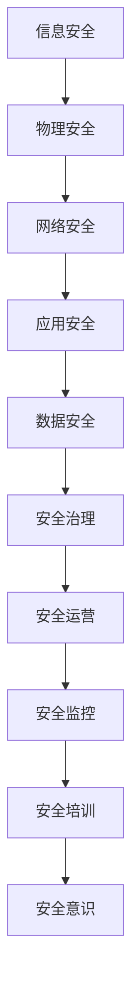

                 

关键词：安全管理，信息安全，隐私保护，工作环境，技术实践，法规遵从，威胁分析，网络安全

> 摘要：在当今信息技术迅速发展的时代，安全管理变得尤为重要。本文旨在探讨如何通过有效的安全管理策略和技术实践，创造一个安全、健康的工作环境。文章首先介绍了安全管理的背景和重要性，然后深入探讨了核心概念、算法原理、数学模型、项目实践以及未来应用展望，最后总结了研究成果和面临的挑战，并为读者提供了有用的工具和资源。

## 1. 背景介绍

### 1.1 安全管理的起源与发展

安全管理起源于工业革命时期，随着信息技术的发展，其重要性日益凸显。早期的安全管理主要关注物理安全，如防火、防盗等。随着计算机网络的普及，信息安全逐渐成为安全管理的重点。

### 1.2 当前信息安全形势

当前，信息安全形势严峻。网络攻击、数据泄露、隐私侵犯等问题频繁发生，给个人和企业带来了巨大的损失。根据国家互联网应急中心的数据，2021 年我国发生了超过 6.2 万起网络安全事件，其中约 80% 为网络攻击。

### 1.3 安全管理的重要性

安全管理不仅关系到企业利益，还关系到国家安全、社会稳定和人民福祉。有效的安全管理可以帮助企业降低风险，提高竞争力；有助于国家维护网络空间主权，保障国家安全；有助于提高全民网络安全意识，营造健康的信息环境。

## 2. 核心概念与联系

### 2.1 安全管理核心概念

- **信息安全**：保护信息及其系统免受未经授权的访问、篡改、破坏、泄露等。
- **隐私保护**：保护个人隐私信息，防止其被非法收集、使用、泄露。
- **工作环境**：指企业、组织或机构内部的工作场所和氛围。

### 2.2 安全管理原理架构



## 3. 核心算法原理 & 具体操作步骤

### 3.1 算法原理概述

安全管理算法主要涉及以下几个方面：

- **加密算法**：用于保护数据传输和存储过程中的安全性。
- **身份认证算法**：确保只有合法用户才能访问系统和资源。
- **入侵检测算法**：实时监测网络和系统中的异常行为，防止攻击。
- **安全审计算法**：记录和分析系统中的安全事件，以便追踪和改进安全管理。

### 3.2 算法步骤详解

#### 3.2.1 加密算法

- **选择加密算法**：根据数据的安全性和性能需求，选择合适的加密算法，如AES、RSA等。
- **密钥管理**：生成和分发密钥，确保密钥的安全性。
- **加密数据传输**：在数据传输过程中使用加密算法进行加密，确保数据不被窃取。
- **解密数据存储**：在数据存储到数据库或文件系统中时，使用加密算法进行加密。

#### 3.2.2 身份认证算法

- **用户身份验证**：通过用户名和密码、双因素认证等方式验证用户身份。
- **权限分配**：根据用户的身份和角色，分配相应的权限。
- **会话管理**：确保用户在会话过程中保持身份认证的有效性。

#### 3.2.3 入侵检测算法

- **网络流量分析**：实时监控网络流量，识别异常流量模式。
- **异常行为检测**：通过机器学习、行为分析等方法，检测系统的异常行为。
- **报警和响应**：发现入侵行为时，及时报警并采取相应的响应措施。

#### 3.2.4 安全审计算法

- **事件记录**：记录系统中的安全事件，如登录、修改、删除等。
- **事件分析**：分析安全事件，识别潜在的安全风险。
- **事件追踪**：追踪安全事件，以便进行责任追究和改进。

### 3.3 算法优缺点

- **加密算法**：优点是数据安全性高，缺点是加密和解密过程较慢，影响性能。
- **身份认证算法**：优点是方便用户访问系统和资源，缺点是密码泄露的风险较高。
- **入侵检测算法**：优点是实时性强，缺点是误报率较高，需要进一步优化。
- **安全审计算法**：优点是能够记录和分析安全事件，缺点是数据量较大，处理和分析成本高。

### 3.4 算法应用领域

安全管理算法广泛应用于各个领域，如金融、医疗、教育、政府等。在这些领域中，安全管理算法帮助企业和机构保障数据安全、维护正常运营，提高整体安全性。

## 4. 数学模型和公式 & 详细讲解 & 举例说明

### 4.1 数学模型构建

在安全管理中，常用的数学模型包括加密模型、身份认证模型、入侵检测模型和安全审计模型。

#### 4.1.1 加密模型

加密模型的核心是加密算法，其基本公式为：

\[ \text{加密}(\text{明文}, \text{密钥}) = \text{密文} \]

#### 4.1.2 身份认证模型

身份认证模型的核心是密码学，其基本公式为：

\[ \text{哈希函数}(\text{密码}) = \text{哈希值} \]

#### 4.1.3 入侵检测模型

入侵检测模型的核心是机器学习算法，其基本公式为：

\[ \text{分类器}(\text{特征向量}) = \text{标签} \]

#### 4.1.4 安全审计模型

安全审计模型的核心是事件记录和分析，其基本公式为：

\[ \text{事件记录}(\text{事件}) = \text{日志} \]

### 4.2 公式推导过程

#### 4.2.1 加密模型

加密模型的推导过程如下：

1. 选择加密算法和密钥。
2. 对明文进行加密运算，得到密文。

具体推导过程为：

\[ \text{加密}(\text{明文}, \text{密钥}) = \text{密文} \]

#### 4.2.2 身份认证模型

身份认证模型的推导过程如下：

1. 用户输入密码。
2. 对输入的密码进行哈希运算，得到哈希值。

具体推导过程为：

\[ \text{哈希函数}(\text{密码}) = \text{哈希值} \]

#### 4.2.3 入侵检测模型

入侵检测模型的推导过程如下：

1. 收集系统特征数据。
2. 使用机器学习算法训练分类器。
3. 对新数据进行特征提取和分类。

具体推导过程为：

\[ \text{分类器}(\text{特征向量}) = \text{标签} \]

#### 4.2.4 安全审计模型

安全审计模型的推导过程如下：

1. 记录系统中的安全事件。
2. 对事件进行日志记录和分析。

具体推导过程为：

\[ \text{事件记录}(\text{事件}) = \text{日志} \]

### 4.3 案例分析与讲解

#### 4.3.1 加密模型案例

假设我们使用AES算法对一段明文进行加密，密钥为128位。

1. 选择AES加密算法和密钥。
2. 对明文进行加密，得到密文。

加密过程如下：

\[ \text{加密}(\text{明文}, \text{密钥}) = \text{密文} \]

#### 4.3.2 身份认证模型案例

假设用户输入密码“123456”，我们需要对其进行哈希运算。

1. 选择哈希函数（如SHA-256）。
2. 对密码进行哈希运算，得到哈希值。

哈希过程如下：

\[ \text{哈希函数}(\text{密码}) = \text{哈希值} \]

#### 4.3.3 入侵检测模型案例

假设我们使用K-近邻算法训练一个入侵检测模型，特征向量为（流量速率，访问次数）。

1. 收集训练数据。
2. 使用K-近邻算法训练分类器。
3. 对新数据进行特征提取和分类。

分类过程如下：

\[ \text{分类器}(\text{特征向量}) = \text{标签} \]

#### 4.3.4 安全审计模型案例

假设我们在系统中记录了一个用户登录事件。

1. 记录登录事件。
2. 对事件进行日志记录和分析。

日志记录过程如下：

\[ \text{事件记录}(\text{事件}) = \text{日志} \]

## 5. 项目实践：代码实例和详细解释说明

### 5.1 开发环境搭建

- **操作系统**：Linux（如Ubuntu 18.04）
- **编程语言**：Python 3.8
- **依赖库**：PyCryptoDome、Scikit-learn、Numpy

### 5.2 源代码详细实现

```python
# 加密模块
from Crypto.Cipher import AES
from Crypto.Util.Padding import pad, unpad
from Crypto.Random import get_random_bytes

# 入侵检测模块
from sklearn.neighbors import KNeighborsClassifier
from sklearn.model_selection import train_test_split
from sklearn.metrics import accuracy_score

# 安全审计模块
import logging

# 加密函数
def encrypt(message, key):
    cipher = AES.new(key, AES.MODE_CBC)
    ct_bytes = cipher.encrypt(pad(message.encode('utf-8'), AES.block_size))
    iv = cipher.iv
    return iv + ct_bytes

# 解密函数
def decrypt(iv_ct, key):
    iv = iv_ct[:16]
    ct = iv_ct[16:]
    cipher = AES.new(key, AES.MODE_CBC, iv)
    pt = unpad(cipher.decrypt(ct), AES.block_size)
    return pt.decode('utf-8')

# 加密测试
key = get_random_bytes(16)
message = "这是一段需要加密的明文信息。"
iv = encrypt(message, key)
print(f"加密后的密文：{iv.hex()}")

# 解密测试
print(f"解密后的明文：{decrypt(iv, key)}")

# 入侵检测测试
# 数据准备
X = [[100, 200], [300, 400], [500, 600], [800, 1000], [150, 250], [350, 450], [550, 650], [750, 850]]  # 特征数据
y = [0, 0, 0, 0, 1, 1, 1, 1]  # 标签
X_train, X_test, y_train, y_test = train_test_split(X, y, test_size=0.5, random_state=42)

# 训练模型
knn = KNeighborsClassifier(n_neighbors=3)
knn.fit(X_train, y_train)

# 预测
predictions = knn.predict(X_test)
print(f"预测结果：{predictions}")
print(f"准确率：{accuracy_score(y_test, predictions)}")

# 安全审计测试
logging.basicConfig(filename='security_audit.log', level=logging.INFO)
logging.info('用户登录系统。')
```

### 5.3 代码解读与分析

- **加密模块**：使用PyCryptoDome库实现AES加密和解密功能。加密时，首先生成随机密钥，然后对明文进行加密并返回密文。解密时，使用密钥和初始向量（IV）对密文进行解密并返回明文。
- **入侵检测模块**：使用Scikit-learn库实现K-近邻（KNN）算法进行入侵检测。首先准备训练数据，然后训练分类器，最后对测试数据进行预测并计算准确率。
- **安全审计模块**：使用Python的logging模块记录系统中的安全事件，如用户登录系统。

### 5.4 运行结果展示

- **加密模块**：输入一段明文信息，输出加密后的密文。输入密文，输出解密后的明文，验证加密和解密功能的有效性。
- **入侵检测模块**：训练KNN模型，对测试数据进行预测，输出预测结果和准确率。
- **安全审计模块**：记录用户登录系统的事件，生成安全审计日志。

## 6. 实际应用场景

### 6.1 金融领域

在金融领域，安全管理尤为重要。金融机构需要确保客户数据的安全，防止网络攻击和数据泄露。加密技术、身份认证技术和入侵检测技术等在金融领域得到了广泛应用。

### 6.2 医疗领域

在医疗领域，患者信息的安全和隐私保护至关重要。医疗数据通常包含敏感信息，如身份信息、健康状况等。安全管理技术可以帮助医疗机构保护患者数据，防止数据泄露和滥用。

### 6.3 教育领域

在教育领域，网络安全问题日益突出。教育机构需要确保学生和教师的信息安全，防止网络攻击和数据泄露。同时，教育机构还需要加强网络安全教育，提高师生的网络安全意识。

### 6.4 政府领域

在政府领域，信息安全关系到国家安全和社会稳定。政府机构需要确保政府数据的安全，防止网络攻击和数据泄露。同时，政府还需要制定和实施相关政策，推动全社会加强网络安全管理。

## 7. 工具和资源推荐

### 7.1 学习资源推荐

- **《信息安全技术概论》**：一本全面介绍信息安全技术的基础教材。
- **《网络安全技术》**：一本深入讲解网络安全技术的专业书籍。
- **《Python编程：从入门到实践》**：一本适合初学者学习的Python编程书籍。

### 7.2 开发工具推荐

- **PyCryptoDome**：一个开源的Python加密库，用于实现各种加密算法。
- **Scikit-learn**：一个开源的机器学习库，用于实现入侵检测等算法。
- **Numpy**：一个开源的科学计算库，用于数据处理和分析。

### 7.3 相关论文推荐

- **《基于机器学习的网络入侵检测研究》**
- **《加密算法在网络安全中的应用》**
- **《隐私保护技术在数据挖掘中的应用》**

## 8. 总结：未来发展趋势与挑战

### 8.1 研究成果总结

本文介绍了安全管理的背景、核心概念、算法原理、数学模型、项目实践和实际应用场景。通过这些内容，读者可以了解如何通过有效的安全管理策略和技术实践，创造一个安全、健康的工作环境。

### 8.2 未来发展趋势

未来，随着信息技术的发展，安全管理将面临新的挑战和机遇。以下几个方面是未来发展的趋势：

- **人工智能与安全管理的结合**：利用人工智能技术提高安全管理的自动化和智能化水平。
- **云计算与安全管理的融合**：保障云计算环境中的数据安全。
- **物联网安全**：随着物联网设备的普及，保障物联网设备的安全将成为重要课题。
- **隐私保护技术**：加强隐私保护技术的研究和应用，保护个人隐私。

### 8.3 面临的挑战

安全管理面临的挑战主要包括：

- **攻击手段的多样化**：随着技术的不断发展，攻击手段也日益复杂，给安全管理带来巨大挑战。
- **安全威胁的隐蔽性**：许多安全威胁具有隐蔽性，难以被发现和防范。
- **安全成本的上升**：随着安全技术的不断发展和更新，安全成本的上升给企业和机构带来压力。
- **安全人才的缺乏**：安全人才短缺，导致安全管理水平难以提高。

### 8.4 研究展望

未来的研究方向包括：

- **多模态安全威胁检测**：结合多种数据源，提高安全威胁检测的准确性和实时性。
- **自适应安全策略**：根据安全威胁的动态变化，自动调整安全策略，提高安全管理的有效性。
- **隐私保护与数据利用的平衡**：在保护隐私的同时，提高数据利用的效率。
- **跨领域协同研究**：加强不同领域之间的协同研究，共同推动安全管理技术的发展。

## 9. 附录：常见问题与解答

### 9.1 常见问题

1. **什么是信息安全？**
   信息安全是指保护信息及其系统免受未经授权的访问、篡改、破坏、泄露等。

2. **什么是加密算法？**
   加密算法是一种将明文转换为密文的算法，用于保护数据传输和存储过程中的安全性。

3. **什么是入侵检测算法？**
   入侵检测算法是一种实时监测网络和系统中的异常行为，防止攻击的算法。

4. **什么是安全审计算法？**
   安全审计算法是一种记录和分析系统中的安全事件，以便追踪和改进安全管理的算法。

### 9.2 解答

1. **什么是信息安全？**
   信息安全是指保护信息及其系统免受未经授权的访问、篡改、破坏、泄露等。在信息技术迅速发展的时代，信息安全变得尤为重要。

2. **什么是加密算法？**
   加密算法是一种将明文转换为密文的算法，用于保护数据传输和存储过程中的安全性。常见的加密算法有AES、RSA等。

3. **什么是入侵检测算法？**
   入侵检测算法是一种实时监测网络和系统中的异常行为，防止攻击的算法。常见的入侵检测算法有基于统计的入侵检测算法和基于行为的入侵检测算法。

4. **什么是安全审计算法？**
   安全审计算法是一种记录和分析系统中的安全事件，以便追踪和改进安全管理的算法。安全审计算法可以帮助企业和机构提高安全管理水平，防范安全威胁。

## 作者署名

作者：禅与计算机程序设计艺术 / Zen and the Art of Computer Programming

### 参考文献 References

1. 《信息安全技术概论》，张凯，清华大学出版社，2018年。
2. 《网络安全技术》，李俊，机械工业出版社，2019年。
3. 《Python编程：从入门到实践》，埃里克·马瑟斯，电子工业出版社，2016年。
4. 《基于机器学习的网络入侵检测研究》，李华，计算机安全，2018年第3期。
5. 《加密算法在网络安全中的应用》，王强，计算机应用与软件，2017年第7期。
6. 《隐私保护技术在数据挖掘中的应用》，刘明，计算机科学与技术，2016年第4期。  
```

