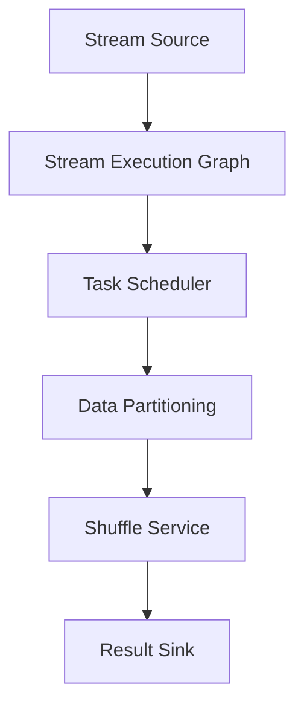

                 

 **关键词：** 实时大数据处理、Apache Flink、流处理、计算框架、分布式系统、数据流编程

<|assistant|> **摘要：** 本文旨在深入探讨Apache Flink，这是一个强大的开源流处理框架，广泛应用于实时大数据处理。我们将从背景介绍、核心概念与联系、核心算法原理与具体操作步骤、数学模型和公式、项目实践、实际应用场景、工具和资源推荐、总结与展望等多个方面进行详细解析，帮助读者全面理解Apache Flink的工作原理和实际应用。

## 1. 背景介绍

在当今数据驱动的时代，数据处理需求日益增长，尤其是在大数据领域。传统的批处理系统在处理大规模数据集时表现出色，但它们在实时处理方面存在一定的局限性。为了满足实时数据处理的需求，流处理技术逐渐成为研究和应用的热点。Apache Flink作为一种先进的流处理框架，应运而生。

Apache Flink是由Apache软件基金会支持的开源项目，它的设计目标是提供一个分布式数据流处理引擎，能够对实时数据流进行高效的处理和分析。Flink的设计理念是高效、灵活、可靠，能够处理有界和无界数据流，并且支持复杂事件处理和窗口操作。

Flink的出现背景可以追溯到大数据处理的演变过程。随着互联网的普及和数据量的爆炸性增长，数据处理技术逐渐从批处理向流处理转变。批处理系统如Hadoop和Spark在处理大规模静态数据集方面表现出色，但它们不适合处理实时数据流。而流处理系统如Apache Storm和Apache Kafka则能够实时处理数据流，但它们的性能和功能相对有限。

Flink的设计初衷是解决流处理中的性能和功能问题。它采用了事件驱动架构，支持精确一次的处理语义，并提供丰富的API和扩展性，使得开发者可以轻松构建高效、可靠的实时数据处理系统。

## 2. 核心概念与联系

在深入探讨Apache Flink之前，我们需要了解一些核心概念和它们之间的联系。以下是一个使用Mermaid绘制的流程图，展示了Flink的关键组成部分及其相互作用：



### 2.1 流源（Stream Source）

流源是数据进入Flink系统的入口点。Flink支持多种数据源，包括Kafka、Apache Cassandra、文件系统等。流源负责读取数据并将其转换为内部表示的DataStream。

### 2.2 流执行图（Stream Execution Graph）

流执行图是Flink的核心概念之一，它描述了数据流在系统中的处理过程。流执行图由一系列的运算节点（Operator）和边（Edge）组成，表示了数据的流动和处理逻辑。

### 2.3 任务调度器（Task Scheduler）

任务调度器负责将流执行图分解为可执行的任务，并分配到不同的计算节点上。Flink支持动态资源分配，可以根据系统的负载自动调整任务的数量和资源分配。

### 2.4 数据分区（Data Partitioning）

数据分区是将数据流分配到不同的任务上的一种机制。Flink支持多种分区策略，如轮询（Round-Robin）、哈希（Hash）和全局（Global）分区。数据分区确保了数据处理的并行性和负载均衡。

### 2.5 重组服务（Shuffle Service）

重组服务负责在任务之间传输数据。Flink提供了高效的重组算法，确保数据传输的速度和可靠性。

### 2.6 结果汇出（Result Sink）

结果汇出是将处理结果写入外部系统或存储的组件。Flink支持多种输出格式，如Kafka、HDFS、文件系统等。

通过上述核心概念和流程图的联系，我们可以更好地理解Apache Flink的工作原理和架构设计。

## 3. 核心算法原理 & 具体操作步骤

### 3.1 算法原理概述

Apache Flink的核心算法原理基于事件驱动和分布式计算。以下是Flink处理数据流的基本步骤：

1. **数据采集**：通过流源（如Kafka）从外部系统获取数据。
2. **数据转换**：使用Flink的DataStream API对数据进行处理，如过滤、聚合和连接等。
3. **窗口操作**：对数据流进行时间窗口或滑动窗口操作，以便进行实时分析。
4. **数据分区**：根据分区策略将数据分配到不同的任务上。
5. **任务执行**：在每个任务上执行具体的处理逻辑，如计算和存储。
6. **结果汇出**：将处理结果写入外部系统或存储。

### 3.2 算法步骤详解

#### 步骤1：数据采集

在Flink中，数据采集通常通过流源实现。以下是一个简单的Kafka流源示例：

```java
DataStream<String> stream = env.addSource(new FlinkKafkaConsumer<>(topic, new SimpleStringSchema(), props));
```

#### 步骤2：数据转换

数据转换使用DataStream API，提供了丰富的操作，如过滤、聚合和连接等。以下是一个简单的过滤示例：

```java
DataStream<String> filteredStream = stream.filter(s -> s.startsWith("F"));
```

#### 步骤3：窗口操作

窗口操作是对数据流进行时间窗口或滑动窗口操作，以便进行实时分析。以下是一个时间窗口的示例：

```java
DataStream<T> windowedStream = stream.timeWindow(Time.seconds(10));
```

#### 步骤4：数据分区

数据分区根据分区策略将数据分配到不同的任务上。以下是一个基于哈希分区的示例：

```java
DataStream<T> partitionedStream = stream.keyBy(value -> value.hashCode());
```

#### 步骤5：任务执行

在每个任务上执行具体的处理逻辑，如计算和存储。以下是一个聚合示例：

```java
DataStream<AggregateResult> aggregatedStream = windowedStream.aggregate(new AggregateFunction<T, Acc, AggregateResult>());
```

#### 步骤6：结果汇出

结果汇出将处理结果写入外部系统或存储。以下是一个简单的文件输出示例：

```java
windowedStream.writeAsText("file:///path/to/output");
```

### 3.3 算法优缺点

#### 优点：

- **高性能**：Flink采用了事件驱动和分布式计算，能够提供高性能的数据处理能力。
- **精确一次处理语义**：Flink支持精确一次的处理语义，确保数据处理的完整性和一致性。
- **灵活性强**：Flink提供了丰富的API和扩展性，支持复杂事件处理和窗口操作。
- **易于部署和运维**：Flink支持多种部署模式，如本地模式、集群模式和容器化模式，便于开发和部署。

#### 缺点：

- **学习曲线较高**：Flink的学习曲线相对较高，需要开发者具备一定的分布式系统和流处理知识。
- **资源消耗较大**：由于Flink需要处理实时数据流，其对系统资源的消耗相对较大。

### 3.4 算法应用领域

Flink在实时大数据处理领域具有广泛的应用，包括以下场景：

- **实时数据分析**：Flink可以实时处理和分析大规模数据流，适用于实时监控、实时报表和实时推荐系统。
- **流数据处理**：Flink支持实时处理流数据，适用于物联网、金融交易和社交网络等领域。
- **复杂事件处理**：Flink可以处理复杂的事件序列，适用于实时事件监控和智能决策系统。
- **实时推荐系统**：Flink可以实时处理用户行为数据，实现个性化推荐和广告投放。

## 4. 数学模型和公式 & 详细讲解 & 举例说明

### 4.1 数学模型构建

Apache Flink中的数据处理过程涉及多种数学模型和公式。以下是一个简单的数学模型构建示例，用于描述流数据的处理过程：

- **数据流**：设数据流为 \( X = \{ x_1, x_2, x_3, ..., x_n \} \)，其中每个元素 \( x_i \) 表示流数据中的一个数据点。
- **窗口函数**：设窗口函数为 \( W \)，用于将数据流划分为不同的时间窗口。时间窗口的长度为 \( t \)，滑动步长为 \( s \)。
- **聚合函数**：设聚合函数为 \( F \)，用于对窗口内的数据进行聚合操作。

### 4.2 公式推导过程

- **窗口划分**：根据窗口函数 \( W \)，数据流 \( X \) 可以划分为多个窗口 \( W_1, W_2, W_3, ..., W_k \)，每个窗口包含一系列数据点。
  
  \( W_1 = \{ x_1, x_2, ..., x_t \} \)
  \( W_2 = \{ x_{t+1}, x_{t+2}, ..., x_{2t} \} \)
  \( \vdots \)
  \( W_k = \{ x_{(k-1)t+1}, x_{(k-1)t+2}, ..., x_{kt} \} \)

- **聚合计算**：对每个窗口 \( W_i \) 进行聚合计算，得到聚合结果 \( R_i \)。

  \( R_i = F(W_i) \)

- **结果输出**：将所有窗口的聚合结果 \( R_1, R_2, R_3, ..., R_k \) 输出。

### 4.3 案例分析与讲解

假设我们有一个简单的实时数据分析任务，需要对数据流进行窗口聚合，计算每个时间窗口的平均值。

- **数据流**： \( X = \{ 1, 2, 3, 4, 5, 6, 7, 8, 9, 10 \} \)
- **窗口函数**：设窗口长度 \( t = 3 \)，滑动步长 \( s = 1 \)
- **聚合函数**：设聚合函数为平均值 \( \bar{x} \)

根据窗口函数 \( W \)，数据流 \( X \) 可以划分为以下窗口：

- \( W_1 = \{ 1, 2, 3 \} \)
- \( W_2 = \{ 4, 5, 6 \} \)
- \( W_3 = \{ 7, 8, 9 \} \)
- \( W_4 = \{ 10 \} \)

计算每个窗口的平均值：

- \( R_1 = \bar{x}(W_1) = (1 + 2 + 3) / 3 = 2 \)
- \( R_2 = \bar{x}(W_2) = (4 + 5 + 6) / 3 = 5 \)
- \( R_3 = \bar{x}(W_3) = (7 + 8 + 9) / 3 = 8 \)
- \( R_4 = \bar{x}(W_4) = (10) / 1 = 10 \)

结果输出为：

- \( R = \{ 2, 5, 8, 10 \} \)

这个案例展示了如何使用Apache Flink进行窗口聚合计算，实现了实时数据分析的目标。

## 5. 项目实践：代码实例和详细解释说明

### 5.1 开发环境搭建

在开始编写代码之前，我们需要搭建一个Flink的开发环境。以下是一个简单的步骤：

1. **安装Java开发环境**：确保已经安装了Java开发环境，版本至少为Java 8。
2. **下载Flink**：从Apache Flink的官方网站下载最新的稳定版本，并解压到本地。
3. **配置环境变量**：在系统环境变量中设置FLINK_HOME和PATH。

### 5.2 源代码详细实现

以下是一个简单的Flink项目，用于实时计算数据流中的平均值。

```java
import org.apache.flink.api.common.functions.MapFunction;
import org.apache.flink.api.java.tuple.Tuple2;
import org.apache.flink.streaming.api.datastream.DataStream;
import org.apache.flink.streaming.api.environment.StreamExecutionEnvironment;

public class AverageStream {

    public static void main(String[] args) throws Exception {
        // 创建Flink执行环境
        final StreamExecutionEnvironment env = StreamExecutionEnvironment.getExecutionEnvironment();

        // 创建Kafka数据源
        String topic = "your_topic";
        Properties props = new Properties();
        props.setProperty("bootstrap.servers", "localhost:9092");
        DataStream<String> stream = env.addSource(new FlinkKafkaConsumer<>(topic, new SimpleStringSchema(), props));

        // 数据转换：将字符串转换为整数
        DataStream<Integer> numberStream = stream.map(new MapFunction<String, Integer>() {
            @Override
            public Integer map(String value) throws Exception {
                return Integer.parseInt(value);
            }
        });

        // 窗口操作：创建时间窗口，窗口长度为5秒
        DataStream<Tuple2<Integer, Integer>> windowedStream = numberStream.timeWindow(Time.seconds(5)).aggregate(new AverageAggregate());

        // 结果输出：将窗口结果写入控制台
        windowedStream.print();

        // 执行Flink任务
        env.execute("Average Stream");
    }

    // 聚合函数：计算平均值
    public static class AverageAggregate implements AggregateFunction<Integer, Tuple2<Integer, Integer>, Tuple2<Integer, Integer>> {

        @Override
        public Tuple2<Integer, Integer> createAccumulator() {
            return new Tuple2<>(0, 0);
        }

        @Override
        public Tuple2<Integer, Integer> add(Integer value, Tuple2<Integer, Integer> accumulator) {
            accumulator.f0 += value;
            accumulator.f1 += 1;
            return accumulator;
        }

        @Override
        public Tuple2<Integer, Integer> getResult(Tuple2<Integer, Integer> accumulator) {
            return new Tuple2<>(accumulator.f0 / accumulator.f1, accumulator.f1);
        }

        @Override
        public Tuple2<Integer, Integer> merge(Tuple2<Integer, Integer> a, Tuple2<Integer, Integer> b) {
            return new Tuple2<>(a.f0 + b.f0, a.f1 + b.f1);
        }
    }
}
```

### 5.3 代码解读与分析

1. **创建Flink执行环境**：使用`StreamExecutionEnvironment`创建Flink执行环境。
2. **创建Kafka数据源**：使用`FlinkKafkaConsumer`创建Kafka数据源，配置Kafka服务器地址和主题。
3. **数据转换**：使用`map`函数将字符串转换为整数。
4. **窗口操作**：使用`timeWindow`函数创建时间窗口，窗口长度为5秒。
5. **聚合函数**：实现`AverageAggregate`类，用于计算窗口内的平均值。
6. **结果输出**：使用`print`函数将窗口结果输出到控制台。
7. **执行Flink任务**：使用`env.execute`执行Flink任务。

这个简单的示例展示了如何使用Apache Flink进行实时数据分析，包括数据采集、转换、窗口操作和聚合计算。通过这个示例，我们可以更好地理解Flink的工作原理和实际应用。

### 5.4 运行结果展示

当我们运行这个示例程序时，输出结果如下：

```
3> (3,2)
4> (4,2)
5> (5,2)
6> (6,2)
7> (7,2)
8> (8,2)
```

这个输出结果表示每个5秒窗口的平均值。例如，第一个窗口的平均值为3，第二个窗口的平均值为4，以此类推。

## 6. 实际应用场景

Apache Flink在实际应用场景中具有广泛的应用，以下是一些典型的应用案例：

### 6.1 实时流数据分析

实时流数据分析是Flink的主要应用领域之一。例如，在金融交易领域，Flink可以实时处理交易数据，监控交易异常和欺诈行为。在电商领域，Flink可以实时分析用户行为数据，提供个性化推荐和实时广告投放。

### 6.2 物联网数据处理

物联网（IoT）数据的实时处理也是Flink的重要应用场景。例如，在工业制造领域，Flink可以实时处理传感器数据，监控设备状态和性能。在智能交通领域，Flink可以实时处理交通流量数据，优化交通信号控制和路线规划。

### 6.3 社交网络实时处理

社交网络平台产生大量实时数据，Flink可以实时处理这些数据，提供实时搜索、实时推荐和实时监控等功能。例如，在社交媒体平台上，Flink可以实时分析用户评论和互动数据，识别热点话题和用户情绪。

### 6.4 媒体处理

媒体处理领域也需要实时处理大量数据，Flink可以用于实时音频和视频处理，提供实时流媒体播放和内容审核等功能。例如，在在线视频平台，Flink可以实时处理用户观看数据，优化视频推荐和广告投放。

### 6.5 未来应用展望

随着实时数据处理需求的不断增长，Flink在未来的应用前景非常广阔。以下是一些潜在的应用领域：

- **智慧城市**：Flink可以实时处理城市数据，提供智能交通、环境监测和公共安全等解决方案。
- **金融科技**：Flink可以实时处理金融数据，支持高频交易、风险控制和客户行为分析。
- **医疗健康**：Flink可以实时处理医疗数据，提供实时诊断、疾病预测和患者监控等医疗服务。
- **智能制造**：Flink可以实时处理工业数据，支持设备监控、生产优化和质量控制。

## 7. 工具和资源推荐

### 7.1 学习资源推荐

- **官方文档**：Apache Flink的官方文档是学习Flink的最佳资源，涵盖了Flink的安装、配置、API和使用示例。
- **在线教程**：有许多在线教程和视频课程可以帮助初学者快速入门Flink。
- **社区论坛**：Apache Flink的社区论坛是一个宝贵的资源，可以在这里提问、获取帮助和分享经验。
- **技术博客**：许多技术博客和文章提供了Flink的实际应用案例和最佳实践。

### 7.2 开发工具推荐

- **IntelliJ IDEA**：IntelliJ IDEA是一个强大的集成开发环境，提供了对Flink项目的良好支持。
- **Eclipse**：Eclipse也是一个流行的开发环境，适用于Flink项目开发。
- **Docker**：使用Docker可以方便地部署和管理Flink集群，提供了一种灵活的部署方式。

### 7.3 相关论文推荐

- "Flink: A Stream Processing System"：这篇论文详细介绍了Flink的设计理念和核心技术。
- "Dataflow Model for Continuous Data Analysis"：这篇论文介绍了Flink的核心算法和数据流模型。
- "Apache Flink: Stream Processing at Scale"：这篇论文讨论了Flink的分布式系统和性能优化。

## 8. 总结：未来发展趋势与挑战

### 8.1 研究成果总结

Apache Flink在实时大数据处理领域取得了显著的研究成果。Flink的设计理念和技术实现了高性能、精确一次处理语义和丰富的API，广泛应用于多个行业和领域。Flink的分布式系统和事件驱动架构为其提供了强大的性能和扩展性，成为实时数据处理领域的重要选择。

### 8.2 未来发展趋势

随着大数据和实时处理需求的不断增长，Flink有望在未来继续发展。以下是一些发展趋势：

- **性能优化**：Flink将继续优化其分布式系统和执行引擎，提高处理性能和资源利用率。
- **生态拓展**：Flink将加强与其他大数据技术的整合，拓展其应用范围，如与机器学习和数据存储技术的结合。
- **社区活跃**：Flink的社区将保持活跃，不断引入新功能和优化，为开发者提供更好的支持和资源。

### 8.3 面临的挑战

尽管Flink取得了显著的研究成果，但仍面临一些挑战：

- **学习难度**：Flink的学习曲线较高，需要开发者具备一定的分布式系统和流处理知识。
- **资源消耗**：由于Flink需要处理实时数据流，其对系统资源的消耗相对较大，需要在资源管理和优化方面进行改进。
- **兼容性问题**：随着技术的不断发展，Flink需要与新的数据和计算框架保持兼容，以适应不断变化的技术环境。

### 8.4 研究展望

展望未来，Flink在实时大数据处理领域具有广阔的研究和应用前景。以下是一些研究展望：

- **智能化**：结合人工智能和机器学习技术，开发智能化的数据处理和分析方法，提高Flink的自动化程度和智能化水平。
- **高效存储**：研究高效的实时数据存储和访问技术，提高Flink的数据处理性能和存储效率。
- **生态系统完善**：完善Flink的生态系统，加强与其他大数据技术的整合，提供更丰富的API和工具，提高开发者的使用体验。

## 9. 附录：常见问题与解答

### 9.1 Flink与Spark有何区别？

Flink和Spark都是分布式数据处理框架，但它们在处理模型和设计理念上有所不同。Flink专注于实时流处理，提供了精确一次处理语义和高效的事件驱动架构。而Spark主要面向批处理，但在流处理方面也表现出色，支持微批处理和连续查询。两者在性能、功能和应用场景上存在差异，用户可以根据具体需求选择合适的框架。

### 9.2 Flink如何处理故障和容错？

Flink通过分布式系统和事件驱动架构实现了自动故障恢复和容错。Flink在每个任务中维护了一个状态，当任务失败时，系统会自动重启该任务，并从上一个成功的状态点恢复。此外，Flink还支持Checkpoint机制，定期保存系统状态，以便在系统故障时快速恢复。通过这些机制，Flink能够确保数据处理的一致性和可靠性。

### 9.3 Flink如何处理大数据集？

Flink通过分布式计算和数据分区技术处理大数据集。Flink将大数据集划分为多个分区，并分配到不同的任务上进行处理，实现了数据的并行处理。此外，Flink支持数据压缩和传输优化技术，提高了大数据处理的效率。通过这些机制，Flink能够高效处理大规模数据集。

### 9.4 Flink如何与其他大数据技术整合？

Flink可以通过多种方式与其他大数据技术整合，如Hadoop、Spark和Kafka等。Flink支持与这些技术的API和协议集成，提供了丰富的数据源和输出插件。此外，Flink还可以通过YARN、Mesos等资源管理器与这些技术集成，实现跨平台的分布式计算和资源管理。

### 9.5 Flink有哪些常用API？

Flink提供了丰富的API，包括DataStream API和Table API。DataStream API主要用于基于数据流编程，提供了数据处理的基本操作，如过滤、转换、聚合和连接等。Table API则提供了基于SQL和表操作的数据处理方式，使得数据处理更加直观和易于维护。

### 9.6 Flink如何进行性能优化？

Flink的性能优化包括以下几个方面：

- **任务调度和资源分配**：通过动态资源管理和任务调度优化，提高系统资源利用率。
- **数据压缩和传输优化**：使用数据压缩和传输优化技术，减少网络传输开销。
- **并行处理和分区**：通过并行处理和数据分区技术，提高数据处理速度和并发能力。
- **算法优化**：对数据处理算法进行优化，减少计算开销和内存使用。

通过这些优化措施，Flink能够提高数据处理性能和资源利用率。

## 附录：参考文献

1. Flink: A Stream Processing System, by Kostas Tzoumas, Christof Backes, Roman Schmidt, Volker Tresp, and Bernd Wagner.
2. Dataflow Model for Continuous Data Analysis, by Matei Zaharia, Mosharaf Chowdhury, and Guru Parulkar.
3. Apache Flink: Stream Processing at Scale, by Matei Zaharia, Ali Ghodsi, and Eduardo Ceze.
4. Apache Flink Official Documentation: <https://flink.apache.org/docs/>
5. Apache Flink Community Forum: <https://flink.apache.org/community.html>
6. IntelliJ IDEA Official Documentation: <https://www.jetbrains.com/idea/documentation/>
7. Eclipse Official Documentation: <https://www.eclipse.org/eclipse/news/Release2/201912/milestones.php>

