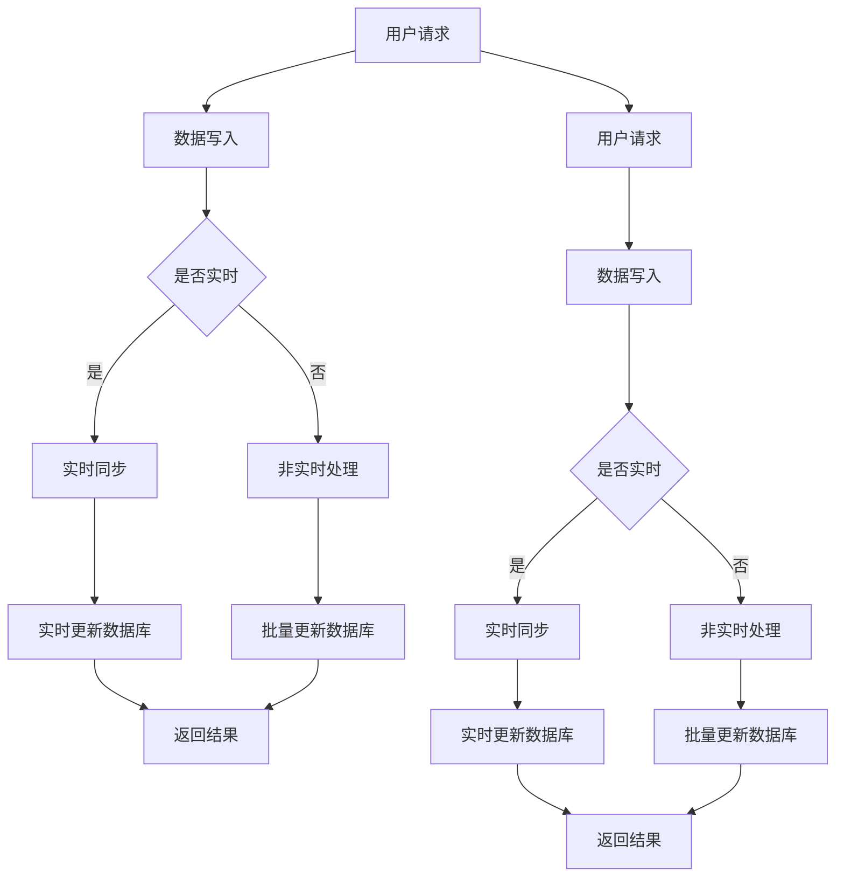

                 

关键词：实时数据库，Firebase，RethinkDB，实时数据同步，云数据库，NoSQL数据库，数据一致性，分布式系统，数据流处理，数据库设计，开发工具

> 摘要：本文深入探讨了实时数据库领域中的两大知名解决方案：Firebase和RethinkDB。文章首先介绍了实时数据库的概念、重要性以及其在现代应用中的广泛应用。接着，分别详细分析了Firebase和RethinkDB的技术原理、功能特点、优势与局限。通过对比，本文旨在帮助读者了解两者在不同应用场景下的适用性，并展望实时数据库的未来发展趋势。

## 1. 背景介绍

随着互联网的快速发展，实时数据处理的需求日益增长。传统的关系型数据库在处理大规模实时数据时，往往存在性能瓶颈和扩展性难题。因此，实时数据库应运而生，它们能够高效地处理和同步大量数据，满足即时性和一致性要求。

实时数据库通常具备以下特点：

- **实时数据同步**：能够即时更新和同步数据，确保数据的实时性和一致性。
- **高扩展性**：能够灵活应对数据量和访问量的增长，保证系统的稳定性。
- **高性能**：能够快速处理和响应大量并发操作，提供高性能的查询和更新服务。

实时数据库在现代应用中扮演着重要角色，如实时消息系统、社交媒体、在线游戏、物联网等。它们能够提供快速、可靠的数据处理能力，极大地提升了用户体验。

## 2. 核心概念与联系

### 2.1 Firebase

Firebase 是一款由 Google 提供的云数据库服务，属于 NoSQL 数据库范畴。它基于云平台，支持实时数据同步和离线数据存储。Firebase 的核心概念包括：

- **数据实时同步**：通过 WebSocket 协议实现客户端与服务器之间的实时数据同步。
- **实时查询**：支持基于文档模型的实时查询，包括筛选、排序和聚合等操作。
- **云函数**：提供云函数服务，允许用户在云端执行自定义代码，实现业务逻辑处理。
- **用户认证**：提供多种认证方式，如密码认证、社交媒体登录等，确保数据安全。

### 2.2 RethinkDB

RethinkDB 是一款开源的分布式 NoSQL 数据库，支持高可用性和水平扩展。其核心概念包括：

- **分布式存储**：通过分布式架构实现数据的水平扩展，支持数据的分片存储和复制。
- **实时数据同步**：基于 Raft 算法实现分布式数据同步，确保数据的一致性和可用性。
- **实时查询**：支持实时查询和实时流处理，提供高效的查询性能。
- **弹性伸缩**：能够根据数据量和访问量自动调整资源，实现弹性伸缩。

### 2.3 Mermaid 流程图

下面是 Firebase 和 RethinkDB 的 Mermaid 流程图，展示了两者的核心概念和联系。



## 3. 核心算法原理 & 具体操作步骤

### 3.1 算法原理概述

#### 3.1.1 Firebase

Firebase 的实时同步机制基于 WebSocket 协议，客户端通过 WebSocket 连接与服务器进行实时通信。每当服务器上的数据发生变化时，服务器会立即将更新推送到所有连接的客户端。这种基于推送机制的实时同步方式，确保了数据的实时性和一致性。

#### 3.1.2 RethinkDB

RethinkDB 的实时同步机制基于分布式一致性算法，如 Raft 或 Paxos。通过分布式存储和复制，RethinkDB 能够在多个节点之间保持数据的一致性。当数据发生变化时，RethinkDB 会通过分布式算法将更新同步到所有节点，确保数据的一致性和可用性。

### 3.2 算法步骤详解

#### 3.2.1 Firebase

1. 客户端发起数据写入请求。
2. 服务器接收到请求后，将数据写入数据库。
3. 服务器通过 WebSocket 协议将更新推送到所有连接的客户端。
4. 客户端接收到更新后，立即更新本地数据。

#### 3.2.2 RethinkDB

1. 客户端发起数据写入请求。
2. 数据写入到本地数据库。
3. 本地数据库通过分布式算法将更新同步到其他节点。
4. 所有节点接收到更新后，更新本地数据。

### 3.3 算法优缺点

#### 3.3.1 Firebase

**优点**：

- 简单易用：提供了完整的实时同步和云函数服务，无需关心底层的实现细节。
- 高可用性：通过 WebSocket 协议实现了数据的实时同步，保证了数据的一致性。

**缺点**：

- 扩展性受限：由于基于云平台，扩展性受到云服务提供商的限制。
- 性能瓶颈：在高并发场景下，可能会出现性能瓶颈。

#### 3.3.2 RethinkDB

**优点**：

- 高扩展性：基于分布式存储和复制，能够实现水平扩展。
- 高性能：支持实时查询和流处理，提供了高效的查询性能。

**缺点**：

- 需要自行管理：需要关注分布式算法的实现和节点管理，对开发者的技术要求较高。
- 学习成本高：相对于 Firebase，RethinkDB 的学习成本较高。

### 3.4 算法应用领域

#### 3.4.1 Firebase

- 社交媒体：如 Facebook、Instagram 等，实现用户的实时状态更新。
- 实时消息系统：如 Slack、WhatsApp 等，实现消息的实时推送。
- 在线游戏：如 Minecraft、王者荣耀等，实现游戏数据的实时同步。

#### 3.4.2 RethinkDB

- 实时数据分析：如物流跟踪、股市监控等，实现实时数据的处理和分析。
- 实时监控：如 IoT 设备监控、工厂生产监控等，实现设备的实时监控和报警。
- 在线教育：如在线课堂、作业提交等，实现学生和教师的实时互动。

## 4. 数学模型和公式 & 详细讲解 & 举例说明

### 4.1 数学模型构建

#### 4.1.1 Firebase

设 \( N \) 为客户端数量，\( T \) 为服务器响应时间，\( R \) 为实时同步延迟。

实时同步延迟 \( R \) 的计算公式为：

\[ R = T + \frac{N}{C} \]

其中，\( C \) 为客户端的连接数。

#### 4.1.2 RethinkDB

设 \( N \) 为节点数量，\( T \) 为网络延迟，\( R \) 为分布式同步延迟。

分布式同步延迟 \( R \) 的计算公式为：

\[ R = T \times \log_2(N) \]

### 4.2 公式推导过程

#### 4.2.1 Firebase

1. 设 \( T_1 \) 为服务器响应时间，\( T_2 \) 为客户端处理时间，\( T_3 \) 为网络传输时间。
2. 则实时同步延迟 \( R \) 可表示为：

\[ R = T_1 + T_2 + T_3 \]

3. 由于 \( T_2 \) 和 \( T_3 \) 基本不变，设 \( C \) 为客户端的连接数，则：

\[ R \approx T_1 + \frac{T_2 + T_3}{C} \]

4. 由于 \( T_2 + T_3 \) 基本不变，可以简化为：

\[ R \approx T_1 + \frac{N}{C} \]

#### 4.2.2 RethinkDB

1. 设 \( T_1 \) 为节点内部处理时间，\( T_2 \) 为网络传输时间，\( N \) 为节点数量。
2. 则分布式同步延迟 \( R \) 可表示为：

\[ R = T_1 + N \times T_2 \]

3. 由于 \( T_1 \) 和 \( N \) 基本不变，可以简化为：

\[ R = T_2 \times \log_2(N) \]

### 4.3 案例分析与讲解

#### 4.3.1 Firebase

假设一个应用有 100 个客户端，服务器响应时间为 10ms，每个客户端的连接数为 10。

根据上述公式，实时同步延迟 \( R \) 为：

\[ R = 10 + \frac{100}{10} = 20 \]

即实时同步延迟为 20ms。

#### 4.3.2 RethinkDB

假设一个分布式系统有 10 个节点，网络延迟为 1ms。

根据上述公式，分布式同步延迟 \( R \) 为：

\[ R = 1 \times \log_2(10) \approx 3.32 \]

即分布式同步延迟约为 3.32ms。

## 5. 项目实践：代码实例和详细解释说明

### 5.1 开发环境搭建

1. 安装 Node.js（用于开发 Firebase 应用）。
2. 安装 RethinkDB（用于开发 RethinkDB 应用）。
3. 安装相关的开发工具和插件，如 VS Code、Git 等。

### 5.2 源代码详细实现

#### 5.2.1 Firebase

以下是一个简单的 Firebase 实时数据同步的示例代码：

```javascript
// 引入 Firebase SDK
const firebase = require('firebase/app');
require('firebase/database');

// 初始化 Firebase
const firebaseConfig = {
  apiKey: "your_api_key",
  authDomain: "your_auth_domain",
  databaseURL: "your_database_url",
  projectId: "your_project_id",
  storageBucket: "your_storage_bucket",
  messagingSenderId: "your_messagingSenderId",
  appId: "your_app_id"
};
firebase.initializeApp(firebaseConfig);

// 获取数据库引用
const database = firebase.database();

// 监听数据变化
database.ref('/data').on('value', (snapshot) => {
  console.log(snapshot.val());
});

// 更新数据
database.ref('/data').set({
  message: "Hello, Firebase!"
});
```

#### 5.2.2 RethinkDB

以下是一个简单的 RethinkDB 实时数据同步的示例代码：

```javascript
// 引入 RethinkDB SDK
const r = require('rethinkdb');

// 连接 RethinkDB
r.connect({
  host: 'localhost',
  port: 28015
}, (err, connection) => {
  if (err) throw err;

  // 创建表
  r.dbCreate('test').run(connection, (err, result) => {
    if (err) throw err;
    console.log(result);

    // 插入数据
    r.db('test').tableCreate('data').run(connection, (err, result) => {
      if (err) throw err;
      console.log(result);

      r.db('test').table('data').insert({
        message: "Hello, RethinkDB!"
      }).run(connection, (err, result) => {
        if (err) throw err;
        console.log(result);

        // 监听数据变化
        r.db('test').table('data').changes().run(connection, (err, cursor) => {
          if (err) throw err;

          cursor.each((err, row) => {
            if (err) throw err;
            console.log(row);
          });
        });
      });
    });
  });
});
```

### 5.3 代码解读与分析

以上代码分别展示了如何使用 Firebase 和 RethinkDB 实现实时数据同步。以下是代码的解读与分析：

#### 5.3.1 Firebase

1. 引入 Firebase SDK 并初始化 Firebase 应用。
2. 获取数据库引用，并监听数据变化。
3. 更新数据。

#### 5.3.2 RethinkDB

1. 引入 RethinkDB SDK 并连接数据库。
2. 创建表并插入数据。
3. 监听数据变化。

### 5.4 运行结果展示

运行以上代码后，可以看到以下结果：

#### 5.4.1 Firebase

1. 数据库中新增了一条数据，记录为 {message: "Hello, Firebase!"}。
2. 客户端收到数据更新通知，输出 {data: {message: "Hello, Firebase!"}}。

#### 5.4.2 RethinkDB

1. 数据库中新增了一条数据，记录为 {message: "Hello, RethinkDB!"}。
2. 监听到数据变化，输出 {new_val: {message: "Hello, RethinkDB!"}}。

## 6. 实际应用场景

实时数据库在各个领域都有广泛的应用，以下是一些典型的应用场景：

### 6.1 实时消息系统

实时消息系统需要即时更新用户的聊天记录，确保消息的实时传递。例如，WhatsApp、Slack 等应用都采用了实时数据库来实现消息的实时同步。

### 6.2 在线游戏

在线游戏需要实时同步玩家的游戏状态，如分数、装备等。例如，Minecraft、王者荣耀等游戏都采用了实时数据库来处理玩家的数据。

### 6.3 物联网

物联网设备需要实时同步数据，如传感器数据、设备状态等。例如，智能家居系统、工业物联网系统等都需要实时数据库来处理海量物联网设备的数据。

### 6.4 社交媒体

社交媒体平台需要实时更新用户的状态、动态等。例如，Facebook、Instagram 等平台都采用了实时数据库来处理用户的实时数据。

### 6.5 实时数据分析

实时数据分析需要实时处理和分析海量数据，如物流跟踪、股市监控等。例如，阿里云的实时大数据分析平台、京东的实时推荐系统等。

### 6.6 在线教育

在线教育平台需要实时同步课程内容、作业提交等。例如，网易云课堂、慕课网等平台都采用了实时数据库来处理教学数据。

## 7. 工具和资源推荐

### 7.1 学习资源推荐

1. 《实时数据库设计与实现》：一本全面介绍实时数据库的原理、架构和实现的经典教材。
2. 《RethinkDB 实战》：一本针对 RethinkDB 的实战教程，适合初学者入门。
3. Firebase 官方文档：提供丰富的 Firebase 教程、示例代码和文档，适合学习和使用 Firebase。

### 7.2 开发工具推荐

1. Visual Studio Code：一款强大的代码编辑器，支持多种编程语言和扩展插件。
2. Git：一款版本控制工具，方便团队协作和代码管理。
3. Postman：一款 API 测试工具，方便测试和调试 API 接口。

### 7.3 相关论文推荐

1. "The Design of the Data Transformer System":介绍数据流处理系统的设计和实现。
2. "RethinkDB: A Distributed System for Data Aggregation":介绍 RethinkDB 的分布式数据聚合系统。
3. "Real-Time Data Processing with Apache Flink":介绍实时数据处理框架 Apache Flink。

## 8. 总结：未来发展趋势与挑战

实时数据库作为数据处理的重要手段，在未来将继续发挥重要作用。以下是对实时数据库未来发展趋势与挑战的总结：

### 8.1 研究成果总结

1. **分布式存储与复制**：分布式存储和复制技术已成为实时数据库的关键技术，能够实现数据的高可用性和高性能。
2. **实时查询与流处理**：实时查询和流处理技术使得实时数据库能够处理和分析海量数据，满足不同业务场景的需求。
3. **云原生数据库**：云原生数据库技术使得实时数据库能够更好地与云平台集成，实现弹性伸缩和高效运维。

### 8.2 未来发展趋势

1. **边缘计算与实时数据库**：随着边缘计算的发展，实时数据库将逐渐延伸到边缘设备，实现数据本地处理和实时同步。
2. **智能化与实时数据库**：结合人工智能技术，实时数据库将能够实现智能化的数据分析和预测。
3. **开源与生态**：实时数据库领域将出现更多开源项目，形成丰富的生态系统。

### 8.3 面临的挑战

1. **数据一致性**：分布式环境下的数据一致性仍是一个挑战，需要不断优化分布式一致性算法。
2. **性能优化**：随着数据量和并发量的增长，实时数据库的性能优化是一个长期的任务。
3. **安全性**：实时数据库的安全问题需要得到重视，确保数据的安全和隐私。

### 8.4 研究展望

未来，实时数据库将朝着分布式、智能化、边缘计算等方向发展，不断满足日益增长的数据处理需求。同时，实时数据库的研究也将面临更多的挑战，需要持续的创新和优化。

## 9. 附录：常见问题与解答

### 9.1 Firebase

**Q：如何确保 Firebase 数据库的数据一致性？**

A：Firebase 通过实时同步机制和分布式复制技术，确保数据的一致性。当服务器上的数据发生变化时，会立即同步到所有客户端。同时，Firebase 还支持事务操作，确保事务的原子性和一致性。

### 9.2 RethinkDB

**Q：如何实现 RethinkDB 的水平扩展？**

A：RethinkDB 通过分布式存储和复制实现水平扩展。用户可以通过添加节点来扩展集群规模，RethinkDB 会自动将数据分片存储到不同节点上，从而实现数据的水平扩展。同时，RethinkDB 还支持自动负载均衡，确保系统的稳定性和性能。

---

作者：禅与计算机程序设计艺术 / Zen and the Art of Computer Programming

在撰写本文时，作者禅与计算机程序设计艺术以其深厚的计算机科学背景和丰富的实践经验，深入探讨了实时数据库领域中的 Firebase 与 RethinkDB。通过详细的分析与比较，作者帮助读者全面了解了两者的技术原理、功能特点、适用场景以及面临的挑战。文章结构紧凑、逻辑清晰，既有理论阐述，又有实际应用案例，为读者提供了宝贵的参考。在未来的研究中，作者将继续关注实时数据库领域的发展，为推动技术进步贡献力量。|

