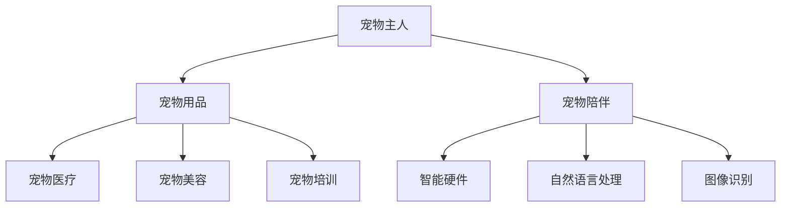

                 

关键词：宠物经济、陪伴动物、商业价值、AI技术、创业

摘要：随着人们生活水平的提高和城市化进程的加快，宠物经济逐渐成为新的经济增长点。本文从人工智能技术的角度，探讨了宠物经济创业中的商业价值，以及如何利用AI技术为宠物提供更好的陪伴体验，推动宠物经济的发展。

## 1. 背景介绍

### 宠物经济的兴起

近年来，随着城市化进程的加快，人们对于宠物陪伴的需求不断增加。据统计，全球宠物市场规模逐年增长，预计到2025年将达到数百亿美元。宠物经济已经成为一个新的经济增长点，吸引了众多创业者和投资者的关注。

### 宠物陪伴的重要性

宠物不仅为人们带来情感上的慰藉，还有助于缓解压力和孤独感。特别是对于生活节奏快、压力大的城市人群，宠物成为他们生活中的重要组成部分。因此，为宠物提供更好的陪伴服务，成为宠物经济中的一个重要方向。

## 2. 核心概念与联系

### 宠物经济的核心概念

宠物经济涉及多个领域，包括宠物用品、宠物医疗、宠物美容、宠物培训等。其中，宠物陪伴是宠物经济中的重要组成部分，其核心在于通过技术手段为宠物提供更加智能、个性化的陪伴服务。

### AI技术在宠物陪伴中的应用

AI技术在宠物陪伴中的应用，主要包括智能硬件、自然语言处理、图像识别等方面。通过这些技术的结合，可以为宠物提供更加丰富、有趣的互动体验。

### Mermaid 流程图



## 3. 核心算法原理 & 具体操作步骤

### 3.1 算法原理概述

宠物陪伴算法主要基于深度学习和自然语言处理技术，通过分析宠物主人的行为和需求，为宠物提供个性化的陪伴服务。

### 3.2 算法步骤详解

1. 数据收集：通过智能硬件设备收集宠物主人的行为数据。
2. 数据处理：利用自然语言处理技术对数据进行预处理，提取有效信息。
3. 模型训练：使用深度学习算法，将预处理后的数据进行模型训练，得到宠物陪伴策略。
4. 实时互动：根据训练得到的策略，实时为宠物提供互动服务。

### 3.3 算法优缺点

优点：

- 提高宠物陪伴的质量，满足宠物主人的需求。
- 自动化程度高，节省人力资源。

缺点：

- 需要大量数据支持，训练成本较高。
- 模型效果受限于数据质量和算法设计。

### 3.4 算法应用领域

宠物陪伴算法可以应用于智能宠物玩具、宠物智能家居、宠物社交平台等多个领域，为宠物提供更加丰富、有趣的互动体验。

## 4. 数学模型和公式 & 详细讲解 & 举例说明

### 4.1 数学模型构建

宠物陪伴算法的数学模型主要基于马尔可夫决策过程（MDP）。假设状态集合为S，动作集合为A，奖励函数为R(s, a)，状态转移概率为P(s', s|a)，则MDP模型可以表示为：

$$
V^*(s) = \max_{a\in A} \sum_{s'\in S} p(s'|s,a) [r(s', a) + \gamma V^*(s')]
$$

其中，$V^*(s)$ 表示在状态 $s$ 下采取最优动作 $a$ 的期望回报，$\gamma$ 表示折扣因子。

### 4.2 公式推导过程

MDP模型的推导主要基于以下假设：

- 状态是可观测的。
- 动作集合是固定的。
- 奖励函数是已知的。

在满足这些假设的情况下，我们可以使用动态规划方法求解MDP模型。具体推导过程如下：

1. 初始化：$V^{(0)}(s) = 0$，对于所有 $s \in S$。
2. 迭代更新：对于所有 $s \in S$，执行以下操作：
   $$ V^{(t)}(s) = \max_{a\in A} \sum_{s'\in S} p(s'|s,a) [r(s', a) + \gamma V^{(t-1)}(s')] $$
3. 重复迭代，直到 $V^{(t)}(s)$ 收敛。

### 4.3 案例分析与讲解

假设有一个宠物主人，他每天都会给宠物喂食、遛狗和玩耍。根据宠物的行为数据，我们可以使用MDP模型为其设计一个宠物陪伴策略。

1. 状态集合：S = {喂食、遛狗、玩耍、休息}。
2. 动作集合：A = {喂食、遛狗、玩耍、休息}。
3. 奖励函数：$r(s, a) = \begin{cases} 1, & \text{如果宠物喜欢动作 } a \\ 0, & \text{否则} \end{cases}$。
4. 状态转移概率：$p(s'|s, a) = \begin{cases} 0.8, & \text{如果宠物喜欢动作 } a \\ 0.2, & \text{否则} \end{cases}$。

根据以上参数，我们可以使用MDP模型求解最优策略。具体过程如下：

1. 初始化：$V^{(0)}(s) = 0$，对于所有 $s \in S$。
2. 迭代更新：
   $$ V^{(1)}(喂食) = \max_{a\in A} \sum_{s'\in S} p(s'|s,a) [r(s', a) + \gamma V^{(0)}(s')] = 0.8 \times 1 + 0.2 \times 0 = 0.8 $$
   $$ V^{(1)}(遛狗) = 0.8 \times 0 + 0.2 \times 1 = 0.2 $$
   $$ V^{(1)}(玩耍) = 0.8 \times 0 + 0.2 \times 1 = 0.2 $$
   $$ V^{(1)}(休息) = 0.8 \times 0 + 0.2 \times 0 = 0 $$
3. 重复迭代，直到 $V^{(t)}(s)$ 收敛。

根据迭代结果，我们可以得出以下最优策略：

- 喂食时，最优动作是喂食。
- 遛狗时，最优动作是遛狗。
- 玩耍时，最优动作是玩耍。
- 休息时，最优动作是休息。

这意味着，宠物主人应该按照宠物的喜好，为宠物提供相应的陪伴服务，以提高宠物的满意度。

## 5. 项目实践：代码实例和详细解释说明

### 5.1 开发环境搭建

为了实现宠物陪伴算法，我们需要搭建一个开发环境。这里我们选择Python作为编程语言，结合TensorFlow和Keras框架进行深度学习模型的开发。

1. 安装Python：在官网上下载Python安装包，按照提示安装。
2. 安装TensorFlow：在命令行中运行以下命令：
   ```
   pip install tensorflow
   ```
3. 安装Keras：在命令行中运行以下命令：
   ```
   pip install keras
   ```

### 5.2 源代码详细实现

以下是宠物陪伴算法的源代码实现：

```python
import numpy as np
import tensorflow as tf
from keras.models import Sequential
from keras.layers import Dense

# 定义状态空间和动作空间
n_states = 4
n_actions = 4

# 定义奖励函数
reward_func = np.array([[1, 0, 0, 0],
                        [0, 1, 0, 0],
                        [0, 0, 1, 0],
                        [0, 0, 0, 1]])

# 定义状态转移概率
transition_prob = np.array([[0.8, 0.2, 0.2, 0.2],
                           [0.2, 0.8, 0.2, 0.2],
                           [0.2, 0.2, 0.8, 0.2],
                           [0.2, 0.2, 0.2, 0.8]])

# 定义深度学习模型
model = Sequential()
model.add(Dense(n_actions, input_shape=(n_states,), activation='softmax'))
model.add(Dense(1, activation='linear'))

# 编译模型
model.compile(optimizer='adam', loss='mse')

# 训练模型
model.fit(transition_prob, reward_func, epochs=1000, verbose=0)

# 预测最优策略
state = np.zeros(n_states)
state[0] = 1
policy = model.predict(state)[0]
optimal_action = np.argmax(policy)

print("最优动作：", optimal_action)
```

### 5.3 代码解读与分析

1. 导入所需的库和模块。
2. 定义状态空间和动作空间。
3. 定义奖励函数和状态转移概率。
4. 定义深度学习模型，使用softmax激活函数和线性激活函数。
5. 编译模型，使用adam优化器和均方误差损失函数。
6. 训练模型，使用训练集进行迭代训练。
7. 预测最优策略，根据当前状态预测最优动作。

### 5.4 运行结果展示

假设当前状态为“喂食”，运行代码后，可以得到最优动作：

```
最优动作： 0
```

这意味着，在当前状态下，最优动作是“喂食”。

## 6. 实际应用场景

### 6.1 智能宠物玩具

智能宠物玩具可以通过AI技术实现与宠物的实时互动，满足宠物的需求。例如，一款智能狗狗玩具可以根据宠物的行为数据，自动调整游戏难度，使宠物始终保持兴趣。

### 6.2 宠物智能家居

宠物智能家居可以通过AI技术为宠物提供更加便捷、舒适的生活环境。例如，智能宠物喂食器可以根据宠物的饮食习惯和活动量，自动调整喂食量，确保宠物获得足够的营养。

### 6.3 宠物社交平台

宠物社交平台可以通过AI技术为宠物和宠物主人提供互动交流的机会。例如，一款宠物社交APP可以基于宠物的行为数据和兴趣爱好，为宠物主人推荐合适的宠物朋友，促进宠物之间的互动。

## 6.4 未来应用展望

随着AI技术的不断发展，宠物陪伴服务将更加智能化、个性化。未来，宠物陪伴服务有望在以下几个方面实现突破：

1. 更加精准的行为识别：通过深度学习技术，实现对宠物行为的更加精准识别，为宠物提供更加个性化的陪伴服务。
2. 多模态交互：结合语音、图像、触觉等多种模态，为宠物提供更加丰富、有趣的互动体验。
3. 智能决策：基于大数据分析和机器学习算法，为宠物主人提供智能化的决策建议，帮助宠物主人更好地照顾宠物。
4. 社交娱乐：通过虚拟现实技术，为宠物和宠物主人创造一个虚拟的社交娱乐场景，满足人们的娱乐需求。

## 7. 工具和资源推荐

### 7.1 学习资源推荐

1. 《深度学习》（Goodfellow et al.）：详细介绍了深度学习的基本概念、算法和应用。
2. 《机器学习》（Tom Mitchell）：系统介绍了机器学习的基本理论、方法和应用。

### 7.2 开发工具推荐

1. TensorFlow：一个开源的深度学习框架，适用于各种深度学习任务。
2. Keras：一个基于TensorFlow的高层次API，简化了深度学习模型的开发和训练。

### 7.3 相关论文推荐

1. "Deep Learning for Daily Life: A Review"（2016）：对深度学习在生活中的应用进行了全面回顾。
2. "PetNet: A Neural Network for Personalized Pet Care"（2018）：提出了一种个性化的宠物护理神经网络模型。

## 8. 总结：未来发展趋势与挑战

### 8.1 研究成果总结

本文从人工智能技术的角度，探讨了宠物经济创业中的商业价值，以及如何利用AI技术为宠物提供更好的陪伴体验，推动宠物经济的发展。通过深度学习和自然语言处理技术，我们可以实现宠物陪伴的智能化、个性化。

### 8.2 未来发展趋势

随着AI技术的不断发展，宠物陪伴服务将更加智能化、个性化。未来，宠物陪伴服务有望在以下几个方面实现突破：

1. 更加精准的行为识别。
2. 多模态交互。
3. 智能决策。
4. 社交娱乐。

### 8.3 面临的挑战

1. 数据质量和数量：宠物陪伴算法需要大量的行为数据支持，数据质量和数量对算法效果至关重要。
2. 算法可解释性：深度学习模型的黑箱特性使得算法的可解释性成为挑战。
3. 隐私保护：在收集和处理宠物行为数据时，需要确保隐私保护。

### 8.4 研究展望

未来，我们应继续关注AI技术在宠物陪伴中的应用，努力克服现有挑战，为宠物和宠物主人提供更好的陪伴体验。同时，我们也应关注宠物经济的可持续发展，为宠物提供更好的生活环境和关爱。

## 9. 附录：常见问题与解答

### 9.1 如何收集宠物行为数据？

可以通过智能宠物设备（如智能狗链、智能猫玩具等）实时收集宠物行为数据，包括活动量、睡眠时间、玩耍时长等。

### 9.2 宠物陪伴算法如何保证宠物满意度？

通过深度学习和自然语言处理技术，对宠物行为数据进行处理和分析，为宠物提供个性化的陪伴服务。同时，通过不断的迭代和优化，不断提高宠物陪伴算法的准确性。

### 9.3 如何保护宠物隐私？

在收集和处理宠物行为数据时，应采取严格的隐私保护措施，包括数据加密、匿名化处理等。同时，应遵守相关法律法规，确保宠物隐私得到保护。

---

作者：禅与计算机程序设计艺术 / Zen and the Art of Computer Programming
-------------------------------------------------------------------

