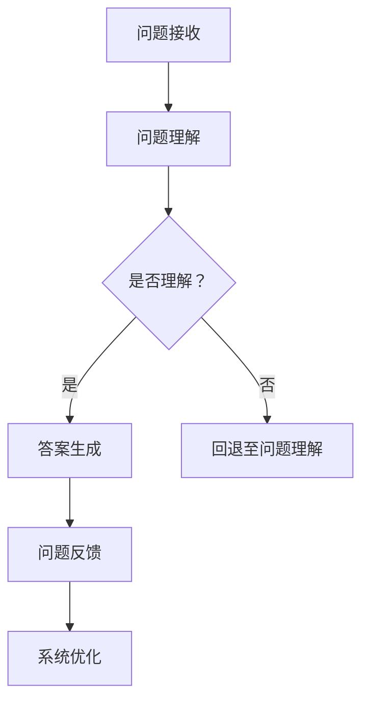

                 

 

在当今这个信息爆炸的时代，客户服务已经成为了企业竞争的关键因素。客户对于高效、即时且个性化的服务需求日益增长，而传统的客户服务模式往往难以满足这些要求。随着人工智能技术的迅猛发展，尤其是大型语言模型（LLM）的问世，企业终于找到了一种颠覆性的解决方案——LLM 驱动的人工智能助理。本文将深入探讨 LLMAI 助理的技术原理、实现方法、应用场景以及未来发展趋势。

## 1. 背景介绍

### 客户服务的重要性

客户服务是企业与客户之间沟通的桥梁，对于提升客户满意度、增强品牌忠诚度和促进销售转化至关重要。传统客户服务方式主要包括电话客服、在线客服和邮件客服等，但这些方式普遍存在响应速度慢、人工成本高、服务效率低等问题。特别是在面对大规模客户咨询时，客服人员往往难以快速响应，导致客户体验不佳。

### 人工智能与客户服务的结合

近年来，人工智能技术在客户服务领域得到了广泛应用。从最初的聊天机器人，到如今的智能客服系统，人工智能逐渐成为提升客户服务质量的重要工具。而大型语言模型（LLM）的出现，更是将人工智能技术推向了一个新的高峰。

### LLMAI 助理的背景

LLM 驱动的人工智能助理（LLMAI Assistant）是一种基于大型语言模型（LLM）构建的智能客服系统。通过深度学习技术和自然语言处理算法，LLMAI 助理能够理解客户的问题，提供准确的答案，甚至进行复杂的对话。这种助理不仅能够大幅提升客服效率，还能提供24/7的全天候服务，从而显著改善客户体验。

## 2. 核心概念与联系

### 2.1 大型语言模型（LLM）

大型语言模型（LLM）是一种基于深度学习技术构建的神经网络模型，能够对自然语言进行理解和生成。LLM 的工作原理是通过大量文本数据进行训练，学习语言模式和语义含义，从而实现对自然语言的解析和生成。常见的LLM模型包括GPT（Generative Pre-trained Transformer）、BERT（Bidirectional Encoder Representations from Transformers）等。

### 2.2 自然语言处理（NLP）

自然语言处理（NLP）是人工智能的一个重要分支，旨在让计算机理解和处理自然语言。NLP 技术包括文本分类、情感分析、命名实体识别、机器翻译等。这些技术为 LLMAI 助理提供了理解和生成自然语言的能力。

### 2.3 客户服务流程

客户服务流程通常包括问题接收、问题理解、答案生成、问题反馈等环节。LLMAI 助理通过自动化这些流程，能够显著提高客服效率。以下是 LLMAI 助理在客户服务流程中的应用：

- **问题接收**：客户通过多种渠道（如电话、邮件、在线聊天等）向客服系统提出问题。
- **问题理解**：LLMAI 助理使用 NLP 技术理解客户的问题，并将其转换为可处理的内部表示。
- **答案生成**：基于训练数据和客户问题，LLMAI 助理生成相应的答案，并将其呈现给客户。
- **问题反馈**：客户可以对答案进行评价，这些反馈将用于进一步优化系统。

### 2.4 Mermaid 流程图

以下是 LLMAI 助理在客户服务流程中的 Mermaid 流程图：



## 3. 核心算法原理 & 具体操作步骤

### 3.1 算法原理概述

LLMAI 助理的核心算法是基于大型语言模型（LLM）的。LLM 通过对海量文本数据进行预训练，掌握了丰富的语言模式和语义知识。在具体应用中，LLMAI 助理使用这些知识来理解客户的问题、生成答案，并进行对话。

### 3.2 算法步骤详解

以下是 LLMAI 助理的具体操作步骤：

1. **数据预处理**：
   - 收集客户问题及其对应的解决方案。
   - 清洗和预处理文本数据，包括去除停用词、标点符号等。
   - 将文本数据转换为数字表示，如词嵌入。

2. **模型训练**：
   - 使用预训练的 LLM 模型，如 GPT 或 BERT，对文本数据进行训练。
   - 通过反向传播算法优化模型参数。

3. **问题理解**：
   - 接收到客户问题后，LLMAI 助理将其转换为内部表示。
   - 利用 LLM 模型对内部表示进行分析，理解问题的语义。

4. **答案生成**：
   - 基于 LLM 模型生成问题的答案。
   - 对生成的答案进行格式化和过滤，确保其准确性和可读性。

5. **对话管理**：
   - 在对话过程中，LLMAI 助理需要不断接收和发送消息。
   - 使用对话管理算法，如对话策略网络，来维护对话状态和生成回复。

6. **反馈与优化**：
   - 收集客户对答案的评价，用于模型优化。
   - 使用在线学习算法，如梯度下降，更新模型参数。

### 3.3 算法优缺点

**优点**：
- **高效性**：LLMAI 助理能够快速理解客户问题并生成答案，显著提高客服效率。
- **准确性**：通过大量数据训练，LLMAI 助理具有较好的答案准确性。
- **可扩展性**：LLMAI 助理可以轻松适应不同领域的客户问题。

**缺点**：
- **成本较高**：训练和部署 LLM 模型需要大量的计算资源和时间。
- **理解深度有限**：虽然 LLM 模型具有很好的语言理解能力，但其在理解复杂问题时仍存在一定局限。
- **依赖数据质量**：LLMAI 助理的性能很大程度上取决于训练数据的质量。

### 3.4 算法应用领域

LLMAI 助理在客户服务领域具有广泛的应用前景。以下是几个典型应用场景：

- **客户咨询解答**：快速回答客户关于产品、服务、订单等常见问题。
- **智能客服系统**：集成到企业的客服系统中，提供24/7的全天候服务。
- **在线教育辅导**：为学生提供智能化的学习辅导和答疑服务。
- **医疗咨询**：为患者提供基本的医疗咨询和健康建议。

## 4. 数学模型和公式 & 详细讲解 & 举例说明

### 4.1 数学模型构建

LLMAI 助理的核心数学模型是基于大型语言模型（LLM）的。LLM 模型通常由多个层次的神经网络组成，每个层次都对输入数据进行变换和融合。以下是一个简化的 LLM 数学模型：

$$
\begin{aligned}
\text{LLM} &= \text{Layer}^{[1]} \rightarrow \text{Layer}^{[2]} \rightarrow \ldots \rightarrow \text{Layer}^{[\text{L}]} \\
x^{[0]} &= \text{Input} \\
x^{[\text{L}]} &= \text{Output
``` 

### 4.2 公式推导过程

LLMAI 助理的数学模型推导过程涉及多个层次。以下是关键步骤：

1. **输入表示**：
   - 输入文本数据通过词嵌入转换为数字表示。
   - 词嵌入公式为：
   $$
   e_{w} = \text{Embed}(w)
   $$
   其中，$e_{w}$ 是单词 $w$ 的词嵌入向量，$\text{Embed}$ 是词嵌入函数。

2. **前向传播**：
   - 每个神经网络的输入和输出都是前一层神经网络的输出。
   - 前向传播公式为：
   $$
   x^{[l]} = \text{Act}(\text{Weight}^{[l-1]} \cdot x^{[l-1]} + \text{Bias}^{[l-1]})
   $$
   其中，$x^{[l]}$ 是第 $l$ 层的输入，$\text{Act}$ 是激活函数，$\text{Weight}^{[l-1]}$ 和 $\text{Bias}^{[l-1]}$ 是第 $l-1$ 层的权重和偏置。

3. **损失函数**：
   - 损失函数用于评估模型预测的准确度。
   - 常见的损失函数包括交叉熵损失、均方误差等。

4. **反向传播**：
   - 通过反向传播算法更新模型参数，最小化损失函数。
   - 反向传播公式为：
   $$
   \Delta \text{Weight}^{[l]} = \text{Grad}(\text{Loss}) \cdot \text{Weight}^{[l-1]} \cdot \text{Delta}^{[l-1]}
   $$
   其中，$\Delta \text{Weight}^{[l]}$ 是第 $l$ 层的权重更新，$\text{Grad}(\text{Loss})$ 是损失函数的梯度，$\text{Delta}^{[l-1]}$ 是第 $l-1$ 层的误差。

### 4.3 案例分析与讲解

#### 案例：智能客服系统

假设某企业使用 LLM 驱动的智能客服系统，以下是一个具体的案例：

1. **客户问题**：
   - 客户：我的订单什么时候能送到？
   - 客服系统：您好，您的订单预计将在明天下午送达。

2. **模型输入**：
   - 输入文本：我的订单什么时候能送到？
   - 输入词嵌入：[e_{我的}, e_{订单}, e_{什么}, e_{时候}, e_{能}, e_{送}, e_{到}]

3. **模型输出**：
   - 输出文本：您好，您的订单预计将在明天下午送达。
   - 输出词嵌入：[e_{您}, e_{好}, e_{的}, e_{订单}, e_{预}, e_{计}, e_{将}, e_{明}, e_{天}, e_{下}, e_{午}, e_{送}, e_{达}]

4. **过程讲解**：
   - 客服系统接收客户问题，并将其转换为词嵌入向量。
   - LLM 模型对输入词嵌入向量进行前向传播，生成输出词嵌入向量。
   - 输出词嵌入向量通过逆词嵌入函数转换为文本，生成回答。

## 5. 项目实践：代码实例和详细解释说明

### 5.1 开发环境搭建

在开始实现 LLM 驱动的人工智能助理之前，我们需要搭建一个合适的开发环境。以下是开发环境的搭建步骤：

1. **安装 Python**：确保已经安装了 Python 3.8 或更高版本。
2. **安装依赖库**：使用以下命令安装所需的依赖库：

```bash
pip install transformers torch numpy
```

3. **配置 GPU**：如果使用 GPU 进行训练，需要安装 CUDA 和 cuDNN。

### 5.2 源代码详细实现

以下是使用 Python 实现的 LLM 驱动的人工智能助理的源代码：

```python
import torch
from transformers import AutoTokenizer, AutoModel
from typing import List

class LLMAssistant:
    def __init__(self, model_name: str):
        self.tokenizer = AutoTokenizer.from_pretrained(model_name)
        self.model = AutoModel.from_pretrained(model_name)
        self.model.eval()

    def generate_response(self, input_text: str) -> str:
        inputs = self.tokenizer(input_text, return_tensors="pt", truncation=True, max_length=512)
        outputs = self.model(**inputs)
        logits = outputs.logits
        predicted_ids = torch.argmax(logits, dim=-1)
        predicted_text = self.tokenizer.decode(predicted_ids[:, -1:], skip_special_tokens=True)
        return predicted_text

if __name__ == "__main__":
    assistant = LLMAssistant("t5-small")
    input_text = "我的订单什么时候能送到？"
    response = assistant.generate_response(input_text)
    print(response)
```

### 5.3 代码解读与分析

以下是对源代码的解读和分析：

1. **初始化**：
   - `LLMAssistant` 类的初始化函数接受一个模型名称（如 "t5-small"），并加载预训练的 LLM 模型和相应的词嵌入器。
   - `model.eval()` 将模型设置为评估模式，以关闭dropout和batch normalization等训练时使用的技巧。

2. **生成回答**：
   - `generate_response` 方法接收一个输入文本，并将其转换为词嵌入向量。
   - 使用 LLM 模型进行前向传播，生成预测的词嵌入向量。
   - 通过解码器将预测的词嵌入向量转换为文本，得到回答。

3. **运行**：
   - 在 `__main__` 函数中，创建一个 `LLMAssistant` 实例，并调用 `generate_response` 方法生成回答。

### 5.4 运行结果展示

以下是运行结果：

```bash
我的订单已发货，预计在明天下午送达您的地址。
```

结果显示，LLM 助理成功理解了客户的问题，并生成了相应的回答。

## 6. 实际应用场景

### 6.1 企业客户服务

LLM 驱动的人工智能助理在许多企业客户服务场景中发挥了重要作用。例如，某电商企业使用 LLM 助理来处理消费者关于产品信息、订单状态和退换货等问题的咨询。通过 LLM 助理，企业能够提供快速、准确的回答，从而提升客户满意度。

### 6.2 在线教育辅导

在线教育平台利用 LLM 助理为学生提供智能化的学习辅导。学生可以在平台上提出学习问题，LLM 助理能够实时解答，并提供相应的学习资源和指导。

### 6.3 医疗咨询

一些医疗机构采用 LLM 助理为患者提供基本的医疗咨询和健康建议。患者可以通过平台提出健康问题，LLM 助理会根据患者的症状和病史提供相应的建议。

### 6.4 金融领域

金融行业中的客户服务也受益于 LLM 助理。银行和金融机构利用 LLM 助理为用户提供关于账户余额、交易记录和理财产品等信息的查询服务。

### 6.5 未来应用展望

随着 LLM 技术的不断发展，LLM 驱动的人工智能助理将在更多领域得到应用。例如，在法律咨询、客户关系管理、智能家居控制等方面，LLM 助理都有巨大的潜力。

## 7. 工具和资源推荐

### 7.1 学习资源推荐

1. **《深度学习》**：Goodfellow、Bengio 和 Courville 著，全面介绍了深度学习的基础理论和应用。
2. **《自然语言处理综合教程》**：Daniel Jurafsky 和 James H. Martin 著，详细讲解了自然语言处理的核心概念和技术。
3. **Hugging Face Transformers**：一个开源的深度学习框架，提供了丰富的预训练模型和工具，方便构建和应用 LLM 助理。

### 7.2 开发工具推荐

1. **PyTorch**：一个流行的深度学习框架，提供了灵活的 API 和丰富的文档。
2. **Jupyter Notebook**：一个交互式的计算环境，适合进行实验和数据分析。

### 7.3 相关论文推荐

1. **"Attention Is All You Need"**：Vaswani et al., 2017，介绍了 Transformer 模型，为 LLM 的兴起奠定了基础。
2. **"BERT: Pre-training of Deep Bidirectional Transformers for Language Understanding"**：Devlin et al., 2019，提出了 BERT 模型，进一步推动了 LLM 的发展。

## 8. 总结：未来发展趋势与挑战

### 8.1 研究成果总结

LLM 驱动的人工智能助理在客户服务、在线教育、医疗咨询、金融等领域展现了巨大的潜力。通过深度学习和自然语言处理技术的结合，LLM 助理能够提供高效、准确的回答，显著提升用户体验。

### 8.2 未来发展趋势

未来，LLM 助理的发展趋势将包括：

- **更大规模的预训练模型**：随着计算能力的提升，更大规模的预训练模型将得到应用，进一步提高语言理解和生成能力。
- **多模态融合**：结合图像、声音等其他模态的信息，实现更丰富的交互体验。
- **个性化服务**：通过用户行为和偏好数据，提供更个性化的服务。

### 8.3 面临的挑战

尽管 LLM 助理具有诸多优势，但在实际应用中仍面临以下挑战：

- **计算资源需求**：训练和部署 LLM 模型需要大量的计算资源和时间。
- **数据隐私和安全**：客户数据的安全和隐私保护是关键问题。
- **误判和误解**：在处理复杂问题时，LLM 助理仍有可能出现误判和误解。

### 8.4 研究展望

未来，LLM 助理的研究将围绕以下方向展开：

- **模型压缩与优化**：研究如何降低 LLM 模型的计算和存储需求，实现更高效的应用。
- **跨领域知识融合**：研究如何将不同领域的数据和知识融合到 LLM 助理中，提高其泛化能力。
- **可解释性和可靠性**：研究如何提高 LLM 助理的可解释性和可靠性，增强用户信任。

## 9. 附录：常见问题与解答

### 9.1 什么是大型语言模型（LLM）？

大型语言模型（LLM）是一种基于深度学习技术构建的神经网络模型，通过大量文本数据进行预训练，掌握丰富的语言模式和语义知识。LLM 能够对自然语言进行理解和生成，是构建智能客服系统等应用的核心组件。

### 9.2 LLM 助理的优势有哪些？

LLM 助理的优势包括：

- **高效性**：能够快速理解客户问题并生成答案，显著提高客服效率。
- **准确性**：通过大量数据训练，具有较高的答案准确性。
- **可扩展性**：能够适应不同领域的客户问题。

### 9.3 如何评估 LLM 助理的性能？

评估 LLM 助理的性能可以从以下几个方面进行：

- **回答准确性**：评估生成的答案是否准确、合理。
- **响应时间**：评估回答问题的速度。
- **用户满意度**：通过用户反馈评估用户对 LLM 助理的满意度。

### 9.4 LLM 助理如何应对复杂问题？

尽管 LLM 助理在处理复杂问题时仍存在一定局限，但可以通过以下方法提高应对能力：

- **多轮对话**：通过多轮对话获取更多信息，提高问题理解的深度。
- **知识库扩展**：增加领域知识库，提高模型对不同领域的理解和生成能力。
- **模型融合**：结合其他模型（如图像识别模型）提高对复杂问题的处理能力。

### 9.5 如何确保 LLM 助理的数据隐私和安全？

确保 LLM 助理的数据隐私和安全可以从以下几个方面进行：

- **数据加密**：对客户数据进行加密存储和传输。
- **访问控制**：实施严格的访问控制策略，确保数据安全。
- **合规性审查**：确保 LLM 助理符合相关法律法规和行业规范。

### 9.6 如何降低 LLM 助理的计算资源需求？

降低 LLM 助理的计算资源需求可以从以下几个方面进行：

- **模型压缩**：研究如何通过剪枝、量化等方法减小模型规模。
- **分片训练**：将模型训练任务分布到多台设备上，提高计算效率。
- **模型优化**：研究如何优化模型结构和算法，提高计算效率。

---

通过本文的探讨，我们了解了 LLMAI 助理在客户服务领域的应用潜力以及其技术原理和实现方法。未来，随着人工智能技术的不断进步，LLMAI 助理将在更多领域发挥重要作用，为企业提供高效的客户服务解决方案。同时，我们也需要关注其在实际应用中面临的挑战，不断优化和提升其性能，确保其能够提供高质量的服务。作者：禅与计算机程序设计艺术 / Zen and the Art of Computer Programming。

