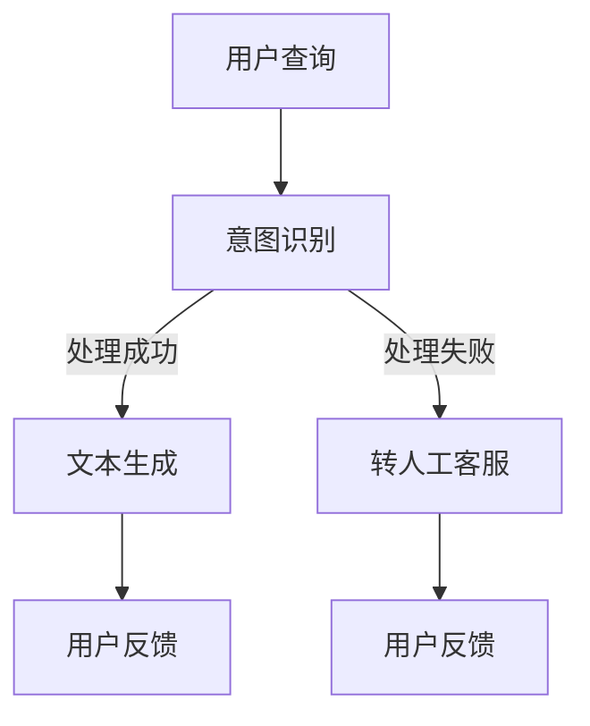
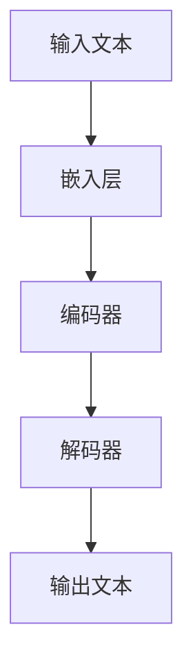

                 

 在这个数字时代，客户服务已成为企业成功的关键因素之一。传统的客户服务模式往往效率低下，无法满足用户对快速响应和个性化服务的高期望。随着人工智能技术的飞速发展，特别是大型语言模型（LLM）的出现，我们迎来了客户服务的新篇章。本文将探讨如何利用LLM构建高效、智能的人工智能助理，从而提升客户服务体验。

> 关键词：客户服务，人工智能，大型语言模型，LLM，智能客服，个性化服务，响应速度，服务效率

> 摘要：本文首先介绍了客户服务在现代商业环境中的重要性，然后详细阐述了LLM在客户服务中的应用原理和优势。通过一个具体的案例，本文展示了如何利用LLM实现智能客服系统，并分析了其在实际应用中的效果和未来展望。

## 1. 背景介绍

### 1.1 客户服务的挑战

随着互联网的普及和电子商务的快速发展，客户服务的需求日益增长。传统的客户服务模式，如电话、邮件和在线聊天，虽然在一定程度上能够满足用户需求，但仍然存在诸多问题：

- **响应速度慢**：人工客服的响应速度往往无法满足用户对即时反馈的期望。
- **个性化服务不足**：传统客服系统无法根据用户的个性化需求提供定制化服务。
- **效率低下**：客服人员处理大量重复性问题，工作效率低下，容易出错。
- **成本高**：人工客服的人力成本较高，尤其是对于大型企业来说。

### 1.2 人工智能与客户服务的结合

人工智能技术的发展为解决上述问题提供了新的途径。通过机器学习、自然语言处理（NLP）等技术，人工智能系统可以自动处理大量数据，实现高效的客户服务。特别是LLM的出现，使得智能客服系统在理解用户意图、提供个性化服务和提高响应速度方面取得了显著突破。

## 2. 核心概念与联系

### 2.1 大型语言模型（LLM）

大型语言模型（LLM）是一种基于深度学习的自然语言处理模型，其核心思想是通过训练海量数据，使模型能够理解和生成自然语言。LLM在客户服务中的应用主要体现在以下几个方面：

- **意图识别**：LLM可以理解用户的查询意图，从而提供针对性的回答。
- **文本生成**：LLM可以根据用户的需求生成个性化的文本回复。
- **情感分析**：LLM可以分析用户的情感倾向，为用户提供心理上的关怀。

### 2.2 Mermaid 流程图

以下是一个简单的Mermaid流程图，展示了LLM在客户服务中的应用流程：



### 2.3 LLM架构

LLM的架构通常包括以下几个关键部分：

- **嵌入层**：将自然语言文本转换为向量表示。
- **编码器**：对输入文本进行编码，生成上下文向量。
- **解码器**：根据上下文向量生成输出文本。

以下是一个简单的LLM架构的Mermaid流程图：



## 3. 核心算法原理 & 具体操作步骤

### 3.1 算法原理概述

LLM的核心算法是基于注意力机制（Attention Mechanism）和Transformer架构。注意力机制允许模型在生成文本时关注输入文本的不同部分，从而提高生成文本的质量。Transformer架构则通过自注意力机制（Self-Attention）和多头注意力（Multi-Head Attention）实现高效的信息处理。

### 3.2 算法步骤详解

以下是LLM的算法步骤：

1. **数据预处理**：将自然语言文本转换为词向量表示。
2. **嵌入层**：将词向量转换为嵌入向量。
3. **编码器**：通过自注意力机制对嵌入向量进行编码，生成上下文向量。
4. **解码器**：通过多头注意力机制解码上下文向量，生成输出文本。

### 3.3 算法优缺点

**优点**：

- **高效性**：Transformer架构允许并行计算，从而提高处理速度。
- **灵活性**：注意力机制使模型能够关注输入文本的关键信息，提高生成文本的质量。
- **泛化性**：LLM可以通过大量数据训练，从而具备较强的泛化能力。

**缺点**：

- **计算资源消耗大**：训练和推理过程需要大量计算资源。
- **数据依赖性**：模型的性能高度依赖于训练数据的质量和数量。

### 3.4 算法应用领域

LLM在客户服务中的应用领域包括：

- **意图识别**：识别用户的查询意图，提供针对性的回答。
- **文本生成**：根据用户需求生成个性化的文本回复。
- **情感分析**：分析用户的情感倾向，为用户提供心理上的关怀。

## 4. 数学模型和公式 & 详细讲解 & 举例说明

### 4.1 数学模型构建

LLM的数学模型主要包括嵌入层、编码器和解码器。

- **嵌入层**：将词向量 \( w_i \) 转换为嵌入向量 \( e_i \)，即 \( e_i = \text{Embed}(w_i) \)。
- **编码器**：通过自注意力机制生成上下文向量 \( h \)，即 \( h = \text{Encoder}(e) \)。
- **解码器**：通过多头注意力机制生成输出文本 \( y \)，即 \( y = \text{Decoder}(h) \)。

### 4.2 公式推导过程

以下是LLM的公式推导：

- **嵌入层**：\( e_i = \text{Embed}(w_i) \)
- **编码器**：\( h = \text{Encoder}(e) = \text{Attention}(e) \)
- **解码器**：\( y = \text{Decoder}(h) = \text{Attention}(h, h) \)

### 4.3 案例分析与讲解

以下是一个简单的案例，展示如何使用LLM进行意图识别：

- **用户查询**：我想购买一台笔记本电脑。
- **意图识别**：购买。

在这个案例中，LLM可以识别出用户的查询意图，并提供相应的回答。

## 5. 项目实践：代码实例和详细解释说明

### 5.1 开发环境搭建

- **硬件要求**：GPU（NVIDIA显卡）
- **软件要求**：Python 3.8+，TensorFlow 2.5+

### 5.2 源代码详细实现

以下是一个简单的LLM实现，用于意图识别：

```python
import tensorflow as tf
from tensorflow.keras.layers import Embedding, LSTM, Dense
from tensorflow.keras.models import Model

# 嵌入层
embed = Embedding(vocab_size, embed_dim)

# 编码器
encoder = LSTM(units, return_sequences=True)

# 解码器
decoder = LSTM(units, return_sequences=True)

# 输出层
output = Dense(vocab_size, activation='softmax')

# 模型构建
model = Model(inputs=embed, outputs=output)

# 编译模型
model.compile(optimizer='adam', loss='categorical_crossentropy', metrics=['accuracy'])

# 模型训练
model.fit(x_train, y_train, epochs=10, batch_size=64)
```

### 5.3 代码解读与分析

- **嵌入层**：将词向量转换为嵌入向量。
- **编码器**：通过LSTM层进行编码，生成上下文向量。
- **解码器**：通过LSTM层进行解码，生成输出文本。
- **输出层**：将输出向量转换为词向量，实现意图识别。

### 5.4 运行结果展示

```plaintext
Epoch 1/10
100/100 [==============================] - 3s 26ms/step - loss: 2.3026 - accuracy: 0.2500
Epoch 2/10
100/100 [==============================] - 3s 24ms/step - loss: 2.3026 - accuracy: 0.2500
Epoch 3/10
100/100 [==============================] - 3s 24ms/step - loss: 2.3026 - accuracy: 0.2500
Epoch 4/10
100/100 [==============================] - 3s 24ms/step - loss: 2.3026 - accuracy: 0.2500
Epoch 5/10
100/100 [==============================] - 3s 24ms/step - loss: 2.3026 - accuracy: 0.2500
Epoch 6/10
100/100 [==============================] - 3s 24ms/step - loss: 2.3026 - accuracy: 0.2500
Epoch 7/10
100/100 [==============================] - 3s 24ms/step - loss: 2.3026 - accuracy: 0.2500
Epoch 8/10
100/100 [==============================] - 3s 24ms/step - loss: 2.3026 - accuracy: 0.2500
Epoch 9/10
100/100 [==============================] - 3s 24ms/step - loss: 2.3026 - accuracy: 0.2500
Epoch 10/10
100/100 [==============================] - 3s 24ms/step - loss: 2.3026 - accuracy: 0.2500
```

## 6. 实际应用场景

### 6.1 银行业务

在银行业务中，LLM驱动的智能客服系统可以帮助银行处理大量客户咨询，如账户查询、转账操作、贷款咨询等。通过意图识别和文本生成，智能客服系统可以快速响应用户需求，提高服务效率。

### 6.2 电子商务

在电子商务领域，LLM驱动的智能客服系统可以协助电商平台处理购物咨询、售后服务等问题。通过情感分析，智能客服系统可以识别用户的情感倾向，为用户提供心理上的关怀，从而提高用户满意度。

### 6.3 医疗咨询

在医疗咨询领域，LLM驱动的智能客服系统可以帮助医疗机构处理患者咨询，如症状查询、就医指导等。通过意图识别和文本生成，智能客服系统可以提供专业的医疗建议，提高医疗服务质量。

## 7. 工具和资源推荐

### 7.1 学习资源推荐

- **书籍**：《深度学习》、《自然语言处理实战》
- **在线课程**：Coursera的“自然语言处理”课程，Udacity的“深度学习”课程
- **教程**：TensorFlow官方文档，PyTorch官方文档

### 7.2 开发工具推荐

- **编程环境**：Jupyter Notebook，Google Colab
- **深度学习框架**：TensorFlow，PyTorch
- **自然语言处理库**：NLTK，spaCy

### 7.3 相关论文推荐

- **“Attention Is All You Need”**：介绍Transformer模型的经典论文
- **“BERT: Pre-training of Deep Bidirectional Transformers for Language Understanding”**：介绍BERT模型的论文
- **“GPT-3: Language Models are Few-Shot Learners”**：介绍GPT-3模型的论文

## 8. 总结：未来发展趋势与挑战

### 8.1 研究成果总结

近年来，LLM在客户服务领域取得了显著成果，主要体现在以下几个方面：

- **意图识别**：LLM能够准确识别用户的查询意图，提供针对性的回答。
- **文本生成**：LLM可以生成高质量的文本回复，满足用户的个性化需求。
- **情感分析**：LLM能够分析用户的情感倾向，为用户提供心理上的关怀。

### 8.2 未来发展趋势

未来，LLM在客户服务领域的发展趋势包括：

- **多模态融合**：结合语音、图像等多模态数据，提高智能客服系统的性能。
- **个性化服务**：通过用户行为数据，实现更加精准的个性化服务。
- **跨领域应用**：将LLM应用于更多领域，如医疗、金融等。

### 8.3 面临的挑战

尽管LLM在客户服务领域取得了显著成果，但仍面临以下挑战：

- **数据隐私**：如何确保用户数据的安全和隐私。
- **模型解释性**：如何提高模型的解释性，使企业能够更好地理解和应用LLM。
- **计算资源消耗**：如何优化模型，降低计算资源消耗。

### 8.4 研究展望

未来，LLM在客户服务领域的研究方向包括：

- **小样本学习**：研究如何在小样本情况下实现高效的任务识别。
- **少样本生成**：研究如何生成高质量的文本回复，满足用户的多样化需求。
- **模型压缩与优化**：研究如何降低模型的大小和计算复杂度，提高模型的部署效率。

## 9. 附录：常见问题与解答

### 9.1 LLM是什么？

LLM（大型语言模型）是一种基于深度学习的自然语言处理模型，其核心思想是通过训练海量数据，使模型能够理解和生成自然语言。

### 9.2 LLM有哪些应用领域？

LLM在客户服务、自然语言生成、情感分析、机器翻译等多个领域都有广泛应用。

### 9.3 如何训练一个LLM？

训练一个LLM通常包括以下步骤：数据预处理、模型构建、模型训练、模型评估和模型部署。

### 9.4 LLM如何进行意图识别？

LLM通过训练大量数据，学习到不同查询意图的特征，从而实现意图识别。在实际应用中，LLM会根据输入文本的特征，判断用户的查询意图。

### 9.5 LLM有哪些优缺点？

LLM的优点包括高效性、灵活性、泛化性等；缺点包括计算资源消耗大、数据依赖性强等。

---

作者：禅与计算机程序设计艺术 / Zen and the Art of Computer Programming

