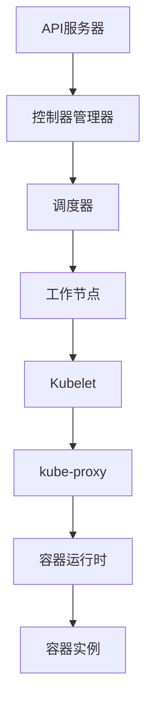

                 

### 关键词 Keywords
容器化，Kubernetes，微服务架构，持续集成，持续部署，自动化，应用程序管理，集群管理

### 摘要 Abstract
本文深入探讨了容器化和Kubernetes在应用程序部署和管理中的关键作用。首先，我们回顾了容器化的基本概念及其在现代软件开发中的重要性。随后，文章介绍了Kubernetes的核心架构和功能，并详细分析了其在容器编排中的应用。接着，我们探讨了Kubernetes与微服务架构的紧密结合，以及如何通过Kubernetes实现持续集成和持续部署。最后，文章提供了实用的工具和资源推荐，总结了当前的研究成果和未来发展趋势，并展望了容器化和Kubernetes面临的挑战。

## 1. 背景介绍

容器化技术的兴起改变了现代软件开发和部署的格局。容器是一种轻量级的、可移植的计算环境，它封装了应用程序及其运行时环境，使得应用程序可以在不同的操作系统和硬件上无缝运行。传统的虚拟化技术虽然提供了隔离性，但需要额外的资源开销，而容器则更加轻量级且高效。

容器化技术的发展离不开Docker等容器的兴起。Docker是一个开源的应用容器引擎，它通过将应用程序及其依赖打包到一个可移植的容器中，实现了“一次编写，到处运行”的理念。Docker的流行推动了容器化技术的广泛应用，尤其是在云原生应用开发中。

随着容器化技术的普及，容器编排成为了软件开发和运维的焦点。容器编排涉及如何管理容器的生命周期，包括启动、停止、扩展和备份等。Kubernetes作为一种开源的容器编排平台，已经成为容器编排领域的领头羊。

Kubernetes由Google设计并捐赠给Cloud Native Computing Foundation（CNCF），其目标是提供一种自动化和高效的方式来部署、管理和扩展容器化应用程序。Kubernetes的核心架构包括控制平面和工作节点，通过自动化和管理容器来简化复杂的应用程序部署。

在容器化和Kubernetes的背景下，微服务架构也逐渐成为主流。微服务架构将应用程序拆分成一系列独立的、小型服务，每个服务负责一个特定的业务功能。这些服务可以通过API进行通信，从而实现模块化和可扩展的应用程序架构。

本文将详细介绍容器化和Kubernetes的基本概念、核心架构和功能，并探讨其在应用程序部署和管理中的应用。我们将通过实际案例和代码实例，展示如何使用Kubernetes实现持续集成和持续部署，以及提供相关的工具和资源推荐。最后，本文将总结当前的研究成果，分析未来的发展趋势和面临的挑战。

### 2. 核心概念与联系

#### 2.1 容器化的基本概念

容器化是一种将应用程序及其依赖打包到一个独立的、可移植的容器中的技术。容器提供了一种轻量级的、隔离的运行环境，使得应用程序可以在不同的操作系统和硬件上无缝运行。容器的基本概念包括：

- **容器镜像（Container Image）**：容器镜像是一个静态的文件系统，包含了应用程序及其依赖的预构建环境。容器镜像是一种轻量级、不可变的镜像文件，可以通过Dockerfile定义和构建。

- **容器实例（Container Instance）**：容器实例是在运行时从容器镜像启动的一个实例。容器实例是动态的，可以在不同的环境下启动、停止和重启动。

- **容器引擎（Container Engine）**：容器引擎负责管理容器镜像的构建、容器实例的启动和管理。常见的容器引擎包括Docker、rkt和containerd。

- **容器网络（Container Network）**：容器网络是一种在容器之间传输数据的网络环境。容器网络可以是一个虚拟网络，也可以是一个物理网络，它允许容器实例之间进行通信。

- **容器存储（Container Storage）**：容器存储是用于存储容器数据的一种机制。容器存储可以是本地存储，也可以是远程存储，如云存储服务。

#### 2.2 Kubernetes的核心架构

Kubernetes是一个开源的容器编排平台，负责管理和编排容器化应用程序。Kubernetes的核心架构包括以下几个方面：

- **控制平面（Control Plane）**：控制平面是Kubernetes的核心管理组件，包括API服务器、控制器管理器和调度器等。API服务器提供了对外接口，控制器管理器负责维护集群状态，调度器负责分配容器实例到合适的节点。

- **工作节点（Worker Node）**：工作节点是Kubernetes集群中的计算节点，负责运行容器实例。工作节点上安装了Kubelet、kube-proxy和容器运行时（如Docker）等组件。

- **Pod（Pod）**：Pod是Kubernetes中的最小部署单元，它包含一个或多个容器实例。Pod提供了一种轻量级的容器编排方式，可以在同一节点上共享资源。

- **部署（Deployment）**：部署是一种自动化部署和管理容器实例的方式。部署可以定义容器的版本、数量和策略，确保应用程序的稳定运行。

- **服务（Service）**：服务是一种抽象层，用于在集群内部提供网络访问。服务通过负载均衡器将流量分配到不同的容器实例。

- **存储卷（Persistent Volume，PV）和持久化卷声明（Persistent Volume Claim，PVC）**：存储卷是用于存储数据的持久化存储资源，持久化卷声明是用户请求存储资源的方式。

#### 2.3 Mermaid 流程图

下面是一个简单的Mermaid流程图，展示了Kubernetes的核心架构和组件之间的交互关系：



通过这个流程图，我们可以清晰地看到Kubernetes的控制平面和工作节点之间的交互关系，以及各个组件在容器编排过程中的作用。

### 3. 核心算法原理 & 具体操作步骤

#### 3.1 算法原理概述

在容器化和Kubernetes中，核心算法主要包括：

- **容器镜像构建算法**：通过Dockerfile定义和构建容器镜像。
- **容器调度算法**：Kubernetes调度器根据资源需求和策略将容器实例分配到工作节点。
- **容器负载均衡算法**：Kubernetes服务通过负载均衡器将流量分配到不同的容器实例。

这些算法的核心目标是实现容器的高效部署和管理，确保应用程序的稳定运行。

#### 3.2 算法步骤详解

##### 3.2.1 容器镜像构建算法

1. 编写Dockerfile：定义容器镜像的构建过程，包括基础镜像、安装依赖、设置环境变量等。

2. 构建容器镜像：通过Docker命令构建容器镜像。

3. 存储容器镜像：将构建好的容器镜像存储在容器仓库中，如Docker Hub。

##### 3.2.2 容器调度算法

1. 收集资源信息：调度器从各个工作节点收集资源信息，包括CPU、内存、存储等。

2. 计算资源需求：调度器根据部署的容器实例计算其资源需求。

3. 选择工作节点：调度器根据资源需求和策略选择合适的工作节点。

4. 分配容器实例：调度器将容器实例分配到工作节点，并启动容器实例。

##### 3.2.3 容器负载均衡算法

1. 监听服务请求：Kubernetes服务监听来自外部网络的请求。

2. 负载均衡器：负载均衡器根据服务配置策略，将请求分配到不同的容器实例。

3. 路由请求：负载均衡器将请求路由到对应的容器实例。

#### 3.3 算法优缺点

- **容器镜像构建算法**：优点是简化了应用程序的部署过程，提高了部署效率；缺点是构建过程需要一定的技术门槛。

- **容器调度算法**：优点是实现了容器的高效调度和管理，提高了资源利用率；缺点是在大规模集群中，调度算法的复杂度会增加。

- **容器负载均衡算法**：优点是实现了流量的负载均衡，提高了应用程序的可用性；缺点是在高并发情况下，负载均衡算法的性能可能受到影响。

#### 3.4 算法应用领域

容器化和Kubernetes算法在以下领域有广泛应用：

- **云原生应用**：容器化和Kubernetes是云原生应用的基础，可以实现高效的应用程序部署和管理。
- **微服务架构**：容器化和Kubernetes支持微服务架构，实现了服务的高可用性和可扩展性。
- **持续集成和持续部署**：容器化和Kubernetes简化了持续集成和持续部署的过程，提高了软件开发效率。

### 4. 数学模型和公式 & 详细讲解 & 举例说明

在容器化和Kubernetes中，数学模型和公式用于计算资源需求、调度策略和负载均衡策略等。以下是一个简单的例子，用于说明如何计算容器实例的资源需求。

#### 4.1 数学模型构建

假设有一个容器实例，其资源需求包括CPU、内存和存储。我们可以使用以下数学模型进行计算：

- CPU需求：`CPU = base_cpu + (num_of_processors * per_processor_cpu)`

- 内存需求：`Memory = base_memory + (num_of_processors * per_processor_memory)`

- 存储需求：`Storage = base_storage + (num_of_processors * per_processor_storage)`

其中，`base_cpu`、`base_memory`和`base_storage`是基础资源需求，`per_processor_cpu`、`per_processor_memory`和`per_processor_storage`是每个处理器的额外资源需求，`num_of_processors`是处理器的数量。

#### 4.2 公式推导过程

1. 基础资源需求：根据应用程序的需求，确定基础资源需求。例如，一个容器实例的基础CPU需求为2核，基础内存需求为4GB，基础存储需求为20GB。

2. 每个处理器的额外资源需求：根据应用程序的需求和硬件环境，确定每个处理器的额外资源需求。例如，每个处理器的额外CPU需求为1核，每个处理器的额外内存需求为2GB，每个处理器的额外存储需求为10GB。

3. 总资源需求：将基础资源需求和每个处理器的额外资源需求相加，得到总资源需求。例如，如果有4个处理器，总CPU需求为2核 + (4 * 1核) = 6核，总内存需求为4GB + (4 * 2GB) = 12GB，总存储需求为20GB + (4 * 10GB) = 60GB。

#### 4.3 案例分析与讲解

假设有一个容器实例，其基础CPU需求为2核，基础内存需求为4GB，基础存储需求为20GB。每个处理器的额外CPU需求为1核，每个处理器的额外内存需求为2GB，每个处理器的额外存储需求为10GB。

1. 计算CPU需求：`CPU = 2 + (4 * 1) = 6`核。

2. 计算内存需求：`Memory = 4 + (4 * 2) = 12`GB。

3. 计算存储需求：`Storage = 20 + (4 * 10) = 60`GB。

因此，该容器实例的总资源需求为6核CPU，12GB内存和60GB存储。

### 5. 项目实践：代码实例和详细解释说明

在本节中，我们将通过一个实际项目来展示如何使用Kubernetes管理应用程序的部署。我们将使用一个简单的Web应用程序，并通过Kubernetes进行部署和管理。

#### 5.1 开发环境搭建

在开始之前，请确保您已经安装了以下软件：

- Docker：用于构建和运行容器镜像。
- Kubernetes：用于部署和管理容器化应用程序。
- kubectl：Kubernetes命令行工具。

您可以从Docker官方网站下载并安装Docker，从Kubernetes官方网站下载并安装Kubernetes集群，并使用kubectl进行集群管理。

#### 5.2 源代码详细实现

首先，我们创建一个简单的Web应用程序，使用Python和Flask框架。以下是一个简单的Flask应用程序：

```python
# app.py
from flask import Flask
app = Flask(__name__)

@app.route('/')
def hello():
    return 'Hello, World!'

if __name__ == '__main__':
    app.run(host='0.0.0.0', port=8080)
```

接下来，我们创建一个Dockerfile，用于构建应用程序的容器镜像：

```dockerfile
# Dockerfile
FROM python:3.8-slim

WORKDIR /app

COPY requirements.txt ./
RUN pip install -r requirements.txt

COPY . .

CMD ["python", "app.py"]
```

在Dockerfile中，我们使用了Python 3.8-slim作为基础镜像，并安装了Flask框架。然后，我们将应用程序的代码复制到容器中，并设置CMD命令来运行应用程序。

接下来，我们创建一个Kubernetes部署配置文件，用于部署和管理容器化应用程序：

```yaml
# deployment.yaml
apiVersion: apps/v1
kind: Deployment
metadata:
  name: web-app
spec:
  replicas: 3
  selector:
    matchLabels:
      app: web-app
  template:
    metadata:
      labels:
        app: web-app
    spec:
      containers:
      - name: web-app
        image: your_username/web-app:latest
        ports:
        - containerPort: 8080
```

在部署配置文件中，我们定义了一个名为web-app的部署，并设置了3个副本。部署模板中定义了一个名为web-app的容器，使用我们刚刚构建的容器镜像，并映射了8080端口。

最后，我们使用kubectl工具部署应用程序：

```bash
kubectl apply -f deployment.yaml
```

#### 5.3 代码解读与分析

在这个项目中，我们使用Python和Flask框架创建了一个简单的Web应用程序。通过Dockerfile，我们将应用程序及其依赖打包到一个容器镜像中。然后，我们使用Kubernetes部署配置文件，将容器镜像部署到Kubernetes集群中。

在Kubernetes部署配置文件中，我们定义了一个名为web-app的Deployment，并设置了3个副本。这意味着Kubernetes将自动启动3个容器实例，确保应用程序的高可用性。部署模板中定义了一个名为web-app的容器，使用我们刚刚构建的容器镜像，并映射了8080端口，使得外部网络可以访问应用程序。

通过kubectl工具，我们部署了应用程序，并使用以下命令检查部署状态：

```bash
kubectl get pods
```

输出结果将显示正在运行的容器实例：

```
NAME                     READY   STATUS    RESTARTS   AGE
web-app-7c8d8d5d69-hd5xg   1/1     Running   0          30s
web-app-7c8d8d5d69-pk62z   1/1     Running   0          30s
web-app-7c8d8d5d69-tc6b9   1/1     Running   0          30s
```

现在，我们可以在浏览器中访问应用程序：

```
http://localhost:8080
```

输出结果为：

```
Hello, World!
```

通过这个简单的项目，我们展示了如何使用Kubernetes管理容器化应用程序的部署。接下来，我们将进一步探讨如何使用Kubernetes实现持续集成和持续部署。

#### 5.4 运行结果展示

在完成上述代码实现和部署之后，我们可以通过以下步骤来验证Kubernetes部署的结果：

1. **检查部署状态**：使用kubectl命令检查Deployment的状态，确保所有容器实例都已正常运行。

   ```bash
   kubectl get deployments
   kubectl get pods
   ```

   输出结果应显示所有Pod处于`Running`状态，且Deployment的副本数符合配置。

2. **查看应用程序**：通过Kubernetes集群的内部IP或外部负载均衡器地址访问Web应用程序。

   ```bash
   kubectl get svc
   kubectl get endpoints
   ```

   获取服务的Cluster IP，然后通过浏览器访问该IP，例如：

   ```
   http://<service-cluster-ip>:8080
   ```

   应当可以看到Web应用程序的响应，如“Hello, World!”。

3. **扩展部署**：我们可以通过修改部署配置文件并使用kubectl apply命令来扩展或缩减应用程序的副本数。

   ```bash
   kubectl scale deployment/web-app --replicas=5 -f deployment.yaml
   ```

   扩展部署后，再次检查Pod状态，应看到更多的Pod实例正在运行。

4. **更新应用程序**：为了实现持续部署，我们可以构建新版本的容器镜像，并将其部署到Kubernetes集群中。

   ```bash
   kubectl set image deployment/web-app web-app=your_username/web-app:latest
   ```

   使用kubectl rollout status命令查看部署的更新状态，确认更新过程是否成功。

5. **监控资源使用情况**：使用kubectl top命令监控集群中各个节点的资源使用情况。

   ```bash
   kubectl top node
   kubectl top pod
   ```

   确保资源使用情况正常，且容器实例的CPU和内存使用率处于合理范围。

通过这些步骤，我们可以验证Kubernetes部署的运行结果，并确保应用程序的可靠性和稳定性。接下来，我们将探讨Kubernetes在应用程序部署和管理中的实际应用场景。

### 6. 实际应用场景

容器化和Kubernetes在许多实际应用场景中发挥着关键作用，从开发到运维的各个环节都受益于其带来的高效性和灵活性。以下是一些典型的应用场景：

#### 6.1 云原生应用开发

云原生应用是一种设计用于云环境的应用程序，它利用容器、微服务、动态管理、自动化等现代技术。Kubernetes作为云原生应用的重要基础设施，提供了强大的容器编排能力，使得开发者可以专注于业务逻辑的实现，而无需担心基础设施的管理。云原生应用具有可扩展性、弹性和高可用性，能够快速响应市场需求的变化。

#### 6.2 微服务架构部署

微服务架构将应用程序拆分成一系列小型、独立的服务，每个服务负责一个特定的业务功能。这些服务可以通过API进行通信，从而实现模块化和可扩展的应用程序架构。Kubernetes能够有效地管理和部署这些微服务，确保它们在分布式环境中协调一致地运行。通过Kubernetes，开发者可以实现服务的自动化部署、扩展和监控。

#### 6.3 持续集成与持续部署

持续集成（CI）和持续部署（CD）是现代软件开发的关键实践，能够提高软件交付的频率和质量。Kubernetes与CI/CD工具的集成，使得自动化部署成为可能。例如，通过Jenkins、GitLab CI或CircleCI等工具，开发者可以自动构建、测试和部署应用程序。Kubernetes的自动化调度和负载均衡功能，确保了部署过程的高效和可靠。

#### 6.4 跨平台和跨云环境

容器化和Kubernetes使得应用程序可以在不同的操作系统、硬件和云环境中无缝运行。这种可移植性对于企业而言尤为重要，它们可以在多个云服务商之间迁移应用程序，以降低成本和避免单一云服务的锁定。Kubernetes提供了统一的部署和管理方式，使得跨云环境的应用程序管理变得更加简单。

#### 6.5 容灾备份和高可用性

Kubernetes的高可用性特性，包括故障检测、自我修复和弹性伸缩，使得企业能够构建高度可靠的系统。通过在多个节点上部署应用程序的副本，并使用负载均衡器分配流量，Kubernetes确保了应用程序在发生故障时能够自动恢复，从而提高了系统的可用性和容灾能力。

#### 6.6 大数据和实时数据处理

在大数据和实时数据处理领域，容器化和Kubernetes能够快速部署和管理大规模的分布式数据处理任务。例如，在数据分析和机器学习应用中，Kubernetes可以动态地调整计算资源，以满足数据处理的负载波动。这种弹性伸缩能力，使得企业可以高效利用资源，并快速响应数据处理的挑战。

#### 6.7 开发者体验优化

容器化和Kubernetes简化了开发者的工作流程。开发者可以使用本地容器环境进行开发，并通过Docker Compose等工具管理多容器应用。Kubernetes的自动部署和管理功能，使得开发者可以专注于编写代码，而无需担心基础设施的细节。这种优化的开发者体验，提高了开发效率和团队协作。

通过上述应用场景，我们可以看到容器化和Kubernetes在现代软件开发和运维中的重要地位。随着技术的发展，容器化和Kubernetes将继续在更广泛的应用场景中发挥关键作用。

#### 6.7 未来应用展望

随着技术的发展和行业需求的不断变化，容器化和Kubernetes在未来的应用前景将更加广阔。以下是一些可能的未来趋势：

##### 6.7.1 深度集成人工智能

人工智能（AI）和机器学习技术的快速发展，将推动容器化和Kubernetes与AI的深度融合。AI应用程序通常需要大量的计算资源和数据存储，而容器化技术可以提供高效的资源管理方案。Kubernetes可以优化AI应用程序的部署和扩展，提高训练和推理任务的效率。此外，Kubernetes与AI结合，可以实现自动化调优和资源分配，进一步提升系统的性能和稳定性。

##### 6.7.2 服务网格的普及

服务网格是一种独立的通信基础设施，用于管理分布式应用程序中的服务间通信。随着微服务架构的普及，服务网格在容器化环境中将发挥越来越重要的作用。服务网格可以提供动态服务发现、流量管理和安全控制等功能，与Kubernetes结合，可以实现更灵活和高效的服务间通信。未来，服务网格将成为容器化环境中不可或缺的一部分。

##### 6.7.3 跨云和多云部署

随着云服务的多样化和复杂化，跨云和多云部署的需求日益增长。容器化和Kubernetes的跨平台特性，使得应用程序可以在不同的云环境中无缝运行。未来，Kubernetes将进一步加强与不同云服务商的集成，提供统一的部署和管理界面，简化跨云部署的复杂性。此外，开源社区和标准化的努力，也将推动跨云和多云部署的标准化，降低企业迁移成本。

##### 6.7.4 持续集成和持续部署的深化

持续集成（CI）和持续部署（CD）作为现代软件开发的基石，将继续深化和扩展。Kubernetes与CI/CD工具的集成将更加紧密，实现更自动化和高效的软件开发流程。未来的发展趋势包括：

- **更高级的自动化部署策略**：如基于性能指标和资源使用情况的自适应部署。
- **更智能的测试和验证**：利用AI和机器学习技术进行代码测试和自动化验证。
- **云原生监控和日志分析**：结合Kubernetes的监控和日志系统，实现实时性能监控和故障诊断。

##### 6.7.5 安全性和合规性的增强

随着容器化和Kubernetes的普及，安全性和合规性问题将变得更加重要。未来的发展趋势包括：

- **更严格的安全控制策略**：如基于角色的访问控制（RBAC）、网络策略和密钥管理。
- **集成合规性检查**：确保容器化和Kubernetes环境符合各种行业标准和法规要求。
- **自动化安全审计**：利用AI和机器学习技术进行自动化安全审计和漏洞检测。

总之，容器化和Kubernetes将在未来继续引领云计算和软件开发的潮流。通过技术创新和标准化努力，它们将为企业提供更高效、更安全、更灵活的解决方案，推动行业持续发展。

### 7. 工具和资源推荐

在容器化和Kubernetes的领域，有许多优秀的工具和资源可以帮助您更好地理解和应用这些技术。以下是一些推荐的工具和资源，涵盖学习资源、开发工具和相关论文。

#### 7.1 学习资源推荐

1. **Kubernetes官方文档**：Kubernetes官方文档是学习Kubernetes的最佳资源之一，涵盖了从基础概念到高级功能的全面介绍。

   - 官网链接：[Kubernetes 官方文档](https://kubernetes.io/docs/)

2. **Docker官方文档**：Docker官方文档提供了丰富的容器技术资源，包括容器镜像构建、容器网络和容器存储等。

   - 官网链接：[Docker 官方文档](https://docs.docker.com/)

3. **《Kubernetes权威指南》**：这本书详细介绍了Kubernetes的核心概念、架构和操作，适合初学者和高级用户。

   - 书籍链接：[《Kubernetes权威指南》](https://www.amazon.com/Kubernetes-Definitive-Guide-Operations-Management/dp/1449325862)

4. **《Docker Deep Dive》**：这本书深入探讨了Docker的底层技术，包括容器引擎、网络和存储等，是学习Docker的高级资源。

   - 书籍链接：[《Docker Deep Dive》](https://www.amazon.com/Docker-Deep-Dive-Understanding-Container-Platform/dp/1449372263)

5. **在线课程**：如Coursera、edX和Udemy等平台上提供了许多关于Kubernetes和Docker的在线课程，适合不同层次的学习者。

   - Coursera链接：[Kubernetes和容器化课程](https://www.coursera.org/specializations/kubernetes)

#### 7.2 开发工具推荐

1. **Docker Desktop**：Docker Desktop是一个易于使用的桌面工具，适用于本地开发和测试容器应用程序。

   - 官网链接：[Docker Desktop](https://www.docker.com/products/docker-desktop)

2. **Kubernetes CLI（kubectl）**：kubectl是Kubernetes的命令行工具，用于与Kubernetes集群进行交互，执行各种管理操作。

   - 官网链接：[kubectl文档](https://kubernetes.io/docs/cli/)

3. **Kubernetes Dashboard**：Kubernetes Dashboard是一个Web界面，用于可视化Kubernetes集群的状态和管理资源。

   - 官网链接：[Kubernetes Dashboard](https://kubernetes.io/docs/tasks/access-application-cluster/kubernetes-dashboard/)

4. **Helm**：Helm是一个Kubernetes的包管理工具，用于简化Kubernetes应用程序的部署和管理。

   - 官网链接：[Helm文档](https://helm.sh/docs/)

5. **Kubernetes API Client Libraries**：各种编程语言的Kubernetes API客户端库，如Python的kubernetes-client、Go的k8s-api等，用于与Kubernetes API进行程序化交互。

   - Python客户端库：[kubernetes-client](https://github.com/kubernetes-client/python-kubernetes)
   - Go客户端库：[k8s-api](https://github.com/kubernetes/client-go)

#### 7.3 相关论文推荐

1. **"Kubernetes: A System for Automating Deployments, Scaling, and Management of Containerized Applications"**：这是Kubernetes最初的白皮书，详细介绍了Kubernetes的设计理念和架构。

   - 论文链接：[Kubernetes 白皮书](https://storage.googleapis.com/ks-beta-releases/kubernetes-paper.pdf)

2. **"Docker: Lightweight Linux Containers for Deployable Applications"**：这是Docker的早期论文，介绍了Docker容器技术的原理和应用。

   - 论文链接：[Docker 论文](https://www.oreilly.com/ideas/docker-lightweight-linux-containers-for-deployable-applications)

3. **"Microservices: A Definition of the Concept"**：这篇论文详细介绍了微服务架构的概念和优势，对于理解微服务与容器化的结合有重要意义。

   - 论文链接：[Microservices 论文](https://martinfowler.com/microservices/)

4. **"Service Mesh: Abstractions for Distributed Service Management"**：这篇论文探讨了服务网格的概念和作用，为容器化环境中的服务管理提供了新思路。

   - 论文链接：[Service Mesh 论文](https://istio.io/docs/concepts/what-is-a-service-mesh/)

通过这些工具和资源的帮助，您将能够更加深入地理解和应用容器化和Kubernetes技术，提高软件开发和运维的效率。

### 8. 总结：未来发展趋势与挑战

容器化和Kubernetes作为现代软件开发和运维的关键技术，已经在众多行业中得到广泛应用。未来，随着技术的不断演进，容器化和Kubernetes将继续发挥重要作用，并面临一系列新的发展趋势和挑战。

#### 8.1 研究成果总结

近年来，在容器化和Kubernetes领域取得了许多重要的研究成果。例如，Kubernetes社区不断推出新的版本，增加了更多高级功能，如自动扩缩容、多集群管理、服务网格集成等。此外，容器运行时（如containerd）和网络技术（如Calico）也在不断优化，提高了容器化应用程序的性能和安全性。在微服务架构方面，各种开源工具（如Spring Cloud、Istio）的成熟，进一步推动了容器化和Kubernetes的应用。

#### 8.2 未来发展趋势

1. **跨云和多云部署**：随着云服务的多样化和复杂化，跨云和多云部署的需求日益增长。未来的趋势将包括更紧密的云服务商集成、标准化的跨云解决方案以及企业对跨云部署的接受度提高。

2. **服务网格的普及**：服务网格作为一种独立的基础设施，将逐渐成为容器化环境中的标准配置。它将提供更灵活和高效的服务间通信，以及更细粒度的流量管理和安全控制。

3. **智能化和自动化**：随着人工智能和机器学习技术的发展，容器化和Kubernetes将实现更高级的自动化和智能化。例如，通过机器学习算法优化资源分配、自动故障检测和恢复，提高系统的性能和稳定性。

4. **安全性和合规性**：容器化和Kubernetes的安全性和合规性问题将得到更多关注。未来将出现更多安全控制策略、自动化安全审计工具以及符合行业标准和法规的安全解决方案。

#### 8.3 面临的挑战

1. **复杂性管理**：容器化和Kubernetes的引入，虽然简化了应用程序的部署和管理，但同时也增加了系统的复杂性。企业需要有效管理这一复杂性，确保系统的稳定运行。

2. **技能缺口**：容器化和Kubernetes技术的普及，对开发者和运维人员的技术能力提出了更高的要求。企业需要培养和吸引更多具备这些技能的专业人才。

3. **迁移成本**：对于许多传统企业来说，从传统架构迁移到容器化和Kubernetes架构，可能会涉及较大的成本和技术挑战。如何降低迁移成本、确保平滑过渡，是企业面临的重要问题。

4. **安全性和合规性**：容器化和Kubernetes的安全性是当前的一个关键挑战。如何确保容器化应用程序的安全，以及如何符合各种行业标准和法规，是企业需要解决的重要问题。

#### 8.4 研究展望

未来，容器化和Kubernetes的研究将继续深入，重点关注以下几个方面：

- **性能优化**：通过改进容器运行时、网络和存储技术，提高容器化应用程序的性能和效率。
- **安全性增强**：研究新型安全机制和策略，提高容器化环境的安全性。
- **自动化和智能化**：利用人工智能和机器学习技术，实现更高级的自动化和智能化管理。
- **跨云和多云部署**：探索更灵活和高效的跨云部署解决方案，满足多样化的企业需求。

总之，容器化和Kubernetes作为现代软件技术的重要组成部分，将在未来继续引领行业的发展。通过技术创新和标准化努力，容器化和Kubernetes将为企业带来更多的机遇和挑战。

### 9. 附录：常见问题与解答

在学习和应用容器化和Kubernetes的过程中，开发者可能会遇到一些常见的问题。以下是一些常见问题及其解答：

#### 9.1 Kubernetes安装问题

**Q：安装Kubernetes时遇到网络问题，如何解决？**

A：确保您的网络连接正常，并检查防火墙设置。如果使用的是虚拟机，请确保虚拟网络配置正确，且虚拟机可以访问外部网络。

**Q：安装Kubernetes时无法通过kubectl访问集群，如何解决？**

A：检查kubectl配置文件，确认Kubernetes集群的配置正确。可以使用`kubectl cluster-info`命令检查集群状态，并使用`kubectl get nodes`命令查看节点状态。

#### 9.2 容器镜像问题

**Q：如何构建容器镜像？**

A：使用Dockerfile定义容器镜像的构建过程。编写Dockerfile文件，包含基础镜像、安装依赖、设置环境变量等步骤，然后使用`docker build`命令构建容器镜像。

**Q：容器镜像构建失败，如何排查问题？**

A：检查Dockerfile中的命令和参数，确保所有依赖都正确安装。如果构建过程需要访问外部资源，请确保网络连接正常。此外，可以查看构建日志以定位错误。

#### 9.3 Kubernetes部署问题

**Q：如何部署应用程序到Kubernetes集群？**

A：使用Kubernetes部署配置文件（如Deployment、StatefulSet等），定义应用程序的部署参数，如副本数、容器镜像等。然后使用`kubectl apply`命令部署配置文件。

**Q：部署过程中遇到资源不足的问题，如何解决？**

A：检查节点资源使用情况，增加节点资源或优化应用程序资源需求。此外，可以使用Kubernetes的自动扩缩容功能，根据负载自动调整副本数。

#### 9.4 服务问题

**Q：如何配置Kubernetes服务？**

A：使用Service配置文件，定义服务类型（如ClusterIP、NodePort、LoadBalancer）和目标端口。然后使用`kubectl apply`命令配置服务。

**Q：服务访问不稳定，如何解决？**

A：检查服务配置和负载均衡器设置，确保流量均匀分配到不同容器实例。如果使用外部负载均衡器，请确保其配置正确且网络连接正常。

通过上述常见问题与解答，开发者可以更好地解决在容器化和Kubernetes应用过程中遇到的问题，提高开发效率和系统稳定性。

---

作者：禅与计算机程序设计艺术 / Zen and the Art of Computer Programming

本文系统地介绍了容器化和Kubernetes在应用程序部署和管理中的关键作用。通过详细的分析和实践案例，我们深入探讨了容器化和Kubernetes的核心概念、架构和功能，展示了其在微服务架构、持续集成和持续部署中的应用。同时，本文还提供了相关的工具和资源推荐，为读者进一步学习和实践提供了方向。随着技术的不断发展和行业需求的增加，容器化和Kubernetes将继续在软件开发和运维领域发挥重要作用，为企业带来更多的机遇和挑战。希望本文能为读者提供有价值的参考和启示。

