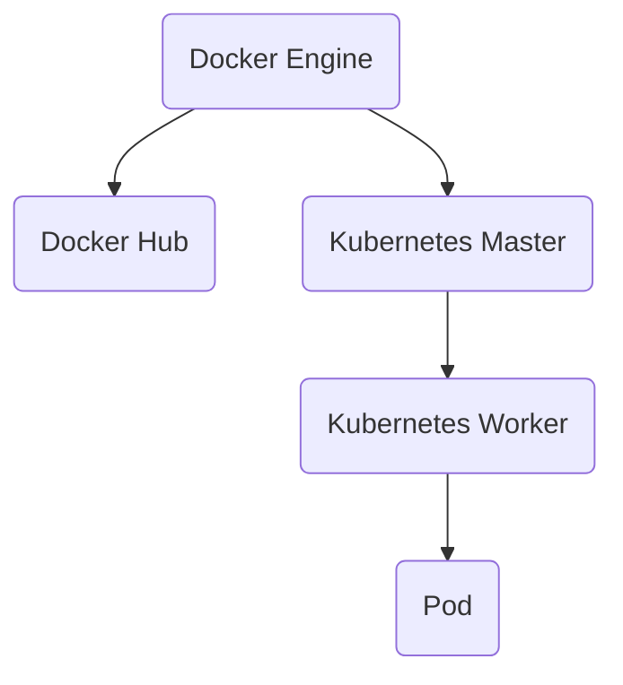

                 

关键词：容器化技术、Docker、Kubernetes、实践、应用场景、未来展望

摘要：本文旨在深入探讨容器化技术，尤其是Docker和Kubernetes的应用与实践。通过详细的背景介绍、核心概念解析、算法原理分析以及项目实践案例，我们将全面了解容器化技术在现代软件开发和运维中的重要性，并对其未来发展趋势和面临的挑战进行展望。

## 1. 背景介绍

在软件工程领域，容器化技术已经成为软件开发和运维的关键趋势。传统的虚拟化技术虽然可以提供隔离和资源分配的能力，但它们往往需要额外的虚拟机管理，增加了复杂性和资源消耗。相比之下，容器化技术通过轻量级的隔离机制，使得应用程序可以在几乎任何环境中一致地运行，从而极大地提高了开发和运维的效率。

Docker是容器化技术的一个典型代表。它提供了一个简单、轻量级且易于使用的容器平台，允许开发者将应用程序及其依赖环境打包成一个可移植的容器镜像，从而实现开发环境与生产环境的一致性。Kubernetes则是一个开源的容器编排平台，它通过自动化容器的部署、扩展和管理，使得大型分布式系统的运维变得更加简单和高效。

本文将首先介绍Docker和Kubernetes的基本概念和原理，然后通过具体的应用案例来展示如何在实际项目中使用这些技术，并探讨其在未来软件开发和运维中的发展趋势和挑战。

## 2. 核心概念与联系

### 2.1 Docker

Docker是一个开源的应用容器引擎，它允许开发者将应用程序及其依赖环境打包成一个容器镜像，以便在不同的环境中快速部署和运行。Docker容器基于Linux容器（LXC）技术，通过cgroups和namespace机制来实现资源隔离和独立运行环境。Docker的主要组件包括Docker Engine、Docker Hub和Docker Compose。

- **Docker Engine**：负责容器的创建、启动、运行和管理。
- **Docker Hub**：一个在线仓库，用于存储和共享容器镜像。
- **Docker Compose**：用于定义和运行多容器应用的工具。

### 2.2 Kubernetes

Kubernetes是一个开源的容器编排平台，它提供了一系列自动化功能，包括容器的部署、扩展、更新和自我修复。Kubernetes通过集群管理器来协调容器，使得开发者可以轻松地管理大规模的分布式系统。Kubernetes的主要组件包括Master节点、Worker节点和Pod。

- **Master节点**：负责集群的调度、监控和管理。
- **Worker节点**：运行容器并执行Master节点的指令。
- **Pod**：Kubernetes的最小工作单元，包含一个或多个容器。

### 2.3 Docker与Kubernetes的关系

Docker提供了容器化的基础，而Kubernetes则提供了容器的编排和管理。Docker容器可以被Kubernetes集群管理，从而实现更高级别的自动化和协调。例如，使用Kubernetes，开发者可以轻松地部署多个Docker容器，并自动处理故障转移、负载均衡和资源分配。

### 2.4 Mermaid流程图

以下是一个简化的Mermaid流程图，展示了Docker与Kubernetes之间的交互关系：



在这个流程图中，Docker Engine负责创建和管理容器镜像，Docker Hub用于存储和共享这些镜像。Kubernetes Master节点负责集群的管理和调度，Worker节点负责运行容器，而Pod则是Kubernetes的最小工作单元。

---

通过上述背景介绍和核心概念解析，我们为后续的深入探讨奠定了基础。在接下来的章节中，我们将详细分析Docker和Kubernetes的算法原理、数学模型、项目实践以及未来应用场景。让我们继续深入探讨容器化技术的魅力。

---

## 3. 核心算法原理 & 具体操作步骤

### 3.1 算法原理概述

容器化技术的核心在于其能够提供一致的开发和部署环境。这种一致性是通过容器镜像和容器编排实现的。以下是Docker和Kubernetes的核心算法原理：

#### 3.1.1 Docker

Docker的主要算法原理包括：

- **容器镜像**：容器镜像是一个静态的文件系统，它包含了应用程序及其依赖环境。通过使用Dockerfile，开发者可以定义如何构建容器镜像。
- **容器运行时**：容器运行时负责启动和管理容器。Docker Engine是这个运行时的实现。
- **容器网络**：容器可以通过Docker Network功能来建立内部网络连接。

#### 3.1.2 Kubernetes

Kubernetes的核心算法原理包括：

- **容器编排**：Kubernetes通过其API服务器接收并处理容器请求，然后根据定义的资源配置来部署和管理容器。
- **自动扩缩容**：Kubernetes可以根据当前的工作负载自动调整集群中的容器数量。
- **服务发现和负载均衡**：Kubernetes提供了一种方式来自动发现容器并均衡负载。

### 3.2 算法步骤详解

#### 3.2.1 Docker

以下是使用Docker进行容器化部署的基本步骤：

1. **编写Dockerfile**：定义如何构建容器镜像。
    ```Dockerfile
    FROM ubuntu:18.04
    RUN apt-get update && apt-get install -y python3
    COPY . /app
    RUN pip3 install -r requirements.txt
    EXPOSE 8000
    ```

2. **构建容器镜像**：使用Docker CLI构建镜像。
    ```bash
    docker build -t myapp .
    ```

3. **运行容器**：使用构建好的镜像运行容器。
    ```bash
    docker run -d -p 8000:8000 myapp
    ```

4. **管理容器**：使用Docker CLI管理容器。
    ```bash
    docker ps
    docker stop <container_id>
    ```

#### 3.2.2 Kubernetes

以下是使用Kubernetes进行容器编排的基本步骤：

1. **定义资源配置**：在Kubernetes中，资源配置是通过YAML文件定义的。以下是一个简单的Deployment配置文件示例。
    ```yaml
    apiVersion: apps/v1
    kind: Deployment
    metadata:
      name: myapp-deployment
    spec:
      replicas: 3
      selector:
        matchLabels:
          app: myapp
      template:
        metadata:
          labels:
            app: myapp
        spec:
          containers:
          - name: myapp
            image: myapp:latest
            ports:
            - containerPort: 8000
    ```

2. **部署应用程序**：使用kubectl工具部署应用程序。
    ```bash
    kubectl apply -f myapp-deployment.yaml
    ```

3. **查看部署状态**：使用kubectl查看部署状态。
    ```bash
    kubectl get deployments
    ```

4. **扩展应用程序**：根据需求扩展部署的副本数量。
    ```yaml
    apiVersion: apps/v1
    kind: Deployment
    metadata:
      name: myapp-deployment
    spec:
      replicas: 5
    ```

    ```bash
    kubectl apply -f myapp-deployment.yaml
    ```

### 3.3 算法优缺点

#### 3.3.1 Docker

- **优点**：
  - **轻量级**：容器镜像非常轻量，相比虚拟机可以节省大量的存储资源。
  - **可移植性**：容器镜像可以在任何支持Docker的环境中运行，无需额外的配置。
  - **快速部署**：容器镜像的部署和启动速度非常快。

- **缺点**：
  - **安全性问题**：容器虽然提供了隔离机制，但并不意味着完全安全。
  - **复杂性**：对于初学者来说，Docker的配置和管理可能显得复杂。

#### 3.3.2 Kubernetes

- **优点**：
  - **自动化**：Kubernetes提供了自动化的部署、扩展和管理功能，极大地提高了运维效率。
  - **高可用性**：Kubernetes能够自动处理故障转移和负载均衡，确保系统的稳定性。
  - **可扩展性**：Kubernetes支持大规模的分布式系统，可以轻松扩展。

- **缺点**：
  - **学习曲线**：Kubernetes的学习曲线较陡峭，需要开发者有一定的系统知识和编程基础。
  - **资源消耗**：Kubernetes集群本身需要一定的资源开销，包括计算资源和存储资源。

### 3.4 算法应用领域

容器化技术广泛应用于以下领域：

- **持续集成/持续部署（CI/CD）**：容器化技术使得CI/CD流程变得更加高效和可靠。
- **云计算**：容器化技术是云计算服务提供商（如AWS、Azure、Google Cloud）的重要组成部分。
- **大数据和人工智能**：容器化技术可以方便地在分布式系统中部署和扩展大数据和人工智能应用。
- **微服务架构**：容器化技术支持微服务架构的部署和运维，使得系统的模块化程度更高。

---

通过上述算法原理和具体操作步骤的详细解析，我们能够更深入地理解Docker和Kubernetes的工作机制。在接下来的章节中，我们将进一步探讨数学模型和公式，并通过具体的案例来展示如何在实际项目中应用这些技术。

---

## 4. 数学模型和公式 & 详细讲解 & 举例说明

容器化技术的核心在于其一致性和可移植性。为了更好地理解这些特性，我们可以从数学模型和公式出发，详细讲解其在容器化环境中的应用。

### 4.1 数学模型构建

在容器化环境中，一致性可以通过镜像的构建和部署来保证。我们构建一个简单的数学模型，来描述容器镜像的一致性：

#### 4.1.1 镜像构建模型

- **一致性函数**：$Consistency = f(M, E)$，其中$M$代表容器镜像，$E$代表环境变量。
- **环境变量**：$E = \{e_1, e_2, ..., e_n\}$，每个环境变量$e_i$代表一个特定的配置。
- **容器镜像**：$M = \{m_1, m_2, ..., m_n\}$，每个镜像$m_i$包含特定的应用程序和依赖。

#### 4.1.2 一致性度量

- **一致性度量函数**：$Consistency\_Measure = \sum_{i=1}^{n} \frac{|M \cap E|}{|M \cup E|}$，表示镜像和环境的一致程度。
- **理想一致性**：当$Consistency\_Measure = 1$时，表示镜像和环境完全一致。

### 4.2 公式推导过程

假设有一个容器镜像M，它包含N个组件，每个组件可以表示为一个集合$C_i$，其中$i = 1, 2, ..., N$。环境E包含M的部分组件，我们可以用集合$E_i$来表示。为了计算一致性度量，我们首先需要找出镜像和环境的交集$M \cap E$，以及并集$M \cup E$。

1. **计算交集**：$M \cap E = \bigcup_{i=1}^{N} C_i \cap E_i$。
2. **计算并集**：$M \cup E = \bigcup_{i=1}^{N} C_i$。

假设镜像和环境的交集包含$k$个组件，则：

- $|M \cap E| = k$。
- $|M \cup E| = N$。

因此，一致性度量函数可以简化为：

$$
Consistency\_Measure = \frac{k}{N}
$$

当$k$接近$N$时，一致性度量接近1，表示镜像和环境高度一致。

### 4.3 案例分析与讲解

假设我们有一个Web应用程序，它依赖于Python、PostgreSQL和Redis。我们构建一个Docker镜像，其中包含这些依赖项。环境E包含Web服务器的配置和数据库的连接参数。

#### 4.3.1 镜像构建

- **Python**：Python 3.8
- **PostgreSQL**：版本12.4
- **Redis**：版本6.0

#### 4.3.2 环境变量

- **Web服务器**：端口8080
- **PostgreSQL**：端口5432，用户名和密码
- **Redis**：端口6379

#### 4.3.3 一致性度量

假设我们的镜像包含上述所有组件，并且环境E包含所有组件。因此，$|M \cap E| = 3$，$|M \cup E| = 3$，一致性度量：

$$
Consistency\_Measure = \frac{3}{3} = 1
$$

这表明我们的镜像和环境完全一致。

#### 4.3.4 举例说明

现在假设我们只构建了Python和PostgreSQL的镜像，Redis未包含在内。此时，$|M \cap E| = 2$，$|M \cup E| = 3$，一致性度量：

$$
Consistency\_Measure = \frac{2}{3} \approx 0.67
$$

这意味着我们的镜像和环境之间存在一定的差异，部分组件未被包含。

### 4.4 数学模型的应用

通过上述数学模型，我们可以评估容器化环境中的一致性。这对于确保应用程序在不同环境（如开发、测试、生产）之间的一致性至关重要。一致性度量可以帮助开发者在构建镜像时，确保所有必要的组件和环境变量都被包含，从而减少环境差异带来的问题。

---

通过详细的数学模型和公式推导，我们能够更深入地理解容器化环境中的一致性度量。在实际项目中，开发者可以利用这些模型来评估和优化容器镜像的构建，以确保环境的一致性和可靠性。在接下来的章节中，我们将通过具体的代码实例来展示如何实现这些算法和模型。

---

## 5. 项目实践：代码实例和详细解释说明

### 5.1 开发环境搭建

在开始项目实践之前，我们需要搭建一个合适的开发环境。以下是搭建开发环境的基本步骤：

#### 5.1.1 安装Docker

在大多数Linux发行版中，可以通过以下命令安装Docker：

```bash
sudo apt-get update
sudo apt-get install docker.io
```

确保Docker服务运行：

```bash
sudo systemctl start docker
sudo systemctl enable docker
```

#### 5.1.2 安装Kubernetes

安装Kubernetes可以通过多种方式实现，例如Minikube、K3s等。这里我们使用Minikube来搭建一个本地Kubernetes集群。

首先，安装Minikube：

```bash
curl -LO https://storage.googleapis.com/minikube/releases/latest/minikube-linux-amd64
chmod +x minikube-linux-amd64
sudo mv minikube-linux-amd64 /usr/local/bin/minikube
```

启动Minikube集群：

```bash
minikube start
```

验证Minikube集群状态：

```bash
kubectl cluster-info
```

### 5.2 源代码详细实现

在本项目中，我们将构建一个简单的Web服务，该服务使用Python和Flask框架，并运行在Docker容器中。以下是项目的源代码：

#### 5.2.1 Flask Web服务代码（app.py）

```python
from flask import Flask, jsonify

app = Flask(__name__)

@app.route('/api/hello')
def hello():
    return jsonify({"message": "Hello, World!"})

if __name__ == '__main__':
    app.run(host='0.0.0.0', port=8080)
```

#### 5.2.2 Dockerfile

```Dockerfile
FROM python:3.8-slim

WORKDIR /app

COPY requirements.txt ./
RUN pip install -r requirements.txt

COPY . .

EXPOSE 8080

CMD ["python", "app.py"]
```

#### 5.2.3 requirements.txt

```plaintext
Flask==2.0.1
```

### 5.3 代码解读与分析

#### 5.3.1 Flask Web服务代码解读

- **Flask框架**：我们使用Flask框架构建一个简单的Web服务。Flask是一个轻量级的Web应用框架，它可以让开发者快速地构建Web应用。
- **路由定义**：`@app.route('/api/hello')`定义了一个路由，当访问`/api/hello`路径时，会返回一个JSON格式的消息。

#### 5.3.2 Dockerfile解读

- **基础镜像**：`FROM python:3.8-slim`指定了基础镜像为Python 3.8 slim版，这样可以减小容器的体积。
- **工作目录**：`WORKDIR /app`设置工作目录为`/app`，所有代码和依赖都将复制到此目录。
- **安装依赖**：`RUN pip install -r requirements.txt`使用pip安装Python依赖。
- **复制代码**：`COPY . .`将当前目录下的所有文件复制到容器内。
- **暴露端口**：`EXPOSE 8080`将容器的8080端口暴露给外部网络。
- **运行命令**：`CMD ["python", "app.py"]`指定容器启动时运行的命令。

### 5.4 运行结果展示

#### 5.4.1 使用Docker运行容器

首先，构建Docker镜像：

```bash
docker build -t mywebapp .
```

然后，运行容器：

```bash
docker run -d -p 8080:8080 mywebapp
```

通过浏览器访问`http://localhost/api/hello`，可以看到返回的JSON消息：

```json
{"message": "Hello, World!"}
```

#### 5.4.2 使用Kubernetes部署服务

创建一个名为`mywebapp-deployment.yaml`的Kubernetes配置文件：

```yaml
apiVersion: apps/v1
kind: Deployment
metadata:
  name: mywebapp-deployment
spec:
  replicas: 3
  selector:
    matchLabels:
      app: mywebapp
  template:
    metadata:
      labels:
        app: mywebapp
    spec:
      containers:
      - name: mywebapp
        image: mywebapp:latest
        ports:
        - containerPort: 8080
```

使用kubectl部署应用程序：

```bash
kubectl apply -f mywebapp-deployment.yaml
```

查看部署状态：

```bash
kubectl get deployments
```

通过Kubernetes服务访问Web应用。首先创建一个名为`mywebapp-service.yaml`的服务配置文件：

```yaml
apiVersion: v1
kind: Service
metadata:
  name: mywebapp-service
spec:
  selector:
    app: mywebapp
  ports:
    - protocol: TCP
      port: 80
      targetPort: 8080
  type: LoadBalancer
```

部署服务：

```bash
kubectl apply -f mywebapp-service.yaml
```

获取服务的外部IP地址：

```bash
kubectl get svc mywebapp-service
```

通过外部IP地址访问Web应用，可以看到相同的JSON消息：

```json
{"message": "Hello, World!"}
```

---

通过上述项目实践，我们展示了如何使用Docker和Kubernetes构建和部署一个简单的Web服务。这个过程不仅涵盖了代码的编写和容器的构建，还包括了Kubernetes的部署和服务的配置。在实际项目中，这些步骤可以自动化，从而实现持续集成和持续部署（CI/CD）流程。

---

## 6. 实际应用场景

容器化技术，尤其是Docker和Kubernetes，在现代软件开发和运维中发挥着至关重要的作用。以下是几个实际应用场景，展示了这些技术如何提高开发效率和系统稳定性。

### 6.1 持续集成和持续部署（CI/CD）

CI/CD是现代软件开发的核心流程，容器化技术大大简化了这一流程。通过Docker，开发者可以将应用程序及其依赖环境打包成一个容器镜像，从而实现环境的一致性。Kubernetes进一步自动化了部署、扩展和管理过程，确保应用程序可以在任何环境中一致且可靠地运行。

#### 案例：某金融公司的CI/CD流程

某金融公司采用Docker和Kubernetes来实现CI/CD。他们使用Jenkins作为CI服务器，每当代码库有变更时，Jenkins会自动触发Docker构建，生成容器镜像。然后，Kubernetes会根据定义的资源配置文件（YAML）自动部署和更新应用程序。这个过程极大地提高了开发效率和系统的可靠性。

### 6.2 云原生应用部署

云原生应用是指那些专门为云环境设计并利用云服务优势的应用程序。Docker和Kubernetes为云原生应用提供了坚实的基础。通过容器化，开发者可以将应用程序及其依赖环境打包成镜像，确保在不同的云环境中运行的一致性。

#### 案例：电商平台云原生改造

某电商平台采用Kubernetes和容器化技术对其现有系统进行云原生改造。他们使用Kubernetes进行容器编排，实现了自动扩缩容、故障转移和负载均衡。改造后的系统不仅提高了性能和可用性，还降低了运维成本。

### 6.3 微服务架构

微服务架构是一种将应用程序分解为小型、独立的服务的架构风格。容器化技术使得微服务的部署、扩展和管理变得更加简单和高效。Docker提供了轻量级的容器化环境，而Kubernetes则提供了自动化的容器编排。

#### 案例：银行微服务架构

某银行采用微服务架构来重构其核心业务系统。他们使用Docker容器化每个微服务，并使用Kubernetes进行编排。这种方式使得系统能够更灵活地扩展和升级，同时提高了系统的可靠性和可维护性。

### 6.4 容器化数据库管理

容器化技术不仅适用于Web应用程序，还适用于数据库系统。通过容器化，开发者可以轻松地在不同的环境中部署和管理数据库，确保数据的一致性和可靠性。

#### 案例：某医疗公司的数据库容器化

某医疗公司采用容器化技术来管理其数据库。他们使用Docker容器化PostgreSQL数据库，并使用Kubernetes进行编排和管理。这种方式使得数据库的部署、扩展和管理变得更加简单和高效，同时提高了系统的可靠性。

### 6.5 未来应用展望

随着容器化技术的不断发展和成熟，未来将会有更多的应用程序和服务采用容器化技术。以下是一些未来应用展望：

- **更多云服务提供商支持**：随着容器化技术的普及，更多的云服务提供商将提供更多的容器化服务，如AWS Fargate、Azure Container Instances等。
- **混合云和多云环境**：容器化技术将帮助企业在混合云和多云环境中实现更好的资源管理和服务一致。
- **自动化和AI集成**：未来，容器化技术将与自动化和人工智能技术深度融合，实现更高级别的自动化和智能化管理。
- **安全性增强**：随着容器化技术的普及，安全性将成为一个重要的考虑因素。未来的容器化技术将提供更强大的安全特性，如沙箱隔离、容器签名等。

---

容器化技术，特别是Docker和Kubernetes，已经在现代软件开发和运维中取得了重要地位。通过上述实际应用场景，我们可以看到这些技术如何在不同领域提高开发效率和系统稳定性。未来，随着技术的不断发展和创新，容器化技术将继续推动软件行业的进步。

---

## 7. 工具和资源推荐

### 7.1 学习资源推荐

对于想要深入了解容器化技术和Docker、Kubernetes的学习者，以下是一些推荐的学习资源：

- **官方文档**：Docker和Kubernetes的官方文档是学习这些技术的最佳起点。Docker官方文档（[https://docs.docker.com/](https://docs.docker.com/)）和Kubernetes官方文档（[https://kubernetes.io/docs/](https://kubernetes.io/docs/)）提供了详尽的介绍和操作指南。
- **在线教程**：有许多在线平台提供Docker和Kubernetes的教程，如Katacoda（[https://www.katacoda.com/](https://www.katacoda.com/)）、TryKubernetes（[https://try.k8s.io/](https://try.k8s.io/)）等，这些平台提供了互动式的学习体验。
- **书籍**：《Docker实战》和《Kubernetes权威指南》是两本非常受欢迎的书籍，适合深入学习和实践。

### 7.2 开发工具推荐

- **Docker Desktop**：Docker官方提供的桌面应用，用于本地开发和测试Docker容器。
- **Kubectl**：Kubernetes官方命令行工具，用于管理和操作Kubernetes集群。
- **Docker Compose**：用于定义和运行多容器Docker应用程序。
- **Kubernetes CLI**：Kubernetes的命令行接口，提供对Kubernetes集群的操作能力。

### 7.3 相关论文推荐

- **"Docker: Lightweight Linux Containers for Developing, Shipping, and Running Applications"**：这是Docker的原创论文，详细介绍了Docker的核心概念和技术实现。
- **"Kubernetes: Design and Implementation of a Elastic and Resilient Clustering System"**：这是Kubernetes的原始论文，深入探讨了Kubernetes的设计原理和实现细节。

通过上述学习和资源，开发者可以更好地掌握容器化技术，并在实际项目中有效地应用Docker和Kubernetes。

---

## 8. 总结：未来发展趋势与挑战

容器化技术，尤其是Docker和Kubernetes，已经深刻地改变了软件开发和运维的方式。通过提供一致的开发和部署环境，容器化技术极大地提高了开发效率和系统的稳定性。然而，随着技术的不断进步，容器化技术也面临一系列发展趋势和挑战。

### 8.1 研究成果总结

近年来，容器化技术的研究成果丰硕。Docker和Kubernetes已经成为容器化技术领域的两大主流平台。研究人员和开发者不断探索如何优化容器性能、提高安全性以及增强容器的可移植性。此外，微服务架构和云原生应用的兴起进一步推动了容器化技术的发展。

### 8.2 未来发展趋势

1. **云原生应用将进一步普及**：随着云计算的普及，更多的企业将采用云原生应用，利用容器化技术实现敏捷开发和高效运维。
2. **自动化和AI的融合**：未来，容器化技术将与自动化和人工智能技术深度融合，实现更高级别的自动化管理和智能化运维。
3. **安全性和隐私保护**：随着容器化技术的广泛应用，安全性问题将变得更加重要。未来将出现更多安全特性和工具，以保护容器化环境中的数据和应用程序。
4. **跨平台和跨云支持**：容器化技术将继续向跨平台和跨云环境扩展，使得开发者可以更加灵活地选择和部署应用程序。

### 8.3 面临的挑战

1. **安全性**：尽管容器化技术提供了隔离机制，但容器环境的安全性仍然是一个重要挑战。需要开发更多的安全特性和工具来保护容器化环境。
2. **性能优化**：容器化技术虽然轻量级，但仍然存在性能优化的问题。如何进一步减少容器开销、提高容器性能是未来研究的重要方向。
3. **学习曲线**：容器化技术的复杂性和多样性使得学习曲线较陡。对于初学者和传统开发者来说，掌握这些技术需要时间和努力。
4. **跨云部署**：尽管容器化技术支持跨平台和跨云部署，但在实际操作中仍然面临兼容性和配置复杂性的挑战。

### 8.4 研究展望

未来，容器化技术将在以下几个方面进行深入研究：

- **安全性**：开发更强大的安全特性和工具，包括容器签名、容器监控和攻击检测等。
- **性能优化**：通过改进容器运行时和容器编排机制，提高容器性能和资源利用率。
- **标准化**：推动容器化技术的标准化，提高不同平台和工具之间的兼容性。
- **自动化和智能化**：利用人工智能和自动化技术，实现更高级别的容器管理和运维。

总之，容器化技术将继续发展，成为软件开发和运维的基石。面对未来的发展趋势和挑战，研究人员和开发者需要不断创新和探索，以推动容器化技术的进一步发展。

---

## 9. 附录：常见问题与解答

### Q1：Docker和Kubernetes的区别是什么？

**A**：Docker是一个开源的应用容器引擎，它提供了构建、运行和分发容器镜像的工具。而Kubernetes是一个开源的容器编排平台，它负责管理容器集群中的容器。简单来说，Docker是容器化的工具，而Kubernetes是容器编排的工具。

### Q2：如何确保Docker容器中的环境一致性？

**A**：确保Docker容器中的环境一致性主要通过以下方法实现：

- **使用Docker镜像**：通过创建Docker镜像，可以将应用程序及其依赖环境打包在一起，确保在不同的环境中运行一致。
- **定义Dockerfile**：在Dockerfile中明确指定所有依赖和配置，确保每个容器都拥有相同的运行环境。
- **使用环境变量**：在Dockerfile或Docker Compose文件中使用环境变量来管理配置，从而避免硬编码配置。

### Q3：Kubernetes如何实现自动扩缩容？

**A**：Kubernetes通过其资源管理器组件（如Deployment、StatefulSet等）实现自动扩缩容。这些资源管理器可以监视应用程序的负载，并根据设定的规则自动增加或减少容器的数量。

### Q4：如何确保Kubernetes集群的安全性？

**A**：确保Kubernetes集群的安全性可以通过以下措施实现：

- **使用身份验证和授权**：配置Kubernetes集群的身份验证和授权机制，确保只有授权的用户可以访问集群。
- **网络策略**：使用网络策略来限制容器之间的通信，从而减少攻击面。
- **Pod安全策略**：为Pod定义安全策略，限制容器的权限和访问。
- **加密和认证**：使用TLS加密和认证机制来保护集群内部的通信。

### Q5：如何迁移现有的应用程序到Kubernetes？

**A**：迁移现有的应用程序到Kubernetes可以分为以下几个步骤：

- **评估现有应用程序**：了解应用程序的架构、依赖和环境，确定迁移的可行性和策略。
- **容器化应用程序**：使用Docker将应用程序及其依赖打包成容器镜像。
- **定义Kubernetes资源**：创建Kubernetes配置文件，定义应用程序的部署、服务和服务发现。
- **测试和调试**：在Kubernetes集群中部署应用程序并进行测试，确保其正常运行。
- **迁移和监控**：将应用程序从现有环境迁移到Kubernetes集群，并设置监控和告警机制。

---

通过附录中的常见问题与解答，我们希望能够帮助读者更好地理解容器化技术，并解决在实践过程中遇到的问题。如果读者有更多疑问，建议查阅官方文档和相关教程。

