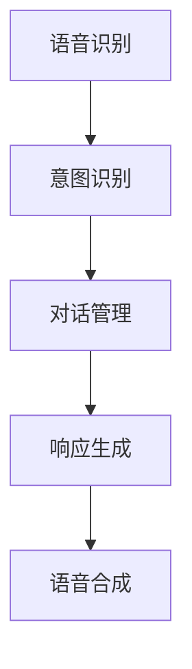

                 

关键词：对话式AI、自然语言处理、智能交互界面、人机对话、交互设计、AI算法、上下文理解、用户体验

<|assistant|>摘要：本文将深入探讨对话式AI的核心概念、关键技术、应用领域和未来发展，旨在为读者提供一个全面了解和掌握构建自然、智能交互界面的方法和策略。

## 1. 背景介绍

随着人工智能技术的快速发展，人机交互逐渐成为研究的热点。传统的人机交互主要依赖于图形用户界面（GUI），用户需要通过点击、拖拽等操作与系统进行互动。然而，这种交互方式在某些场景下显得笨拙且效率低下，无法满足用户对于便捷、自然的交互需求。为了解决这个问题，对话式AI应运而生。

对话式AI通过模拟人类的对话方式，实现人与机器的智能交流。这种交互方式具有自然、高效、直观的特点，能够极大地提升用户体验。目前，对话式AI已经被广泛应用于智能客服、语音助手、聊天机器人等领域，成为人工智能技术的重要分支。

## 2. 核心概念与联系

### 2.1. 对话式AI的定义

对话式AI是指通过模拟人类的对话方式，实现人与机器的智能交流的技术。它主要包括自然语言处理（NLP）、语音识别、语音合成、上下文理解等技术模块。

### 2.2. 对话式AI的技术架构

对话式AI的技术架构可以概括为以下几个核心组成部分：

- **自然语言处理（NLP）**：负责处理和理解人类语言，包括词法分析、句法分析、语义分析等。
- **语音识别（ASR）**：将语音信号转换为文本，实现语音到文字的转换。
- **语音合成（TTS）**：将文本转换为语音，实现文字到语音的转换。
- **上下文理解**：在对话过程中，理解用户的意图、情绪和场景背景，为后续的交互提供依据。
- **对话管理**：负责控制对话流程，包括意图识别、响应生成、对话状态跟踪等。

### 2.3. 对话式AI的工作流程

对话式AI的工作流程可以概括为以下几个步骤：

1. **语音识别**：将用户的语音输入转换为文本。
2. **意图识别**：根据用户的输入文本，识别用户的意图。
3. **对话管理**：根据用户意图，生成适当的响应，并更新对话状态。
4. **语音合成**：将生成的响应文本转换为语音输出。

### 2.4. Mermaid 流程图



## 3. 核心算法原理 & 具体操作步骤

### 3.1. 算法原理概述

对话式AI的核心算法包括自然语言处理（NLP）、语音识别（ASR）、语音合成（TTS）和上下文理解等。下面将分别介绍这些算法的原理和具体操作步骤。

### 3.2. 算法步骤详解

#### 3.2.1. 自然语言处理（NLP）

自然语言处理（NLP）是对话式AI的基础技术。其主要任务包括词法分析、句法分析和语义分析等。

1. **词法分析**：将文本划分为单词、短语等基本单位。
2. **句法分析**：分析文本的语法结构，确定句子中的词汇关系。
3. **语义分析**：理解文本的含义，提取关键信息。

#### 3.2.2. 语音识别（ASR）

语音识别（ASR）是将语音信号转换为文本的过程。其具体步骤如下：

1. **声音信号预处理**：去除噪声、进行归一化处理。
2. **特征提取**：提取声音信号的频谱特征。
3. **模型训练**：使用大量语音数据训练模型，使其能够识别语音信号。
4. **解码**：将特征序列转换为文本。

#### 3.2.3. 语音合成（TTS）

语音合成（TTS）是将文本转换为语音的过程。其具体步骤如下：

1. **文本预处理**：对输入文本进行分词、音节划分等处理。
2. **语音库选择**：从语音库中选择适合的语音样本。
3. **声学建模**：根据语音库中的语音样本，建立声学模型。
4. **语音合成**：根据文本和声学模型，生成语音输出。

#### 3.2.4. 上下文理解

上下文理解是确保对话连贯性的关键。其具体步骤如下：

1. **实体识别**：识别对话中的关键实体，如人名、地名、组织名等。
2. **关系识别**：分析实体之间的关系，如主谓关系、因果关系等。
3. **场景理解**：理解对话发生的场景，如购物、咨询、娱乐等。

### 3.3. 算法优缺点

#### 优点：

1. **自然性**：对话式AI能够模拟人类的对话方式，提供自然、流畅的交互体验。
2. **高效性**：通过自动化处理，提高人机交互的效率。
3. **广泛性**：适用于多种场景，如智能客服、语音助手、聊天机器人等。

#### 缺点：

1. **准确性**：在理解复杂、模糊的输入时，对话式AI的准确性可能较低。
2. **灵活性**：对话式AI的对话能力受限于训练数据和算法模型。

### 3.4. 算法应用领域

对话式AI的应用领域广泛，主要包括以下几个方面：

1. **智能客服**：为企业提供24/7在线客服服务，提高客户满意度。
2. **语音助手**：如苹果的Siri、谷歌的Google Assistant等，为用户提供智能化的语音服务。
3. **聊天机器人**：在各种社交媒体平台上提供实时聊天服务，如Facebook Messenger、微信等。
4. **智能家居**：与智能设备交互，如智能音箱、智能门锁等。
5. **教育领域**：为学生提供个性化学习辅导、智能教学等。

## 4. 数学模型和公式 & 详细讲解 & 举例说明

### 4.1. 数学模型构建

对话式AI的数学模型主要包括自然语言处理（NLP）、语音识别（ASR）、语音合成（TTS）和上下文理解等。下面分别介绍这些模型的构建方法。

#### 4.1.1. 自然语言处理（NLP）

自然语言处理（NLP）的数学模型通常采用深度学习框架，如循环神经网络（RNN）、卷积神经网络（CNN）和Transformer等。以Transformer为例，其模型结构如下：

$$
\text{Transformer} = \text{Input Embedding} \rightarrow \text{Multi-head Attention} \rightarrow \text{Feedforward Neural Network}
$$

其中，输入嵌入（Input Embedding）将单词转换为向量表示，多头注意力（Multi-head Attention）用于捕获文本中的长距离依赖关系，全连接神经网络（Feedforward Neural Network）用于提取文本的特征。

#### 4.1.2. 语音识别（ASR）

语音识别（ASR）的数学模型通常采用HMM（隐马尔可夫模型）或基于深度学习的模型，如CTC（Connectionist Temporal Classification）和Seq2Seq（序列到序列模型）等。以CTC为例，其模型结构如下：

$$
\text{CTC} = \text{Input Features} \rightarrow \text{Convolutional Layers} \rightarrow \text{CTC Loss}
$$

其中，输入特征（Input Features）将语音信号转换为频谱特征，卷积层（Convolutional Layers）用于提取特征，CTC损失（CTC Loss）用于训练模型。

#### 4.1.3. 语音合成（TTS）

语音合成（TTS）的数学模型通常采用基于深度学习的WaveNet或Tacotron等。以Tacotron为例，其模型结构如下：

$$
\text{Tacotron} = \text{Text Encoder} \rightarrow \text{Decoder} \rightarrow \text{Mel Spectrogram Generator}
$$

其中，文本编码器（Text Encoder）将文本编码为向量表示，解码器（Decoder）生成语音信号的梅尔频谱，梅尔频谱生成器（Mel Spectrogram Generator）将梅尔频谱转换为音频信号。

#### 4.1.4. 上下文理解

上下文理解（Contextual Understanding）的数学模型通常采用基于Transformer的预训练模型，如BERT（Bidirectional Encoder Representations from Transformers）和GPT（Generative Pre-trained Transformer）等。以BERT为例，其模型结构如下：

$$
\text{BERT} = \text{Pre-training} \rightarrow \text{Fine-tuning}
$$

其中，预训练（Pre-training）阶段通过大量无监督数据训练模型， Fine-tuning阶段通过有监督数据微调模型，使其能够理解特定领域的上下文。

### 4.2. 公式推导过程

#### 4.2.1. 自然语言处理（NLP）

以Transformer为例，其损失函数如下：

$$
\text{Loss} = -\sum_{i=1}^{n} \log P(y_i | x_i)
$$

其中，$P(y_i | x_i)$ 表示模型对第$i$个单词的预测概率，$y_i$表示真实单词。

#### 4.2.2. 语音识别（ASR）

以CTC为例，其损失函数如下：

$$
\text{Loss} = \frac{1}{T} \sum_{t=1}^{T} \sum_{i=1}^{C} \log P(o_t | c_i)
$$

其中，$T$ 表示序列长度，$C$ 表示字符数量，$o_t$表示第$t$个时间步的输出，$c_i$表示第$i$个字符。

#### 4.2.3. 语音合成（TTS）

以Tacotron为例，其损失函数如下：

$$
\text{Loss} = \frac{1}{N} \sum_{n=1}^{N} \sum_{t=1}^{T_n} \log P(m_{nt} | s_n)
$$

其中，$N$ 表示样本数量，$T_n$ 表示第$n$个样本的序列长度，$m_{nt}$表示第$n$个样本的第$t$个时间步的梅尔频谱，$s_n$表示第$n$个样本的文本编码。

#### 4.2.4. 上下文理解

以BERT为例，其损失函数如下：

$$
\text{Loss} = \frac{1}{N} \sum_{n=1}^{N} \sum_{i=1}^{L_n} \log P(y_{ni} | x_n)
$$

其中，$N$ 表示样本数量，$L_n$ 表示第$n$个样本的序列长度，$y_{ni}$ 表示第$n$个样本的第$i$个单词的预测标签，$x_n$ 表示第$n$个样本的文本编码。

### 4.3. 案例分析与讲解

#### 4.3.1. 案例一：智能客服

在某电商平台上，智能客服系统采用对话式AI技术，为用户提供在线咨询和售后服务。以下是一个用户咨询产品退换货政策的对话示例：

用户：请问如何办理退货？

智能客服：您好，根据您提供的信息，您可以在15天内无理由退货。请提供您的订单号，我将为您查询具体退货流程。

用户：订单号123456。

智能客服：感谢您的订单号。请您在收到商品后的7天内联系我们的客服，并提供相关凭证，我们将尽快为您办理退货。

用户：好的，谢谢。

通过以上对话，智能客服成功地为用户提供了详细的退货政策解答，提高了用户满意度。

#### 4.3.2. 案例二：语音助手

在智能家居场景中，语音助手成为用户与智能设备交互的主要方式。以下是一个用户通过语音助手控制智能灯泡的对话示例：

用户：打开客厅的灯。

语音助手：好的，您家的客厅灯已经打开了。

用户：调整灯光亮度为30%。

语音助手：灯光亮度已调整为30%。

通过以上对话，语音助手成功地为用户提供了智能灯泡的开关和亮度调整功能，提高了用户的生活便利性。

## 5. 项目实践：代码实例和详细解释说明

### 5.1. 开发环境搭建

在进行对话式AI项目实践之前，需要搭建相应的开发环境。以下是一个基本的开发环境搭建步骤：

1. 安装Python环境（版本3.6及以上）。
2. 安装必要的依赖库，如TensorFlow、PyTorch、Keras等。
3. 安装自然语言处理（NLP）工具，如spaCy、NLTK等。
4. 安装语音识别（ASR）和语音合成（TTS）工具，如pyttsx3、speech_recognition等。

### 5.2. 源代码详细实现

以下是一个简单的对话式AI示例，实现了一个基于文本的聊天机器人：

```python
import random

class ChatBot:
    def __init__(self):
        self Responses = [
            "你好，我是ChatBot，有什么可以帮助你的吗？",
            "你好，我在这里，你想和我聊些什么？",
            "很高兴见到你，请随时告诉我你的需求。",
            "你好，我是ChatBot，我会尽力回答你的问题。",
        ]

    def get_response(self, user_input):
        if user_input.lower() == "你好":
            return random.choice(self.Responses)
        else:
            return "对不起，我目前无法理解你的问题。你可以问我一些其他的问题，我会尽力回答的。"

    def start(self):
        print(self.get_response("你好"))
        while True:
            user_input = input("你：")
            print("ChatBot：" + self.get_response(user_input))

if __name__ == "__main__":
    chat_bot = ChatBot()
    chat_bot.start()
```

### 5.3. 代码解读与分析

上述代码实现了一个简单的基于文本的聊天机器人。以下是代码的详细解读：

1. **类定义**：定义了一个名为`ChatBot`的类，包含一个初始化方法`__init__`和一个获取响应方法`get_response`，以及一个启动方法`start`。

2. **初始化方法`__init__`**：在初始化方法中，定义了一个名为`Responses`的列表，其中包含了聊天机器人的一些初始响应。

3. **获取响应方法`get_response`**：该方法根据用户的输入，返回一个合适的响应。如果用户输入“你好”，则返回`Responses`列表中的一个随机响应；否则，返回一个默认的响应。

4. **启动方法`start`**：该方法首先打印一个初始响应，然后进入一个无限循环，等待用户输入。每次用户输入后，都会调用`get_response`方法获取响应，并打印出来。

### 5.4. 运行结果展示

运行上述代码后，聊天机器人会显示一个初始响应，然后等待用户输入。用户输入后，聊天机器人会根据输入返回一个响应。以下是一个示例运行结果：

```
ChatBot：你好，我是ChatBot，有什么可以帮助你的吗？
你：你好，有什么问题可以问我吗？
ChatBot：是的，您可以问我任何问题。请随时告诉我您的需求。
你：我想知道今天天气如何？
ChatBot：对不起，我目前无法理解你的问题。你可以问我一些其他的问题，我会尽力回答的。
```

## 6. 实际应用场景

### 6.1. 智能客服

智能客服是对话式AI的一个重要应用领域。通过对话式AI技术，智能客服系统可以自动处理大量用户咨询，提供24/7的在线服务。这不仅提高了客服效率，还降低了企业运营成本。

### 6.2. 语音助手

语音助手已成为现代智能手机和智能家居的核心功能。通过对话式AI技术，语音助手可以理解用户的语音指令，控制智能家居设备，提供个性化服务。例如，用户可以通过语音助手播放音乐、控制灯光、调节温度等。

### 6.3. 聊天机器人

聊天机器人被广泛应用于社交媒体、在线教育、电子商务等领域。通过对话式AI技术，聊天机器人可以与用户进行自然、流畅的对话，提供实时客服、个性化推荐、在线咨询等服务。

### 6.4. 未来应用展望

随着对话式AI技术的不断发展，其应用领域将更加广泛。未来，对话式AI有望在医疗、金融、教育、安全等领域发挥重要作用，为人们的生活带来更多便利。同时，随着多模态交互技术的兴起，对话式AI将实现与用户更自然、更丰富的交互方式。

## 7. 工具和资源推荐

### 7.1. 学习资源推荐

1. **《自然语言处理综述》**：这是一本关于自然语言处理的经典教材，涵盖了NLP的核心概念和技术。
2. **《深度学习》**：这是一本关于深度学习的入门教材，适合初学者了解深度学习的基本原理和应用。
3. **《对话系统设计与实现》**：这是一本关于对话系统设计的教材，详细介绍了对话系统的构建方法和技巧。

### 7.2. 开发工具推荐

1. **TensorFlow**：一个开源的深度学习框架，适用于构建对话式AI模型。
2. **PyTorch**：一个开源的深度学习框架，具有灵活的模型构建和训练能力。
3. **spaCy**：一个强大的自然语言处理库，适用于文本处理和实体识别。

### 7.3. 相关论文推荐

1. **"Attention Is All You Need"**：一篇关于Transformer模型的经典论文，提出了基于注意力机制的深度学习模型。
2. **"Deep Learning for Speech Recognition: A Review"**：一篇关于深度学习在语音识别领域的综述，详细介绍了深度学习在语音识别中的应用。
3. **"The Annotated Transformer"**：一篇关于Transformer模型的详细解读，适合初学者了解Transformer的工作原理。

## 8. 总结：未来发展趋势与挑战

### 8.1. 研究成果总结

对话式AI在过去几年取得了显著的成果，主要表现在以下几个方面：

1. **模型性能提升**：随着深度学习技术的发展，对话式AI的模型性能不断提高，尤其在自然语言处理、语音识别和语音合成等领域。
2. **应用领域扩大**：对话式AI的应用领域不断扩展，从智能客服、语音助手到聊天机器人，为各行各业提供了智能化服务。
3. **用户体验改善**：通过不断优化算法和交互设计，对话式AI的用户体验得到了显著提升，越来越接近人类对话的自然性和流畅性。

### 8.2. 未来发展趋势

对话式AI在未来将继续快速发展，主要趋势包括：

1. **多模态交互**：结合视觉、语音、触觉等多种感官，实现更自然、更丰富的交互方式。
2. **个性化服务**：通过用户数据分析和个性化推荐，为用户提供更加个性化的服务。
3. **跨领域应用**：对话式AI将广泛应用于医疗、金融、教育、安全等领域，为人们的生活带来更多便利。

### 8.3. 面临的挑战

尽管对话式AI取得了显著成果，但仍面临以下挑战：

1. **准确性**：在处理复杂、模糊的输入时，对话式AI的准确性仍有待提高。
2. **灵活性**：对话式AI的对话能力受限于训练数据和算法模型，需要进一步提高灵活性。
3. **隐私和安全**：在处理用户数据时，需要确保用户隐私和安全。

### 8.4. 研究展望

对话式AI的发展前景广阔，未来研究应重点关注以下几个方面：

1. **多模态融合**：研究如何将多种感官信息融合到对话系统中，实现更自然的交互。
2. **深度学习算法**：探索新的深度学习算法，提高对话式AI的模型性能和灵活性。
3. **伦理和隐私**：研究对话式AI的伦理和隐私问题，确保其安全可靠。

## 9. 附录：常见问题与解答

### 9.1. 对话式AI是什么？

对话式AI是指通过模拟人类的对话方式，实现人与机器的智能交流的技术。它主要包括自然语言处理（NLP）、语音识别（ASR）、语音合成（TTS）和上下文理解等技术模块。

### 9.2. 对话式AI有哪些应用场景？

对话式AI的应用场景广泛，主要包括智能客服、语音助手、聊天机器人、智能家居、教育、医疗等领域。

### 9.3. 如何评价对话式AI的性能？

评价对话式AI的性能可以从多个方面进行，如准确性、响应速度、用户满意度等。常用的评价指标包括准确率、召回率、F1值等。

### 9.4. 对话式AI如何保证用户隐私和安全？

对话式AI在处理用户数据时，需要严格遵守相关法律法规，确保用户隐私和安全。例如，采用数据加密、访问控制等技术，防止数据泄露和滥用。

### 9.5. 对话式AI与聊天机器人的区别是什么？

对话式AI和聊天机器人都是基于人工智能技术的智能交互系统，但对话式AI更强调自然、流畅的对话体验，能够理解用户的意图和情感，而聊天机器人通常更侧重于实现特定的功能或任务。

