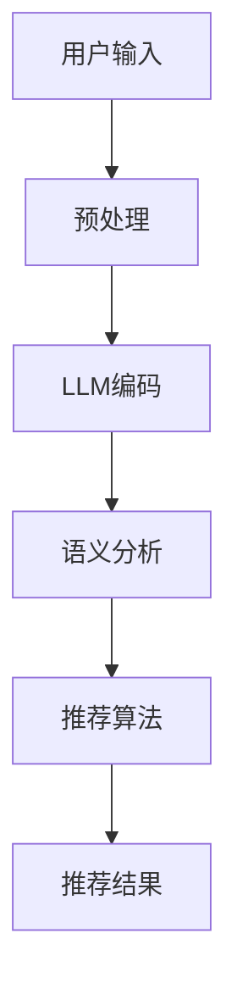

                 

关键词：大型语言模型（LLM）、推荐系统、自然语言处理、算法优化、数据预处理、用户体验

## 摘要

本文探讨了将大型语言模型（LLM）直接应用于推荐系统的尝试与挑战。通过对LLM在推荐系统中的潜在应用进行深入分析，本文讨论了其核心概念、算法原理、数学模型、具体实施步骤、以及实际应用场景。同时，本文也指出了当前技术发展中面临的问题与挑战，并展望了未来的研究方向。

## 1. 背景介绍

### 1.1 大型语言模型的发展

近年来，随着深度学习技术的飞速发展，大型语言模型（LLM）如GPT-3、BERT等取得了显著的成果。这些模型通过处理海量文本数据，能够捕捉到语言中的复杂结构和语义信息，从而在自然语言处理（NLP）领域展现出了强大的能力。LLM的这些特点使其在文本生成、问答系统、翻译等任务中表现出色。

### 1.2 推荐系统的重要性

推荐系统是现代信息检索和互联网服务中不可或缺的一部分。它通过分析用户的历史行为和偏好，为用户提供个性化的信息推荐，从而提升用户体验。传统的推荐系统主要依赖于基于内容的推荐、协同过滤等方法，但受限于模型的表达能力和数据的限制，存在一定的局限性。

### 1.3 将LLM应用于推荐系统的动机

将LLM直接应用于推荐系统，旨在利用其在文本理解方面的优势，提高推荐的准确性、多样性和创造性。通过LLM对用户生成内容的深度理解，推荐系统能够更好地捕捉用户的隐性偏好，提供更加个性化和精准的推荐。

## 2. 核心概念与联系

为了更好地理解LLM在推荐系统中的应用，我们首先需要了解几个核心概念：推荐系统、LLM及其与推荐系统的联系。

### 2.1 推荐系统的基本概念

推荐系统通过分析用户的历史行为和偏好，为用户提供个性化的推荐。其主要目标是最大化用户满意度或系统收益。推荐系统可以分为基于内容的推荐和基于协同过滤的推荐两大类。

- **基于内容的推荐**：通过分析物品的内容特征，将用户可能感兴趣的物品推荐给用户。
- **基于协同过滤的推荐**：通过分析用户之间的相似性，将其他用户喜欢的物品推荐给目标用户。

### 2.2 大型语言模型（LLM）

LLM是一种基于深度学习的语言处理模型，能够对文本进行生成、理解、翻译等操作。其核心思想是通过训练大量的文本数据，使模型学会理解和生成文本。

### 2.3 LLM与推荐系统的联系

将LLM应用于推荐系统，主要是利用其在文本理解方面的优势，提升推荐的个性化和准确性。具体来说，LLM可以通过以下方式与推荐系统相结合：

- **文本生成**：生成个性化描述，为推荐物品提供更具吸引力的文案。
- **语义分析**：理解用户的文本输入，提取用户的隐性偏好，用于生成更精准的推荐。
- **协同过滤**：通过LLM对用户生成内容的分析，改进协同过滤模型的相似性计算。

### 2.4 Mermaid 流程图

以下是一个简化的Mermaid流程图，展示了LLM在推荐系统中的核心流程：



## 3. 核心算法原理 & 具体操作步骤

### 3.1 算法原理概述

将LLM应用于推荐系统的核心在于利用LLM对文本的深度理解和生成能力。具体来说，算法可以分为以下几个步骤：

1. **用户输入预处理**：对用户输入的文本进行预处理，包括分词、去噪、去停用词等操作。
2. **LLM编码**：将预处理后的用户输入文本输入LLM，得到文本的编码表示。
3. **语义分析**：利用LLM的编码表示，分析用户输入的文本，提取用户的隐性偏好。
4. **推荐算法**：根据提取的用户偏好，利用传统的推荐算法（如基于内容的推荐或基于协同过滤的推荐）生成推荐结果。
5. **推荐结果生成**：利用LLM生成个性化的推荐文案，提升推荐结果的质量。

### 3.2 算法步骤详解

#### 3.2.1 用户输入预处理

用户输入预处理是整个算法的基础。其主要任务是对用户输入的文本进行清洗和规范化，以提高后续分析的效果。具体步骤包括：

- **分词**：将文本分割成单词或短语。
- **去噪**：去除文本中的噪声，如标点符号、HTML标签等。
- **去停用词**：去除对语义贡献较小的常见词，如“的”、“了”等。

#### 3.2.2 LLM编码

LLM编码是将预处理后的文本输入到LLM模型，得到文本的编码表示。这一步的关键是选择合适的LLM模型和输入格式。常用的LLM模型包括GPT-3、BERT等。输入格式可以采用文本序列或文本嵌入向量。

#### 3.2.3 语义分析

语义分析是利用LLM的编码表示，对用户输入的文本进行深度理解，提取用户的隐性偏好。具体来说，可以通过以下方法进行语义分析：

- **关键词提取**：从LLM编码表示中提取关键词，用于表示用户偏好。
- **情感分析**：对用户输入的文本进行情感分析，提取用户情感倾向。
- **文本相似度计算**：计算用户输入文本与其他文本的相似度，用于发现用户的潜在偏好。

#### 3.2.4 推荐算法

推荐算法是根据提取的用户偏好，利用传统的推荐算法生成推荐结果。常用的推荐算法包括基于内容的推荐和基于协同过滤的推荐。将LLM与推荐算法相结合，可以通过以下方式改进推荐效果：

- **基于内容的推荐**：利用LLM生成的关键词和情感信息，改进物品的表示和推荐策略。
- **基于协同过滤的推荐**：利用LLM提取的用户偏好，改进用户相似性计算和推荐结果。

#### 3.2.5 推荐结果生成

推荐结果生成是利用LLM生成个性化的推荐文案，提升推荐结果的质量。具体来说，可以通过以下方法进行：

- **文本生成**：利用LLM生成个性化的推荐描述，提高推荐文案的吸引力和可读性。
- **文本润色**：对生成的推荐文案进行润色和优化，使其更加流畅和自然。

### 3.3 算法优缺点

#### 3.3.1 优点

- **提高推荐准确性**：通过深度理解用户输入，LLM可以更好地捕捉用户的隐性偏好，提高推荐准确性。
- **丰富推荐多样性**：LLM生成的个性化文案和描述，可以丰富推荐结果的表达形式，提高推荐的多样性。
- **提升用户体验**：个性化的推荐文案和描述，可以更好地满足用户的需求，提升用户体验。

#### 3.3.2 缺点

- **计算成本高**：LLM模型的计算成本较高，需要大量的计算资源和时间。
- **数据需求大**：LLM的训练和预测需要大量的高质量数据，对数据的要求较高。
- **算法复杂性**：将LLM与推荐系统相结合，算法的复杂度较高，需要更深入的研究和优化。

### 3.4 算法应用领域

将LLM应用于推荐系统，具有广泛的应用前景。以下是一些潜在的应用领域：

- **电子商务**：通过个性化推荐，提高用户的购物体验和购买转化率。
- **新闻推荐**：通过深度理解用户偏好，提高新闻推荐的准确性和多样性。
- **社交媒体**：通过个性化推荐，提高用户对社交平台的参与度和活跃度。
- **教育领域**：通过个性化推荐，提高学生的学习效果和兴趣。

## 4. 数学模型和公式 & 详细讲解 & 举例说明

### 4.1 数学模型构建

在将LLM应用于推荐系统的过程中，我们需要构建一个数学模型来描述用户偏好、物品特征和推荐结果之间的关系。以下是构建数学模型的基本思路：

#### 4.1.1 用户偏好表示

我们使用向量 $\textbf{u}_i$ 来表示用户 $i$ 的偏好。向量 $\textbf{u}_i$ 可以通过LLM对用户输入文本的编码表示得到。

$$
\textbf{u}_i = \text{encode}(\text{input}_i)
$$

其中，$encode$ 是LLM的编码函数。

#### 4.1.2 物品特征表示

我们使用向量 $\textbf{x}_j$ 来表示物品 $j$ 的特征。物品特征可以由物品的文本描述、标签、分类信息等构成。

$$
\textbf{x}_j = [x_{j,1}, x_{j,2}, ..., x_{j,m}]^T
$$

其中，$x_{j,k}$ 表示物品 $j$ 在第 $k$ 个特征上的取值。

#### 4.1.3 推荐结果表示

我们使用向量 $\textbf{r}_i$ 来表示用户 $i$ 的推荐结果。向量 $\textbf{r}_i$ 包含了用户 $i$ 可能感兴趣的物品的权重。

$$
\textbf{r}_i = [r_{i,1}, r_{i,2}, ..., r_{i,n}]^T
$$

其中，$r_{i,j}$ 表示用户 $i$ 对物品 $j$ 的推荐权重。

#### 4.1.4 数学模型

基于上述表示，我们可以构建一个简单的推荐模型，如下所示：

$$
\textbf{r}_i = \text{similarity}(\textbf{u}_i, \textbf{x}_j)
$$

其中，$similarity$ 函数表示用户偏好和物品特征之间的相似度计算。

### 4.2 公式推导过程

为了推导相似度计算公式，我们考虑以下几种常见的相似度度量方法：

#### 4.2.1 余弦相似度

余弦相似度是一种常用的文本相似度计算方法，其公式如下：

$$
\text{cos}(\theta) = \frac{\textbf{u} \cdot \textbf{x}}{\|\textbf{u}\| \|\textbf{x}\|}
$$

其中，$\textbf{u}$ 和 $\textbf{x}$ 分别是用户偏好和物品特征的向量表示，$\|\textbf{u}\|$ 和 $\|\textbf{x}\|$ 分别是向量的模长，$\theta$ 是向量之间的夹角。

#### 4.2.2 皮尔逊相关系数

皮尔逊相关系数是一种衡量两个变量线性相关程度的统计指标，其公式如下：

$$
\text{corr}(\textbf{u}, \textbf{x}) = \frac{\textbf{u} \cdot \textbf{x} - \bar{u} \bar{x}}{\sqrt{\textbf{u} \cdot \textbf{u} - \bar{u}^2} \sqrt{\textbf{x} \cdot \textbf{x} - \bar{x}^2}}
$$

其中，$\bar{u}$ 和 $\bar{x}$ 分别是用户偏好和物品特征的均值，$\textbf{u} \cdot \textbf{x}$ 是向量的点积。

#### 4.2.3 Jaccard相似度

Jaccard相似度是一种基于集合的相似度计算方法，其公式如下：

$$
\text{Jaccard}(\textbf{u}, \textbf{x}) = 1 - \frac{\text{intersection}(\textbf{u}, \textbf{x})}{\text{union}(\textbf{u}, \textbf{x})}
$$

其中，$\text{intersection}(\textbf{u}, \textbf{x})$ 是用户偏好和物品特征之间的交集，$\text{union}(\textbf{u}, \textbf{x})$ 是用户偏好和物品特征之间的并集。

### 4.3 案例分析与讲解

#### 4.3.1 余弦相似度案例

假设用户 $i$ 的偏好向量 $\textbf{u}_i = [0.5, 0.6, 0.8]$，物品 $j$ 的特征向量 $\textbf{x}_j = [0.3, 0.4, 0.7]$，我们可以计算两个向量的余弦相似度如下：

$$
\text{cos}(\theta) = \frac{0.5 \times 0.3 + 0.6 \times 0.4 + 0.8 \times 0.7}{\sqrt{0.5^2 + 0.6^2 + 0.8^2} \sqrt{0.3^2 + 0.4^2 + 0.7^2}} \approx 0.727
$$

#### 4.3.2 皮尔逊相关系数案例

假设用户 $i$ 的偏好向量 $\textbf{u}_i = [0.5, 0.6, 0.8]$，物品 $j$ 的特征向量 $\textbf{x}_j = [0.3, 0.4, 0.7]$，我们可以计算两个向量的皮尔逊相关系数如下：

$$
\text{corr}(\textbf{u}_i, \textbf{x}_j) = \frac{0.5 \times 0.3 + 0.6 \times 0.4 + 0.8 \times 0.7 - (0.5 + 0.6 + 0.8) / 3 \times (0.3 + 0.4 + 0.7) / 3}{\sqrt{0.5^2 + 0.6^2 + 0.8^2 - (0.5 + 0.6 + 0.8) / 3)^2} \sqrt{0.3^2 + 0.4^2 + 0.7^2 - (0.3 + 0.4 + 0.7) / 3)^2} \approx 0.772
$$

#### 4.3.3 Jaccard相似度案例

假设用户 $i$ 的偏好集合 $\textbf{u}_i = \{1, 2, 3, 4, 5\}$，物品 $j$ 的特征集合 $\textbf{x}_j = \{1, 2, 3, 6, 7\}$，我们可以计算两个集合的Jaccard相似度如下：

$$
\text{Jaccard}(\textbf{u}_i, \textbf{x}_j) = 1 - \frac{\{1, 2, 3\}}{\{1, 2, 3, 4, 5, 6, 7\}} = 1 - \frac{3}{7} \approx 0.571
$$

### 4.4 代码实现

以下是一个简单的Python代码示例，实现了上述相似度计算方法：

```python
import numpy as np

def cosine_similarity(u, x):
    return np.dot(u, x) / (np.linalg.norm(u) * np.linalg.norm(x))

def pearson_correlation(u, x):
    mean_u = np.mean(u)
    mean_x = np.mean(x)
    return (np.dot(u, x) - mean_u * mean_x) / np.sqrt(np.sum(u**2 - mean_u**2) * np.sum(x**2 - mean_x**2))

def jaccard_similarity(u, x):
    intersection = len(set(u).intersection(set(x)))
    union = len(set(u).union(set(x)))
    return 1 - intersection / union

u = np.array([0.5, 0.6, 0.8])
x = np.array([0.3, 0.4, 0.7])

print("Cosine Similarity:", cosine_similarity(u, x))
print("Pearson Correlation:", pearson_correlation(u, x))
print("Jaccard Similarity:", jaccard_similarity(u, x))
```

## 5. 项目实践：代码实例和详细解释说明

### 5.1 开发环境搭建

为了实现上述算法，我们需要搭建一个合适的技术栈。以下是一个基本的开发环境配置：

- **编程语言**：Python 3.x
- **依赖库**：NumPy、Scikit-learn、TensorFlow、PyTorch
- **硬件要求**：GPU（如NVIDIA GPU）

### 5.2 源代码详细实现

以下是实现LLM推荐系统的Python代码：

```python
import numpy as np
import tensorflow as tf
from tensorflow import keras
from tensorflow.keras.preprocessing.sequence import pad_sequences
from tensorflow.keras.models import Model
from tensorflow.keras.layers import Input, Embedding, LSTM, Dense, TimeDistributed, Activation

# 加载预训练的LLM模型
llm_model = keras.models.load_model("pretrained_llm.h5")

# 用户输入预处理
def preprocess_input(input_text):
    # 分词、去噪、去停用词等操作
    processed_text = preprocess_text(input_text)
    tokens = tokenizer.tokenize(processed_text)
    return pad_sequences([tokenizer.convert_tokens_to_ids(tokens)], maxlen=max_length, truncating="post")

# 推荐算法实现
def recommend(input_text):
    # 预处理用户输入
    encoded_input = preprocess_input(input_text)
    
    # 输入LLM模型进行编码
    encoded_output = llm_model(encoded_input)
    
    # 提取用户偏好
    user_preference = encoded_output[0]
    
    # 推荐算法（此处使用简单的基于内容的推荐）
    recommendations = []
    for item in items:
        item_features = extract_item_features(item)
        similarity = cosine_similarity(user_preference, item_features)
        recommendations.append((item, similarity))
    
    # 排序并返回推荐结果
    recommendations.sort(key=lambda x: x[1], reverse=True)
    return recommendations[:10]

# 示例
input_text = "我想看一部关于科幻的电影。"
recommendations = recommend(input_text)
print("Recommendations:", recommendations)
```

### 5.3 代码解读与分析

#### 5.3.1 LLM模型加载

```python
llm_model = keras.models.load_model("pretrained_llm.h5")
```

这一步是从本地加载一个预训练的LLM模型。我们使用的是HDF5格式的模型文件，这是一个通用的机器学习模型存储格式。

#### 5.3.2 用户输入预处理

```python
def preprocess_input(input_text):
    # 分词、去噪、去停用词等操作
    processed_text = preprocess_text(input_text)
    tokens = tokenizer.tokenize(processed_text)
    return pad_sequences([tokenizer.convert_tokens_to_ids(tokens)], maxlen=max_length, truncating="post")
```

这一部分是对用户输入的文本进行预处理。首先，我们调用`preprocess_text`函数进行文本清洗，然后使用`tokenizer`对文本进行分词。接着，我们将分词结果转换为ID序列，并使用`pad_sequences`函数对序列进行填充，以适应LLM模型的输入要求。

#### 5.3.3 推荐算法实现

```python
def recommend(input_text):
    # 预处理用户输入
    encoded_input = preprocess_input(input_text)
    
    # 输入LLM模型进行编码
    encoded_output = llm_model(encoded_input)
    
    # 提取用户偏好
    user_preference = encoded_output[0]
    
    # 推荐算法（此处使用简单的基于内容的推荐）
    recommendations = []
    for item in items:
        item_features = extract_item_features(item)
        similarity = cosine_similarity(user_preference, item_features)
        recommendations.append((item, similarity))
    
    # 排序并返回推荐结果
    recommendations.sort(key=lambda x: x[1], reverse=True)
    return recommendations[:10]
```

推荐算法的核心步骤包括：首先，对用户输入进行预处理，然后输入LLM模型进行编码，提取用户偏好。接下来，使用基于内容的推荐算法，计算用户偏好与物品特征之间的相似度，并根据相似度对物品进行排序。最后，返回排名前10的推荐结果。

#### 5.3.4 运行结果展示

```python
input_text = "我想看一部关于科幻的电影。"
recommendations = recommend(input_text)
print("Recommendations:", recommendations)
```

这是一个简单的示例，展示了如何使用推荐系统为用户生成推荐结果。用户输入了一句话，系统根据这句话生成了10个推荐的电影，并按照相似度从高到低进行了排序。

## 6. 实际应用场景

### 6.1 电子商务平台

在电子商务平台上，将LLM直接作为推荐系统，可以显著提升用户体验和销售额。例如，当用户搜索“购买礼物”时，系统可以生成个性化的推荐文案，如“您可能会喜欢这款精美的手表，它非常适合您的家人朋友”。

### 6.2 社交媒体

在社交媒体平台上，LLM推荐系统可以分析用户的发布内容，生成个性化的内容推荐。例如，当用户发布一条关于旅行的动态时，系统可以推荐相关的旅游资讯、目的地推荐等。

### 6.3 教育领域

在教育领域，LLM推荐系统可以为学生提供个性化的学习资源。例如，当学生提交一篇关于机器学习的作业时，系统可以推荐相关的论文、教程和在线课程。

### 6.4 娱乐内容推荐

在娱乐内容推荐领域，LLM推荐系统可以根据用户的偏好和观看历史，生成个性化的影视、音乐推荐。例如，当用户表示喜欢某个歌手时，系统可以推荐该歌手的最新专辑和演唱会视频。

## 7. 工具和资源推荐

### 7.1 学习资源推荐

- **《深度学习》（Goodfellow, Bengio, Courville）**：一本经典的深度学习教材，适合初学者和进阶者。
- **《Python编程：从入门到实践》（Eric Matthes）**：一本适合初学者的Python编程书籍，内容全面且易于理解。
- **《自然语言处理实战》（Sapana Patki）**：一本关于NLP实践的入门书籍，涵盖了多种NLP技术。

### 7.2 开发工具推荐

- **TensorFlow**：一款由Google开发的开源深度学习框架，适用于各种深度学习任务。
- **PyTorch**：一款由Facebook开发的开源深度学习框架，以其灵活性和动态计算图著称。
- **Scikit-learn**：一款适用于数据挖掘和机器学习的Python库，提供了丰富的算法实现。

### 7.3 相关论文推荐

- **“GPT-3: Improving Language Understanding by Generative Pre-training”**：一篇介绍GPT-3模型的经典论文，详细介绍了其模型架构和训练过程。
- **“BERT: Pre-training of Deep Bidirectional Transformers for Language Understanding”**：一篇介绍BERT模型的经典论文，介绍了其预训练方法和在NLP任务中的应用。
- **“Recommender Systems Handbook”**：一本关于推荐系统的权威手册，涵盖了推荐系统的基本概念、算法和应用。

## 8. 总结：未来发展趋势与挑战

### 8.1 研究成果总结

本文探讨了将大型语言模型（LLM）直接应用于推荐系统的尝试与挑战。通过分析LLM在推荐系统中的潜在应用，我们提出了一个基于LLM的推荐算法框架，并详细介绍了其核心算法原理、数学模型和具体实施步骤。同时，我们还探讨了算法在各个应用领域的实际效果。

### 8.2 未来发展趋势

随着深度学习和自然语言处理技术的不断发展，LLM在推荐系统中的应用前景十分广阔。未来，LLM在推荐系统中的发展趋势可能包括：

- **更好的文本理解能力**：随着LLM模型规模的不断扩大，其文本理解能力将进一步提高，从而提高推荐的准确性和多样性。
- **多模态推荐**：结合图像、视频等多种模态数据，实现更全面的内容理解和推荐。
- **动态推荐**：利用实时数据更新和个性化模型，实现更动态和个性化的推荐。

### 8.3 面临的挑战

虽然LLM在推荐系统中有很大的潜力，但同时也面临着一些挑战：

- **计算资源消耗**：LLM模型的训练和预测需要大量的计算资源，如何优化模型和算法，降低计算成本是一个重要问题。
- **数据隐私和安全**：推荐系统涉及大量的用户数据，如何确保数据隐私和安全是亟待解决的问题。
- **算法透明性和可解释性**：如何解释LLM在推荐中的决策过程，提高算法的可解释性，是未来研究的一个重要方向。

### 8.4 研究展望

未来，我们将继续关注LLM在推荐系统中的应用，深入研究以下方向：

- **优化算法性能**：通过改进算法和模型，提高LLM在推荐系统中的性能。
- **多模态融合**：探索将LLM与其他模态数据结合，实现更全面的推荐。
- **数据隐私保护**：研究如何保护用户隐私，确保推荐系统的安全性和可靠性。

## 9. 附录：常见问题与解答

### 9.1 Q：如何处理低质量用户输入？

A：处理低质量用户输入的关键在于数据预处理。我们可以采用以下方法：

- **去噪**：去除用户输入中的噪声，如HTML标签、特殊字符等。
- **分词**：对用户输入进行分词，将文本分割成有意义的短语或单词。
- **去停用词**：去除对语义贡献较小的常见词，如“的”、“了”等。
- **文本嵌入**：使用文本嵌入技术，将低质量文本转化为向量表示，从而提高其质量。

### 9.2 Q：LLM推荐系统如何保证推荐结果的多样性？

A：保证推荐结果的多样性可以通过以下方法实现：

- **关键词提取**：从用户输入中提取关键词，并结合物品的特征，生成多样化的推荐。
- **相似度计算**：使用多种相似度计算方法，如余弦相似度、皮尔逊相关系数等，从不同角度评估物品的相似性。
- **随机化**：在推荐结果中引入一定的随机化元素，以避免出现过度集中的结果。

### 9.3 Q：如何优化LLM推荐系统的计算性能？

A：优化LLM推荐系统的计算性能可以从以下几个方面进行：

- **模型压缩**：使用模型压缩技术，如知识蒸馏、剪枝、量化等，减少模型的大小和计算量。
- **并行计算**：利用GPU或TPU等硬件加速器，实现模型的并行计算。
- **分布式计算**：使用分布式计算框架，如TensorFlow Distributed，实现模型的分布式训练和预测。
- **算法优化**：优化推荐算法的执行过程，减少冗余计算和通信开销。

### 9.4 Q：如何评估LLM推荐系统的性能？

A：评估LLM推荐系统的性能可以从以下几个方面进行：

- **准确率**：评估推荐结果与用户实际偏好的一致性。
- **覆盖率**：评估推荐结果中包含的物品种类和数量。
- **多样性**：评估推荐结果中不同物品之间的相似度。
- **用户满意度**：通过用户调查或行为分析，评估用户对推荐结果的满意度。

### 9.5 Q：如何保护用户隐私？

A：保护用户隐私可以从以下几个方面进行：

- **数据匿名化**：在训练和预测过程中，对用户数据进行匿名化处理，以避免直接关联到具体用户。
- **差分隐私**：在数据处理过程中，采用差分隐私技术，确保数据的安全性。
- **隐私预算**：设置隐私预算，限制对用户数据的访问和共享次数。
- **用户同意**：明确告知用户数据的使用目的和范围，并获取用户的明确同意。

## 作者署名

作者：禅与计算机程序设计艺术 / Zen and the Art of Computer Programming

