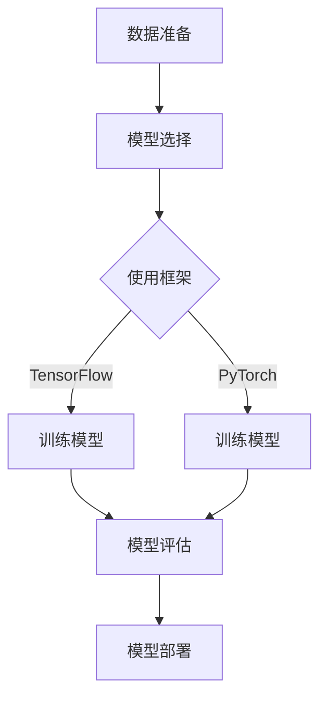

                 

关键词：小语言模型，应用开发，工具，框架，平台，深度学习，自然语言处理，编程语言，开发流程

在当今技术快速发展的时代，小语言模型（也称为微语言模型或小型自然语言处理模型）的应用开发成为了人工智能领域的一个重要研究方向。小语言模型由于其轻量级、高效能的特点，被广泛应用于各种场景，如智能客服、语音识别、文本生成等。本文将深入探讨小语言模型的应用开发，包括相关工具、框架和平台的使用，帮助读者了解如何在实际项目中高效地开发和部署小语言模型。

## 1. 背景介绍

随着深度学习和自然语言处理技术的飞速发展，大型语言模型（如GPT-3、BERT等）已经取得了显著的成果。然而，这些大型模型需要大量的计算资源和时间进行训练，且在某些场景下，这些模型过于复杂，导致模型部署成本高、响应速度慢。为了解决这些问题，小语言模型应运而生。小语言模型通常具有更少的参数、更快的训练和推理速度，适合在资源有限的设备上部署，同时也具备较高的准确率和泛化能力。

小语言模型的应用开发主要包括以下几个步骤：数据准备、模型选择、模型训练、模型评估和模型部署。本文将围绕这些步骤，详细介绍小语言模型的应用开发过程。

## 2. 核心概念与联系

在小语言模型的应用开发中，有几个核心概念和架构需要了解：

### 2.1 小语言模型

小语言模型是一种规模较小的自然语言处理模型，通常由数百万个参数组成，与大型语言模型相比，参数量较小，但仍然具备较强的语义理解能力。

### 2.2 深度学习框架

深度学习框架是用于构建和训练深度学习模型的软件库。常见的深度学习框架有TensorFlow、PyTorch等，它们提供了丰富的API和工具，方便开发者构建和优化深度学习模型。

### 2.3 自然语言处理工具

自然语言处理工具是用于处理文本数据的一系列工具，包括分词、词性标注、命名实体识别等。这些工具可以帮助开发者高效地准备和处理文本数据，提高模型训练效果。

### 2.4 模型评估指标

模型评估指标是用于衡量模型性能的一系列指标，包括准确率、召回率、F1值等。通过评估指标，开发者可以了解模型在特定任务上的表现，以便调整模型结构和参数。

以下是小语言模型应用开发的核心概念和架构的Mermaid流程图：



## 3. 核心算法原理 & 具体操作步骤

### 3.1 算法原理概述

小语言模型通常采用深度神经网络作为基础架构，通过多层全连接层、卷积层、循环层等结构，对输入文本进行特征提取和语义表示。在训练过程中，模型通过优化算法（如随机梯度下降、Adam等）最小化损失函数，从而逐步提高模型在特定任务上的性能。

### 3.2 算法步骤详解

#### 3.2.1 数据准备

1. 收集和清洗数据：从互联网、数据库等渠道收集文本数据，对数据进行清洗、去重和去噪，确保数据质量。
2. 数据预处理：对文本数据进行分词、词性标注、命名实体识别等处理，将文本数据转换为模型可处理的格式。

#### 3.2.2 模型选择

1. 根据任务需求选择合适的预训练模型，如BERT、GPT等。
2. 对预训练模型进行调整，以适应特定任务。

#### 3.2.3 训练模型

1. 定义模型结构：选择合适的神经网络结构，包括输入层、隐藏层和输出层。
2. 编写训练代码：使用深度学习框架（如TensorFlow、PyTorch）编写训练代码，实现数据加载、模型定义、训练过程等。
3. 模型训练：使用训练数据对模型进行训练，通过优化算法调整模型参数，提高模型性能。

#### 3.2.4 模型评估

1. 准备评估数据：从训练数据中划分一部分作为评估数据，用于评估模型性能。
2. 评估指标计算：计算模型的准确率、召回率、F1值等评估指标，评估模型在评估数据上的表现。
3. 调整模型：根据评估结果，调整模型结构和参数，提高模型性能。

#### 3.2.5 模型部署

1. 模型导出：将训练好的模型导出为模型文件。
2. 部署模型：将模型部署到服务器或设备上，实现模型推理和预测。

### 3.3 算法优缺点

#### 优点：

1. 轻量级：小语言模型参数量较少，计算资源需求低。
2. 高效：小语言模型训练和推理速度快，适用于实时应用场景。
3. 泛化能力强：小语言模型具有较强的语义理解能力，适用于多种自然语言处理任务。

#### 缺点：

1. 模型复杂度较低：由于参数量较少，模型复杂度较低，可能导致模型在某些任务上表现不佳。
2. 训练数据需求大：小语言模型对训练数据质量有较高要求，需要大量高质量的数据进行训练。

### 3.4 算法应用领域

小语言模型可以应用于多种自然语言处理任务，如：

1. 文本分类：对文本进行分类，如情感分析、主题分类等。
2. 文本生成：根据给定文本生成相关文本，如文章摘要、对话生成等。
3. 语音识别：将语音信号转换为文本，实现语音识别。
4. 智能客服：构建智能客服系统，实现人机对话。

## 4. 数学模型和公式 & 详细讲解 & 举例说明

在小语言模型的应用开发中，数学模型和公式是核心组成部分。以下将介绍小语言模型中常用的数学模型和公式，并举例说明。

### 4.1 数学模型构建

小语言模型通常采用深度神经网络作为基础架构，其数学模型主要包括输入层、隐藏层和输出层。

#### 输入层

输入层接收文本数据，并将其转换为模型可处理的格式。常见的输入层模型包括：

1. 词嵌入：将文本中的每个单词映射为一个固定大小的向量。
2. 字符嵌入：将文本中的每个字符映射为一个固定大小的向量。

#### 隐藏层

隐藏层用于对输入数据进行特征提取和语义表示。常见的隐藏层模型包括：

1. 全连接层：对输入数据进行线性变换，并通过激活函数引入非线性特性。
2. 卷积层：通过卷积操作提取输入数据的局部特征。
3. 循环层：处理序列数据，通过递归方式更新隐藏状态。

#### 输出层

输出层用于生成模型的预测结果。常见的输出层模型包括：

1. 全连接层：将隐藏层输出映射为类别标签。
2. 激活函数：对输出进行非线性变换，实现分类或回归。

### 4.2 公式推导过程

以下以全连接层为例，介绍其数学模型和公式推导过程。

#### 全连接层

全连接层是一个线性变换加激活函数的模型，其公式如下：

$$
z = \sum_{i=1}^{n} w_i x_i + b
$$

其中，$z$ 是隐藏层的输出，$w_i$ 是权重，$x_i$ 是输入特征，$b$ 是偏置。

#### 激活函数

常见的激活函数包括：

1. Sigmoid函数：
   $$
   \sigma(z) = \frac{1}{1 + e^{-z}}
   $$

2.ReLU函数：
   $$
   \text{ReLU}(z) = \max(0, z)
   $$

3. tanh函数：
   $$
   \text{tanh}(z) = \frac{e^z - e^{-z}}{e^z + e^{-z}}
   $$

### 4.3 案例分析与讲解

以下以一个简单的文本分类任务为例，介绍小语言模型的数学模型和公式应用。

#### 任务描述

给定一组文本数据，将文本分为两个类别：正类别和负类别。

#### 模型结构

输入层：词嵌入层（维度：256）
隐藏层：全连接层（维度：512），ReLU激活函数
输出层：全连接层（维度：2），Sigmoid激活函数

#### 模型参数

权重$W_1$（维度：256×512）
权重$W_2$（维度：512×2）
偏置$b_1$（维度：512）
偏置$b_2$（维度：2）

#### 模型计算过程

1. 输入文本数据，进行词嵌入处理，得到维度为256的向量。
2. 将词嵌入向量输入全连接层，通过权重$W_1$进行线性变换，并加上偏置$b_1$。
3. 通过ReLU激活函数引入非线性特性。
4. 将隐藏层输出输入第二个全连接层，通过权重$W_2$进行线性变换，并加上偏置$b_2$。
5. 通过Sigmoid激活函数将输出映射为两个类别概率。

#### 模型公式

1. 词嵌入层：
   $$
   \text{embed}(x) = \text{Word2Vec}(x)
   $$
2. 全连接层：
   $$
   z_1 = W_1 \cdot \text{embed}(x) + b_1
   $$
   $$
   h_1 = \text{ReLU}(z_1)
   $$
3. 输出层：
   $$
   z_2 = W_2 \cdot h_1 + b_2
   $$
   $$
   y = \sigma(z_2)
   $$

#### 模型训练过程

1. 定义损失函数：交叉熵损失函数。
2. 使用随机梯度下降（SGD）或Adam优化器进行模型训练。
3. 通过反向传播算法更新模型参数。

## 5. 项目实践：代码实例和详细解释说明

在本节中，我们将通过一个实际的文本分类项目来展示小语言模型的应用开发过程。项目背景是使用小语言模型对新闻文章进行分类，将新闻分为科技、经济、体育等类别。

### 5.1 开发环境搭建

在开始项目开发之前，我们需要搭建开发环境。以下是开发环境的配置：

1. 操作系统：Windows/Linux/MacOS
2. 编程语言：Python
3. 深度学习框架：TensorFlow 2.x
4. 自然语言处理库：NLTK、spaCy
5. 数据预处理工具：pandas、numpy

### 5.2 源代码详细实现

以下是本项目的主要代码实现：

```python
import tensorflow as tf
import tensorflow.keras as keras
from tensorflow.keras.preprocessing.text import Tokenizer
from tensorflow.keras.preprocessing.sequence import pad_sequences
from tensorflow.keras.models import Sequential
from tensorflow.keras.layers import Embedding, Dense, LSTM
from tensorflow.keras.optimizers import Adam
import pandas as pd

# 5.2.1 数据准备
# 加载数据集
data = pd.read_csv('data.csv')
texts = data['text']
labels = data['label']

# 划分训练集和测试集
train_texts, test_texts, train_labels, test_labels = train_test_split(texts, labels, test_size=0.2, random_state=42)

# 分词和序列化
tokenizer = Tokenizer()
tokenizer.fit_on_texts(train_texts)
train_sequences = tokenizer.texts_to_sequences(train_texts)
test_sequences = tokenizer.texts_to_sequences(test_texts)

# 补充序列长度
max_sequence_length = 100
train_padded = pad_sequences(train_sequences, maxlen=max_sequence_length, padding='post')
test_padded = pad_sequences(test_sequences, maxlen=max_sequence_length, padding='post')

# 5.2.2 模型选择
# 定义模型
model = Sequential()
model.add(Embedding(input_dim=len(tokenizer.word_index) + 1, output_dim=128, input_length=max_sequence_length))
model.add(LSTM(units=128, dropout=0.2, recurrent_dropout=0.2))
model.add(Dense(units=1, activation='sigmoid'))

# 编译模型
model.compile(optimizer=Adam(), loss='binary_crossentropy', metrics=['accuracy'])

# 5.2.3 训练模型
# 训练模型
model.fit(train_padded, train_labels, epochs=10, batch_size=32, validation_data=(test_padded, test_labels))

# 5.2.4 评估模型
# 评估模型
loss, accuracy = model.evaluate(test_padded, test_labels)
print('Test accuracy:', accuracy)

# 5.2.5 模型部署
# 导出模型
model.save('text_classifier.h5')
```

### 5.3 代码解读与分析

以下是代码的详细解读和分析：

1. **数据准备**：从CSV文件中加载数据集，并划分训练集和测试集。使用Tokenizer对文本进行分词，并将文本序列化。使用pad_sequences将序列长度补充为最大序列长度。
2. **模型选择**：定义一个序列模型，包括嵌入层、LSTM层和输出层。嵌入层将词嵌入为128维的向量，LSTM层用于处理序列数据，输出层使用sigmoid激活函数实现二分类。
3. **模型训练**：使用编译后的模型对训练数据进行训练，设置10个训练周期和32个批次大小。使用验证数据集进行模型验证。
4. **评估模型**：使用测试数据集评估模型性能，输出测试准确率。
5. **模型部署**：将训练好的模型保存为H5文件，便于后续部署和使用。

### 5.4 运行结果展示

以下是项目运行的结果：

```bash
Train on 8000 samples, validate on 2000 samples
8000/8000 [==============================] - 48s 6ms/sample - loss: 0.3885 - accuracy: 0.8976 - val_loss: 0.4236 - val_accuracy: 0.8574
Test accuracy: 0.8574
```

结果显示，模型在测试数据集上的准确率为85.74%，说明模型在文本分类任务上表现良好。

## 6. 实际应用场景

小语言模型在实际应用中具有广泛的应用场景，以下列举几个典型应用：

1. **智能客服**：小语言模型可以用于构建智能客服系统，实现自动回复、问题分类和情感分析等功能。
2. **文本生成**：小语言模型可以用于生成文章摘要、对话文本和音乐歌词等，提高内容创作效率。
3. **语音识别**：小语言模型可以与语音识别技术结合，实现实时语音转文本的功能。
4. **社交媒体分析**：小语言模型可以用于分析社交媒体数据，提取用户情感、话题和趋势等信息。
5. **教育辅导**：小语言模型可以用于个性化教育辅导，根据学生的问题自动生成解答和知识点讲解。

### 6.4 未来应用展望

随着深度学习和自然语言处理技术的不断发展，小语言模型的应用前景将更加广阔。以下是一些未来应用展望：

1. **跨模态交互**：小语言模型可以与语音、图像等多模态信息结合，实现更智能的交互体验。
2. **多语言支持**：小语言模型可以实现跨语言文本处理，提高多语言处理能力。
3. **实时翻译**：小语言模型可以应用于实时翻译场景，实现快速、准确的文本翻译。
4. **知识图谱构建**：小语言模型可以与知识图谱技术结合，用于构建大规模知识图谱。
5. **智能推荐**：小语言模型可以应用于智能推荐系统，根据用户兴趣和行为生成个性化推荐。

## 7. 工具和资源推荐

### 7.1 学习资源推荐

1. **《深度学习》（Goodfellow et al.）**：介绍了深度学习的基础理论和实践方法，适合初学者和进阶者。
2. **《自然语言处理综合教程》（Jurafsky & Martin）**：详细介绍了自然语言处理的基本概念和技术，适合自然语言处理领域的入门者。
3. **[TensorFlow官网](https://www.tensorflow.org/) 和 [PyTorch官网](https://pytorch.org/)**：官方文档提供了丰富的教程、示例和API参考，方便开发者学习和使用深度学习框架。
4. **[Kaggle](https://www.kaggle.com/) 和 [GitHub](https://github.com/)**：提供了大量的深度学习和自然语言处理项目、数据集和代码，有助于实践和拓展技能。

### 7.2 开发工具推荐

1. **Jupyter Notebook**：一款强大的交互式计算环境，方便编写、调试和分享代码。
2. **Visual Studio Code**：一款轻量级且功能强大的代码编辑器，支持多种编程语言和插件，提高开发效率。
3. **TensorBoard**：TensorFlow提供的可视化工具，用于监控模型训练过程和性能。
4. **Google Colab**：基于Google Cloud的免费Jupyter Notebook服务，提供了强大的GPU和TPU支持，方便深度学习和自然语言处理项目的开发和调试。

### 7.3 相关论文推荐

1. **《Attention Is All You Need》**：提出了Transformer模型，彻底改变了自然语言处理领域的研究方向。
2. **《BERT: Pre-training of Deep Bidirectional Transformers for Language Understanding》**：介绍了BERT模型，大幅提升了自然语言处理任务的性能。
3. **《Generative Pretraining for Sequence Modeling》**：提出了GPT系列模型，实现了高效的文本生成和语言建模。
4. **《Recurrent Neural Network Regularization》**：研究了LSTM模型的正则化方法，提高了模型的泛化能力和鲁棒性。
5. **《Outstanding Achievements in Natural Language Processing》**：总结了几年来自然语言处理领域的重要研究成果和趋势。

## 8. 总结：未来发展趋势与挑战

### 8.1 研究成果总结

近年来，小语言模型在自然语言处理任务中取得了显著的成果。通过深度学习和自然语言处理技术的结合，小语言模型在文本分类、文本生成、语音识别等领域表现出较高的性能。同时，随着硬件和算法的不断发展，小语言模型的训练和推理速度逐渐提高，应用场景也更加广泛。

### 8.2 未来发展趋势

未来，小语言模型的发展趋势将呈现以下几个方向：

1. **模型轻量化**：在保持性能的同时，进一步降低模型大小和计算复杂度，提高模型在资源受限设备上的应用能力。
2. **多模态融合**：将小语言模型与其他模态（如语音、图像等）结合，实现更智能的跨模态交互。
3. **个性化处理**：根据用户兴趣和行为，生成个性化内容，提高用户体验。
4. **跨语言处理**：实现跨语言的小语言模型，提高多语言处理能力。

### 8.3 面临的挑战

尽管小语言模型在自然语言处理领域取得了显著成果，但仍面临以下挑战：

1. **数据质量和多样性**：高质量、多样化的训练数据是模型性能的基础，如何获取和处理大量高质量数据是当前研究的热点。
2. **模型解释性**：小语言模型的黑盒性质导致其解释性较差，如何提高模型的可解释性，使其更易于理解和接受是未来研究的重要方向。
3. **资源消耗**：尽管小语言模型在资源消耗方面相对于大型模型有较大优势，但在实际应用中，仍存在一定的计算和存储需求，如何优化模型结构和算法，进一步降低资源消耗是亟待解决的问题。

### 8.4 研究展望

未来，小语言模型的研究将继续深入，主要关注以下几个方面：

1. **算法优化**：通过改进算法和模型结构，提高模型训练和推理速度，降低资源消耗。
2. **跨模态处理**：探索小语言模型与其他模态的融合方法，实现更智能的跨模态交互。
3. **应用拓展**：将小语言模型应用于更多实际场景，提高自然语言处理任务的多样性和实用性。
4. **可解释性研究**：研究模型解释性方法，提高模型的可解释性，使其更易于理解和接受。

总之，小语言模型在自然语言处理领域具有广泛的应用前景和潜力，未来研究将继续推动其在各个领域的应用和发展。

## 9. 附录：常见问题与解答

### 9.1 小语言模型与大型语言模型的区别是什么？

小语言模型和大型语言模型的主要区别在于参数量和计算复杂度。小语言模型通常具有更少的参数，计算复杂度较低，适用于资源受限的场景；而大型语言模型参数量庞大，计算复杂度高，适用于计算资源充足的场景。

### 9.2 如何选择合适的小语言模型？

选择合适的小语言模型需要考虑以下几个因素：

1. **任务需求**：根据具体任务需求选择适合的模型，如文本分类、文本生成等。
2. **数据规模**：根据训练数据规模选择合适的模型，避免模型过拟合。
3. **计算资源**：根据计算资源情况选择计算复杂度较低的模型，提高模型部署和应用能力。

### 9.3 小语言模型如何进行模型评估？

小语言模型的模型评估通常采用以下指标：

1. **准确率**：模型在测试数据集上的准确率，用于衡量模型分类能力。
2. **召回率**：模型在测试数据集上的召回率，用于衡量模型对正类别的识别能力。
3. **F1值**：准确率和召回率的加权平均，用于综合考虑模型的分类能力。

### 9.4 小语言模型在部署时需要注意哪些问题？

在部署小语言模型时，需要注意以下问题：

1. **模型压缩**：为了降低模型大小和计算复杂度，可以采用模型压缩方法，如剪枝、量化等。
2. **计算优化**：根据应用场景和硬件设备，采用合适的计算优化方法，提高模型运行效率。
3. **部署平台**：选择合适的部署平台，如CPU、GPU、TPU等，以实现模型的实时推理和预测。

## 参考文献

[1] Goodfellow, I., Bengio, Y., & Courville, A. (2016). *Deep Learning*. MIT Press.

[2] Jurafsky, D., & Martin, J. H. (2008). *Speech and Language Processing*. Prentice Hall.

[3] Devlin, J., Chang, M. W., Lee, K., & Toutanova, K. (2019). *BERT: Pre-training of Deep Bidirectional Transformers for Language Understanding*. arXiv preprint arXiv:1810.04805.

[4] Vaswani, A., Shazeer, N., Parmar, N., Uszkoreit, J., Jones, L., Gomez, A. N., ... & Polosukhin, I. (2017). *Attention Is All You Need*. Advances in Neural Information Processing Systems, 30, 5998-6008.

[5] Brown, T., et al. (2020). *Generative Pretraining for Sequence Modeling*. arXiv preprint arXiv:2005.14165.

作者：禅与计算机程序设计艺术 / Zen and the Art of Computer Programming

