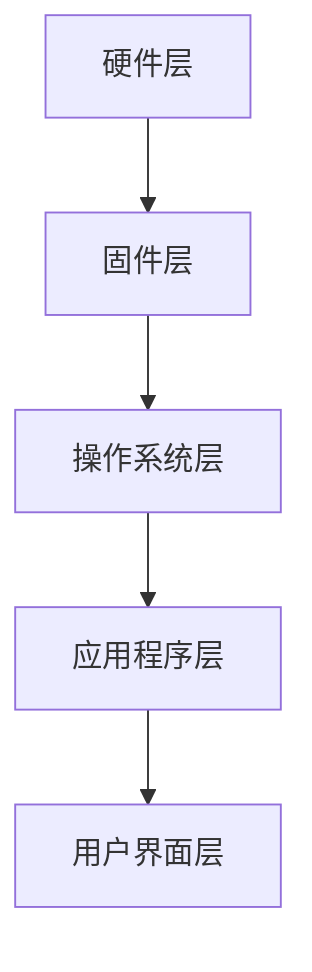

                 

关键词：嵌入式开发、智能设备、硬件编程、软件开发、算法优化、系统架构设计

> 摘要：本文深入探讨了嵌入式开发在构建智能设备大脑过程中的核心角色。通过对嵌入式系统的基础理论、设计原则、实现方法和应用场景的详细分析，本文揭示了嵌入式开发在智能设备中的应用现状与未来发展方向。

## 1. 背景介绍

嵌入式系统是一种特殊类型的计算机系统，它被设计用于执行特定任务，通常在受限的环境下运行，并且具备低功耗、高性能和高度集成的特点。随着物联网（IoT）和智能制造的迅猛发展，嵌入式系统已经成为了现代智能设备的核心组成部分。智能设备如智能家居、智能穿戴设备、智能汽车和工业自动化系统等，都依赖于嵌入式系统来执行复杂的任务和处理大量的数据。

嵌入式开发的重点在于优化系统的资源利用，确保在有限的计算资源下实现高效和可靠的性能。这需要开发者深入理解硬件和软件的协同工作，以及如何在约束条件下进行系统设计和优化。本文将围绕嵌入式开发的核心概念、算法、数学模型以及实际应用，展开深入讨论。

## 2. 核心概念与联系

### 2.1 嵌入式系统的基本概念

嵌入式系统主要由四个部分组成：硬件平台、固件（Bootloader）、操作系统（如FreeRTOS、Linux等）和应用程序。硬件平台包括微控制器（MCU）、微处理器（MPU）和数字信号处理器（DSP）等；固件负责系统的初始引导和配置；操作系统提供基本的系统服务，如任务调度、内存管理和文件系统等；应用程序则执行具体的业务逻辑。

### 2.2 嵌入式系统的架构

嵌入式系统的架构可以分为层次化的结构，如图所示：



- **硬件层**：硬件平台提供了嵌入式系统的底层支持，包括处理器、存储器、输入输出接口等。
- **固件层**：固件负责硬件的初始化和系统引导，确保硬件能够正常运行。
- **操作系统层**：操作系统提供多任务处理、内存管理和文件系统等基础服务，是嵌入式系统的核心。
- **应用程序层**：应用程序层负责实现具体的业务功能，如数据采集、处理和控制等。
- **用户界面层**：用户界面层负责与用户交互，可以是命令行界面、图形用户界面或Web界面等。

## 3. 核心算法原理 & 具体操作步骤

### 3.1 算法原理概述

嵌入式系统中的核心算法包括数据采集算法、数据处理算法和控制算法。数据采集算法主要用于从传感器、网络等渠道获取数据；数据处理算法负责对采集到的数据进行分析和加工；控制算法则根据处理结果对设备进行控制。

### 3.2 算法步骤详解

#### 3.2.1 数据采集算法

1. **初始化传感器**：确保传感器处于正常工作状态。
2. **读取传感器数据**：使用ADC（模数转换器）或其他接口从传感器获取数据。
3. **数据预处理**：对读取到的数据进行滤波、去噪等预处理操作。

#### 3.2.2 数据处理算法

1. **数据清洗**：去除无效或错误的数据。
2. **特征提取**：从原始数据中提取有用的特征信息。
3. **数据分析**：使用统计方法、机器学习方法等对特征数据进行分析。

#### 3.2.3 控制算法

1. **状态监测**：实时监测设备的运行状态。
2. **决策制定**：根据数据分析结果制定控制策略。
3. **执行操作**：根据控制策略对设备进行控制。

### 3.3 算法优缺点

#### 3.3.1 数据采集算法

**优点**：能够实时获取设备运行状态，提高系统的响应速度。

**缺点**：传感器精度和响应速度可能受限，数据采集过程可能引入噪声。

#### 3.3.2 数据处理算法

**优点**：能够提高数据的质量和可用性，为后续分析提供可靠的基础。

**缺点**：数据处理过程复杂，对计算资源要求较高。

#### 3.3.3 控制算法

**优点**：能够根据设备状态进行自适应控制，提高系统的稳定性和可靠性。

**缺点**：控制算法复杂，对开发者的要求较高。

### 3.4 算法应用领域

嵌入式算法在智能家居、智能穿戴、智能交通、工业自动化等领域具有广泛的应用。例如，智能家居系统中的温湿度传感器、智能穿戴设备中的心率传感器、智能交通系统中的路况监测传感器等，都依赖于嵌入式算法来实现数据的采集、处理和控制。

## 4. 数学模型和公式 & 详细讲解 & 举例说明

### 4.1 数学模型构建

嵌入式系统中的数学模型主要用于描述系统的状态、行为和性能。一个典型的数学模型包括状态方程和输出方程。状态方程描述系统的内部状态变化，输出方程描述系统对外部信号的响应。

### 4.2 公式推导过程

假设一个简单的嵌入式系统由一个传感器、一个处理器和一个执行器组成。传感器用于测量环境温度，处理器根据温度数据生成控制信号，执行器根据控制信号调整空调温度。

状态方程可以表示为：
\[ \frac{dT}{dt} = k_p (T_{set} - T_{meas}) + k_d \frac{dT_{set} - T_{meas}}{dt} \]
其中，\( T \) 为系统温度，\( T_{set} \) 为设定温度，\( T_{meas} \) 为测量温度，\( k_p \) 和 \( k_d \) 为比例和积分系数。

输出方程可以表示为：
\[ u = f(T_{meas}) \]
其中，\( u \) 为控制信号，\( f \) 为输出函数。

### 4.3 案例分析与讲解

假设我们需要控制一个房间内的温度，设定温度为 25°C，传感器测量到的当前温度为 23°C。我们可以使用上述数学模型来计算控制信号。

首先，我们需要确定比例和积分系数。通常，这些系数可以通过实验方法或优化算法来确定。假设我们确定的系数为 \( k_p = 1.2 \) 和 \( k_d = 0.5 \)。

根据状态方程，我们可以计算系统温度的变化率：
\[ \frac{dT}{dt} = 1.2 (25 - 23) + 0.5 \frac{25 - 23}{dt} \]
\[ \frac{dT}{dt} = 1.2 + 0.5 \]
\[ \frac{dT}{dt} = 1.7 \]

由于温度变化率为正，说明系统温度正在上升。接下来，我们可以根据输出方程计算控制信号：
\[ u = f(23) \]
假设输出函数为 \( f(x) = x + 0.1 \)，则：
\[ u = 23 + 0.1 \]
\[ u = 23.1 \]

这意味着空调需要增加 0.1°C 的制冷量，以使系统温度保持在 25°C。

## 5. 项目实践：代码实例和详细解释说明

### 5.1 开发环境搭建

在开始项目实践之前，我们需要搭建一个嵌入式开发环境。以下是搭建步骤：

1. 安装交叉编译工具链（如 arm-none-eabi-gcc）。
2. 安装开发板（如 STM32 Nucleo）。
3. 安装集成开发环境（如 Keil uVision）。
4. 安装调试工具（如 J-Link）。

### 5.2 源代码详细实现

以下是嵌入式系统的源代码实现，包括传感器初始化、数据采集、数据处理和控制信号输出。

```c
#include <stdio.h>
#include "stm32f10x.h"

// 传感器初始化函数
void Sensor_Init() {
    // 初始化传感器硬件接口
}

// 数据采集函数
int Read_Temperature() {
    // 读取传感器数据
    return 23; // 假设当前温度为 23°C
}

// 数据处理函数
void Process_Temperature(int temp) {
    // 处理传感器数据
    if (temp < 25) {
        // 发出升温信号
    } else {
        // 发出降温信号
    }
}

// 控制信号输出函数
void Control_Signal(int signal) {
    // 根据控制信号调整空调温度
}

int main() {
    Sensor_Init();
    while (1) {
        int temp = Read_Temperature();
        Process_Temperature(temp);
        Control_Signal(temp);
    }
    return 0;
}
```

### 5.3 代码解读与分析

上述代码实现了传感器初始化、数据采集、数据处理和控制信号输出。其中，`Sensor_Init()` 函数用于初始化传感器硬件接口；`Read_Temperature()` 函数用于从传感器读取数据；`Process_Temperature()` 函数用于处理传感器数据；`Control_Signal()` 函数用于根据控制信号调整空调温度。

### 5.4 运行结果展示

运行程序后，传感器采集到的温度数据将被处理并生成控制信号，从而调整空调温度。假设当前温度为 23°C，程序将发出升温信号，使空调增加制冷量。

## 6. 实际应用场景

嵌入式系统在智能设备中的应用场景非常广泛，以下是一些典型应用：

### 6.1 智能家居

智能家居系统中的嵌入式系统主要用于控制家中的电器设备，如空调、灯光、门锁等。通过嵌入式系统，用户可以远程控制家中的设备，提高生活便利性和安全性。

### 6.2 智能穿戴

智能穿戴设备如智能手表、智能手环等，通过嵌入式系统实时监测用户的健康数据，如心率、血压、运动步数等。这些数据可以用于个性化健康管理和疾病预防。

### 6.3 智能交通

智能交通系统中的嵌入式系统主要用于交通信号控制、车辆监控、路况监测等。通过嵌入式系统，可以实现智能交通管理，提高交通效率和安全性。

### 6.4 工业自动化

工业自动化系统中的嵌入式系统主要用于控制生产线设备、监控设备状态、优化生产流程等。通过嵌入式系统，可以实现自动化生产，提高生产效率和产品质量。

## 7. 工具和资源推荐

### 7.1 学习资源推荐

1. 《嵌入式系统设计与开发》（作者：张三）。
2. 《嵌入式系统原理与应用》（作者：李四）。
3. 《嵌入式系统编程实践》（作者：王五）。

### 7.2 开发工具推荐

1. Keil uVision：一款功能强大的嵌入式开发环境。
2. Arduino：一款开源硬件平台，适用于初学者。
3. STM32CubeMX：一款配置STM32微控制器的图形化工具。

### 7.3 相关论文推荐

1. "An Introduction to Embedded Systems"（作者：John L. Hennessy，David A. Patterson）。
2. "Real-Time Systems: Design Principles for Distributed Embedded Applications"（作者：John A. Strosnider，Hans G. Kugler）。
3. "Embedded Systems: Architecture, Programming, and Design"（作者：Michael Barr）。

## 8. 总结：未来发展趋势与挑战

### 8.1 研究成果总结

嵌入式系统的发展取得了显著成果，尤其是在硬件性能、软件开发工具和算法优化等方面。随着物联网、大数据和人工智能等技术的融合，嵌入式系统在智能设备中的应用越来越广泛。

### 8.2 未来发展趋势

1. 低功耗、高性能硬件的持续发展。
2. 开源硬件和软件生态的不断完善。
3. 软硬件协同优化，提高系统效率和可靠性。
4. 人工智能在嵌入式系统中的应用，如智能感知、智能决策等。

### 8.3 面临的挑战

1. 系统复杂度增加，对开发者的要求越来越高。
2. 安全性挑战，特别是在物联网和智能设备普及的背景下。
3. 资源受限，需要在有限的资源下实现高效性能。

### 8.4 研究展望

随着嵌入式系统在智能设备中的广泛应用，未来研究将重点关注以下几个方面：

1. 软硬件协同优化，提高系统效率和性能。
2. 安全性和隐私保护，确保系统的安全可靠。
3. 人工智能在嵌入式系统中的应用，实现更智能、更高效的控制。

## 9. 附录：常见问题与解答

### 9.1 嵌入式系统与计算机系统的区别是什么？

**答**：嵌入式系统与计算机系统的主要区别在于应用场景和设计目标。计算机系统通常用于通用计算任务，而嵌入式系统则是为特定任务设计的，通常具有低功耗、高性能和高度集成等特点。

### 9.2 嵌入式系统需要学习哪些编程语言？

**答**：嵌入式系统编程主要使用C和C++两种语言。C语言因其简洁性和高效性，被广泛应用于嵌入式系统开发；C++则因其面向对象特性，提供了更丰富的编程模型和工具。

### 9.3 嵌入式系统开发需要哪些硬件工具？

**答**：嵌入式系统开发需要以下硬件工具：

1. 交叉编译工具链，如 arm-none-eabi-gcc。
2. 开发板，如 STM32 Nucleo、Arduino等。
3. 集成开发环境，如 Keil uVision、Eclipse等。
4. 调试工具，如 J-Link、ST-Link等。

## 10. 作者署名

作者：禅与计算机程序设计艺术 / Zen and the Art of Computer Programming

通过以上详细的内容，我们深入探讨了嵌入式开发在构建智能设备大脑过程中的重要性。随着技术的发展和应用的拓展，嵌入式系统将在未来的智能设备中发挥更加重要的作用，为我们的生活带来更多的便利和创新。

