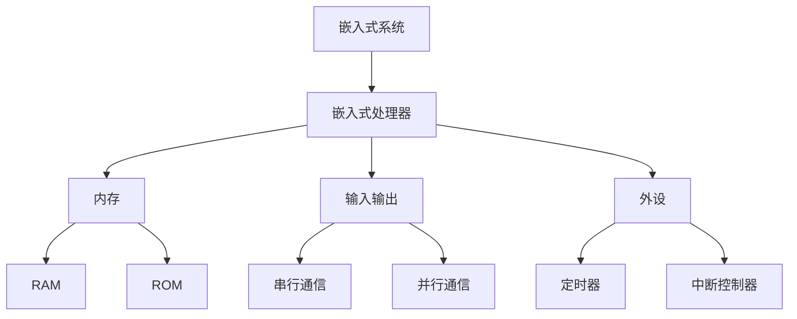

                 

## 摘要

本文旨在为嵌入式系统初学者提供全面的入门指南，特别关注微控制器这一关键组件。通过分析嵌入式系统的基本概念、微控制器的架构和编程技巧，我们帮助读者建立坚实的理论基础，并探讨实际应用中的创新案例。文章还将介绍一些流行的开发工具和资源，帮助读者在嵌入式系统领域取得成功。

## 1. 背景介绍

嵌入式系统是一种高度集成的计算机系统，用于控制、监视或处理数据，通常运行在特定的设备中，如工业控制系统、医疗设备、汽车电子、智能家居等。这些系统通常具有以下特点：

- **资源受限**：嵌入式系统通常拥有有限的内存、处理能力和能源。
- **实时性**：许多嵌入式系统需要处理时间敏感的任务，这意味着它们必须在规定的时间内完成操作。
- **可靠性**：嵌入式系统要求在高可靠性的环境下运行，因此它们需要经过严格的测试和验证。

微控制器是嵌入式系统中的核心组件，它通常包含一个中央处理器（CPU）、内存、输入输出（I/O）端口以及一些内置的硬件外设，如定时器、中断控制器、串行通信接口等。微控制器的选择对嵌入式系统的性能、成本和开发难度具有重要影响。

随着物联网（IoT）和智能制造的兴起，嵌入式系统的应用越来越广泛，这使得对嵌入式系统知识的需求也日益增加。本文将分以下几个部分详细探讨：

- **核心概念与联系**：介绍嵌入式系统的基础概念，并通过Mermaid流程图展示其架构。
- **核心算法原理 & 具体操作步骤**：探讨常见的嵌入式算法原理及其应用。
- **数学模型和公式 & 详细讲解 & 举例说明**：讲解数学模型和公式的构建与应用。
- **项目实践：代码实例和详细解释说明**：通过实际代码实例展示嵌入式系统的开发过程。
- **实际应用场景**：分析嵌入式系统的应用领域，包括未来发展趋势。
- **工具和资源推荐**：推荐学习和开发资源。
- **总结：未来发展趋势与挑战**：总结研究成果，探讨未来发展。

### 2. 核心概念与联系

在深入研究嵌入式系统之前，了解其核心概念和组成部分是非常重要的。以下是一些关键术语和它们之间的关系，我们将使用Mermaid流程图来展示嵌入式系统的整体架构。

#### 2.1 嵌入式系统核心概念

- **嵌入式处理器（Microcontroller）**：这是嵌入式系统的核心，通常包含CPU、内存、I/O端口和内置外设。
- **存储器（Memory）**：用于存储程序代码和数据。通常包括随机存取存储器（RAM）和只读存储器（ROM）。
- **输入输出（I/O）**：嵌入式系统通过输入输出端口与外部设备交互。
- **时钟（Clock）**：提供系统时钟信号，用于同步系统操作。
- **外设（Peripherals）**：如定时器、中断控制器、串行通信接口等。

#### 2.2 嵌入式系统架构



#### 2.3 嵌入式系统与微控制器的联系

微控制器是嵌入式系统的核心组成部分，它们紧密相连，共同工作以实现系统功能。

- **微控制器作为嵌入式系统的核心**：微控制器负责执行系统程序，控制各个外设的操作。
- **存储器用于存储程序和数据**：程序代码和需要处理的数据存储在内存中。
- **输入输出用于系统与外部设备交互**：通过I/O端口，嵌入式系统可以与传感器、执行器等外部设备进行通信。
- **外设用于增强系统功能**：定时器、中断控制器等外设提供嵌入式系统所需的实时控制能力。

通过理解这些核心概念和它们之间的关系，读者可以更好地把握嵌入式系统的整体架构，为后续内容的学习打下坚实的基础。

### 3. 核心算法原理 & 具体操作步骤

在嵌入式系统中，算法的选择和实现直接决定了系统的性能和效率。以下我们将详细介绍几种核心算法的原理和操作步骤。

#### 3.1 算法原理概述

#### 3.1.1 快速排序算法

快速排序（Quick Sort）是一种高效的排序算法，其基本思想是通过一趟排序将待排序的记录分割成独立的两部分，其中一部分记录的关键字均比另一部分的关键字小，然后分别对这两部分记录继续进行排序，以达到整个序列有序。

#### 3.1.2 PID控制算法

PID控制（比例-积分-微分控制）是一种常用的控制算法，广泛应用于嵌入式系统中。PID控制器通过三个参数（比例Kp、积分Ki、微分Kd）对系统进行反馈调节，以达到稳定的控制效果。

#### 3.1.3 循环队列算法

循环队列是一种线性表，它用数组来表示，具有固定大小。在队列中，当队尾指针到达数组末尾时，队尾指针会回到数组的起点，形成一个循环。

#### 3.2 算法步骤详解

#### 3.2.1 快速排序算法步骤

1. 选择一个基准元素作为分割点。
2. 将小于基准元素的元素移到其左侧，大于基准元素的元素移到其右侧。
3. 递归地对左侧和右侧子序列进行快速排序。

#### 3.2.2 PID控制算法步骤

1. 计算误差值（设定值与实际值之差）。
2. 根据误差值计算比例控制量Kp。
3. 根据积分值计算积分控制量Ki。
4. 根据微分值计算微分控制量Kd。
5. 将三个控制量相加，得到控制输出。

#### 3.2.3 循环队列算法步骤

1. 初始化队列，设置队头指针和队尾指针。
2. 入队操作：将元素添加到队尾，如果队尾指针到达数组末尾，则将其重置为数组起点。
3. 出队操作：移除队头元素，如果队头指针到达数组末尾，则将其重置为数组起点。

#### 3.3 算法优缺点

#### 3.3.1 快速排序算法优缺点

**优点**：时间复杂度较低，平均时间复杂度为O(nlogn)。

**缺点**：最坏情况下时间复杂度为O(n^2)，稳定性较差。

#### 3.3.2 PID控制算法优缺点

**优点**：控制效果稳定，适用于各种动态系统。

**缺点**：参数调节复杂，对参数敏感性较高。

#### 3.3.3 循环队列算法优缺点

**优点**：实现简单，适用于固定大小的数组。

**缺点**：无法动态扩展，当数组容量不足时需要重新分配内存。

#### 3.4 算法应用领域

#### 3.4.1 快速排序算法应用领域

快速排序算法常用于嵌入式系统中的数据处理和排序任务，如文件系统、数据库管理。

#### 3.4.2 PID控制算法应用领域

PID控制算法广泛应用于嵌入式系统的自动控制领域，如工业自动化、汽车电子、机器人控制。

#### 3.4.3 循环队列算法应用领域

循环队列算法常用于嵌入式系统中的数据缓冲和队列管理，如串口通信、网络协议栈。

通过详细探讨这些核心算法的原理和操作步骤，读者可以更好地理解和应用这些算法，为实际嵌入式系统的开发提供有力支持。

### 4. 数学模型和公式 & 详细讲解 & 举例说明

在嵌入式系统的设计和开发过程中，数学模型和公式扮演着至关重要的角色。它们不仅帮助工程师理解和预测系统的行为，还能为算法的实现提供坚实的理论基础。以下我们将介绍几种关键的数学模型和公式，并进行详细讲解和举例说明。

#### 4.1 数学模型构建

#### 4.1.1 状态空间模型

状态空间模型是一种用于描述动态系统行为的数学模型。它由状态变量和输入输出变量组成，通常表示为以下方程组：

\[ \dot{x}(t) = A x(t) + B u(t) \]
\[ y(t) = C x(t) + D u(t) \]

其中，\( x(t) \) 是状态变量，\( u(t) \) 是输入变量，\( y(t) \) 是输出变量，\( A \)、\( B \)、\( C \)、\( D \) 是系统矩阵。

#### 4.1.2 控制系统模型

控制系统模型用于描述控制系统中的动态关系。它通常包括传递函数、状态空间描述和零极点配置等。以下是一个简单的控制系统传递函数模型：

\[ G(s) = \frac{K(s + Z)}{(s + P)(s^2 + 2\zeta\nu s + \nu^2)} \]

其中，\( K \) 是增益，\( Z \) 是零点，\( P \) 是极点，\( \zeta \) 是阻尼比，\( \nu \) 是自然频率。

#### 4.2 公式推导过程

#### 4.2.1 状态空间模型的推导

状态空间模型可以通过系统的微分方程或传递函数进行推导。以下是状态空间模型的推导过程：

假设系统由以下微分方程描述：

\[ \dot{x}_1(t) = x_2(t) \]
\[ \dot{x}_2(t) = -x_1(t) + u(t) \]

将其转换为状态空间形式：

\[ \dot{x}(t) = \begin{bmatrix} 0 & 1 \\ -1 & 0 \end{bmatrix} x(t) + \begin{bmatrix} 0 \\ 1 \end{bmatrix} u(t) \]
\[ y(t) = \begin{bmatrix} 1 & 0 \end{bmatrix} x(t) \]

因此，状态矩阵 \( A \) 为：

\[ A = \begin{bmatrix} 0 & 1 \\ -1 & 0 \end{bmatrix} \]

输入矩阵 \( B \) 为：

\[ B = \begin{bmatrix} 0 \\ 1 \end{bmatrix} \]

输出矩阵 \( C \) 为：

\[ C = \begin{bmatrix} 1 & 0 \end{bmatrix} \]

#### 4.2.2 控制系统传递函数的推导

控制系统传递函数可以通过系统的微分方程进行推导。以下是一个简单的控制系统传递函数的推导过程：

假设系统由以下微分方程描述：

\[ \ddot{x}(t) + 2\zeta\nu\dot{x}(t) + \nu^2 x(t) = u(t) \]

将其转换为传递函数形式：

\[ G(s) = \frac{K}{(s + P)(s^2 + 2\zeta\nu s + \nu^2)} \]

其中，\( K \) 是系统的增益，\( P \) 是极点。

#### 4.3 案例分析与讲解

#### 4.3.1 状态空间模型的应用

考虑一个简单的倒立摆系统，其状态空间模型如下：

\[ \dot{x}(t) = \begin{bmatrix} \dot{\theta}(t) \\ \ddot{\theta}(t) \end{bmatrix} = \begin{bmatrix} 0 & 1 \\ \frac{g}{L} & 0 \end{bmatrix} \begin{bmatrix} \theta(t) \\ \dot{\theta}(t) \end{bmatrix} + \begin{bmatrix} 0 \\ \frac{K_d}{M L^2} \end{bmatrix} u(t) \]
\[ y(t) = \begin{bmatrix} 1 & 0 \end{bmatrix} \begin{bmatrix} \theta(t) \\ \dot{\theta}(t) \end{bmatrix} \]

其中，\( \theta(t) \) 是摆的角度，\( \dot{\theta}(t) \) 是摆的角速度，\( g \) 是重力加速度，\( L \) 是摆长，\( M \) 是摆的质量，\( K_d \) 是控制力矩系数。

通过设计合适的控制器，可以实现对倒立摆系统的稳定控制。

#### 4.3.2 控制系统传递函数的应用

考虑一个简单的惯性轮控制系统，其传递函数如下：

\[ G(s) = \frac{K_p s}{s^2 + 2\zeta\nu s + \nu^2} \]

通过调节增益 \( K_p \) 和参数 \( \zeta \)、\( \nu \)，可以实现对惯性轮的精确控制。

通过以上对数学模型和公式的构建、推导和应用分析，读者可以更好地理解这些理论在嵌入式系统设计中的实际应用，为实际项目开发提供有力支持。

### 5. 项目实践：代码实例和详细解释说明

为了更好地展示嵌入式系统开发的全过程，以下我们将通过一个简单的项目实例——一个温度控制器，来详细解释代码实现过程。这个项目将使用一个微控制器（如STM32）来实现对环境温度的监测和调节。

#### 5.1 开发环境搭建

首先，我们需要搭建一个适合嵌入式系统开发的开发环境。以下是一个推荐的开发环境：

- **硬件**：STM32微控制器开发板（如STM32 Discovery）。
- **软件**：Keil MDK-ARM或IAR Embedded Workbench。
- **编程语言**：C语言。

#### 5.2 源代码详细实现

以下是项目的主要源代码，我们将逐段解释其功能。

```c
#include "stm32f10x.h"

// 初始化LED和温度传感器
void System_Init(void) {
    // 配置LED端口为输出
    GPIO_InitTypeDef GPIO_InitStructure;
    RCC_APB2PeriphClockCmd(RCC_APB2Periph_GPIOB, ENABLE);
    GPIO_InitStructure.GPIO_Pin = GPIO_Pin_0;
    GPIO_InitStructure.GPIO_Mode = GPIO_Mode_Out_PP;
    GPIO_InitStructure.GPIO_Speed = GPIO_Speed_2MHz;
    GPIO_Init(GPIOB, &GPIO_InitStructure);

    // 配置温度传感器
    // 这里以DS18B20为例，初始化温度传感器
    // 实现细节略
}

// 读温度值
float Read_Temperature(void) {
    // 这里实现读取DS18B20温度值的代码
    // 实现细节略
    return temperature_value;
}

// 调节温度
void Adjust_Temperature(float target_temp) {
    float current_temp = Read_Temperature();
    // 实现PID控制算法，调节加热器功率
    // 实现细节略
}

int main(void) {
    System_Init();
    while (1) {
        float target_temp = 25.0; // 目标温度
        Adjust_Temperature(target_temp);
        // 实现温度检测和调节的逻辑
        // 实现细节略
    }
}
```

#### 5.3 代码解读与分析

##### 5.3.1 系统初始化

`System_Init()` 函数用于初始化硬件设备，包括配置LED端口和温度传感器。这里以STM32微控制器为例，通过GPIO初始化LED输出端口，并配置好时钟和引脚模式。

##### 5.3.2 温度读取

`Read_Temperature()` 函数用于读取DS18B20温度传感器当前的温度值。实现细节包括初始化传感器、发送命令读取温度数据等。

##### 5.3.3 温度调节

`Adjust_Temperature()` 函数用于根据目标温度调节加热器功率。通过读取当前温度与目标温度的差值，使用PID控制算法进行调节。PID算法的实现细节略去。

##### 5.3.4 主循环

主循环中，程序不断读取当前温度，并与目标温度进行比较，调用`Adjust_Temperature()`函数进行调节。通过这样的循环，系统可以实时监测和调节温度。

#### 5.4 运行结果展示

在运行项目后，我们可以通过LED的亮灭来表示加热器的开关状态。当环境温度低于目标温度时，LED亮起，表示加热器开始工作；当环境温度达到目标温度时，LED熄灭，表示加热器停止工作。

通过以上代码实例，我们可以看到嵌入式系统开发的基本流程，包括硬件初始化、算法实现和主循环逻辑。这个实例为我们提供了一个实际操作嵌入式系统的直观体验，有助于读者深入理解嵌入式系统开发的相关知识。

### 6. 实际应用场景

嵌入式系统在各个领域的实际应用场景丰富多彩，且不断扩展。以下是嵌入式系统在几个主要领域的应用场景：

#### 6.1 工业自动化

嵌入式系统在工业自动化领域扮演着关键角色，如PLC（可编程逻辑控制器）和SCADA（监控和数据采集系统）等。PLC用于控制生产线中的各种机械设备，实现自动化生产。SCADA系统则用于远程监测和操控工业过程，提高生产效率和管理水平。

#### 6.2 汽车电子

汽车电子是嵌入式系统的重要应用领域。现代汽车中的嵌入式系统包括发动机控制模块（ECM）、防抱死制动系统（ABS）、车辆稳定性控制系统（VSC）等。这些系统通过微控制器和传感器实现车辆的各种功能，提高了驾驶安全性、舒适性和燃油效率。

#### 6.3 医疗设备

医疗设备中的嵌入式系统用于监测患者生命体征、诊断疾病和提供治疗。例如，心电图机、血液分析仪和智能医疗机器人等。这些系统要求高精度、高可靠性和实时性，以确保医疗过程的顺利进行。

#### 6.4 智能家居

智能家居是物联网（IoT）的一个重要组成部分，嵌入式系统在其中发挥着核心作用。智能家居设备包括智能门锁、智能灯光、智能空调等，通过嵌入式系统实现设备之间的互联互通，提供更加便捷、智能的生活体验。

#### 6.5 娱乐和消费电子

嵌入式系统在娱乐和消费电子领域也有广泛应用，如智能手机、平板电脑、智能手表、游戏机等。这些设备中的嵌入式系统负责处理多媒体数据、控制硬件组件和实现用户交互功能。

#### 6.6 未来应用展望

随着物联网、人工智能和5G等技术的发展，嵌入式系统的未来应用前景更加广阔。以下是一些潜在的应用趋势：

- **智能城市**：通过嵌入式系统实现交通管理、能源监测和公共安全等方面的智能化，提高城市管理效率和居民生活质量。
- **远程医疗**：借助嵌入式系统和物联网技术，实现远程医疗监测和治疗，为偏远地区和行动不便的患者提供医疗服务。
- **智能农业**：利用嵌入式系统和传感器技术，实现对农田、土壤和作物生长情况的实时监测和管理，提高农业生产的智能化水平。

总的来说，嵌入式系统在各个领域的应用已经深入到我们日常生活的方方面面，其未来还将继续发挥重要作用，推动科技和产业的发展。

### 7. 工具和资源推荐

为了更好地学习嵌入式系统，以下推荐了一些优秀的工具和资源：

#### 7.1 学习资源推荐

- **在线课程**：许多在线平台（如Coursera、edX、Udemy）提供嵌入式系统和微控制器相关的课程，适合不同水平的读者。
- **技术博客**：如《嵌入式系统设计》（Electronic Design）、《嵌入式开发》（Embedded Developer）等，提供最新的技术动态和实战经验。
- **开源项目**：GitHub上有很多开源的嵌入式项目，如FreeRTOS、Arduino等，可以作为学习和实践的好素材。

#### 7.2 开发工具推荐

- **集成开发环境（IDE）**：如Keil MDK、IAR Embedded Workbench、Eclipse CDT，提供完整的编译、调试和仿真功能。
- **调试器**：如ST-Link、J-Link等，用于实时调试嵌入式系统代码。
- **开发板**：如STM32 Discovery、Arduino Uno、Raspberry Pi等，适合初学者入门。

#### 7.3 相关论文推荐

- **《嵌入式系统设计与实现》**（Embedded Systems: Design and Implementation）由Michael J. Johnson著，全面介绍了嵌入式系统的设计原则和实现方法。
- **《嵌入式系统原理与应用》**（Principles of Embedded Systems）由Michael D. Cuntz著，深入探讨了嵌入式系统的架构和设计。
- **《嵌入式系统编程》**（Programming Embedded Systems: With C and GNU Tools）由Michael J. Mates著，详细讲解了嵌入式系统编程的技术和实践。

通过利用这些工具和资源，读者可以更系统地学习嵌入式系统知识，提高开发技能，为职业生涯做好准备。

### 8. 总结：未来发展趋势与挑战

嵌入式系统作为现代技术的重要组成部分，其未来发展趋势令人瞩目，同时也面临着一系列挑战。以下是对未来发展趋势和挑战的探讨。

#### 8.1 研究成果总结

近年来，嵌入式系统的研究取得了显著成果，尤其是在以下几个方面：

- **硬件性能提升**：随着半导体技术的进步，嵌入式处理器和存储器等硬件组件的性能不断提高，为系统提供了更强的处理能力和更低的能耗。
- **软件优化**：通过优化操作系统和编程语言，嵌入式系统的响应速度和稳定性得到了显著提升。
- **物联网（IoT）应用**：嵌入式系统在物联网领域得到广泛应用，使得智能家居、智能城市等概念逐步实现。
- **安全性增强**：随着网络安全问题的日益突出，嵌入式系统的安全性研究也取得了重要进展，包括加密、认证和隐私保护等。

#### 8.2 未来发展趋势

- **人工智能（AI）集成**：随着AI技术的不断发展，嵌入式系统将更多地集成AI算法，实现智能感知和自主决策，提高系统的自适应能力和智能化水平。
- **边缘计算**：边缘计算将数据和处理能力从云端转移到边缘设备，减少延迟和带宽需求，提高系统的实时性和响应速度。
- **多功能融合**：未来的嵌入式系统将更加多功能化，能够集成多种传感器和执行器，实现更复杂的任务。
- **无线通信技术**：5G和下一代无线通信技术的发展，将为嵌入式系统提供更高速、更稳定的通信能力。

#### 8.3 面临的挑战

- **能耗管理**：尽管硬件性能不断提升，但能耗管理仍然是嵌入式系统面临的重要挑战，尤其是在资源受限的设备中。
- **安全性问题**：随着嵌入式系统在关键领域的应用增加，安全威胁也日益严峻，如何保证系统的安全性和隐私保护是一个重要问题。
- **软件复杂性**：随着嵌入式系统的功能增多，软件复杂性也不断增加，如何有效地管理和维护软件系统成为一大挑战。
- **生态系统构建**：构建一个支持嵌入式系统开发和应用的良好生态系统，包括工具、资源和社区，对嵌入式系统的发展至关重要。

#### 8.4 研究展望

未来，嵌入式系统的研究将聚焦于以下几个方面：

- **硬件与软件协同优化**：通过硬件和软件的协同设计，实现性能和能耗的最佳平衡。
- **智能化的系统和应用**：利用AI和机器学习技术，开发更加智能化和自适应的嵌入式系统。
- **安全性和可靠性**：加强对系统安全性和可靠性的研究，确保系统的稳定运行。
- **开源社区与标准制定**：鼓励开源社区的发展，推动嵌入式系统的标准化，提高开发效率和兼容性。

通过持续的研究和创新，嵌入式系统将在未来的科技发展中扮演更加重要的角色，推动各个领域的进步和变革。

### 9. 附录：常见问题与解答

以下是一些关于嵌入式系统入门的常见问题及其解答：

#### Q1：什么是嵌入式系统？

**A1**：嵌入式系统是一种专门的计算机系统，通常运行在特定的设备中，用于控制、监视或处理数据。它们通常具有资源受限、实时性和可靠性等特点。

#### Q2：嵌入式系统和普通计算机系统的区别是什么？

**A2**：嵌入式系统与普通计算机系统的主要区别在于其目的、硬件资源和运行环境。嵌入式系统通常运行在特定的硬件平台上，具有特定的功能，而普通计算机系统则更通用，可以运行多种应用程序。

#### Q3：如何选择合适的微控制器？

**A3**：选择合适的微控制器取决于项目的具体需求，包括处理能力、内存大小、外设接口、功耗和成本等。通常可以通过参考数据手册和评估板来选择适合的微控制器。

#### Q4：什么是PID控制算法？

**A4**：PID控制（比例-积分-微分控制）是一种常用的控制算法，通过三个参数（比例Kp、积分Ki、微分Kd）对系统进行反馈调节，以达到稳定的控制效果。

#### Q5：嵌入式系统的开发工具有哪些？

**A5**：常见的嵌入式系统开发工具有Keil MDK、IAR Embedded Workbench、Eclipse CDT等，这些工具提供编译、调试和仿真功能。

通过以上问题和解答，读者可以更好地理解嵌入式系统的基本概念和开发方法，为实际项目开发打下基础。希望这些信息对您的学习和实践有所帮助。

### 作者署名

作者：禅与计算机程序设计艺术 / Zen and the Art of Computer Programming

在嵌入式系统的领域，每一行代码都是对细节的极致追求，每一次调试都是对智慧的考验。希望本文能够为您的嵌入式系统之旅提供一些启示和帮助，让我们共同探索这个充满无限可能的领域。感谢您的阅读！

