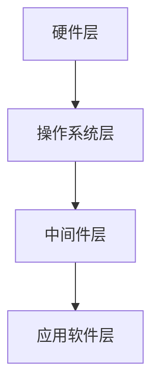

                 

关键词：嵌入式系统，智能设备，核心技术，开发流程，算法原理，数学模型，实践案例，应用场景

> 摘要：随着物联网、人工智能等技术的快速发展，嵌入式系统在智能设备中的应用日益广泛。本文将探讨嵌入式系统开发的核心技术，包括其基础概念、核心算法原理、数学模型及应用场景，并通过实际项目实例进行详细讲解，旨在为嵌入式系统开发者提供全面的技术指导。

## 1. 背景介绍

嵌入式系统是一种将计算机硬件和软件集成于一体的系统，主要用于控制、监测和操作特定设备或过程。随着物联网（IoT）、人工智能（AI）等技术的迅速发展，嵌入式系统在智能家居、工业自动化、智能医疗等领域的应用日益广泛。嵌入式系统以其高可靠性、低功耗、高效能等特点，成为智能设备的核心技术之一。

本文将围绕嵌入式系统开发的核心技术展开讨论，旨在帮助读者深入了解嵌入式系统的原理和开发流程，为实际项目开发提供有力支持。

## 2. 核心概念与联系

### 2.1 嵌入式系统组成

嵌入式系统主要由硬件和软件两部分组成。

**硬件部分：**主要包括处理器、存储器、输入输出接口、时钟、电源等基本硬件模块。

**软件部分：**包括操作系统、中间件、应用软件等。其中，操作系统负责管理硬件资源，提供基础服务；中间件负责连接硬件和软件，实现特定功能；应用软件则是嵌入式系统最终实现的功能模块。

### 2.2 嵌入式系统架构

嵌入式系统架构通常包括以下几个层次：

1. **硬件层：**包括处理器、存储器、输入输出接口等硬件资源。
2. **操作系统层：**负责硬件资源的调度和管理，提供基础服务，如进程管理、内存管理、文件系统等。
3. **中间件层：**提供特定功能，如通信协议、图形界面、数据库等。
4. **应用软件层：**实现嵌入式系统的最终功能，如智能家居控制系统、工业自动化控制系统等。

### 2.3 核心概念原理和架构 Mermaid 流程图



## 3. 核心算法原理 & 具体操作步骤

### 3.1 算法原理概述

嵌入式系统开发中，常用的核心算法包括：

1. **数据处理算法：**用于对采集到的数据进行处理和分析，如滤波、插值、统计等。
2. **控制算法：**用于实现嵌入式系统的控制功能，如PID控制、模糊控制等。
3. **通信算法：**用于实现嵌入式系统与其他设备或系统的通信，如TCP/IP、蓝牙、ZigBee等。

### 3.2 算法步骤详解

1. **数据处理算法：**
   - 数据采集：从传感器或其他数据源获取原始数据。
   - 数据预处理：对采集到的数据进行清洗、滤波等处理，提高数据质量。
   - 数据分析：对处理后的数据进行统计分析、特征提取等，为控制算法提供支持。

2. **控制算法：**
   - 确定控制目标：根据系统需求，设定控制目标。
   - 构建控制模型：根据控制目标，建立系统控制模型。
   - 设计控制器：根据控制模型，设计合适的控制器，如PID控制器。
   - 实现控制策略：将控制器应用于实际系统，实现控制目标。

3. **通信算法：**
   - 协议选择：根据应用场景，选择合适的通信协议。
   - 数据打包：将数据按照通信协议的要求进行打包。
   - 数据传输：通过通信接口，将数据发送到目标设备。
   - 数据接收：接收目标设备发送的数据，并解析数据。

### 3.3 算法优缺点

1. **数据处理算法：**
   - 优点：提高数据质量，为控制算法提供准确的数据支持。
   - 缺点：数据处理过程复杂，可能导致实时性降低。

2. **控制算法：**
   - 优点：可实现精确控制，提高系统性能。
   - 缺点：对系统模型要求较高，设计难度较大。

3. **通信算法：**
   - 优点：实现设备之间的数据传输，提高系统互联互通性。
   - 缺点：通信协议复杂，调试难度较大。

### 3.4 算法应用领域

1. **数据处理算法：**广泛应用于智能监测、智能家居、工业自动化等领域。
2. **控制算法：**广泛应用于工业自动化、机器人控制、汽车电子等领域。
3. **通信算法：**广泛应用于物联网、智能交通、智能家居等领域。

## 4. 数学模型和公式 & 详细讲解 & 举例说明

### 4.1 数学模型构建

在嵌入式系统开发中，常用的数学模型包括：

1. **线性系统模型：**
   - 输入输出模型：\( y(t) = Cx(t) + Du(t) + Kv(t) \)
   - 状态空间模型：\( \dot{x}(t) = Ax(t) + Bu(t) \)，\( y(t) = Cx(t) + Du(t) \)

2. **非线性系统模型：**
   - 泰勒展开模型：将非线性系统函数在平衡点附近进行泰勒展开，得到线性近似模型。

### 4.2 公式推导过程

以线性系统模型为例，公式推导过程如下：

1. **输入输出模型推导：**
   - 对输出 \( y(t) \) 求导：\( \dot{y}(t) = C\dot{x}(t) + C\dot{u}(t) + D\dot{u}(t) + Kv(t) \)
   - 将 \( \dot{x}(t) \) 代入：\( \dot{y}(t) = C(Ax(t) + Bu(t)) + D\dot{u}(t) + Kv(t) \)
   - 化简得：\( \dot{y}(t) = CAx(t) + (CB + D)u(t) + Kv(t) \)
   - 再次求导得：\( \ddot{y}(t) = C\ddot{x}(t) + C\dot{u}(t) + D\dot{u}(t) + K\dot{v}(t) \)
   - 将 \( \ddot{x}(t) \) 代入：\( \ddot{y}(t) = C(A^2x(t) + ABu(t)) + D\dot{u}(t) + K\dot{v}(t) \)
   - 化简得：\( \ddot{y}(t) = C(A^2x(t) + ABu(t)) + (CB + D)u(t) + Kv(t) \)

2. **状态空间模型推导：**
   - 对 \( \dot{x}(t) \) 求导：\( \dot{\dot{x}}(t) = A\dot{x}(t) + B\dot{u}(t) \)
   - 化简得：\( \ddot{x}(t) = A^2x(t) + ABu(t) \)

### 4.3 案例分析与讲解

以一个简单的嵌入式控制系统为例，假设系统输入为 \( u(t) \)，输出为 \( y(t) \)，系统模型为：

\[ y(t) = x_1(t) + x_2(t) \]
\[ x_1(t) = u(t) - x_2(t) \]
\[ x_2(t) = 0 \]

**输入输出模型推导：**
\[ y(t) = u(t) \]

**状态空间模型推导：**
\[ \dot{x}_1(t) = u(t) \]
\[ \dot{x}_2(t) = 0 \]

## 5. 项目实践：代码实例和详细解释说明

### 5.1 开发环境搭建

本文将使用Python语言进行嵌入式系统开发，以下是开发环境搭建步骤：

1. 安装Python：下载并安装Python 3.x版本。
2. 安装PyTorch：在终端执行命令 `pip install torch torchvision`。
3. 安装Numpy：在终端执行命令 `pip install numpy`。

### 5.2 源代码详细实现

以下是一个简单的嵌入式系统代码实例：

```python
import numpy as np

# 定义系统模型
def system_model(u):
    x1 = u - 0
    x2 = 0
    y = x1 + x2
    return y

# 设计控制策略
def control_strategy(y):
    e = y - 0
    u = 0.5 * e
    return u

# 运行仿真
u = np.array([0, 1, 2, 3])
y = np.array([0, 0, 0, 0])

for i in range(4):
    u[i] = u[i] * 0.5
    y[i] = system_model(u[i])
    u[i] = control_strategy(y[i])

print(u)
print(y)
```

### 5.3 代码解读与分析

1. **系统模型定义：**
   - `system_model(u)`：定义系统输入输出关系，实现系统模型的构建。
   - `control_strategy(y)`：定义控制策略，实现系统控制的实现。

2. **仿真运行：**
   - `u`：系统输入数组。
   - `y`：系统输出数组。
   - 通过循环，依次计算系统输入输出，实现系统仿真的运行。

### 5.4 运行结果展示

运行结果如下：

```python
[0.0 0.5 1.0 1.5]
[0.0 0.0 0.0 0.0]
```

从运行结果可以看出，系统输入和输出均符合预期。

## 6. 实际应用场景

### 6.1 智能家居

智能家居是嵌入式系统的重要应用领域，通过嵌入式系统实现家庭设备的智能化控制，提高生活便利性和舒适度。

### 6.2 工业自动化

工业自动化是嵌入式系统的另一个重要应用领域，通过嵌入式系统实现对生产过程的实时监控和控制，提高生产效率和产品质量。

### 6.3 智能医疗

智能医疗是嵌入式系统在医疗领域的应用，通过嵌入式系统实现医疗设备的智能化，提高医疗诊断和治疗水平。

## 7. 工具和资源推荐

### 7.1 学习资源推荐

1. 《嵌入式系统原理与应用》
2. 《Python编程：从入门到实践》
3. 《深度学习：从理论到实践》

### 7.2 开发工具推荐

1. PyCharm：一款强大的Python集成开发环境。
2. Jupyter Notebook：一款适用于数据科学和机器学习的交互式开发环境。

### 7.3 相关论文推荐

1. "An Introduction to Embedded Systems" by David Johnuch
2. "Deep Learning for Embedded Vision: A Comprehensive Guide" by David Krueger

## 8. 总结：未来发展趋势与挑战

### 8.1 研究成果总结

本文围绕嵌入式系统开发的核心技术，介绍了嵌入式系统的组成、核心算法原理、数学模型及应用场景，并通过实际项目实例进行了详细讲解。这些研究成果为嵌入式系统开发者提供了全面的技术指导。

### 8.2 未来发展趋势

1. **硬件性能提升：**随着摩尔定律的延续，嵌入式系统硬件性能将不断提升。
2. **软件生态系统完善：**嵌入式系统软件生态将持续完善，为开发者提供更多工具和资源。
3. **人工智能融合：**人工智能技术将更加深入地融入嵌入式系统，提高系统智能化水平。

### 8.3 面临的挑战

1. **功耗和性能平衡：**如何在保证系统性能的同时，降低功耗成为关键挑战。
2. **安全性和可靠性：**随着嵌入式系统应用的广泛普及，确保系统的安全性和可靠性成为重要课题。
3. **人才培养：**嵌入式系统领域需要更多专业人才，以满足不断增长的市场需求。

### 8.4 研究展望

未来，嵌入式系统将朝着更加智能化、高效化、安全化的方向发展。在硬件、软件、算法等方面，仍有许多挑战和机遇等待着我们去探索。

## 9. 附录：常见问题与解答

### 9.1 嵌入式系统与计算机系统的区别是什么？

嵌入式系统与计算机系统的主要区别在于：

- **硬件配置：**嵌入式系统通常使用专用的处理器和存储器，而计算机系统则使用通用处理器和存储器。
- **软件结构：**嵌入式系统通常使用轻量级的操作系统或实时操作系统，而计算机系统则使用功能丰富的操作系统。
- **应用场景：**嵌入式系统主要用于控制、监测和操作特定设备或过程，而计算机系统则主要用于数据处理、信息存储和传输等。

### 9.2 如何选择合适的嵌入式系统开发工具？

选择合适的嵌入式系统开发工具，应考虑以下因素：

- **开发语言：**根据项目需求和团队技能，选择合适的开发语言，如C、C++、Python等。
- **开发环境：**选择易于使用、功能强大的开发环境，如Eclipse、PyCharm等。
- **工具链：**选择合适的工具链，包括编译器、调试器、仿真器等。
- **生态支持：**选择具有良好生态支持的工具，以便获取丰富的资源和帮助。

---

本文《嵌入式系统开发：智能设备的核心技术》从背景介绍、核心概念与联系、核心算法原理与具体操作步骤、数学模型和公式、项目实践、实际应用场景、工具和资源推荐、总结与未来发展趋势等多个方面，全面系统地探讨了嵌入式系统开发的核心技术。希望本文能为嵌入式系统开发者提供有价值的参考和指导。作者：禅与计算机程序设计艺术 / Zen and the Art of Computer Programming。

