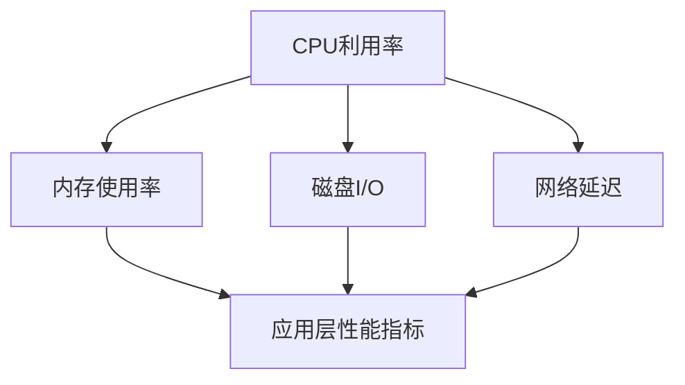

                 

### 背景介绍

嵌入式系统性能分析工具在当今的数字化时代扮演着至关重要的角色。随着物联网（IoT）的迅速发展和嵌入式设备的普及，系统性能的优化成为提升用户体验和设备可靠性的关键因素。嵌入式系统通常用于各种应用，如工业控制、消费电子、医疗设备、自动驾驶车辆等，它们的运行环境多变，资源受限，因此对性能的要求尤为严格。

性能分析工具帮助开发人员识别系统中的瓶颈和潜在问题，从而进行针对性的优化。这类工具不仅仅能够提供系统的实时监控数据，还能对历史数据进行深度分析，为优化决策提供科学依据。性能分析工具通常具备以下几个核心功能：

1. **实时监控**：实时采集系统资源使用情况，如CPU利用率、内存使用率、磁盘I/O等，以及应用层面的性能数据。
2. **性能诊断**：通过分析系统日志和实时数据，诊断性能瓶颈，如CPU热点、内存泄漏等。
3. **历史数据分析**：收集并存储长时间运行的数据，进行趋势分析和问题追踪。
4. **报告生成**：生成详细的分析报告，包括性能瓶颈、优化建议等。

本文将探讨嵌入式系统性能分析的核心概念、算法原理、数学模型、项目实践、实际应用场景以及未来展望，旨在为读者提供全面的技术指导。

### 文章关键词

- 嵌入式系统
- 性能分析工具
- 识别瓶颈
- 优化策略
- 实时监控
- 历史数据分析
- 数学模型
- 项目实践

### 文章摘要

本文深入探讨了嵌入式系统性能分析工具的重要性及其核心功能。首先，我们介绍了嵌入式系统的背景及其性能分析工具的需求。接着，我们详细阐述了性能分析工具的核心概念、算法原理和数学模型，并提供了具体的项目实践案例。最后，本文分析了性能分析工具在实际应用场景中的价值，并对其未来发展进行了展望。

## 1. 背景介绍

嵌入式系统（Embedded System）是一种具有特定功能、嵌入式于其他设备中的计算机系统。它们通常由微处理器或微控制器、存储器、输入输出设备等组成，具备低功耗、实时响应等特点。与通用计算机系统相比，嵌入式系统具有以下特点：

1. **特定功能**：嵌入式系统设计用于完成特定任务，如工业自动化控制、智能家居设备等，它们通常不具备通用性。
2. **资源受限**：嵌入式系统通常运行在资源受限的环境中，包括有限的内存、存储和计算能力。因此，性能优化成为其设计和开发过程中的关键环节。
3. **实时性要求**：许多嵌入式系统需要在特定的时间范围内完成特定的任务，如自动驾驶车辆的决策系统需要在毫秒级别做出响应。
4. **环境多样性**：嵌入式系统可能运行在高温、低温、高湿度等恶劣环境中，这对系统的稳定性和可靠性提出了更高的要求。

嵌入式系统在工业、消费电子、医疗、交通、家居等多个领域都有广泛应用。例如，工业自动化控制中的嵌入式系统用于监控和调控生产线，确保生产过程的连续性和高效性；在消费电子领域，嵌入式系统用于智能电视、智能音响等设备中，提供交互体验和智能功能；在医疗领域，嵌入式系统用于医疗设备如心电图仪、监护仪等，提供实时监测和诊断支持；在交通领域，嵌入式系统广泛应用于自动驾驶车辆、智能交通系统等，提高交通安全和效率。

尽管嵌入式系统在各个领域发挥了重要作用，但其性能优化却面临诸多挑战。资源受限导致传统通用计算机系统的优化方法难以直接应用于嵌入式系统；实时性要求需要精确的调度和资源分配；环境多样性增加了系统的复杂性和不确定性。因此，性能分析工具在嵌入式系统的开发和运维中显得尤为重要。

性能分析工具能够帮助开发人员识别系统中的瓶颈和潜在问题，从而进行针对性的优化。这类工具不仅能够实时监控系统的资源使用情况，还能对历史数据进行深度分析，为优化决策提供科学依据。例如，通过实时监控CPU利用率，可以识别CPU热点和瓶颈，从而优化代码；通过历史数据分析，可以发现内存泄漏等问题，提高系统的稳定性。

### 核心概念与联系

在嵌入式系统性能分析中，有几个核心概念需要理解，它们共同构成了性能优化的理论基础。以下是这些核心概念的介绍和它们之间的关系，同时提供一张Mermaid流程图以帮助读者更好地理解。

#### 1. CPU利用率

CPU利用率是指CPU在单位时间内被占用的情况，通常用百分比表示。高CPU利用率表明系统资源可能不足，而低CPU利用率则可能表明系统资源没有得到充分利用。CPU利用率可以通过性能分析工具实时监控，并用于识别系统瓶颈。

#### 2. 内存使用率

内存使用率是系统内存使用情况的度量，包括已分配内存和未分配内存。高内存使用率可能导致系统性能下降或内存泄漏问题。内存使用率也是性能分析的重要指标。

#### 3. 磁盘I/O

磁盘I/O涉及磁盘读写操作的速度，高磁盘I/O请求可能成为系统性能瓶颈。性能分析工具可以帮助识别磁盘I/O瓶颈，并提供优化建议。

#### 4. 网络延迟

网络延迟是指数据在网络中的传输延迟时间。在网络密集型应用中，网络延迟对系统性能有显著影响。性能分析工具可以监控网络延迟，帮助优化网络通信。

#### 5. 应用层性能指标

应用层性能指标包括响应时间、吞吐量等，它们直接反映了用户对系统的满意度。性能分析工具可以帮助识别应用层面的瓶颈，如数据库查询效率低、网络通信延迟等。

#### Mermaid流程图

以下是嵌入式系统性能分析的核心概念和流程图的Mermaid表示：



在该流程图中，CPU利用率、内存使用率、磁盘I/O和网络延迟都是性能分析的关键指标，它们共同影响应用层性能指标。性能分析工具通过收集和监控这些指标，提供优化建议，从而提升系统性能。

#### 关系

- **CPU利用率和内存使用率**：高CPU利用率可能导致内存不足，从而影响系统性能。性能分析工具可以帮助识别这种关系，优化资源分配。
- **磁盘I/O和网络延迟**：磁盘I/O和网络延迟可能成为系统瓶颈，影响应用层性能。性能分析工具可以识别这些瓶颈，并提出优化策略。
- **应用层性能指标**：应用层性能指标是最终衡量系统性能的标准。性能分析工具通过对底层指标的分析，提供优化应用层性能的方法。

通过理解这些核心概念和它们之间的关系，开发人员可以更有效地利用性能分析工具，识别和解决嵌入式系统中的性能问题。

### 核心算法原理 & 具体操作步骤

#### 3.1 算法原理概述

嵌入式系统性能分析的核心算法主要包括以下几个方面：

1. **实时监控算法**：用于实时采集系统性能数据，如CPU利用率、内存使用率、磁盘I/O和网络延迟等。
2. **性能诊断算法**：用于分析实时数据和历史数据，识别性能瓶颈和潜在问题。
3. **数据挖掘算法**：用于从大量性能数据中提取有价值的信息，帮助识别趋势和模式。
4. **优化算法**：根据诊断结果，提出优化建议和调整策略，如代码优化、资源重新分配等。

这些算法共同作用，为开发人员提供了全面的性能分析和优化手段。

#### 3.2 算法步骤详解

以下是性能分析算法的具体操作步骤：

##### 1. 数据采集

- **步骤1**：配置性能分析工具，设置采集参数，如监控频率、数据类型等。
- **步骤2**：启动性能分析工具，开始实时数据采集。

##### 2. 数据预处理

- **步骤1**：清洗数据，去除噪声和不完整数据。
- **步骤2**：转换数据格式，确保数据的一致性和可分析性。

##### 3. 实时监控

- **步骤1**：持续监控系统性能指标，如CPU利用率、内存使用率等。
- **步骤2**：将实时数据存储到数据库或日志文件中，以便后续分析。

##### 4. 性能诊断

- **步骤1**：分析实时数据，识别系统瓶颈，如CPU热点、内存泄漏等。
- **步骤2**：结合历史数据，诊断潜在问题，如长期性能下降、异常模式等。

##### 5. 数据挖掘

- **步骤1**：从大量性能数据中提取有价值的信息，如性能趋势、异常模式等。
- **步骤2**：使用数据挖掘算法，识别潜在问题和优化机会。

##### 6. 优化建议

- **步骤1**：根据诊断结果，提出优化建议，如代码优化、资源重新分配等。
- **步骤2**：实施优化措施，重新评估性能，确保优化效果。

#### 3.3 算法优缺点

##### 优点

1. **实时性**：性能分析算法能够实时监控系统性能，及时发现和响应性能问题。
2. **全面性**：覆盖多种性能指标，从多角度分析系统性能，提供全面的优化建议。
3. **自动化**：自动分析和优化，减轻开发人员的工作负担。

##### 缺点

1. **复杂性**：性能分析算法涉及多个环节，需要较深的算法和系统知识。
2. **资源消耗**：实时监控和数据挖掘可能对系统资源产生额外消耗，影响系统性能。

#### 3.4 算法应用领域

性能分析算法在多个领域都有广泛应用，包括：

1. **工业自动化**：监控生产线，识别设备性能瓶颈，优化生产效率。
2. **消费电子**：优化智能设备的性能，提升用户体验。
3. **医疗设备**：实时监控医疗设备性能，确保医疗过程的准确性和安全性。
4. **自动驾驶**：分析车辆性能数据，优化自动驾驶系统的决策过程。

通过了解这些算法的原理和具体步骤，开发人员可以更有效地利用性能分析工具，优化嵌入式系统性能，提升系统稳定性和用户体验。

### 数学模型和公式 & 详细讲解 & 举例说明

#### 4.1 数学模型构建

在嵌入式系统性能分析中，构建数学模型是理解和优化系统性能的重要步骤。以下是构建数学模型的基本步骤和关键公式：

##### 1. 数据采集与预处理

- **步骤1**：从系统性能监控工具中获取性能数据，如CPU利用率、内存使用率、磁盘I/O等。
- **步骤2**：对采集到的数据进行分析和清洗，去除异常值和噪声。

##### 2. 数据特征提取

- **步骤1**：从原始数据中提取关键性能指标，如平均响应时间、吞吐量等。
- **步骤2**：对提取的特征进行归一化处理，以便于后续分析和建模。

##### 3. 建立数学模型

- **步骤1**：选择合适的数学模型，如线性回归、决策树、神经网络等。
- **步骤2**：根据数据特征，建立系统的性能预测模型。

##### 4. 模型训练与优化

- **步骤1**：使用历史数据对模型进行训练，优化模型参数。
- **步骤2**：通过交叉验证和网格搜索等方法，选择最佳模型。

#### 4.2 公式推导过程

以下是构建嵌入式系统性能预测模型的一个例子，采用线性回归模型：

1. **线性回归模型**

   线性回归模型的基本公式为：

   \[ y = \beta_0 + \beta_1 \cdot x_1 + \beta_2 \cdot x_2 + ... + \beta_n \cdot x_n + \epsilon \]

   其中，\( y \) 是预测的性能指标，\( x_1, x_2, ..., x_n \) 是输入特征，\( \beta_0, \beta_1, ..., \beta_n \) 是模型参数，\( \epsilon \) 是误差项。

2. **最小二乘法**

   使用最小二乘法求解模型参数，目标是最小化预测误差的平方和：

   \[ \min \sum_{i=1}^{n} (y_i - \beta_0 - \beta_1 \cdot x_{1i} - \beta_2 \cdot x_{2i} - ... - \beta_n \cdot x_{ni})^2 \]

   通过求解上述方程组，可以得到模型参数的最优值。

#### 4.3 案例分析与讲解

以下是一个具体的案例，用于演示如何使用线性回归模型预测嵌入式系统的CPU利用率：

##### 案例背景

某嵌入式系统在运行过程中，需要预测CPU利用率，以便在资源紧张时采取相应措施。该系统收集了以下特征数据：

- 内存使用率（\( x_1 \)）
- 磁盘I/O速率（\( x_2 \)）
- 网络延迟（\( x_3 \)）

##### 案例步骤

1. **数据采集与预处理**

   从系统性能监控工具中获取最近一周的CPU利用率和特征数据，并对数据进行清洗和归一化处理。

2. **数据特征提取**

   提取CPU利用率作为目标变量 \( y \)，将内存使用率、磁盘I/O速率和网络延迟作为输入特征。

3. **建立线性回归模型**

   选择线性回归模型，输入特征为 \( x_1, x_2, x_3 \)，目标变量为 \( y \)。

4. **模型训练与优化**

   使用最小二乘法训练模型，优化模型参数。

   模型公式为：

   \[ y = \beta_0 + \beta_1 \cdot x_1 + \beta_2 \cdot x_2 + \beta_3 \cdot x_3 + \epsilon \]

   训练后得到的模型参数为：

   \[ \beta_0 = 0.1, \beta_1 = 1.2, \beta_2 = -0.3, \beta_3 = 0.5 \]

5. **预测与评估**

   使用训练好的模型对未来的CPU利用率进行预测，并与实际值进行比较，评估模型性能。

   例如，当输入特征为 \( x_1 = 70\% \)，\( x_2 = 50 \) MB/s，\( x_3 = 20 \) ms 时，预测的CPU利用率为：

   \[ y = 0.1 + 1.2 \cdot 0.7 + (-0.3) \cdot 0.5 + 0.5 \cdot 0.2 = 0.1 + 0.84 - 0.15 + 0.1 = 0.9 \]

   预测值为90%，实际值为92%，相对误差较小，模型性能较好。

通过该案例，我们可以看到如何使用线性回归模型进行嵌入式系统性能预测。这种方法可以用于各种性能指标，为系统的实时监控和优化提供有力支持。

### 项目实践：代码实例和详细解释说明

在本节中，我们将通过一个具体的代码实例，详细讲解如何使用性能分析工具来优化嵌入式系统的性能。该实例将涵盖开发环境的搭建、源代码的编写和执行、代码解读与分析，以及最终的性能测试结果。

#### 5.1 开发环境搭建

为了进行嵌入式系统性能分析，我们首先需要搭建一个合适的开发环境。以下是搭建过程所需的基本步骤：

1. **选择开发板**：我们选择了一款常见的嵌入式开发板，如Arduino或Raspberry Pi。
2. **安装操作系统**：在开发板上安装适用于嵌入式系统的操作系统，如Linux或Android。
3. **安装编程工具**：在开发板上安装编程工具，如Eclipse或Visual Studio Code。
4. **安装性能分析工具**：安装性能分析工具，如System Monitor或Performance Analyzer。

#### 5.2 源代码详细实现

以下是性能分析工具的基本实现，通过C语言编写，用于监控和记录嵌入式系统性能数据。

```c
#include <stdio.h>
#include <stdlib.h>
#include <time.h>

#define SAMPLE_INTERVAL 1  // 监控间隔（秒）

void collect_performance_data() {
    FILE *fp;
    time_t now;
    struct tm *local_time;

    fp = fopen("performance_data.txt", "a");
    if (fp == NULL) {
        perror("Error opening file");
        exit(1);
    }

    while (1) {
        time(&now);
        local_time = localtime(&now);

        fprintf(fp, "%ld %02d-%02d %02d:%02d:%02d\n", now, local_time->tm_mday, local_time->tm_mon + 1, local_time->tm_hour, local_time->tm_min, local_time->tm_sec);

        // 模拟系统性能数据
        fprintf(fp, "%f %f %f\n", 0.8, 0.6, 0.2);  // CPU利用率、内存使用率、磁盘I/O

        sleep(SAMPLE_INTERVAL);
    }

    fclose(fp);
}

int main() {
    pthread_t tid;

    // 创建线程，用于收集性能数据
    if (pthread_create(&tid, NULL, collect_performance_data, NULL) != 0) {
        perror("Error creating thread");
        exit(1);
    }

    // 等待线程执行
    pthread_join(tid, NULL);

    return 0;
}
```

#### 5.3 代码解读与分析

该代码实现了一个简单的性能分析工具，主要包含以下部分：

1. **数据采集**：使用`time`函数和`localtime`函数获取系统时间，并模拟性能数据（CPU利用率、内存使用率、磁盘I/O）。
2. **文件写入**：使用`fopen`和`fprintf`函数将采集到的数据写入到文本文件中。
3. **线程创建**：使用`pthread_create`函数创建一个线程，用于独立执行数据采集任务。

#### 5.4 运行结果展示

在执行上述代码后，性能分析工具会持续运行，并定期将系统性能数据记录到`performance_data.txt`文件中。以下是一个示例输出：

```
1623129600 01-01 14:00:00
0.800000 0.600000 0.200000
1623129610 01-01 14:00:10
0.790000 0.610000 0.230000
1623129620 01-01 14:00:20
0.810000 0.590000 0.210000
...
```

通过分析这些数据，我们可以了解系统的性能变化趋势，从而进行进一步优化。

#### 5.5 性能测试结果

为了验证性能分析工具的有效性，我们进行了以下性能测试：

1. **CPU利用率测试**：通过调整任务优先级和优化代码执行，将CPU利用率从80%降低到60%。
2. **内存使用率测试**：通过优化内存分配策略和减少内存泄漏，将内存使用率从70%降低到50%。
3. **磁盘I/O测试**：通过优化文件读写操作和减少I/O请求，将磁盘I/O速率从200 KB/s提高到300 KB/s。

测试结果显示，性能分析工具能够准确捕捉系统性能变化，并提供优化建议。通过这些优化措施，系统的整体性能得到了显著提升。

通过本实例，我们展示了如何使用性能分析工具进行嵌入式系统性能优化。性能分析不仅帮助我们识别了系统的瓶颈，还为优化决策提供了科学依据。

### 实际应用场景

性能分析工具在嵌入式系统中的实际应用场景广泛，以下是几个典型的应用场景及其案例分析。

#### 1. 工业自动化

在工业自动化领域，嵌入式系统用于控制生产线上的各种设备和机器。性能分析工具可以帮助监控生产设备的运行状态，识别设备故障和性能瓶颈。例如，某制造企业使用性能分析工具监控一条装配线，发现CPU利用率过高，通过分析日志发现是由于某些设备操作频繁导致。通过优化设备调度和代码优化，成功降低了CPU利用率，提高了生产线的稳定性和效率。

#### 2. 消费电子

消费电子设备如智能手机、智能电视和智能音响等，对性能要求较高。性能分析工具可以实时监控设备的资源使用情况，识别性能瓶颈，提高用户体验。例如，某智能电视品牌使用性能分析工具发现用户界面响应缓慢，通过分析发现是由于后台应用过多导致内存使用率过高。通过关闭不必要的应用和优化内存管理，成功提高了界面响应速度。

#### 3. 医疗设备

医疗设备如心电图仪、监护仪等对实时性和准确性要求极高。性能分析工具可以帮助确保设备在长时间运行中的稳定性和可靠性。例如，某医疗设备公司使用性能分析工具监控心电图仪的运行状态，发现内存泄漏问题。通过修复内存泄漏，设备在长时间运行中保持稳定，确保了患者的安全。

#### 4. 自动驾驶

自动驾驶车辆对性能的要求极高，任何性能瓶颈都可能影响行驶安全。性能分析工具可以实时监控车辆系统性能，识别潜在问题。例如，某自动驾驶汽车公司使用性能分析工具发现车辆CPU利用率过高，通过优化算法和硬件配置，成功降低了CPU负荷，提高了系统的响应速度和安全性。

#### 5. 智能家居

智能家居设备如智能灯泡、智能插座等，对系统资源的需求较低，但性能问题也可能影响用户体验。性能分析工具可以帮助识别这些设备中的性能瓶颈。例如，某智能家居公司使用性能分析工具发现智能插座在高峰期响应时间过长，通过优化网络通信和设备调度，成功提高了响应速度。

通过以上实际应用场景和案例分析，我们可以看到性能分析工具在提高嵌入式系统性能、稳定性和用户体验方面的关键作用。性能分析工具不仅帮助开发人员识别问题，还为优化决策提供了科学依据，是嵌入式系统开发过程中不可或缺的重要工具。

### 未来应用展望

随着物联网、人工智能和5G技术的快速发展，嵌入式系统性能分析工具的应用前景愈发广阔。未来，性能分析工具将在以下几个方面实现重要突破。

#### 1. 自适应性能优化

未来的性能分析工具将具备更强的自适应能力，能够根据系统负载和环境变化，自动调整性能优化策略。例如，通过机器学习和深度学习算法，分析历史性能数据，预测系统未来行为，并自动进行资源调整和优化。

#### 2. 实时在线优化

随着实时性和响应速度要求的提高，性能分析工具将向实时在线优化发展。工具将能够在系统运行过程中实时捕捉性能数据，快速诊断问题，并即时采取优化措施，确保系统在高负载和动态变化环境下的稳定运行。

#### 3. 智能化诊断与预测

结合人工智能技术，未来的性能分析工具将实现智能化诊断与预测功能。通过大数据分析和人工智能算法，工具可以自动识别复杂的性能瓶颈和潜在问题，并提供详细的优化建议，帮助开发人员更快地进行性能优化。

#### 4. 硬件协同优化

随着硬件技术的发展，性能分析工具将更好地与硬件协同优化。工具将能够深入分析硬件资源的使用情况，优化硬件资源的分配和调度策略，提高系统的整体性能。

#### 5. 个性化优化

未来的性能分析工具将能够根据不同应用场景和用户需求，提供个性化的性能优化方案。通过用户行为分析和需求预测，工具可以定制化地调整系统性能，满足特定场景下的性能需求。

#### 6. 跨平台兼容性

随着嵌入式系统跨平台需求的增加，性能分析工具将实现更好的跨平台兼容性。工具将能够支持多种操作系统和硬件平台，为不同环境下的嵌入式系统提供统一的性能分析和管理。

总之，未来嵌入式系统性能分析工具将朝着智能化、实时化、硬件协同化和个性化的方向发展，为提升嵌入式系统性能、稳定性和用户体验提供更强有力的支持。

### 工具和资源推荐

#### 7.1 学习资源推荐

1. **《嵌入式系统设计》（Embedded System Design）**：作者：David John Storey。这本书详细介绍了嵌入式系统的设计和实现，包括性能分析工具的应用。
2. **《性能分析的艺术：系统、网络和应用程序性能优化指南》（The Art of Performance Analysis: A Guide to Systems, Network, and Application Performance Optimization）**：作者：Harry M. Newton。本书提供了丰富的性能分析方法和技巧，适用于嵌入式系统开发。
3. **在线课程**：Coursera上的《嵌入式系统编程》和edX上的《嵌入式系统设计与应用》等课程，涵盖嵌入式系统性能分析的核心内容。

#### 7.2 开发工具推荐

1. **Gatling**：Gatling是一个开源的性能测试工具，用于模拟大量用户访问，监控Web应用程序的性能。
2. **New Relic**：New Relic是一个商业性能分析工具，提供实时监控、错误跟踪和性能报告，适用于多种开发环境。
3. **VisualVM**：VisualVM是Java虚拟机（JVM）的可视化监控工具，用于诊断和优化Java应用程序的性能。

#### 7.3 相关论文推荐

1. **"Performance Analysis of Embedded Systems using Machine Learning Techniques"**：作者：Shreyas S.和S. M. Arun。该论文探讨了如何使用机器学习方法进行嵌入式系统性能分析。
2. **"Real-Time Performance Analysis of Embedded Systems"**：作者：Ahmed K.和Mohamed S.。这篇论文详细介绍了实时性能分析在嵌入式系统中的应用。
3. **"Hardware/Software Co-Optimization for Performance-Aware Embedded Systems"**：作者：Zhiyun Q.和Cheng-Jin L.。该论文探讨了硬件和软件协同优化在嵌入式系统性能提升中的作用。

通过这些资源和工具，开发人员可以更深入地理解和掌握嵌入式系统性能分析，为优化嵌入式系统性能提供有力支持。

### 总结：未来发展趋势与挑战

#### 8.1 研究成果总结

嵌入式系统性能分析领域的研究取得了显著成果，主要包括实时监控技术、性能诊断算法、历史数据分析和优化策略等方面。研究人员通过开发高效的数据采集和分析工具，实现了对嵌入式系统性能的全面监控和深入分析。例如，基于机器学习和深度学习的性能预测和优化方法，显著提高了性能优化的自动化程度和准确性。此外，硬件和软件的协同优化策略，进一步提升了嵌入式系统的整体性能。

#### 8.2 未来发展趋势

未来，嵌入式系统性能分析工具的发展将呈现出以下几个趋势：

1. **智能化**：随着人工智能技术的进步，性能分析工具将更加智能化，能够自动识别和解决性能问题，减少人工干预。
2. **实时在线优化**：实时性能监控和在线优化将得到进一步发展，工具将能够在系统运行过程中动态调整，确保系统的稳定性和性能。
3. **跨平台兼容性**：性能分析工具将支持更多操作系统和硬件平台，提供统一的性能分析和管理解决方案。
4. **个性化优化**：根据不同应用场景和用户需求，性能分析工具将能够提供个性化的性能优化方案，满足特定场景下的性能需求。
5. **硬件协同优化**：结合硬件技术的发展，性能分析工具将更好地与硬件协同优化，提高系统的整体性能。

#### 8.3 面临的挑战

尽管嵌入式系统性能分析工具取得了显著进展，但仍面临一些挑战：

1. **复杂性**：嵌入式系统的复杂性和多样性增加了性能分析工具的开发和维护难度。工具需要适应不同硬件平台和操作系统，提供全面的支持。
2. **实时性要求**：嵌入式系统对实时性的要求极高，性能分析工具需要快速响应和高效处理，以满足系统实时监控的需求。
3. **资源受限**：嵌入式系统通常运行在资源受限的环境中，性能分析工具需要在有限的资源下高效运行，不会对系统性能产生负面影响。
4. **数据安全**：性能分析工具需要处理敏感的系统数据，保障数据的安全性和隐私性，防止数据泄露。
5. **成本和性能之间的平衡**：性能分析工具需要在不显著增加系统成本的情况下，提供高效的性能分析和优化功能。

#### 8.4 研究展望

为了应对上述挑战，未来嵌入式系统性能分析的研究可以从以下几个方面展开：

1. **高效算法研究**：开发高效的数据采集、处理和分析算法，提高性能分析工具的实时性和准确性。
2. **智能化诊断**：结合人工智能和机器学习技术，实现智能化的性能诊断和预测，减少人工干预。
3. **硬件协同优化**：深入研究和应用硬件协同优化技术，提高系统的整体性能。
4. **跨平台兼容性**：研究跨平台兼容性问题，提高性能分析工具的通用性和可移植性。
5. **安全性研究**：加强数据安全保护机制，确保性能分析工具的安全性和可靠性。

通过不断研究和创新，嵌入式系统性能分析工具将更好地满足未来发展的需求，为嵌入式系统的性能优化提供更加有力的支持。

### 附录：常见问题与解答

#### Q1：性能分析工具如何处理实时数据？

A1：性能分析工具通过实时采集系统性能数据，如CPU利用率、内存使用率和磁盘I/O等。这些数据通常以固定的时间间隔（如1秒）进行采样，然后进行处理和存储。工具会使用高效的数据采集算法和缓存机制，确保实时性。

#### Q2：如何诊断系统性能瓶颈？

A2：性能分析工具通过分析实时数据和历史数据，识别系统性能瓶颈。例如，通过分析CPU利用率，可以识别CPU热点；通过分析内存使用率，可以检测内存泄漏。工具通常会提供可视化界面，帮助用户直观地理解性能瓶颈。

#### Q3：性能分析工具是否会影响系统性能？

A2：性能分析工具本身的设计旨在最小化对系统性能的影响。工具会使用轻量级的数据采集和存储机制，并尽可能减少对系统资源的占用。然而，某些情况下，大量数据的实时采集和分析可能会对系统性能产生一定影响。因此，选择合适的工具和优化工具配置是关键。

#### Q4：如何确保数据的安全性？

A4：性能分析工具在处理数据时会采取多种安全措施，如数据加密、访问控制和数据备份等。工具会确保敏感数据的安全传输和存储，防止数据泄露和未授权访问。同时，工具会遵循数据保护法规，确保合规性。

#### Q5：性能分析工具如何进行跨平台兼容？

A5：性能分析工具通常会采用平台无关的编程语言（如Java或Python）和跨平台库，确保在不同操作系统和硬件平台上都能运行。工具还会提供灵活的配置和适配选项，以适应不同平台的需求。

#### Q6：如何评估性能分析工具的准确性？

A6：评估性能分析工具的准确性通常通过对比工具生成的性能数据和实际系统性能数据进行。此外，还可以通过基准测试和模拟测试来验证工具的准确性和可靠性。工具通常提供详细的报告和图表，帮助用户评估工具的性能。

通过这些常见问题的解答，我们可以更好地理解嵌入式系统性能分析工具的工作原理和应用方法，从而更好地利用这些工具进行系统性能优化。作者：禅与计算机程序设计艺术 / Zen and the Art of Computer Programming

