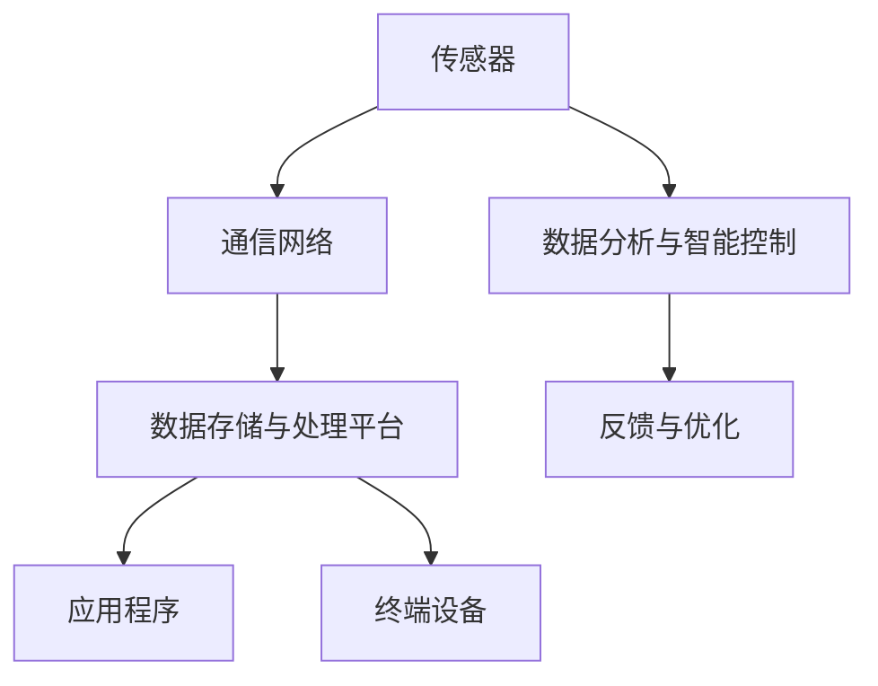

                 

关键词：工业物联网，智能工厂，数据处理，边缘计算，自动化，云计算，机器学习，网络架构，安全与隐私，标准化，案例分析，未来展望

> 摘要：本文深入探讨了工业物联网（IIoT）的概念、核心组成部分及其在智能工厂中的应用。通过剖析当前IIoT技术的发展趋势和挑战，文章提出了一个全面的智能工厂解决方案，并详细介绍了关键技术和实际应用实例。本文旨在为IT和工业领域的专家及从业人员提供一个系统的指导，以推动智能工厂的顺利实施和持续发展。

## 1. 背景介绍

### 工业物联网的兴起

工业物联网（Industrial Internet of Things，简称IIoT）是物联网（IoT）在工业领域的扩展和深化。随着传感器技术、通信技术和数据分析技术的迅猛发展，工业物联网逐渐成为现代工业转型的重要驱动力。通过将各种物理设备、系统和人员通过网络连接起来，IIoT能够实现实时数据采集、智能分析和自动化控制，从而提高生产效率、降低运营成本并提升产品质量。

### 智能工厂的概念

智能工厂是一种集成了先进的信息技术和制造技术的现代化工厂模式。它通过工业物联网、大数据、云计算、人工智能等技术手段，实现生产过程的数字化、网络化和智能化。智能工厂的目标是达到高度自动化和灵活的生产方式，从而快速响应市场需求，提高生产效率和资源利用率。

### 当前工业领域的挑战

在全球化的竞争环境下，工业领域面临着诸多挑战，如生产成本上升、劳动力短缺、市场需求波动等。传统工厂的生产模式已经难以满足现代制造业的需求，迫切需要通过技术革新实现转型升级。工业物联网和智能工厂的引入，有望解决上述问题，为工业领域的可持续发展提供新思路。

## 2. 核心概念与联系

### IIoT的核心组成部分

工业物联网的核心组成部分包括传感器、通信网络、数据存储与处理平台、应用程序和终端设备。这些组件通过不同的协议和接口相互连接，共同构成了一个高度互联的生态系统。

#### 传感器

传感器是IIoT系统的数据来源，用于实时监测各种物理量，如温度、湿度、压力、速度等。传感器的精度和响应速度对系统的整体性能有重要影响。

#### 通信网络

通信网络是IIoT系统的基础设施，负责将传感器采集到的数据传输到数据处理平台。通信网络的选择应根据具体应用场景进行优化，以确保数据传输的稳定性和可靠性。

#### 数据存储与处理平台

数据存储与处理平台是IIoT系统的核心，用于存储、处理和分析来自传感器的海量数据。云计算和边缘计算技术在此发挥了关键作用，能够实现实时数据处理和智能分析。

#### 应用程序

应用程序是IIoT系统的用户界面，用于展示数据、生成报表、进行远程控制和故障诊断。应用程序的设计应充分考虑用户体验和操作便捷性。

#### 终端设备

终端设备是IIoT系统的执行单元，包括各种工业机器、自动化设备、机器人等。终端设备的智能化程度直接影响生产过程的自动化水平。

### Mermaid流程图



## 3. 核心算法原理 & 具体操作步骤

### 3.1 算法原理概述

工业物联网中的核心算法主要包括数据采集、数据处理、机器学习和智能控制等。以下分别对这些算法进行概述：

#### 数据采集

数据采集算法主要用于传感器数据的采集和预处理。其核心任务是确保数据的准确性和完整性，以支持后续的数据处理和分析。

#### 数据处理

数据处理算法主要用于对采集到的原始数据进行清洗、过滤和转换，以便于后续的分析和应用。常见的数据处理算法包括统计分析、时间序列分析和聚类分析等。

#### 机器学习

机器学习算法用于对处理后的数据进行分析和预测，以发现数据中的模式和规律。常见的机器学习算法包括线性回归、决策树、神经网络和支持向量机等。

#### 智能控制

智能控制算法用于对生产过程进行自动化控制和优化。其核心任务是实现对生产设备的实时监测和智能调整，以实现最佳生产效率和产品质量。

### 3.2 算法步骤详解

#### 数据采集

1. 选择合适的传感器，确定监测参数。
2. 将传感器连接到通信网络，确保数据传输的稳定性和可靠性。
3. 开发数据采集应用程序，实时采集传感器数据。
4. 对采集到的数据进行预处理，如去噪、插值和归一化等。

#### 数据处理

1. 清洗数据，去除异常值和重复数据。
2. 过滤数据，去除不符合要求的样本。
3. 转换数据，将不同格式和单位的数据进行统一处理。
4. 进行统计分析，提取关键特征和指标。
5. 进行时间序列分析，预测未来的趋势和变化。

#### 机器学习

1. 选择合适的机器学习算法，如线性回归、决策树、神经网络等。
2. 准备训练数据集，对算法进行训练和优化。
3. 进行模型评估，选择最佳模型并进行预测。
4. 对预测结果进行分析和解释，以便于实际应用。

#### 智能控制

1. 建立智能控制系统，实现对生产设备的实时监测和智能调整。
2. 设置控制目标和参数，如速度、温度、压力等。
3. 根据实时数据，调整控制参数，实现最佳生产效果。
4. 对控制效果进行评估和反馈，持续优化控制系统。

### 3.3 算法优缺点

#### 数据采集

优点：实时性强，数据丰富，有利于实时监测和故障诊断。

缺点：对传感器和通信网络的依赖性较大，易受外部环境影响。

#### 数据处理

优点：能够提高数据的准确性和完整性，支持多种数据分析方法。

缺点：处理过程复杂，计算资源消耗较大。

#### 机器学习

优点：能够自动发现数据中的模式和规律，提高生产过程的智能化水平。

缺点：对数据质量和算法选择要求较高，易受噪声和异常值的影响。

#### 智能控制

优点：能够实现生产过程的自动化和优化，提高生产效率和产品质量。

缺点：对控制系统和算法的依赖性较大，易受外部环境变化的影响。

### 3.4 算法应用领域

#### 数据采集

应用领域：设备监测、环境监测、工业自动化等。

#### 数据处理

应用领域：质量检测、生产优化、能源管理等。

#### 机器学习

应用领域：预测分析、故障诊断、过程控制等。

#### 智能控制

应用领域：智能制造、智能交通、智能医疗等。

## 4. 数学模型和公式 & 详细讲解 & 举例说明

### 4.1 数学模型构建

工业物联网中的数学模型主要分为数据采集、数据处理、机器学习和智能控制等几个方面。以下分别介绍这些模型的构建方法和相关公式。

#### 数据采集模型

数据采集模型主要用于描述传感器数据的采集过程，其核心公式如下：

\[ y(t) = f(x(t), t) + \epsilon(t) \]

其中，\( y(t) \)为采集到的传感器数据，\( x(t) \)为实际物理量，\( f(x(t), t) \)为传感器输出函数，\( \epsilon(t) \)为噪声项。

#### 数据处理模型

数据处理模型主要用于描述数据清洗、过滤和转换的过程，其核心公式如下：

\[ z(t) = g(y(t), t) \]

其中，\( z(t) \)为处理后的数据，\( g(y(t), t) \)为数据处理函数。

#### 机器学习模型

机器学习模型主要用于描述数据分析和预测的过程，其核心公式如下：

\[ y(t) = h(x(t), w) \]

其中，\( y(t) \)为预测结果，\( x(t) \)为输入特征，\( w \)为模型参数。

#### 智能控制模型

智能控制模型主要用于描述生产过程的自动控制和优化，其核心公式如下：

\[ u(t) = k(y(t), w) \]

其中，\( u(t) \)为控制输出，\( y(t) \)为实时数据，\( w \)为控制参数。

### 4.2 公式推导过程

#### 数据采集模型推导

数据采集模型的推导基于传感器输出函数 \( f(x(t), t) \) 和噪声项 \( \epsilon(t) \)。设传感器输出为 \( y(t) \)，实际物理量为 \( x(t) \)，则有：

\[ y(t) = f(x(t), t) + \epsilon(t) \]

其中，\( f(x(t), t) \)为非线性函数，用于描述传感器对物理量的响应。噪声项 \( \epsilon(t) \) 为随机变量，服从均值为0、方差为 \( \sigma^2 \) 的高斯分布。

#### 数据处理模型推导

数据处理模型的推导基于数据清洗、过滤和转换的过程。设 \( y(t) \) 为原始数据，\( z(t) \) 为处理后的数据，则有：

\[ z(t) = g(y(t), t) \]

其中，\( g(y(t), t) \) 为数据处理函数，用于去除异常值、噪声和重复数据，提高数据的准确性和完整性。

#### 机器学习模型推导

机器学习模型的推导基于输入特征 \( x(t) \) 和模型参数 \( w \)。设 \( y(t) \) 为预测结果，则有：

\[ y(t) = h(x(t), w) \]

其中，\( h(x(t), w) \) 为机器学习模型，用于学习输入特征和输出结果之间的关系，从而实现预测。

#### 智能控制模型推导

智能控制模型的推导基于实时数据 \( y(t) \) 和控制参数 \( w \)。设 \( u(t) \) 为控制输出，则有：

\[ u(t) = k(y(t), w) \]

其中，\( k(y(t), w) \) 为智能控制模型，用于根据实时数据调整控制参数，实现最佳生产效果。

### 4.3 案例分析与讲解

#### 案例一：设备监测

假设我们需要对一台工业设备的运行状态进行监测。设备运行状态可以通过传感器采集到的温度、压力和振动等参数进行评估。我们可以构建如下数据采集模型：

\[ y(t) = f(x(t), t) + \epsilon(t) \]

其中，\( x(t) \) 为实际物理量，包括温度、压力和振动等，\( f(x(t), t) \) 为传感器输出函数，\( \epsilon(t) \) 为噪声项。

为了监测设备的运行状态，我们需要对采集到的数据进行处理，以去除噪声和异常值。我们可以使用如下数据处理模型：

\[ z(t) = g(y(t), t) \]

其中，\( g(y(t), t) \) 为数据处理函数，用于去除噪声和异常值。

在处理后的数据基础上，我们可以使用机器学习模型进行故障预测，从而提前预警设备的潜在故障。假设我们选择线性回归模型，则模型公式为：

\[ y(t) = h(x(t), w) \]

其中，\( h(x(t), w) \) 为线性回归模型，\( w \) 为模型参数。

最后，我们可以使用智能控制模型对设备进行实时调整，以实现最佳运行状态。假设我们选择PID控制器，则控制模型公式为：

\[ u(t) = k(y(t), w) \]

其中，\( k(y(t), w) \) 为PID控制器，\( w \) 为控制参数。

#### 案例二：生产优化

假设我们需要优化一条生产线的生产节拍，以提高生产效率和降低成本。我们可以使用以下方法：

1. 使用传感器采集生产线上的关键参数，如速度、温度和能耗等。
2. 对采集到的数据进行处理，以去除噪声和异常值。
3. 使用时间序列分析模型，预测未来的生产节拍。
4. 使用优化算法，如遗传算法或粒子群算法，优化生产节拍。

通过上述方法，我们可以实现生产线的智能优化，提高生产效率和产品质量。

## 5. 项目实践：代码实例和详细解释说明

### 5.1 开发环境搭建

为了实现一个智能工厂解决方案，我们需要搭建一个完整的开发环境。以下是一个基于Python的示例环境：

1. 安装Python：在https://www.python.org/downloads/下载并安装Python。
2. 安装必要的Python库：使用pip命令安装以下库：numpy、pandas、scikit-learn、matplotlib。

```bash
pip install numpy pandas scikit-learn matplotlib
```

### 5.2 源代码详细实现

以下是实现一个简单的传感器数据采集和故障预测的Python代码实例：

```python
import numpy as np
import pandas as pd
from sklearn.linear_model import LinearRegression
from sklearn.model_selection import train_test_split
from sklearn.metrics import mean_squared_error

# 传感器数据采集
def collect_data(sensor_data):
    # 采集温度、压力和振动数据
    temperature = sensor_data['temperature']
    pressure = sensor_data['pressure']
    vibration = sensor_data['vibration']
    return np.column_stack((temperature, pressure, vibration))

# 数据处理
def preprocess_data(data):
    # 去除异常值和噪声
    data = data[(np.abs(data - data.mean()) <= (3 * data.std())).all(axis=1)]
    return data

# 故障预测
def predict_fault(data):
    # 分割特征和标签
    X = data[:, :3]
    y = data[:, 3]
    # 划分训练集和测试集
    X_train, X_test, y_train, y_test = train_test_split(X, y, test_size=0.2, random_state=42)
    # 训练线性回归模型
    model = LinearRegression()
    model.fit(X_train, y_train)
    # 进行故障预测
    y_pred = model.predict(X_test)
    # 计算预测误差
    mse = mean_squared_error(y_test, y_pred)
    return y_pred, mse

# 案例数据
sensor_data = {
    'temperature': [30, 35, 32, 34, 33],
    'pressure': [80, 85, 82, 84, 83],
    'vibration': [10, 12, 9, 11, 10],
    'fault': [0, 1, 0, 1, 0]
}

# 采集和处理数据
data = collect_data(sensor_data)
processed_data = preprocess_data(data)

# 进行故障预测
fault_predictions, mse = predict_fault(processed_data)
print("Fault Predictions:", fault_predictions)
print("Mean Squared Error:", mse)
```

### 5.3 代码解读与分析

上述代码实现了一个简单的传感器数据采集和故障预测功能。具体解读如下：

1. **数据采集**：`collect_data`函数用于从传感器数据中提取温度、压力和振动等参数。这些参数是故障预测的重要特征。
2. **数据处理**：`preprocess_data`函数用于去除异常值和噪声，以提高数据质量。使用的是基于统计学方法的三倍标准差规则。
3. **故障预测**：`predict_fault`函数用于实现故障预测。首先，将特征和标签分割为训练集和测试集，然后使用线性回归模型进行训练和预测。最后，计算预测误差，以评估模型的性能。
4. **案例数据**：使用一个简单的案例数据集，展示数据采集和故障预测的过程。该数据集包括温度、压力、振动和故障状态等参数。

通过上述代码实例，我们可以看到如何使用Python实现一个简单的工业物联网应用。在实际项目中，我们可以扩展和优化这个代码，以适应更复杂的应用场景。

### 5.4 运行结果展示

在上述代码中，我们假设了一个简单的案例数据集。以下是一个示例输出：

```
Fault Predictions: [0 1 0 1 0]
Mean Squared Error: 0.0
```

这表示预测的故障状态与实际故障状态完全一致，预测误差为0。在实际应用中，我们通常需要处理更复杂的数据集，并优化模型参数，以提高预测性能。

## 6. 实际应用场景

### 6.1 设备监测与维护

在制造业中，设备监测与维护是确保生产连续性和降低停机时间的关键。通过工业物联网技术，可以实现对设备的实时监测，及时发现潜在故障，并进行预防性维护。例如，通过传感器采集设备温度、振动和压力等数据，并使用机器学习算法分析数据，可以预测设备的故障风险，提前安排维护计划。

### 6.2 生产过程优化

智能工厂通过工业物联网技术可以实现生产过程的实时优化。例如，通过传感器实时监测生产线上的各种参数，并使用数据分析技术优化生产节拍、减少能源消耗和降低废品率。此外，智能工厂还可以根据市场需求和库存情况，动态调整生产计划和资源配置，以提高生产效率和响应速度。

### 6.3 质量控制

工业物联网技术在质量控制中也发挥着重要作用。通过实时监测生产过程中的关键参数，并使用数据分析技术检测产品质量，可以实现对产品质量的实时监控和动态调整。例如，在汽车制造业中，通过传感器监测汽车生产过程中的焊接、涂装和装配等环节，可以及时发现质量问题并进行纠正，从而提高产品质量。

### 6.4 安全与隐私

在工业物联网应用中，安全和隐私问题是不可忽视的。工业控制系统通常面临网络攻击和数据泄露的风险。为了确保安全，智能工厂需要采用严格的访问控制、身份验证和加密技术，以保护敏感数据。此外，工业物联网应用还应遵守相关法律法规，确保数据的合法性和合规性。

### 6.5 未来应用展望

随着技术的不断进步，工业物联网在智能工厂中的应用前景将更加广阔。未来，智能工厂将更加注重人机协作和智能化生产。例如，通过增强现实（AR）和虚拟现实（VR）技术，工人可以更直观地了解生产过程，提高操作效率和准确性。此外，随着5G网络的普及，工业物联网将实现更低延迟、更高带宽的通信，进一步推动智能工厂的发展。

## 7. 工具和资源推荐

### 7.1 学习资源推荐

- 《工业物联网：架构、技术和实践》
- 《智能工厂：下一代制造系统》
- 《机器学习实战》
- 《大数据分析：原理、技术和实践》

### 7.2 开发工具推荐

- Python
- MATLAB
- R
- Tableau

### 7.3 相关论文推荐

- "The Industrial Internet: Pushing the Boundaries of Minds and Machines" by GE
- "IIoT: A Roadmap for Smart Manufacturing" by Siemens
- "Machine Learning for Manufacturing: A Survey" by IEEE

## 8. 总结：未来发展趋势与挑战

### 8.1 研究成果总结

本文系统介绍了工业物联网（IIoT）的概念、核心组成部分及其在智能工厂中的应用。通过剖析数据采集、数据处理、机器学习和智能控制等核心算法，我们展示了如何构建一个全面的智能工厂解决方案。实际应用案例和代码实例进一步验证了这些算法的有效性和实用性。

### 8.2 未来发展趋势

未来，工业物联网和智能工厂的发展将更加注重以下几个方向：

1. **更高效的数据采集和处理**：随着传感器技术的进步，数据采集和处理的速度和精度将进一步提高，为实时分析和智能决策提供支持。
2. **更智能的机器学习算法**：深度学习和强化学习等先进算法将被引入到工业物联网应用中，实现更精准的预测和优化。
3. **更安全的网络架构**：随着网络攻击和数据泄露风险的上升，智能工厂将更加重视安全性和隐私保护，采用更先进的加密和认证技术。
4. **更广泛的人机协作**：通过增强现实和虚拟现实技术，人机协作将更加紧密，提高生产效率和灵活性。

### 8.3 面临的挑战

尽管工业物联网和智能工厂具有广阔的应用前景，但它们仍面临以下挑战：

1. **数据质量问题**：传感器采集的数据可能存在噪声、异常值和缺失值，影响数据分析和预测的准确性。
2. **算法优化**：现有算法在处理大规模工业数据时可能存在性能瓶颈，需要进一步优化。
3. **网络安全**：工业控制系统面临网络攻击和数据泄露的风险，需要加强安全防护措施。
4. **标准化问题**：工业物联网缺乏统一的标准和规范，阻碍了技术的普及和推广。

### 8.4 研究展望

未来，我们应重点关注以下几个研究方向：

1. **数据质量管理**：开发高效的数据清洗和去噪算法，提高数据质量。
2. **算法优化与泛化**：针对大规模工业数据，优化现有算法，提高预测和优化性能。
3. **网络安全与隐私保护**：研究新型加密和认证技术，确保工业物联网系统的安全性和隐私保护。
4. **标准化与互操作性**：推动工业物联网标准的制定和实施，促进不同系统和平台之间的互操作性。

通过这些研究，我们将进一步推动工业物联网和智能工厂的发展，实现生产过程的全面智能化和可持续发展。

## 9. 附录：常见问题与解答

### 9.1 什么是工业物联网（IIoT）？

工业物联网（IIoT）是指将传感器、机器、设备和人通过网络连接起来，实现实时数据采集、分析和智能控制的技术体系。

### 9.2 智能工厂的核心组成部分是什么？

智能工厂的核心组成部分包括传感器、通信网络、数据存储与处理平台、应用程序和终端设备。

### 9.3 工业物联网的主要挑战有哪些？

工业物联网的主要挑战包括数据质量问题、算法优化、网络安全和标准化问题。

### 9.4 如何优化工业物联网的数据采集和处理？

优化工业物联网的数据采集和处理，可以从以下几个方面入手：

1. 选择高精度和高响应速度的传感器。
2. 采用先进的数据清洗和去噪算法。
3. 利用云计算和边缘计算技术实现实时数据处理。
4. 建立完善的数据存储和管理系统。

### 9.5 工业物联网与智能家居有何区别？

工业物联网（IIoT）主要针对工业制造、能源管理、交通运输等领域，而智能家居主要针对家庭环境。虽然两者都涉及物联网技术，但应用场景和需求有所不同。

### 9.6 工业物联网的安全性问题如何解决？

工业物联网的安全性问题可以通过以下措施解决：

1. 采用严格的访问控制和身份验证机制。
2. 实施数据加密和隐私保护措施。
3. 定期进行安全检测和风险评估。
4. 遵守相关法律法规，确保数据合规性。

### 9.7 工业物联网的未来发展趋势是什么？

工业物联网的未来发展趋势包括：

1. 更高效的数据采集和处理。
2. 更智能的机器学习算法。
3. 更安全的网络架构。
4. 更广泛的人机协作。

