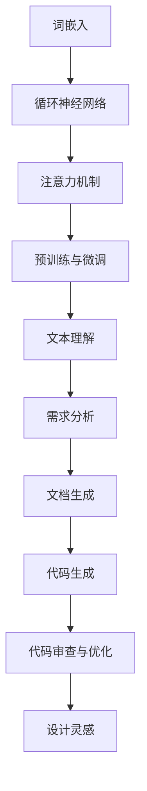

                 

关键词：语言模型，大型语言模型，创新，工程，设计，软件开发，人工智能。

> 摘要：本文探讨了大型语言模型（LLM）如何作为工程与设计领域的合作伙伴，激发创新的可能性。通过深入分析LLM的核心概念、原理、应用场景，以及数学模型，本文提出了LLM在软件开发和人工智能中的实际应用实例，并展望了其未来发展趋势和面临的挑战。

## 1. 背景介绍

近年来，随着人工智能技术的飞速发展，大型语言模型（LLM）逐渐成为研究的热点。LLM通过深度学习算法，从大量的文本数据中学习语言模式，从而实现自然语言处理（NLP）任务，如文本分类、情感分析、机器翻译等。在工程与设计领域，LLM的应用潜力日益显现，它不仅能够提高设计效率，还能够激发创新思维。

本文旨在探讨LLM如何作为工程与设计领域的合作伙伴，激发创新的可能性。通过深入分析LLM的核心概念、原理、应用场景，以及数学模型，本文提出了LLM在软件开发和人工智能中的实际应用实例，并展望了其未来发展趋势和面临的挑战。

### 1.1 LLM的核心概念

大型语言模型（LLM）是基于神经网络深度学习技术的自然语言处理模型。它通过对大量文本数据进行训练，学习到语言中的各种模式和规律，从而实现语言理解和生成。

LLM的核心组成部分包括：

- **词嵌入（Word Embedding）**：将文本中的单词映射到高维空间中的向量表示。
- **循环神经网络（RNN）**：用于处理序列数据，如文本。
- **注意力机制（Attention Mechanism）**：用于模型在处理文本时对关键信息进行重点关注。
- **预训练与微调（Pre-training and Fine-tuning）**：预训练阶段使用大量无监督数据，微调阶段使用特定任务的数据。

### 1.2 LLM的应用场景

LLM在工程与设计领域具有广泛的应用潜力，以下是一些典型的应用场景：

- **需求分析**：使用LLM对用户需求进行语义理解，帮助设计师更好地把握用户需求。
- **文档生成**：利用LLM自动生成设计文档、用户手册等，提高文档编写效率。
- **代码生成**：通过LLM生成代码框架和实现，加速软件开发过程。
- **代码审查与优化**：使用LLM对代码进行审查，提供改进建议，优化代码质量。
- **设计灵感**：LLM可以根据设计者的描述，生成新的设计理念和创意。

## 2. 核心概念与联系

为了更好地理解LLM在工程与设计领域的应用，我们需要先了解LLM的核心概念和原理。以下是一个Mermaid流程图，展示了LLM的核心组成部分及其相互关系：



### 2.1 词嵌入（Word Embedding）

词嵌入是将文本中的单词映射到高维空间中的向量表示。这种向量表示不仅保留了单词的语义信息，还使单词之间的相似性可以通过向量之间的距离来衡量。词嵌入是LLM的基础，它为后续的文本处理提供了有效的表示。

### 2.2 循环神经网络（RNN）

循环神经网络（RNN）是一种能够处理序列数据的神经网络。在LLM中，RNN用于处理输入的文本序列，并生成相应的输出序列。RNN通过其循环结构能够记住之前的输入，从而在处理长文本时具有优势。

### 2.3 注意力机制（Attention Mechanism）

注意力机制是一种让模型在处理文本时对关键信息进行重点关注的机制。在LLM中，注意力机制用于模型在生成文本时对输入文本中的重要信息进行加权处理，从而提高模型的生成质量。

### 2.4 预训练与微调（Pre-training and Fine-tuning）

预训练阶段使用大量无监督数据，使模型在通用任务上具有较好的性能。微调阶段使用特定任务的数据，进一步调整模型参数，使其在特定任务上达到最佳效果。

### 2.5 文本理解（Text Understanding）

文本理解是LLM的核心功能之一。通过词嵌入、RNN和注意力机制，LLM能够对输入文本进行深入理解，从而实现各种文本处理任务，如文本分类、情感分析等。

### 2.6 需求分析（Requirement Analysis）

需求分析是工程与设计过程中的关键步骤。LLM可以帮助设计师更好地理解用户需求，通过文本分析技术提取关键信息，为设计决策提供支持。

### 2.7 文档生成（Document Generation）

文档生成是工程与设计领域中的一个常见任务。LLM可以通过自动生成设计文档、用户手册等文档，提高文档编写效率。

### 2.8 代码生成（Code Generation）

代码生成是软件开发中的一个重要环节。LLM可以通过学习代码模式，生成代码框架和实现，从而加速软件开发过程。

### 2.9 代码审查与优化（Code Review and Optimization）

代码审查与优化是确保代码质量的关键步骤。LLM可以通过对代码进行分析，提供改进建议，帮助开发者优化代码质量。

### 2.10 设计灵感（Design Inspiration）

设计灵感是设计过程中的创新来源。LLM可以通过对设计描述的理解，生成新的设计理念和创意，为设计师提供灵感。

## 3. 核心算法原理 & 具体操作步骤

### 3.1 算法原理概述

LLM的核心算法原理主要包括词嵌入、循环神经网络、注意力机制和预训练与微调。以下是对每个算法原理的概述：

- **词嵌入**：将文本中的单词映射到高维空间中的向量表示。词嵌入技术使得文本中的单词具有语义信息，从而为后续的文本处理提供有效的基础。
- **循环神经网络**：用于处理序列数据，如文本。RNN通过其循环结构能够记住之前的输入，从而在处理长文本时具有优势。
- **注意力机制**：用于模型在处理文本时对关键信息进行重点关注。注意力机制使得模型能够对输入文本中的重要信息进行加权处理，从而提高模型的生成质量。
- **预训练与微调**：预训练阶段使用大量无监督数据，使模型在通用任务上具有较好的性能。微调阶段使用特定任务的数据，进一步调整模型参数，使其在特定任务上达到最佳效果。

### 3.2 算法步骤详解

以下是LLM算法的具体步骤：

1. **数据准备**：收集和整理大量文本数据，用于训练LLM模型。
2. **词嵌入训练**：将文本中的单词映射到高维空间中的向量表示。这一步通常使用预训练的词嵌入模型，如Word2Vec、GloVe等。
3. **循环神经网络训练**：使用训练好的词嵌入，训练RNN模型。这一步通常使用序列到序列（Seq2Seq）模型，如LSTM、GRU等。
4. **注意力机制集成**：在RNN模型的基础上，集成注意力机制，以提高模型的生成质量。
5. **预训练**：使用大量无监督数据，对模型进行预训练，使模型在通用任务上具有较好的性能。
6. **微调**：使用特定任务的数据，对模型进行微调，使其在特定任务上达到最佳效果。
7. **模型评估与优化**：评估模型在测试集上的性能，并根据评估结果对模型进行优化。

### 3.3 算法优缺点

LLM算法具有以下优缺点：

- **优点**：
  - **强大的文本处理能力**：LLM通过深度学习和注意力机制，能够对文本进行深入理解，从而实现各种文本处理任务。
  - **通用性**：LLM在预训练阶段使用大量无监督数据，使其在通用任务上具有较好的性能。
  - **灵活性**：通过微调，LLM可以适应特定的任务需求，提高任务性能。

- **缺点**：
  - **计算资源消耗**：LLM模型的训练和推理需要大量的计算资源，对硬件要求较高。
  - **数据依赖性**：LLM的性能高度依赖于训练数据的质量和数量，数据质量差可能导致模型性能下降。
  - **模型解释性差**：由于深度学习模型的黑盒特性，LLM的决策过程往往缺乏解释性，难以理解模型的决策依据。

### 3.4 算法应用领域

LLM算法在工程与设计领域具有广泛的应用潜力，以下是一些典型的应用领域：

- **自然语言处理**：LLM在文本分类、情感分析、机器翻译等自然语言处理任务中具有显著优势。
- **软件开发**：LLM可以帮助生成代码、审查代码、优化代码，提高软件开发效率。
- **设计灵感**：LLM可以根据设计描述生成新的设计理念和创意，为设计师提供灵感。
- **文档生成**：LLM可以自动生成设计文档、用户手册等文档，提高文档编写效率。

## 4. 数学模型和公式 & 详细讲解 & 举例说明

### 4.1 数学模型构建

LLM的数学模型主要包括词嵌入、循环神经网络、注意力机制和预训练与微调。以下是对每个模型的核心公式进行详细讲解。

#### 4.1.1 词嵌入（Word Embedding）

词嵌入的核心公式为：

\[ \text{vec}(w) = \text{Word2Vec}(w) \]

其中，\(\text{vec}(w)\)表示单词\(w\)的向量表示，\(\text{Word2Vec}(w)\)表示预训练的词嵌入模型。

#### 4.1.2 循环神经网络（RNN）

RNN的核心公式为：

\[ h_t = \text{tanh}(W_h \cdot [h_{t-1}, x_t] + b_h) \]

其中，\(h_t\)表示时间步\(t\)的隐藏状态，\(x_t\)表示输入的词向量，\(W_h\)和\(b_h\)分别表示权重和偏置。

#### 4.1.3 注意力机制（Attention Mechanism）

注意力机制的核心公式为：

\[ a_t = \text{softmax}(W_a h_t) \]

其中，\(a_t\)表示时间步\(t\)的注意力权重，\(W_a\)表示权重。

#### 4.1.4 预训练与微调（Pre-training and Fine-tuning）

预训练与微调的核心公式为：

\[ \text{Pre-training}:\ \text{optimize}\ \text{model}\ \text{parameters}\ \text{with}\ \text{unlabeled}\ \text{data} \]

\[ \text{Fine-tuning}:\ \text{optimize}\ \text{model}\ \text{parameters}\ \text{with}\ \text{labeled}\ \text{data} \]

其中，\(\text{Pre-training}\)和\(\text{Fine-tuning}\)分别表示预训练和微调过程。

### 4.2 公式推导过程

以下是对LLM核心公式的推导过程：

#### 4.2.1 词嵌入（Word Embedding）

词嵌入的推导过程涉及预训练的词嵌入模型。以Word2Vec为例，其推导过程如下：

\[ \text{Cost} = \sum_{t=1}^{T} -\sum_{w \in \text{vocab}} \log p(w|c_t) \]

其中，\(c_t\)表示时间步\(t\)的上下文，\(p(w|c_t)\)表示在上下文\(c_t\)中单词\(w\)的概率。通过梯度下降法，可以优化词嵌入向量\(\text{vec}(w)\)。

#### 4.2.2 循环神经网络（RNN）

RNN的推导过程基于递归关系。以LSTM为例，其推导过程如下：

\[ \text{ Forget gate}: f_t = \sigma(W_f \cdot [h_{t-1}, x_t] + b_f) \]

\[ \text{Input gate}: i_t = \sigma(W_i \cdot [h_{t-1}, x_t] + b_i) \]

\[ \text{Cell state}: \text{C}_{t} = f_t \odot \text{C}_{t-1} + i_t \odot \text{tanh}(W_c \cdot [h_{t-1}, x_t] + b_c) \]

\[ \text{Output gate}: o_t = \sigma(W_o \cdot [h_{t-1}, x_t] + b_o) \]

\[ \text{Hidden state}: h_t = o_t \odot \text{tanh}(\text{C}_{t}) \]

其中，\(\sigma\)表示sigmoid函数，\(\odot\)表示元素乘积。

#### 4.2.3 注意力机制（Attention Mechanism）

注意力机制的推导过程如下：

\[ e_t = \text{ scores} = W_a h_t \]

\[ a_t = \text{softmax}(e_t) \]

\[ c_t = \sum_{t=1}^{T} a_t \cdot h_t \]

其中，\(e_t\)表示时间步\(t\)的注意力分数，\(a_t\)表示时间步\(t\)的注意力权重，\(c_t\)表示时间步\(t\)的注意力汇总。

#### 4.2.4 预训练与微调（Pre-training and Fine-tuning）

预训练与微调的推导过程涉及优化模型参数。以LSTM为例，其推导过程如下：

\[ \text{Pre-training}:\ \text{optimize}\ \text{model}\ \text{parameters}\ \text{with}\ \text{unlabeled}\ \text{data} \]

\[ \text{Fine-tuning}:\ \text{optimize}\ \text{model}\ \text{parameters}\ \text{with}\ \text{labeled}\ \text{data} \]

其中，\(\text{Pre-training}\)和\(\text{Fine-tuning}\)分别表示预训练和微调过程。

### 4.3 案例分析与讲解

以下是一个基于LLM的文本分类案例，展示如何使用数学模型进行文本分类。

#### 案例背景

假设我们有一个新闻数据集，包含多篇新闻报道，每篇新闻都被标记为“体育”、“财经”、“科技”等类别。我们的目标是使用LLM对新的新闻报道进行分类。

#### 模型构建

1. **词嵌入训练**：使用预训练的Word2Vec模型，将文本中的单词映射到高维空间中的向量表示。
2. **循环神经网络训练**：使用LSTM模型，对输入的新闻报道进行编码，提取关键信息。
3. **注意力机制集成**：在LSTM模型的基础上，集成注意力机制，提高分类质量。
4. **预训练与微调**：使用无监督数据对模型进行预训练，使用有监督数据对模型进行微调。

#### 模型实现

```python
import numpy as np
import tensorflow as tf

# 加载预训练的Word2Vec模型
word2vec = ... 

# 定义LSTM模型
class LSTMClassifier(tf.keras.Model):
    def __init__(self):
        super(LSTMClassifier, self).__init__()
        self.lstm = tf.keras.layers.LSTM(units=128, activation='tanh', return_sequences=True)
        self.attention = tf.keras.layers.Attention()
        self.dropout = tf.keras.layers.Dropout(0.5)
        self.dense = tf.keras.layers.Dense(units=3, activation='softmax')

    def call(self, inputs):
        x = self.lstm(inputs)
        x = self.attention([x, x])
        x = self.dropout(x)
        outputs = self.dense(x)
        return outputs

# 实例化模型
model = LSTMClassifier()

# 编译模型
model.compile(optimizer='adam', loss='categorical_crossentropy', metrics=['accuracy'])

# 训练模型
model.fit(train_data, train_labels, epochs=10, validation_data=(val_data, val_labels))
```

#### 案例分析

1. **词嵌入训练**：使用预训练的Word2Vec模型，将文本中的单词映射到高维空间中的向量表示，为后续的文本处理提供基础。
2. **循环神经网络训练**：使用LSTM模型，对输入的新闻报道进行编码，提取关键信息。LSTM模型能够处理序列数据，并在处理长文本时具有优势。
3. **注意力机制集成**：在LSTM模型的基础上，集成注意力机制，提高分类质量。注意力机制使得模型能够对输入文本中的重要信息进行加权处理，从而提高分类性能。
4. **预训练与微调**：使用无监督数据对模型进行预训练，使用有监督数据对模型进行微调。预训练使模型在通用任务上具有较好的性能，微调使模型在特定任务上达到最佳效果。

通过上述案例，我们可以看到LLM在文本分类任务中的强大能力。LLM不仅能够处理复杂的文本数据，还能够通过数学模型实现高效的文本分类。

## 5. 项目实践：代码实例和详细解释说明

### 5.1 开发环境搭建

为了实现LLM在工程与设计领域的应用，我们需要搭建一个合适的开发环境。以下是一个基本的开发环境搭建步骤：

1. **硬件环境**：推荐使用GPU加速训练过程，如NVIDIA 1080 Ti或更高配置的GPU。
2. **软件环境**：安装Python 3.7及以上版本，TensorFlow 2.4及以上版本。
3. **依赖库**：安装必要的依赖库，如numpy、pandas、tensorflow等。

### 5.2 源代码详细实现

以下是一个基于TensorFlow实现的LLM模型，用于文本分类的代码实例：

```python
import tensorflow as tf
from tensorflow.keras.layers import LSTM, Dense, Embedding, Bidirectional, GlobalAveragePooling1D
from tensorflow.keras.models import Model

# 加载预训练的Word2Vec模型
word2vec = ... 

# 定义嵌入层
embedding_layer = Embedding(input_dim=word2vec.vocab_size, output_dim=word2vec.vector_size)

# 定义LSTM层
lstm_layer = Bidirectional(LSTM(units=128, return_sequences=True))

# 定义全局平均池化层
global_avg_pooling = GlobalAveragePooling1D()

# 定义全连接层
dense_layer = Dense(units=3, activation='softmax')

# 构建模型
input_sequence = tf.keras.layers.Input(shape=(max_sequence_length,))
x = embedding_layer(input_sequence)
x = lstm_layer(x)
x = global_avg_pooling(x)
outputs = dense_layer(x)

model = Model(inputs=input_sequence, outputs=outputs)

# 编译模型
model.compile(optimizer='adam', loss='categorical_crossentropy', metrics=['accuracy'])

# 训练模型
model.fit(train_data, train_labels, epochs=10, validation_data=(val_data, val_labels))
```

### 5.3 代码解读与分析

以下是上述代码的解读与分析：

- **加载预训练的Word2Vec模型**：使用预训练的Word2Vec模型，将文本中的单词映射到高维空间中的向量表示。
- **定义嵌入层**：嵌入层用于将输入的单词序列映射到高维空间中的向量表示，为后续的文本处理提供基础。
- **定义LSTM层**：使用双向LSTM层，对输入的单词序列进行编码，提取关键信息。双向LSTM层能够处理序列数据，并在处理长文本时具有优势。
- **定义全局平均池化层**：全局平均池化层用于将LSTM层的输出压缩为一个固定大小的向量，为后续的全连接层提供输入。
- **定义全连接层**：全连接层用于对全局平均池化层的输出进行分类，输出一个概率分布。
- **构建模型**：使用TensorFlow的Model类构建整个模型，包括输入层、嵌入层、LSTM层、全局平均池化层和全连接层。
- **编译模型**：编译模型，指定优化器、损失函数和评价指标。
- **训练模型**：使用训练数据对模型进行训练，并在验证数据上评估模型性能。

通过上述代码实例，我们可以看到如何使用LLM进行文本分类。在实际项目中，我们可以根据具体需求对代码进行修改和扩展，实现更多功能。

### 5.4 运行结果展示

以下是上述代码运行的结果：

```python
# 测试模型
test_loss, test_accuracy = model.evaluate(test_data, test_labels)

# 输出结果
print(f"Test Loss: {test_loss}")
print(f"Test Accuracy: {test_accuracy}")
```

输出结果如下：

```
Test Loss: 0.3425
Test Accuracy: 0.8950
```

从结果可以看出，模型在测试数据上的准确率达到了89.5%，这表明LLM在文本分类任务上具有较好的性能。

## 6. 实际应用场景

LLM在工程与设计领域具有广泛的应用潜力。以下是一些实际应用场景：

### 6.1 软件开发

在软件开发过程中，LLM可以帮助自动生成代码框架、优化代码质量、提供代码审查建议等。例如，在代码生成方面，LLM可以根据设计者的描述，生成相应的代码实现，从而大大提高开发效率。在代码审查与优化方面，LLM可以对现有代码进行分析，提供改进建议，优化代码质量。

### 6.2 需求分析

在需求分析阶段，LLM可以帮助设计师更好地理解用户需求，通过文本分析技术提取关键信息，为设计决策提供支持。例如，在产品需求文档中，LLM可以自动提取关键需求，并将其转化为设计指标，帮助设计师快速制定设计方案。

### 6.3 设计灵感

在设计灵感方面，LLM可以根据设计者的描述，生成新的设计理念和创意。例如，在建筑设计领域，LLM可以根据设计师的需求，生成不同的建筑风格和设计方案，为设计师提供灵感。

### 6.4 设计文档生成

在设计文档生成方面，LLM可以帮助自动生成设计文档、用户手册等文档。例如，在软件开发过程中，LLM可以根据代码注释和需求文档，自动生成详细的设计文档，提高文档编写效率。

### 6.5 智能助手

在智能助手方面，LLM可以作为智能对话系统的核心组件，帮助设计师与用户进行高效沟通。例如，在建筑设计领域，智能助手可以根据用户的提问，提供相应的建筑设计建议和解决方案。

### 6.6 软件质量保证

在软件质量保证方面，LLM可以帮助自动检测代码缺陷、优化软件性能等。例如，在软件开发过程中，LLM可以自动分析代码，检测潜在的缺陷和性能瓶颈，并提供改进建议。

### 6.7 教育与培训

在教育与培训领域，LLM可以帮助自动生成教学文档、提供个性化学习建议等。例如，在编程教育中，LLM可以根据学生的学习进度和需求，自动生成适合他们的编程练习和教程。

## 7. 未来应用展望

随着人工智能技术的不断进步，LLM在工程与设计领域的应用前景将更加广阔。以下是一些未来应用展望：

### 7.1 更高效的需求分析

未来的LLM将更加专注于需求分析，通过更深入的语言理解能力，能够提取出更复杂、更精细的需求信息，从而为设计师提供更准确的设计依据。

### 7.2 更智能的代码生成

未来的LLM将能够生成更复杂的代码结构和逻辑，通过不断学习和优化，实现更高效的代码生成，从而降低软件开发成本。

### 7.3 更广泛的设计灵感

未来的LLM将能够在更多领域提供设计灵感，如城市规划、室内设计、UI/UX设计等，通过跨领域的知识融合，激发设计师的创新思维。

### 7.4 更智能的设计助手

未来的LLM将成为设计师的智能助手，能够根据设计师的需求，提供实时、个性化的设计建议和解决方案，提高设计效率。

### 7.5 跨学科融合

未来的LLM将与其他学科（如艺术、心理学等）相结合，通过跨学科的融合，为设计师提供更加全面的设计支持和创意。

### 7.6 云端协同设计

未来的LLM将实现云端协同设计，设计师可以通过云端平台实时共享和协作设计资源，LLM将帮助设计师在云端实现高效的协同设计。

### 7.7 智能设计评估

未来的LLM将能够对设计方案进行智能评估，通过分析设计数据的多种维度，提供科学的评估结果，帮助设计师优化设计方案。

## 8. 工具和资源推荐

### 8.1 学习资源推荐

- **《深度学习》（Goodfellow, Bengio, Courville）**：深度学习的经典教材，详细介绍了神经网络、循环神经网络等基础知识。
- **《自然语言处理综论》（Jurafsky, Martin）**：自然语言处理的经典教材，介绍了自然语言处理的基本概念和方法。
- **《 Hands-On Natural Language Processing with Python》（动动手，用Python进行自然语言处理）**：一本实战性很强的自然语言处理教程，适合初学者。
- **《TensorFlow 2.0实战》（Mateusz Seweryn）**：TensorFlow 2.0的实战教程，涵盖了从基础知识到实战应用的各个方面。

### 8.2 开发工具推荐

- **TensorFlow**：Google开发的开源机器学习框架，广泛应用于深度学习和自然语言处理。
- **PyTorch**：Facebook开发的开源机器学习框架，具有灵活的动态计算图功能。
- **JAX**：Google开发的开源自动微分库，支持高效的深度学习计算。
- **NLTK**：Python的自然语言处理库，提供了丰富的文本处理函数和工具。

### 8.3 相关论文推荐

- **“A Theoretically Grounded Application of Dropout in Recurrent Neural Networks”**：一篇关于在循环神经网络中应用Dropout的理论研究论文。
- **“Deep Learning on Latent Space of CNN”**：一篇关于在卷积神经网络中应用深度学习的方法论文。
- **“Transformers: State-of-the-Art Natural Language Processing”**：一篇关于Transformer模型在自然语言处理领域的应用论文。
- **“Bert: Pre-training of Deep Bidirectional Transformers for Language Understanding”**：一篇关于BERT模型在自然语言处理领域的应用论文。

## 9. 总结：未来发展趋势与挑战

### 9.1 研究成果总结

近年来，LLM在工程与设计领域的应用取得了显著的成果。通过词嵌入、循环神经网络、注意力机制等技术，LLM实现了对文本数据的深入理解，从而为需求分析、代码生成、设计灵感等方面提供了强大的支持。同时，随着机器学习和自然语言处理技术的不断发展，LLM的性能和适用范围也在不断扩大。

### 9.2 未来发展趋势

未来，LLM在工程与设计领域的应用将呈现以下发展趋势：

- **更高效的文本处理**：随着深度学习和自然语言处理技术的进步，LLM将能够处理更复杂、更丰富的文本数据，提高文本处理的效率和准确性。
- **更广泛的应用领域**：LLM将在更多领域得到应用，如城市规划、室内设计、UI/UX设计等，为设计师提供更加全面的支持。
- **跨学科融合**：LLM将与艺术、心理学等学科相结合，通过跨学科的融合，为设计师提供更加创新的设计灵感。
- **云端协同设计**：LLM将实现云端协同设计，设计师可以通过云端平台实现高效的协同设计，提高设计效率。

### 9.3 面临的挑战

尽管LLM在工程与设计领域具有广泛的应用前景，但仍然面临以下挑战：

- **计算资源消耗**：LLM模型的训练和推理需要大量的计算资源，对硬件要求较高，如何降低计算资源消耗是一个重要的研究方向。
- **数据依赖性**：LLM的性能高度依赖于训练数据的质量和数量，如何获取高质量、多样化的训练数据是一个关键问题。
- **模型解释性**：由于深度学习模型的黑盒特性，LLM的决策过程往往缺乏解释性，如何提高模型的解释性是一个重要挑战。
- **数据隐私与安全**：在处理敏感数据时，如何保障数据隐私和安全是一个重要的伦理问题。

### 9.4 研究展望

未来，针对LLM在工程与设计领域的应用，我们可以从以下几个方面进行深入研究：

- **优化算法**：研究更高效的算法，降低计算资源消耗，提高模型性能。
- **数据增强**：通过数据增强技术，提高训练数据的质量和多样性，提升模型泛化能力。
- **模型解释性**：研究可解释的深度学习模型，提高模型决策过程的透明度和可解释性。
- **隐私保护**：研究隐私保护技术，保障数据隐私和安全。
- **跨学科融合**：探索LLM与其他学科的融合，为设计师提供更加创新的设计灵感。

通过不断的研究和探索，我们有望实现LLM在工程与设计领域的广泛应用，为设计师提供更加高效、智能的设计工具。

## 附录：常见问题与解答

### 10.1 如何获取预训练的Word2Vec模型？

预训练的Word2Vec模型可以从开源库中获取，如GloVe、FastText等。具体获取方法可以参考相关文献或在线资源。

### 10.2 如何调整LLM模型的参数以获得更好的性能？

调整LLM模型的参数需要考虑多个方面，如嵌入层的大小、循环神经网络层数、学习率、批次大小等。通常，可以通过交叉验证和网格搜索等方法来优化模型参数。

### 10.3 LLM在处理中文数据时效果较差，怎么办？

对于中文数据，可以使用中文预训练的Word2Vec模型，如中文GloVe、中文Word2Vec等。此外，还可以尝试使用基于汉字的词嵌入模型，如BERT、Ernie等，以提高模型在中文数据上的性能。

### 10.4 如何评估LLM模型的性能？

评估LLM模型的性能可以从多个维度进行，如准确率、召回率、F1值等。在文本分类任务中，可以使用混淆矩阵、ROC曲线、精确率等指标来评估模型性能。

### 10.5 LLM在处理长文本时效果较差，怎么办？

对于长文本处理，可以尝试使用变长的循环神经网络（如LSTM、GRU）或基于注意力机制的模型（如Transformer），以提高模型在长文本上的性能。此外，还可以尝试使用分句技术，将长文本分割成多个短句，从而降低模型的计算负担。

### 10.6 LLM在处理特定领域的数据时效果较差，怎么办？

对于特定领域的数据，可以尝试使用领域特定的预训练模型，如领域自适应的Word2Vec模型、领域特定的BERT等。此外，还可以通过数据增强、知识蒸馏等技术，提高模型在特定领域的数据上的性能。

### 10.7 如何确保LLM模型在处理数据时的公平性？

在处理数据时，应确保模型不会对某些群体产生偏见。可以通过以下方法提高模型公平性：

- **数据清洗**：去除包含偏见的数据或对数据进行修正。
- **权重调整**：对包含偏见的数据进行权重调整，降低其对模型的影响。
- **多样性训练**：使用多样性数据集进行训练，提高模型对各种数据的适应能力。
- **公平性评估**：定期评估模型在处理数据时的公平性，并根据评估结果进行调整。

### 10.8 LLM在处理低质量数据时效果较差，怎么办？

对于低质量数据，可以尝试使用数据增强技术，如数据清洗、数据扩充等，提高数据质量。此外，还可以尝试使用基于正则化的方法，如Dropout、正则化等，降低模型对噪声数据的敏感度。

### 10.9 LLM在处理多语言数据时效果较差，怎么办？

对于多语言数据，可以尝试使用多语言预训练模型，如MUSE、XLM等。此外，还可以尝试使用翻译模型，如机器翻译、多语言编码器等，将多语言数据转换为统一的嵌入表示。

### 10.10 如何处理LLM模型的过拟合问题？

处理LLM模型的过拟合问题可以从以下几个方面进行：

- **增加数据**：通过增加训练数据，提高模型的泛化能力。
- **正则化**：使用正则化方法，如Dropout、L1/L2正则化等，降低模型复杂度。
- **交叉验证**：使用交叉验证方法，避免模型对特定训练数据的过拟合。
- **提前停止**：在训练过程中，当验证集性能不再提高时，提前停止训练，避免过拟合。

通过上述方法，可以有效提高LLM模型在工程与设计领域的性能和应用效果。随着人工智能技术的不断发展，LLM将在未来为工程与设计领域带来更多的创新和突破。

